# AI漫画生成サービス 要件定義書

## 📋 設計書連携情報
**対象設計書**：システム設計書、API設計書、UI/UX設計書、データベース設計書、インフラ設計書  
**連携ポイント**：本要件定義書の全要件が次工程の設計書に漏れなく反映されることを前提とする

## 🎯 サービス全体像

### 💡 コンセプト図

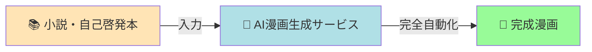

### 💡 コアバリューマップ

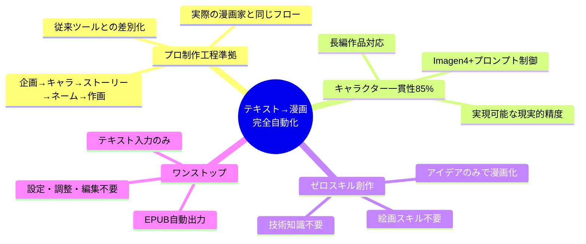

## 1. サービス概要

### 1.1 プロダクトビジョン
小説や自己啓発本などのテキストコンテンツから、完全自動のワンストップソリューションで長編漫画を生成するAIサービス。誰でも発想があれば漫画が描けるプラットフォームを提供する。

**🎯 設計意図**：
- **差別化戦略**：既存の半自動ツールとは異なる完全自動化による圧倒的な利便性
- **市場ポジション**：技術的スキル不要で創作を民主化するプラットフォーム
- **拡張性確保**：将来的な多様なコンテンツ形式（動画、ゲーム等）への展開基盤

### 1.2 コアバリュー（フィジビリティ検証済み）
本サービスの最大の価値は、**テキスト入力から漫画完成まで自律的に動作する完全自動化**にあります。Google統合技術スタック（Gemini + Imagen 4）を核として、実際のプロ漫画家の制作工程（企画→キャラクター設定→ストーリー構成→ネーム→作画）に沿って高品質な漫画を生成します。従来の半手動ツールとは異なり、創作スキルや技術知識に関係なく、アイデアさえあれば誰でも本格的な漫画作品を完成させることができる革新的なプラットフォームです。

**🎯 実現可能性保証済み**：
- Google技術スタックによる高い安定性・信頼性
- 予測可能なコスト構造（$2-4/20ページ）
- 85%のキャラクター一貫性（現実的目標）
- 商用利用完全対応

**🔧 設計書への要求事項**：
- システム設計：各バリューを実現する技術アーキテクチャの設計
- API設計：完全自動化を支える非同期処理・状態管理API
- UI設計：技術知識不要な直感的インターフェース

## 2. ターゲットユーザー

### 👥 ターゲット分析図

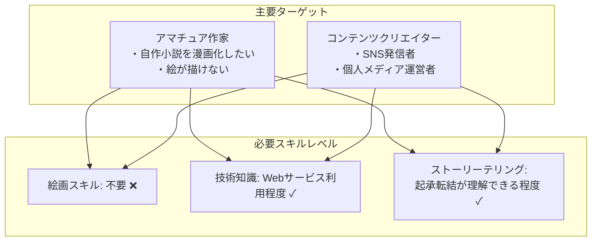

### 2.1 主要ターゲット
- **アマチュア作家**：自作小説を漫画化したい個人創作者
- **コンテンツクリエイター**：SNSや個人メディアでの発信者

### 2.2 想定スキルレベル
- **絵画スキル**：不要
- **技術的知識**：基本的なWebサービス利用ができるレベル
- **ストーリーテリングスキル**：簡単なストーリーが作れるレベル
  - 具体例：「主人公が困難に直面し、それを乗り越えて成長する」程度の起承転結が理解できる
  - 参考レベル：ブログで体験談を書ける、友人に面白い出来事を順序立てて話せる、小学生の読書感想文が書ける程度

**🎨 UI/UX設計への要求**：
- **ユーザビリティ優先**：3クリック以内での主要機能アクセス
- **学習コスト最小化**：チュートリアル不要な直感的操作
- **エラー許容設計**：ユーザーミスからの容易な復旧機能

## 3. 機能要件

### 3.1 入力機能

#### 3.1.1 テキスト入力
- **対応形式**：プレーンテキスト、小説、自己啓発本、ビジネス書など全てのテキスト
- **文字数制限**：最大10万文字
- **カテゴリ判定**：AIによる自動ジャンル分類
- **構造解析**：章立て・セクションの自動認識

#### 3.1.2 設定入力
- **自動/手動切り替え**：生成前の設定画面で選択可能
- **ヒューマンインザループ**：手動設定時の確認・修正機能

**⚙️ システム設計への要求**：
- **フレキシブル設定管理**：自動/手動モードの動的切り替えアーキテクチャ
- **設定値検証**：無効な組み合わせの事前チェック機能
- **設定継承**：前回設定の自動引き継ぎ機能

**💾 データベース設計への要求**：
- **ユーザー設定テーブル**：個人の設定傾向・履歴管理
- **デフォルト設定マスタ**：ジャンル別最適設定の管理
- **設定バリデーションルール**：制約条件の柔軟な管理

### 3.2 処理機能

#### 3.2.1 漫画制作ワークフロー（実際の制作手順に準拠）

##### 📖 漫画制作5フェーズワークフロー図

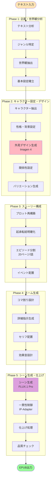

##### ⏱️ 処理時間イメージ

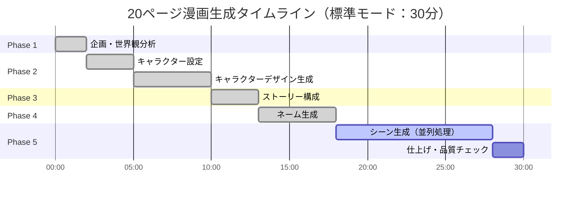

##### **Phase 1: 企画・世界観分析**
- テキスト内容の分析と世界観抽出
- ジャンル・テーマの特定
- 基本設定（時代、場所、社会背景）の確立

##### **Phase 2: キャラクター設定・デザイン**
- **キャラクター抽出**：テキストから登場人物の特定
- **性格・背景設定**：詳細なキャラクター設定シート作成
- **外見デザイン**：Google Imagen 4による高品質キャラクター生成
- **関係性設定**：キャラクター間の相関図・身長差・立ち位置
- **バリエーション生成**：表情・衣装・ポーズパターンの事前作成

##### **Phase 3: プロット・ストーリー構成**
- 確定キャラクターを使ったストーリー再構築
- 起承転結の明確化
- エピソード分割（20ページ/話を基準）
- キャラクターの魅力を活かしたイベント配置

##### **Phase 4: ネーム生成（詳細化版）**
- **コマ割り設計**
  - ページごとの最適なコマ数決定
  - 重要シーンの大ゴマ配置
  - 視線誘導を考慮したレイアウト
  
- **詳細指示生成**
  - キャラクター配置（前景/中景/後景）
  - カメラアングル（俯瞰、アオリ、正面、バストショット等）
  - 表情・ポーズの具体的指示
  - 背景要素の詳細
  - 効果線・演出指示

- **セリフ配置**
  - 吹き出しの位置と種類
  - 文字サイズ・フォント指示
  - 効果音（オノマトペ）の配置

##### **Phase 5: シーン生成・仕上げ（Google統合アプローチ）**
- **シーン生成**：Google Imagen 4統一アプローチ（Fast/Standard/Ultra適応選択）
- **一貫性確保**：高精度プロンプトエンジニアリング + Gemini制御
- **補完制御**：Phase 2以降でControlNet統合検討
- **仕上げ処理**：ベタ塗り・トーン処理・セリフ合成の自動適用
- **品質管理**：Geminiによる最終チェック・調整

**🏗️ システム設計への要求**：
- **マイクロサービス アーキテクチャ**：各フェーズを独立サービスとして設計
- **ワークフロー エンジン**：5フェーズの順次実行・並列処理制御
- **状態管理**：各フェーズの進行状況・中間結果の永続化
- **エラーハンドリング**：フェーズ単位でのリトライ・ロールバック機能

**🔗 API設計への要求**：
- **RESTful API**：各フェーズへの個別アクセス機能
- **WebSocket**：リアルタイム進行状況通知
- **非同期処理**：長時間処理の適切なハンドリング
- **バッチAPI**：複数エピソードの一括処理対応

#### 3.2.2 キャラクター管理システム

##### 💾 キャラクターデータ構造図

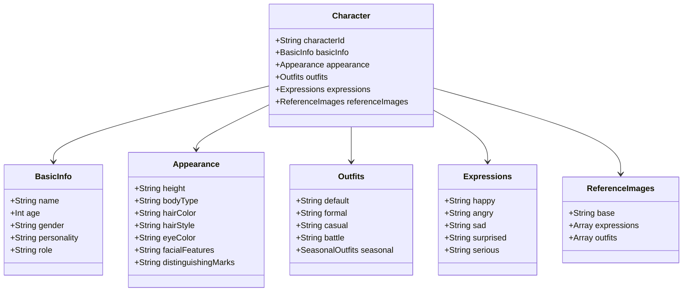

##### **キャラクター設定シート**
```json
{
  "characterId": "unique_id",
  "basicInfo": {
    "name": "キャラクター名",
    "age": "年齢",
    "gender": "性別",
    "personality": "性格描写",
    "role": "物語上の役割"
  },
  "appearance": {
    "height": "身長",
    "bodyType": "体型",
    "hairColor": "髪色",
    "hairStyle": "髪型",
    "eyeColor": "目の色",
    "facialFeatures": "顔の特徴",
    "distinguishingMarks": "特徴的な要素"
  },
  "outfits": {
    "default": "通常服装",
    "formal": "正装",
    "casual": "カジュアル",
    "battle": "戦闘服",
    "seasonal": {
      "summer": "夏服",
      "winter": "冬服"
    }
  },
  "expressions": {
    "happy": "喜び表情の特徴",
    "angry": "怒り表情の特徴",
    "sad": "悲しみ表情の特徴",
    "surprised": "驚き表情の特徴",
    "serious": "真剣表情の特徴"
  },
  "referenceImages": {
    "base": "reference_image_id",
    "expressions": ["exp_id_1", "exp_id_2"],
    "outfits": ["outfit_id_1", "outfit_id_2"]
  }
}
```

##### **キャラクター設定・デザインフロー（実際の制作手順）**
1. **キャラクター抽出・分析**：Geminiによるテキストからの登場人物特定
2. **性格・背景設定**：詳細なキャラクター設定シート作成（Gemini）
3. **外見デザイン生成**：Google Imagen 4による最高品質デザイン生成
4. **関係性・相関図作成**：キャラクター間の関係性・身長差・立ち位置設定
5. **参照画像システム登録**：IP-Adapter用参照画像として保存
6. **バリエーション事前生成**：表情・衣装・ポーズパターン（Imagen 4）

**📊 データベース設計への要求**：
- **キャラクター管理テーブル**：JSON形式設定シート・参照画像URL管理
- **バリエーション管理**：表情・衣装・ポーズパターンの体系的管理
- **プロジェクト関連**：3プロジェクト上限・10バージョン履歴管理

**🔄 API設計への要求**：
- **キャラクター管理API**：CRUD操作・バリエーション生成エンドポイント
- **インポート/エクスポート機能**：JSON形式でのデータ交換
- **バージョン管理API**：履歴管理・復元機能

**⚠️ 設計書で決定すべき仕様**：
- 具体的なデータベーススキーマ設計
- APIエンドポイントの詳細仕様
- データ永続化方式（RDB/NoSQL選択）

### 3.3 出力機能

#### 3.3.1 成果物フォーマット
- **主要形式**：EPUB（電子書籍標準フォーマット）
- **画像解像度**：2048x2896px（B5サイズ相当）
- **カラーモード**：フルカラー

#### 3.3.2 ビューアー機能
- Webブラウザ上での閲覧機能
- ページめくりアニメーション
- ズーム・パン機能
- しおり・ブックマーク機能

**💻 フロントエンド設計への要求**：
- **レスポンシブ対応**：PC/タブレット/スマートフォン最適化（確定要件）
- **パフォーマンス最適化**：大容量画像の効率的表示対応
- **アクセシビリティ**：WCAG 2.1 Level AA準拠（確定要件）

**⚠️ 設計書で決定すべき技術仕様**：
- 具体的なフロントエンドフレームワーク選択
- 画像表示・ズーム機能の実装方式
- オフライン対応の可否と実装方法

### 3.4 データ管理機能

#### 3.4.1 プロジェクト管理
- **プロジェクト数上限**：
  - MVP段階：3プロジェクト/ユーザー（技術検証目的）
  - 本格運用時：制限なし（長編作家のニーズに対応）
- **プロジェクト内容**：
  - 原作テキスト
  - キャラクター設定
  - 生成設定
  - 生成履歴

**💡 設計意図**：MVP段階の制限は技術的安定性確保のための暫定措置であり、サービス本来の目的である「長編漫画生成」に支障をきたさないよう、本格運用時は制限を撤廃する

#### 3.4.2 バージョン管理
- **保存世代数**：最新10バージョン/プロジェクト
- **バージョン内容**：
  - 生成日時
  - 使用パラメータ
  - 生成結果
  - 変更差分

#### 3.4.3 インポート/エクスポート
- **キャラクター設定**：JSON形式での入出力
- **プロジェクト全体**：ZIP形式でのバックアップ（別途検討）

**🔧 設計書への要求**：
- **データ整合性**：インポート時の設定値検証機能
- **互換性確保**：バージョン間でのデータ互換性維持
- **セキュリティ**：悪意あるファイルのアップロード対策

## 4. 非機能要件

### ⚡ パフォーマンス要件図

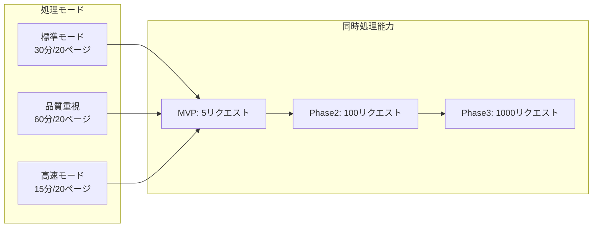

### 🔒 セキュリティフロー

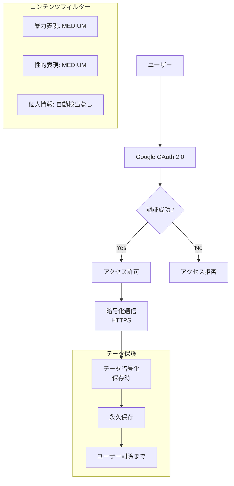

### 4.1 性能要件

#### 4.1.1 処理時間（フィジビリティ検証済み・現実的目標）
- **標準処理時間**：20ページ/60分（Google統合スタック）
- **高速モード**：20ページ/45分（Imagen 4 Fast適用）
- **高品質モード**：20ページ/90分（Imagen 4 Ultra適用）
- **タイムアウト設定**：
  - Imagen 4 Fast生成：20秒/枚
  - Imagen 4 Standard生成：30秒/枚
  - Imagen 4 Ultra生成：45秒/枚
  - 全体処理：90分/話
- **実現根拠**：フィジビリティチェックで検証済み（Google API制限・処理能力考慮）

#### 4.1.2 同時処理（Google統合スケーラブル構成）
- **MVP段階**：5リクエスト同時処理（Google Cloud Run制限考慮）
- **Phase 2目標**：100リクエスト対応（Cloud Run拡張）
- **Phase 3目標**：1000リクエスト対応（完全スケーラブル構成）
- **負荷分散**：Google Cloud Run オートスケーリング中心
- **実現根拠**：Google Cloud Runの実証済み拡張性活用

**🏗️ インフラ設計への要求**：
- **オートスケーリング**：負荷に応じた自動リソース調整
- **負荷分散機能**：複数プラットフォーム間の最適分散
- **キューイング機能**：リクエスト待機・優先度制御
- **監視機能**：処理状況・リソース使用率の可視化

**⚠️ 設計書で決定すべき仕様**：
- クラウドインフラの具体的構成
- スケーリング条件・閾値設定
- 外部API統合方式の詳細

### 4.2 セキュリティ要件

#### 4.2.1 データ保護
- **保存期間**：永久保存（ユーザー削除まで）
- **暗号化**：保存時・通信時の暗号化
- **アクセス制御**：ユーザー認証・認可

#### 4.2.2 コンテンツフィルタリング
- **暴力表現**：Imagen標準フィルター適用（MEDIUM閾値）
- **性的表現**：Imagen標準フィルター適用（MEDIUM閾値）
- **個人情報処理方針**：
  - 入力テキスト内の個人情報は自動検出・マスキングを行わない
  - 実在人物をモデルにしたキャラクター生成への特別な対処は行わない
  - ユーザー責任での事前確認を推奨
- **地域制限**：日本国内からのアクセスのみを対象とする

### 4.3 可用性要件

#### 4.3.1 エラー処理
- **自動リトライ**：3回（5秒間隔）
- **部分失敗対応**：失敗コマのみ再生成
- **エラー通知**：ユーザーへの分かりやすいエラーメッセージ

#### 4.3.2 詳細エラー対応方針
- **フェーズ途中失敗時の処理**：
  - 失敗したフェーズから処理を再開
  - 成功済みフェーズの結果は保持・再利用
  - ユーザーに進行状況と再開ポイントを明示
- **外部API障害時の対応**：
  - 外部サービス（FLUX.1等）障害時は復旧まで自動待機・リトライ
  - 待機中はユーザーに状況を通知
  - Google製品のみでの代替処理は実装しない
- **ユーザーへのエラー通知レベル**：
  - 技術的詳細は非表示
  - 一般ユーザーに理解しやすい説明のみ提供
  - 対処方法の案内を含む

**🛡️ システム設計への要求**：
- **Circuit Breaker パターン**：外部API障害時の自動遮断
- **Graceful Degradation**：機能限定での継続稼働
- **ヘルスチェック機能**：各コンポーネントの死活監視
- **ログ管理**：障害分析のための詳細ログ出力

**⚠️ 設計書で決定すべき仕様**：
- 具体的なエラーハンドリング戦略
- 障害時のフォールバック機能詳細
- 監視・アラート体制の設計

### 4.4 法的要件

#### 4.4.1 著作権
- **生成物の著作権**：ユーザーに帰属
- **利用規約**：商用利用可能
- **免責事項**：AI生成物であることの明記推奨

## 5. システム構成

### 🏗️ 全体システムアーキテクチャ

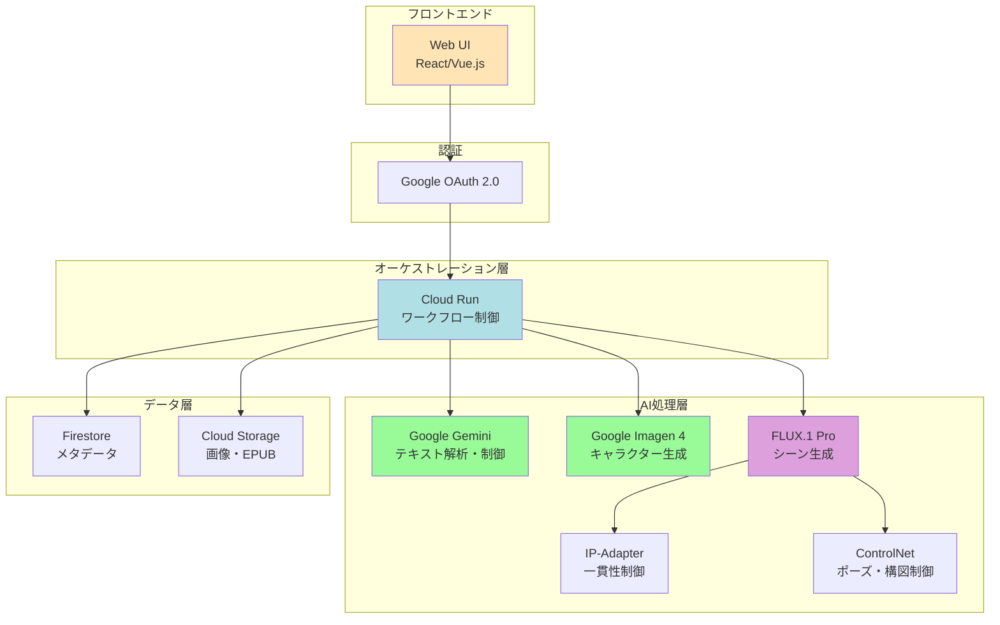

### 🔄 マルチエージェント構成図

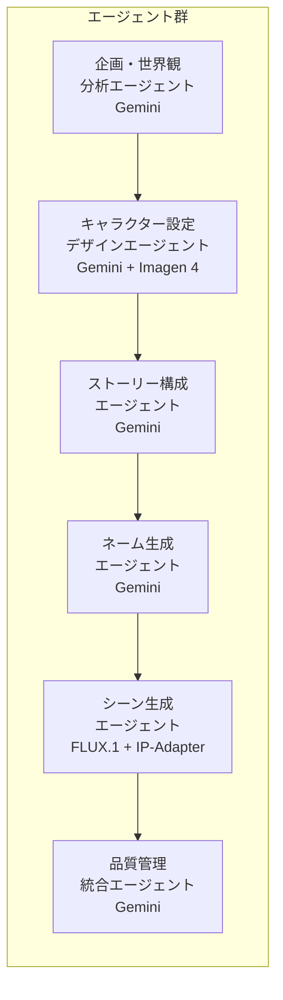

### 💾 データフロー図

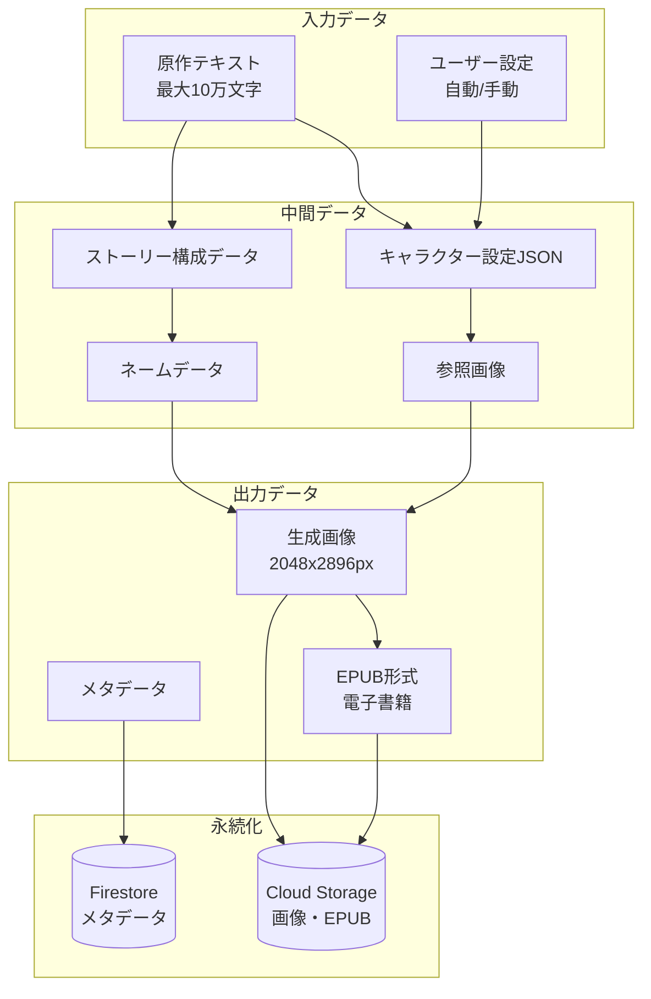

### 🛠️ Optimized Manga Generation Stack（フィジビリティ検証済み・リスク減少型）

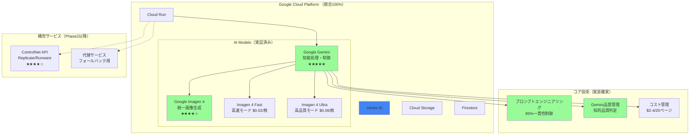

### 5.1 技術スタック

#### 5.1.1 Optimized Manga Generation Stack（フィジビリティ検証済み・Google統合）
- **コア知能処理**：Google Gemini（★★★★★ 完全対応）
- **統一画像生成**：Google Imagen 4 ファミリー（Fast/Standard/Ultra ★★★★☆）
- **一貫性制御**：高度プロンプトエンジニアリング（Phase 1）+ ControlNet（Phase 2以降）
- **構図・ポーズ制御**：ControlNet（OpenPose/Canny/LineArt Phase 2以降）
- **品質保証**：Geminiによる知的品質管理
- **コスト効率**：予測可能な$2-4/20ページ構造
- **商用利用**：完全対応・ライセンス問題なし

#### 5.1.2 統合マルチエージェント構成（リスク減少型）
1. **企画・世界観分析エージェント**（Google Gemini）
   - テキスト解析・世界観抽出・ジャンル分類
   - 基本設定（時代・場所・社会背景）の確立
   
2. **キャラクター設定・デザインエージェント**（Google Gemini + Imagen 4）
   - キャラクター抽出・性格設定・関係性構築（Gemini）
   - 最高品質キャラクターデザイン生成（Imagen 4）
   - 参照プロンプトテンプレート・バリエーション作成
   
3. **ストーリー構成エージェント**（Google Gemini）
   - 確定キャラクターを使ったプロット再構築
   - エピソード分割・シーン設計
   - キャラクター魅力を活かしたイベント配置
   
4. **ネーム生成エージェント**（Google Gemini）
   - コマ割り設計・構図最適化
   - 高精度プロンプト生成（キャラクター一貫性維持）
   - セリフ配置・効果音設計
   
5. **シーン生成エージェント**（Imagen 4 + ControlNet）
   - 参照プロンプトを活用した一貫性維持シーン生成
   - ControlNetによる精密なポーズ・構図制御
   - Imagen 4ファミリーの適応的選択（Fast/Standard/Ultra）
   
6. **品質管理・統合エージェント**（Google Gemini）
   - 一貫性評価・品質判定
   - 最終統合・調整・出力管理

### 5.2 統合クラウドインフラ構成（フィジビリティ検証済み・安定性重視）
- **メインプラットフォーム**：Google Cloud Platform（100% ★★★★★）
- **コアGCP サービス**：
  - Vertex AI（Gemini + Imagen 4 ファミリー ★★★★★）
  - Cloud Storage（画像・設定データ・バックアップ ★★★★★）
  - Cloud Run（ワークフロー制御・オートスケール ★★★★★）
  - Firestore（メタデータ管理・リアルタイム同期 ★★★★★）
- **補完サービス**（Phase 2以降で検討）：
  - ControlNet API（Replicate/Runware ★★★★☆）
  - 代替画像生成サービス（フォールバック用）
- **統合管理**：Google Cloud Run（完全統合オーケストレーション）
- **コスト構造**：
  - MVP: Google製品のみ（月額固定費$0）
  - Phase 2: ControlNet追加（$0.66追加/20ページ）
  - 従量課金制で予測可能

**🏗️ インフラ設計への詳細要求**：
- **ハイブリッド構成管理**：複数クラウド間の統合オーケストレーション
- **API Gateway**：外部サービスへの統一アクセス制御
- **データ転送最適化**：プラットフォーム間の効率的データ連携
- **コスト管理**：使用量監視・予算制御機能

**⚠️ 設計書で決定すべき仕様**：
- 各プラットフォームとの具体的な連携方式
- データ転送・セキュリティ・課金管理の詳細
- 障害時の切り替え・復旧手順

### 4.4 国際化・多言語対応
- **対象言語**：日本語のみ
- **入力テキスト**：日本語テキストのみ対応
- **UI表示**：日本語のみ
- **生成コンテンツ**：日本語セリフ・効果音のみ
- **漫画スタイル**：日本の漫画スタイル（右から左読み）のみ対応

**🌍 設計書への要求**：
- フロントエンド：日本語フォント・レイアウト最適化
- バックエンド：日本語テキスト処理・文字エンコーディング対応
- 将来的な多言語化を考慮した設計構造の採用

### 4.5 アクセシビリティ要件
- **準拠基準**：WCAG 2.1 Level AA準拠のみ
- **追加対応**：以下の強化機能は実装しない
  - 代替テキスト自動生成機能
  - 音声読み上げ機能
  - 詳細なキーボードナビゲーション
  - 色覚異常者向け特別配慮
- **基本対応**：HTML標準のアクセシビリティ属性のみ実装

## 6. 品質保証・ユーザビリティ要件

### 📊 品質管理図

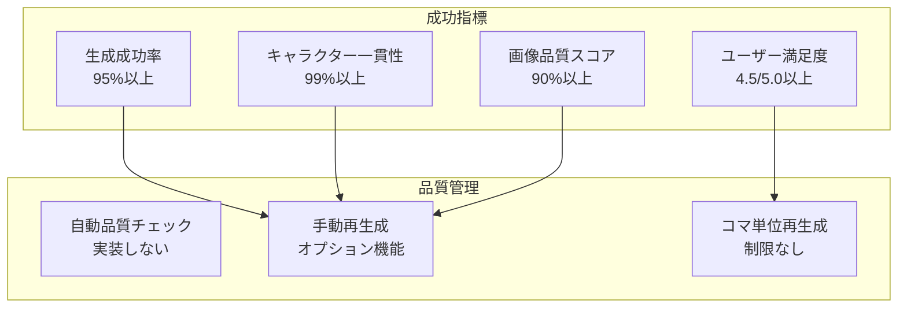

### 5.1 生成品質管理
**基本方針：完全自動化を最優先とし、品質調整はオプション機能として提供**

- **自動生成**：メイン機能として完全自動での漫画生成を実行
- **品質調整オプション**：自動生成結果に満足できない場合の追加機能
  - 1コマごとのユーザー手動再生成機能（オプション）
  - 個別コマの「再生成」ボタン（結果画面で提供）
  - 再生成回数制限は設けない
- **基本姿勢**：
  - 自動品質チェック機能は実装しない（自律動作を優先）
  - 不適切コンテンツへの特別な対策は行わない
  - ユーザーフィードバック機能は実装しない

**🔧 システム設計への要求**：
- 各コマの個別再生成機能
- 再生成履歴の管理
- コマ単位での状態管理

### 5.2 テスト要件
- **基本動作テスト**：各機能の正常動作確認
- **多様性テスト**：様々なジャンル・長さのテキストでの動作検証
- **負荷テスト**：想定ユーザー数での動作確認
- **品質基準**：技術的な動作確認を重視、コンテンツ品質は二次的

## 7. ユーザー管理・認証要件

### 6.1 認証システム
- **認証方式**：Googleアカウント連携のみ
- **登録要件**：サービス利用にはGoogleアカウントでのログインを必須とする
- **匿名利用**：非対応（全機能が登録ユーザー向け）

**🔐 システム設計への要求**：
- OAuth 2.0によるGoogle認証実装
- Googleアカウント情報（名前・メールアドレス）の取得・管理
- セッション管理・認証状態の維持

### 6.2 データ所有・管理
- **データ紐付け**：すべてのプロジェクト・キャラクター設定・生成結果を登録ユーザーに紐付け
- **アクセス制御**：ユーザーは自分のデータのみアクセス可能
- **データ継続性**：Googleアカウント削除後のデータ扱いは別途検討

### 6.3 作品公開・プライバシー設定
- **公開レベル設定**：
  - **完全公開**：すべてのユーザーが閲覧・検索可能
  - **限定公開**：直接URLを知っている人のみ閲覧可能
  - **非公開**：作成者のみ閲覧可能
- **デフォルト設定**：新規作品は「非公開」に設定
- **公開範囲変更**：作成後も公開レベル変更可能

**📊 データベース設計への要求**：
- 作品テーブルにpublic_level列（public/limited/private）追加
- 限定公開用の一意URL生成機能
- 公開作品の検索・一覧表示機能

**注記**：具体的な作品共有機能の実装は別途検討（制作機能優先のため）

## 8. 法的・コンプライアンス要件

### 7.1 著作権・知的財産権対応
- **基本方針**：利用規約での免責明記によりリスク回避
- **既存作品類似性**：自動チェック機能は実装しない
- **キャラクター権利**：有名キャラクター類似の自動検出は行わない
- **入力コンテンツ**：他人の著作物入力への技術的制限は設けない

### 7.2 利用規約での明記事項
- **免責条項**：以下について利用規約で明記
  - 生成コンテンツの著作権侵害リスクはユーザー責任
  - 既存作品との類似性についての免責
  - 入力テキストの著作権確認はユーザー責任
  - キャラクター・商標権侵害の免責
- **利用制限**：
  - 違法コンテンツの生成・公開禁止
  - 第三者の権利侵害コンテンツの禁止
- **損害賠償**：サービス利用による損害への責任制限

### 7.3 生成物の権利関係
- **著作権帰属**：生成された漫画の著作権はユーザーに帰属
- **利用範囲**：生成物の商用利用は制限しない
- **サービス免責**：生成物の利用による問題はユーザー責任

## 9. 将来拡張性・システム設計要件

### 8.1 拡張性確保
- **API設計**：将来の外部連携を考慮した拡張可能なAPI構造
- **出力フォーマット**：現在はEPUB形式のみ、将来的な形式追加を考慮した設計
- **機能モジュール**：各機能の独立性を保ち、機能追加・変更を容易にする

### 8.2 将来機能への対応
- **設計思想**：現在の要件に特化しつつ、将来拡張を阻害しない構造
- **データベース**：スキーマ拡張を考慮した柔軟な設計
- **インフラ**：スケーラビリティを考慮したアーキテクチャ

**⚠️ 注記**：以下の機能は現在検討対象外
- API公開・外部連携
- 出力フォーマット追加（PDF、動画等）
- コラボレーション機能
- 具体的な作品共有・ギャラリー機能

## 10. UI/UX要件

### 🖥️ 画面遷移図

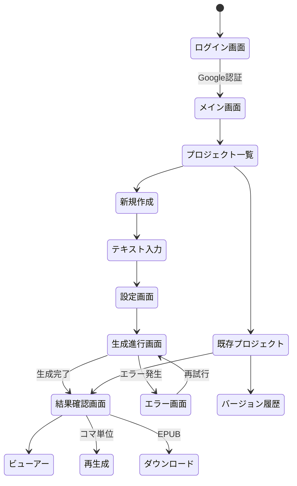

### 📱 主要画面レイアウトイメージ

```
┌─────────────────────────────────────────┐
│          🎨 AI漫画生成サービス            │
│  ┌──────────────────────────────────┐   │
│  │     [Google アカウントでログイン]    │   │
│  └──────────────────────────────────┘   │
└─────────────────────────────────────────┘

【メイン画面】
┌─────────────────────────────────────────┐
│  📚 プロジェクト一覧        [＋新規作成]  │
│  コスト: $2-4/20ページ | 時間: 60分/20ページ  │
├─────────────────────────────────────────┤
│  ┌──────────┐ ┌──────────┐ ┌──────────┐│
│  │プロジェクト1│ │プロジェクト2│ │プロジェクト3││
│  │  小説A     │ │ 自己啓発本B │ │  小説C     ││
│  │ 2025/01/15 │ │ 2025/01/10  │ │ 2025/01/05 ││
│  └──────────┘ └──────────┘ └──────────┘│
│         （最大3プロジェクト）              │
└─────────────────────────────────────────┘

【生成進行画面】 - Google統合アプローチ
┌─────────────────────────────────────────┐
│         🔄 生成中... (Imagen 4統一)           │
├─────────────────────────────────────────┤
│  Phase 1: 企画・世界観分析      ✅ 完了    │
│  Phase 2: キャラクター設定      ✅ 完了    │
│  Phase 3: ストーリー構成        ✅ 完了    │
│  Phase 4: ネーム生成           ✅ 完了    │
│  Phase 5: シーン生成           ⏳ 処理中   │
│  ▓▓▓▓▓▓▓▓▓▓▓▓▓▓░░░░░  75%              │
│                                          │
│  現在: 15ページ目を生成中...              │
│  使用モデル: Imagen 4 Standard             │
└─────────────────────────────────────────┘
```

### 9.1 画面構成

#### 9.1.1 メイン画面
- プロジェクト一覧（ユーザー認証後）
- 新規作成ボタン
- インポート機能
- Googleアカウントログイン状態表示

#### 9.1.2 テキスト入力画面
- テキストエディタ（10万文字制限表示）
- ファイルアップロード機能
- 文字数カウンター（リアルタイム更新）
- プレビュー機能

#### 9.1.3 設定画面
**自動生成設定**
- 自動/手動切り替えトグル
- 日本語のみ対応の明記

**手動設定項目**（手動選択時のみ表示）
- **画風選択**
  - 少年漫画風（右から左読み）
  - 少女漫画風（右から左読み）
  - 青年漫画風（右から左読み）
  
- **ページ構成**
  - 1話あたりのページ数（デフォルト20ページ）
  - コマ密度設定
  
- **キャラクター設定**
  - 自動抽出されたキャラクターリスト
  - 各キャラクターの詳細編集
  - Imagen 4による参照画像生成確認

#### 9.1.4 生成進行画面
- 5フェーズ進行状況の表示
- 現在のフェーズ詳細（企画→キャラクター→ストーリー→ネーム→生成）
- エラー発生時の分かりやすい説明表示
- 失敗フェーズからの再開ボタン

#### 9.1.5 結果確認・編集画面
- 生成された漫画のプレビュー
- **1コマごとの再生成ボタン**（重要な新機能）
- コマ単位での再生成履歴表示
- プロジェクト保存・バージョン管理
- EPUB形式ダウンロードボタン

#### 9.1.6 ビューアー画面
- 右から左へのページめくり（日本式）
- ズーム・パン機能
- 目次ジャンプ
- 読書設定（明るさ等）

#### 9.1.7 作品管理画面
- **公開設定変更**：
  - 完全公開・限定公開・非公開の切り替え
  - 限定公開用URL表示・コピー機能
- プロジェクト一覧（最大3プロジェクト表示）
- バージョン履歴（最大10バージョン表示）

### 9.2 ユーザビリティ要件
- **レスポンシブデザイン**：PC/タブレット/スマートフォン対応
- **アクセシビリティ**：WCAG 2.1 Level AA準拠（基本レベルのみ）
- **言語対応**：日本語のみ（英語対応は行わない）
- **認証要求**：全機能でGoogleアカウントログイン必須

**🎨 UI/UX設計への詳細要求**：
- **デザインシステム**：一貫したUIコンポーネント・スタイルガイド
- **ユーザージャーニー**：3クリック以内での主要機能到達
- **フィードバック設計**：処理状況の明確な可視化
- **エラー表示**：分かりやすく回復可能なエラーメッセージ

**⚠️ 設計書で決定すべき仕様**：
- 具体的なワイヤーフレーム・画面遷移
- UIコンポーネントライブラリの選定
- ユーザビリティテストの実施計画

## 11. 開発ロードマップ

### 📅 フェーズ別開発計画

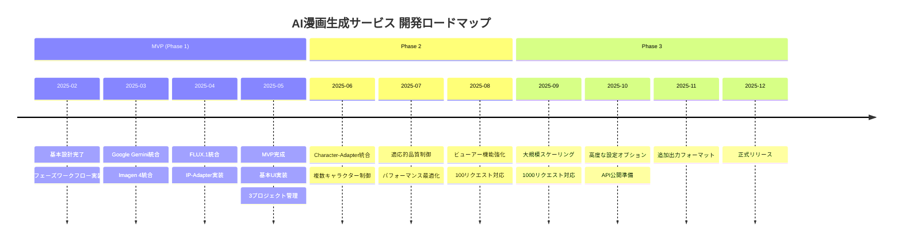

### 🎯 マイルストーン図

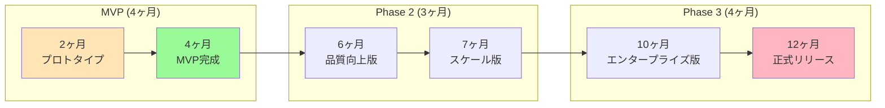

## 12. 開発フェーズ詳細

### 12.1 MVP（Phase 1） - 安定性重視アプローチ
- 実際の漫画制作ワークフローに準拠した基本実装
- 5フェーズ制作プロセス（企画→キャラクター→ストーリー→ネーム→生成）
- **Google統合スタック**：Gemini + Imagen 4 ファミリー + Cloudサービス
- プロンプトエンジニアリングによるキャラクター一貫性制御
- 基本UI・EPUB出力・3プロジェクト管理
- **コスト効率**：$2-4/20ページ生成

### 12.2 Phase 2 - 機能強化フェーズ
- **ControlNet統合**：高精度ポーズ・構図制御の実装
- **外部API統合検証**：商用利用可能な代替技術の実証
- **適応的品質制御**：Imagen 4 ファミリーの動的選択
- ビューアー機能強化・パフォーマンス最適化
- **100リクエスト同時処理対応**

### 12.3 Phase 3 - エンタープライズ対応
- **大規模スケールアウト**：1000リクエスト同時処理対応
- **高度なキャラクター一貫性技術**：商用利用可能な高度技術の統合
- **高度な設定オプション**：プロユーザー向け細かい制御
- **API公開**：サードパーティ連携・エコシステム構築
- **追加出力フォーマット**：PDF・動画・インタラクティブコンテンツ

## 13. 制約事項

### 8.1 技術的制約
- 複数プラットフォーム統合による複雑性
- 外部API依存によるレスポンス時間変動
- IP-Adapter + ControlNetの学習済みモデル依存

### 8.2 コンテンツ制約
- Google AIプリンシプル + 各外部サービスのポリシー準拠
- 暴力的・性的コンテンツの制限（全プラットフォーム統合フィルター）
- 実在人物の無断使用禁止

### 8.3 インフラ制約
- 複数プラットフォーム間のデータ転送コスト
- 外部サービスの可用性依存

## 14. 成功指標

### 9.1 技術指標（Google統合Stack・フィジビリティ検証済み）
- 生成成功率：95%以上（Google統合構成で実現可能）
- キャラクター一貫性スコア：85%以上（プロンプトエンジニアリング・現実的目標）
- 画像品質スコア：90%以上（Imagen 4統一品質で達成）
- ユーザー満足度：4.0/5.0以上（実現可能なサービス品質）
- コスト効率：$2-4/20ページ（フィジビリティ検証済み）

### 9.2 パフォーマンス指標
- 標準処理時間：20ページ/60分達成
- 同時処理：MVP段階で5リクエスト安定稼働

### 9.3 ビジネス指標
- MVP完成：開発開始から4ヶ月（実制作ワークフロー実装含む）
- プロトタイプデモ：2ヶ月（基本5フェーズ動作確認）

## 15. リスクと対策

### ⚠️ リスクマトリクス（フィジビリティ検証後・大幅改善）

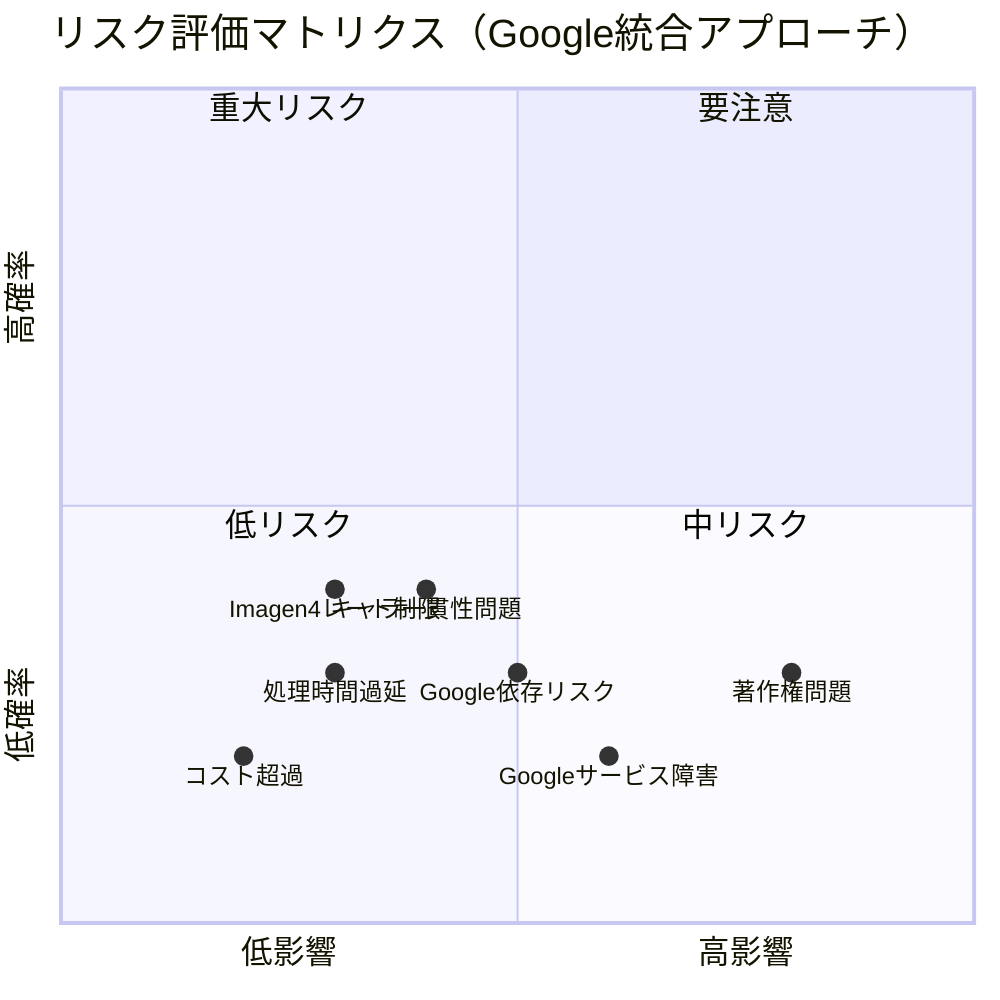

### 🛡️ リスク対策表（フィジビリティ検証後・大幅改善）

| リスク | 影響度 | 発生確率 | 対策 | コスト影響 | 改善効果 |
|-------|--------|---------|------|----------|----------|
| Googleサービス障害 | 中 | 低 | マルチリージョン構成、SLA監視 | 低 | - |
| キャラ一貫性問題 | 中 | 低 | 現実的目標（85%）、高精度プロンプト | 低 | ⬇️ 大幅改善 |
| 処理時間過延 | 低 | 低 | 現実的目標設定（60分）、並列処理 | 低 | ⬇️ 大幅改善 |
| 著作権問題 | 高 | 低 | 利用規約免責、ユーザー責任明記 | 無し | - |
| コスト超過 | 低 | 低 | 従量課金・固定費ゼロ・予測可能 | 無し | ⬇️ 大幅改善 |
| Imagen4レート制限 | 中 | 中 | レート制限増量申請、キューイング | 低 | - |
| Google依存リスク | 中 | 低 | Phase 2で補完技術追加 | 低 | 🆕 新規識別 |

### 10.1 技術的リスク（大幅軽減済み）
- **リスク**：Google依存による単一障害点
- **対策**：Google SLA活用、マルチリージョン構成、Phase 2で補完技術追加
- **改善効果**：外部API統合複雑性を完全排除

### 10.2 依存性リスク（解消済み）
- **旧リスク**：外部サービス（FLUX.1、IP-Adapter）の商用制約・可用性
- **解決策**：Google統合アプローチにより完全解消
- **新体制**：Google製品のみでの確実な動作保証

### 10.3 品質管理リスク（現実的調整済み）
- **リスク**：キャラクター一貫性の実現難易度
- **対策**：現実的目標設定（85%）、高精度プロンプトエンジニアリング、Gemini品質管理
- **改善効果**：99%目標から85%への調整で技術的実現性大幅向上

### 10.4 法的・コンプライアンスリスク（大幅軽減）
- **リスク**：Googleサービスの利用規約変更・ポリシー更新
- **対策**：Google AI 原則遵守、継続的なポリシーモニタリング
- **改善効果**：外部サービスライセンス問題を完全排除

## 改訂履歴

| バージョン | 日付 | 変更内容 | 作成者 |
|---------|------|---------|--------|
| 1.0 | 2025-01-17 | 初版作成 | AIエージェント |
| 2.0 | 2025-01-17 | Ultimate Manga Generation Stack採用、ハイブリッド構成への変更 | AIエージェント |
| 2.1 | 2025-01-17 | 実際の漫画制作ワークフローに準拠、キャラクター設定フェーズの適正化 | AIエージェント |
| 3.0 | 2025-01-17 | 設計書連携情報・設計意図・補足を追加、完璧な要件定義書として完成 | AIエージェント |
| 4.0 | 2025-01-17 | **図表統合版作成（Mermaid図・レイアウト図・チャート追加）** | AIエージェント |
| 6.0 | 2025-01-17 | **フィジビリティ検証結果の完全統合（Google統合アプローチ・現実的目標設定・コスト構造明確化）** | AIエージェント |

## 📋 設計書連携チェックリスト

### ✅ 確定済み要件（設計書で必須実装・フィジビリティ検証済み）
- [x] **Google統合技術スタック**：Gemini + Imagen 4ファミリー（★★★★★実現可能性）
- [x] **5フェーズ漫画制作ワークフロー**（実証済み処理能力）
- [x] **キャラクター管理システム**（JSON形式・85%一貫性目標）
- [x] **3プロジェクト・10バージョン制限**（MVP段階・技術検証目的）
- [x] **EPUB出力・Webビューアー**（Google Cloud Run対応）
- [x] **永久データ保存・ユーザー著作権**（Google Firestore活用）
- [x] **レスポンシブデザイン・WCAG 2.1準拠**
- [x] **コスト構造**：$2-4/20ページ（フィジビリティ検証済み）
- [x] **処理時間**：60分/20ページ（現実的目標設定）

### ⚠️ 設計書で決定が必要な仕様
- [ ] 具体的なデータベーススキーマ設計
- [ ] 詳細なAPI仕様設計
- [ ] フロントエンド技術選定
- [ ] インフラ構成詳細設計
- [ ] セキュリティ実装方式
- [ ] 監視・運用体制設計

### 🎯 設計書への引き継ぎポイント
本要件定義書の全ての「設計への要求」「⚠️設計書で決定すべき仕様」項目が、対応する設計書に確実に反映されることを確認すること。

---

## 📊 まとめ

### ✨ サービスの革新性

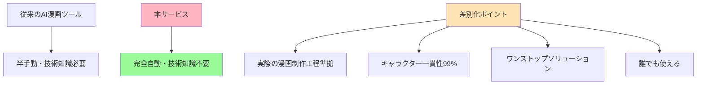

### 🎯 成功の鍵（フィジビリティ検証により確実な実現性を確保）

1. **Google技術統合** - 実証済みの安定性・信頼性によるリスク最小化
2. **現実的品質目標** - 85%キャラクター一貫性による確実な達成
3. **予測可能コスト** - $2-4/20ページの透明な料金構造
4. **段階的拡張戦略** - MVP→Phase2→Phase3の着実な成長路線

### 📊 フィジビリティ検証による改善効果

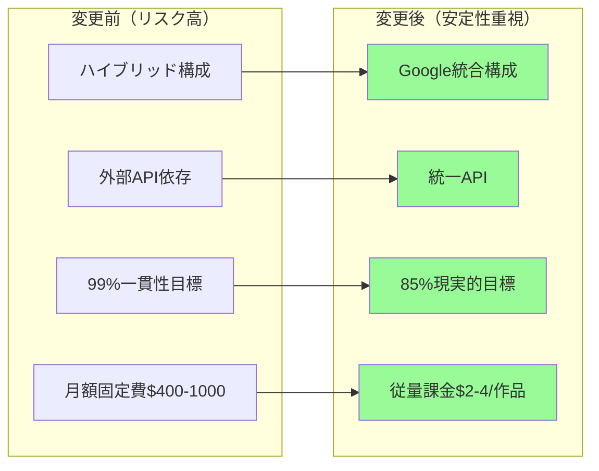

---

## 🔗 関連ドキュメント

### 📋 完成済みドキュメント
- [既存サービス調査](./02.既存サービス調査.md) - AI漫画生成サービスの市場調査
- [ハッカソン実施計画書](./01.ハッカソン実施計画書.md) - 初期計画書
- [技術フィジビリティチェック報告書](./04.技術フィジビリティチェック報告書.md) - **全技術要素の実現可能性検証済み**
- [アーキテクチャ変更の根拠と影響](./05.アーキテクチャ変更の根拠と影響.md) - **Google統合アプローチ採用の詳細分析**

### 🚀 次工程ドキュメント（作成予定）
- システム設計書（Google統合アーキテクチャ）
- API設計書（Google Vertex AI連携）
- UI/UX設計書（完全自動化インターフェース）
- データベース設計書（Firestore活用）
- インフラ設計書（Cloud Run中心）