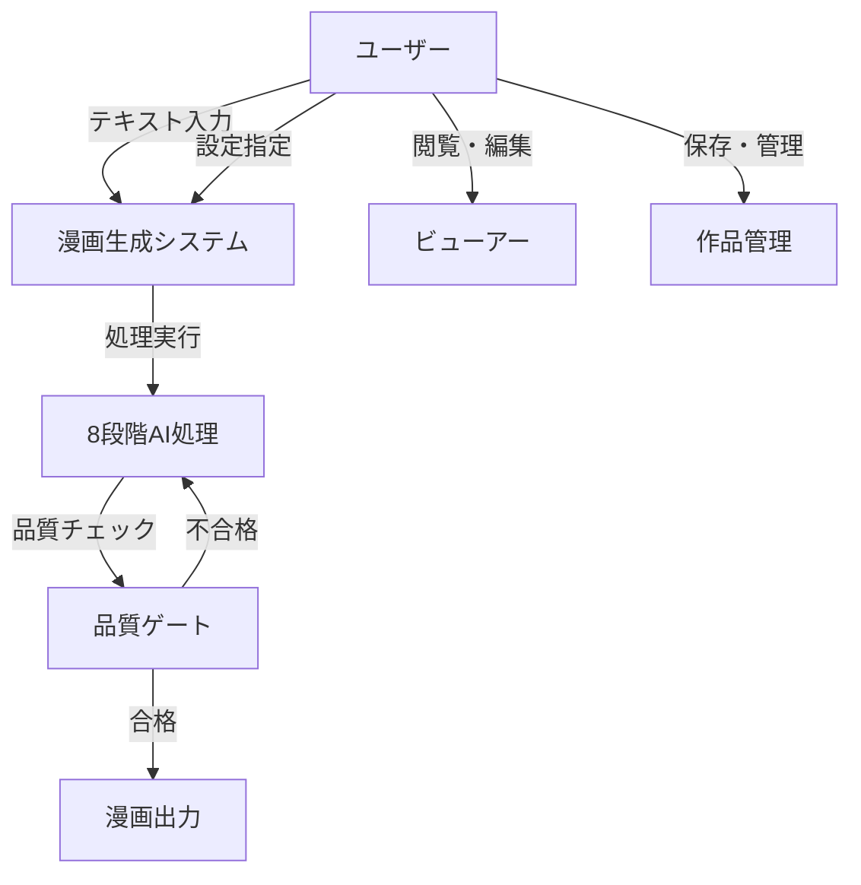
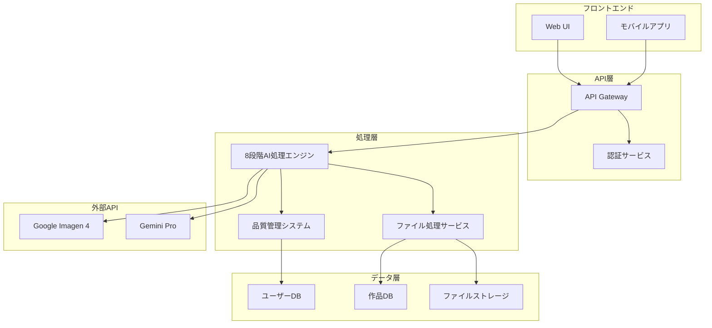
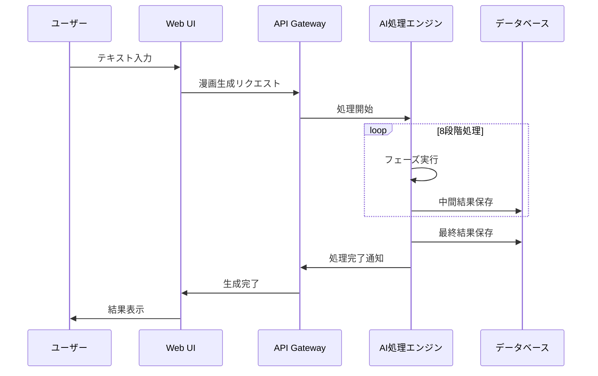

# AI漫画生成サービス 要件定義書

**文書管理情報**
- 文書ID: REQ-DOC-001
- 作成日: 2025-01-20
- 版数: 2.0
- 承認者: [承認者名]

## 目次

- [1. エグゼクティブサマリー](#1-エグゼクティブサマリー)
  - [プロジェクト概要](#プロジェクト概要)
  - [ビジネス価値と期待効果](#ビジネス価値と期待効果)
  - [主要なステークホルダー](#主要なステークホルダー)
  - [スコープと制約事項](#スコープと制約事項)
- [2. 機能要件](#2-機能要件)
  - [2.1 ユーザーストーリー](#21-ユーザーストーリー)
  - [2.2 機能一覧](#22-機能一覧)
    - [2.2.1 入力機能](#221-入力機能)
    - [2.2.2 処理機能](#222-処理機能)
    - [2.2.3 出力機能](#223-出力機能)
  - [2.3 ユースケース図](#23-ユースケース図)
- [3. 非機能要件](#3-非機能要件)
  - [3.1 性能要件](#31-性能要件)
  - [3.2 セキュリティ要件](#32-セキュリティ要件)
  - [3.3 可用性要件](#33-可用性要件)
- [4. システムアーキテクチャ](#4-システムアーキテクチャ)
  - [4.1 システム構成図](#41-システム構成図)
  - [4.2 データフロー図](#42-データフロー図)
  - [4.3 技術スタック](#43-技術スタック)
- [5. 制約事項とリスク](#5-制約事項とリスク)
  - [5.1 技術的制約](#51-技術的制約)
  - [5.2 ビジネス制約](#52-ビジネス制約)
  - [5.3 リスク評価マトリクス](#53-リスク評価マトリクス)
- [6. 用語集と略語一覧](#6-用語集と略語一覧)
  - [用語集](#用語集)
  - [略語一覧](#略語一覧)
- [改訂履歴](#改訂履歴)

---

## 1. エグゼクティブサマリー

### プロジェクト概要
小説や自己啓発本から完全自動で長編漫画を生成するAIサービス。テキスト入力のみで高品質な漫画コンテンツを制作可能。

### ビジネス価値と期待効果
- **市場機会**: 創作スキルのない層への漫画制作サービス提供
- **収益予測**: サブスクリプション及び従量課金モデル
- **差別化要因**: 業界初の完全自動化による圧倒的利便性

### 主要なステークホルダー
- **プライマリユーザー**: アマチュア作家、コンテンツクリエイター
- **技術パートナー**: Google Cloud Platform
- **競合**: Midjourney、ComicAI（半自動ツール）

### スコープと制約事項
- **対象**: 日本語テキストからの漫画生成（初期フェーズ）
- **制約**: Google統合スタック必須、著作権フィルタリング必要
- **除外**: リアルタイム生成、動画形式出力（将来フェーズ）

---

## 2. 機能要件

### 2.1 ユーザーストーリー

| ID | ユーザー種別 | 機能 | 価値 |
|---|---|---|---|
| US-001 | アマチュア作家 | テキストから漫画を自動生成 | 絵画スキル不要で作品化 |
| US-002 | コンテンツクリエイター | SNS投稿用漫画作成 | 効率的なコンテンツ制作 |
| US-003 | 全ユーザー | 作品管理・編集 | 継続的な創作活動支援 |

### 2.2 機能一覧

#### 2.2.1 入力機能

**要件ID**: REQ-FNC-001  
**要件名**: テキスト入力システム  
**説明**: ユーザーはプレーンテキストまたは構造化テキストを入力可能  
**優先度**: Must  
**受入条件**: 
- 最大50,000文字の入力対応
- UTF-8エンコーディング対応
- 構造化マークアップ（章、節）の自動認識

**要件ID**: REQ-FNC-002  
**要件名**: 生成設定制御  
**説明**: ユーザーは漫画スタイル、ページ数、キャラクター数を指定可能  
**優先度**: Should  
**受入条件**: 
- 5種類の描画スタイル選択
- 10-100ページの範囲指定
- 主要キャラクター5名まで設定

#### 2.2.2 処理機能

**要件ID**: REQ-FNC-003  
**要件名**: AIエージェント処理システム  
**説明**: 8段階の自動処理パイプラインによる漫画生成  
**優先度**: Must  
**受入条件**: 
- Phase 1: テキスト解析（30秒以内）
- Phase 2: ストーリー構造化（1分以内）
- Phase 3: シーン分割（1分以内）
- Phase 4: キャラクター設定（1分以内）
- Phase 5: コマ割り設計（1分以内）
- Phase 6: 画像生成（3分以内）
- Phase 7: セリフ配置（1分以内）
- Phase 8: 最終統合（2分以内）

**要件ID**: REQ-FNC-004  
**要件名**: 品質ゲート管理  
**説明**: 各フェーズで品質判定を実行し、基準未達時は再生成  
**優先度**: Must  
**受入条件**: 
- 各フェーズ85%以上の品質スコア
- 最大3回の再試行
- 詳細な品質レポート生成

#### 2.2.3 出力機能

**要件ID**: REQ-FNC-005  
**要件名**: 漫画出力システム  
**説明**: 複数フォーマットでの漫画出力機能  
**優先度**: Must  
**受入条件**: 
- PDF形式（印刷用）出力
- WebP形式（Web用）出力
- 300dpi解像度保証

**要件ID**: REQ-FNC-006  
**要件名**: インタラクティブビューアー  
**説明**: ブラウザ上での漫画閲覧機能  
**優先度**: Should  
**受入条件**: 
- ページめくり機能
- ズーム・パン操作
- モバイル対応

### 2.3 ユースケース図

---

## 3. 非機能要件

### 3.1 性能要件

**要件ID**: REQ-NFR-001  
**要件名**: 処理時間制限  
**説明**: 漫画生成は10分以内に完了する  
**根拠**: ユーザビリティ確保のため  
**受入条件**: 
- 標準的なテキスト（5,000文字）で8分以内
- 最大テキスト（50,000文字）で10分以内
- 処理状況リアルタイム表示

**要件ID**: REQ-NFR-002  
**要件名**: 同時処理能力  
**説明**: 100ユーザーの同時処理をサポート  
**根拠**: 初期ユーザー数予測に基づく  
**受入条件**: 
- 100並行処理でレスポンス時間2倍以内
- オートスケーリング機能
- リソース使用量監視

### 3.2 セキュリティ要件

**要件ID**: REQ-NFR-003  
**要件名**: データ保護  
**説明**: ユーザーデータの暗号化と安全な保存  
**根拠**: 個人情報保護法準拠  
**受入条件**: 
- 保存時暗号化（AES-256）
- 転送時暗号化（TLS 1.3）
- アクセスログ記録

**要件ID**: REQ-NFR-004  
**要件名**: コンテンツフィルタリング  
**説明**: 不適切コンテンツの自動検出・除外  
**根拠**: プラットフォーム安全性確保  
**受入条件**: 
- 暴力・性的表現の検出精度95%以上
- 著作権侵害コンテンツの検出
- 手動レビュー機能

### 3.3 可用性要件

**要件ID**: REQ-NFR-005  
**要件名**: システム稼働率  
**説明**: 99.5%以上の可用性を保証  
**根拠**: SaaS標準水準  
**受入条件**: 
- 月間ダウンタイム3.6時間以内
- 自動フェイルオーバー機能
- 定期バックアップ（日次）

---

## 4. システムアーキテクチャ

### 4.1 システム構成図

### 4.2 データフロー図

### 4.3 技術スタック

| レイヤー | 技術 | 理由 |
|---------|------|------|
| フロントエンド | React, Next.js | モダンWeb開発標準 |
| API | Node.js, Express | JavaScript統一 |
| AI処理 | Python, FastAPI | AI開発標準 |
| データベース | PostgreSQL | リレーショナルデータ管理 |
| ストレージ | Google Cloud Storage | 大容量ファイル対応 |
| AI API | Google Imagen 4, Gemini Pro | 高品質生成AI |
| インフラ | Google Cloud Platform | 統合クラウド環境 |

---

## 5. 制約事項とリスク

### 5.1 技術的制約

| 項目 | 制約内容 | 影響 |
|------|----------|------|
| API制限 | Google AI API 1日10,000リクエスト | 同時ユーザー数制限 |
| 処理能力 | 単一処理に最大16GB RAM必要 | スケーリング設計必要 |
| ファイルサイズ | 出力PDF最大100MB | 長編作品制限 |

### 5.2 ビジネス制約

| 項目 | 制約内容 | 対策 |
|------|----------|------|
| 著作権 | 既存作品の類似性チェック必要 | AI検出システム導入 |
| 利用料金 | Google API従量課金 | 適切な課金モデル設計 |
| 法的責任 | 生成コンテンツの責任範囲 | 利用規約での明確化 |

### 5.3 リスク評価マトリクス

| リスク | 影響度 | 発生確率 | 対策 |
|--------|--------|----------|------|
| AI API障害 | 高 | 中 | 冗長化・代替API準備 |
| 著作権侵害 | 高 | 低 | 事前フィルタリング強化 |
| 処理性能劣化 | 中 | 中 | 監視・自動スケーリング |

---

## 6. 用語集と略語一覧

### 用語集

| 用語 | 定義 |
|------|------|
| AIエージェント | 特定のタスクを自律的に実行するAIシステム |
| 品質ゲート | 各処理段階での品質基準チェックポイント |
| コマ割り | 漫画ページの構成・レイアウト設計 |
| フィジビリティ | 技術的・事業的実現可能性 |

### 略語一覧

| 略語 | 正式名称 |
|------|----------|
| AI | Artificial Intelligence |
| API | Application Programming Interface |
| UI | User Interface |
| UX | User Experience |
| SLA | Service Level Agreement |
| PDF | Portable Document Format |
| TLS | Transport Layer Security |
| UTF-8 | 8-bit Unicode Transformation Format |

---

## 改訂履歴

| 版数 | 日付 | 変更内容 | 担当者 |
|------|------|----------|--------|
| 1.0 | 2025-01-15 | 初版作成 | [担当者名] |
| 2.0 | 2025-01-20 | 構造改善・要件ID付与 | Claude Code |

---

**文書承認**
- 技術責任者: [署名] 日付: [日付]
- プロダクトマネージャー: [署名] 日付: [日付]
- プロジェクトマネージャー: [署名] 日付: [日付]