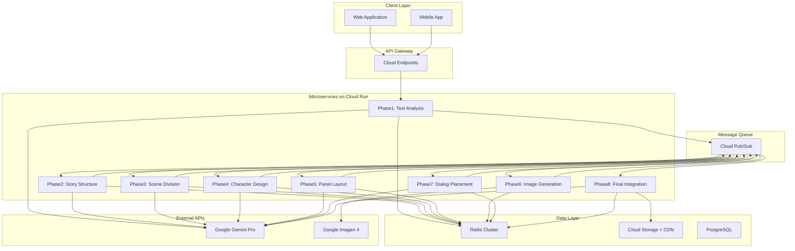
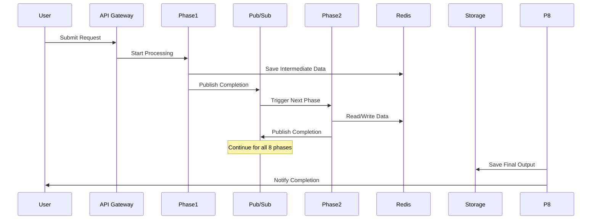

# AI漫画生成サービス システム設計書

**文書管理情報**
- 文書ID: SYS-DOC-001
- 作成日: 2025-01-20
- 版数: 1.0
- 承認者: 根岸祐樹
- 関連文書: REQ-DOC-001（要件定義書）

## 目次

- [1. システム概要](#1-システム概要)
  - [1.1 設計方針](#11-設計方針)
  - [1.2 アーキテクチャ概要](#12-アーキテクチャ概要)
- [2. マイクロサービス設計](#2-マイクロサービス設計)
  - [2.1 サービス構成](#21-サービス構成)
  - [2.2 サービス間通信](#22-サービス間通信)
  - [2.3 データフロー](#23-データフロー)
- [3. インフラストラクチャ設計](#3-インフラストラクチャ設計)
  - [3.1 Cloud Run構成](#31-cloud-run構成)
  - [3.2 ストレージ設計](#32-ストレージ設計)
  - [3.3 Redis Cluster設計](#33-redis-cluster設計)
- [4. 外部API統合設計](#4-外部api統合設計)
  - [4.1 Google AI API接続](#41-google-ai-api接続)
  - [4.2 レート制限管理](#42-レート制限管理)
- [5. 信頼性設計](#5-信頼性設計)
  - [5.1 エラーハンドリング](#51-エラーハンドリング)
  - [5.2 リトライ戦略](#52-リトライ戦略)
  - [5.3 監視・ログ設計](#53-監視ログ設計)
- [6. セキュリティ設計](#6-セキュリティ設計)
- [7. パフォーマンス設計](#7-パフォーマンス設計)
- [8. 運用設計](#8-運用設計)

---

## 1. システム概要

### 1.1 設計方針

本システムは以下の設計原則に基づいて構築される：

| 原則 | 内容 |
|------|------|
| マイクロサービス化 | 8フェーズを独立サービスとして実装 |
| サーバーレス優先 | Google Cloud Runによる運用負荷削減 |
| イベント駆動 | Pub/Subによる疎結合な非同期処理 |
| 高可用性 | Redis Cluster、マルチゾーン構成 |
| 自動復旧 | 3回までの自動リトライ機構 |

### 1.2 アーキテクチャ概要



---

## 2. マイクロサービス設計

### 2.1 サービス構成

#### 2.1.1 Phase 1: Text Analysis Service

**サービスID**: SVC-TEXT-ANALYSIS  
**責務**: 入力テキストの解析と構造化  
**実装言語**: Python 3.11  
**コンテナサイズ**: 2 vCPU, 4GB RAM  

**入力**:
```json
{
  "request_id": "string",
  "text": "string",
  "settings": {
    "style": "string",
    "pages": "number"
  }
}
```

**出力**:
```json
{
  "request_id": "string",
  "analyzed_data": {
    "chapters": [],
    "characters": [],
    "themes": [],
    "emotions": []
  },
  "processing_time": "number"
}
```

**処理時間制限**: 30秒

#### 2.1.2 Phase 2: Story Structure Service

**サービスID**: SVC-STORY-STRUCTURE  
**責務**: 物語構造の最適化  
**実装言語**: Python 3.11  
**コンテナサイズ**: 2 vCPU, 4GB RAM  

**処理内容**:
- 起承転結の構造化
- ペーシング調整
- クライマックス配置

**処理時間制限**: 60秒

#### 2.1.3 Phase 3: Scene Division Service

**サービスID**: SVC-SCENE-DIVISION  
**責務**: シーン分割と配分  
**実装言語**: Python 3.11  
**コンテナサイズ**: 2 vCPU, 4GB RAM  

**処理内容**:
- シーン境界検出
- ページ配分計算
- 転換点マーキング

**処理時間制限**: 60秒

#### 2.1.4 Phase 4: Character Design Service

**サービスID**: SVC-CHARACTER-DESIGN  
**責務**: キャラクター設定生成  
**実装言語**: Python 3.11  
**コンテナサイズ**: 2 vCPU, 8GB RAM  

**処理内容**:
- ビジュアル設定生成
- 性格・背景設定
- 関係性マッピング

**処理時間制限**: 60秒

#### 2.1.5 Phase 5: Panel Layout Service

**サービスID**: SVC-PANEL-LAYOUT  
**責務**: コマ割り設計  
**実装言語**: Python 3.11  
**コンテナサイズ**: 2 vCPU, 4GB RAM  

**処理内容**:
- コマサイズ決定
- 視線誘導設計
- アクションフロー配置

**処理時間制限**: 60秒

#### 2.1.6 Phase 6: Image Generation Service

**サービスID**: SVC-IMAGE-GENERATION  
**責務**: 画像生成処理  
**実装言語**: Python 3.11  
**コンテナサイズ**: 4 vCPU, 16GB RAM  

**処理内容**:
- Imagen 4 API呼び出し
- バッチ処理最適化
- 画像品質検証

**処理時間制限**: 180秒（3分）

#### 2.1.7 Phase 7: Dialog Placement Service

**サービスID**: SVC-DIALOG-PLACEMENT  
**責務**: セリフ配置最適化  
**実装言語**: Python 3.11  
**コンテナサイズ**: 2 vCPU, 4GB RAM  

**処理内容**:
- 吹き出し配置
- フォント選択
- 読みやすさ最適化

**処理時間制限**: 60秒

#### 2.1.8 Phase 8: Final Integration Service

**サービスID**: SVC-FINAL-INTEGRATION  
**責務**: 最終統合と出力生成  
**実装言語**: Python 3.11  
**コンテナサイズ**: 4 vCPU, 8GB RAM  

**処理内容**:
- レイヤー統合
- PDF/WebP生成
- メタデータ付与

**処理時間制限**: 120秒（2分）

### 2.2 サービス間通信

#### 2.2.1 Pub/Sub Topic設計

| Topic名 | Publisher | Subscriber | メッセージ形式 |
|---------|-----------|------------|---------------|
| phase1-completed | Text Analysis | Story Structure | JSON |
| phase2-completed | Story Structure | Scene Division | JSON |
| phase3-completed | Scene Division | Character Design | JSON |
| phase4-completed | Character Design | Panel Layout | JSON |
| phase5-completed | Panel Layout | Image Generation | JSON |
| phase6-completed | Image Generation | Dialog Placement | JSON |
| phase7-completed | Dialog Placement | Final Integration | JSON |
| phase8-completed | Final Integration | Notification Service | JSON |

#### 2.2.2 メッセージフォーマット

```json
{
  "message_id": "uuid",
  "request_id": "uuid",
  "phase": "number",
  "status": "success|failure|retry",
  "timestamp": "ISO8601",
  "data": {
    "redis_key": "string",
    "processing_time": "number",
    "retry_count": "number"
  },
  "error": {
    "code": "string",
    "message": "string",
    "details": {}
  }
}
```

### 2.3 データフロー



---

## 3. インフラストラクチャ設計

### 3.1 Cloud Run構成

#### 3.1.1 デプロイメント設定

```yaml
apiVersion: serving.knative.dev/v1
kind: Service
metadata:
  name: phase1-text-analysis
spec:
  template:
    metadata:
      annotations:
        run.googleapis.com/cpu: "2"
        run.googleapis.com/memory: "4Gi"
        run.googleapis.com/execution-environment: gen2
        run.googleapis.com/cpu-boost: "true"
    spec:
      containerConcurrency: 100
      timeoutSeconds: 30
      serviceAccountName: manga-service-account
      containers:
      - image: gcr.io/PROJECT_ID/phase1-text-analysis:latest
        resources:
          limits:
            cpu: "2"
            memory: "4Gi"
        env:
        - name: REDIS_HOST
          value: "redis-cluster-endpoint"
        - name: PUBSUB_TOPIC
          value: "phase1-completed"
```

#### 3.1.2 オートスケーリング設定

| サービス | 最小インスタンス | 最大インスタンス | 同時リクエスト |
|----------|-----------------|------------------|----------------|
| Phase 1 | 1 | 20 | 100 |
| Phase 2 | 1 | 20 | 100 |
| Phase 3 | 1 | 20 | 100 |
| Phase 4 | 1 | 20 | 100 |
| Phase 5 | 1 | 20 | 100 |
| Phase 6 | 2 | 50 | 50 |
| Phase 7 | 1 | 20 | 100 |
| Phase 8 | 1 | 20 | 100 |

### 3.2 ストレージ設計

#### 3.2.1 Cloud Storage バケット構成

| バケット名 | 用途 | ストレージクラス | ライフサイクル |
|-----------|------|-----------------|---------------|
| manga-input-data | 入力テキスト | Standard | 30日後にNearline |
| manga-output-images | 生成画像 | Standard | CDN配信 |
| manga-final-products | 完成作品 | Standard | 90日後にColdline |
| manga-temp-data | 一時ファイル | Standard | 7日後に削除 |

#### 3.2.2 CDN設定

```yaml
CDN Configuration:
  Origin: manga-output-images.storage.googleapis.com
  Cache TTL: 86400 (1 day)
  Compression: Enabled (gzip, brotli)
  Geographic Distribution: Global
  SSL: Enabled
  Custom Domain: cdn.manga-service.com
```

### 3.3 Redis Cluster設計

#### 3.3.1 クラスタ構成

```yaml
Redis Cluster Configuration:
  Version: 7.0
  Node Type: 3 Master + 3 Replica
  Memory per Node: 16GB
  Total Memory: 48GB (usable)
  Persistence: AOF with 1sec fsync
  Replication: Async with auto-failover
  Network: Private VPC
  Backup: Daily snapshot to Cloud Storage
```

#### 3.3.2 データ構造設計

```redis
# Request Data
KEY: request:{request_id}:metadata
TYPE: Hash
TTL: 86400 (24 hours)
FIELDS:
  - status: processing|completed|failed
  - phase: 1-8
  - created_at: timestamp
  - updated_at: timestamp

# Phase Data
KEY: request:{request_id}:phase{n}:data
TYPE: JSON
TTL: 86400 (24 hours)

# API Rate Limiting
KEY: api:rate_limit:{api_name}:{date}
TYPE: String (counter)
TTL: 86400 (24 hours)
```

---

## 4. 外部API統合設計

### 4.1 Google AI API接続

#### 4.1.1 API Client設定

```python
class GoogleAIClient:
    def __init__(self):
        self.gemini_client = gemini.Client(
            api_key=os.environ['GEMINI_API_KEY'],
            timeout=30,
            max_retries=3
        )
        self.imagen_client = imagen.Client(
            api_key=os.environ['IMAGEN_API_KEY'],
            timeout=60,
            max_retries=3
        )
    
    async def call_with_rate_limit(self, api_name, request):
        # Check rate limit in Redis
        current_count = await redis.incr(f"api:rate_limit:{api_name}:{today}")
        if current_count > MAX_DAILY_LIMIT:
            raise RateLimitExceeded()
        
        # Execute API call
        return await self._execute_api_call(api_name, request)
```

#### 4.1.2 API使用量配分

| フェーズ | API | 1リクエストあたり呼び出し回数 | 日次上限配分 |
|---------|-----|------------------------------|-------------|
| Phase 1 | Gemini Pro | 1 | 1,000 |
| Phase 2 | Gemini Pro | 1 | 1,000 |
| Phase 3 | Gemini Pro | 1 | 1,000 |
| Phase 4 | Gemini Pro | 2 | 2,000 |
| Phase 5 | Gemini Pro | 1 | 1,000 |
| Phase 6 | Imagen 4 | 10-50 | 3,000 |
| Phase 7 | Gemini Pro | 1 | 1,000 |
| Phase 8 | Gemini Pro | 1 | 1,000 |

### 4.2 レート制限管理

#### 4.2.1 Redis カウンター実装

```python
class RateLimitManager:
    def __init__(self, redis_client):
        self.redis = redis_client
        self.limits = {
            'gemini_pro': 7000,  # 70% of 10,000
            'imagen_4': 3000     # 30% of 10,000
        }
    
    async def check_and_increment(self, api_name):
        key = f"api:rate_limit:{api_name}:{datetime.now().date()}"
        
        # Atomic increment
        current = await self.redis.incr(key)
        
        # Set expiry on first increment
        if current == 1:
            await self.redis.expire(key, 86400)
        
        # Check limit
        if current > self.limits.get(api_name, 10000):
            raise RateLimitExceeded(f"{api_name} daily limit reached")
        
        return current
```

---

## 5. 信頼性設計

### 5.1 エラーハンドリング

#### 5.1.1 エラー分類と対処

| エラー種別 | HTTPステータス | リトライ可否 | 対処方法 |
|-----------|--------------|------------|----------|
| API Rate Limit | 429 | No | キューに戻して翌日処理 |
| API Timeout | 504 | Yes | 指数バックオフでリトライ |
| Invalid Input | 400 | No | ユーザーに通知 |
| Service Error | 500 | Yes | 自動リトライ（最大3回） |
| Resource Exhausted | 503 | Yes | 5分後にリトライ |

#### 5.1.2 エラー処理フロー

```python
class ErrorHandler:
    def __init__(self):
        self.max_retries = 3
        self.base_delay = 1  # seconds
    
    async def handle_error(self, error, context):
        error_type = self.classify_error(error)
        
        if error_type == 'rate_limit':
            await self.queue_for_tomorrow(context)
        elif error_type == 'retryable':
            await self.retry_with_backoff(context)
        else:
            await self.notify_failure(context)
    
    async def retry_with_backoff(self, context):
        retry_count = context.get('retry_count', 0)
        if retry_count >= self.max_retries:
            return await self.notify_failure(context)
        
        delay = self.base_delay * (2 ** retry_count)
        await asyncio.sleep(delay)
        
        # Republish to Pub/Sub for retry
        await self.republish_message(context, retry_count + 1)
```

### 5.2 リトライ戦略

#### 5.2.1 指数バックオフ実装

```python
def exponential_backoff(retry_count, base_delay=1, max_delay=60):
    """
    Calculate delay with jitter
    """
    delay = min(base_delay * (2 ** retry_count), max_delay)
    jitter = random.uniform(0, delay * 0.1)
    return delay + jitter
```

#### 5.2.2 フェーズ別リトライ設定

| フェーズ | 最大リトライ | 初期遅延 | 最大遅延 |
|---------|------------|---------|---------|
| Phase 1-5 | 3 | 1秒 | 30秒 |
| Phase 6 | 3 | 5秒 | 60秒 |
| Phase 7-8 | 3 | 1秒 | 30秒 |

### 5.3 監視・ログ設計

#### 5.3.1 メトリクス収集

```yaml
Metrics:
  - service_latency_seconds
  - request_count_total
  - error_count_total
  - api_call_count_total
  - redis_operation_duration_seconds
  - pubsub_message_count_total
  
Dashboards:
  - Service Health Overview
  - API Usage Monitor
  - Error Rate Analysis
  - Performance Metrics
  
Alerts:
  - Error rate > 5%
  - API usage > 80% of limit
  - Service latency > 2x baseline
  - Redis memory > 80%
```

#### 5.3.2 構造化ログ

```json
{
  "timestamp": "2025-01-20T10:00:00Z",
  "service": "phase1-text-analysis",
  "request_id": "uuid",
  "level": "INFO",
  "message": "Processing started",
  "context": {
    "phase": 1,
    "text_length": 5000,
    "retry_count": 0
  },
  "trace_id": "trace-uuid",
  "span_id": "span-uuid"
}
```

---

## 6. セキュリティ設計

### 6.1 認証・認可

| コンポーネント | 認証方式 | 認可方式 |
|---------------|---------|---------|
| Client → API Gateway | JWT Token | RBAC |
| API Gateway → Services | Service Account | IAM |
| Services → External API | API Key | -  |
| Services → Redis | Password | ACL |
| Services → Storage | Service Account | IAM |

### 6.2 データ保護

| データ種別 | 保存時暗号化 | 転送時暗号化 | アクセス制御 |
|-----------|------------|------------|------------|
| ユーザーデータ | AES-256 | TLS 1.3 | IAM + ACL |
| 生成画像 | AES-256 | TLS 1.3 | Signed URL |
| API Key | Secret Manager | TLS 1.3 | Service Account |
| ログ | AES-256 | TLS 1.3 | IAM |

### 6.3 ネットワークセキュリティ

```yaml
VPC Configuration:
  Name: manga-service-vpc
  CIDR: 10.0.0.0/16
  
  Subnets:
    - Cloud Run: 10.0.1.0/24
    - Redis: 10.0.2.0/24
    - Database: 10.0.3.0/24
  
  Firewall Rules:
    - Allow HTTPS from Internet to Load Balancer
    - Allow internal communication within VPC
    - Deny all other inbound traffic
  
  Private Service Connect:
    - Google APIs access without public IP
```

---

## 7. パフォーマンス設計

### 7.1 処理時間目標

| 処理内容 | 目標時間 | 最大時間 |
|---------|---------|---------|
| 5,000文字処理 | 8分 | 10分 |
| 10,000文字処理 | 9分 | 10分 |
| 50,000文字処理 | 10分 | 12分 |

### 7.2 スケーラビリティ指標

| メトリクス | 目標値 | 対策 |
|-----------|--------|------|
| 同時処理数 | 100 | Cloud Run自動スケーリング |
| スループット | 500req/hour | 並列処理最適化 |
| レスポンス時間 | <100ms (API) | CDN、Redis Cache |

### 7.3 最適化戦略

```python
# バッチ処理による最適化
class BatchProcessor:
    def __init__(self, batch_size=10):
        self.batch_size = batch_size
        self.queue = []
    
    async def process_batch(self, items):
        """
        Process multiple items in a single API call
        """
        if len(items) >= self.batch_size:
            batch = items[:self.batch_size]
            results = await self.api_client.batch_call(batch)
            return results
```

---

## 8. 運用設計

### 8.1 デプロイメント戦略

| 環境 | 用途 | デプロイ方式 |
|------|------|------------|
| Development | 開発・テスト | Manual |
| Staging | 統合テスト | CI/CD (PR) |
| Production | 本番 | Blue-Green |

### 8.2 バックアップ・リカバリ

| 対象 | バックアップ頻度 | 保持期間 | RPO | RTO |
|------|----------------|---------|-----|-----|
| PostgreSQL | 日次 | 30日 | 24時間 | 1時間 |
| Redis | 日次 | 7日 | 24時間 | 30分 |
| Cloud Storage | レプリケーション | 無期限 | 0 | 0 |

### 8.3 メンテナンス計画

```yaml
Maintenance Windows:
  Regular: 
    - Every Sunday 02:00-04:00 JST
    - Type: Rolling update
    - Impact: No downtime
  
  Emergency:
    - As needed
    - Type: Blue-Green switch
    - Impact: < 1 minute
  
Health Checks:
  - Endpoint: /health
  - Interval: 10 seconds
  - Timeout: 5 seconds
  - Threshold: 3 consecutive failures
```

---

## 改訂履歴

| 版数 | 日付 | 変更内容 | 担当者 |
|------|------|----------|--------|
| 1.0 | 2025-01-20 | 初版作成 | Claude Code |

---

**文書承認**
- システムアーキテクト: [署名] 日付: [日付]
- インフラエンジニア: [署名] 日付: [日付]
- セキュリティ責任者: [署名] 日付: [日付]