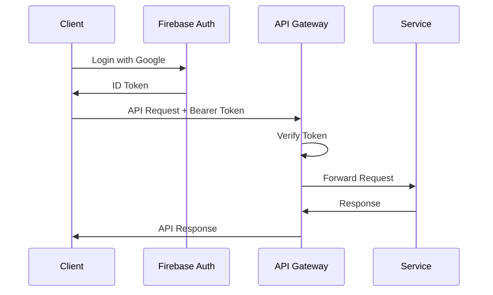
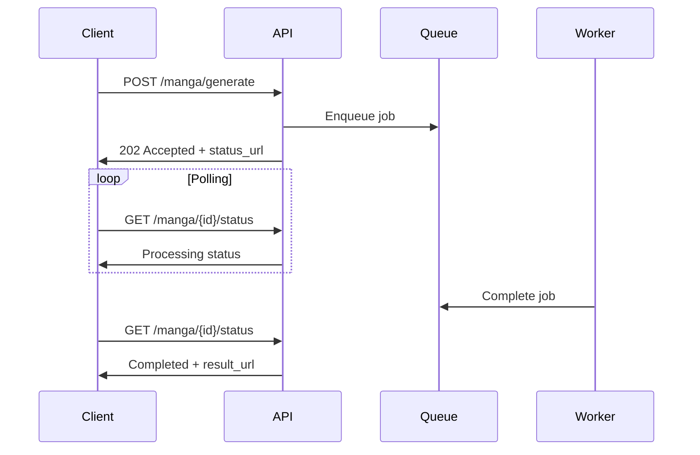

# AI漫画生成サービス API設計書

**文書管理情報**
- 文書ID: API-DOC-001
- 作成日: 2025-01-20
- 版数: 1.0
- 承認者: 根岸祐樹
- 関連文書: SYS-DOC-001（システム設計書）、REQ-DOC-001（要件定義書）

## 目次

- [1. API概要](#1-api概要)
  - [1.1 設計方針](#11-設計方針)
  - [1.2 基本仕様](#12-基本仕様)
- [2. 認証・認可](#2-認証認可)
  - [2.1 認証フロー](#21-認証フロー)
  - [2.2 認可ルール](#22-認可ルール)
- [3. エンドポイント仕様](#3-エンドポイント仕様)
  - [3.1 漫画生成API](#31-漫画生成api)
  - [3.2 作品管理API](#32-作品管理api)
  - [3.3 ユーザー管理API](#33-ユーザー管理api)
  - [3.4 システムAPI](#34-システムapi)
- [4. データモデル](#4-データモデル)
  - [4.1 リクエスト/レスポンス型](#41-リクエストレスポンス型)
  - [4.2 共通型定義](#42-共通型定義)
- [5. エラーハンドリング](#5-エラーハンドリング)
- [6. レート制限](#6-レート制限)
- [7. 非同期処理](#7-非同期処理)
- [8. APIバージョニング](#8-apiバージョニング)

---

## 1. API概要

### 1.1 設計方針

| 項目 | 方針 |
|------|------|
| プロトコル | HTTPS (TLS 1.3) |
| データ形式 | JSON (UTF-8) |
| API形式 | RESTful |
| 認証方式 | Firebase Authentication |
| バージョニング | URLパス方式 |
| エラー形式 | RFC 7807 Problem Details |
| 非同期通知 | ポーリング + SSE + Webhook |

### 1.2 基本仕様

#### ベースURL
```
Production: https://api.manga-service.com/api/v1
Staging: https://staging-api.manga-service.com/api/v1
```

#### 共通ヘッダー

**リクエストヘッダー**
```http
Authorization: Bearer {firebase_id_token}
Content-Type: application/json
Accept: application/json
X-Request-ID: {uuid}
```

**レスポンスヘッダー**
```http
Content-Type: application/json
X-Request-ID: {uuid}
X-RateLimit-Limit: {limit}
X-RateLimit-Remaining: {remaining}
X-RateLimit-Reset: {timestamp}
```

---

## 2. 認証・認可

### 2.1 認証フロー



### 2.2 認可ルール

| ユーザータイプ | 権限 | レート制限 |
|---------------|------|-----------|
| 無料ユーザー | 読取・作成（制限付） | 1作品/日 |
| 有料ユーザー | 読取・作成・更新・削除 | 無制限 |
| 管理者 | 全権限 | 無制限 |

#### Firebase Custom Claims
```json
{
  "user_type": "free|premium|admin",
  "tier": "basic|pro|enterprise",
  "quota": {
    "daily_limit": 1,
    "monthly_limit": 30
  }
}
```

---

## 3. エンドポイント仕様

### 3.1 漫画生成API

#### POST /api/v1/manga/generate
漫画生成リクエストを開始する

**リクエスト**
```json
{
  "title": "string",
  "text": "string (max 50,000 chars)",
  "settings": {
    "style": "realistic|anime|cartoon|sketch|watercolor",
    "pages": "number (10-100)",
    "characters_count": "number (1-5)",
    "color_mode": "full_color|monochrome",
    "language": "ja|en"
  },
  "options": {
    "priority": "normal|high",
    "webhook_url": "string (optional)",
    "auto_publish": "boolean"
  }
}
```

**レスポンス (202 Accepted)**
```json
{
  "request_id": "uuid",
  "status": "queued",
  "estimated_completion_time": "ISO8601",
  "status_url": "/api/v1/manga/{request_id}/status",
  "sse_url": "/api/v1/manga/{request_id}/stream"
}
```

#### GET /api/v1/manga/{request_id}/status
生成状態を取得する

**レスポンス (200 OK)**
```json
{
  "request_id": "uuid",
  "status": "queued|processing|completed|failed",
  "current_phase": 1,
  "total_phases": 8,
  "phase_details": {
    "phase_number": 1,
    "phase_name": "text_analysis",
    "status": "processing",
    "started_at": "ISO8601",
    "estimated_completion": "ISO8601",
    "progress_percentage": 45
  },
  "phases_history": [
    {
      "phase_number": 1,
      "phase_name": "text_analysis",
      "status": "completed",
      "started_at": "ISO8601",
      "completed_at": "ISO8601",
      "duration_seconds": 25
    }
  ],
  "overall_progress": 12.5,
  "started_at": "ISO8601",
  "estimated_completion": "ISO8601",
  "result_url": "/api/v1/manga/{manga_id}"
}
```

#### GET /api/v1/manga/{request_id}/stream
Server-Sent Events による進捗通知

**レスポンス (200 OK)**
```
event: progress
data: {"phase": 1, "status": "processing", "progress": 50}

event: phase_complete
data: {"phase": 1, "duration": 25, "next_phase": 2}

event: complete
data: {"manga_id": "uuid", "url": "/api/v1/manga/{manga_id}"}

event: error
data: {"error": "Processing failed", "phase": 6, "retry_available": true}
```

### 3.2 作品管理API

#### GET /api/v1/manga
ユーザーの作品一覧を取得

**クエリパラメータ**
```
?page=1
&limit=20
&sort=created_at|updated_at|title
&order=asc|desc
&status=all|completed|processing|failed
```

**レスポンス (200 OK)**
```json
{
  "items": [
    {
      "manga_id": "uuid",
      "title": "string",
      "status": "completed",
      "pages": 20,
      "style": "anime",
      "created_at": "ISO8601",
      "updated_at": "ISO8601",
      "thumbnail_url": "string",
      "size_bytes": 10485760
    }
  ],
  "pagination": {
    "page": 1,
    "limit": 20,
    "total_items": 100,
    "total_pages": 5,
    "has_next": true,
    "has_previous": false
  }
}
```

#### GET /api/v1/manga/{manga_id}
特定の作品詳細を取得

**レスポンス (200 OK)**
```json
{
  "manga_id": "uuid",
  "title": "string",
  "status": "completed",
  "metadata": {
    "pages": 20,
    "style": "anime",
    "characters_count": 3,
    "word_count": 5000,
    "processing_time_seconds": 480
  },
  "files": {
    "pdf_url": "string (signed URL)",
    "webp_urls": ["string"],
    "thumbnail_url": "string"
  },
  "created_at": "ISO8601",
  "updated_at": "ISO8601",
  "expires_at": "ISO8601"
}
```

#### PUT /api/v1/manga/{manga_id}
作品情報を更新

**リクエスト**
```json
{
  "title": "string (optional)",
  "description": "string (optional)",
  "tags": ["string"],
  "visibility": "private|public|unlisted"
}
```

**レスポンス (200 OK)**
```json
{
  "manga_id": "uuid",
  "updated_fields": ["title", "tags"],
  "updated_at": "ISO8601"
}
```

#### DELETE /api/v1/manga/{manga_id}
作品を削除

**レスポンス (204 No Content)**
```
(No body)
```

### 3.3 ユーザー管理API

#### GET /api/v1/user/profile
ユーザープロフィール取得

**レスポンス (200 OK)**
```json
{
  "user_id": "string",
  "email": "string",
  "display_name": "string",
  "account_type": "free|premium",
  "quota": {
    "daily_limit": 1,
    "daily_used": 0,
    "monthly_limit": 30,
    "monthly_used": 5,
    "reset_at": "ISO8601"
  },
  "statistics": {
    "total_manga_created": 10,
    "total_pages_generated": 200,
    "average_processing_time": 450
  },
  "created_at": "ISO8601"
}
```

#### GET /api/v1/user/usage
利用状況取得

**レスポンス (200 OK)**
```json
{
  "current_period": {
    "start_date": "2025-01-01",
    "end_date": "2025-01-31",
    "manga_created": 5,
    "api_calls": 150,
    "storage_used_bytes": 52428800
  },
  "daily_usage": [
    {
      "date": "2025-01-20",
      "manga_created": 1,
      "api_calls": 25,
      "processing_time_seconds": 480
    }
  ],
  "quota_status": {
    "daily_remaining": 0,
    "monthly_remaining": 25,
    "next_reset": "ISO8601"
  }
}
```

### 3.4 システムAPI

#### GET /api/v1/health
ヘルスチェック

**レスポンス (200 OK)**
```json
{
  "status": "healthy",
  "version": "1.0.0",
  "timestamp": "ISO8601",
  "services": {
    "database": "healthy",
    "redis": "healthy",
    "storage": "healthy",
    "ai_api": "healthy"
  }
}
```

#### GET /api/v1/system/capabilities
システム機能情報

**レスポンス (200 OK)**
```json
{
  "supported_styles": ["realistic", "anime", "cartoon", "sketch", "watercolor"],
  "max_pages": 100,
  "max_text_length": 50000,
  "max_characters": 5,
  "languages": ["ja", "en"],
  "file_formats": ["pdf", "webp"],
  "processing_time_estimate": {
    "per_1000_chars": 96,
    "base_time": 300
  }
}
```

---

## 4. データモデル

### 4.1 リクエスト/レスポンス型

#### MangaRequest
```typescript
interface MangaRequest {
  title: string;
  text: string;
  settings: MangaSettings;
  options?: MangaOptions;
}

interface MangaSettings {
  style: StyleType;
  pages: number;
  characters_count: number;
  color_mode: ColorMode;
  language: Language;
}

interface MangaOptions {
  priority?: Priority;
  webhook_url?: string;
  auto_publish?: boolean;
}
```

#### MangaResponse
```typescript
interface MangaResponse {
  manga_id: string;
  title: string;
  status: ProcessingStatus;
  metadata: MangaMetadata;
  files: MangaFiles;
  created_at: string;
  updated_at: string;
  expires_at?: string;
}

interface MangaMetadata {
  pages: number;
  style: StyleType;
  characters_count: number;
  word_count: number;
  processing_time_seconds: number;
}

interface MangaFiles {
  pdf_url?: string;
  webp_urls?: string[];
  thumbnail_url?: string;
}
```

### 4.2 共通型定義

#### Enums
```typescript
enum StyleType {
  REALISTIC = "realistic",
  ANIME = "anime",
  CARTOON = "cartoon",
  SKETCH = "sketch",
  WATERCOLOR = "watercolor"
}

enum ProcessingStatus {
  QUEUED = "queued",
  PROCESSING = "processing",
  COMPLETED = "completed",
  FAILED = "failed"
}

enum ColorMode {
  FULL_COLOR = "full_color",
  MONOCHROME = "monochrome"
}

enum Language {
  JAPANESE = "ja",
  ENGLISH = "en"
}

enum Priority {
  NORMAL = "normal",
  HIGH = "high"
}
```

#### Error Response (RFC 7807)
```typescript
interface ProblemDetails {
  type: string;        // URI reference
  title: string;       // Short summary
  status: number;      // HTTP status code
  detail: string;      // Explanation
  instance: string;    // URI reference for specific occurrence
  errors?: ValidationError[];
}

interface ValidationError {
  field: string;
  code: string;
  message: string;
}
```

---

## 5. エラーハンドリング

### 5.1 HTTPステータスコード

| コード | 意味 | 使用場面 |
|--------|------|----------|
| 200 | OK | 正常な取得・更新 |
| 201 | Created | リソース作成成功 |
| 202 | Accepted | 非同期処理受付 |
| 204 | No Content | 削除成功 |
| 400 | Bad Request | バリデーションエラー |
| 401 | Unauthorized | 認証失敗 |
| 403 | Forbidden | 権限不足 |
| 404 | Not Found | リソース不存在 |
| 409 | Conflict | リソース競合 |
| 429 | Too Many Requests | レート制限超過 |
| 500 | Internal Server Error | サーバーエラー |
| 503 | Service Unavailable | メンテナンス中 |

### 5.2 エラーレスポンス例

**400 Bad Request**
```json
{
  "type": "https://api.manga-service.com/errors/validation",
  "title": "Validation Error",
  "status": 400,
  "detail": "The request contains invalid parameters",
  "instance": "/api/v1/manga/generate",
  "errors": [
    {
      "field": "settings.pages",
      "code": "out_of_range",
      "message": "Pages must be between 10 and 100"
    }
  ]
}
```

**429 Too Many Requests**
```json
{
  "type": "https://api.manga-service.com/errors/rate-limit",
  "title": "Rate Limit Exceeded",
  "status": 429,
  "detail": "Daily manga generation limit reached",
  "instance": "/api/v1/manga/generate",
  "retry_after": 86400
}
```

---

## 6. レート制限

### 6.1 制限ルール

| エンドポイント | 無料ユーザー | 有料ユーザー |
|---------------|------------|------------|
| POST /manga/generate | 1/日 | 無制限 |
| GET /manga/* | 100/時 | 1000/時 |
| PUT/DELETE /manga/* | 10/時 | 100/時 |
| GET /user/* | 60/時 | 600/時 |

### 6.2 同時処理制限

| 制限項目 | 値 |
|---------|-----|
| 同時生成数/ユーザー | 1 |
| 同時API呼び出し数 | 10 |
| WebSocket同時接続数 | 3 |

### 6.3 レート制限ヘッダー

```http
X-RateLimit-Limit: 100
X-RateLimit-Remaining: 45
X-RateLimit-Reset: 1705756800
X-RateLimit-Resource: manga_generation
X-RateLimit-Used: 55
```

---

## 7. 非同期処理

### 7.1 ポーリング方式



### 7.2 SSE通知

```javascript
// Client implementation
const eventSource = new EventSource('/api/v1/manga/123/stream');

eventSource.addEventListener('progress', (event) => {
  const data = JSON.parse(event.data);
  console.log(`Phase ${data.phase}: ${data.progress}%`);
});

eventSource.addEventListener('complete', (event) => {
  const data = JSON.parse(event.data);
  console.log(`Completed: ${data.url}`);
  eventSource.close();
});

eventSource.addEventListener('error', (event) => {
  const data = JSON.parse(event.data);
  console.error(`Error: ${data.error}`);
  eventSource.close();
});
```

### 7.3 Webhook通知

**Webhook リクエスト**
```json
{
  "event": "manga.completed",
  "timestamp": "ISO8601",
  "data": {
    "request_id": "uuid",
    "manga_id": "uuid",
    "status": "completed",
    "result_url": "https://api.manga-service.com/api/v1/manga/{id}"
  },
  "signature": "hmac-sha256-signature"
}
```

---

## 8. APIバージョニング

### 8.1 バージョン管理方針

| 項目 | 方針 |
|------|------|
| 形式 | URLパス (/api/v1/) |
| サポート期間 | 最新2バージョン |
| 廃止予告期間 | 6ヶ月 |
| 互換性 | 後方互換性維持 |

### 8.2 バージョン移行

```http
# 廃止予定の通知
Sunset: Sat, 31 Dec 2025 23:59:59 GMT
Deprecation: true
Link: <https://api.manga-service.com/api/v2/manga>; rel="successor-version"
```

### 8.3 変更管理

| バージョン | リリース日 | 主な変更 | サポート終了 |
|-----------|-----------|---------|------------|
| v1 | 2025-03-01 | 初期リリース | - |
| v2 | 2025-09-01 | GraphQL追加（予定） | - |

---

## 改訂履歴

| 版数 | 日付 | 変更内容 | 担当者 |
|------|------|----------|--------|
| 1.0 | 2025-01-20 | 初版作成 | Claude Code |

---

**文書承認**
- APIアーキテクト: [署名] 日付: [日付]
- セキュリティ責任者: [署名] 日付: [日付]
- プロダクトマネージャー: [署名] 日付: [日付]