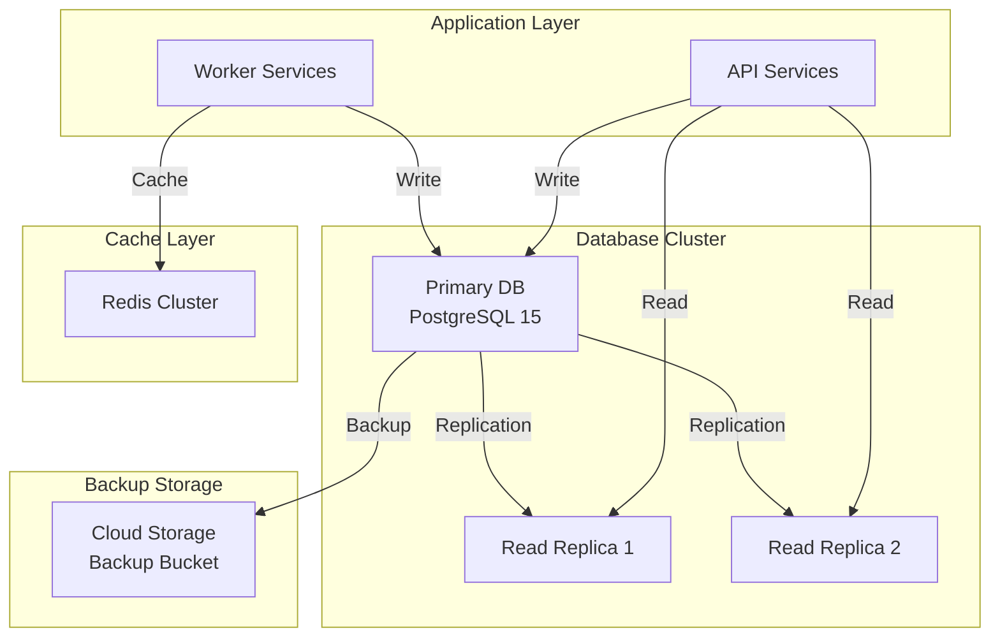
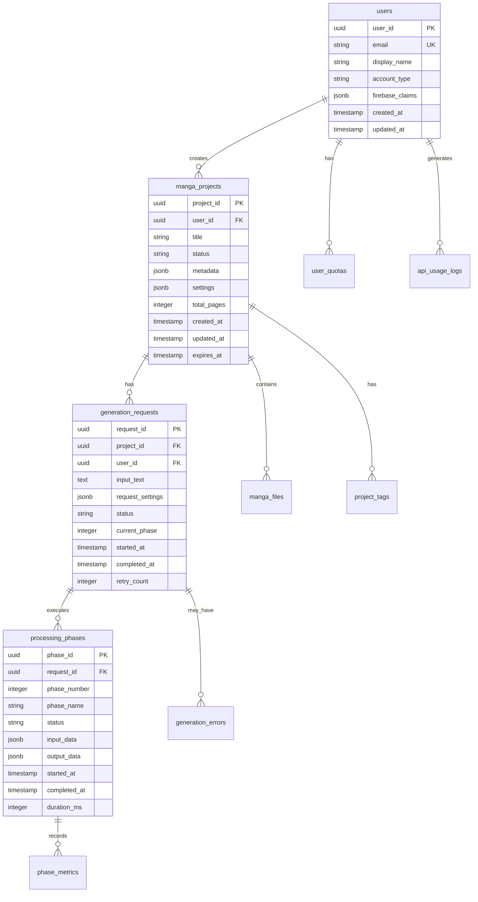

# AI漫画生成サービス データベース設計書

**文書管理情報**
- 文書ID: DB-DOC-001
- 作成日: 2025-01-20
- 版数: 1.0
- 承認者: 根岸祐樹
- 関連文書: SYS-DOC-001（システム設計書）、API-DOC-001（API設計書）

## 目次

- [1. データベース概要](#1-データベース概要)
  - [1.1 設計方針](#11-設計方針)
  - [1.2 システム構成](#12-システム構成)
- [2. データモデル設計](#2-データモデル設計)
  - [2.1 ER図](#21-er図)
  - [2.2 テーブル定義](#22-テーブル定義)
- [3. インデックス設計](#3-インデックス設計)
- [4. パーティショニング設計](#4-パーティショニング設計)
- [5. パフォーマンス設計](#5-パフォーマンス設計)
- [6. セキュリティ設計](#6-セキュリティ設計)
- [7. バックアップ・リカバリ設計](#7-バックアップリカバリ設計)
- [8. マイグレーション計画](#8-マイグレーション計画)

---

## 1. データベース概要

### 1.1 設計方針

| 項目 | 方針 | 理由 |
|------|------|------|
| DBMS | PostgreSQL 15 | JSONB、フルテキスト検索、高い拡張性 |
| データ保存期間 | 無料:30日、有料:無期限 | コスト最適化とサービス差別化 |
| メタデータ管理 | JSONB型で柔軟に保存 | スキーマ変更への対応力 |
| 読み取り負荷分散 | リードレプリカ構成 | 高可用性とパフォーマンス |
| トランザクション | フェーズ単位（8回） | 障害時の部分的復旧可能 |
| 削除方式 | 物理削除 | ストレージコスト最適化 |
| スケーラビリティ | 月次パーティショニング | 大量データの効率的管理 |
| バックアップ | PITR + 日次バックアップ | 柔軟な復旧ポイント |

### 1.2 システム構成



---

## 2. データモデル設計

### 2.1 ER図



### 2.2 テーブル定義

#### users（ユーザー）

| カラム名 | データ型 | 制約 | 説明 |
|---------|---------|------|------|
| user_id | UUID | PRIMARY KEY | ユーザー識別子 |
| email | VARCHAR(255) | UNIQUE, NOT NULL | メールアドレス |
| display_name | VARCHAR(100) | NOT NULL | 表示名 |
| account_type | VARCHAR(20) | NOT NULL, CHECK | free/premium/admin |
| firebase_claims | JSONB | | Firebase Custom Claims |
| created_at | TIMESTAMP | NOT NULL, DEFAULT NOW() | 作成日時 |
| updated_at | TIMESTAMP | NOT NULL, DEFAULT NOW() | 更新日時 |

**インデックス**:
- PRIMARY KEY (user_id)
- UNIQUE INDEX idx_users_email (email)
- INDEX idx_users_account_type (account_type)

#### manga_projects（漫画プロジェクト）

| カラム名 | データ型 | 制約 | 説明 |
|---------|---------|------|------|
| project_id | UUID | PRIMARY KEY | プロジェクト識別子 |
| user_id | UUID | NOT NULL, FOREIGN KEY | ユーザーID |
| title | VARCHAR(255) | NOT NULL | タイトル |
| status | VARCHAR(20) | NOT NULL | completed/processing/failed |
| metadata | JSONB | | メタデータ（スタイル、キャラクター数等） |
| settings | JSONB | | 生成設定 |
| total_pages | INTEGER | | 総ページ数 |
| visibility | VARCHAR(20) | DEFAULT 'private' | private/public/unlisted |
| created_at | TIMESTAMP | NOT NULL, DEFAULT NOW() | 作成日時 |
| updated_at | TIMESTAMP | NOT NULL, DEFAULT NOW() | 更新日時 |
| expires_at | TIMESTAMP | | 有効期限（無料ユーザー用） |

**インデックス**:
- PRIMARY KEY (project_id)
- INDEX idx_projects_user_id (user_id)
- INDEX idx_projects_status (status)
- INDEX idx_projects_created_at (created_at DESC)
- INDEX idx_projects_expires_at (expires_at) WHERE expires_at IS NOT NULL

#### generation_requests（生成リクエスト）

| カラム名 | データ型 | 制約 | 説明 |
|---------|---------|------|------|
| request_id | UUID | PRIMARY KEY | リクエスト識別子 |
| project_id | UUID | FOREIGN KEY | プロジェクトID |
| user_id | UUID | NOT NULL, FOREIGN KEY | ユーザーID |
| input_text | TEXT | NOT NULL | 入力テキスト |
| request_settings | JSONB | NOT NULL | リクエスト設定 |
| status | VARCHAR(20) | NOT NULL | queued/processing/completed/failed |
| current_phase | INTEGER | DEFAULT 0 | 現在のフェーズ番号 |
| priority | VARCHAR(10) | DEFAULT 'normal' | normal/high |
| webhook_url | VARCHAR(500) | | Webhook URL |
| started_at | TIMESTAMP | | 処理開始日時 |
| completed_at | TIMESTAMP | | 処理完了日時 |
| retry_count | INTEGER | DEFAULT 0 | リトライ回数 |
| error_message | TEXT | | エラーメッセージ |

**インデックス**:
- PRIMARY KEY (request_id)
- INDEX idx_requests_project_id (project_id)
- INDEX idx_requests_user_id (user_id)
- INDEX idx_requests_status (status)
- INDEX idx_requests_priority_created (priority DESC, created_at)

#### processing_phases（処理フェーズ）

| カラム名 | データ型 | 制約 | 説明 |
|---------|---------|------|------|
| phase_id | UUID | PRIMARY KEY | フェーズ識別子 |
| request_id | UUID | NOT NULL, FOREIGN KEY | リクエストID |
| phase_number | INTEGER | NOT NULL | フェーズ番号(1-8) |
| phase_name | VARCHAR(50) | NOT NULL | フェーズ名 |
| status | VARCHAR(20) | NOT NULL | pending/processing/completed/failed |
| input_data | JSONB | | 入力データ |
| output_data | JSONB | | 出力データ |
| started_at | TIMESTAMP | | 開始日時 |
| completed_at | TIMESTAMP | | 完了日時 |
| duration_ms | INTEGER | | 処理時間（ミリ秒） |
| retry_count | INTEGER | DEFAULT 0 | リトライ回数 |
| error_details | JSONB | | エラー詳細 |

**インデックス**:
- PRIMARY KEY (phase_id)
- UNIQUE INDEX idx_phases_request_number (request_id, phase_number)
- INDEX idx_phases_status (status)

#### manga_files（漫画ファイル）

| カラム名 | データ型 | 制約 | 説明 |
|---------|---------|------|------|
| file_id | UUID | PRIMARY KEY | ファイル識別子 |
| project_id | UUID | NOT NULL, FOREIGN KEY | プロジェクトID |
| file_type | VARCHAR(20) | NOT NULL | pdf/webp/thumbnail |
| file_path | VARCHAR(500) | NOT NULL | Cloud Storage パス |
| file_size | BIGINT | | ファイルサイズ（バイト） |
| mime_type | VARCHAR(100) | | MIMEタイプ |
| page_number | INTEGER | | ページ番号（WebPの場合） |
| metadata | JSONB | | ファイルメタデータ |
| created_at | TIMESTAMP | NOT NULL, DEFAULT NOW() | 作成日時 |

**インデックス**:
- PRIMARY KEY (file_id)
- INDEX idx_files_project_id (project_id)
- INDEX idx_files_type (file_type)
- INDEX idx_files_page (project_id, page_number) WHERE page_number IS NOT NULL

#### user_quotas（ユーザークォータ）

| カラム名 | データ型 | 制約 | 説明 |
|---------|---------|------|------|
| quota_id | UUID | PRIMARY KEY | クォータ識別子 |
| user_id | UUID | NOT NULL, FOREIGN KEY | ユーザーID |
| quota_type | VARCHAR(20) | NOT NULL | daily/monthly |
| limit_value | INTEGER | NOT NULL | 制限値 |
| used_value | INTEGER | DEFAULT 0 | 使用済み値 |
| reset_at | TIMESTAMP | NOT NULL | リセット日時 |
| created_at | TIMESTAMP | NOT NULL, DEFAULT NOW() | 作成日時 |
| updated_at | TIMESTAMP | NOT NULL, DEFAULT NOW() | 更新日時 |

**インデックス**:
- PRIMARY KEY (quota_id)
- UNIQUE INDEX idx_quotas_user_type (user_id, quota_type)
- INDEX idx_quotas_reset (reset_at)

#### api_usage_logs（API使用ログ）

| カラム名 | データ型 | 制約 | 説明 |
|---------|---------|------|------|
| log_id | UUID | PRIMARY KEY | ログ識別子 |
| user_id | UUID | FOREIGN KEY | ユーザーID |
| endpoint | VARCHAR(255) | NOT NULL | APIエンドポイント |
| method | VARCHAR(10) | NOT NULL | HTTPメソッド |
| status_code | INTEGER | NOT NULL | ステータスコード |
| response_time_ms | INTEGER | | レスポンス時間 |
| request_size | INTEGER | | リクエストサイズ |
| response_size | INTEGER | | レスポンスサイズ |
| ip_address | INET | | IPアドレス |
| user_agent | TEXT | | User-Agent |
| created_at | TIMESTAMP | NOT NULL, DEFAULT NOW() | 作成日時 |

**パーティショニング**: 月次パーティション（created_at）

**インデックス**:
- PRIMARY KEY (log_id, created_at)
- INDEX idx_logs_user_id (user_id, created_at DESC)
- INDEX idx_logs_endpoint (endpoint, created_at DESC)

#### generation_errors（生成エラー）

| カラム名 | データ型 | 制約 | 説明 |
|---------|---------|------|------|
| error_id | UUID | PRIMARY KEY | エラー識別子 |
| request_id | UUID | FOREIGN KEY | リクエストID |
| phase_number | INTEGER | | フェーズ番号 |
| error_code | VARCHAR(50) | NOT NULL | エラーコード |
| error_message | TEXT | NOT NULL | エラーメッセージ |
| error_details | JSONB | | エラー詳細 |
| stack_trace | TEXT | | スタックトレース |
| created_at | TIMESTAMP | NOT NULL, DEFAULT NOW() | 発生日時 |

**インデックス**:
- PRIMARY KEY (error_id)
- INDEX idx_errors_request_id (request_id)
- INDEX idx_errors_code (error_code)

#### phase_metrics（フェーズメトリクス）

| カラム名 | データ型 | 制約 | 説明 |
|---------|---------|------|------|
| metric_id | UUID | PRIMARY KEY | メトリクス識別子 |
| phase_id | UUID | NOT NULL, FOREIGN KEY | フェーズID |
| metric_name | VARCHAR(100) | NOT NULL | メトリクス名 |
| metric_value | NUMERIC | NOT NULL | メトリクス値 |
| unit | VARCHAR(20) | | 単位 |
| created_at | TIMESTAMP | NOT NULL, DEFAULT NOW() | 記録日時 |

**インデックス**:
- PRIMARY KEY (metric_id)
- INDEX idx_metrics_phase_id (phase_id)
- INDEX idx_metrics_name (metric_name)

---

## 3. インデックス設計

### 3.1 インデックス戦略

| テーブル | インデックス | 用途 | 種類 |
|---------|------------|------|------|
| users | email | ログイン時の検索 | UNIQUE |
| manga_projects | (user_id, created_at DESC) | ユーザーの作品一覧 | BTREE |
| manga_projects | expires_at | 期限切れ削除バッチ | BTREE PARTIAL |
| generation_requests | (status, priority DESC, created_at) | キュー処理 | BTREE |
| processing_phases | (request_id, phase_number) | フェーズ順序管理 | UNIQUE |
| api_usage_logs | (user_id, created_at DESC) | 使用状況分析 | BTREE |

### 3.2 パフォーマンス最適化インデックス

```sql
-- 頻繁なクエリ用の複合インデックス
CREATE INDEX idx_projects_user_status_created 
ON manga_projects(user_id, status, created_at DESC);

-- JSONB検索用のGINインデックス
CREATE INDEX idx_projects_metadata_gin 
ON manga_projects USING GIN (metadata);

-- フルテキスト検索用
CREATE INDEX idx_projects_title_fts 
ON manga_projects USING GIN (to_tsvector('japanese', title));

-- 部分インデックス（アクティブなリクエストのみ）
CREATE INDEX idx_requests_active 
ON generation_requests(user_id, created_at DESC) 
WHERE status IN ('queued', 'processing');
```

---

## 4. パーティショニング設計

### 4.1 パーティション戦略

| テーブル | パーティション方式 | パーティションキー | 保持期間 |
|---------|------------------|------------------|----------|
| api_usage_logs | 月次RANGE | created_at | 3ヶ月 |
| generation_errors | 月次RANGE | created_at | 6ヶ月 |
| phase_metrics | 月次RANGE | created_at | 1ヶ月 |

### 4.2 パーティション実装

```sql
-- api_usage_logs の月次パーティショニング
CREATE TABLE api_usage_logs (
    log_id UUID,
    user_id UUID,
    endpoint VARCHAR(255) NOT NULL,
    created_at TIMESTAMP NOT NULL,
    -- other columns
    PRIMARY KEY (log_id, created_at)
) PARTITION BY RANGE (created_at);

-- 月次パーティション作成例
CREATE TABLE api_usage_logs_2025_01 
PARTITION OF api_usage_logs 
FOR VALUES FROM ('2025-01-01') TO ('2025-02-01');

CREATE TABLE api_usage_logs_2025_02 
PARTITION OF api_usage_logs 
FOR VALUES FROM ('2025-02-01') TO ('2025-03-01');

-- 自動パーティション作成関数
CREATE OR REPLACE FUNCTION create_monthly_partitions()
RETURNS void AS $$
DECLARE
    start_date date;
    end_date date;
    partition_name text;
BEGIN
    start_date := date_trunc('month', CURRENT_DATE);
    end_date := start_date + interval '1 month';
    partition_name := 'api_usage_logs_' || to_char(start_date, 'YYYY_MM');
    
    EXECUTE format('CREATE TABLE IF NOT EXISTS %I PARTITION OF api_usage_logs FOR VALUES FROM (%L) TO (%L)',
        partition_name, start_date, end_date);
END;
$$ LANGUAGE plpgsql;

-- 月次で実行するCRONジョブ
SELECT cron.schedule('create-partitions', '0 0 1 * *', 'SELECT create_monthly_partitions();');
```

---

## 5. パフォーマンス設計

### 5.1 クエリ最適化

#### 頻出クエリと最適化

**1. ユーザーの作品一覧取得**
```sql
-- 最適化されたクエリ
SELECT 
    project_id, title, status, total_pages, created_at,
    metadata->>'style' as style
FROM manga_projects
WHERE user_id = $1 
    AND (expires_at IS NULL OR expires_at > NOW())
ORDER BY created_at DESC
LIMIT 20 OFFSET $2;

-- 使用インデックス: idx_projects_user_status_created
```

**2. 処理状況の確認**
```sql
-- 最適化されたクエリ
SELECT 
    r.request_id, r.status, r.current_phase,
    p.phase_name, p.status as phase_status,
    p.started_at, p.duration_ms
FROM generation_requests r
LEFT JOIN processing_phases p 
    ON r.request_id = p.request_id 
    AND p.phase_number = r.current_phase
WHERE r.request_id = $1;

-- 使用インデックス: PRIMARY KEY, idx_phases_request_number
```

### 5.2 接続プール設定

```yaml
Connection Pool Configuration:
  max_connections: 100
  pool_size: 20
  max_overflow: 10
  pool_timeout: 30
  pool_recycle: 3600
  
Read Replica Configuration:
  load_balancing: round_robin
  health_check_period: 10
  retry_on_failure: true
  max_retries: 3
```

### 5.3 キャッシュ戦略

| データ種別 | キャッシュ場所 | TTL | 無効化タイミング |
|-----------|--------------|-----|---------------|
| ユーザー情報 | Redis | 1時間 | 更新時 |
| プロジェクト一覧 | Redis | 5分 | 作成/更新時 |
| 処理状況 | Redis | 10秒 | フェーズ完了時 |
| システム設定 | アプリケーション | 1時間 | デプロイ時 |

---

## 6. セキュリティ設計

### 6.1 アクセス制御

```sql
-- Row Level Security (RLS) の実装
ALTER TABLE manga_projects ENABLE ROW LEVEL SECURITY;

-- ユーザーは自分のプロジェクトのみアクセス可能
CREATE POLICY project_isolation ON manga_projects
    FOR ALL
    USING (user_id = current_setting('app.user_id')::UUID);

-- 管理者は全プロジェクトアクセス可能
CREATE POLICY admin_access ON manga_projects
    FOR ALL
    USING (current_setting('app.user_role') = 'admin');
```

### 6.2 データ暗号化

| 項目 | 暗号化方式 | 実装 |
|------|-----------|------|
| 保存時暗号化 | AES-256 | Cloud SQL自動暗号化 |
| カラムレベル暗号化 | pgcrypto | 個人情報フィールド |
| 接続暗号化 | TLS 1.3 | SSL証明書必須 |
| バックアップ暗号化 | AES-256 | Cloud Storage暗号化 |

### 6.3 監査ログ

```sql
-- 監査トリガーの実装
CREATE TABLE audit_logs (
    audit_id UUID DEFAULT gen_random_uuid(),
    table_name VARCHAR(50),
    operation VARCHAR(10),
    user_id UUID,
    changed_data JSONB,
    created_at TIMESTAMP DEFAULT NOW()
);

CREATE OR REPLACE FUNCTION audit_trigger()
RETURNS trigger AS $$
BEGIN
    INSERT INTO audit_logs (table_name, operation, user_id, changed_data)
    VALUES (TG_TABLE_NAME, TG_OP, current_setting('app.user_id')::UUID,
            to_jsonb(NEW) - to_jsonb(OLD));
    RETURN NEW;
END;
$$ LANGUAGE plpgsql;

-- 重要テーブルに監査トリガー適用
CREATE TRIGGER audit_manga_projects
AFTER INSERT OR UPDATE OR DELETE ON manga_projects
FOR EACH ROW EXECUTE FUNCTION audit_trigger();
```

---

## 7. バックアップ・リカバリ設計

### 7.1 バックアップ戦略

| バックアップ種別 | 頻度 | 保持期間 | 保存先 |
|---------------|------|---------|--------|
| フルバックアップ | 日次（深夜2時） | 30日 | Cloud Storage |
| PITR | 継続的 | 7日 | Cloud SQL内蔵 |
| トランザクションログ | リアルタイム | 7日 | Cloud Storage |
| スナップショット | 週次 | 4週間 | Cloud SQL |

### 7.2 リカバリ手順

```sql
-- Point-in-Time Recovery 実行例
gcloud sql instances restore-backup INSTANCE_NAME \
    --backup-id=BACKUP_ID \
    --restore-point-in-time='2025-01-20T10:30:00Z'

-- 特定テーブルのみリストア
pg_restore -d manga_service \
    -t manga_projects \
    -t generation_requests \
    backup_2025_01_20.dump
```

### 7.3 災害復旧計画

| メトリクス | 目標値 | 実装方法 |
|-----------|--------|----------|
| RPO (Recovery Point Objective) | 1時間 | PITR + レプリケーション |
| RTO (Recovery Time Objective) | 2時間 | 自動フェイルオーバー |
| データ整合性 | 100% | トランザクションログ適用 |

---

## 8. マイグレーション計画

### 8.1 マイグレーション戦略

```yaml
Migration Tool: Flyway
Version Control: Git
Environment:
  - Development: Auto-migrate on deploy
  - Staging: Manual approval required
  - Production: Change window execution
```

### 8.2 マイグレーションファイル構成

```
migrations/
├── V1__initial_schema.sql
├── V2__add_user_quotas.sql
├── V3__add_partitioning.sql
├── V4__add_indexes.sql
└── V5__add_audit_tables.sql
```

### 8.3 ロールバック手順

```sql
-- マイグレーション履歴確認
SELECT * FROM flyway_schema_history ORDER BY installed_rank DESC;

-- ロールバックスクリプト実行
flyway undo -target=V3

-- データ整合性確認
SELECT schemaname, tablename, hasindexes, hasrules, hastriggers
FROM pg_tables WHERE schemaname = 'public';
```

### 8.4 データ削除バッチ

```sql
-- 期限切れデータの自動削除（日次実行）
CREATE OR REPLACE FUNCTION delete_expired_data()
RETURNS void AS $$
BEGIN
    -- 無料ユーザーの30日経過データ削除
    DELETE FROM manga_projects 
    WHERE expires_at < NOW() 
    AND user_id IN (
        SELECT user_id FROM users 
        WHERE account_type = 'free'
    );
    
    -- 古いログデータの削除（3ヶ月以上前）
    DROP TABLE IF EXISTS api_usage_logs_old;
    
    -- 削除統計をログに記録
    INSERT INTO maintenance_logs (operation, affected_rows, executed_at)
    VALUES ('delete_expired_data', ROW_COUNT(), NOW());
END;
$$ LANGUAGE plpgsql;

-- CRONジョブ登録
SELECT cron.schedule('delete-expired', '0 3 * * *', 'SELECT delete_expired_data();');
```

---

## 改訂履歴

| 版数 | 日付 | 変更内容 | 担当者 |
|------|------|----------|--------|
| 1.0 | 2025-01-20 | 初版作成 | Claude Code |

---

**文書承認**
- データベースアーキテクト: [署名] 日付: [日付]
- システムアーキテクト: [署名] 日付: [日付]
- セキュリティ責任者: [署名] 日付: [日付]