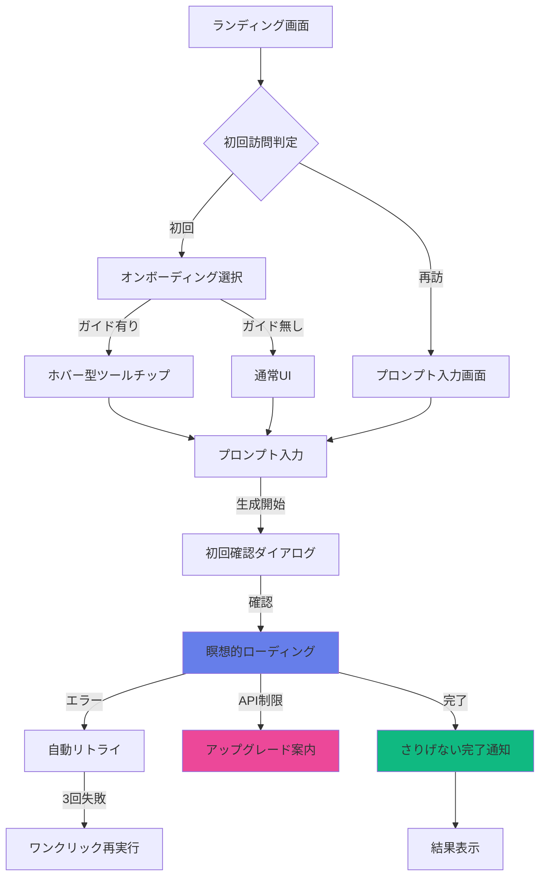
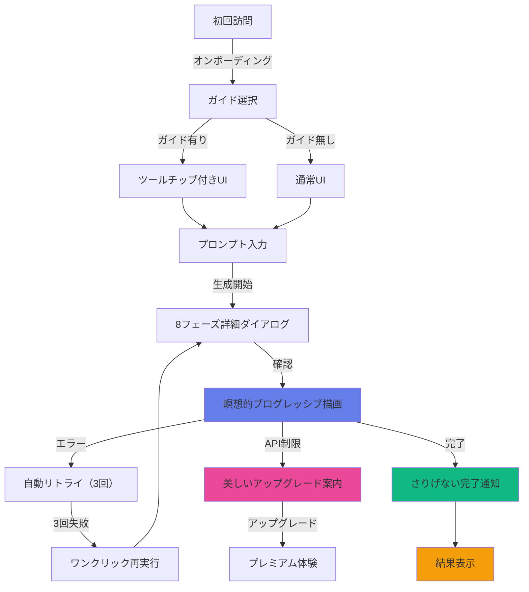

# AI漫画生成サービス UI/UX設計書 統合版

**文書管理情報**
- 文書ID: UI-DOC-003
- 作成日: 2025-01-20
- 版数: 2.0
- 承認者: 根岸祐樹
- 関連文書: API-DOC-001（API設計書）、REQ-DOC-001（要件定義書）
- 統合元: UI-DOC-001（基本設計）、UI-DOC-002（補完設計）

## 目次

- [1. デザイン概要](#1-デザイン概要)
  - [1.1 デザイン哲学](#11-デザイン哲学)
  - [1.2 ユーザー体験方針](#12-ユーザー体験方針)
- [2. デザインシステム](#2-デザインシステム)
  - [2.1 カラーパレット](#21-カラーパレット)
  - [2.2 タイポグラフィ](#22-タイポグラフィ)
  - [2.3 エフェクトライブラリ](#23-エフェクトライブラリ)
- [3. ユーザージャーニー](#3-ユーザージャーニー)
  - [3.1 初回訪問フロー](#31-初回訪問フロー)
  - [3.2 生成体験フロー](#32-生成体験フロー)
  - [3.3 結果確認フロー](#33-結果確認フロー)
- [4. 画面設計](#4-画面設計)
  - [4.1 ランディングページ](#41-ランディングページ)
  - [4.2 生成ワークスペース](#42-生成ワークスペース)
  - [4.3 結果ビューアー](#43-結果ビューアー)
  - [4.4 ギャラリー](#44-ギャラリー)
- [5. コンポーネント設計](#5-コンポーネント設計)
  - [5.1 基本コンポーネント](#51-基本コンポーネント)
  - [5.2 インタラクティブ要素](#52-インタラクティブ要素)
  - [5.3 アニメーション仕様](#53-アニメーション仕様)
- [6. エラー状態・リカバリー設計](#6-エラー状態リカバリー設計)
  - [6.1 自動リトライシステム](#61-自動リトライシステム)
  - [6.2 ワンクリック再実行](#62-ワンクリック再実行)
  - [6.3 美しいアップグレード案内](#63-美しいアップグレード案内)
- [7. オンボーディング・チュートリアル設計](#7-オンボーディングチュートリアル設計)
  - [7.1 ホバー型ツールチップ](#71-ホバー型ツールチップ)
  - [7.2 初回確認ダイアログ](#72-初回確認ダイアログ)
  - [7.3 初回選択式ガイド](#73-初回選択式ガイド)
- [8. 通知・フィードバックシステム設計](#8-通知フィードバックシステム設計)
  - [8.1 瞑想的プログレッシブ描画](#81-瞑想的プログレッシブ描画)
  - [8.2 さりげない完了通知](#82-さりげない完了通知)
  - [8.3 バックグラウンド通知システム](#83-バックグラウンド通知システム)
- [9. レスポンシブ設計](#9-レスポンシブ設計)
- [10. アクセシビリティ設計](#10-アクセシビリティ設計)
- [11. パフォーマンス設計](#11-パフォーマンス設計)
- [12. 実装仕様](#12-実装仕様)

---

## 1. デザイン概要

### 1.1 デザイン哲学

#### 核心原則
```
🎨 Visual Magic First: 美しさと魔法的体験が最優先
⚡ One-Touch Creation: 最小限のタッチで最大の創造
🌙 Immersive Dark: 作品が輝くダークテーマ
✨ Progressive Revelation: 徐々に明かされる結果
🎯 Intuitive for Beginners: 初心者でも直感的に操作
```

#### Skyreels風体験設計
- **フルスクリーン没入感**: ヘッダー・サイドバーレス設計
- **ワンクリック魔法**: 複雑な設定を完全に隠蔽
- **リアルタイム描画**: ぼやけた状態から鮮明に変化
- **瞑想的ローディング**: 時間を忘れる美しい待機体験

### 1.2 ユーザー体験方針

| 設計方針 | 実装戦略 |
|---------|---------|
| 初心者中心 | プリセット重視、設定項目を3つ以下に制限 |
| 徹底的シンプル | アドバンス設定は隠しメニューに格納 |
| WebGL視覚体験 | Three.js活用、デスクトップで60fps維持 |
| モバイル軽量化 | コアエフェクトのみ、30fps目標 |
| プログレッシブ描画 | リアルタイム品質向上表示 |
| 瞑想的ローディング | プログレッシブ描画シミュレーション |
| 補助的ソーシャル | シェア・いいね・保存機能のみ |

---

## 2. デザインシステム

### 2.1 カラーパレット

#### ダークテーマ（Skyreels風）
```css
:root {
  /* 背景階層 */
  --bg-void: #0A0A0B;          /* 最深部 */
  --bg-surface: #111113;       /* カード背景 */
  --bg-elevated: #1A1A1F;      /* 浮上要素 */
  --bg-interactive: #242429;   /* ボタン背景 */
  
  /* アクセント - マジカルグラデーション */
  --accent-primary: linear-gradient(135deg, #667EEA 0%, #764BA2 100%);
  --accent-purple: #7C3AED;
  --accent-pink: #EC4899;
  --accent-cyan: #06B6D4;
  
  /* ネオンエフェクト */
  --neon-purple: #A855F7;
  --neon-pink: #F472B6;
  --neon-cyan: #22D3EE;
  --neon-glow: 0 0 20px var(--neon-purple);
  
  /* テキスト */
  --text-primary: #FFFFFF;
  --text-secondary: #D1D5DB;
  --text-muted: #9CA3AF;
  --text-placeholder: #6B7280;
  
  /* グラスモーフィズム */
  --glass-bg: rgba(255, 255, 255, 0.08);
  --glass-border: rgba(255, 255, 255, 0.12);
  --glass-backdrop: blur(24px);
  
  /* エラー・成功 */
  --success: #10B981;
  --warning: #F59E0B;
  --error: #EF4444;
}
```

#### カラー使用ガイドライン
| 用途 | カラー | 使用場面 |
|------|-------|---------|
| メインCTA | accent-primary | 生成ボタン、重要アクション |
| セカンダリCTA | bg-interactive | 設定、編集ボタン |
| ネオンアクセント | neon-purple | ホバー、フォーカス |
| 状態表示 | success/warning/error | ステータス、通知 |

### 2.2 タイポグラフィ

#### フォントファミリー
```css
:root {
  /* 日本語 + 英語フォント */
  --font-primary: 'Noto Sans JP', -apple-system, BlinkMacSystemFont, sans-serif;
  --font-display: 'Noto Sans JP', 'Helvetica Neue', sans-serif;
  --font-mono: 'JetBrains Mono', 'Menlo', monospace;
  
  /* ウェイト */
  --weight-light: 300;
  --weight-regular: 400;
  --weight-medium: 500;
  --weight-bold: 700;
  --weight-black: 900;
}
```

#### テキストスケール
```css
/* デスクトップサイズ */
.text-hero { font-size: 3.5rem; line-height: 1.1; font-weight: var(--weight-black); }
.text-title { font-size: 2.25rem; line-height: 1.2; font-weight: var(--weight-bold); }
.text-subtitle { font-size: 1.5rem; line-height: 1.3; font-weight: var(--weight-medium); }
.text-body { font-size: 1rem; line-height: 1.5; font-weight: var(--weight-regular); }
.text-caption { font-size: 0.875rem; line-height: 1.4; font-weight: var(--weight-regular); }
.text-micro { font-size: 0.75rem; line-height: 1.3; font-weight: var(--weight-medium); }

/* モバイルサイズ（自動縮小） */
@media (max-width: 768px) {
  .text-hero { font-size: 2.5rem; }
  .text-title { font-size: 1.875rem; }
  .text-subtitle { font-size: 1.25rem; }
}
```

### 2.3 エフェクトライブラリ

#### グラスモーフィズム
```css
.glass-card {
  background: var(--glass-bg);
  backdrop-filter: var(--glass-backdrop);
  border: 1px solid var(--glass-border);
  border-radius: 24px;
  box-shadow: 
    0 8px 32px rgba(0, 0, 0, 0.3),
    inset 0 1px 0 rgba(255, 255, 255, 0.1);
}

.glass-button {
  background: var(--glass-bg);
  backdrop-filter: var(--glass-backdrop);
  border: 1px solid var(--glass-border);
  transition: all 0.3s cubic-bezier(0.4, 0, 0.2, 1);
}

.glass-button:hover {
  background: rgba(255, 255, 255, 0.12);
  transform: translateY(-2px);
  box-shadow: 0 12px 40px rgba(0, 0, 0, 0.4);
}
```

#### ネオンエフェクト
```css
.neon-glow {
  position: relative;
  color: var(--text-primary);
  text-shadow: 0 0 10px var(--neon-purple);
}

.neon-glow::before {
  content: '';
  position: absolute;
  top: -2px;
  left: -2px;
  right: -2px;
  bottom: -2px;
  background: var(--accent-primary);
  border-radius: inherit;
  filter: blur(20px);
  opacity: 0.7;
  z-index: -1;
  animation: neon-pulse 2s ease-in-out infinite alternate;
}

@keyframes neon-pulse {
  from { opacity: 0.7; filter: blur(20px); }
  to { opacity: 1; filter: blur(10px); }
}
```

#### 3D変形エフェクト
```css
.card-3d {
  perspective: 1000px;
  transition: transform 0.3s ease;
}

.card-3d:hover {
  transform: 
    perspective(1000px)
    rotateY(10deg)
    rotateX(5deg)
    scale(1.05);
}

.float-animation {
  animation: float 6s ease-in-out infinite;
}

@keyframes float {
  0%, 100% { 
    transform: translateY(0px) rotate(-1deg); 
  }
  50% { 
    transform: translateY(-20px) rotate(1deg); 
  }
}
```

---

## 3. ユーザージャーニー

### 3.1 初回訪問フロー



#### タイムライン詳細
| 時間 | アクション | UI表現 | 目標 |
|------|-----------|--------|------|
| 0-3秒 | ページロード | フルスクリーンヒーロー | 第一印象でインパクト |
| 3-5秒 | オンボーディング選択 | 美しい選択ダイアログ | ユーザー体験レベル判定 |
| 5-30秒 | プロンプト入力 | ツールチップ付き入力 | 創作意欲を喚起 |
| 30秒 | 確認ダイアログ | 8フェーズ詳細説明 | 期待値設定 |
| 30秒-10分 | 生成処理 | プログレッシブ描画 | 瞑想的待機体験 |
| 10分後 | 結果確認 | さりげない通知 | 満足感と達成感 |

### 3.2 生成体験フロー

#### プロンプト入力段階
```typescript
interface PromptInputFlow {
  step1: {
    component: "MagicPromptInput";
    placeholder: "あなたの物語を始めよう...";
    autoSuggestions: true;
    characterLimit: 50000;
    tooltip: "物語のあらすじを自由に書いてください。詳しく書くほど良い結果が得られます。";
  };
  step2: {
    component: "StyleQuickPicker";
    presets: ["少年漫画", "少女漫画", "青年向け", "アメコミ"];
    defaultSelected: "少年漫画";
    tooltip: "漫画のスタイルを選択できます。迷った場合は「少年漫画」がおすすめです。";
  };
  step3: {
    component: "OneClickGenerate";
    ctaText: "✨ 魔法を始める";
    estimatedTime: "約8分";
    tooltip: "クリックすると約8分で漫画が完成します。処理中は他のタブを開いても大丈夫です。";
  };
}
```

#### 生成プロセス表示
```typescript
interface GenerationProcess {
  phases: [
    { name: "あなたの物語に耳を傾けています...", duration: "30秒", visual: "text-wave" },
    { name: "物語の骨格を組み立てています...", duration: "60秒", visual: "structure-grid" },
    { name: "シーンの境界を見つけています...", duration: "60秒", visual: "scene-blocks" },
    { name: "キャラクターに命を吹き込んでいます...", duration: "60秒", visual: "character-silhouettes" },
    { name: "コマの配置を丁寧に設計しています...", duration: "60秒", visual: "panel-layout" },
    { name: "画像に魂を込めています...", duration: "180秒", visual: "image-formation" },
    { name: "言葉に最適な場所を見つけています...", duration: "60秒", visual: "dialog-bubbles" },
    { name: "最後の魔法をかけています...", duration: "120秒", visual: "final-composition" }
  ];
  visualization: "ProgressiveReveal";
  timeDisplay: false; // 実時間表示なし
  soundEffects: false; // 完全無音
}
```

### 3.3 結果確認フロー

#### ドラマチック表示
```typescript
interface ResultReveal {
  entrance: {
    animation: "FadeBlurToSharp";
    duration: "2s";
    easing: "cubic-bezier(0.4, 0, 0.2, 1)";
  };
  notification: {
    type: "subtle-banner";
    position: "top-right";
    autoHide: 6000; // 6秒後自動非表示
    message: "漫画が完成しました";
  };
  interaction: {
    pageFlip: "3D";
    zoom: "SmoothScale";
    fullscreen: "SlideUp";
  };
  actions: {
    primary: "ダウンロード";
    secondary: ["編集", "シェア", "再生成"];
  };
}
```

---

## 4. 画面設計

### 4.1 ランディングページ

#### レイアウト構成
```html
<div class="landing-container">
  <!-- フルスクリーンヒーロー -->
  <section class="hero-section">
    <div class="background-animation">
      <!-- WebGLパーティクル背景 -->
      <canvas id="particle-canvas"></canvas>
    </div>
    
    <div class="hero-content">
      <h1 class="hero-title neon-glow">
        AIが描く、あなただけの漫画
      </h1>
      <p class="hero-subtitle">
        物語を入力するだけで、プロ級の漫画が完成
      </p>
      
      <button class="cta-primary glass-button">
        <span>今すぐ試す</span>
        <span class="cta-arrow">→</span>
      </button>
    </div>
    
    <!-- 浮遊するサンプル作品 -->
    <div class="floating-samples">
      <div class="sample-card float-animation" style="--delay: 0s">
        
      </div>
      <div class="sample-card float-animation" style="--delay: 2s">
        
      </div>
      <div class="sample-card float-animation" style="--delay: 4s">
        
      </div>
    </div>
  </section>
  
  <!-- 機能紹介（スクロール時表示） -->
  <section class="features-section">
    <div class="feature-grid">
      <div class="feature-card glass-card">
        <div class="feature-icon">⚡</div>
        <h3>ワンクリック生成</h3>
        <p>複雑な設定は不要。プロンプトを入力するだけ</p>
      </div>
      
      <div class="feature-card glass-card">
        <div class="feature-icon">🎨</div>
        <h3>プロ級の仕上がり</h3>
        <p>Google最新AIによる高品質な画像生成</p>
      </div>
      
      <div class="feature-card glass-card">
        <div class="feature-icon">📱</div>
        <h3>どこでも作成</h3>
        <p>スマホからデスクトップまで完全対応</p>
      </div>
    </div>
  </section>
</div>
```

### 4.2 生成ワークスペース

#### レイアウト構成
```html
<div class="workspace-container">
  <!-- オンボーディング選択（初回のみ） -->
  <div class="onboarding-choice-modal glass-card" id="onboarding-modal">
    <div class="choice-header">
      <h2>ようこそ！</h2>
      <p>AI漫画生成サービスを始めましょう</p>
    </div>
    
    <div class="choice-options">
      <button class="choice-option with-guide" onclick="startWithGuide()">
        <div class="option-icon">🗺️</div>
        <h3>ガイド付きで始める</h3>
        <p>各機能の説明を見ながら進める</p>
        <span class="recommended">おすすめ</span>
      </button>
      
      <button class="choice-option without-guide" onclick="startExpertMode()">
        <div class="option-icon">⚡</div>
        <h3>すぐに始める</h3>
        <p>説明なしで即座に漫画生成</p>
      </button>
    </div>
  </div>

  <!-- 中央のプロンプト入力エリア -->
  <div class="prompt-workspace">
    <div class="prompt-input-container glass-card" data-tooltip="prompt-input">
      <textarea 
        class="magic-prompt-input"
        placeholder="主人公は高校生の剣士。魔王を倒すため仲間と共に冒険に出る..."
        maxlength="50000"
      ></textarea>
      
      <div class="input-tools">
        <div class="character-count">
          <span>2,847</span> / 50,000文字
        </div>
        <button class="ai-assist-btn glass-button">
          <span>✨ AI補完</span>
        </button>
      </div>
    </div>
    
    <!-- スタイル選択（下部） -->
    <div class="style-picker" data-tooltip="style-picker">
      <div class="style-pills">
        <button class="style-pill active">少年漫画</button>
        <button class="style-pill">少女漫画</button>
        <button class="style-pill">青年向け</button>
        <button class="style-pill">アメコミ</button>
        <button class="style-pill">水彩風</button>
      </div>
    </div>
    
    <!-- 生成ボタン -->
    <div class="generate-section">
      <button class="generate-btn neon-glow" data-tooltip="generate-button">
        <span class="btn-icon">✨</span>
        <span class="btn-text">魔法を始める</span>
        <span class="btn-time">約8分</span>
      </button>
    </div>
  </div>
</div>
```

### 4.3 結果ビューアー

#### プログレッシブ表示
```html
<div class="result-viewer">
  <!-- 生成中の表示 -->
  <div class="generation-progress" v-if="isGenerating">
    <div class="progress-canvas">
      <!-- リアルタイムプログレッシブ描画 -->
      <canvas id="progressive-canvas"></canvas>
      <div class="progress-overlay">
        <div class="current-phase">
          <h3 id="phase-message">あなたの物語に耳を傾けています...</h3>
          <div class="phase-progress">
            <div class="progress-bar glass-card">
              <div class="progress-fill" :style="{ width: progress + '%' }"></div>
            </div>
          </div>
        </div>
      </div>
    </div>
  </div>
  
  <!-- 完成時の表示 -->
  <div class="manga-viewer" v-else>
    <div class="viewer-container">
      <!-- ページビューアー -->
      <div class="page-viewer">
        <div class="page-container" v-for="(page, index) in mangaPages" :key="index">
          
        </div>
      </div>
      
      <!-- コントロールドック -->
      <div class="viewer-controls glass-card">
        <button class="control-btn" @click="previousPage">
          <span>←</span>
        </button>
        
        <div class="page-indicator">
          <span>{{ currentPage }}</span> / <span>{{ totalPages }}</span>
        </div>
        
        <button class="control-btn" @click="nextPage">
          <span>→</span>
        </button>
        
        <button class="control-btn" @click="toggleFullscreen">
          <span>⛶</span>
        </button>
        
        <button class="control-btn" @click="downloadManga">
          <span>⬇</span>
        </button>
      </div>
    </div>
    
    <!-- アクションパネル -->
    <div class="action-panel glass-card">
      <button class="action-btn primary">
        <span>📁 ダウンロード</span>
      </button>
      <button class="action-btn secondary">
        <span>✏️ 編集</span>
      </button>
      <button class="action-btn secondary">
        <span>🔄 再生成</span>
      </button>
      <button class="action-btn secondary">
        <span>📤 シェア</span>
      </button>
    </div>
  </div>
</div>
```

### 4.4 ギャラリー

#### Masonry Grid レイアウト
```html
<div class="gallery-container">
  <div class="gallery-header">
    <h2 class="gallery-title">あなたの作品</h2>
    <div class="gallery-filters">
      <button class="filter-btn active">すべて</button>
      <button class="filter-btn">最近の作品</button>
      <button class="filter-btn">お気に入り</button>
    </div>
  </div>
  
  <div class="masonry-grid" id="gallery-grid">
    <div class="manga-card glass-card" v-for="manga in mangaList" :key="manga.id">
      <div class="card-media">
        
        <div class="card-overlay">
          <div class="quick-actions">
            <button class="quick-btn" @click="viewManga(manga)">
              <span>👁</span>
            </button>
            <button class="quick-btn" @click="editManga(manga)">
              <span>✏️</span>
            </button>
            <button class="quick-btn" @click="shareManga(manga)">
              <span>📤</span>
            </button>
            <button class="quick-btn" @click="deleteManga(manga)">
              <span>🗑</span>
            </button>
          </div>
        </div>
      </div>
      
      <div class="card-content">
        <h3 class="manga-title">{{ manga.title }}</h3>
        <div class="manga-meta">
          <span class="page-count">{{ manga.pages }}ページ</span>
          <span class="created-date">{{ formatDate(manga.createdAt) }}</span>
        </div>
        <div class="manga-tags">
          <span class="tag" v-for="tag in manga.tags" :key="tag">{{ tag }}</span>
        </div>
      </div>
    </div>
  </div>
  
  <!-- 無限スクロール用ローダー -->
  <div class="loading-more" v-if="isLoadingMore">
    <div class="loading-spinner"></div>
    <span>作品を読み込み中...</span>
  </div>
</div>
```

---

## 5. コンポーネント設計

### 5.1 基本コンポーネント

#### Button Component
```typescript
interface ButtonProps {
  variant: 'primary' | 'secondary' | 'ghost' | 'neon';
  size: 'sm' | 'md' | 'lg' | 'xl';
  icon?: string;
  loading?: boolean;
  glow?: boolean;
  children: ReactNode;
  onClick?: () => void;
}

const Button: React.FC<ButtonProps> = ({ 
  variant = 'primary', 
  size = 'md', 
  icon, 
  loading, 
  glow,
  children, 
  onClick 
}) => {
  const baseClasses = 'btn transition-all duration-300 ease-out';
  const variantClasses = {
    primary: 'btn-primary neon-glow',
    secondary: 'btn-secondary glass-button',
    ghost: 'btn-ghost',
    neon: 'btn-neon'
  };
  const sizeClasses = {
    sm: 'btn-sm',
    md: 'btn-md', 
    lg: 'btn-lg',
    xl: 'btn-xl'
  };
  
  return (
    <button 
      className={`${baseClasses} ${variantClasses[variant]} ${sizeClasses[size]} ${glow ? 'glow-effect' : ''}`}
      onClick={onClick}
      disabled={loading}
    >
      {loading && <Spinner className="btn-spinner" />}
      {icon && <Icon name={icon} />}
      <span>{children}</span>
    </button>
  );
};
```

#### Glass Card Component
```typescript
interface GlassCardProps {
  children: ReactNode;
  hover?: boolean;
  glow?: boolean;
  className?: string;
}

const GlassCard: React.FC<GlassCardProps> = ({ 
  children, 
  hover = false, 
  glow = false, 
  className = '' 
}) => {
  return (
    <div className={`
      glass-card 
      ${hover ? 'hover-lift' : ''} 
      ${glow ? 'neon-border' : ''} 
      ${className}
    `}>
      {children}
    </div>
  );
};
```

### 5.2 インタラクティブ要素

#### Progressive Image Component
```typescript
interface ProgressiveImageProps {
  src: string;
  alt: string;
  blur?: boolean;
  quality?: number;
  onLoad?: () => void;
}

const ProgressiveImage: React.FC<ProgressiveImageProps> = ({ 
  src, 
  alt, 
  blur = false, 
  quality = 100,
  onLoad 
}) => {
  const [loaded, setLoaded] = useState(false);
  const [currentQuality, setCurrentQuality] = useState(blur ? 10 : quality);
  
  useEffect(() => {
    if (blur && currentQuality < quality) {
      const timer = setTimeout(() => {
        setCurrentQuality(Math.min(currentQuality + 10, quality));
      }, 100);
      return () => clearTimeout(timer);
    }
  }, [currentQuality, quality, blur]);
  
  return (
    <div className="progressive-image">
       {
          setLoaded(true);
          onLoad?.();
        }}
      />
    </div>
  );
};
```

#### Magic Prompt Input
```typescript
interface MagicPromptInputProps {
  value: string;
  onChange: (value: string) => void;
  placeholder?: string;
  maxLength?: number;
  autoSuggestions?: boolean;
}

const MagicPromptInput: React.FC<MagicPromptInputProps> = ({
  value,
  onChange,
  placeholder = "あなたの物語を始めよう...",
  maxLength = 50000,
  autoSuggestions = true
}) => {
  const [suggestions, setSuggestions] = useState<string[]>([]);
  const [showSuggestions, setShowSuggestions] = useState(false);
  
  const handleInputChange = (e: React.ChangeEvent<HTMLTextAreaElement>) => {
    const newValue = e.target.value;
    onChange(newValue);
    
    if (autoSuggestions && newValue.length > 10) {
      // AI補完ロジック
      generateSuggestions(newValue).then(setSuggestions);
      setShowSuggestions(true);
    }
  };
  
  return (
    <div className="magic-prompt-container">
      <textarea
        value={value}
        onChange={handleInputChange}
        placeholder={placeholder}
        maxLength={maxLength}
        className="magic-prompt-input"
      />
      
      {showSuggestions && suggestions.length > 0 && (
        <div className="suggestions-panel glass-card">
          {suggestions.map((suggestion, index) => (
            <button
              key={index}
              className="suggestion-item"
              onClick={() => {
                onChange(value + suggestion);
                setShowSuggestions(false);
              }}
            >
              {suggestion}
            </button>
          ))}
        </div>
      )}
      
      <div className="input-footer">
        <span className="character-count">
          {value.length} / {maxLength}
        </span>
        <button className="ai-assist-btn glass-button">
          ✨ AI補完
        </button>
      </div>
    </div>
  );
};
```

### 5.3 アニメーション仕様

#### エントランスアニメーション
```css
/* ページロード時 */
@keyframes pageEnter {
  0% {
    opacity: 0;
    transform: translateY(40px) scale(0.95);
    filter: blur(10px);
  }
  100% {
    opacity: 1;
    transform: translateY(0) scale(1);
    filter: blur(0);
  }
}

/* カード表示 */
@keyframes cardReveal {
  0% {
    opacity: 0;
    transform: translateY(20px) rotateX(-15deg);
  }
  100% {
    opacity: 1;
    transform: translateY(0) rotateX(0);
  }
}

/* プログレッシブ描画 */
@keyframes progressiveReveal {
  0% {
    filter: blur(40px);
    opacity: 0.3;
    transform: scale(1.1);
  }
  50% {
    filter: blur(10px);
    opacity: 0.7;
    transform: scale(1.05);
  }
  100% {
    filter: blur(0);
    opacity: 1;
    transform: scale(1);
  }
}
```

#### ホバーエフェクト
```css
.card-3d {
  transition: transform 0.3s cubic-bezier(0.4, 0, 0.2, 1);
}

.card-3d:hover {
  transform: 
    perspective(1000px) 
    rotateY(8deg) 
    rotateX(4deg) 
    scale(1.02) 
    translateZ(20px);
}

.hover-lift {
  transition: all 0.3s ease;
}

.hover-lift:hover {
  transform: translateY(-8px);
  box-shadow: 0 20px 40px rgba(0, 0, 0, 0.3);
}
```

---

## 6. エラー状態・リカバリー設計

### 6.1 自動リトライシステム

#### 実装仕様
```typescript
interface AutoRetryConfig {
  maxRetries: 3;
  retryInterval: 30000; // 30秒
  seamlessExperience: true; // ユーザーは気づかない
  progressContinuation: true; // 進捗表示継続
}

class ErrorRecoveryManager {
  private retryCount = 0;
  private lastError: Error | null = null;
  
  async handleGenerationError(error: Error, context: GenerationContext) {
    this.lastError = error;
    
    if (this.canRetry(error) && this.retryCount < 3) {
      await this.scheduleRetry(context);
    } else {
      this.showRetryButton(context);
    }
  }
  
  private async scheduleRetry(context: GenerationContext) {
    this.retryCount++;
    
    // 30秒後に自動リトライ（ユーザーには通知しない）
    setTimeout(async () => {
      await this.executeRetry(context);
    }, 30000);
  }
  
  private canRetry(error: Error): boolean {
    const retryableErrors = [
      'AI_SERVICE_TIMEOUT',
      'RATE_LIMIT_TEMPORARY',
      'NETWORK_ERROR',
      'PROCESSING_ERROR'
    ];
    
    return retryableErrors.includes(error.code);
  }
}
```

### 6.2 ワンクリック再実行

#### デザイン仕様
```html
<div class="retry-interface glass-card">
  <div class="retry-icon">
    <div class="magic-sparkle">✨</div>
  </div>
  
  <h3 class="retry-title">もう一度挑戦してみましょう</h3>
  <p class="retry-message">
    同じ設定でもう一度生成します。<br>
    少し違った結果になる場合があります。
  </p>
  
  <!-- 元の生成ボタンと同じ位置・デザイン -->
  <button class="retry-button neon-glow" onclick="retryGeneration()">
    <span class="btn-icon">🔄</span>
    <span class="btn-text">同じ設定で再実行</span>
  </button>
  
  <button class="edit-settings-button glass-button">
    <span>設定を変更する</span>
  </button>
</div>
```

```css
.retry-interface {
  position: absolute;
  top: 50%;
  left: 50%;
  transform: translate(-50%, -50%);
  text-align: center;
  padding: 3rem;
  max-width: 400px;
}

.retry-button {
  /* 元の生成ボタンと同じスタイル */
  background: var(--accent-primary);
  padding: 1.5rem 3rem;
  border-radius: 16px;
  font-size: 1.25rem;
  font-weight: var(--weight-bold);
  margin: 1rem 0;
}

.magic-sparkle {
  font-size: 3rem;
  animation: sparkle 2s ease-in-out infinite;
}

@keyframes sparkle {
  0%, 100% { transform: scale(1) rotate(0deg); opacity: 0.8; }
  50% { transform: scale(1.2) rotate(180deg); opacity: 1; }
}
```

### 6.3 美しいアップグレード案内

#### モーダルデザイン
```html
<div class="upgrade-modal-overlay">
  <div class="upgrade-modal glass-card">
    <div class="modal-background">
      <!-- WebGLパーティクル背景 -->
      <canvas id="upgrade-particles"></canvas>
    </div>
    
    <div class="modal-content">
      <div class="upgrade-icon">
        <div class="premium-crown">👑</div>
      </div>
      
      <h2 class="upgrade-title">
        プレミアム体験へようこそ
      </h2>
      
      <p class="upgrade-subtitle">
        今日の無料枠をご利用いただきありがとうございます
      </p>
      
      <div class="upgrade-benefits">
        <div class="benefit-item">
          <span class="benefit-icon">⚡</span>
          <span>無制限の生成</span>
        </div>
        <div class="benefit-item">
          <span class="benefit-icon">🎨</span>
          <span>高品質モード</span>
        </div>
        <div class="benefit-item">
          <span class="benefit-icon">🚀</span>
          <span>優先処理</span>
        </div>
      </div>
      
      <div class="upgrade-actions">
        <button class="upgrade-primary-btn neon-glow">
          <span>プレミアムを始める</span>
          <span class="btn-price">¥980/月</span>
        </button>
        
        <button class="upgrade-secondary-btn glass-button">
          <span>明日また試す</span>
        </button>
      </div>
      
      <div class="reset-timer">
        <span>無料枠リセットまで</span>
        <div class="countdown">
          <span id="hours">10</span>:
          <span id="minutes">32</span>:
          <span id="seconds">45</span>
        </div>
      </div>
    </div>
  </div>
</div>
```

```css
.upgrade-modal-overlay {
  position: fixed;
  top: 0;
  left: 0;
  right: 0;
  bottom: 0;
  background: rgba(0, 0, 0, 0.8);
  backdrop-filter: blur(10px);
  display: flex;
  align-items: center;
  justify-content: center;
  z-index: 1000;
  animation: fadeIn 0.3s ease-out;
}

.upgrade-modal {
  position: relative;
  max-width: 500px;
  padding: 3rem;
  text-align: center;
  overflow: hidden;
}

.premium-crown {
  font-size: 4rem;
  animation: float 3s ease-in-out infinite;
  filter: drop-shadow(0 0 20px var(--accent-purple));
}

.upgrade-title {
  font-size: 2rem;
  font-weight: var(--weight-bold);
  background: var(--accent-primary);
  -webkit-background-clip: text;
  -webkit-text-fill-color: transparent;
  margin: 1rem 0;
}

.countdown {
  font-size: 1.5rem;
  font-weight: var(--weight-bold);
  color: var(--neon-cyan);
  text-shadow: 0 0 10px var(--neon-cyan);
  margin-top: 0.5rem;
}
```

---

## 7. オンボーディング・チュートリアル設計

### 7.1 ホバー型ツールチップ

#### 実装仕様
```typescript
class ContextualTooltip {
  private tooltips: Map<string, TooltipConfig> = new Map();
  private showDelay = 2000; // 2秒ホバーで表示
  private hideDelay = 500;  // 0.5秒で非表示
  
  constructor() {
    this.initializeTooltips();
  }
  
  private initializeTooltips() {
    this.tooltips.set('prompt-input', {
      content: '物語のあらすじを自由に書いてください。詳しく書くほど良い結果が得られます。',
      position: 'bottom',
      maxWidth: 300
    });
    
    this.tooltips.set('style-picker', {
      content: '漫画のスタイルを選択できます。迷った場合は「少年漫画」がおすすめです。',
      position: 'top',
      maxWidth: 250
    });
    
    this.tooltips.set('generate-button', {
      content: 'クリックすると約8分で漫画が完成します。処理中は他のタブを開いても大丈夫です。',
      position: 'top',
      maxWidth: 300
    });
  }
  
  setupElement(elementId: string) {
    const element = document.getElementById(elementId);
    if (!element || !this.tooltips.has(elementId)) return;
    
    let hoverTimer: NodeJS.Timeout;
    let hideTimer: NodeJS.Timeout;
    
    element.addEventListener('mouseenter', () => {
      clearTimeout(hideTimer);
      hoverTimer = setTimeout(() => {
        this.showTooltip(elementId, element);
      }, this.showDelay);
    });
    
    element.addEventListener('mouseleave', () => {
      clearTimeout(hoverTimer);
      hideTimer = setTimeout(() => {
        this.hideTooltip(elementId);
      }, this.hideDelay);
    });
  }
}
```

#### CSS仕様
```css
.contextual-tooltip {
  position: absolute;
  background: var(--glass-bg);
  backdrop-filter: var(--glass-backdrop);
  border: 1px solid var(--glass-border);
  border-radius: 12px;
  padding: 1rem 1.5rem;
  max-width: 300px;
  font-size: 0.875rem;
  line-height: 1.4;
  z-index: 1000;
  opacity: 0;
  transform: translateY(10px);
  transition: all 0.3s cubic-bezier(0.4, 0, 0.2, 1);
  pointer-events: none;
}

.contextual-tooltip.visible {
  opacity: 1;
  transform: translateY(0);
}

.contextual-tooltip::before {
  content: '';
  position: absolute;
  width: 0;
  height: 0;
  border-style: solid;
}

.contextual-tooltip.position-bottom::before {
  top: -8px;
  left: 50%;
  transform: translateX(-50%);
  border-width: 0 8px 8px 8px;
  border-color: transparent transparent var(--glass-border) transparent;
}

.tooltip-hint {
  position: relative;
}

.tooltip-hint::after {
  content: '💡';
  position: absolute;
  top: -10px;
  right: -10px;
  font-size: 1rem;
  opacity: 0.6;
  animation: hint-pulse 2s ease-in-out infinite;
}

@keyframes hint-pulse {
  0%, 100% { opacity: 0.6; transform: scale(1); }
  50% { opacity: 1; transform: scale(1.2); }
}
```

### 7.2 初回確認ダイアログ

#### デザイン仕様
```html
<div class="first-generation-modal glass-card">
  <div class="modal-header">
    <div class="header-icon">
      <div class="magic-wand">🪄</div>
    </div>
    <h2 class="modal-title">漫画生成を開始します</h2>
    <p class="modal-subtitle">
      AIが8つのステップであなたの物語を漫画に変換します
    </p>
  </div>
  
  <div class="generation-phases">
    <div class="phase-grid">
      <div class="phase-item">
        <div class="phase-icon">📖</div>
        <div class="phase-info">
          <h4>物語解析</h4>
          <p>あらすじを理解し、構造を分析</p>
        </div>
      </div>
      
      <div class="phase-item">
        <div class="phase-icon">🏗️</div>
        <div class="phase-info">
          <h4>構成設計</h4>
          <p>起承転結とペーシングを最適化</p>
        </div>
      </div>
      
      <div class="phase-item">
        <div class="phase-icon">✂️</div>
        <div class="phase-info">
          <h4>シーン分割</h4>
          <p>効果的なシーン転換を設計</p>
        </div>
      </div>
      
      <div class="phase-item">
        <div class="phase-icon">👥</div>
        <div class="phase-info">
          <h4>キャラ設定</h4>
          <p>魅力的なキャラクターをデザイン</p>
        </div>
      </div>
      
      <div class="phase-item">
        <div class="phase-icon">📐</div>
        <div class="phase-info">
          <h4>コマ割り</h4>
          <p>読みやすいレイアウトを構築</p>
        </div>
      </div>
      
      <div class="phase-item">
        <div class="phase-icon">🎨</div>
        <div class="phase-info">
          <h4>画像生成</h4>
          <p>高品質なイラストを生成</p>
        </div>
      </div>
      
      <div class="phase-item">
        <div class="phase-icon">💬</div>
        <div class="phase-info">
          <h4>セリフ配置</h4>
          <p>適切な吹き出しと文字配置</p>
        </div>
      </div>
      
      <div class="phase-item">
        <div class="phase-icon">✨</div>
        <div class="phase-info">
          <h4>最終統合</h4>
          <p>完成度の高い作品に仕上げ</p>
        </div>
      </div>
    </div>
  </div>
  
  <div class="quality-guarantee">
    <div class="guarantee-icon">🏆</div>
    <div class="guarantee-text">
      <h3>プロ級の仕上がりを保証</h3>
      <p>Google最新AI技術による高品質な漫画生成</p>
    </div>
  </div>
  
  <div class="important-notes">
    <h4>⚠️ ご注意</h4>
    <ul>
      <li>生成には約8分かかります（高品質のため）</li>
      <li>処理中は他のタブを開いても問題ありません</li>
      <li>完了時にブラウザ通知でお知らせします</li>
      <li>無料版は1日1作品まで生成可能です</li>
    </ul>
  </div>
  
  <div class="modal-actions">
    <button class="confirm-generation-btn neon-glow">
      <span class="btn-icon">🚀</span>
      <span class="btn-text">生成を開始する</span>
    </button>
    
    <button class="cancel-btn glass-button">
      設定を確認する
    </button>
  </div>
</div>
```

```css
.first-generation-modal {
  max-width: 600px;
  padding: 2rem;
  margin: 2rem auto;
  position: relative;
  overflow-y: auto;
  max-height: 90vh;
}

.magic-wand {
  font-size: 3rem;
  animation: wand-wave 2s ease-in-out infinite;
}

@keyframes wand-wave {
  0%, 100% { transform: rotate(-10deg); }
  50% { transform: rotate(10deg); }
}

.phase-grid {
  display: grid;
  grid-template-columns: repeat(auto-fit, minmax(250px, 1fr));
  gap: 1rem;
  margin: 2rem 0;
}

.phase-item {
  display: flex;
  align-items: center;
  gap: 1rem;
  padding: 1rem;
  background: var(--bg-elevated);
  border-radius: 12px;
  border: 1px solid var(--glass-border);
}

.quality-guarantee {
  display: flex;
  align-items: center;
  gap: 1rem;
  padding: 1.5rem;
  background: linear-gradient(135deg, var(--accent-purple), var(--accent-pink));
  border-radius: 16px;
  margin: 2rem 0;
}

.important-notes {
  background: var(--bg-elevated);
  padding: 1.5rem;
  border-radius: 12px;
  border-left: 4px solid var(--neon-cyan);
  margin: 2rem 0;
}
```

### 7.3 初回選択式ガイド

#### 実装仕様
```html
<div class="onboarding-choice-modal glass-card">
  <div class="choice-header">
    <h2>ようこそ！</h2>
    <p>AI漫画生成サービスを始めましょう</p>
  </div>
  
  <div class="choice-options">
    <button class="choice-option with-guide" onclick="startWithGuide()">
      <div class="option-icon">🗺️</div>
      <h3>ガイド付きで始める</h3>
      <p>各機能の説明を見ながら進める</p>
      <span class="recommended">おすすめ</span>
    </button>
    
    <button class="choice-option without-guide" onclick="startExpertMode()">
      <div class="option-icon">⚡</div>
      <h3>すぐに始める</h3>
      <p>説明なしで即座に漫画生成</p>
    </button>
  </div>
</div>
```

---

## 8. 通知・フィードバックシステム設計

### 8.1 瞑想的プログレッシブ描画

#### WebGL実装仕様
```typescript
class MeditativeProgressRenderer {
  private scene: THREE.Scene;
  private camera: THREE.PerspectiveCamera;
  private renderer: THREE.WebGLRenderer;
  private canvas: THREE.Mesh;
  
  constructor(containerElement: HTMLElement) {
    this.initializeScene();
    this.createProgressCanvas();
    this.startAnimation();
  }
  
  private createProgressCanvas() {
    // キャンバステクスチャを作成
    const canvasTexture = new THREE.CanvasTexture(this.createProgressiveCanvas());
    
    const geometry = new THREE.PlaneGeometry(4, 3);
    const material = new THREE.MeshBasicMaterial({
      map: canvasTexture,
      transparent: true
    });
    
    this.canvas = new THREE.Mesh(geometry, material);
    this.scene.add(this.canvas);
  }
  
  updateProgress(progress: number, phaseData: PhaseData) {
    // プログレッシブに鮮明度を上げる
    const blurAmount = Math.max(0, 40 - (progress * 0.4));
    const opacity = Math.min(1, progress * 0.01);
    
    // キャンバスを更新
    this.updateCanvasContent(phaseData, blurAmount, opacity);
  }
  
  private drawPhaseVisualization(ctx: CanvasRenderingContext2D, phase: PhaseData) {
    switch (phase.number) {
      case 1: // テキスト解析
        this.drawTextWave(ctx);
        break;
      case 2: // 構造設計
        this.drawStructureGrid(ctx);
        break;
      case 3: // シーン分割
        this.drawSceneBlocks(ctx);
        break;
      case 4: // キャラクター設定
        this.drawCharacterSilhouettes(ctx);
        break;
      case 5: // コマ割り
        this.drawPanelLayout(ctx);
        break;
      case 6: // 画像生成
        this.drawImageFormation(ctx);
        break;
      case 7: // セリフ配置
        this.drawDialogBubbles(ctx);
        break;
      case 8: // 最終統合
        this.drawFinalComposition(ctx);
        break;
    }
  }
}
```

#### フェーズメッセージシステム
```typescript
const PHASE_MESSAGES = {
  1: [
    "あなたの物語に耳を傾けています...",
    "文字の奥にある想いを読み取っています...",
    "物語の魂を理解しています..."
  ],
  2: [
    "物語の骨格を組み立てています...",
    "起承転結の流れを設計しています...",
    "ドラマチックな構成を創造しています..."
  ],
  3: [
    "シーンの境界を見つけています...",
    "効果的な転換点を配置しています...",
    "読者の心を掴む展開を設計しています..."
  ],
  4: [
    "キャラクターに命を吹き込んでいます...",
    "魅力的な人物像を描いています...",
    "個性豊かな登場人物を創造しています..."
  ],
  5: [
    "コマの配置を丁寧に設計しています...",
    "視線の流れを計算しています...",
    "読みやすいレイアウトを構築しています..."
  ],
  6: [
    "画像に魂を込めています...",
    "色彩豊かな世界を描いています...",
    "想像を現実に変換しています..."
  ],
  7: [
    "言葉に最適な場所を見つけています...",
    "感情が伝わる配置を調整しています...",
    "セリフと画像を調和させています..."
  ],
  8: [
    "最後の魔法をかけています...",
    "作品に最高の輝きを与えています...",
    "あなただけの傑作を完成させています..."
  ]
};

class PhaseMessageManager {
  private currentPhase = 1;
  private messageIndex = 0;
  private messageInterval: NodeJS.Timeout;
  
  startPhase(phaseNumber: number) {
    this.currentPhase = phaseNumber;
    this.messageIndex = 0;
    this.showPhaseMessage();
    this.startMessageRotation();
  }
  
  private startMessageRotation() {
    this.messageInterval = setInterval(() => {
      this.messageIndex = (this.messageIndex + 1) % PHASE_MESSAGES[this.currentPhase].length;
      this.showPhaseMessage();
    }, 15000); // 15秒ごとにメッセージ変更
  }
  
  private showPhaseMessage() {
    const message = PHASE_MESSAGES[this.currentPhase][this.messageIndex];
    const messageElement = document.getElementById('phase-message');
    
    // タイピングエフェクトで表示
    this.typeMessage(messageElement, message);
  }
  
  private typeMessage(element: HTMLElement, message: string) {
    element.textContent = '';
    let index = 0;
    
    const typeInterval = setInterval(() => {
      if (index < message.length) {
        element.textContent += message[index];
        index++;
      } else {
        clearInterval(typeInterval);
      }
    }, 50); // 50msごとに1文字
  }
}
```

### 8.2 さりげない完了通知

#### デザイン仕様
```html
<div class="completion-notification" id="completion-banner">
  <div class="notification-content">
    <div class="notification-icon">
      <span class="success-sparkle">✨</span>
    </div>
    <div class="notification-text">
      <h4>漫画が完成しました</h4>
      <p>あなたの物語が美しい作品に生まれ変わりました</p>
    </div>
    <button class="view-result-btn glass-button">
      <span>作品を見る</span>
      <span class="btn-arrow">→</span>
    </button>
  </div>
  
  <button class="notification-close" onclick="hideNotification()">
    <span>×</span>
  </button>
</div>
```

```css
.completion-notification {
  position: fixed;
  top: 2rem;
  right: 2rem;
  background: var(--glass-bg);
  backdrop-filter: var(--glass-backdrop);
  border: 1px solid var(--success);
  border-radius: 16px;
  padding: 1.5rem;
  max-width: 400px;
  box-shadow: 0 12px 32px rgba(16, 185, 129, 0.2);
  transform: translateX(100%);
  transition: all 0.5s cubic-bezier(0.4, 0, 0.2, 1);
  z-index: 1000;
}

.completion-notification.visible {
  transform: translateX(0);
}

.success-sparkle {
  font-size: 2rem;
  animation: success-glow 2s ease-in-out infinite;
}

@keyframes success-glow {
  0%, 100% { 
    filter: drop-shadow(0 0 10px var(--success));
    transform: scale(1);
  }
  50% { 
    filter: drop-shadow(0 0 20px var(--success));
    transform: scale(1.1);
  }
}

/* 自動非表示 */
.completion-notification {
  animation: auto-hide 6s ease-in-out;
}

@keyframes auto-hide {
  0%, 83.33% { transform: translateX(0); opacity: 1; }
  100% { transform: translateX(100%); opacity: 0; }
}

/* モバイル対応 */
@media (max-width: 768px) {
  .completion-notification {
    top: 1rem;
    right: 1rem;
    left: 1rem;
    max-width: none;
    transform: translateY(-100%);
  }
  
  .completion-notification.visible {
    transform: translateY(0);
  }
  
  @keyframes auto-hide {
    0%, 83.33% { transform: translateY(0); opacity: 1; }
    100% { transform: translateY(-100%); opacity: 0; }
  }
}
```

### 8.3 バックグラウンド通知システム

#### 実装仕様
```typescript
class BackgroundNotificationManager {
  private notificationPermission: NotificationPermission = 'default';
  
  async requestPermission(): Promise<boolean> {
    if ('Notification' in window) {
      this.notificationPermission = await Notification.requestPermission();
      return this.notificationPermission === 'granted';
    }
    return false;
  }
  
  showCompletionNotification(mangaTitle: string) {
    if (this.notificationPermission !== 'granted') return;
    
    const notification = new Notification('🎉 漫画が完成しました！', {
      body: `「${mangaTitle}」が完成しました。美しい作品をご覧ください。`,
      icon: '/icons/manga-complete.png',
      badge: '/icons/badge.png',
      tag: 'manga-completion',
      requireInteraction: true,
      actions: [
        {
          action: 'view',
          title: '作品を見る'
        },
        {
          action: 'dismiss',
          title: '後で見る'
        }
      ]
    });
    
    notification.onclick = () => {
      window.focus();
      this.navigateToResult();
      notification.close();
    };
    
    // 10秒後に自動で閉じる
    setTimeout(() => {
      notification.close();
    }, 10000);
  }
}
```

---

## 9. レスポンシブ設計

### 9.1 ブレイクポイント

```css
:root {
  --breakpoint-sm: 640px;   /* モバイル */
  --breakpoint-md: 768px;   /* タブレット */
  --breakpoint-lg: 1024px;  /* デスクトップ */
  --breakpoint-xl: 1280px;  /* 大画面 */
  --breakpoint-2xl: 1536px; /* 超大画面 */
}
```

### 9.2 適応的レイアウト

#### モバイル優先設計
```css
/* ベース（モバイル） */
.container {
  padding: 1rem;
  display: flex;
  flex-direction: column;
  gap: 1rem;
}

.hero-title {
  font-size: 2.5rem;
  line-height: 1.1;
}

.generate-btn {
  width: 100%;
  padding: 1rem;
}

/* タブレット */
@media (min-width: 768px) {
  .container {
    padding: 2rem;
    gap: 2rem;
  }
  
  .hero-title {
    font-size: 3.5rem;
  }
  
  .generate-btn {
    width: auto;
    padding: 1.5rem 3rem;
  }
  
  .workspace-container {
    grid-template-columns: 1fr 300px;
  }
}

/* デスクトップ */
@media (min-width: 1024px) {
  .container {
    padding: 3rem;
    max-width: 1200px;
    margin: 0 auto;
  }
  
  .hero-title {
    font-size: 4rem;
  }
  
  .workspace-container {
    grid-template-columns: 1fr 320px;
  }
  
  .masonry-grid {
    column-count: 3;
  }
}

/* 大画面 */
@media (min-width: 1280px) {
  .hero-title {
    font-size: 4.5rem;
  }
  
  .masonry-grid {
    column-count: 4;
  }
}
```

### 9.3 タッチ操作対応

```css
/* タッチターゲット最小サイズ */
.touch-target {
  min-height: 44px;
  min-width: 44px;
}

/* スワイプジェスチャー */
.swipeable {
  touch-action: pan-x;
  user-select: none;
}

/* タッチフィードバック */
.touch-feedback {
  -webkit-tap-highlight-color: transparent;
  transition: transform 0.1s ease;
}

.touch-feedback:active {
  transform: scale(0.98);
}

/* モバイル専用UI */
@media (max-width: 767px) {
  .mobile-only {
    display: block;
  }
  
  .desktop-only {
    display: none;
  }
  
  .floating-samples {
    display: none; /* モバイルでは非表示 */
  }
}
```

---

## 10. アクセシビリティ設計

### 10.1 WCAG準拠

```css
/* フォーカス表示 */
.focusable:focus {
  outline: 2px solid var(--accent-purple);
  outline-offset: 2px;
  box-shadow: 0 0 0 4px rgba(124, 58, 237, 0.2);
}

/* コントラスト比確保 */
:root {
  --text-contrast-primary: #FFFFFF;   /* 21:1 */
  --text-contrast-secondary: #D1D5DB; /* 7:1 */
  --text-contrast-muted: #9CA3AF;     /* 4.5:1 */
}

/* 縮小表示対応 */
@media (prefers-reduced-motion: reduce) {
  *,
  *::before,
  *::after {
    animation-duration: 0.01ms !important;
    animation-iteration-count: 1 !important;
    transition-duration: 0.01ms !important;
  }
}

/* ハイコントラストモード */
@media (prefers-contrast: high) {
  :root {
    --bg-void: #000000;
    --bg-surface: #1a1a1a;
    --text-primary: #ffffff;
    --accent-primary: #ffffff;
  }
}
```

### 10.2 スクリーンリーダー対応

```html
<!-- ARIA属性の活用 -->
<button 
  aria-label="漫画を生成する"
  aria-describedby="generation-info"
  role="button"
>
  ✨ 魔法を始める
</button>

<div id="generation-info" class="sr-only">
  約8分で漫画が完成します
</div>

<!-- 進捗状況の通知 -->
<div 
  role="progressbar" 
  aria-valuenow="45" 
  aria-valuemin="0" 
  aria-valuemax="100"
  aria-label="生成進捗: 45%完了"
>
  <div class="progress-bar">
    <div class="progress-fill" style="width: 45%"></div>
  </div>
</div>

<!-- ライブリージョン -->
<div aria-live="polite" aria-atomic="true" class="sr-only">
  <span id="status-announcement"></span>
</div>
```

### 10.3 キーボードナビゲーション

```typescript
// キーボードショートカット
const useKeyboardShortcuts = () => {
  useEffect(() => {
    const handleKeyDown = (e: KeyboardEvent) => {
      // Ctrl/Cmd + Enter: 生成開始
      if ((e.ctrlKey || e.metaKey) && e.key === 'Enter') {
        e.preventDefault();
        startGeneration();
      }
      
      // Escape: モーダル閉じる
      if (e.key === 'Escape') {
        closeModal();
      }
      
      // 矢印キー: ページ切り替え
      if (e.key === 'ArrowLeft') {
        previousPage();
      }
      if (e.key === 'ArrowRight') {
        nextPage();
      }
    };
    
    document.addEventListener('keydown', handleKeyDown);
    return () => document.removeEventListener('keydown', handleKeyDown);
  }, []);
};
```

---

## 11. パフォーマンス設計

### 11.1 最適化戦略

#### 画像最適化
```typescript
// 適応的画像読み込み
const OptimizedImage: React.FC<ImageProps> = ({ src, alt, ...props }) => {
  const [imageSrc, setImageSrc] = useState(src);
  
  useEffect(() => {
    // WebP対応チェック
    const canvas = document.createElement('canvas');
    const webpSupported = canvas.toDataURL('image/webp').indexOf('webp') !== -1;
    
    // 画面サイズに応じた最適化
    const devicePixelRatio = window.devicePixelRatio || 1;
    const isMobile = window.innerWidth < 768;
    
    let optimizedSrc = src;
    
    if (webpSupported) {
      optimizedSrc = src.replace(/\.(jpg|jpeg|png)$/, '.webp');
    }
    
    if (isMobile) {
      optimizedSrc += '?w=800&q=80';
    } else {
      optimizedSrc += `?w=${1200 * devicePixelRatio}&q=85`;
    }
    
    setImageSrc(optimizedSrc);
  }, [src]);
  
  return ;
};
```

### 11.2 WebGL最適化

```typescript
// Three.js パフォーマンス設定
const initWebGL = () => {
  const renderer = new THREE.WebGLRenderer({
    canvas: document.getElementById('webgl-canvas'),
    antialias: window.devicePixelRatio < 2,
    powerPreference: 'high-performance',
    stencil: false,
    depth: false
  });
  
  // モバイルでの最適化
  if (window.innerWidth < 768) {
    renderer.setPixelRatio(Math.min(window.devicePixelRatio, 2));
    renderer.shadowMap.enabled = false;
  } else {
    renderer.setPixelRatio(window.devicePixelRatio);
    renderer.shadowMap.enabled = true;
    renderer.shadowMap.type = THREE.PCFSoftShadowMap;
  }
  
  return renderer;
};

// フレームレート制御
let lastFrame = 0;
const targetFPS = window.innerWidth < 768 ? 30 : 60;
const frameInterval = 1000 / targetFPS;

const animate = (currentTime: number) => {
  if (currentTime - lastFrame >= frameInterval) {
    // レンダリング処理
    renderer.render(scene, camera);
    lastFrame = currentTime;
  }
  requestAnimationFrame(animate);
};
```

---

## 12. 実装仕様

### 12.1 技術スタック

| 技術領域 | 選択技術 | 用途 |
|---------|---------|------|
| WebGL | Three.js | プログレッシブ描画、パーティクル |
| アニメーション | Framer Motion | 滑らかなUI遷移 |
| 通知 | Web Notifications API | バックグラウンド通知 |
| 状態管理 | Zustand | エラー・進捗状態管理 |
| UI Framework | React 18 | コンポーネント化 |

### 12.2 パフォーマンス指標

| メトリクス | 目標値 | 実装方法 |
|-----------|--------|----------|
| ツールチップ表示 | 100ms以内 | CSS transform最適化 |
| モーダル表示 | 200ms以内 | Intersection Observer |
| WebGL描画 | 60fps (Desktop) / 30fps (Mobile) | requestAnimationFrame |
| 通知表示 | 50ms以内 | DOM操作最小化 |

### 12.3 統合ユーザーフロー



---

## 改訂履歴

| 版数 | 日付 | 変更内容 | 担当者 |
|------|------|----------|--------|
| 1.0 | 2025-01-20 | 基本設計作成 | Claude Code |
| 2.0 | 2025-01-20 | 補完設計統合（エラー・オンボーディング・通知） | Claude Code |

---

**文書承認**
- UI/UXデザイナー: [署名] 日付: [日付]
- フロントエンドアーキテクト: [署名] 日付: [日付]
- プロダクトマネージャー: [署名] 日付: [日付]