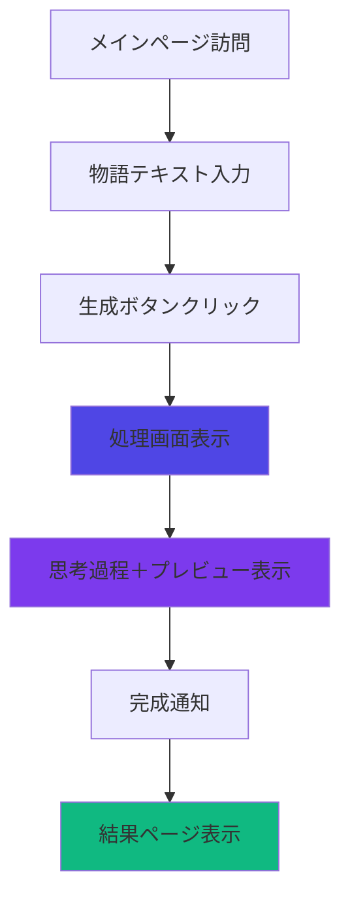
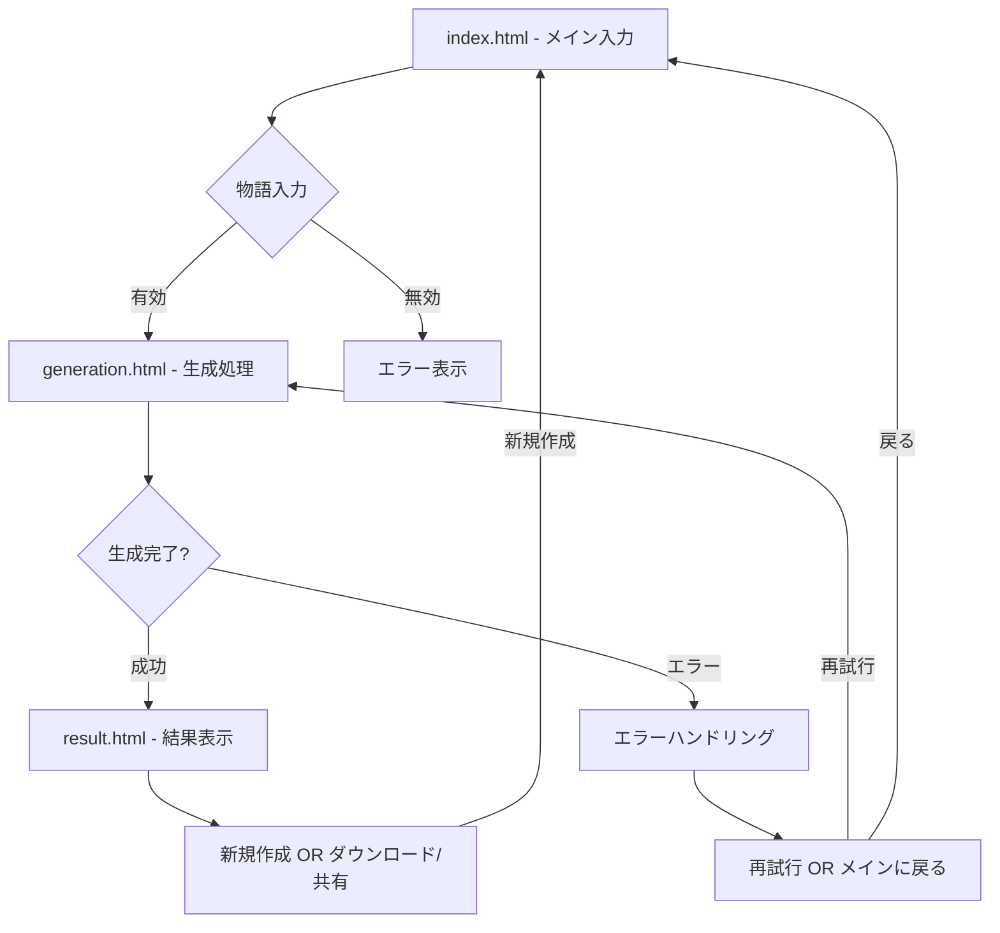

# AI漫画生成サービス UI/UX設計書 Genspark風モダンデザイン版

**文書管理情報**
- 文書ID: UI-DOC-005
- 作成日: 2025-01-23
- 版数: 4.0
- 承認者: 根岸祐樹
- 関連文書: API-DOC-001（API設計書）、REQ-DOC-001（要件定義書）
- 更新元: UI-DOC-004（Orcha AI風モダン版）→ Genspark風モダンデザインに全面刷新

## 目次

- [1. デザイン概要](#1-デザイン概要)
  - [1.1 デザイン哲学](#11-デザイン哲学)
  - [1.2 ユーザー体験方針](#12-ユーザー体験方針)
- [2. デザインシステム](#2-デザインシステム)
  - [2.1 カラーパレット](#21-カラーパレット)
  - [2.2 タイポグラフィ](#22-タイポグラフィ)
  - [2.3 テーマシステム](#23-テーマシステム)
- [3. ユーザージャーニー](#3-ユーザージャーニー)
  - [3.1 シンプル入力フロー](#31-シンプル入力フロー)
  - [3.2 Genspark風生成体験](#32-genspark風生成体験)
  - [3.3 結果確認フロー](#33-結果確認フロー)
- [4. 画面設計](#4-画面設計)
  - [4.1 メインページ](#41-メインページ)
  - [4.2 処理画面（チャット形式+プレビュー）](#42-処理画面チャット形式プレビュー)
  - [4.3 結果ビューアー](#43-結果ビューアー)
- [5. コンポーネント設計](#5-コンポーネント設計)
  - [5.1 基本コンポーネント](#51-基本コンポーネント)
  - [5.2 テーマトグル](#52-テーマトグル)
  - [5.3 アニメーション仕様](#53-アニメーション仕様)
- [6. 技術実装](#6-技術実装)
  - [6.1 CSS Variables活用](#61-css-variables活用)
  - [6.2 WebSocket統合](#62-websocket統合)
  - [6.3 通知システム](#63-通知システム)
- [7. レスポンシブ設計](#7-レスポンシブ設計)
  - [7.1 ブレイクポイント仕様](#71-ブレイクポイント仕様)
  - [7.2 デバイス別最適化](#72-デバイス別最適化)
- [8. アクセシビリティ設計](#8-アクセシビリティ設計)
  - [8.1 WCAG準拠チェックリスト](#81-wcag準拠チェックリスト)
  - [8.2 キーボードナビゲーション](#82-キーボードナビゲーション)
- [9. パフォーマンス設計](#9-パフォーマンス設計)
  - [9.1 Core Web Vitals目標](#91-core-web-vitals目標)
  - [9.2 最適化戦略](#92-最適化戦略)
- [10. 実装仕様](#10-実装仕様)
- [11. デザインシステム仕様書](#11-デザインシステム仕様書)
  - [11.1 コンポーネントライブラリ](#111-コンポーネントライブラリ)
  - [11.2 アイコンシステム](#112-アイコンシステム)
  - [11.3 アニメーション定義](#113-アニメーション定義)
- [12. インタラクション・UXフロー仕様](#12-インタラクションuxフロー仕様)
  - [12.1 画面遷移フロー](#121-画面遷移フロー)
  - [12.2 エラーハンドリング](#122-エラーハンドリング)
  - [12.3 ローディング状態](#123-ローディング状態)
- [13. 実装チェックリスト](#13-実装チェックリスト)
  - [13.1 開発フェーズ別チェック項目](#131-開発フェーズ別チェック項目)
  - [13.2 品質保証項目](#132-品質保証項目)

---

## 1. デザイン概要

### 1.1 デザイン哲学

#### 核心原則 (Genspark風モダンデザイン)
```
🌑 Dark Mode First: ダークモードを基調としたモダンデザイン
💬 Conversational UI: Claudeライクなシンプル入力インターフェース
📱 Split View: 左側チャット・右側出力のGenspark風レイアウト
⚡ Real-time Generation: リアルタイムで生成過程を表示
🎯 Zero Friction: 入力欄のみの極限までシンプルなUI
```

#### Genspark風体験設計
- **Claudeライク入力**: シンプルな入力欄とボタンのみ（説明文なし）
- **ダークテーマ中心**: 黒背景を基調としたプロフェッショナルな見た目
- **Genspark風分割画面**: 左側に対話形式の処理状況、右側に生成物表示
- **プログレッシブ生成**: 段階的に結果が構築される様子を可視化

### 1.2 ユーザー体験方針

| 設計方針 | 実装戦略 |
|---------|--------|
| Claudeライク入力 | 入力欄のみ、説明文・ラベル一切なし |
| ダークモード標準 | ダークテーマをデフォルト、ライトは補助的 |
| Genspark風画面分割 | 左チャット、右出力の固定レイアウト |
| ミニマルアニメーション | 必要最小限の動き、フォーカスは内容に |
| リアルタイム更新 | WebSocketで瞬時に進捗・結果を反映 |
| コンテキスト保持 | 対話の流れを左側で常に表示 |
| 直感的フロー | 入力→生成→結果の3ステップのみ |

---

## 2. デザインシステム

### 2.1 カラーパレット

#### CSS Variables テーマシステム
```css
:root {
  /* Dark Theme (Default) - Genspark風 */
  --color-bg-primary: #0a0a0a;      /* 深い黒背景 */
  --color-bg-secondary: #141414;    /* カード背景 */
  --color-bg-tertiary: #1f1f1f;     /* 入力欄背景 */
  
  --color-text-primary: #ffffff;    /* メインテキスト */
  --color-text-secondary: #a1a1aa;  /* サブテキスト */
  --color-text-tertiary: #71717a;   /* プレースホルダー */
  
  --color-border-primary: #27272a;  /* 微細な境界線 */
  --color-border-secondary: #3f3f46;
  
  --color-accent-primary: #2563eb;  /* 青系アクセント */
  --color-accent-secondary: #3b82f6;
  
  --color-success: #10b981;
  --color-warning: #f59e0b;
  --color-error: #ef4444;
  
  /* Shadows & Effects */
  --shadow-sm: 0 1px 2px 0 rgb(0 0 0 / 0.05);
  --shadow-md: 0 4px 6px -1px rgb(0 0 0 / 0.1);
  --shadow-lg: 0 10px 15px -3px rgb(0 0 0 / 0.1);
  --shadow-xl: 0 20px 25px -5px rgb(0 0 0 / 0.1);
  
  /* Border Radius */
  --radius-sm: 0.25rem;
  --radius-md: 0.375rem;
  --radius-lg: 0.5rem;
  --radius-xl: 0.75rem;
}

[data-theme="light"] {
  /* Light Theme (Optional) */
  --color-bg-primary: #ffffff;
  --color-bg-secondary: #f9fafb;
  --color-bg-tertiary: #f3f4f6;
  
  --color-text-primary: #111827;
  --color-text-secondary: #6b7280;
  --color-text-tertiary: #9ca3af;
  
  --color-border-primary: #e5e7eb;
  --color-border-secondary: #d1d5db;
  
  --color-accent-primary: #2563eb;
  --color-accent-secondary: #3b82f6;
}
```

#### カラー使用ガイドライン
| 用途 | カラー変数 | 使用場面 |
|------|-----------|--------|
| メイン背景 | --color-bg-primary (#0a0a0a) | ダーク背景全体 |
| 入力欄背景 | --color-bg-tertiary (#1f1f1f) | テキストエリア |
| 分割パネル | --color-bg-secondary (#141414) | チャット・出力エリア |
| 境界線 | --color-border-primary (#27272a) | 微細な区切り |
| アクセント | --color-accent-primary (#2563eb) | 送信ボタン |

### 2.2 タイポグラフィ

#### システムフォント活用
```css
:root {
  /* Modern System Font Stack */
  --font-sans: ui-sans-serif, system-ui, -apple-system, BlinkMacSystemFont, 
               "Segoe UI", Roboto, "Helvetica Neue", Arial, "Noto Sans", 
               sans-serif, "Apple Color Emoji", "Segoe UI Emoji", 
               "Segoe UI Symbol", "Noto Color Emoji";
  
  --font-mono: ui-monospace, SFMono-Regular, "SF Mono", Consolas, 
               "Liberation Mono", Menlo, monospace;
  
  /* Font Weights */
  --font-weight-normal: 400;
  --font-weight-medium: 500;
  --font-weight-semibold: 600;
  --font-weight-bold: 700;
  
  /* Font Sizes */
  --text-xs: 0.75rem;
  --text-sm: 0.875rem;
  --text-base: 1rem;
  --text-lg: 1.125rem;
  --text-xl: 1.25rem;
  --text-2xl: 1.5rem;
  --text-3xl: 1.875rem;
  --text-4xl: 2.25rem;
  
  /* Line Heights */
  --leading-tight: 1.25;
  --leading-normal: 1.5;
  --leading-relaxed: 1.625;
}
```

#### タイポグラフィ階層
```css
/* Typography Hierarchy */
.hero-title {
  font-size: var(--text-4xl);
  font-weight: var(--font-weight-bold);
  line-height: var(--leading-tight);
  letter-spacing: -0.025em;
}

.section-title {
  font-size: var(--text-2xl);
  font-weight: var(--font-weight-semibold);
  line-height: var(--leading-tight);
}

.body-text {
  font-size: var(--text-base);
  font-weight: var(--font-weight-normal);
  line-height: var(--leading-normal);
}

.caption-text {
  font-size: var(--text-sm);
  font-weight: var(--font-weight-medium);
  color: var(--color-text-secondary);
}
```

### 2.3 テーマシステム

#### テーマ切り替え実装
```typescript
class ThemeManager {
  constructor() {
    this.theme = localStorage.getItem('theme') || 
                 (window.matchMedia('(prefers-color-scheme: dark)').matches ? 'dark' : 'light');
    this.init();
  }

  init() {
    this.setTheme(this.theme);
    this.setupToggle();
    this.watchSystemTheme();
  }

  setTheme(theme: 'light' | 'dark') {
    this.theme = theme;
    document.documentElement.setAttribute('data-theme', theme);
    localStorage.setItem('theme', theme);
    this.updateToggleIcon();
  }

  toggleTheme() {
    const newTheme = this.theme === 'light' ? 'dark' : 'light';
    this.setTheme(newTheme);
  }

  private watchSystemTheme() {
    window.matchMedia('(prefers-color-scheme: dark)')
          .addEventListener('change', (e) => {
            if (!localStorage.getItem('theme')) {
              this.setTheme(e.matches ? 'dark' : 'light');
            }
          });
  }
}
```

#### モダンエフェクト
```css
/* Subtle Shadows */
.card {
  background: var(--color-bg-secondary);
  border: 1px solid var(--color-border-primary);
  border-radius: var(--radius-lg);
  box-shadow: var(--shadow-sm);
  transition: all 0.2s ease;
}

.card:hover {
  box-shadow: var(--shadow-md);
  transform: translateY(-2px);
}

/* Button Styles */
.btn-primary {
  background: var(--color-accent-primary);
  color: white;
  border: none;
  border-radius: var(--radius-md);
  padding: 0.75rem 1.5rem;
  font-weight: var(--font-weight-medium);
  transition: all 0.2s ease;
  cursor: pointer;
}

.btn-primary:hover {
  background: var(--color-accent-secondary);
  transform: translateY(-1px);
  box-shadow: var(--shadow-lg);
}

/* Focus States */
.focusable:focus {
  outline: 2px solid var(--color-accent-primary);
  outline-offset: 2px;
}
```

---

## 3. ユーザージャーニー

### 3.1 シンプル入力フロー



#### フロー詳細
| 段階 | アクション | 所要時間 | UI状態 |
|------|-----------|---------|-------|
| 入力 | テキスト入力 | 30秒-5分 | プレースホルダー表示 |
| 開始 | 生成ボタンクリック | 1秒 | ローディング状態 |
| 処理 | AI処理実行 | 8-10分 | 思考過程+プレビュー |
| 完了 | 結果表示 | - | 成功状態 |

### 3.2 Claude Artifacts風生成体験

#### 分割レイアウト設計
```html
<div class="process-layout">
  <!-- 左サイドバー: 思考過程 -->
  <div class="process-sidebar">
    <div class="thinking-panel">
      <h2 class="thinking-title">思考過程</h2>
      <div class="thinking-steps" id="thinking-steps">
        <!-- WebSocketで動的更新 -->
      </div>
    </div>
  </div>
  
  <!-- 右メインエリア: プレビュー -->
  <div class="preview-area">
    <div class="preview-panel">
      <h2 class="preview-title">フェーズごとの生成結果</h2>
      <div class="preview-content" id="preview-content">
        <!-- 段階的に生成結果表示 -->
      </div>
    </div>
  </div>
</div>
```

#### WebSocket連携
```typescript
interface GenerationPhase {
  phase: number;
  title: string;
  description: string;
  progress: number;
  preview?: string;
  status: 'pending' | 'processing' | 'completed';
}

class ProcessDisplay {
  private socket: WebSocket;
  
  constructor() {
    this.initWebSocket();
  }
  
  private initWebSocket() {
    this.socket = new WebSocket('ws://localhost:8000/ws/generation');
    
    this.socket.onmessage = (event) => {
      const data: GenerationPhase = JSON.parse(event.data);
      this.updateThinkingProcess(data);
      this.updatePreview(data);
    };
  }
  
  private updateThinkingProcess(phase: GenerationPhase) {
    const stepElement = document.getElementById(`step-${phase.phase}`);
    stepElement.textContent = `${phase.title}: ${phase.description}`;
    stepElement.className = `thinking-step ${phase.status}`;
  }
  
  private updatePreview(phase: GenerationPhase) {
    if (phase.preview) {
      const previewElement = document.getElementById('preview-content');
      // プレビュー内容を段階的に更新
    }
  }
}
```

### 3.3 結果確認フロー

#### 結果画面構成
```html
<div class="result-container">
  <!-- 成功ヘッダー -->
  <div class="success-hero">
    <div class="success-icon">✅</div>
    <h1 class="success-title">漫画が完成しました</h1>
    <p class="success-subtitle">あなたの物語が美しい作品に生まれ変わりました</p>
  </div>
  
  <!-- メインアクション -->
  <div class="action-buttons">
    <button class="btn-primary btn-lg">📱 作品を見る</button>
    <button class="btn-secondary">📥 ダウンロード</button>
    <button class="btn-secondary">🔗 共有</button>
  </div>
  
  <!-- 漫画ビューアー -->
  <div class="manga-viewer">
    <!-- 実装済みのビューアーコンポーネント -->
  </div>
</div>
```

---

## 4. 画面設計

### 4.1 メインページ

#### Claudeライクシンプルレイアウト
```html
<!DOCTYPE html>
<html lang="ja" data-theme="dark">
<head>
  <meta charset="UTF-8">
  <meta name="viewport" content="width=device-width, initial-scale=1.0">
  <title>AI漫画生成</title>
  <link rel="stylesheet" href="styles/main.css">
</head>
<body>
  <div class="app-container">
    <!-- 最小限のヘッダー -->
    <header class="minimal-header">
      <div class="header-inner">
        <h1 class="app-title">AI Manga</h1>
      </div>
    </header>

    <!-- Claudeライク入力エリア -->
    <main class="main-content">
      <div class="chat-container">
        <div class="input-container">
          <form class="message-form" id="story-form">
            <div class="input-wrapper">
              <textarea 
                class="message-input"
                id="story-input"
                placeholder="物語を入力してください..."
                maxlength="10000"
                rows="1"
                required
              ></textarea>
              <button type="submit" class="send-button" id="generate-btn">
                <svg class="send-icon" viewBox="0 0 24 24">
                  <path d="M2 21l21-9L2 3v7l15 2-15 2v7z"/>
                </svg>
              </button>
            </div>
          </form>
        </div>
      </div>
    </main>
  </div>
  
  <script src="scripts/main.js"></script>
</body>
</html>
```

#### CSS実装（Claudeライクデザイン）
```css
/* ダーク背景ベース */
body {
  background: var(--color-bg-primary);
  color: var(--color-text-primary);
  margin: 0;
  font-family: var(--font-sans);
}

/* 最小限ヘッダー */
.minimal-header {
  position: fixed;
  top: 0;
  left: 0;
  right: 0;
  height: 48px;
  background: var(--color-bg-secondary);
  border-bottom: 1px solid var(--color-border-primary);
  z-index: 100;
}

.app-title {
  font-size: var(--text-base);
  font-weight: var(--font-weight-medium);
  color: var(--color-text-secondary);
  margin: 0;
  line-height: 48px;
  padding: 0 20px;
}

/* メインコンテンツ */
.main-content {
  padding-top: 48px;
  height: 100vh;
  display: flex;
  align-items: center;
  justify-content: center;
}

/* チャットコンテナ */
.chat-container {
  width: 100%;
  max-width: 768px;
  padding: 0 20px;
}

/* 入力エリア（Claudeスタイル） */
.input-container {
  position: relative;
}

.input-wrapper {
  position: relative;
  background: var(--color-bg-tertiary);
  border: 1px solid var(--color-border-primary);
  border-radius: 12px;
  transition: border-color 0.2s;
}

.input-wrapper:focus-within {
  border-color: var(--color-accent-primary);
}

.message-input {
  width: 100%;
  padding: 16px 48px 16px 16px;
  background: transparent;
  border: none;
  color: var(--color-text-primary);
  font-size: var(--text-base);
  font-family: var(--font-sans);
  resize: none;
  outline: none;
  line-height: 1.5;
  min-height: 24px;
  max-height: 200px;
}

.message-input::placeholder {
  color: var(--color-text-tertiary);
}

/* 送信ボタン（埋め込み型） */
.send-button {
  position: absolute;
  right: 8px;
  bottom: 8px;
  width: 32px;
  height: 32px;
  background: var(--color-accent-primary);
  border: none;
  border-radius: 6px;
  cursor: pointer;
  display: flex;
  align-items: center;
  justify-content: center;
  transition: background-color 0.2s;
}

.send-button:hover {
  background: var(--color-accent-secondary);
}

.send-icon {
  width: 16px;
  height: 16px;
  fill: white;
}
```

### 4.2 処理画面（思考過程+プレビュー）

#### Genspark風分割レイアウト
```html
<!DOCTYPE html>
<html lang="ja">
<head>
  <meta charset="UTF-8">
  <meta name="viewport" content="width=device-width, initial-scale=1.0">
  <title>AI漫画生成 - 処理中</title>
  <link rel="stylesheet" href="styles/main.css">
  <link rel="stylesheet" href="styles/process.css">
</head>
<body>
  <div class="container">
    <!-- ヘッダー -->
    <header class="header">
      <div class="header-content">
        <h1 class="logo">AI漫画生成</h1>
        <button class="theme-toggle" id="theme-toggle">
          <span class="theme-icon" id="theme-icon-light">☀️</span>
          <span class="theme-icon" id="theme-icon-dark" style="display: none;">🌙</span>
        </button>
      </div>
    </header>

    <!-- Genspark風処理画面 -->
    <main class="generation-container">
      <div class="split-layout">
        <!-- 左側: チャット形式の処理状況 -->
        <div class="chat-panel">
          <div class="chat-messages" id="chat-messages">
            <div class="assistant-message">
              <div class="message-icon">🤖</div>
              <div class="message-content">
                <p>物語の生成を開始します...</p>
              </div>
            </div>
            <div class="assistant-message processing" id="current-step">
              <div class="message-icon">⚡</div>
              <div class="message-content">
                <p class="step-text">物語を分析中...</p>
                <div class="progress-bar">
                  <div class="progress-fill" style="width: 20%"></div>
                </div>
              </div>
            </div>
            <!-- 動的にメッセージを追加 -->
          </div>
        </div>
        
        <!-- 右側: 生成結果の表示 -->
        <div class="output-panel">
          <div class="output-header">
            <h2 class="output-title">生成中の漫画</h2>
            <div class="output-status" id="output-status">
              <span class="status-dot"></span>
              <span class="status-text">生成中...</span>
            </div>
          </div>
          <div class="output-content" id="output-content">
            <div class="output-placeholder">
              <div class="generating-animation">
                <div class="pulse-circle"></div>
                <p class="generating-text">AIが漫画を描いています...</p>
              </div>
            </div>
          </div>
        </div>
      </div>
    </main>
  </div>
  
  <script src="scripts/process.js"></script>
</body>
</html>
```

#### 処理画面CSS
```css
/* Genspark風分割レイアウト */
.generation-container {
  height: 100vh;
  padding-top: 48px;
}

.split-layout {
  display: grid;
  grid-template-columns: 450px 1fr;
  height: calc(100vh - 48px);
  background: var(--color-bg-primary);
}

/* 左側: チャットパネル */
.chat-panel {
  background: var(--color-bg-secondary);
  border-right: 1px solid var(--color-border-primary);
  overflow-y: auto;
  padding: 24px;
}

.chat-messages {
  display: flex;
  flex-direction: column;
  gap: 16px;
}

.assistant-message {
  display: flex;
  gap: 12px;
  animation: fadeInUp 0.3s ease;
}

.message-icon {
  width: 32px;
  height: 32px;
  background: var(--color-bg-tertiary);
  border-radius: 8px;
  display: flex;
  align-items: center;
  justify-content: center;
  font-size: 16px;
  flex-shrink: 0;
}

.message-content {
  flex: 1;
  color: var(--color-text-primary);
  font-size: var(--text-base);
  line-height: 1.6;
}

.message-content p {
  margin: 0 0 8px 0;
}

/* プログレスバー */
.progress-bar {
  height: 4px;
  background: var(--color-bg-tertiary);
  border-radius: 2px;
  overflow: hidden;
  margin-top: 8px;
}

.progress-fill {
  height: 100%;
  background: var(--color-accent-primary);
  border-radius: 2px;
  transition: width 0.3s ease;
}

/* 右側: 出力パネル */
.output-panel {
  background: var(--color-bg-primary);
  display: flex;
  flex-direction: column;
  overflow: hidden;
}

.output-header {
  padding: 20px 24px;
  border-bottom: 1px solid var(--color-border-primary);
  display: flex;
  justify-content: space-between;
  align-items: center;
}

.output-title {
  font-size: var(--text-lg);
  font-weight: var(--font-weight-medium);
  color: var(--color-text-primary);
  margin: 0;
}

.output-status {
  display: flex;
  align-items: center;
  gap: 8px;
}

.status-dot {
  width: 8px;
  height: 8px;
  background: var(--color-accent-primary);
  border-radius: 50%;
  animation: pulse 2s infinite;
}

.status-text {
  font-size: var(--text-sm);
  color: var(--color-text-secondary);
}

.output-content {
  flex: 1;
  padding: 24px;
  overflow-y: auto;
}

.output-placeholder {
  height: 100%;
  display: flex;
  align-items: center;
  justify-content: center;
}

.generating-animation {
  text-align: center;
}

.pulse-circle {
  width: 64px;
  height: 64px;
  background: var(--color-accent-primary);
  border-radius: 50%;
  margin: 0 auto 16px;
  opacity: 0.1;
  animation: pulse 2s infinite;
}

.generating-text {
  color: var(--color-text-secondary);
  font-size: var(--text-base);
}

/* アニメーション */
@keyframes fadeInUp {
  from {
    opacity: 0;
    transform: translateY(10px);
  }
  to {
    opacity: 1;
    transform: translateY(0);
  }
}

@keyframes pulse {
  0%, 100% {
    opacity: 0.1;
    transform: scale(1);
  }
  50% {
    opacity: 0.3;
    transform: scale(1.05);
  }
}
```

### 4.3 結果ビューアー

既存のresult.htmlの実装を活用し、モダンデザインシステムに統合。

#### 主な改修点
```css
/* テーマシステム統合 */
.success-hero {
  background: var(--color-bg-secondary);
  color: var(--color-text-primary);
  /* Skyreels風の複雑なエフェクトを削除 */
}

.manga-viewer {
  background: var(--color-bg-primary);
  border: 1px solid var(--color-border-primary);
  /* グラスモーフィズムからモダンフラットデザインに変更 */
}

.action-buttons .btn {
  /* 既存のボタンスタイルをCSS Variables化 */
  background: var(--color-accent-primary);
  color: white;
  border: none;
  border-radius: var(--radius-md);
  /* ネオンエフェクト削除、シンプルなホバーエフェクト */
}
```

---

## 5. コンポーネント設計

### 5.1 基本コンポーネント

#### Button Component
```typescript
interface ButtonProps {
  variant?: 'primary' | 'secondary' | 'outline';
  size?: 'sm' | 'md' | 'lg';
  disabled?: boolean;
  loading?: boolean;
  children: React.ReactNode;
  onClick?: () => void;
}

const Button: React.FC<ButtonProps> = ({ 
  variant = 'primary', 
  size = 'md', 
  disabled = false,
  loading = false,
  children, 
  onClick 
}) => {
  const baseClasses = 'btn transition-all duration-200 ease-in-out';
  const variantClasses = {
    primary: 'btn-primary bg-accent-primary text-white hover:bg-accent-secondary',
    secondary: 'btn-secondary bg-bg-secondary text-text-primary hover:bg-bg-tertiary',
    outline: 'btn-outline border-2 border-accent-primary text-accent-primary hover:bg-accent-primary hover:text-white'
  };
  const sizeClasses = {
    sm: 'text-sm px-3 py-1.5',
    md: 'text-base px-4 py-2',
    lg: 'text-lg px-6 py-3'
  };
  
  return (
    <button 
      className={`${baseClasses} ${variantClasses[variant]} ${sizeClasses[size]}`}
      onClick={onClick}
      disabled={disabled || loading}
    >
      {loading && <Spinner size="sm" />}
      {children}
    </button>
  );
};
```

#### Card Component
```typescript
interface CardProps {
  children: React.ReactNode;
  hover?: boolean;
  padding?: 'sm' | 'md' | 'lg';
  className?: string;
}

const Card: React.FC<CardProps> = ({ 
  children, 
  hover = false, 
  padding = 'md',
  className = '' 
}) => {
  const paddingClasses = {
    sm: 'p-4',
    md: 'p-6',
    lg: 'p-8'
  };
  
  return (
    <div className={`
      bg-bg-secondary 
      border border-border-primary 
      rounded-lg 
      ${paddingClasses[padding]}
      ${hover ? 'hover:shadow-md hover:transform hover:-translate-y-1 transition-all duration-200' : ''} 
      ${className}
    `}>
      {children}
    </div>
  );
};
```

### 5.2 テーマトグル

#### 実装仕様
```typescript
const ThemeToggle: React.FC = () => {
  const [theme, setTheme] = useState<'light' | 'dark'>('light');
  
  useEffect(() => {
    const savedTheme = localStorage.getItem('theme') as 'light' | 'dark';
    const systemPreference = window.matchMedia('(prefers-color-scheme: dark)').matches ? 'dark' : 'light';
    
    const initialTheme = savedTheme || systemPreference;
    setTheme(initialTheme);
    document.documentElement.setAttribute('data-theme', initialTheme);
  }, []);
  
  const toggleTheme = () => {
    const newTheme = theme === 'light' ? 'dark' : 'light';
    setTheme(newTheme);
    localStorage.setItem('theme', newTheme);
    document.documentElement.setAttribute('data-theme', newTheme);
  };
  
  return (
    <button
      onClick={toggleTheme}
      className="theme-toggle p-2 rounded-md hover:bg-bg-tertiary transition-colors duration-200"
      aria-label={`Switch to ${theme === 'light' ? 'dark' : 'light'} mode`}
    >
      {theme === 'light' ? (
        <span className="text-xl">☀️</span>
      ) : (
        <span className="text-xl">🌙</span>
      )}
    </button>
  );
};
```

### 5.3 アニメーション仕様

#### 控えめなアニメーション
```css
/* 基本トランジション */
.transition-base {
  transition: all 0.2s ease-in-out;
}

/* ホバーエフェクト */
.hover-lift:hover {
  transform: translateY(-2px);
  box-shadow: var(--shadow-md);
}

/* フェードイン */
@keyframes fadeIn {
  from { opacity: 0; transform: translateY(10px); }
  to { opacity: 1; transform: translateY(0); }
}

.animate-fade-in {
  animation: fadeIn 0.3s ease-out;
}

/* スケールアニメーション */
.scale-on-hover:hover {
  transform: scale(1.02);
}

/* 読み込み中スピナー */
@keyframes spin {
  from { transform: rotate(0deg); }
  to { transform: rotate(360deg); }
}

.loading-spinner {
  animation: spin 1s linear infinite;
}
```

---

## 6. 技術実装

### 6.1 CSS Variables活用

#### 完全変数化システム
```css
:root {
  /* 基本変数定義 */
  --color-bg-primary: #ffffff;
  --color-text-primary: #0f172a;
  
  /* 計算変数 */
  --color-bg-hover: color-mix(in srgb, var(--color-bg-primary) 95%, black);
  --color-border-focus: color-mix(in srgb, var(--color-accent-primary) 20%, transparent);
  
  /* コンポーネント固有変数 */
  --button-padding-x: 1rem;
  --button-padding-y: 0.5rem;
  --card-border-radius: var(--radius-lg);
}

/* テーマ切り替え時の滑らかな遷移 */
* {
  transition: background-color 0.2s ease, border-color 0.2s ease, color 0.2s ease;
}
```

### 6.2 WebSocket統合

#### リアルタイム通信
```typescript
interface GenerationUpdate {
  phase: number;
  title: string;
  description: string;
  progress: number;
  preview?: {
    type: 'text' | 'image';
    content: string;
  };
  status: 'pending' | 'processing' | 'completed' | 'error';
}

class GenerationWebSocket {
  private socket: WebSocket;
  private callbacks: Map<string, Function> = new Map();
  
  constructor(sessionId: string) {
    this.connect(sessionId);
  }
  
  private connect(sessionId: string) {
    const protocol = window.location.protocol === 'https:' ? 'wss:' : 'ws:';
    const host = window.location.host;
    
    this.socket = new WebSocket(`${protocol}//${host}/ws/generation/${sessionId}`);
    
    this.socket.onopen = () => {
      console.log('WebSocket connected');
    };
    
    this.socket.onmessage = (event) => {
      const data: GenerationUpdate = JSON.parse(event.data);
      this.handleUpdate(data);
    };
    
    this.socket.onclose = () => {
      console.log('WebSocket disconnected');
      // 自動再接続ロジック
      setTimeout(() => this.connect(sessionId), 3000);
    };
  }
  
  private handleUpdate(data: GenerationUpdate) {
    // 思考過程更新
    this.updateThinkingStep(data);
    
    // プレビュー更新
    if (data.preview) {
      this.updatePreview(data.preview);
    }
    
    // カスタムコールバック実行
    this.callbacks.get('update')?.(data);
  }
  
  on(event: string, callback: Function) {
    this.callbacks.set(event, callback);
  }
}
```

### 6.3 通知システム

#### Toast通知実装
```typescript
interface ToastOptions {
  type: 'success' | 'error' | 'warning' | 'info';
  message: string;
  duration?: number;
  position?: 'top-right' | 'top-left' | 'bottom-right' | 'bottom-left';
}

class ToastManager {
  private container: HTMLElement;
  
  constructor() {
    this.createContainer();
  }
  
  private createContainer() {
    this.container = document.createElement('div');
    this.container.className = 'toast-container fixed top-4 right-4 z-50 space-y-2';
    document.body.appendChild(this.container);
  }
  
  show(options: ToastOptions) {
    const toast = document.createElement('div');
    toast.className = `
      toast 
      bg-bg-secondary 
      border border-border-primary 
      rounded-lg 
      p-4 
      shadow-lg 
      min-w-80
      animate-fade-in
    `;
    
    const iconMap = {
      success: '✅',
      error: '❌',
      warning: '⚠️',
      info: 'ℹ️'
    };
    
    toast.innerHTML = `
      <div class="flex items-center gap-3">
        <span class="text-lg">${iconMap[options.type]}</span>
        <span class="text-text-primary font-medium">${options.message}</span>
      </div>
    `;
    
    this.container.appendChild(toast);
    
    // 自動削除
    setTimeout(() => {
      toast.classList.add('animate-fade-out');
      setTimeout(() => {
        this.container.removeChild(toast);
      }, 300);
    }, options.duration || 4000);
  }
}
```

---

## 7. レスポンシブ設計

### 7.1 ブレイクポイント
```css
:root {
  --breakpoint-sm: 640px;   /* モバイル */
  --breakpoint-md: 768px;   /* タブレット */
  --breakpoint-lg: 1024px;  /* デスクトップ */
  --breakpoint-xl: 1280px;  /* 大画面 */
}
```

### 7.1 ブレイクポイント仕様

#### 基本ブレイクポイント定義
```css
:root {
  /* ブレイクポイント定義 */
  --breakpoint-xs: 375px;   /* 小型スマートフォン */
  --breakpoint-sm: 640px;   /* スマートフォン */
  --breakpoint-md: 768px;   /* タブレット */
  --breakpoint-lg: 1024px;  /* デスクトップ */
  --breakpoint-xl: 1280px;  /* 大画面デスクトップ */
  --breakpoint-2xl: 1536px; /* 超大画面 */
}
```

#### デバイス種別と対応仕様
| デバイス | 画面幅 | 主要変更点 | 最小タッチ領域 |
|---------|--------|-----------|---------------|
| スマートフォン（縦） | 375px-640px | 分割→スタック、フォントサイズ増 | 44px × 44px |
| スマートフォン（横） | 640px-768px | ヘッダー高さ調整、余白最適化 | 44px × 44px |
| タブレット | 768px-1024px | 2カラム → 1カラム切り替え | 44px × 44px |
| デスクトップ | 1024px+ | フル機能表示、ホバー効果 | 32px × 32px |

### 7.2 デバイス別最適化

#### スマートフォン最適化（～768px）
```css
@media (max-width: 768px) {
  /* 分割レイアウト → スタック */
  .split-layout {
    grid-template-columns: 1fr;
    grid-template-rows: 300px 1fr;
  }
  
  /* タッチ操作対応 */
  .btn, .control-btn {
    min-height: 44px;
    min-width: 44px;
    padding: 12px 16px;
  }
  
  /* フォントサイズ調整 */
  .welcome-title {
    font-size: var(--text-2xl); /* 30px → 24px */
  }
  
  /* 入力エリア最適化 */
  .message-input {
    font-size: 16px; /* iOS拡大防止 */
  }
}
```

#### タブレット最適化（768px-1024px）
```css
@media (min-width: 768px) and (max-width: 1024px) {
  /* 分割レイアウトの調整 */
  .split-layout {
    grid-template-columns: 380px 1fr;
  }
  
  /* フォントサイズの中間値 */
  .welcome-title {
    font-size: calc(var(--text-2xl) + 0.25rem);
  }
  
  /* タッチフレンドリーなボタン */
  .btn {
    padding: 14px 20px;
  }
}
```

#### デスクトップ最適化（1024px+）
```css
@media (min-width: 1024px) {
  /* フル機能表示 */
  .split-layout {
    grid-template-columns: 450px 1fr;
    max-width: 1400px;
    margin: 0 auto;
  }
  
  /* ホバーエフェクト有効 */
  .btn:hover {
    transform: translateY(-2px);
    box-shadow: var(--shadow-lg);
  }
  
  /* キーボードナビゲーション表示 */
  .keyboard-hint {
    display: block;
    opacity: 0.7;
    font-size: var(--text-xs);
  }
}
```

#### スワイプジェスチャー対応
```javascript
// タッチジェスチャー対応
class TouchGestureHandler {
  constructor(element) {
    this.element = element;
    this.startX = 0;
    this.startY = 0;
    this.threshold = 50; // スワイプ閾値
    
    this.initTouchEvents();
  }
  
  initTouchEvents() {
    this.element.addEventListener('touchstart', this.handleTouchStart.bind(this));
    this.element.addEventListener('touchmove', this.handleTouchMove.bind(this));
    this.element.addEventListener('touchend', this.handleTouchEnd.bind(this));
  }
  
  // スワイプ方向の判定とアクション実行
}
```

---

## 8. アクセシビリティ設計

### 8.1 WCAG準拠
```css
/* フォーカス表示 */
.focusable:focus {
  outline: 2px solid var(--color-accent-primary);
  outline-offset: 2px;
}

/* ハイコントラストモード対応 */
@media (prefers-contrast: high) {
  :root {
    --color-border-primary: #000000;
    --color-text-secondary: #000000;
  }
}

/* アニメーション削減 */
@media (prefers-reduced-motion: reduce) {
  *,
  *::before,
  *::after {
    animation-duration: 0.01ms !important;
    animation-iteration-count: 1 !important;
    transition-duration: 0.01ms !important;
  }
}
```

### 8.2 ARIA属性
```html
<!-- 進捗表示 -->
<div 
  role="progressbar" 
  aria-label="漫画生成進捗"
  aria-valuenow="45" 
  aria-valuemin="0" 
  aria-valuemax="100"
>

<!-- ライブリージョン -->
<div aria-live="polite" id="status-updates">
  <!-- 動的ステータス更新 -->
</div>

<!-- ボタン -->
<button 
  aria-label="ダークモードに切り替え"
  aria-pressed="false"
>
  ☀️
</button>
```

---

## 9. パフォーマンス設計

### 9.1 CSS最適化
```css
/* Critical CSS のインライン化 */
/* Above-the-fold content styles */

/* Non-critical CSS の遅延読み込み */
<link rel="preload" href="styles/main.css" as="style" onload="this.onload=null;this.rel='stylesheet'">
```

### 9.2 JavaScript最適化
```typescript
// 動的インポート
const loadProcessPage = () => import('./pages/process');

// Web Workers活用（必要に応じて）
const worker = new Worker('/workers/image-processing.js');

// Service Worker（PWA対応）
if ('serviceWorker' in navigator) {
  navigator.serviceWorker.register('/sw.js');
}
```

---

## 10. 実装仕様

### 10.1 技術スタック
| 技術領域 | 選択技術 | 理由 |
|---------|---------|------|
| CSS Framework | CSS Variables + 自作 | テーマ切り替え、軽量性 |
| JavaScript | Vanilla JS / TypeScript | シンプル、高速 |
| WebSocket | 標準WebSocket API | リアルタイム通信 |
| Build Tool | Vite / Webpack | 高速開発、最適化 |
| PWA | Service Worker | オフライン対応 |

### 10.2 パフォーマンス目標
| メトリクス | 目標値 | 測定方法 |
|-----------|--------|----------|
| First Contentful Paint | < 1.5s | Lighthouse |
| Largest Contentful Paint | < 2.5s | Core Web Vitals |
| Cumulative Layout Shift | < 0.1 | Core Web Vitals |
| First Input Delay | < 100ms | Real User Monitoring |

### 10.3 実装優先度
1. **高優先度**: メインページ、テーマシステム、基本CSS Variables
2. **中優先度**: 処理画面、WebSocket統合、レスポンシブ対応
3. **低優先度**: アニメーション、PWA対応、高度な最適化

---

## 改訂履歴

| 版数 | 日付 | 変更内容 | 担当者 |
|------|------|----------|--------|
| 1.0 | 2025-01-20 | 基本設計作成 | Claude Code |
| 2.0 | 2025-01-20 | Skyreels風統合設計 | Claude Code |
| 3.0 | 2025-01-22 | Orcha AI風モダンデザインに全面刷新 | Claude Code |
| 4.0 | 2025-01-23 | Genspark風モダンデザインに全面改修 | Claude Code |

**主要変更点 (v3.0 → v4.0)**
- Orcha AI風デザイン → Genspark風ダークモード中心デザイン
- ヒーロー式入力画面 → Claudeライクな最小限入力欄
- ライトテーマデフォルト → ダークテーマデフォルト（#0a0a0a基調）
- Claude Artifacts風処理画面 → Genspark風分割画面（左チャット・右出力）
- 説明文付きUI → 説明文一切なしの極限シンプルUI
- 思考過程の箇条書き表示 → チャット形式の対話的表示

---

## 11. デザインシステム仕様書

### 11.1 コンポーネントライブラリ

#### ボタンコンポーネント
| バリアント | 用途 | スタイル仕様 | 使用場面 |
|-----------|------|-------------|----------|
| **primary** | 主要アクション | `bg: #2563eb, text: white` | フォーム送信、重要な操作 |
| **secondary** | 補助アクション | `bg: transparent, border: 1px solid` | キャンセル、戻る |
| **ghost** | 軽微なアクション | `bg: transparent, hover: bg-tertiary` | アイコンボタン |
| **danger** | 危険な操作 | `bg: #ef4444, text: white` | 削除、リセット |

```css
/* ボタン基本クラス */
.btn {
  display: inline-flex;
  align-items: center;
  justify-content: center;
  gap: 8px;
  padding: 12px 24px;
  border-radius: var(--radius-md);
  font-size: var(--text-base);
  font-weight: var(--font-weight-medium);
  cursor: pointer;
  transition: all var(--transition-fast);
  border: none;
  outline: none;
  min-height: 44px; /* タッチ対応 */
}

.btn:disabled {
  opacity: 0.5;
  cursor: not-allowed;
  pointer-events: none;
}

/* サイズバリアント */
.btn-sm { padding: 8px 16px; font-size: var(--text-sm); min-height: 36px; }
.btn-lg { padding: 16px 32px; font-size: var(--text-lg); min-height: 52px; }
```

#### フォームコンポーネント
```css
/* 入力フィールド共通 */
.form-input {
  width: 100%;
  padding: 12px 16px;
  background: var(--color-bg-tertiary);
  border: 1px solid var(--color-border-primary);
  border-radius: var(--radius-md);
  color: var(--color-text-primary);
  font-size: var(--text-base);
  font-family: var(--font-sans);
  transition: border-color var(--transition-fast);
}

.form-input:focus {
  outline: none;
  border-color: var(--color-accent-primary);
  box-shadow: 0 0 0 3px rgba(37, 99, 235, 0.1);
}

.form-input::placeholder {
  color: var(--color-text-tertiary);
}

/* バリデーション状態 */
.form-input.error {
  border-color: var(--color-error);
  box-shadow: 0 0 0 3px rgba(239, 68, 68, 0.1);
}

.form-input.success {
  border-color: var(--color-success);
  box-shadow: 0 0 0 3px rgba(16, 185, 129, 0.1);
}
```

#### カードコンポーネント
```css
.card {
  background: var(--color-bg-secondary);
  border: 1px solid var(--color-border-primary);
  border-radius: var(--radius-lg);
  overflow: hidden;
}

.card-interactive {
  cursor: pointer;
  transition: all var(--transition-fast);
}

.card-interactive:hover {
  border-color: var(--color-border-secondary);
  box-shadow: var(--shadow-md);
  transform: translateY(-2px);
}

.card-header {
  padding: 20px 24px 16px;
  border-bottom: 1px solid var(--color-border-primary);
}

.card-body {
  padding: 20px 24px;
}

.card-footer {
  padding: 16px 24px 20px;
  border-top: 1px solid var(--color-border-primary);
  background: var(--color-bg-tertiary);
}
```

### 11.2 アイコンシステム

#### アイコン仕様
```css
/* アイコン基本クラス */
.icon {
  width: 20px;
  height: 20px;
  fill: none;
  stroke: currentColor;
  stroke-width: 2;
  stroke-linecap: round;
  stroke-linejoin: round;
}

/* サイズバリアント */
.icon-sm { width: 16px; height: 16px; stroke-width: 2.5; }
.icon-lg { width: 24px; height: 24px; stroke-width: 1.5; }
.icon-xl { width: 32px; height: 32px; stroke-width: 1; }
```

#### アイコンライブラリ
| カテゴリ | アイコン名 | 用途 | SVGパス |
|---------|----------|------|---------|
| **ナビゲーション** | arrow-left | 戻る | `<path d="M19 12H5m7-7l-7 7 7 7"/>` |
| | arrow-right | 進む | `<path d="M5 12h14m-7-7l7 7-7 7"/>` |
| **アクション** | send | 送信 | `<path d="M2 21L23 12L2 3V10L17 12L2 14V21Z"/>` |
| | download | ダウンロード | `<path d="M21 15v4a2 2 0 01-2 2H5a2 2 0 01-2-2v-4M7 10l5 5 5-5M12 15V3"/>` |
| **ステータス** | check | 完了 | `<path d="M20 6L9 17l-5-5"/>` |
| | x | エラー/閉じる | `<path d="M18 6L6 18M6 6l12 12"/>` |

### 11.3 アニメーション定義

#### アニメーション原則
```css
/* 基本トランジション */
:root {
  --transition-fast: 0.15s cubic-bezier(0.4, 0, 0.2, 1);
  --transition-normal: 0.2s cubic-bezier(0.4, 0, 0.2, 1);
  --transition-slow: 0.3s cubic-bezier(0.4, 0, 0.2, 1);
}

/* エントランスアニメーション */
@keyframes fadeInUp {
  from {
    opacity: 0;
    transform: translateY(10px);
  }
  to {
    opacity: 1;
    transform: translateY(0);
  }
}

@keyframes fadeInScale {
  from {
    opacity: 0;
    transform: scale(0.95);
  }
  to {
    opacity: 1;
    transform: scale(1);
  }
}

/* ローディングアニメーション */
@keyframes pulse {
  0%, 100% {
    opacity: 0.4;
    transform: scale(1);
  }
  50% {
    opacity: 0.8;
    transform: scale(1.05);
  }
}

@keyframes shimmer {
  0% {
    background-position: -200% 0;
  }
  100% {
    background-position: 200% 0;
  }
}

/* ユーティリティクラス */
.animate-fadeInUp {
  animation: fadeInUp 0.3s var(--transition-normal);
}

.animate-pulse {
  animation: pulse 2s infinite;
}

.animate-shimmer {
  background: linear-gradient(
    90deg,
    var(--color-bg-tertiary) 25%,
    var(--color-border-primary) 50%,
    var(--color-bg-tertiary) 75%
  );
  background-size: 200% 100%;
  animation: shimmer 1.5s infinite;
}
```

---

## 12. インタラクション・UXフロー仕様

### 12.1 画面遷移フロー

#### メイン遷移パス


#### 画面遷移仕様
| 遷移元 | 遷移先 | トリガー | 遷移方法 | データ受け渡し |
|--------|--------|----------|----------|---------------|
| index | generation | フォーム送信 | `location.href` | localStorage |
| generation | result | 生成完了 | `location.href` | localStorage |
| result | index | 新規作成ボタン | `location.href` | localStorage削除 |
| 任意 | index | ブラウザ戻るボタン | `history.back()` | 確認ダイアログ |

### 12.2 エラーハンドリング

#### エラー分類と対応
| エラータイプ | 発生場面 | ユーザーへの表示 | 回復アクション |
|------------|----------|-----------------|---------------|
| **入力エラー** | フォーム送信時 | フィールド下にメッセージ | 修正後再送信 |
| **ネットワークエラー** | API通信時 | トースト通知 | 再試行ボタン |
| **WebSocketエラー** | 生成中 | チャット内エラーメッセージ | 自動再接続 |
| **タイムアウト** | 生成長時間化 | 進捗表示 + 継続確認 | キャンセル/継続選択 |
| **サーバーエラー** | 500系エラー | 汎用エラー画面 | メインに戻る |

#### エラーメッセージ実装例
```typescript
interface ErrorHandler {
  showFieldError(field: string, message: string): void;
  showToastError(message: string): void;
  showInlineError(container: HTMLElement, message: string): void;
  clearErrors(): void;
}

class UIErrorHandler implements ErrorHandler {
  showFieldError(field: string, message: string) {
    const input = document.getElementById(field);
    const errorElement = document.createElement('div');
    errorElement.className = 'field-error';
    errorElement.textContent = message;
    
    input?.classList.add('error');
    input?.parentNode?.appendChild(errorElement);
  }
  
  showToastError(message: string) {
    this.showToast(message, 'error');
  }
  
  // WebSocket切断時の自動再接続
  handleWebSocketError(error: Event) {
    console.error('WebSocket error:', error);
    
    // ユーザーに通知
    this.showInlineError(
      document.getElementById('chat-messages'),
      '接続が切断されました。再接続を試行中...'
    );
    
    // 5秒後に再接続を試行
    setTimeout(() => this.reconnectWebSocket(), 5000);
  }
}
```

### 12.3 ローディング状態

#### ローディングパターン
| 状態 | 表示内容 | 使用場面 | 実装方法 |
|------|----------|----------|----------|
| **初期読み込み** | スケルトン | ページ表示時 | CSS Animation |
| **フォーム送信中** | ボタン内スピナー | 送信処理中 | SVG + CSS |
| **段階的生成** | プログレスバー | AI処理中 | WebSocket更新 |
| **ファイル処理中** | パルスアニメーション | ダウンロード等 | CSS keyframes |

#### ローディング実装例
```css
/* スケルトンローダー */
.skeleton {
  background: linear-gradient(
    90deg,
    var(--color-bg-tertiary) 25%,
    var(--color-border-primary) 50%,
    var(--color-bg-tertiary) 75%
  );
  background-size: 200% 100%;
  animation: shimmer 1.5s infinite;
  border-radius: var(--radius-sm);
}

.skeleton-text {
  height: 1em;
  margin: 0.5em 0;
}

.skeleton-avatar {
  width: 40px;
  height: 40px;
  border-radius: 50%;
}

/* プログレスバー */
.progress-container {
  width: 100%;
  height: 4px;
  background: var(--color-bg-tertiary);
  border-radius: 2px;
  overflow: hidden;
}

.progress-bar {
  height: 100%;
  background: var(--color-accent-primary);
  border-radius: 2px;
  transition: width 0.3s ease;
}

.progress-bar.indeterminate {
  width: 30%;
  background: linear-gradient(
    90deg,
    transparent,
    var(--color-accent-primary),
    transparent
  );
  animation: indeterminateProgress 2s infinite;
}

@keyframes indeterminateProgress {
  0% { transform: translateX(-100%); }
  100% { transform: translateX(400%); }
}
```

---

## 13. 実装チェックリスト

### 13.1 開発フェーズ別チェック項目

#### Phase 1: 基盤実装
- [ ] **CSS Variables システム**
  - [ ] ダーク/ライトテーマ変数定義完了
  - [ ] ブレイクポイント変数設定
  - [ ] フォント・カラー・サイズ変数統一
- [ ] **基本レイアウト**
  - [ ] ヘッダー固定レイアウト実装
  - [ ] レスポンシブグリッドシステム
  - [ ] フレックスボックス活用
- [ ] **コンポーネント基盤**
  - [ ] ボタンコンポーネント（全バリアント）
  - [ ] フォーム入力コンポーネント
  - [ ] カードコンポーネント

#### Phase 2: 機能実装
- [ ] **メイン画面（index.html）**
  - [ ] Claude風入力インターフェース
  - [ ] テーマトグル機能
  - [ ] 文字数カウンター
  - [ ] 入力例チップ機能
  - [ ] バリデーション実装
- [ ] **生成画面（generation.html）**
  - [ ] 分割レイアウト（チャット + プレビュー）
  - [ ] WebSocket通信実装
  - [ ] プログレスバー更新
  - [ ] エラーハンドリング
- [ ] **結果画面（result.html）**
  - [ ] マンガビューアー実装
  - [ ] ページネーション機能
  - [ ] ダウンロード機能
  - [ ] 共有機能

#### Phase 3: 最適化・品質担保
- [ ] **パフォーマンス最適化**
  - [ ] Critical CSS インライン化
  - [ ] 非同期CSS読み込み
  - [ ] JavaScript動的インポート
  - [ ] 画像最適化（WebP/AVIF）
- [ ] **アクセシビリティ**
  - [ ] キーボードナビゲーション
  - [ ] スクリーンリーダー対応
  - [ ] カラーコントラスト確認
  - [ ] フォーカス表示実装

### 13.2 品質保証項目

#### 機能テスト
- [ ] **入力フォーム**
  - [ ] 必須項目バリデーション
  - [ ] 文字数制限チェック
  - [ ] 特殊文字入力対応
  - [ ] Enter/Shift+Enter動作
- [ ] **画面遷移**
  - [ ] 正常系フロー確認
  - [ ] ブラウザ戻るボタン対応
  - [ ] リロード時の状態保持
  - [ ] 直接URL アクセス制御
- [ ] **レスポンシブ**
  - [ ] モバイル（375px-768px）表示
  - [ ] タブレット（768px-1024px）表示
  - [ ] デスクトップ（1024px+）表示
  - [ ] 画面回転対応

#### ブラウザ互換性
| ブラウザ | 最小バージョン | テスト項目 | 対応状況 |
|---------|---------------|------------|----------|
| Chrome | 90+ | フル機能テスト | ✅ 対応 |
| Firefox | 88+ | CSS Grid, WebSocket | ✅ 対応 |
| Safari | 14+ | CSS Variables, ES6 | ✅ 対応 |
| Edge | 90+ | フル機能テスト | ✅ 対応 |

#### パフォーマンステスト
- [ ] **Core Web Vitals**
  - [ ] LCP < 2.5秒（目標: 2.0秒）
  - [ ] FID < 100ms（目標: 50ms）
  - [ ] CLS < 0.1（目標: 0.05）
- [ ] **リソースサイズ**
  - [ ] 初期CSS < 50KB
  - [ ] 初期JS < 100KB
  - [ ] 総リクエスト数 < 30
- [ ] **ネットワーク**
  - [ ] 3G回線での動作確認
  - [ ] オフライン状態の処理
  - [ ] タイムアウト処理

#### アクセシビリティ監査
- [ ] **自動テスト**
  - [ ] axe-core スキャン
  - [ ] Lighthouse アクセシビリティスコア 90+
  - [ ] WAVE ツールチェック
- [ ] **手動テスト**
  - [ ] キーボードのみでの操作
  - [ ] スクリーンリーダー（NVDA/JAWS）
  - [ ] 音声入力での操作
  - [ ] 高コントラストモード確認

#### セキュリティチェック
- [ ] **入力検証**
  - [ ] XSS攻撃対策
  - [ ] SQLインジェクション対策
  - [ ] CSRFトークン実装
- [ ] **データ保護**
  - [ ] LocalStorage暗号化
  - [ ] 機密情報のログ出力防止
  - [ ] HTTPS通信強制

---

**文書承認**
- UI/UXデザイナー: [署名] 日付: [日付]
- フロントエンドアーキテクト: [署名] 日付: [日付]  
- プロダクトマネージャー: [署名] 日付: [日付]