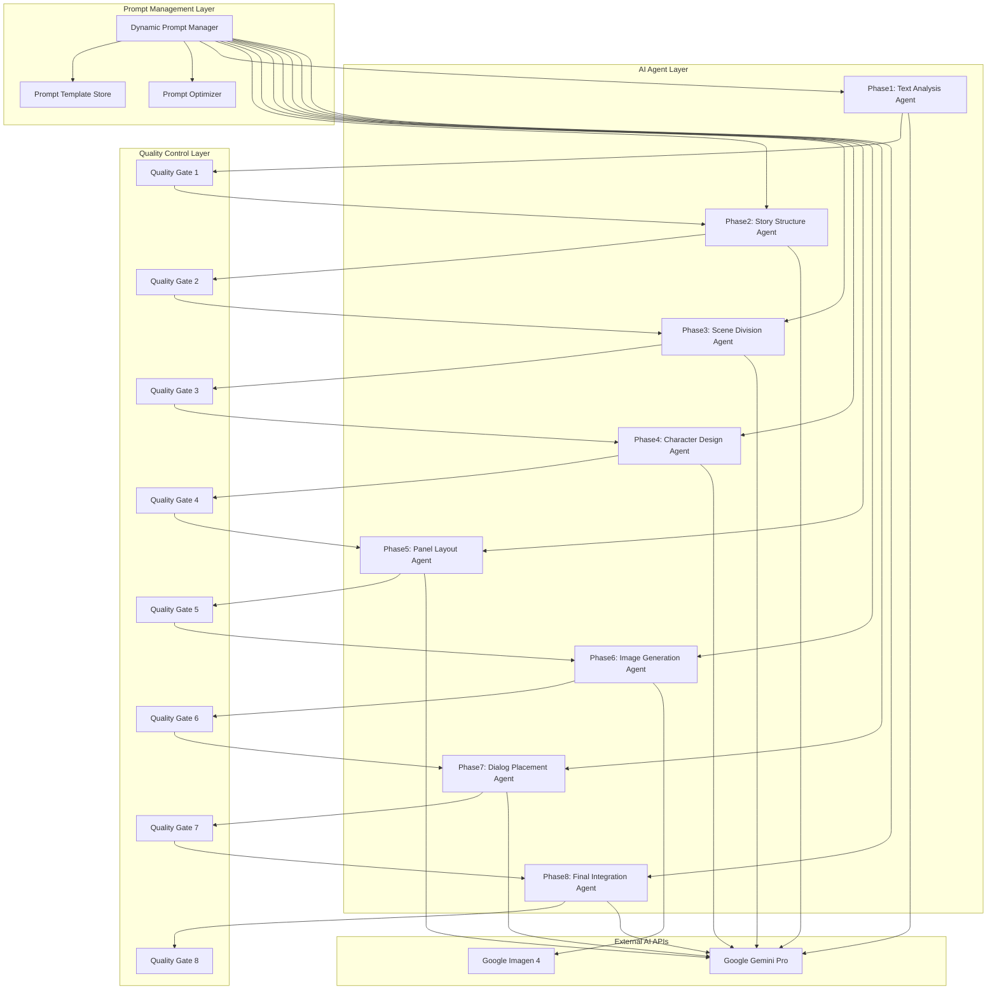

# AI漫画生成サービス AI設計書

**文書管理情報**
- 文書ID: AI-DOC-001
- 作成日: 2025-01-20
- 版数: 1.0
- 承認者: 根岸祐樹
- 関連文書: SYS-DOC-001（システム設計書）、TEST-DOC-001（テスト設計書）

## 目次

- [1. AI設計概要](#1-ai設計概要)
  - [1.1 AI設計方針](#11-ai設計方針)
  - [1.2 エージェントアーキテクチャ](#12-エージェントアーキテクチャ)
- [2. 8段階AIエージェント設計](#2-8段階aiエージェント設計)
  - [2.1 エージェント独立性設計](#21-エージェント独立性設計)
  - [2.2 データフロー設計](#22-データフロー設計)
  - [2.3 エージェント仕様](#23-エージェント仕様)
- [3. プロンプトエンジニアリング設計](#3-プロンプトエンジニアリング設計)
  - [3.1 動的プロンプトシステム](#31-動的プロンプトシステム)
  - [3.2 構造化テンプレート管理](#32-構造化テンプレート管理)
  - [3.3 プロンプト最適化戦略](#33-プロンプト最適化戦略)
- [4. 品質制御システム](#4-品質制御システム)
  - [4.1 基本品質評価](#41-基本品質評価)
  - [4.2 品質ゲート実装](#42-品質ゲート実装)
  - [4.3 リトライ機構](#43-リトライ機構)
- [5. AI学習・改善システム](#5-ai学習改善システム)
  - [5.1 フィードバック収集](#51-フィードバック収集)
  - [5.2 基本改善プロセス](#52-基本改善プロセス)
  - [5.3 統計分析](#53-統計分析)
- [6. 外部AI API統合設計](#6-外部ai-api統合設計)
  - [6.1 Google Gemini Pro統合](#61-google-gemini-pro統合)
  - [6.2 Google Imagen 4統合](#62-google-imagen-4統合)
  - [6.3 APIレート制限管理](#63-apiレート制限管理)
- [7. AI処理パフォーマンス設計](#7-ai処理パフォーマンス設計)
  - [7.1 処理時間最適化](#71-処理時間最適化)
  - [7.2 並列処理設計](#72-並列処理設計)
  - [7.3 リソース効率化](#73-リソース効率化)
- [8. AI倫理・安全性設計](#8-ai倫理安全性設計)
  - [8.1 コンテンツ安全性](#81-コンテンツ安全性)
  - [8.2 バイアス軽減](#82-バイアス軽減)
  - [8.3 透明性確保](#83-透明性確保)
- [9. AI運用・監視](#9-ai運用監視)

---

## 1. AI設計概要

### 1.1 AI設計方針

#### 基本原則
| 原則 | 内容 | 実装アプローチ |
|------|------|---------------|
| 独立性確保 | 各エージェントの自律動作 | Pub/Sub非同期通信 |
| 品質重視 | 85%品質スコア達成 | 段階的品質ゲート |
| 効率性追求 | 処理時間とコストの最適化 | 動的プロンプト選択 |
| 継続改善 | ユーザーフィードバックによる改善 | 月次統計分析 |

#### AI設計思想
```yaml
AI Design Philosophy:
  Processing Model: 独立エージェント型
    - 各フェーズは独立したAIエージェント
    - 障害分離による信頼性確保
    - スケーラブルな処理分散
    
  Quality Assurance: 段階的品質管理
    - フェーズ毎の品質ゲート
    - 自動リトライ機構
    - 品質劣化の早期検出
    
  User Experience: 透明性と予測可能性
    - 処理進捗の可視化
    - 品質スコアの開示
    - 改善提案の提供
```

### 1.2 エージェントアーキテクチャ

#### 独立エージェント構成


---

## 2. 8段階AIエージェント設計

### 2.1 エージェント独立性設計

#### 独立エージェント基底クラス
```python
from abc import ABC, abstractmethod
import asyncio
import json
from datetime import datetime

class BaseAIAgent(ABC):
    """
    AI エージェント基底クラス
    """
    
    def __init__(self, agent_id: str, redis_client, pubsub_client):
        self.agent_id = agent_id
        self.redis = redis_client
        self.pubsub = pubsub_client
        self.quality_threshold = 0.70
        self.max_retries = 2
        
    @abstractmethod
    async def process(self, input_data: dict) -> dict:
        """
        エージェント固有の処理ロジック
        """
        pass
    
    @abstractmethod
    async def evaluate_quality(self, input_data: dict, output_data: dict) -> float:
        """
        出力品質評価
        """
        pass
    
    async def execute_with_quality_gate(self, request_id: str, input_data: dict) -> dict:
        """
        品質ゲート付き実行
        """
        retry_count = 0
        best_result = None
        best_score = 0.0
        
        while retry_count < self.max_retries:
            try:
                # 処理実行
                start_time = datetime.now()
                output = await self.process(input_data)
                processing_time = (datetime.now() - start_time).total_seconds()
                
                # 品質評価
                quality_score = await self.evaluate_quality(input_data, output)
                
                # 結果記録
                result = {
                    'agent_id': self.agent_id,
                    'request_id': request_id,
                    'output': output,
                    'quality_score': quality_score,
                    'processing_time': processing_time,
                    'retry_count': retry_count,
                    'timestamp': datetime.now().isoformat()
                }
                
                # 品質ゲート判定
                if quality_score >= self.quality_threshold:
                    await self.log_success(result)
                    await self.save_result_to_redis(request_id, result)
                    return result
                
                # 品質不足 - 最良結果を記録
                if quality_score > best_score:
                    best_result = result
                    best_score = quality_score
                
                retry_count += 1
                await self.log_retry(request_id, retry_count, quality_score)
                
            except Exception as e:
                retry_count += 1
                await self.log_error(request_id, retry_count, str(e))
        
        # 最終失敗処理
        if best_result and best_score > 0.60:  # 60%以上なら許容
            await self.log_degraded_success(best_result)
            return best_result
        else:
            raise QualityGateFailure(f"Agent {self.agent_id} failed quality gate")
    
    async def save_result_to_redis(self, request_id: str, result: dict):
        """
        処理結果をRedisに保存
        """
        key = f"request:{request_id}:{self.agent_id}:result"
        await self.redis.setex(key, 86400, json.dumps(result))  # 24時間TTL
```

#### Phase 1: テキスト解析エージェント
```python
class TextAnalysisAgent(BaseAIAgent):
    def __init__(self, redis_client, pubsub_client):
        super().__init__("phase1-text-analysis", redis_client, pubsub_client)
        self.gemini_client = self.initialize_gemini_client()
        self.prompt_manager = DynamicPromptManager("text_analysis")
        
    async def process(self, input_data: dict) -> dict:
        """
        テキスト解析処理
        """
        text = input_data['text']
        style = input_data.get('style', '少年漫画')
        
        # 動的プロンプト取得
        prompt = await self.prompt_manager.get_optimized_prompt({
            'text_length': len(text),
            'style': style,
            'complexity': self.estimate_text_complexity(text)
        })
        
        # Gemini Pro API 呼び出し
        response = await self.gemini_client.generate_content(
            prompt.format(text=text, style=style)
        )
        
        # 結果パース
        analysis_result = self.parse_analysis_result(response.text)
        
        return {
            'characters': analysis_result['characters'],
            'themes': analysis_result['themes'],
            'emotions': analysis_result['emotions'],
            'chapters': analysis_result['chapters'],
            'complexity_score': analysis_result['complexity_score']
        }
    
    async def evaluate_quality(self, input_data: dict, output_data: dict) -> float:
        """
        テキスト解析品質評価
        """
        scores = []
        
        # キャラクター抽出品質
        character_score = self.evaluate_character_extraction(
            input_data['text'], output_data['characters']
        )
        scores.append(character_score * 0.4)
        
        # テーマ理解品質
        theme_score = self.evaluate_theme_understanding(
            input_data['text'], output_data['themes']
        )
        scores.append(theme_score * 0.3)
        
        # 構造理解品質
        structure_score = self.evaluate_structure_understanding(
            input_data['text'], output_data['chapters']
        )
        scores.append(structure_score * 0.3)
        
        return sum(scores)
```

#### Phase 6: 画像生成エージェント
```python
class ImageGenerationAgent(BaseAIAgent):
    def __init__(self, redis_client, pubsub_client):
        super().__init__("phase6-image-generation", redis_client, pubsub_client)
        self.imagen_client = self.initialize_imagen_client()
        self.prompt_manager = DynamicPromptManager("image_generation")
        
    async def process(self, input_data: dict) -> dict:
        """
        画像生成処理
        """
        scenes = input_data['scenes']
        characters = input_data['characters']
        style = input_data['style']
        
        generated_images = []
        
        for scene in scenes:
            # シーン別動的プロンプト生成
            image_prompt = await self.prompt_manager.get_optimized_prompt({
                'scene_type': scene['type'],
                'characters_in_scene': scene['characters'],
                'emotion': scene['emotion'],
                'setting': scene['setting'],
                'style': style
            })
            
            # Imagen 4 API 呼び出し
            image_response = await self.imagen_client.generate_images(
                prompt=image_prompt,
                number_of_images=1,
                aspect_ratio='16:9',
                safety_filter_level='block_some'
            )
            
            generated_images.append({
                'scene_id': scene['id'],
                'image_url': image_response.images[0].gcs_uri,
                'prompt_used': image_prompt,
                'generation_time': image_response.generation_time
            })
        
        return {
            'images': generated_images,
            'total_images': len(generated_images),
            'style_consistency_score': await self.calculate_style_consistency(generated_images)
        }
    
    async def evaluate_quality(self, input_data: dict, output_data: dict) -> float:
        """
        画像生成品質評価
        """
        images = output_data['images']
        quality_scores = []
        
        for image in images:
            # 技術的品質評価
            tech_score = await self.evaluate_image_technical_quality(image['image_url'])
            
            # シーン一致度評価
            scene_score = await self.evaluate_scene_matching(
                input_data['scenes'], image
            )
            
            # スタイル一貫性評価
            style_score = output_data['style_consistency_score']
            
            image_quality = (tech_score * 0.4) + (scene_score * 0.4) + (style_score * 0.2)
            quality_scores.append(image_quality)
        
        return sum(quality_scores) / len(quality_scores) if quality_scores else 0.0
```

### 2.2 データフロー設計

#### エージェント間データ受け渡し
```python
class AgentDataFlow:
    """
    エージェント間のデータフロー管理
    """
    
    def __init__(self, redis_client, pubsub_client):
        self.redis = redis_client
        self.pubsub = pubsub_client
        
    async def publish_phase_completion(self, phase: int, request_id: str, output_data: dict):
        """
        フェーズ完了の通知・データ引き渡し
        """
        # Redis にデータ保存
        redis_key = f"request:{request_id}:phase{phase}:output"
        await self.redis.setex(redis_key, 86400, json.dumps(output_data))
        
        # 次フェーズへの通知
        message = {
            'request_id': request_id,
            'completed_phase': phase,
            'next_phase': phase + 1,
            'redis_key': redis_key,
            'timestamp': datetime.now().isoformat(),
            'quality_score': output_data.get('quality_score', 0)
        }
        
        # Pub/Sub メッセージ送信
        topic_name = f"phase{phase}-completed"
        await self.pubsub.publish(topic_name, json.dumps(message))
    
    async def get_previous_phase_data(self, request_id: str, current_phase: int) -> dict:
        """
        前フェーズのデータ取得
        """
        previous_phase = current_phase - 1
        if previous_phase < 1:
            return {}
        
        # Redis からデータ取得
        redis_key = f"request:{request_id}:phase{previous_phase}:output"
        data = await self.redis.get(redis_key)
        
        if data:
            return json.loads(data)
        else:
            raise DataNotFoundError(f"Previous phase data not found: {redis_key}")
    
    async def get_cumulative_context(self, request_id: str, current_phase: int) -> dict:
        """
        累積コンテキスト取得（必要に応じて）
        """
        context = {}
        
        # Phase 1-3: ストーリー基盤情報
        if current_phase >= 2:
            phase1_data = await self.get_phase_data(request_id, 1)
            context['text_analysis'] = phase1_data
            
        if current_phase >= 3:
            phase2_data = await self.get_phase_data(request_id, 2)
            context['story_structure'] = phase2_data
            
        # Phase 4以降: キャラクター・設定情報
        if current_phase >= 5:
            context['characters'] = await self.get_phase_data(request_id, 4)
            
        return context
```

### 2.3 エージェント仕様

#### エージェント個別仕様
```yaml
Agent Specifications:
  Phase1_TextAnalysisAgent:
    Input: {text: str, style: str, pages: int}
    Output: {characters: list, themes: list, emotions: list, chapters: list}
    AI_API: Gemini Pro
    Processing_Time: 30s
    Quality_Metrics: [character_extraction, theme_understanding, structure_recognition]
    
  Phase2_StoryStructureAgent:
    Input: {text_analysis: dict, user_preferences: dict}
    Output: {plot_structure: dict, pacing: dict, dramatic_arc: list}
    AI_API: Gemini Pro
    Processing_Time: 60s
    Quality_Metrics: [plot_coherence, pacing_quality, dramatic_effectiveness]
    
  Phase3_SceneDivisionAgent:
    Input: {story_structure: dict, target_pages: int}
    Output: {scenes: list, page_allocation: dict, transitions: list}
    AI_API: Gemini Pro
    Processing_Time: 60s
    Quality_Metrics: [scene_boundary_accuracy, page_distribution, transition_quality]
    
  Phase4_CharacterDesignAgent:
    Input: {characters: list, style: str, scenes: list}
    Output: {character_designs: list, relationships: dict, visual_consistency: dict}
    AI_API: Gemini Pro
    Processing_Time: 60s
    Quality_Metrics: [visual_consistency, character_distinctiveness, style_adherence]
    
  Phase5_PanelLayoutAgent:
    Input: {scenes: list, characters: list, page_count: int}
    Output: {panel_layouts: list, reading_flow: dict, composition: dict}
    AI_API: Gemini Pro
    Processing_Time: 60s
    Quality_Metrics: [layout_balance, reading_flow, space_efficiency]
    
  Phase6_ImageGenerationAgent:
    Input: {scenes: list, character_designs: list, panel_layouts: list}
    Output: {images: list, style_consistency_score: float}
    AI_API: Imagen 4
    Processing_Time: 180s
    Quality_Metrics: [technical_quality, scene_matching, style_consistency]
    
  Phase7_DialogPlacementAgent:
    Input: {images: list, dialogs: list, panel_layouts: list}
    Output: {final_pages: list, readability_score: float}
    AI_API: Gemini Pro
    Processing_Time: 60s
    Quality_Metrics: [text_readability, bubble_placement, font_selection]
    
  Phase8_FinalIntegrationAgent:
    Input: {final_pages: list, metadata: dict}
    Output: {manga_pdf: str, manga_webp: list, metadata: dict}
    AI_API: Gemini Pro
    Processing_Time: 120s
    Quality_Metrics: [overall_coherence, technical_quality, user_experience]
```

---

## 3. プロンプトエンジニアリング設計

### 3.1 動的プロンプトシステム

#### 動的プロンプト選択エンジン
```python
class DynamicPromptManager:
    def __init__(self, agent_type: str):
        self.agent_type = agent_type
        self.template_store = PromptTemplateStore()
        self.optimizer = PromptOptimizer()
        self.performance_tracker = PromptPerformanceTracker()
        
    async def get_optimized_prompt(self, context: dict) -> str:
        """
        コンテキストに最適化されたプロンプト取得
        """
        # 1. コンテキスト分析
        context_features = self.extract_context_features(context)
        
        # 2. 最適テンプレート選択
        template_id = await self.select_best_template(context_features)
        
        # 3. テンプレート取得・パラメータ注入
        template = await self.template_store.get_template(template_id)
        prompt = await self.inject_parameters(template, context)
        
        # 4. 動的最適化適用
        optimized_prompt = await self.optimizer.optimize_prompt(prompt, context_features)
        
        # 5. 使用記録
        await self.performance_tracker.log_prompt_usage(template_id, context_features)
        
        return optimized_prompt
    
    def extract_context_features(self, context: dict) -> dict:
        """
        コンテキスト特徴抽出
        """
        features = {}
        
        if self.agent_type == "text_analysis":
            features = {
                'text_length_category': self.categorize_text_length(context.get('text_length', 0)),
                'style': context.get('style', '少年漫画'),
                'complexity': context.get('complexity', 'medium')
            }
        elif self.agent_type == "image_generation":
            features = {
                'scene_type': context.get('scene_type', 'dialogue'),
                'character_count': len(context.get('characters_in_scene', [])),
                'emotion_intensity': context.get('emotion', 'neutral'),
                'setting_complexity': context.get('setting', 'simple'),
                'style': context.get('style', '少年漫画')
            }
        
        return features
    
    async def select_best_template(self, context_features: dict) -> str:
        """
        最適テンプレート選択
        """
        # パフォーマンス履歴取得
        template_performance = await self.performance_tracker.get_template_performance(
            self.agent_type, context_features
        )
        
        # 成功率が最も高いテンプレートを選択
        best_template = max(
            template_performance.items(),
            key=lambda x: x[1]['success_rate']
        )
        
        return best_template[0]
```

### 3.2 構造化テンプレート管理

#### 階層的プロンプトテンプレート
```python
class PromptTemplateStore:
    def __init__(self):
        self.templates = self.load_template_hierarchy()
        
    def load_template_hierarchy(self) -> dict:
        """
        階層的テンプレート構造読み込み
        """
        return {
            "text_analysis": {
                "base": {
                    "id": "text_analysis_base",
                    "template": """
あなたは漫画制作の専門家です。以下のテキストを分析し、漫画制作に必要な要素を抽出してください。

【分析対象テキスト】
{text}

【出力形式】
JSON形式で以下の項目を出力してください：
- characters: 主要キャラクター名のリスト（最大10名）
- themes: 物語のテーマ（最大5つ）
- emotions: 物語全体の感情（最大3つ）
- chapters: 章・場面の区切り
- complexity_score: 複雑度スコア（0.0-1.0）

【注意事項】
- 客観的な分析に徹してください
- 既存作品との類似は避けてください
- {style}スタイルに適した解釈をしてください
""",
                    "parameters": ["text", "style"]
                },
                "short_text": {
                    "id": "text_analysis_short",
                    "inherits": "text_analysis_base",
                    "modifications": {
                        "additional_instruction": "短いテキストのため、詳細な補完分析を行ってください。"
                    }
                },
                "long_text": {
                    "id": "text_analysis_long",
                    "inherits": "text_analysis_base", 
                    "modifications": {
                        "additional_instruction": "長編テキストのため、重要な要素のみを抽出してください。"
                    }
                },
                "complex_text": {
                    "id": "text_analysis_complex",
                    "inherits": "text_analysis_base",
                    "modifications": {
                        "additional_instruction": "複雑な構造のため、段階的に分析してください。"
                    }
                }
            },
            "image_generation": {
                "base": {
                    "id": "image_generation_base",
                    "template": """
{style}スタイルの漫画の1シーンを生成してください。

【シーン情報】
- 場面: {setting}
- キャラクター: {characters}
- 感情: {emotion}
- アクション: {action}

【スタイル指定】
- 漫画スタイル: {style}
- 構図: {composition}
- カラーパレット: {color_palette}

【品質要件】
- 高解像度（1024x1024以上）
- キャラクターの一貫性維持
- 読みやすい構図
- 適切な感情表現

【禁止事項】
- 既存作品キャラクターの模倣
- 不適切な表現
- 著作権侵害的な要素
""",
                    "parameters": ["style", "setting", "characters", "emotion", "action", "composition", "color_palette"]
                },
                "action_scene": {
                    "id": "image_generation_action",
                    "inherits": "image_generation_base",
                    "modifications": {
                        "additional_instruction": "動的でエネルギッシュな構図を重視してください。"
                    }
                },
                "dialogue_scene": {
                    "id": "image_generation_dialogue", 
                    "inherits": "image_generation_base",
                    "modifications": {
                        "additional_instruction": "キャラクターの表情と感情表現を重視してください。"
                    }
                }
            }
        }
    
    async def get_template(self, template_id: str) -> dict:
        """
        テンプレート取得（継承処理含む）
        """
        # テンプレート階層を辿って最終テンプレート生成
        agent_type, template_name = template_id.split('_', 1)
        template_config = self.templates[agent_type][template_name]
        
        # 基底テンプレートから継承
        if 'inherits' in template_config:
            base_template = await self.get_template(f"{agent_type}_{template_config['inherits']}")
            final_template = self.merge_templates(base_template, template_config)
        else:
            final_template = template_config
        
        return final_template
    
    def merge_templates(self, base: dict, override: dict) -> dict:
        """
        テンプレート継承・マージ処理
        """
        merged = base.copy()
        
        # 基本テンプレートに追加指示を統合
        if 'modifications' in override:
            modifications = override['modifications']
            if 'additional_instruction' in modifications:
                merged['template'] += f"\n\n【追加指示】\n{modifications['additional_instruction']}"
        
        return merged
```

### 3.3 プロンプト最適化戦略

#### A/Bテストによる最適化
```python
class PromptOptimizer:
    def __init__(self):
        self.experiment_manager = ABTestManager()
        self.performance_analyzer = PromptPerformanceAnalyzer()
        
    async def optimize_prompt(self, base_prompt: str, context_features: dict) -> str:
        """
        プロンプト最適化
        """
        # 現在実行中のA/Bテスト確認
        active_experiments = await self.experiment_manager.get_active_experiments(
            self.agent_type, context_features
        )
        
        if active_experiments:
            # A/Bテスト参加
            selected_variant = await self.experiment_manager.select_variant(active_experiments[0])
            optimized_prompt = self.apply_variant_modifications(base_prompt, selected_variant)
        else:
            # 標準プロンプト使用
            optimized_prompt = base_prompt
        
        return optimized_prompt
    
    async def create_prompt_experiment(self, template_id: str, variants: list) -> str:
        """
        プロンプトA/Bテスト作成
        """
        experiment = {
            'id': f"prompt_exp_{datetime.now().strftime('%Y%m%d_%H%M')}",
            'template_id': template_id,
            'variants': variants,
            'success_metric': 'quality_score',
            'traffic_split': {'control': 50, 'variant_a': 25, 'variant_b': 25},
            'duration_days': 7,
            'min_samples': 100
        }
        
        await self.experiment_manager.create_experiment(experiment)
        return experiment['id']

class PromptPerformanceTracker:
    async def log_prompt_performance(self, template_id: str, context: dict, quality_score: float, processing_time: float):
        """
        プロンプト性能記録
        """
        performance_record = {
            'template_id': template_id,
            'context_hash': self.hash_context(context),
            'quality_score': quality_score,
            'processing_time': processing_time,
            'timestamp': datetime.now().isoformat(),
            'success': quality_score >= 0.70
        }
        
        # BigQuery にパフォーマンスデータ保存
        await self.save_to_bigquery('prompt_performance', performance_record)
    
    async def analyze_monthly_performance(self) -> dict:
        """
        月次プロンプト性能分析
        """
        query = """
        SELECT 
            template_id,
            AVG(quality_score) as avg_quality,
            AVG(processing_time) as avg_time,
            COUNT(*) as usage_count,
            SUM(CASE WHEN success THEN 1 ELSE 0 END) / COUNT(*) as success_rate
        FROM `manga_service.prompt_performance`
        WHERE timestamp >= TIMESTAMP_SUB(CURRENT_TIMESTAMP(), INTERVAL 30 DAY)
        GROUP BY template_id
        ORDER BY avg_quality DESC
        """
        
        results = await self.execute_bigquery(query)
        
        return {
            'top_performing_templates': results[:5],
            'underperforming_templates': [r for r in results if r['avg_quality'] < 0.8],
            'optimization_opportunities': await self.identify_optimization_opportunities(results)
        }
```

---

## 4. 品質制御システム

### 4.1 基本品質評価

#### 品質評価フレームワーク
```python
class QualityEvaluationFramework:
    def __init__(self):
        self.evaluators = {
            'text_analysis': TextAnalysisQualityEvaluator(),
            'story_structure': StoryStructureQualityEvaluator(),
            'scene_division': SceneDivisionQualityEvaluator(),
            'character_design': CharacterDesignQualityEvaluator(),
            'panel_layout': PanelLayoutQualityEvaluator(),
            'image_generation': ImageGenerationQualityEvaluator(),
            'dialog_placement': DialogPlacementQualityEvaluator(),
            'final_integration': FinalIntegrationQualityEvaluator()
        }
    
    async def evaluate_phase_quality(self, phase: int, input_data: dict, output_data: dict) -> dict:
        """
        フェーズ品質評価
        """
        agent_type = self.get_agent_type(phase)
        evaluator = self.evaluators[agent_type]
        
        # 基本品質スコア算出
        quality_score = await evaluator.calculate_quality_score(input_data, output_data)
        
        # 品質詳細分析
        quality_breakdown = await evaluator.analyze_quality_components(input_data, output_data)
        
        # 改善提案生成
        improvements = await evaluator.suggest_improvements(input_data, output_data, quality_score)
        
        return {
            'phase': phase,
            'agent_type': agent_type,
            'quality_score': quality_score,
            'passes_gate': quality_score >= 0.85,
            'quality_breakdown': quality_breakdown,
            'improvement_suggestions': improvements,
            'evaluation_timestamp': datetime.now().isoformat()
        }

# Phase 1専用品質評価器
class TextAnalysisQualityEvaluator:
    async def calculate_quality_score(self, input_data: dict, output_data: dict) -> float:
        """
        テキスト解析品質スコア算出
        """
        text = input_data['text']
        analysis = output_data
        
        scores = []
        
        # 1. キャラクター抽出精度 (40%)
        character_score = self.evaluate_character_extraction(text, analysis['characters'])
        scores.append(character_score * 0.4)
        
        # 2. テーマ理解度 (30%)
        theme_score = self.evaluate_theme_understanding(text, analysis['themes'])
        scores.append(theme_score * 0.3)
        
        # 3. 構造認識精度 (30%)
        structure_score = self.evaluate_structure_recognition(text, analysis['chapters'])
        scores.append(structure_score * 0.3)
        
        return sum(scores)
    
    def evaluate_character_extraction(self, text: str, characters: list) -> float:
        """
        キャラクター抽出精度評価
        """
        # 期待キャラクター数の推定
        estimated_characters = self.estimate_character_count(text)
        extracted_count = len(characters)
        
        # 抽出数の適切性
        count_accuracy = min(1.0, extracted_count / max(1, estimated_characters))
        
        # キャラクター名の妥当性チェック
        name_validity = self.check_character_name_validity(characters)
        
        # 重複排除チェック
        uniqueness = len(set(characters)) / len(characters) if characters else 1.0
        
        return (count_accuracy * 0.5) + (name_validity * 0.3) + (uniqueness * 0.2)
```

### 4.2 品質ゲート実装

#### 品質判定ロジック
```python
class QualityGate:
    def __init__(self):
        self.quality_thresholds = {
            'minimum_acceptable': 0.60,  # 最低許容レベル
            'target_quality': 0.70,     # 目標品質レベル
            'exceptional_quality': 0.85  # 優秀品質レベル
        }
        
    async def execute_quality_gate(self, phase: int, input_data: dict, output_data: dict) -> dict:
        """
        品質ゲート実行
        """
        # 品質評価実行
        quality_result = await self.evaluate_quality(phase, input_data, output_data)
        quality_score = quality_result['quality_score']
        
        # 判定処理
        if quality_score >= self.quality_thresholds['target_quality']:
            decision = 'pass'
            action = 'proceed_to_next_phase'
        elif quality_score >= self.quality_thresholds['minimum_acceptable']:
            decision = 'conditional_pass'
            action = 'proceed_with_warning'
        else:
            decision = 'fail'
            action = 'retry_or_escalate'
        
        # 結果記録
        gate_result = {
            'phase': phase,
            'quality_score': quality_score,
            'decision': decision,
            'action': action,
            'quality_breakdown': quality_result['quality_breakdown'],
            'threshold_comparison': {
                'target': self.quality_thresholds['target_quality'],
                'minimum': self.quality_thresholds['minimum_acceptable'],
                'actual': quality_score
            },
            'timestamp': datetime.now().isoformat()
        }
        
        await self.log_quality_gate_result(gate_result)
        return gate_result
```

### 4.3 リトライ機構

#### インテリジェントリトライ
```python
class IntelligentRetryManager:
    def __init__(self):
        self.retry_strategies = {
            'low_quality': 'parameter_adjustment',
            'api_timeout': 'exponential_backoff',
            'api_error': 'alternative_model',
            'content_filter': 'prompt_modification'
        }
    
    async def execute_retry(self, phase: int, failure_reason: str, context: dict) -> dict:
        """
        インテリジェントリトライ実行
        """
        retry_strategy = self.retry_strategies.get(failure_reason, 'standard_retry')
        
        if retry_strategy == 'parameter_adjustment':
            # パラメータ調整リトライ
            modified_context = await self.adjust_parameters(context, failure_reason)
            return await self.execute_phase_with_modified_context(phase, modified_context)
            
        elif retry_strategy == 'prompt_modification':
            # プロンプト修正リトライ
            modified_prompt = await self.modify_prompt_for_retry(context)
            return await self.execute_phase_with_modified_prompt(phase, modified_prompt, context)
            
        else:
            # 標準リトライ
            await asyncio.sleep(self.calculate_backoff_delay(context['retry_count']))
            return await self.execute_standard_retry(phase, context)
    
    async def adjust_parameters(self, context: dict, failure_reason: str) -> dict:
        """
        失敗理由に基づくパラメータ調整
        """
        modified_context = context.copy()
        
        if failure_reason == 'low_quality':
            # 品質向上のためのパラメータ調整
            if context.get('temperature'):
                modified_context['temperature'] = max(0.1, context['temperature'] - 0.2)
            if context.get('max_tokens'):
                modified_context['max_tokens'] = min(4000, context['max_tokens'] + 500)
        
        return modified_context
```

---

## 5. AI学習・改善システム

### 5.1 フィードバック収集

#### 多層フィードバック収集
```python
class FeedbackCollectionSystem:
    def __init__(self):
        self.feedback_channels = {
            'user_rating': UserRatingCollector(),
            'quality_metrics': QualityMetricsCollector(), 
            'performance_metrics': PerformanceMetricsCollector(),
            'error_patterns': ErrorPatternCollector()
        }
        
    async def collect_comprehensive_feedback(self, request_id: str) -> dict:
        """
        包括的フィードバック収集
        """
        feedback_data = {}
        
        # 1. ユーザー評価収集（非同期）
        feedback_data['user_rating'] = await self.feedback_channels['user_rating'].collect(request_id)
        
        # 2. 技術品質メトリクス
        feedback_data['quality_metrics'] = await self.feedback_channels['quality_metrics'].collect(request_id)
        
        # 3. 性能メトリクス
        feedback_data['performance_metrics'] = await self.feedback_channels['performance_metrics'].collect(request_id)
        
        # 4. エラーパターン分析
        feedback_data['error_patterns'] = await self.feedback_channels['error_patterns'].collect(request_id)
        
        # 5. 統合分析
        integrated_feedback = await self.integrate_feedback_data(feedback_data)
        
        # 6. 改善機会特定
        improvement_opportunities = await self.identify_improvement_opportunities(integrated_feedback)
        
        return {
            'request_id': request_id,
            'feedback_data': feedback_data,
            'integrated_analysis': integrated_feedback,
            'improvement_opportunities': improvement_opportunities,
            'collection_timestamp': datetime.now().isoformat()
        }

class UserRatingCollector:
    async def collect(self, request_id: str) -> dict:
        """
        ユーザー評価収集
        """
        # ユーザー評価データベースから取得
        rating_data = await self.get_user_rating(request_id)
        
        if rating_data:
            return {
                'overall_rating': rating_data['rating'],
                'specific_ratings': {
                    'story_quality': rating_data.get('story', 3),
                    'art_quality': rating_data.get('art', 3),
                    'character_design': rating_data.get('characters', 3),
                    'layout_quality': rating_data.get('layout', 3)
                },
                'text_feedback': rating_data.get('comments', ''),
                'rating_timestamp': rating_data['created_at']
            }
        else:
            # 評価待ち（30日後に再収集）
            return {'status': 'pending', 'retry_after': 30 * 24 * 3600}
```

### 5.2 基本改善プロセス

#### 月次改善サイクル
```python
class BasicImprovementProcess:
    def __init__(self):
        self.feedback_analyzer = FeedbackAnalyzer()
        self.improvement_executor = ImprovementExecutor()
        
    async def execute_monthly_improvement_cycle(self) -> dict:
        """
        月次改善サイクル実行
        """
        print("=== 月次AI改善サイクル開始 ===")
        
        # 1. 過去30日のデータ収集
        monthly_data = await self.collect_monthly_feedback_data()
        
        # 2. パフォーマンス分析
        performance_analysis = await self.analyze_monthly_performance(monthly_data)
        
        # 3. 改善機会特定
        improvement_opportunities = await self.identify_improvement_opportunities(performance_analysis)
        
        # 4. 改善計画作成
        improvement_plan = await self.create_improvement_plan(improvement_opportunities)
        
        # 5. 安全な改善の自動実行
        auto_improvements = [imp for imp in improvement_plan if imp['risk_level'] == 'low']
        executed_improvements = []
        
        for improvement in auto_improvements:
            try:
                result = await self.improvement_executor.execute_improvement(improvement)
                executed_improvements.append({
                    'improvement': improvement,
                    'result': result,
                    'status': 'success'
                })
            except Exception as e:
                executed_improvements.append({
                    'improvement': improvement,
                    'error': str(e),
                    'status': 'failed'
                })
        
        # 6. 手動レビュー必要な改善のレポート
        manual_review_needed = [imp for imp in improvement_plan if imp['risk_level'] != 'low']
        
        return {
            'analysis_period': '30 days',
            'total_requests_analyzed': monthly_data['total_requests'],
            'performance_summary': performance_analysis['summary'],
            'improvement_opportunities': len(improvement_opportunities),
            'auto_executed_improvements': len(executed_improvements),
            'manual_review_needed': len(manual_review_needed),
            'manual_review_items': manual_review_needed
        }
    
    async def identify_improvement_opportunities(self, performance_data: dict) -> list:
        """
        改善機会特定
        """
        opportunities = []
        
        # 品質スコア分析
        for phase, metrics in performance_data['phase_metrics'].items():
            if metrics['avg_quality_score'] < 0.80:
                opportunities.append({
                    'type': 'quality_improvement',
                    'phase': phase,
                    'current_score': metrics['avg_quality_score'],
                    'target_score': 0.85,
                    'risk_level': 'low',
                    'estimated_impact': 'medium'
                })
        
        # 処理時間分析
        for phase, metrics in performance_data['phase_metrics'].items():
            if metrics['avg_processing_time'] > metrics['time_limit'] * 0.8:
                opportunities.append({
                    'type': 'performance_optimization',
                    'phase': phase,
                    'current_time': metrics['avg_processing_time'],
                    'target_time': metrics['time_limit'] * 0.7,
                    'risk_level': 'medium',
                    'estimated_impact': 'high'
                })
        
        return opportunities
```

### 5.3 統計分析

#### AI性能統計分析
```python
class AIPerformanceStatistics:
    def __init__(self):
        self.bigquery_client = bigquery.Client()
        
    async def generate_monthly_ai_report(self) -> dict:
        """
        月次AI性能レポート生成
        """
        # 1. 基本統計
        basic_stats = await self.calculate_basic_statistics()
        
        # 2. 品質トレンド分析
        quality_trends = await self.analyze_quality_trends()
        
        # 3. ユーザー満足度分析
        user_satisfaction = await self.analyze_user_satisfaction()
        
        # 4. コスト効率分析
        cost_efficiency = await self.analyze_cost_efficiency()
        
        # 5. 技術的指標
        technical_metrics = await self.calculate_technical_metrics()
        
        return {
            'report_period': 'monthly',
            'basic_statistics': basic_stats,
            'quality_trends': quality_trends,
            'user_satisfaction': user_satisfaction,
            'cost_efficiency': cost_efficiency,
            'technical_metrics': technical_metrics,
            'key_insights': await self.extract_key_insights(basic_stats, quality_trends, user_satisfaction),
            'recommendations': await self.generate_monthly_recommendations(quality_trends, user_satisfaction)
        }
    
    async def calculate_basic_statistics(self) -> dict:
        """
        基本統計計算
        """
        query = """
        SELECT 
            COUNT(*) as total_requests,
            AVG(overall_quality_score) as avg_quality,
            AVG(total_processing_time) as avg_processing_time,
            SUM(CASE WHEN status = 'success' THEN 1 ELSE 0 END) / COUNT(*) as success_rate,
            COUNT(DISTINCT user_id) as unique_users
        FROM `manga_service.ai_processing_logs`
        WHERE DATE(timestamp) >= DATE_SUB(CURRENT_DATE(), INTERVAL 30 DAY)
        """
        
        result = await self.execute_query(query)
        return result[0] if result else {}
```

---

## 6. 外部AI API統合設計

### 6.1 Google Gemini Pro統合

#### Gemini Pro最適化設定
```python
class GeminiProIntegration:
    def __init__(self):
        self.client = self.initialize_gemini_client()
        self.optimization_settings = {
            'text_analysis': {
                'temperature': 0.3,      # 一貫した分析のため低温度
                'top_p': 0.8,
                'max_tokens': 2048,
                'safety_settings': 'block_medium_and_above'
            },
            'story_structure': {
                'temperature': 0.5,      # 創造性と構造のバランス
                'top_p': 0.9,
                'max_tokens': 3072,
                'safety_settings': 'block_medium_and_above'
            },
            'character_design': {
                'temperature': 0.7,      # 創造的なキャラクター設定
                'top_p': 0.9,
                'max_tokens': 2048,
                'safety_settings': 'block_medium_and_above'
            }
        }
    
    async def generate_with_optimization(self, agent_type: str, prompt: str, context: dict) -> dict:
        """
        最適化設定でのGemini Pro呼び出し
        """
        settings = self.optimization_settings.get(agent_type, self.optimization_settings['text_analysis'])
        
        # A/Bテスト用設定調整
        if context.get('ab_test_variant'):
            settings = self.apply_ab_test_modifications(settings, context['ab_test_variant'])
        
        try:
            response = await self.client.generate_content(
                prompt,
                generation_config={
                    'temperature': settings['temperature'],
                    'top_p': settings['top_p'],
                    'max_output_tokens': settings['max_tokens']
                },
                safety_settings=self.get_safety_settings(settings['safety_settings'])
            )
            
            return {
                'content': response.text,
                'usage_metadata': {
                    'prompt_token_count': response.usage_metadata.prompt_token_count,
                    'candidates_token_count': response.usage_metadata.candidates_token_count,
                    'total_token_count': response.usage_metadata.total_token_count
                },
                'settings_used': settings
            }
            
        except Exception as e:
            await self.log_api_error('gemini_pro', str(e), context)
            raise AIAPIError(f"Gemini Pro API error: {str(e)}")
```

### 6.2 Google Imagen 4統合

#### Imagen 4最適化設定
```python
class Imagen4Integration:
    def __init__(self):
        self.client = self.initialize_imagen_client()
        self.style_presets = {
            '少年漫画': {
                'style_description': 'Japanese shonen manga style, dynamic action, bold lines, vibrant colors',
                'negative_prompts': ['photorealistic', 'western comic', 'realistic rendering'],
                'aspect_ratio': '4:3',
                'quality': 'high'
            },
            '少女漫画': {
                'style_description': 'Japanese shoujo manga style, delicate lines, soft colors, emotional expression',
                'negative_prompts': ['dark', 'violent', 'masculine'],
                'aspect_ratio': '4:3', 
                'quality': 'high'
            },
            'アメコミ': {
                'style_description': 'American comic book style, bold colors, dramatic shadows, superhero aesthetic',
                'negative_prompts': ['anime', 'manga', 'japanese'],
                'aspect_ratio': '3:4',
                'quality': 'high'
            }
        }
    
    async def generate_manga_image(self, scene_prompt: str, style: str, context: dict) -> dict:
        """
        漫画画像生成
        """
        style_preset = self.style_presets.get(style, self.style_presets['少年漫画'])
        
        # 完全なプロンプト構築
        full_prompt = self.build_complete_prompt(scene_prompt, style_preset, context)
        
        try:
            response = await self.client.generate_images(
                prompt=full_prompt,
                number_of_images=1,
                aspect_ratio=style_preset['aspect_ratio'],
                negative_prompt=', '.join(style_preset['negative_prompts']),
                safety_filter_level='block_some',
                person_generation='allow_adult'  # 成人キャラクターのみ
            )
            
            return {
                'image_url': response.images[0].gcs_uri,
                'prompt_used': full_prompt,
                'style_applied': style,
                'generation_metadata': {
                    'generation_time': response.generation_time,
                    'safety_ratings': response.images[0].safety_ratings
                }
            }
            
        except Exception as e:
            await self.log_api_error('imagen_4', str(e), context)
            raise AIAPIError(f"Imagen 4 API error: {str(e)}")
    
    def build_complete_prompt(self, scene_prompt: str, style_preset: dict, context: dict) -> str:
        """
        完全なプロンプト構築
        """
        # 基本プロンプト
        base_prompt = f"{scene_prompt}, {style_preset['style_description']}"
        
        # コンテキスト情報追加
        if context.get('characters'):
            character_info = ', '.join([f"{char['name']} ({char['description']})" for char in context['characters']])
            base_prompt += f", featuring characters: {character_info}"
        
        if context.get('setting'):
            base_prompt += f", setting: {context['setting']}"
        
        if context.get('mood'):
            base_prompt += f", mood: {context['mood']}"
        
        # 品質向上プロンプト
        base_prompt += ", high quality, professional manga artwork, clean lines, proper anatomy"
        
        return base_prompt
```

### 6.3 APIレート制限管理

#### インテリジェントレート制限
```python
class IntelligentRateLimitManager:
    def __init__(self, redis_client):
        self.redis = redis_client
        self.api_quotas = {
            'gemini_pro': {'daily_limit': 7000, 'burst_limit': 100},
            'imagen_4': {'daily_limit': 3000, 'burst_limit': 10}
        }
        self.usage_prediction = UsagePredictionModel()
        
    async def smart_rate_limit_check(self, api_name: str, estimated_usage: int = 1) -> dict:
        """
        インテリジェントレート制限チェック
        """
        current_usage = await self.get_current_usage(api_name)
        daily_limit = self.api_quotas[api_name]['daily_limit']
        
        # 使用量予測
        predicted_daily_usage = await self.usage_prediction.predict_daily_usage(
            api_name, current_usage, datetime.now().hour
        )
        
        # 制限判定
        if current_usage + estimated_usage > daily_limit:
            return {
                'allowed': False,
                'reason': 'daily_limit_exceeded',
                'retry_after': self.calculate_reset_time()
            }
        
        # 予測的制限
        if predicted_daily_usage > daily_limit * 0.9:  # 90%予測で警告
            return {
                'allowed': True,
                'warning': 'approaching_daily_limit',
                'predicted_usage': predicted_daily_usage,
                'recommendation': 'consider_usage_optimization'
            }
        
        # 通常処理
        await self.increment_usage(api_name, estimated_usage)
        
        return {
            'allowed': True,
            'current_usage': current_usage + estimated_usage,
            'remaining_quota': daily_limit - (current_usage + estimated_usage)
        }
    
    async def optimize_api_usage(self, request_queue: list) -> list:
        """
        API使用量最適化
        """
        # バッチ処理可能なリクエスト特定
        batchable_requests = self.identify_batchable_requests(request_queue)
        
        # 優先度による処理順序最適化
        prioritized_queue = self.prioritize_requests(request_queue)
        
        # 時間分散によるレート制限回避
        time_distributed_queue = self.distribute_requests_over_time(prioritized_queue)
        
        return time_distributed_queue
```

---

## 7. AI処理パフォーマンス設計

### 7.1 処理時間最適化

#### フェーズ別パフォーマンス最適化
```python
class AIPerformanceOptimizer:
    def __init__(self):
        self.phase_optimizers = {
            1: TextAnalysisOptimizer(),
            2: StoryStructureOptimizer(),
            3: SceneDivisionOptimizer(),
            4: CharacterDesignOptimizer(),
            5: PanelLayoutOptimizer(),
            6: ImageGenerationOptimizer(),
            7: DialogPlacementOptimizer(),
            8: FinalIntegrationOptimizer()
        }
        
    async def optimize_phase_performance(self, phase: int, context: dict) -> dict:
        """
        フェーズ別パフォーマンス最適化
        """
        optimizer = self.phase_optimizers[phase]
        
        # コンテキスト分析による最適化戦略決定
        optimization_strategy = await optimizer.determine_optimization_strategy(context)
        
        # 最適化パラメータ適用
        optimized_params = await optimizer.apply_optimization(optimization_strategy, context)
        
        return optimized_params

class ImageGenerationOptimizer:
    """
    画像生成最適化（最も重い処理）
    """
    
    async def determine_optimization_strategy(self, context: dict) -> dict:
        """
        画像生成最適化戦略決定
        """
        scene_count = len(context.get('scenes', []))
        complexity = context.get('complexity', 'medium')
        
        if scene_count > 30:
            # 大量画像生成 - バッチ処理
            strategy = 'batch_processing'
        elif complexity == 'high':
            # 高複雑度 - 段階的生成
            strategy = 'progressive_generation'
        else:
            # 標準処理
            strategy = 'standard_processing'
        
        return {
            'strategy': strategy,
            'batch_size': self.calculate_optimal_batch_size(scene_count),
            'parallel_workers': self.calculate_parallel_workers(complexity),
            'quality_vs_speed_tradeoff': 0.8  # 80% 品質重視
        }
    
    async def apply_optimization(self, strategy: dict, context: dict) -> dict:
        """
        最適化パラメータ適用
        """
        if strategy['strategy'] == 'batch_processing':
            return {
                'processing_mode': 'batch',
                'batch_size': strategy['batch_size'],
                'concurrent_batches': strategy['parallel_workers'],
                'timeout_per_batch': 300  # 5分/バッチ
            }
        elif strategy['strategy'] == 'progressive_generation':
            return {
                'processing_mode': 'progressive',
                'quality_steps': [0.7, 0.85, 0.95],  # 段階的品質向上
                'early_termination': True  # 十分な品質で早期終了
            }
        else:
            return {
                'processing_mode': 'standard',
                'timeout': 180,
                'quality_target': 0.85
            }
```

### 7.2 並列処理設計

#### 安全な並列処理
```python
class SafeParallelProcessor:
    def __init__(self):
        self.semaphore_limits = {
            'gemini_pro': 5,    # 同時5リクエストまで
            'imagen_4': 2       # 同時2リクエストまで
        }
        self.semaphores = {
            api: asyncio.Semaphore(limit) 
            for api, limit in self.semaphore_limits.items()
        }
    
    async def process_scenes_in_parallel(self, scenes: list, agent: ImageGenerationAgent) -> list:
        """
        シーンの並列処理
        """
        # セマフォで同時実行数制限
        async def process_single_scene(scene):
            async with self.semaphores['imagen_4']:
                return await agent.generate_scene_image(scene)
        
        # 並列実行
        tasks = [process_single_scene(scene) for scene in scenes]
        results = await asyncio.gather(*tasks, return_exceptions=True)
        
        # エラーハンドリング
        successful_results = []
        failed_scenes = []
        
        for i, result in enumerate(results):
            if isinstance(result, Exception):
                failed_scenes.append((i, scenes[i], str(result)))
            else:
                successful_results.append(result)
        
        # 失敗シーンの再処理
        if failed_scenes:
            retry_results = await self.retry_failed_scenes(failed_scenes, agent)
            successful_results.extend(retry_results)
        
        return successful_results
```

### 7.3 リソース効率化

#### AIリソース管理
```python
class AIResourceManager:
    def __init__(self):
        self.resource_monitor = ResourceMonitor()
        self.cost_optimizer = CostOptimizer()
        
    async def optimize_resource_allocation(self, pending_requests: list) -> dict:
        """
        リソース配分最適化
        """
        # 現在のリソース使用状況
        current_usage = await self.resource_monitor.get_current_usage()
        
        # リクエスト優先度付け
        prioritized_requests = await self.prioritize_requests(pending_requests)
        
        # リソース配分計画
        allocation_plan = await self.create_allocation_plan(prioritized_requests, current_usage)
        
        return allocation_plan
    
    async def prioritize_requests(self, requests: list) -> list:
        """
        リクエスト優先度付け
        """
        def calculate_priority(request):
            priority_score = 0
            
            # ユーザータイプによる優先度
            if request['user_type'] == 'premium':
                priority_score += 10
            elif request['user_type'] == 'free':
                priority_score += 5
            
            # 待機時間による優先度
            wait_time = datetime.now() - request['submitted_at']
            priority_score += min(10, wait_time.total_seconds() / 300)  # 5分で1ポイント
            
            # テキスト長による調整（短いテキストを優先）
            text_length = len(request.get('text', ''))
            if text_length < 1000:
                priority_score += 3
            elif text_length > 10000:
                priority_score -= 2
            
            return priority_score
        
        return sorted(requests, key=calculate_priority, reverse=True)
```

---

## 8. AI倫理・安全性設計

### 8.1 コンテンツ安全性

#### AI生成コンテンツ安全性チェック
```python
class AIContentSafetyChecker:
    def __init__(self):
        self.safety_models = {
            'text_safety': TextSafetyModel(),
            'image_safety': ImageSafetyModel(),
            'content_appropriateness': ContentAppropriatenessModel()
        }
        
    async def comprehensive_safety_check(self, generated_content: dict) -> dict:
        """
        包括的安全性チェック
        """
        safety_results = {}
        
        # テキストコンテンツ安全性
        if 'text_content' in generated_content:
            safety_results['text_safety'] = await self.safety_models['text_safety'].check(
                generated_content['text_content']
            )
        
        # 画像コンテンツ安全性
        if 'images' in generated_content:
            image_safety_results = []
            for image in generated_content['images']:
                image_result = await self.safety_models['image_safety'].check(image['url'])
                image_safety_results.append(image_result)
            safety_results['image_safety'] = image_safety_results
        
        # 総合コンテンツ適切性
        safety_results['overall_appropriateness'] = await self.safety_models['content_appropriateness'].check(
            generated_content
        )
        
        # 安全性総合判定
        overall_safe = self.calculate_overall_safety(safety_results)
        
        return {
            'is_safe': overall_safe,
            'safety_results': safety_results,
            'safety_score': self.calculate_safety_score(safety_results),
            'flagged_issues': self.extract_flagged_issues(safety_results)
        }
```

### 8.2 バイアス軽減

#### AIバイアス検出・軽減
```python
class BiasDetectionSystem:
    def __init__(self):
        self.bias_detectors = {
            'gender_bias': GenderBiasDetector(),
            'cultural_bias': CulturalBiasDetector(),
            'age_bias': AgeBiasDetector()
        }
        
    async def detect_potential_bias(self, generated_content: dict, original_input: dict) -> dict:
        """
        潜在的バイアス検出
        """
        bias_analysis = {}
        
        # 各種バイアス検出
        for bias_type, detector in self.bias_detectors.items():
            bias_result = await detector.analyze(generated_content, original_input)
            bias_analysis[bias_type] = bias_result
        
        # バイアス総合評価
        overall_bias_score = self.calculate_overall_bias_score(bias_analysis)
        
        # 軽減提案生成
        mitigation_suggestions = await self.generate_bias_mitigation_suggestions(bias_analysis)
        
        return {
            'bias_detected': overall_bias_score > 0.5,
            'bias_score': overall_bias_score,
            'bias_analysis': bias_analysis,
            'mitigation_suggestions': mitigation_suggestions
        }

class GenderBiasDetector:
    async def analyze(self, content: dict, input_data: dict) -> dict:
        """
        ジェンダーバイアス分析
        """
        characters = content.get('characters', [])
        
        # 性別バランス分析
        gender_distribution = self.analyze_gender_distribution(characters)
        
        # 役割バイアス分析
        role_bias = self.analyze_role_bias(characters)
        
        # 描写バイアス分析
        portrayal_bias = self.analyze_portrayal_bias(characters)
        
        return {
            'gender_distribution': gender_distribution,
            'role_bias_score': role_bias,
            'portrayal_bias_score': portrayal_bias,
            'overall_bias_score': (role_bias + portrayal_bias) / 2
        }
```

### 8.3 透明性確保

#### AI決定プロセスの透明性
```python
class AITransparencyManager:
    def __init__(self):
        self.decision_logger = DecisionLogger()
        self.explanation_generator = ExplanationGenerator()
        
    async def log_ai_decision(self, phase: int, input_data: dict, output_data: dict, decision_factors: dict):
        """
        AI決定プロセスのログ記録
        """
        decision_log = {
            'phase': phase,
            'request_id': input_data.get('request_id'),
            'decision_timestamp': datetime.now().isoformat(),
            'input_summary': self.summarize_input(input_data),
            'output_summary': self.summarize_output(output_data),
            'decision_factors': decision_factors,
            'quality_score': output_data.get('quality_score'),
            'processing_time': output_data.get('processing_time')
        }
        
        await self.decision_logger.log(decision_log)
    
    async def generate_user_explanation(self, request_id: str, phase: int) -> dict:
        """
        ユーザー向け説明生成
        """
        # 決定ログ取得
        decision_logs = await self.decision_logger.get_decision_logs(request_id, phase)
        
        # 分かりやすい説明生成
        explanation = await self.explanation_generator.create_user_friendly_explanation(
            phase, decision_logs
        )
        
        return {
            'phase': phase,
            'explanation': explanation,
            'confidence_level': decision_logs.get('confidence', 0.8),
            'alternative_approaches': await self.get_alternative_approaches(decision_logs)
        }
```

---

## 9. AI運用・監視

### 9.1 AI専用監視メトリクス

#### AI性能監視
```python
class AIPerformanceMonitor:
    def __init__(self):
        self.metrics = AIMetricsCollector()
        
    async def collect_ai_metrics(self):
        """
        AI専用メトリクス収集
        """
        while True:
            try:
                # フェーズ別成功率
                phase_success_rates = await self.calculate_phase_success_rates()
                
                # 品質スコア分布
                quality_distribution = await self.analyze_quality_distribution()
                
                # API使用効率
                api_efficiency = await self.calculate_api_efficiency()
                
                # プロンプト最適化効果
                prompt_optimization_impact = await self.measure_prompt_optimization_impact()
                
                # メトリクス送信
                await self.send_ai_metrics({
                    'phase_success_rates': phase_success_rates,
                    'quality_distribution': quality_distribution,
                    'api_efficiency': api_efficiency,
                    'prompt_optimization': prompt_optimization_impact
                })
                
                await asyncio.sleep(60)  # 1分間隔
                
            except Exception as e:
                logger.error(f"AI metrics collection error: {e}")
                await asyncio.sleep(300)  # エラー時は5分後リトライ
```

### 9.2 AI改善追跡

#### 改善効果測定
```yaml
AI Improvement Tracking:
  Monthly Metrics:
    - Phase success rate trends
    - Quality score improvements  
    - User satisfaction changes
    - Cost per generation optimization
    
  Improvement Experiments:
    - Prompt template A/B tests
    - Parameter optimization tests
    - Quality threshold adjustments
    - Processing pipeline modifications
    
  Success Criteria:
    Quality Improvement: +5% month-over-month
    Cost Reduction: -10% per generation
    User Satisfaction: +0.2 rating improvement
    Processing Time: -15% reduction
```

---

## 改訂履歴

| 版数 | 日付 | 変更内容 | 担当者 |
|------|------|----------|--------|
| 1.0 | 2025-01-20 | 初版作成（独立エージェント型、動的プロンプト管理） | Claude Code |

---

**文書承認**
- AIアーキテクト: [署名] 日付: [日付]
- MLエンジニア: [署名] 日付: [日付]
- プロダクトマネージャー: [署名] 日付: [日付]