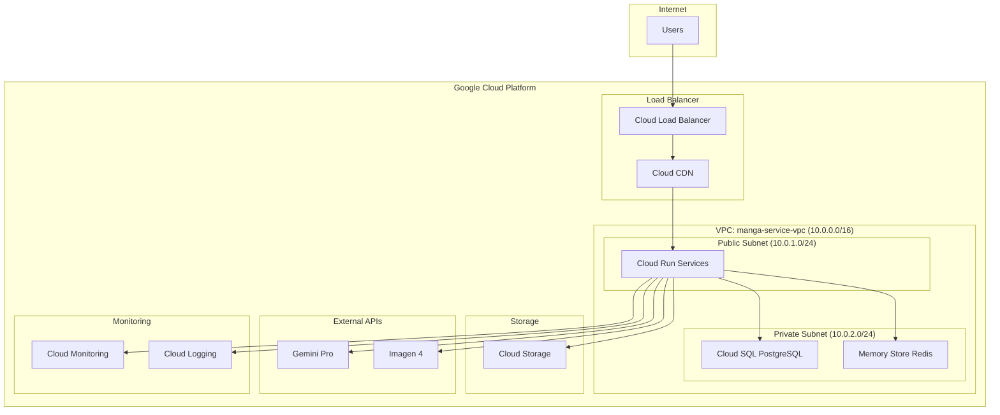
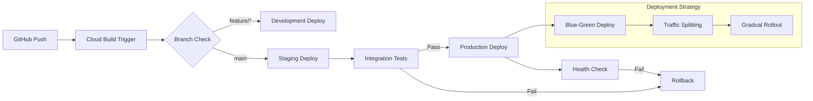

# AI漫画生成サービス インフラ設計書

**文書管理情報**
- 文書ID: INF-DOC-001
- 作成日: 2025-01-20
- 版数: 1.0
- 承認者: 根岸祐樹
- 関連文書: SYS-DOC-001（システム設計書）、REQ-DOC-001（要件定義書）

## 目次

- [1. インフラ概要](#1-インフラ概要)
  - [1.1 設計方針](#11-設計方針)
  - [1.2 アーキテクチャ概要](#12-アーキテクチャ概要)
- [2. ネットワーク設計](#2-ネットワーク設計)
  - [2.1 VPC構成](#21-vpc構成)
  - [2.2 サブネット設計](#22-サブネット設計)
  - [2.3 ファイアウォール設定](#23-ファイアウォール設定)
- [3. コンピューティング設計](#3-コンピューティング設計)
  - [3.1 Cloud Run構成](#31-cloud-run構成)
  - [3.2 オートスケーリング設計](#32-オートスケーリング設計)
  - [3.3 サービスアカウント設計](#33-サービスアカウント設計)
- [4. データストレージ設計](#4-データストレージ設計)
  - [4.1 Cloud SQL設計](#41-cloud-sql設計)
  - [4.2 Redis設計（段階的移行）](#42-redis設計段階的移行)
  - [4.3 Cloud Storage設計](#43-cloud-storage設計)
- [5. セキュリティ設計](#5-セキュリティ設計)
  - [5.1 IAM設計](#51-iam設計)
  - [5.2 Secret Manager](#52-secret-manager)
  - [5.3 ネットワークセキュリティ](#53-ネットワークセキュリティ)
- [6. 監視・ログ設計](#6-監視ログ設計)
  - [6.1 Cloud Monitoring設定](#61-cloud-monitoring設定)
  - [6.2 ログ設計](#62-ログ設計)
  - [6.3 アラート設定](#63-アラート設定)
- [7. CI/CD設計](#7-cicd設計)
  - [7.1 Cloud Build設定](#71-cloud-build設定)
  - [7.2 デプロイメント戦略](#72-デプロイメント戦略)
  - [7.3 環境管理](#73-環境管理)
- [8. 運用設計](#8-運用設計)
  - [8.1 バックアップ戦略](#81-バックアップ戦略)
  - [8.2 災害復旧](#82-災害復旧)
  - [8.3 コスト管理](#83-コスト管理)

---

## 1. インフラ概要

### 1.1 設計方針

| 方針 | 内容 | 理由 |
|------|------|------|
| スタートアップ最適化 | 軽量構成でスタート、段階的拡張 | 初期コスト抑制、迅速なMVP展開 |
| Google Cloud ネイティブ | GCP標準サービス活用 | 運用負荷削減、統合管理 |
| シンプルネットワーク | 単一VPC、必要最小限の分離 | 複雑性排除、トラブルシューティング簡素化 |
| フルマネージド優先 | Cloud SQL、Memory Store活用 | 運用工数削減、自動化推進 |

### 1.2 アーキテクチャ概要



---

## 2. ネットワーク設計

### 2.1 VPC構成

#### 基本設定
```yaml
VPC Configuration:
  Name: manga-service-vpc
  Region: asia-northeast1 (Tokyo)
  IP Range: 10.0.0.0/16
  Route Mode: Regional
  DNS Policy: Default
```

#### Terraform設定例
```hcl
resource "google_compute_network" "manga_vpc" {
  name                    = "manga-service-vpc"
  auto_create_subnetworks = false
  mtu                     = 1460
}

resource "google_compute_router" "manga_router" {
  name    = "manga-router"
  region  = var.region
  network = google_compute_network.manga_vpc.id
}

resource "google_compute_router_nat" "manga_nat" {
  name                               = "manga-nat"
  router                             = google_compute_router.manga_router.name
  region                             = var.region
  nat_ip_allocate_option             = "AUTO_ONLY"
  source_subnetwork_ip_ranges_to_nat = "ALL_SUBNETWORKS_ALL_IP_RANGES"
}
```

### 2.2 サブネット設計

#### サブネット構成
| サブネット名 | CIDR | 用途 | アクセス |
|-------------|------|------|---------|
| manga-public | 10.0.1.0/24 | Cloud Run Connector | Public |
| manga-private | 10.0.2.0/24 | Cloud SQL, Redis | Private |
| manga-management | 10.0.3.0/24 | 管理・監視 | Private |

#### Terraform設定
```hcl
# パブリックサブネット（Cloud Run用）
resource "google_compute_subnetwork" "manga_public" {
  name          = "manga-public"
  ip_cidr_range = "10.0.1.0/24"
  region        = var.region
  network       = google_compute_network.manga_vpc.id
}

# プライベートサブネット（データベース用）
resource "google_compute_subnetwork" "manga_private" {
  name          = "manga-private"
  ip_cidr_range = "10.0.2.0/24"
  region        = var.region
  network       = google_compute_network.manga_vpc.id
  
  private_ip_google_access = true
  
  secondary_ip_range {
    range_name    = "manga-pods"
    ip_cidr_range = "10.1.0.0/16"
  }
}
```

### 2.3 ファイアウォール設定

#### セキュリティルール
```hcl
# HTTPS流入許可
resource "google_compute_firewall" "allow_https" {
  name    = "manga-allow-https"
  network = google_compute_network.manga_vpc.name

  allow {
    protocol = "tcp"
    ports    = ["443"]
  }

  source_ranges = ["0.0.0.0/0"]
  target_tags   = ["https-server"]
}

# VPC内部通信許可
resource "google_compute_firewall" "allow_internal" {
  name    = "manga-allow-internal"
  network = google_compute_network.manga_vpc.name

  allow {
    protocol = "tcp"
    ports    = ["0-65535"]
  }

  allow {
    protocol = "udp"
    ports    = ["0-65535"]
  }

  source_ranges = ["10.0.0.0/16"]
}

# Health Check許可
resource "google_compute_firewall" "allow_health_check" {
  name    = "manga-allow-health-check"
  network = google_compute_network.manga_vpc.name

  allow {
    protocol = "tcp"
    ports    = ["8080"]
  }

  source_ranges = ["130.211.0.0/22", "35.191.0.0/16"]
  target_tags   = ["cloud-run-service"]
}
```

---

## 3. コンピューティング設計

### 3.1 Cloud Run構成

#### 軽量化構成設定
```yaml
# Phase 1-8 共通設定（軽量版）
apiVersion: serving.knative.dev/v1
kind: Service
metadata:
  name: phase-service-template
  annotations:
    run.googleapis.com/ingress: internal-and-cloud-load-balancing
spec:
  template:
    metadata:
      annotations:
        run.googleapis.com/cpu: "1"
        run.googleapis.com/memory: "2Gi"
        run.googleapis.com/execution-environment: gen2
        run.googleapis.com/vpc-access-connector: manga-connector
        run.googleapis.com/cloudsql-instances: manga-db-instance
    spec:
      containerConcurrency: 50  # 軽量化のため削減
      timeoutSeconds: 300       # 5分タイムアウト
      serviceAccountName: manga-service-account
      containers:
      - image: gcr.io/PROJECT_ID/phase-service:latest
        ports:
        - containerPort: 8080
        resources:
          limits:
            cpu: "1"
            memory: "2Gi"
        env:
        - name: REDIS_HOST
          value: "10.0.2.10"
        - name: DB_HOST
          value: "10.0.2.5"
        - name: PUBSUB_TOPIC
          value: "phase-completed"
```

#### サービス別カスタマイズ
```yaml
# Phase 6のみリソース増強
Phase6_Overrides:
  cpu: "2"           # 画像生成のため2倍
  memory: "4Gi"      # メモリも2倍
  timeout: 900       # 15分タイムアウト
  concurrency: 10    # 同時処理数制限
```

### 3.2 オートスケーリング設計

#### スケーリング設定
| サービス | 最小インスタンス | 最大インスタンス | CPU閾値 | メモリ閾値 |
|----------|-----------------|------------------|---------|-----------|
| Phase 1-5, 7-8 | 0 | 10 | 70% | 80% |
| Phase 6 | 1 | 5 | 60% | 70% |

```yaml
Scaling Configuration:
  Min Instances: 0     # コスト削減のため
  Max Instances: 10    # 軽量構成での上限
  Target CPU: 70%      # スタートアップ向け設定
  Target Memory: 80%   # リソース効率化
  Scale Down Delay: 300s  # 5分間のクールダウン
```

### 3.3 サービスアカウント設計

#### IAM ロール設計
```yaml
Service Accounts:
  manga-service-account:
    roles:
      - roles/cloudsql.client
      - roles/redis.editor
      - roles/storage.objectAdmin
      - roles/pubsub.publisher
      - roles/pubsub.subscriber
      - roles/logging.logWriter
      - roles/monitoring.metricWriter
      - roles/secretmanager.secretAccessor

  manga-cicd-account:
    roles:
      - roles/run.developer
      - roles/storage.admin
      - roles/cloudbuild.builds.editor
      - roles/iam.serviceAccountUser
```

---

## 4. データストレージ設計

### 4.1 Cloud SQL設計

#### インスタンス設定（軽量スタートアップ版）
```yaml
Cloud SQL Configuration:
  Instance ID: manga-db-instance
  Database Version: PostgreSQL 15
  Region: asia-northeast1
  Zone: asia-northeast1-a
  
  Machine Type: db-standard-1  # スタートアップ向け軽量版
  CPU: 1 vCPU
  Memory: 3.75 GB
  Storage: 100 GB SSD (Auto-increase enabled)
  
  Network:
    Private IP: 10.0.2.5
    Authorized Networks: VPC manga-service-vpc
    SSL: Required
  
  Backup:
    Automated Backup: Enabled
    Backup Window: 03:00-04:00 JST
    Point-in-time Recovery: 7 days
    Retention: 30 days
  
  Maintenance:
    Window: Sunday 04:00-05:00 JST
    Update Strategy: OPPORTUNISTIC
```

#### Terraform設定
```hcl
resource "google_sql_database_instance" "manga_db" {
  name             = "manga-db-instance"
  database_version = "POSTGRES_15"
  region           = var.region

  settings {
    tier = "db-standard-1"  # 軽量版
    
    disk_type    = "PD_SSD"
    disk_size    = 100
    disk_autoresize       = true
    disk_autoresize_limit = 500  # 最大500GB

    backup_configuration {
      enabled                        = true
      start_time                     = "03:00"
      point_in_time_recovery_enabled = true
      backup_retention_settings {
        retained_backups = 30
      }
    }

    ip_configuration {
      ipv4_enabled    = false
      private_network = google_compute_network.manga_vpc.id
      require_ssl     = true
    }

    maintenance_window {
      day  = 7  # Sunday
      hour = 4
    }
  }

  deletion_protection = true
}
```

### 4.2 Redis設計（段階的移行）

#### フェーズ1: 単一インスタンス
```yaml
Phase 1 Configuration (Start):
  Service: Memory Store for Redis
  Version: Redis 7.0
  Tier: Basic
  Memory: 4GB
  Region: asia-northeast1
  Network: manga-service-vpc
  IP: 10.0.2.10
  
  Estimated Cost: $120/month
  
  Migration Trigger:
    - 同時接続数 > 100
    - メモリ使用率 > 80%
    - 可用性要件向上時
```

#### フェーズ2: Redis Cluster（将来移行）
```yaml
Phase 2 Configuration (Future):
  Service: Memory Store for Redis Cluster
  Version: Redis 7.0
  Tier: Standard_HA
  Nodes: 3 Master + 3 Replica
  Memory per Node: 4GB
  Total Capacity: 12GB
  Network: manga-service-vpc
  
  Estimated Cost: $360/month
  
  Migration Script:
    1. クラスターインスタンス作成
    2. データ移行（Redis MIGRATE）
    3. アプリケーション接続先変更
    4. 旧インスタンス削除
```

#### Redis接続設定
```python
import redis
import os

class RedisManager:
    def __init__(self):
        self.is_cluster = os.getenv('REDIS_CLUSTER_MODE', 'false').lower() == 'true'
        
        if self.is_cluster:
            # Phase 2: Cluster Mode
            from rediscluster import RedisCluster
            self.client = RedisCluster(
                startup_nodes=[
                    {"host": "10.0.2.10", "port": "6379"},
                    {"host": "10.0.2.11", "port": "6379"},
                    {"host": "10.0.2.12", "port": "6379"}
                ],
                decode_responses=True,
                skip_full_coverage_check=True
            )
        else:
            # Phase 1: Single Instance
            self.client = redis.Redis(
                host=os.getenv('REDIS_HOST', '10.0.2.10'),
                port=6379,
                decode_responses=True,
                socket_connect_timeout=5,
                retry_on_timeout=True
            )
```

### 4.3 Cloud Storage設計

#### バケット構成（基本構成）
```yaml
Storage Buckets:
  manga-input-data:
    Location: asia-northeast1
    Storage Class: Standard
    Lifecycle:
      - Delete objects older than 90 days
    
  manga-output-images:
    Location: asia-northeast1
    Storage Class: Standard
    Public Access: Enabled (CDN用)
    CORS: Enabled
    
  manga-final-products:
    Location: asia-northeast1
    Storage Class: Standard
    Lifecycle:
      - Transition to Nearline after 30 days
      - Transition to Coldline after 365 days
    
  manga-temp-data:
    Location: asia-northeast1
    Storage Class: Standard
    Lifecycle:
      - Delete objects older than 7 days
```

#### Terraform設定
```hcl
# 入力データ用バケット
resource "google_storage_bucket" "input_data" {
  name     = "${var.project_id}-manga-input-data"
  location = var.region

  lifecycle_rule {
    condition {
      age = 90
    }
    action {
      type = "Delete"
    }
  }

  versioning {
    enabled = true
  }

  encryption {
    default_kms_key_name = google_kms_crypto_key.storage_key.id
  }
}

# 出力画像用バケット（CDN対応）
resource "google_storage_bucket" "output_images" {
  name     = "${var.project_id}-manga-output-images"
  location = var.region

  cors {
    origin          = ["https://*.manga-service.com"]
    method          = ["GET", "HEAD"]
    response_header = ["*"]
    max_age_seconds = 3600
  }

  uniform_bucket_level_access = true
}

# 一時データ用バケット
resource "google_storage_bucket" "temp_data" {
  name     = "${var.project_id}-manga-temp-data"
  location = var.region

  lifecycle_rule {
    condition {
      age = 7
    }
    action {
      type = "Delete"
    }
  }
}
```

---

## 5. セキュリティ設計

### 5.1 IAM設計

#### 最小権限の原則
```yaml
Service Account Roles:
  manga-phase1-sa:
    - roles/cloudsql.client
    - roles/redis.editor  
    - roles/pubsub.publisher
    - roles/secretmanager.secretAccessor
    
  manga-phase6-sa:  # 画像生成のみ追加権限
    - roles/cloudsql.client
    - roles/redis.editor
    - roles/storage.objectCreator  # 画像保存用
    - roles/pubsub.publisher
    - roles/secretmanager.secretAccessor

  manga-cicd-sa:
    - roles/run.developer
    - roles/cloudbuild.builds.editor
    - roles/storage.admin
    - roles/iam.serviceAccountUser
```

### 5.2 Secret Manager

#### シークレット管理
```yaml
Secrets Configuration:
  gemini-api-key:
    Description: "Google Gemini Pro API Key"
    Replication: automatic
    Access: manga-service-account
    
  imagen-api-key:
    Description: "Google Imagen 4 API Key"
    Replication: automatic
    Access: manga-phase6-sa
    
  database-password:
    Description: "PostgreSQL Password"
    Replication: automatic
    Access: manga-service-account
    
  redis-auth-token:
    Description: "Redis Authentication Token"
    Replication: automatic
    Access: manga-service-account
```

#### Terraform設定
```hcl
resource "google_secret_manager_secret" "gemini_api_key" {
  secret_id = "gemini-api-key"

  replication {
    automatic = true
  }
}

resource "google_secret_manager_secret_iam_binding" "gemini_access" {
  project   = var.project_id
  secret_id = google_secret_manager_secret.gemini_api_key.secret_id
  role      = "roles/secretmanager.secretAccessor"

  members = [
    "serviceAccount:${google_service_account.manga_service.email}",
  ]
}
```

### 5.3 ネットワークセキュリティ

#### VPCセキュリティ
```yaml
Security Configuration:
  Private Google Access: Enabled
  Private Service Connect: Enabled for Google APIs
  
  Firewall Priority:
    1. Deny All (Priority: 65534)
    2. Allow HTTPS (Priority: 1000)
    3. Allow Internal VPC (Priority: 1001)
    4. Allow Health Check (Priority: 1002)
  
  DDoS Protection: 
    Cloud Armor: Basic (free tier)
    Rate Limiting: 1000 req/min per IP
```

---

## 6. 監視・ログ設計

### 6.1 Cloud Monitoring設定

#### 基本メトリクス監視
```yaml
Monitoring Metrics:
  Cloud Run:
    - run.googleapis.com/container/cpu/utilization
    - run.googleapis.com/container/memory/utilization
    - run.googleapis.com/request_count
    - run.googleapis.com/request_latencies
    
  Cloud SQL:
    - cloudsql.googleapis.com/database/cpu/utilization
    - cloudsql.googleapis.com/database/memory/utilization
    - cloudsql.googleapis.com/database/disk/utilization
    
  Redis:
    - redis.googleapis.com/server/memory_usage
    - redis.googleapis.com/stats/connections/current
    - redis.googleapis.com/stats/operations_per_second
    
  Cloud Storage:
    - storage.googleapis.com/api/request_count
    - storage.googleapis.com/network/received_bytes_count
```

### 6.2 ログ設計

#### 構造化ログフォーマット
```json
{
  "timestamp": "2025-01-20T10:00:00Z",
  "severity": "INFO",
  "service": "phase1-text-analysis",
  "version": "1.0.0",
  "trace": "projects/PROJECT_ID/traces/TRACE_ID",
  "span": "SPAN_ID",
  "request_id": "req-12345",
  "user_id": "user-67890",
  "phase": 1,
  "message": "Text analysis completed",
  "context": {
    "text_length": 5000,
    "processing_time_ms": 25000,
    "retry_count": 0,
    "model_version": "gemini-pro-v1"
  }
}
```

#### ログルーティング
```yaml
Log Routing:
  Default Sink: Cloud Logging
  
  Custom Sinks:
    error-logs:
      Filter: 'severity >= ERROR'
      Destination: Cloud Storage bucket for analysis
      
    performance-logs:
      Filter: 'jsonPayload.processing_time_ms > 30000'
      Destination: BigQuery for analysis
      
    security-logs:
      Filter: 'httpRequest.status >= 400'
      Destination: Security Operations Suite
```

### 6.3 アラート設定

#### 基本アラート
```yaml
Alert Policies:
  high-error-rate:
    Display Name: "High Error Rate"
    Condition: request error rate > 5%
    Duration: 5 minutes
    Notification: Email, Slack
    
  high-latency:
    Display Name: "High Response Latency"
    Condition: 95th percentile latency > 30s
    Duration: 5 minutes
    Notification: Email
    
  resource-exhaustion:
    Display Name: "Resource Exhaustion"
    Condition: CPU utilization > 90% OR Memory > 95%
    Duration: 2 minutes
    Notification: Email, SMS
    
  api-quota-warning:
    Display Name: "API Quota Warning"
    Condition: Gemini API usage > 80% of daily quota
    Duration: immediate
    Notification: Slack
```

---

## 7. CI/CD設計

### 7.1 Cloud Build設定

#### ビルドパイプライン
```yaml
# cloudbuild.yaml
steps:
  # テスト実行
  - name: 'python:3.11'
    entrypoint: 'bash'
    args:
      - '-c'
      - |
        pip install -r requirements.txt
        pytest tests/ --cov=./ --cov-report=xml
    
  # セキュリティスキャン
  - name: 'gcr.io/google.com/cloudsdktool/cloud-sdk'
    entrypoint: 'bash'
    args:
      - '-c'
      - |
        gcloud components install local-extract
        gcloud beta code security-analysis scan ./
    
  # Dockerイメージビルド
  - name: 'gcr.io/cloud-builders/docker'
    args:
      - 'build'
      - '-t'
      - 'gcr.io/$PROJECT_ID/phase${_PHASE_NUMBER}:${SHORT_SHA}'
      - '-t'
      - 'gcr.io/$PROJECT_ID/phase${_PHASE_NUMBER}:latest'
      - './phase${_PHASE_NUMBER}'
    
  # イメージプッシュ
  - name: 'gcr.io/cloud-builders/docker'
    args:
      - 'push'
      - 'gcr.io/$PROJECT_ID/phase${_PHASE_NUMBER}:${SHORT_SHA}'
    
  # Cloud Runデプロイ
  - name: 'gcr.io/google.com/cloudsdktool/cloud-sdk'
    entrypoint: 'bash'
    args:
      - '-c'
      - |
        gcloud run deploy phase${_PHASE_NUMBER}-service \
          --image gcr.io/$PROJECT_ID/phase${_PHASE_NUMBER}:${SHORT_SHA} \
          --region asia-northeast1 \
          --platform managed \
          --no-allow-unauthenticated

substitutions:
  _PHASE_NUMBER: '1'

options:
  logging: CLOUD_LOGGING_ONLY
  machineType: 'E2_HIGHCPU_8'  # ビルド高速化
```

### 7.2 デプロイメント戦略

#### 環境別デプロイフロー


#### 段階的ロールアウト
```yaml
Deployment Strategy:
  Development:
    Trigger: feature/* branch push
    Target: dev-phase*-service
    Traffic: 100%
    
  Staging:
    Trigger: main branch push
    Target: staging-phase*-service
    Testing: Automated integration tests
    
  Production:
    Trigger: Manual approval after staging
    Strategy: Blue-Green with traffic splitting
    Rollout:
      - Phase 1: 10% traffic for 10 minutes
      - Phase 2: 50% traffic for 30 minutes  
      - Phase 3: 100% traffic
    Rollback: Automatic if error rate > 1%
```

### 7.3 環境管理

#### 環境変数管理
```yaml
Environment Variables:
  Development:
    ENVIRONMENT: dev
    LOG_LEVEL: DEBUG
    REDIS_HOST: dev-redis-host
    DB_HOST: dev-db-host
    
  Staging:
    ENVIRONMENT: staging
    LOG_LEVEL: INFO
    REDIS_HOST: staging-redis-host
    DB_HOST: staging-db-host
    
  Production:
    ENVIRONMENT: production
    LOG_LEVEL: WARN
    REDIS_HOST: prod-redis-host
    DB_HOST: prod-db-host
    
Secret References:
  - GEMINI_API_KEY: projects/PROJECT_ID/secrets/gemini-api-key/versions/latest
  - IMAGEN_API_KEY: projects/PROJECT_ID/secrets/imagen-api-key/versions/latest
  - DB_PASSWORD: projects/PROJECT_ID/secrets/database-password/versions/latest
```

---

## 8. 運用設計

### 8.1 バックアップ戦略

#### データ別バックアップ計画
| データ種別 | バックアップ頻度 | 保持期間 | 復旧目標時間 |
|-----------|----------------|---------|-------------|
| PostgreSQL | 日次自動 + PITR | 30日 | 1時間 |
| Redis | 日次スナップショット | 7日 | 30分 |
| Cloud Storage | 自動レプリケーション | 無期限 | 即座 |
| 設定ファイル | Git管理 + 日次 | 無期限 | 15分 |

#### バックアップ自動化
```bash
#!/bin/bash
# daily-backup.sh

# PostgreSQL手動バックアップ
gcloud sql export sql manga-db-instance \
  gs://manga-backups/sql/backup-$(date +%Y%m%d).sql \
  --database=manga_production

# Redis スナップショット作成
gcloud redis instances export gs://manga-backups/redis/snapshot-$(date +%Y%m%d).rdb \
  --source=manga-redis-instance \
  --region=asia-northeast1

# 設定ファイルバックアップ
gsutil -m cp -r ./infrastructure/ gs://manga-backups/infra/$(date +%Y%m%d)/
```

### 8.2 災害復旧

#### RTO/RPO目標
```yaml
Recovery Objectives:
  RTO (Recovery Time Objective): 4時間
  RPO (Recovery Point Objective): 1時間
  
  Critical Services:
    Phase 1-8 Services: RTO 30分, RPO 1時間
    Database: RTO 1時間, RPO 1時間
    Redis: RTO 30分, RPO 24時間（許容）
    
  Recovery Procedures:
    1. Cloud SQL Point-in-time Recovery
    2. Cloud Run サービス再デプロイ
    3. Redis データ復旧（必要に応じて）
    4. DNS切り替え（災害時）
```

#### 災害復旧手順
```bash
#!/bin/bash
# disaster-recovery.sh

echo "=== AI漫画生成サービス 災害復旧手順 ==="

# 1. データベース復旧
echo "Step 1: Database Recovery"
gcloud sql backups restore BACKUP_ID \
  --restore-instance=manga-db-instance-recovery \
  --backup-instance=manga-db-instance

# 2. Redis復旧
echo "Step 2: Redis Recovery"
gcloud redis instances import gs://manga-backups/redis/latest.rdb \
  --source-instance=manga-redis-recovery \
  --region=asia-northeast1

# 3. Cloud Run サービス復旧
echo "Step 3: Services Recovery"
for phase in {1..8}; do
  gcloud run deploy phase${phase}-service \
    --image gcr.io/$PROJECT_ID/phase${phase}:latest \
    --region asia-northeast1 \
    --platform managed
done

# 4. ヘルスチェック
echo "Step 4: Health Check"
curl -f https://api.manga-service.com/health || exit 1

echo "=== 復旧完了 ==="
```

### 8.3 コスト管理

#### 月次予算（スタートアップ構成）
```yaml
Cost Estimation (Monthly):
  Cloud Run:
    - 8 services × $15-25 = $120-200
    
  Cloud SQL:
    - db-standard-1: $45
    - Storage (100GB): $10
    
  Redis:
    - Memory Store Basic 4GB: $120
    
  Cloud Storage:
    - Standard 1TB: $20
    - CDN Transfer: $30
    
  External APIs:
    - Gemini Pro: $100-200 (usage-based)
    - Imagen 4: $150-300 (usage-based)
    
  Networking:
    - Load Balancer: $18
    - VPC: $0 (free tier)
    
  Total Estimated: $593-933/month
  
  Cost Optimization:
    - Phase 1: $600-900 (initial)
    - Phase 2: $400-600 (optimization)
    - Phase 3: $800-1200 (scale up)
```

#### コスト監視
```yaml
Budget Alerts:
  Development:
    Budget: $200/month
    Alert at: 80%, 100%
    
  Staging:
    Budget: $300/month
    Alert at: 80%, 100%
    
  Production:
    Budget: $800/month
    Alert at: 75%, 90%, 100%
    Actions: Auto-scaling limit enforcement

Cost Optimization:
  - 非稼働時間のインスタンス最小化
  - Preemptible instances for non-critical workloads
  - Committed Use Discounts (成長後)
  - データライフサイクル管理
```

---

## 改訂履歴

| 版数 | 日付 | 変更内容 | 担当者 |
|------|------|----------|--------|
| 1.0 | 2025-01-20 | 初版作成（軽量スタートアップ構成） | Claude Code |

---

**文書承認**
- インフラアーキテクト: [署名] 日付: [日付]
- セキュリティエンジニア: [署名] 日付: [日付]
- SREエンジニア: [署名] 日付: [日付]