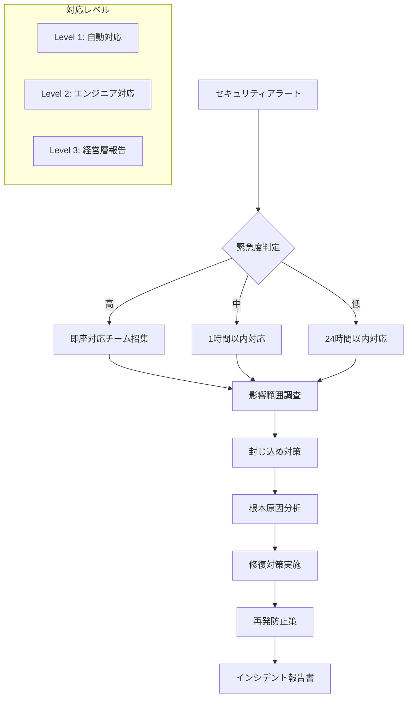

# AI漫画生成サービス セキュリティ設計書

**文書管理情報**
- 文書ID: SEC-DOC-001
- 作成日: 2025-01-20
- 版数: 1.0
- 承認者: 根岸祐樹
- 関連文書: INF-DOC-001（インフラ設計書）、SYS-DOC-001（システム設計書）

## 目次

- [1. セキュリティ概要](#1-セキュリティ概要)
  - [1.1 セキュリティ方針](#11-セキュリティ方針)
  - [1.2 脅威モデル](#12-脅威モデル)
- [2. 認証・認可設計](#2-認証認可設計)
  - [2.1 Firebase Authentication設計](#21-firebase-authentication設計)
  - [2.2 ロールベースアクセス制御](#22-ロールベースアクセス制御)
  - [2.3 API認証](#23-api認証)
- [3. データ保護設計](#3-データ保護設計)
  - [3.1 暗号化設計](#31-暗号化設計)
  - [3.2 データ分類](#32-データ分類)
  - [3.3 データライフサイクル](#33-データライフサイクル)
- [4. 著作権保護設計](#4-著作権保護設計)
  - [4.1 類似度検出システム](#41-類似度検出システム)
  - [4.2 禁止コンテンツフィルタ](#42-禁止コンテンツフィルタ)
  - [4.3 利用規約・免責設計](#43-利用規約免責設計)
- [5. コンテンツフィルタリング設計](#5-コンテンツフィルタリング設計)
  - [5.1 不適切表現検出](#51-不適切表現検出)
  - [5.2 画像コンテンツ検証](#52-画像コンテンツ検証)
  - [5.3 フィルタリング精度管理](#53-フィルタリング精度管理)
- [6. アプリケーションセキュリティ](#6-アプリケーションセキュリティ)
  - [6.1 入力検証](#61-入力検証)
  - [6.2 APIセキュリティ](#62-apiセキュリティ)
  - [6.3 セッション管理](#63-セッション管理)
- [7. インフラセキュリティ](#7-インフラセキュリティ)
  - [7.1 ネットワークセキュリティ](#71-ネットワークセキュリティ)
  - [7.2 コンテナセキュリティ](#72-コンテナセキュリティ)
  - [7.3 シークレット管理](#73-シークレット管理)
- [8. 監査・コンプライアンス](#8-監査コンプライアンス)
  - [8.1 監査ログ設計](#81-監査ログ設計)
  - [8.2 個人情報保護法対応](#82-個人情報保護法対応)
  - [8.3 セキュリティ監視](#83-セキュリティ監視)
- [9. インシデント対応](#9-インシデント対応)
  - [9.1 セキュリティインシデント対応](#91-セキュリティインシデント対応)
  - [9.2 データ漏洩対応](#92-データ漏洩対応)

---

## 1. セキュリティ概要

### 1.1 セキュリティ方針

#### 基本原則
| 原則 | 内容 | 実装レベル |
|------|------|----------|
| 最小権限の原則 | 必要最小限のアクセス権限付与 | 基本 |
| 多層防御 | 複数のセキュリティ層による保護 | 基本 |
| 透明性 | セキュリティ対策の明確な開示 | 基本 |
| 継続的改善 | 定期的なセキュリティ見直し | 基本 |

#### スタートアップ向けセキュリティ戦略
```yaml
Security Strategy:
  Phase 1 (MVP): 基本セキュリティ
    - Google Cloud標準暗号化
    - Firebase認証
    - 基本的なコンテンツフィルタリング
    
  Phase 2 (Growth): セキュリティ強化
    - カスタム暗号化キー
    - 高度なフィルタリング
    - セキュリティ監査

  Phase 3 (Scale): エンタープライズ対応
    - コンプライアンス認証
    - 第三者監査
    - 高度な脅威検出
```

### 1.2 脅威モデル

#### 想定脅威とリスクレベル
| 脅威カテゴリ | 具体的脅威 | リスクレベル | 対策優先度 |
|-------------|-----------|------------|----------|
| 著作権侵害 | 既存作品の複製生成 | 高 | 最優先 |
| データ漏洩 | ユーザーデータ不正アクセス | 高 | 最優先 |
| 不正利用 | APIの大量不正利用 | 中 | 中 |
| 不適切コンテンツ | 暴力・性的表現の生成 | 中 | 中 |
| サービス停止 | DDoS攻撃 | 低 | 低 |

---

## 2. 認証・認可設計

### 2.1 Firebase Authentication設計

#### 認証プロバイダー設定
```yaml
Firebase Auth Configuration:
  Providers:
    - Google Sign-in: Enabled
    - Email/Password: Enabled
    - Anonymous Auth: Disabled (不正利用防止)
    
  Security Settings:
    Password Policy:
      - Minimum length: 8文字
      - Character types: 英数字必須
      - Common passwords: Blocked
      
    Session Management:
      - Session duration: 7日間
      - Refresh token: 30日間
      - Auto sign-out: 30日間非活動時
      
    Rate Limiting:
      - Sign-in attempts: 5回/hour per IP
      - Password reset: 3回/hour per email
```

#### JWT トークン仕様
```typescript
interface JWTPayload {
  // Firebase標準フィールド
  iss: string;           // Firebase Project ID
  aud: string;           // Firebase Project ID  
  auth_time: number;     // 認証時刻
  user_id: string;       // ユーザーID
  sub: string;           // サブジェクト（ユーザーID）
  iat: number;           // 発行時刻
  exp: number;           // 有効期限
  
  // カスタムクレーム
  email?: string;        // メールアドレス
  email_verified: boolean; // メール確認済み
  name?: string;         // 表示名
  role: 'free' | 'premium' | 'admin'; // ユーザーロール
  api_quota: number;     // 日次API利用可能数
  last_generation: string; // 最終生成日時（日次制限用）
}
```

### 2.2 ロールベースアクセス制御

#### ユーザーロール定義
```yaml
User Roles:
  free:
    permissions:
      - manga:generate:daily_limit_1
      - manga:view:own
      - manga:download:own
    api_quota: 1/day
    
  premium:
    permissions:
      - manga:generate:unlimited
      - manga:view:own
      - manga:download:own
      - manga:edit:own
      - manga:share:public
    api_quota: 100/day
    
  admin:
    permissions:
      - manga:*
      - user:manage
      - system:monitor
      - content:moderate
    api_quota: unlimited
```

#### アクセス制御実装
```python
from functools import wraps
from firebase_admin import auth

class AuthorizationManager:
    def __init__(self):
        self.role_permissions = {
            'free': ['manga:generate:daily_limit_1', 'manga:view:own'],
            'premium': ['manga:generate:unlimited', 'manga:view:own', 'manga:edit:own'],
            'admin': ['manga:*', 'user:manage', 'system:monitor']
        }
    
    def require_permission(self, permission: str):
        def decorator(func):
            @wraps(func)
            async def wrapper(request, *args, **kwargs):
                # JWT トークン検証
                token = self.extract_token(request)
                decoded_token = auth.verify_id_token(token)
                
                user_role = decoded_token.get('role', 'free')
                user_permissions = self.role_permissions.get(user_role, [])
                
                # 権限チェック
                if not self.check_permission(permission, user_permissions):
                    raise PermissionDenied(f"Permission {permission} required")
                
                # 日次制限チェック（freeユーザー）
                if user_role == 'free' and permission.startswith('manga:generate'):
                    await self.check_daily_limit(decoded_token['user_id'])
                
                return await func(request, *args, **kwargs)
            return wrapper
        return decorator
    
    def check_permission(self, required: str, user_permissions: list) -> bool:
        # ワイルドカード対応
        for perm in user_permissions:
            if perm.endswith('*') and required.startswith(perm[:-1]):
                return True
            if perm == required:
                return True
        return False
```

### 2.3 API認証

#### Google AI API セキュリティ
```python
class SecureAPIClient:
    def __init__(self):
        # Secret Managerからキー取得
        self.gemini_key = self.get_secret('gemini-api-key')
        self.imagen_key = self.get_secret('imagen-api-key')
        
        # API クライアント初期化
        self.setup_clients()
    
    def get_secret(self, secret_name: str) -> str:
        from google.cloud import secretmanager
        
        client = secretmanager.SecretManagerServiceClient()
        name = f"projects/{PROJECT_ID}/secrets/{secret_name}/versions/latest"
        
        response = client.access_secret_version(request={"name": name})
        return response.payload.data.decode("UTF-8")
    
    async def call_ai_api(self, api_name: str, request_data: dict) -> dict:
        # レート制限チェック
        await self.check_rate_limit(api_name)
        
        # リクエスト検証
        self.validate_request(request_data)
        
        # API呼び出し実行
        return await self.execute_api_call(api_name, request_data)
```

---

## 3. データ保護設計

### 3.1 暗号化設計

#### 暗号化レイヤー
```yaml
Encryption Layers:
  Transport Layer:
    Protocol: TLS 1.3
    Cipher Suites: 
      - TLS_AES_256_GCM_SHA384
      - TLS_CHACHA20_POLY1305_SHA256
    Certificate: Let's Encrypt (Auto-renewal)
    
  Application Layer:
    Database Connections: SSL/TLS required
    Redis Connections: AUTH + TLS
    Cloud Storage: HTTPS only
    
  Storage Layer:
    Cloud SQL: Google-managed AES-256
    Cloud Storage: Google-managed AES-256
    Redis: In-transit encryption
    
  Key Management:
    Service: Cloud KMS
    Key Rotation: Automatic (90 days)
    Backup: Cross-region replication
```

#### 暗号化実装
```python
from google.cloud import kms
import base64
import json

class DataEncryption:
    def __init__(self):
        self.kms_client = kms.KeyManagementServiceClient()
        self.key_name = "projects/PROJECT_ID/locations/global/keyRings/manga-ring/cryptoKeys/data-key"
    
    def encrypt_sensitive_data(self, data: dict) -> str:
        """
        機密データの暗号化（ユーザープロンプト等）
        """
        plaintext = json.dumps(data).encode('utf-8')
        
        response = self.kms_client.encrypt(
            request={
                "name": self.key_name,
                "plaintext": plaintext
            }
        )
        
        return base64.b64encode(response.ciphertext).decode('utf-8')
    
    def decrypt_sensitive_data(self, encrypted_data: str) -> dict:
        """
        機密データの復号化
        """
        ciphertext = base64.b64decode(encrypted_data.encode('utf-8'))
        
        response = self.kms_client.decrypt(
            request={
                "name": self.key_name,
                "ciphertext": ciphertext
            }
        )
        
        return json.loads(response.plaintext.decode('utf-8'))
```

### 3.2 データ分類

#### 機密度レベル
| データ種別 | 機密度 | 暗号化 | アクセス制御 | 保持期間 |
|-----------|--------|--------|------------|---------|
| ユーザープロンプト | 中 | KMS暗号化 | 本人のみ | 90日 |
| 生成画像 | 低 | 標準暗号化 | 本人＋パブリック | 365日 |
| ユーザープロファイル | 高 | KMS暗号化 | 本人のみ | アカウント削除まで |
| API使用ログ | 中 | 標準暗号化 | 管理者のみ | 30日 |
| 課金情報 | 高 | KMS暗号化 | 本人＋課金チーム | 7年 |

### 3.3 データライフサイクル

#### データ削除ポリシー
```python
class DataLifecycleManager:
    def __init__(self):
        self.retention_policies = {
            'user_prompts': 90,      # 90日後削除
            'generated_images': 365, # 365日後削除
            'user_profiles': -1,     # アカウント削除時のみ
            'api_logs': 30,          # 30日後削除
            'billing_data': 2555     # 7年保持
        }
    
    async def schedule_data_deletion(self, data_type: str, created_at: datetime):
        """
        データの自動削除スケジュール
        """
        retention_days = self.retention_policies.get(data_type)
        if retention_days == -1:
            return  # 手動削除のみ
        
        deletion_date = created_at + timedelta(days=retention_days)
        
        # Cloud Scheduler でタスク登録
        await self.schedule_deletion_task(data_type, deletion_date)
    
    async def execute_gdpr_deletion(self, user_id: str):
        """
        GDPR準拠のユーザーデータ完全削除
        """
        tasks = [
            self.delete_user_prompts(user_id),
            self.delete_generated_content(user_id),
            self.delete_user_profile(user_id),
            self.anonymize_logs(user_id)
        ]
        
        await asyncio.gather(*tasks)
        
        # 削除確認ログ
        logger.info(f"GDPR deletion completed for user {user_id}")
```

---

## 4. 著作権保護設計

### 4.1 類似度検出システム

#### 基本レベル著作権チェック
```python
class CopyrightProtection:
    def __init__(self):
        # 既知作品データベース（基本版）
        self.known_works_db = self.load_basic_database()
        self.similarity_threshold = 0.90  # 90%以上で拒否
        
    def load_basic_database(self) -> dict:
        """
        基本的な著作権データベース読み込み
        """
        return {
            'popular_manga': [
                'ワンピース', 'ナルト', 'ドラゴンボール', 
                '鬼滅の刃', '進撃の巨人', 'ワンパンマン'
            ],
            'popular_characters': [
                'ルフィ', 'ナルト', '悟空', '炭治郎', 
                'エレン', 'サイタマ'
            ],
            'copyright_terms': [
                '株式会社集英社', '講談社', '小学館',
                'ジャンプ', 'マガジン', 'サンデー'
            ]
        }
    
    async def check_input_text(self, text: str) -> dict:
        """
        入力テキストの著作権チェック
        """
        violations = []
        
        # キャラクター名検出
        for character in self.known_works_db['popular_characters']:
            if character in text:
                violations.append({
                    'type': 'character_name',
                    'content': character,
                    'severity': 'high'
                })
        
        # 作品名検出
        for work in self.known_works_db['popular_manga']:
            if work in text:
                violations.append({
                    'type': 'work_title',
                    'content': work,
                    'severity': 'high'
                })
        
        return {
            'is_safe': len(violations) == 0,
            'violations': violations,
            'confidence': 0.95
        }
    
    async def check_generated_image(self, image_url: str) -> dict:
        """
        生成画像の類似度チェック
        """
        # Google Vision API での類似画像検索
        from google.cloud import vision
        
        client = vision.ImageAnnotatorClient()
        image = vision.Image()
        image.source.image_uri = image_url
        
        # Web検索で類似画像を検出
        response = client.web_detection(image=image)
        web_detection = response.web_detection
        
        # 類似度判定
        high_similarity_matches = [
            entity for entity in web_detection.web_entities
            if entity.score > self.similarity_threshold
        ]
        
        return {
            'is_safe': len(high_similarity_matches) == 0,
            'similarity_score': max([e.score for e in web_detection.web_entities], default=0),
            'matches': high_similarity_matches
        }
```

### 4.2 禁止コンテンツフィルタ

#### フィルタリングルール
```yaml
Content Filtering Rules:
  Text Filtering:
    Prohibited Terms:
      - 暴力的表現: ['殺す', '殴る', '血', '銃']
      - 性的表現: ['セクシー', 'エロ', '裸']
      - 差別表現: ['バカ', 'アホ', '死ね']
      - 著作権関連: 既知作品・キャラクター名
    
    Action: 生成拒否 + 理由説明
    
  Image Filtering:
    AI Safety Models:
      - Google Cloud Video Intelligence API
      - Safe Search Detection
    
    Detection Categories:
      - Adult Content: Block
      - Violence: Block  
      - Medical: Allow
      - Racy: Block
    
    Confidence Threshold: 0.7
```

### 4.3 利用規約・免責設計

#### 著作権免責条項
```markdown
## 著作権・知的財産権に関する免責事項

### 4.1 生成コンテンツの責任
- 本サービスが生成するコンテンツの著作権侵害について、当社は一切の責任を負いません
- ユーザーは生成されたコンテンツを使用する前に、必要に応じて著作権確認を行ってください
- 商用利用時は特に注意深い確認をお願いします

### 4.2 当社の取り組み
- 既知の著作物との類似度チェックを実施（90%以上の類似で生成拒否）
- 有名キャラクター名等の検出・フィルタリング
- 不適切コンテンツの自動検出（95%精度目標）

### 4.3 ユーザーの責任
- 生成コンテンツの使用に関する最終責任はユーザーにあります
- 著作権侵害を発見した場合は、速やかに使用を中止してください
- 第三者からの著作権侵害の申し立てについては、ユーザーが対応してください
```

---

## 5. コンテンツフィルタリング設計

### 5.1 不適切表現検出

#### テキストフィルタリング実装
```python
class ContentFilter:
    def __init__(self):
        self.prohibited_terms = self.load_prohibited_terms()
        self.context_analyzer = self.init_context_analyzer()
    
    def load_prohibited_terms(self) -> dict:
        """
        禁止用語データベース読み込み
        """
        return {
            'violence': ['殺害', '暴力', '血液', '銃器', '刃物'],
            'sexual': ['性的', 'エロティック', '裸体', '官能'],
            'discrimination': ['差別', '偏見', '侮辱'],
            'illegal': ['薬物', '違法', '犯罪', '詐欺']
        }
    
    async def filter_input_text(self, text: str) -> dict:
        """
        入力テキストのフィルタリング
        """
        violations = []
        
        for category, terms in self.prohibited_terms.items():
            for term in terms:
                if term in text:
                    violations.append({
                        'category': category,
                        'term': term,
                        'severity': self.get_severity(category)
                    })
        
        # コンテキスト分析（文脈による判定）
        context_score = await self.analyze_context(text)
        
        return {
            'is_safe': len(violations) == 0 and context_score > 0.7,
            'violations': violations,
            'context_score': context_score,
            'filtered_text': self.apply_filters(text, violations) if violations else text
        }
    
    def get_severity(self, category: str) -> str:
        severity_map = {
            'violence': 'high',
            'sexual': 'high', 
            'discrimination': 'medium',
            'illegal': 'high'
        }
        return severity_map.get(category, 'low')
```

### 5.2 画像コンテンツ検証

#### Google Vision API 活用
```python
from google.cloud import vision

class ImageContentVerifier:
    def __init__(self):
        self.vision_client = vision.ImageAnnotatorClient()
        self.safety_thresholds = {
            'adult': vision.Likelihood.POSSIBLE,      # 中程度で拒否
            'violence': vision.Likelihood.POSSIBLE,   # 中程度で拒否
            'racy': vision.Likelihood.LIKELY,         # 高確率で拒否
            'medical': vision.Likelihood.VERY_LIKELY  # 医療は許可
        }
    
    async def verify_generated_image(self, image_url: str) -> dict:
        """
        生成画像の安全性検証
        """
        image = vision.Image()
        image.source.image_uri = image_url
        
        # Safe Search Detection
        response = self.vision_client.safe_search_detection(image=image)
        safe_search = response.safe_search_annotation
        
        # 検出結果評価
        violations = []
        
        if safe_search.adult >= self.safety_thresholds['adult']:
            violations.append('adult_content')
            
        if safe_search.violence >= self.safety_thresholds['violence']:
            violations.append('violent_content')
            
        if safe_search.racy >= self.safety_thresholds['racy']:
            violations.append('racy_content')
        
        return {
            'is_safe': len(violations) == 0,
            'violations': violations,
            'scores': {
                'adult': safe_search.adult.name,
                'violence': safe_search.violence.name,
                'racy': safe_search.racy.name
            },
            'confidence': 0.95
        }
```

### 5.3 フィルタリング精度管理

#### 品質メトリクス
```yaml
Filtering Quality Metrics:
  Target Accuracy: 95%
  
  Measurement:
    True Positive Rate: > 90%  # 実際に不適切なコンテンツを正しく検出
    False Positive Rate: < 5%  # 適切なコンテンツを誤って拒否
    
  Monitoring:
    - 月次精度レビュー
    - ユーザーフィードバック分析
    - 誤検出報告の収集・分析
    
  Improvement Process:
    - 禁止用語リストの定期更新
    - 機械学習モデルの再訓練
    - 閾値の調整
```

---

## 6. アプリケーションセキュリティ

### 6.1 入力検証

#### 入力値検証ルール
```python
from marshmallow import Schema, fields, validate, ValidationError

class MangaGenerationSchema(Schema):
    text = fields.String(
        required=True,
        validate=[
            validate.Length(min=10, max=50000),
            validate.Regexp(
                r'^[\w\s\u3040-\u309F\u30A0-\u30FF\u4E00-\u9FAF.,!?;:()「」『』]*$',
                error='使用できない文字が含まれています'
            )
        ]
    )
    style = fields.String(
        validate=validate.OneOf(['少年漫画', '少女漫画', '青年向け', 'アメコミ', '水彩風'])
    )
    pages = fields.Integer(
        validate=validate.Range(min=10, max=100)
    )

class InputValidator:
    def __init__(self):
        self.schema = MangaGenerationSchema()
    
    def validate_generation_request(self, data: dict) -> dict:
        """
        漫画生成リクエストの検証
        """
        try:
            # スキーマ検証
            validated_data = self.schema.load(data)
            
            # 追加セキュリティチェック
            self.check_sql_injection(validated_data['text'])
            self.check_xss_payload(validated_data['text'])
            
            return {
                'is_valid': True,
                'data': validated_data
            }
            
        except ValidationError as e:
            return {
                'is_valid': False,
                'errors': e.messages
            }
    
    def check_sql_injection(self, text: str):
        """
        SQLインジェクション攻撃パターン検出
        """
        sql_patterns = [
            r"union\s+select", r"drop\s+table", r"insert\s+into",
            r"delete\s+from", r"update\s+set", r"'.*or.*'.*=.*'"
        ]
        
        for pattern in sql_patterns:
            if re.search(pattern, text, re.IGNORECASE):
                raise ValidationError("不正な入力パターンが検出されました")
    
    def check_xss_payload(self, text: str):
        """
        XSS攻撃パターン検出
        """
        xss_patterns = [
            r"<script.*?>", r"javascript:", r"on\w+\s*=",
            r"eval\s*\(", r"alert\s*\("
        ]
        
        for pattern in xss_patterns:
            if re.search(pattern, text, re.IGNORECASE):
                raise ValidationError("不正なスクリプトパターンが検出されました")
```

### 6.2 APIセキュリティ

#### レート制限実装
```python
import asyncio
from datetime import datetime, timedelta

class APIRateLimiter:
    def __init__(self, redis_client):
        self.redis = redis_client
        self.limits = {
            'free': {'requests': 1, 'window': 86400},      # 1回/日
            'premium': {'requests': 100, 'window': 86400}, # 100回/日
            'admin': {'requests': 1000, 'window': 86400}   # 1000回/日
        }
    
    async def check_rate_limit(self, user_id: str, user_role: str) -> bool:
        """
        レート制限チェック
        """
        limit_config = self.limits.get(user_role, self.limits['free'])
        key = f"rate_limit:{user_id}:{datetime.now().date()}"
        
        # 現在のリクエスト数取得
        current_requests = await self.redis.get(key)
        current_requests = int(current_requests) if current_requests else 0
        
        # 制限チェック
        if current_requests >= limit_config['requests']:
            raise RateLimitExceeded(f"日次制限（{limit_config['requests']}回）に達しました")
        
        # カウンターインクリメント
        await self.redis.incr(key)
        await self.redis.expire(key, limit_config['window'])
        
        return True

class APISecurityMiddleware:
    def __init__(self):
        self.rate_limiter = APIRateLimiter(redis_client)
        
    async def security_check(self, request, user_data):
        """
        API呼び出し時のセキュリティチェック
        """
        # 1. レート制限チェック
        await self.rate_limiter.check_rate_limit(
            user_data['user_id'], 
            user_data['role']
        )
        
        # 2. 入力値検証
        validator = InputValidator()
        validation_result = validator.validate_generation_request(request.json)
        
        if not validation_result['is_valid']:
            raise ValidationError(validation_result['errors'])
        
        # 3. 著作権チェック
        copyright_checker = CopyrightProtection()
        copyright_result = await copyright_checker.check_input_text(
            validation_result['data']['text']
        )
        
        if not copyright_result['is_safe']:
            raise CopyrightViolation(copyright_result['violations'])
        
        return validation_result['data']
```

### 6.3 セッション管理

#### セキュアセッション実装
```python
class SessionManager:
    def __init__(self, redis_client):
        self.redis = redis_client
        self.session_duration = 7 * 24 * 3600  # 7日間
        
    async def create_session(self, user_id: str, user_data: dict) -> str:
        """
        セキュアセッション作成
        """
        session_id = self.generate_secure_session_id()
        session_data = {
            'user_id': user_id,
            'role': user_data.get('role', 'free'),
            'created_at': datetime.now().isoformat(),
            'ip_address': self.get_client_ip(),
            'user_agent': self.get_user_agent()
        }
        
        # Redis にセッション保存
        await self.redis.setex(
            f"session:{session_id}",
            self.session_duration,
            json.dumps(session_data)
        )
        
        return session_id
    
    async def validate_session(self, session_id: str, client_ip: str) -> dict:
        """
        セッション検証（IP固定チェック含む）
        """
        session_data = await self.redis.get(f"session:{session_id}")
        
        if not session_data:
            raise SessionExpired("セッションが期限切れです")
        
        session = json.loads(session_data)
        
        # IP アドレスチェック（基本セキュリティ）
        if session['ip_address'] != client_ip:
            await self.invalidate_session(session_id)
            raise SecurityViolation("セッションのセキュリティ違反が検出されました")
        
        return session
    
    def generate_secure_session_id(self) -> str:
        """
        暗号学的に安全なセッションID生成
        """
        import secrets
        return secrets.token_urlsafe(32)
```

---

## 7. インフラセキュリティ

### 7.1 ネットワークセキュリティ

#### Cloud Armor設定（基本）
```yaml
Cloud Armor Configuration:
  Security Policy: manga-security-policy
  
  Rules:
    rate-limiting:
      Priority: 1000
      Action: rate_based_ban
      Rate Limit: 1000 requests/minute per IP
      Ban Duration: 600 seconds (10分)
      
    geo-blocking:
      Priority: 2000  
      Action: allow
      Source: Japan, US, EU (主要市場のみ)
      
    sql-injection-protection:
      Priority: 3000
      Action: deny(403)
      Expression: "evaluatePreconfiguredExpr('sqli-stable')"
      
    xss-protection:
      Priority: 4000
      Action: deny(403)
      Expression: "evaluatePreconfiguredExpr('xss-stable')"
      
    default-allow:
      Priority: 10000
      Action: allow
      Description: "Default allow rule"
```

### 7.2 コンテナセキュリティ

#### Docker セキュリティベストプラクティス
```dockerfile
# セキュアなDockerfile例
FROM python:3.11-slim

# 非rootユーザー作成
RUN groupadd -r appuser && useradd -r -g appuser appuser

# セキュリティアップデート
RUN apt-get update && apt-get upgrade -y && \
    apt-get install -y --no-install-recommends \
    ca-certificates && \
    apt-get clean && \
    rm -rf /var/lib/apt/lists/*

# アプリケーション依存関係
COPY requirements.txt .
RUN pip install --no-cache-dir -r requirements.txt

# アプリケーションコード
COPY --chown=appuser:appuser . /app
WORKDIR /app

# 非rootユーザーに切り替え
USER appuser

# ヘルスチェック
HEALTHCHECK --interval=30s --timeout=5s --start-period=30s --retries=3 \
  CMD curl -f http://localhost:8080/health || exit 1

EXPOSE 8080
CMD ["python", "main.py"]
```

#### セキュリティスキャン設定
```yaml
Container Security:
  Image Scanning:
    Registry: Container Registry
    Vulnerability Scanning: Enabled
    Policy: Block deployment if CRITICAL vulnerabilities
    
  Runtime Security:
    Binary Authorization: Enabled (基本ポリシー)
    Admission Controller: 署名済みイメージのみ許可
    
  Security Policies:
    - 非rootユーザー実行必須
    - 読み取り専用ルートファイルシステム
    - 不要なLinux Capabilityの削除
```

### 7.3 シークレット管理

#### Secret Manager統合
```python
from google.cloud import secretmanager

class SecretManager:
    def __init__(self):
        self.client = secretmanager.SecretManagerServiceClient()
        self.project_id = os.getenv('GOOGLE_CLOUD_PROJECT')
        
    def get_secret(self, secret_id: str, version: str = 'latest') -> str:
        """
        Secret Manager から機密情報取得
        """
        name = f"projects/{self.project_id}/secrets/{secret_id}/versions/{version}"
        
        try:
            response = self.client.access_secret_version(request={"name": name})
            return response.payload.data.decode("UTF-8")
        except Exception as e:
            logger.error(f"Failed to retrieve secret {secret_id}: {e}")
            raise SecretRetrievalError(f"Unable to access {secret_id}")
    
    def rotate_api_keys(self):
        """
        API キーの定期ローテーション
        """
        secrets_to_rotate = ['gemini-api-key', 'imagen-api-key']
        
        for secret_id in secrets_to_rotate:
            # 新しいバージョンを作成（手動でキー更新後）
            # 古いバージョンを無効化
            self.disable_old_versions(secret_id)
```

---

## 8. 監査・コンプライアンス

### 8.1 監査ログ設計

#### セキュリティイベントログ
```python
class SecurityAuditLogger:
    def __init__(self):
        self.logger = self.setup_structured_logger()
    
    def log_authentication_event(self, user_id: str, event_type: str, success: bool, metadata: dict = None):
        """
        認証イベントの監査ログ
        """
        log_entry = {
            'timestamp': datetime.now().isoformat(),
            'event_category': 'authentication',
            'event_type': event_type,  # login, logout, token_refresh
            'user_id': user_id,
            'success': success,
            'ip_address': metadata.get('ip_address'),
            'user_agent': metadata.get('user_agent'),
            'session_id': metadata.get('session_id')
        }
        
        self.logger.info('SECURITY_AUDIT', extra=log_entry)
    
    def log_data_access(self, user_id: str, resource: str, action: str, success: bool):
        """
        データアクセスの監査ログ
        """
        log_entry = {
            'timestamp': datetime.now().isoformat(),
            'event_category': 'data_access',
            'user_id': user_id,
            'resource': resource,     # manga_project, user_profile
            'action': action,         # read, write, delete
            'success': success,
            'ip_address': self.get_client_ip()
        }
        
        self.logger.info('DATA_ACCESS_AUDIT', extra=log_entry)
    
    def log_security_violation(self, user_id: str, violation_type: str, details: dict):
        """
        セキュリティ違反の監査ログ
        """
        log_entry = {
            'timestamp': datetime.now().isoformat(),
            'event_category': 'security_violation',
            'violation_type': violation_type,  # copyright, content_filter, rate_limit
            'user_id': user_id,
            'details': details,
            'severity': self.calculate_severity(violation_type),
            'ip_address': self.get_client_ip()
        }
        
        self.logger.warning('SECURITY_VIOLATION', extra=log_entry)
```

### 8.2 個人情報保護法対応

#### データ保護実装
```python
class PrivacyComplianceManager:
    def __init__(self):
        self.encryption_manager = DataEncryption()
        
    async def handle_data_deletion_request(self, user_id: str) -> dict:
        """
        ユーザーデータ削除要求への対応
        """
        deletion_tasks = [
            self.delete_user_profile(user_id),
            self.delete_user_prompts(user_id),
            self.delete_generated_content(user_id),
            self.anonymize_audit_logs(user_id)
        ]
        
        results = await asyncio.gather(*deletion_tasks, return_exceptions=True)
        
        # 削除確認
        deletion_successful = all(
            not isinstance(result, Exception) for result in results
        )
        
        if deletion_successful:
            # 削除証明書発行
            certificate = self.generate_deletion_certificate(user_id)
            return {
                'status': 'completed',
                'certificate_id': certificate['id'],
                'deleted_at': datetime.now().isoformat()
            }
        else:
            # エラーログ記録
            logger.error(f"Data deletion failed for user {user_id}: {results}")
            raise DataDeletionError("データ削除処理に失敗しました")
    
    async def export_user_data(self, user_id: str) -> dict:
        """
        ユーザーデータエクスポート（データポータビリティ対応）
        """
        user_data = {
            'profile': await self.get_user_profile(user_id),
            'generated_manga': await self.get_user_manga_list(user_id),
            'usage_history': await self.get_usage_history(user_id),
            'export_timestamp': datetime.now().isoformat()
        }
        
        # 個人情報の適切な匿名化
        anonymized_data = self.anonymize_exported_data(user_data)
        
        return anonymized_data
```

### 8.3 セキュリティ監視

#### リアルタイム脅威検出
```python
class SecurityMonitor:
    def __init__(self):
        self.alert_thresholds = {
            'failed_login_attempts': 5,      # 5回連続ログイン失敗
            'copyright_violations': 3,       # 3回著作権違反
            'content_filter_violations': 5,  # 5回コンテンツフィルタ違反
            'unusual_api_usage': 10          # 通常の10倍のAPI使用
        }
    
    async def monitor_security_events(self):
        """
        リアルタイムセキュリティ監視
        """
        while True:
            try:
                # 異常なログイン試行監視
                await self.check_login_anomalies()
                
                # 著作権違反パターン監視  
                await self.check_copyright_violations()
                
                # API使用量異常監視
                await self.check_api_usage_anomalies()
                
                # 30秒間隔で監視
                await asyncio.sleep(30)
                
            except Exception as e:
                logger.error(f"Security monitoring error: {e}")
    
    async def check_login_anomalies(self):
        """
        ログイン異常検出
        """
        # 過去1時間の失敗ログイン集計
        failed_logins = await self.get_failed_logins_last_hour()
        
        for ip, count in failed_logins.items():
            if count >= self.alert_thresholds['failed_login_attempts']:
                await self.trigger_security_alert(
                    'suspicious_login_activity',
                    {'ip_address': ip, 'attempt_count': count}
                )
                
                # 一時的IP ブロック
                await self.temporary_ip_block(ip, duration=3600)  # 1時間ブロック
```

---

## 9. インシデント対応

### 9.1 セキュリティインシデント対応

#### インシデント対応フロー


#### インシデント分類
```yaml
Incident Classification:
  Critical (Level 3):
    - 大規模データ漏洩
    - システム全体停止
    - 法的問題発生
    Response Time: 15分以内
    Escalation: CEO, CTO, 法務
    
  High (Level 2):
    - 限定的データ漏洩
    - 主要機能停止
    - 著作権侵害疑い
    Response Time: 1時間以内
    Escalation: CTO, セキュリティ責任者
    
  Medium (Level 1):
    - 個別ユーザー問題
    - 性能劣化
    - フィルタ誤検出
    Response Time: 4時間以内
    Escalation: エンジニアチーム
```

### 9.2 データ漏洩対応

#### 漏洩対応プレイブック
```python
class DataBreachResponse:
    def __init__(self):
        self.notification_templates = self.load_notification_templates()
        
    async def execute_breach_response(self, breach_details: dict):
        """
        データ漏洩対応の自動実行
        """
        breach_id = self.generate_breach_id()
        
        # 1. 即座の封じ込め
        await self.immediate_containment(breach_details)
        
        # 2. 影響範囲調査
        impact_assessment = await self.assess_impact(breach_details)
        
        # 3. 法的通知義務確認
        if impact_assessment['requires_legal_notification']:
            await self.prepare_legal_notifications(breach_id, impact_assessment)
        
        # 4. ユーザー通知（必要に応じて）
        if impact_assessment['requires_user_notification']:
            await self.notify_affected_users(impact_assessment['affected_users'])
        
        # 5. インシデント記録
        await self.log_breach_incident(breach_id, breach_details, impact_assessment)
        
        return {
            'breach_id': breach_id,
            'containment_status': 'completed',
            'notification_sent': impact_assessment['requires_user_notification']
        }
    
    async def immediate_containment(self, breach_details: dict):
        """
        即座の封じ込め対策
        """
        # 影響を受けたシステムの隔離
        if 'database' in breach_details['affected_systems']:
            await self.isolate_database_access()
        
        # 不正アクセスの遮断
        if 'api_keys' in breach_details['compromised_data']:
            await self.revoke_api_keys()
        
        # 緊急メンテナンスモード
        await self.enable_emergency_maintenance_mode()
```

---

## 改訂履歴

| 版数 | 日付 | 変更内容 | 担当者 |
|------|------|----------|--------|
| 1.0 | 2025-01-20 | 初版作成（基本セキュリティ構成） | Claude Code |

---

**文書承認**
- セキュリティ責任者: [署名] 日付: [日付]
- 法務責任者: [署名] 日付: [日付]
- プライバシーオフィサー: [署名] 日付: [日付]