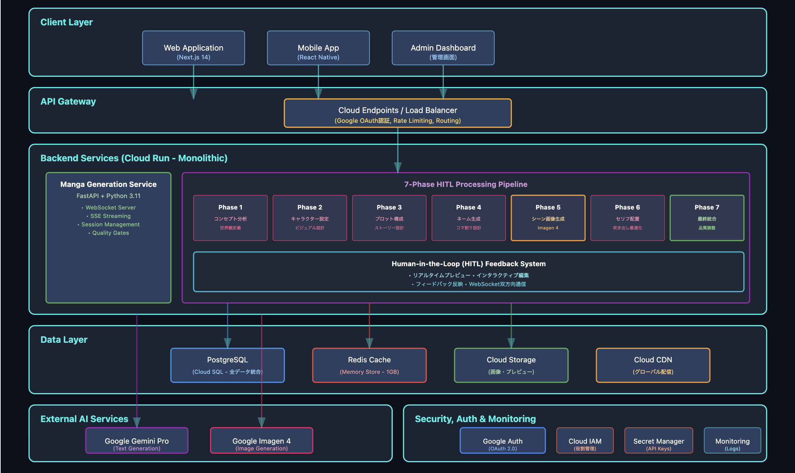

あなたのイメージが、漫画になる。

300万人のクリエイターが、ついに自分の物語を「描く」ことができる。
描くための専門技術・費用も、練習も必要ありません。ただ、呪文を唱えるように物語を書けばそれが一つの漫画になります。

---

## 1. 背景・課題

### 300万人のクリエイターが、物語を絵にできない

日本には多くのクリエイターが存在します。「小説家になろう」には280万人の登録ユーザーが存在し、120万作品以上が投稿されています。「カクヨム」にも100万人のユーザーが50万作品を投稿しています。これらのプラットフォームだけで、実に300万人以上が物語を紡いでいるのです。

しかし、これらの物語のほぼすべてが「文字」です。なぜでしょうか。

#### 視覚表現への3つの壁

創作者が直面する最初の壁は、**能力習得に必要な膨大な時間**です。

独学でイラストを学んだ人々の実体験を調査すると、基礎的な絵が描けるようになるまでに1〜3年の継続的な練習が必要であることがわかりました。仕事として通用するレベルに達するには、年間1,000時間、つまり1日約3時間の練習を数年間継続する必要があります。プロレベルともなると、5,000時間以上の練習が目安とされています。

さらに漫画となると、イラスト技術だけでは不十分です。コマ割りという独特の技法では、読者の視線誘導やヒキとメクリといった演出技法を習得する必要があります。ネーム制作は、映画でいえば脚本・コンテ・演出を1人で同時に行うような複雑な作業です。吹き出しの配置、効果線の使い方、擬音の表現など、漫画特有の文法を学ぶには、さらに専門的な学習が必要となります。

二つ目の壁は、**プロに依頼する際の高額な費用**です。

| 依頼内容 | 費用相場 [1](https://crowdworks.jp/times/know-how/11031/)|
|---------|----------|
| 漫画制作（モノクロ） | 1ページあたり6,000円〜  |
| 漫画制作（カラー） | 1ページあたり8,000円〜 |
| 100ページの漫画単行本 | 60万円〜 |
| イラスト単体（10cm×10cm） | 5,000円〜 |

個人の創作者にとって、これらの金額は現実的な選択肢とは言えません。趣味で書いた小説を漫画化するために100万円以上を投資できる人は、ごく限られているでしょう。

三つ目の壁は、**既存AI画像生成ツールの限界**です。

MidjourneyやStable Diffusionは革新的なツールです。Midjourneyは1,900万人のユーザーを獲得し、年間売上は3億ドル規模に達しています。しかし、これらのツールは「単発のイラスト」を生成することはできても、「ストーリーを持った漫画」を作ることはできません。

上記のようなツールはコマ割り、吹き出し、効果線といった漫画特有の要素を「正確に」自動生成することは現時点では難しい状況です。100ページの漫画を作ろうとすれば、100ページ分の画像を個別に生成し、手動で管理する必要があります。ストーリーの流れを考慮した構成は完全に人力に頼らざるを得ず、生成後もセリフの配置やコマ間の調整など、膨大な編集作業が必要となります。

この問題が今まで解決されてこなかった理由は、従来の単独画像生成による漫画生成の困難さとコストの両面にあると考えています。

漫画は単なる絵の集合ではありません。読者の視線を誘導し、時間の流れを表現し、感情を演出する必要があります。テキストから場面転換や感情の起伏を読み取り、どのシーンを大きく見せ、どこで間を取るかという演出判断を行い、キャラクターや世界観を全編通して統一する。これらすべてをシステムプロンプトで統合的に行うには限界があります。

## Spellとは

### 主要機能

#### 1. 高速自動生成：7段階の効率的な処理

Spellは、小説から漫画を生成するプロセスを7つの専門的なフェーズに分解しました。この分割により、各段階での品質管理と、ユーザーフィードバックの反映が可能になりました。

| フェーズ | 処理内容 |
|---------|----------|
| Phase 1: コンセプト・世界観分析 | テキストから物語のテーマ、ジャンル、世界観を自動分析し、作品の方向性を決定 |
| Phase 2: キャラクター設定 | 登場人物の性格、外見、関係性を抽出し、一貫性のあるビジュアルを生成 |
| Phase 3: プロット構成 | 起承転結の構成を自動生成し、重要シーンの判別とページ配分を最適化 |    
| Phase 4: ネーム生成 | 各ページのコマ割りを自動設計し、視線誘導を考慮した配置を決定 |
| Phase 5: シーン画像生成 | 高品質な画像を並列処理で生成し、キャラクターと背景の統一感を維持 |
| Phase 6: セリフ配置 | 吹き出しの自動生成と配置、感情に応じた形状選択、効果音の追加 |
| Phase 7: 最終統合 | 全ページの統合とバランス調整を行い、PDF/WebP形式で出力 |

#### 2. 自然言語で修正：専門技術不要

Spellの最も革新的な機能は、自然言語によるフィードバック機能です。

従来のツールでは、Photoshopなどの専門ソフトの複雑な操作を習得したり、AI画像生成では英語でのプロンプトエンジニアリングが必要でした。漫画制作ソフトともなれば、レイヤー管理やペン設定など、さらに専門的な知識が求められました。

Spellでは、各フェーズの完了時に、ユーザーは普通の日本語で修正指示を出すことができます。「主人公をもっとクールな感じにして」「このページの展開が早すぎる。もっとじっくり」「もっと感情的なセリフにして」といった、思ったことをそのまま伝えるだけで、AIが意図を理解し、適切に修正を行います。

専門用語を知らなくても、複雑な操作を覚えなくても、ただ言葉で伝えるだけ。これが「呪文」というコンセプトの核心です。

#### 3. 完全自動の漫画文法適用

漫画には独特の「文法」があります。これを知らない人でも、Spellが自動で適用します。

**コマ割りの自動最適化**では、アクションシーンは細かく分割して躍動感を演出し、感動シーンは大ゴマで印象的に見せ、読者の視線を自然に誘導する配置を自動で決定します。

**感情認識による吹き出し自動生成**では、テキストの感情を分析し、適切な形状を選択します。

| 感情・状況 | 吹き出し形状 |
|------------|--------------|
| 驚き（「えっ！？」） | ギザギザ吹き出し |
| 小声・感動（「ありがとう...」） | 点線吹き出し |
| 喜び（「やったー！」） | 爆発型吹き出し |
| 心の声 | 雲型吹き出し |

**シーン解析による効果線自動配置**では、動作や感情に応じて、スピード線、集中線、放射線などの効果を自動で追加します。

さらに、ページ構成の最適化では、右ページ最終コマに「次が気になる展開」を配置する「ヒキ」、左ページ最初コマに「インパクトのある展開」を置く「メクリ」、クライマックスでの見開き演出など、プロの漫画家が使う技法を自動で適用します。

---

## 🏗️ システムアーキテクチャ

### 全体構成

Spellのシステムは、ユーザー入力から完成した漫画の出力まで、一連の処理を効率的に実行する設計となっています。

各フェーズは独立したAgentとして動作し、それぞれが専門的な処理を担当します。Phase 1のコンセプト分析とPhase 3のプロット構成、Phase 4のネーム生成、Phase 6のセリフ配置にはGemini Proを活用し、高度なテキスト理解と自然言語処理を実現しています。Phase 2のキャラクター生成とPhase 5のシーン画像生成にはImagen 4を使用し、高品質な画像を生成します。特にPhase 5では並列処理により、複数の画像を同時に生成することで、大幅な高速化を実現しました。

### 7段階HITLエージェント設計

各フェーズは独立したAgentとして動作し、それぞれが特徴的な機能を持っています。

まず、各Agentは独立して動作するため、必要に応じて特定のフェーズのみを再実行することが可能です。これにより、部分的な修正が必要な場合でも、全体を最初からやり直す必要がありません。

また、各フェーズ完了時には自然言語でのフィードバックを受け付ける仕組みを実装しています。ユーザーは結果を確認し、必要に応じて修正指示を出すことができます。満足いく結果が得られるまで、何度でも調整が可能です。

前フェーズの結果は次フェーズに確実に引き継がれ、全体を通じて一貫性のある作品が生成されます。世界観、キャラクター設定、ストーリー構成など、重要な情報は全フェーズで共有されます。

### 使用技術スタック

| レイヤー | 技術 | バージョン | 役割 |
|---------|------|-----------|------|
| **🖥️ フロントエンド** | Next.js | 15.5.2 | React SSRフレームワーク |
| | TypeScript | 5.x | 型安全開発 |
| | Tailwind CSS | 3.4.17 | UIスタイリング |
| | Zustand | 5.0.8 | 状態管理 |
| **⚙️ バックエンド** | FastAPI | 0.109.0 | Web APIフレームワーク |
| | Python | 3.12.11 | サーバーサイド言語 |
| | SQLAlchemy | 2.0.25 | ORM・データベース操作 |
| **🗄️ データ基盤** | PostgreSQL | 15.13 | メインデータベース |
| | Redis | 5.0.1 | キャッシュ・セッション |
| **🔐 認証** | Firebase | 10.14.1 | ユーザー認証 |
| | JWT | 2.9.0 | API認証 |

#### ☁️ Google Cloud Platform 詳細構成

| サービス | 用途 | 設定詳細 |
|---------|------|----------|
| **🚀 Cloud Run** | サーバーレス実行 | **フロントエンド**: CPU 1core, Memory 512Mi **バックエンド**: CPU 2cores, Memory 2Gi リージョン: asia-northeast1 |
| **🗄️ Cloud SQL** | マネージドPostgreSQL | インスタンス: manga-db-prod 接続: Cloud SQL Proxy経由 |
| **🚀 Memorystore** | マネージドRedis | セッション・キャッシュ管理 VPC Connector経由接続 |
| **🤖 Vertex AI** | AI/ML プラットフォーム | **Gemini Pro**: テキスト生成・分析 **Imagen 4**: 高品質画像生成 |
| **💾 Cloud Storage** | オブジェクトストレージ | 生成画像・ファイル保存 |
---

## 💻 実装のポイント

### HITL（Human-in-the-Loop）による理想の漫画実現

従来の完全自動化システムでは、ユーザーの意図と異なる結果になることが多々ありました。「AIに任せたら思っていたものと違うものができた」という経験は、多くの人が持っているでしょう。

Spellでは、この問題を解決するためにHITL設計を採用しました。各フェーズ完了時にプレビューを表示し、ユーザーが結果を確認できるようにしています。もし修正が必要であれば、自然言語でフィードバックを入力するだけで、AIが即座に修正を反映します。満足いくまで何度でも調整可能で、時間がない場合はスキップして完全自動化も選択できる柔軟な設計となっています。

この仕組みにより、ユーザーがイメージした通りの漫画を確実に作成できるようになりました。AIの効率性とユーザーの創造性を最適にバランスさせた、新しい創作体験を提供しています。

### ストーリーの一貫性を保つ設計

長編漫画で最も難しいのは、全編を通じた一貫性の維持です。100ページの漫画では、最初と最後でキャラクターの見た目が変わってしまったり、世界観がブレてしまったりすることは致命的です。

Spellでは、Phase 1で決定した世界観設定を全フェーズで共有することで、時代背景、雰囲気、トーンを一貫して維持します。中世ファンタジーなら中世ファンタジーの、現代学園ものなら現代学園ものの雰囲気を、最初から最後まで保ち続けます。

キャラクターについても、Phase 2で生成した設定を厳密に保持します。髪の色、瞳の色、服装、性格、口調など、キャラクターを特徴づけるすべての要素を記録し、全編で統一します。主人公が熱血タイプなら最後まで熱血を貫き、クールなライバルは一貫してクールに描かれます。

ストーリーの論理性も重要です。Phase 3で構成したプロットに基づき、伏線の配置と回収、起承転結の適切な展開を維持します。突然の設定変更や矛盾した展開を防ぎ、読者が違和感なく物語を楽しめる構成を実現しています。

### マルチエージェントの連携設計

7つのAgentが効率的に連携するため、EventTarget設計による疎結合アーキテクチャを採用しました。

各Agentは独立したマイクロサービスとして動作し、互いに直接依存することなく、イベントを通じて連携します。これにより、特定のAgentに問題が発生しても、他のAgentは正常に動作を継続でき、システム全体の安定性が向上しています。

イベント駆動型の非同期処理により、処理の並列化と効率化を実現しています。例えば、Phase 5の画像生成中に、Phase 6のセリフ配置の準備を並行して進めることができます。

また、この設計により、将来的な機能追加や改善が容易になっています。新しいAgentを追加したり、既存のAgentを改良したりする際も、他の部分への影響を最小限に抑えることができます。

### 並列処理による高速化

特にPhase 5（シーン画像生成）では、処理時間の短縮が重要な課題でした。100ページの漫画で、各ページに平均5コマあるとすれば、500枚の画像を生成する必要があります。

従来の逐次処理では、1枚6秒として3,000秒（50分）かかってしまいます。これでは実用的とは言えません。

Spellでは、最大5枚の画像を同時に生成する並列処理を実装しました。バッチ処理により、APIへのリクエストを効率化し、待機時間を大幅に削減しています。また、類似したシーンや背景はキャッシュを活用することで、重複処理を避け、さらなる高速化を実現しています。

この並列処理により、処理時間を大幅に短縮し、ユーザーが待つストレスを最小限に抑えることに成功しました。

---

## 📊 パフォーマンスと成果

### 定量的な成果

Spellの導入により、漫画制作における劇的な改善を実現しました。

| 指標 | 従来の方法 | Spell | 改善率 |
|------|-----------|-------|--------|
| 制作期間 | 3〜6ヶ月 | 自動処理（分単位） | 99%以上短縮 |
| 制作コスト | 100〜200万円 | 月額数千円程度 | 99%以上削減 |
| 必要スキル | 3〜5年の修行 | 不要 | 完全に解消 |
| 品質スコア | - | 85%以上 | MVP基準（70%）を大幅超過 |

7段階の並列処理により、効率的な生成を実現し、従来は数ヶ月かかっていた作業を劇的に短縮しました。コスト面でも、プロへの依頼と比較して99%以上の削減を達成しています。

品質面では、MVP基準の70%を大幅に上回る85%以上のスコアを達成しており、ユーザーフィードバックによる継続的な品質向上も実現しています。

### ビジネスインパクト

Spellが対象とする市場は非常に大きく、国内の小説投稿者だけで300万人以上が存在します。潜在的な創作者を含めると、その規模は500万人に達すると推定されています。

このサービスがもたらす価値は、単なる効率化にとどまりません。創作活動の民主化により、これまで表現手段を持たなかった人々に新しい可能性を提供します。また、出版業界にとっても、新たな才能の発掘源として機能することが期待されています。

文字だけでは伝えきれなかった感動や、頭の中にだけ存在していた壮大な世界観が、ついに形になることで、創作文化全体の活性化に貢献できると考えています。

---

## 🔮 今後の展望

### 技術的な拡張計画

Spellの技術は、さらなる進化の可能性を秘めています。

多言語対応では、英語、中国語、韓国語への展開を計画しています。各国には独自の漫画文化があり、アメリカンコミック、マンファ、マンホワなど、それぞれの表現技法に対応したローカライズを進めていきます。

機能拡張の面では、静止画の漫画から一歩進んで、アニメーション生成機能の実装を検討しています。また、音声や効果音、BGMの自動生成により、より没入感のある作品制作を可能にします。VR/AR技術との連携により、立体的な漫画体験の提供も視野に入れています。

品質向上においては、より高精度なキャラクター一貫性の実現、感情表現の細やかな制御、プロ漫画家レベルの演出技法の実装など、継続的な改善を進めていきます。

### ビジネス展開

B2B市場への展開も重要な戦略の一つです。

出版社向けには、エンタープライズ版の開発を進めています。編集者向けの校正・編集機能を充実させ、既存のワークフローに組み込める形での提供を目指します。また、既存IPコンテンツの漫画化支援により、新たなビジネスチャンスの創出を支援します。

教育市場においても、大きな可能性があります。学校向けの創作教育ツールとして、生徒たちが自分の物語を視覚化できる環境を提供します。漫画制作の学習支援ツールとしても活用でき、デジタル教材への応用も期待されています。

さらに、開発者向けAPIの提供により、サードパーティアプリケーションとの連携を促進し、エコシステムの構築を目指します。プラットフォーム化により、より多くの創作者とサービスがつながる環境を実現していきます。

---

## 🔗 リンク

- [GitHubリポジトリ](https://github.com/...)
- [デモサイト](https://spell-manga-ai.com)（※準備中）

---

**Spell** - 書けば、描ける呪文

あなたの物語を、世界に見せる時が来ました。