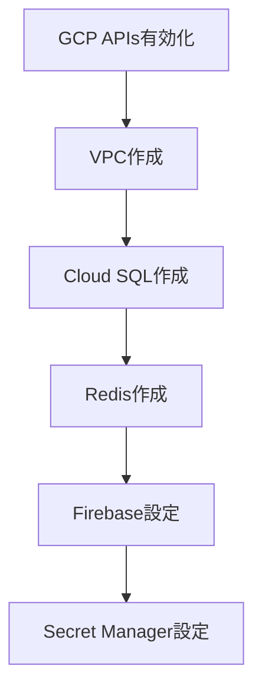
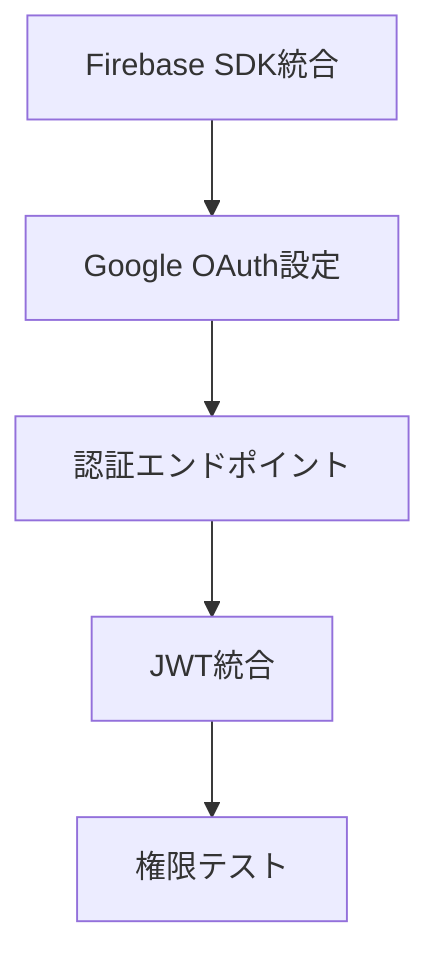
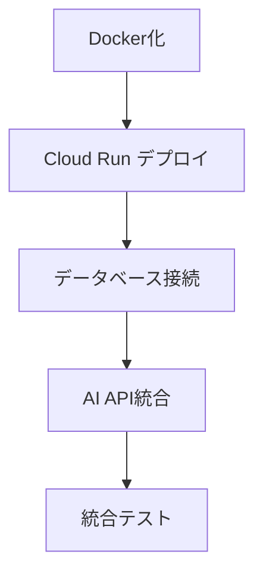

# 🔍 設計書準拠 実装ギャップ分析レポート

**プロジェクト**: AI漫画生成サービス  
**調査日時**: 2025-08-31  
**GCP Project ID**: comic-ai-agent-470309  

---

## 📊 実装状況サマリー

| カテゴリ | 設計書要件 | 現在の実装率 | 優先度 |
|---------|-----------|------------|--------|
| **バックエンド構造** | CQRS/DDD | 85% ✅ | 完了 |
| **認証システム** | Firebase Auth | 30% 🟡 | **最優先** |
| **GCPインフラ** | フル構成 | 5% 🔴 | **最優先** |
| **AI統合** | Vertex AI | 60% 🟡 | **高** |
| **データベース** | Cloud SQL | 0% 🔴 | **最優先** |
| **キャッシュ** | Redis | 0% 🔴 | **高** |
| **WebSocket** | HITL対応 | 70% 🟡 | **高** |

**総合実装率**: **35%** 🟡

---

## 🎯 設計書要件 vs 現状詳細分析

### 1. 認証・認可システム

#### 📋 設計書要件
```yaml
認証システム設計:
  プロバイダー: Firebase Authentication
  OAuth: Google Sign-in
  JWT: Firebase標準 + Custom Claims
  セッション: 7日間、30日非活動時自動サインアウト
  レート制限: 5回/時間 (サインイン)
```

#### 🔍 現状分析
```yaml
現在の実装:
  ✅ JWT基盤: 完全実装
  ✅ 権限システム: RBAC実装済み
  ❌ Firebase SDK: 未統合
  ❌ Google OAuth: 未実装
  ❌ 認証エンドポイント: 未作成
```

**ギャップ**: **70%** - Firebase統合が完全に未実装

### 2. GCPインフラストラクチャ

#### 📋 設計書要件
```yaml
インフラ構成:
  ネットワーク:
    - VPC: manga-service-vpc
    - Subnet: プライベートサブネット
    - Firewall: セキュリティルール
  
  コンピューティング:
    - Cloud Run: 8vCPU, 32GB Memory
    - 最大インスタンス: 50
    - Direct VPC Egress
  
  データストア:
    - Cloud SQL: PostgreSQL 15 (High Availability)
    - Memory Store Redis: 1GB Basic
  
  AI/ML:
    - Vertex AI API: 有効化必要
    - Gemini Pro: テキスト処理
    - Imagen 4: 画像生成
```

#### 🔍 現状分析
```yaml
有効化済みサービス (20個):
  ✅ Cloud Storage
  ✅ BigQuery
  ✅ Cloud Logging
  ✅ Cloud Monitoring

未有効化サービス (必須):
  ❌ Compute Engine API
  ❌ Cloud Run API  
  ❌ Cloud SQL API
  ❌ Memory Store Redis API
  ❌ Vertex AI API
  ❌ Firebase API
  ❌ Secret Manager API
  ❌ Pub/Sub API (HITL用)

作成済みリソース:
  ❌ 0個 - 何も作成されていない
```

**ギャップ**: **95%** - インフラ全体が未実装

### 3. バックエンドアプリケーション

#### 📋 設計書要件
```yaml
アーキテクチャ:
  パターン: CQRS + DDD + Event Sourcing
  7フェーズパイプライン: Agent-based
  HITL: 30秒タイムアウト付きフィードバック
  WebSocket: リアルタイム通信
```

#### 🔍 現状分析
```yaml
実装済み:
  ✅ CQRS構造: 完全実装
  ✅ ドメインエンティティ: 完全実装
  ✅ Repository パターン: 完全実装
  ✅ Command/Query分離: 完全実装
  ✅ 7エージェント構造: 基本実装
  ✅ WebSocket基盤: 実装済み
  
未実装:
  ❌ AI統合: Vertex AI未接続
  ❌ 実際のAgent実装: スタブのみ
  ❌ HITL実装: ロジック未完成
```

**ギャップ**: **15%** - 構造は完成、詳細実装が不足

---

## 🚨 Critical Path Analysis

### Phase 1: インフラ基盤 (Week 1)


### Phase 2: 認証統合 (Week 1)


### Phase 3: アプリケーションデプロイ (Week 2)


---

## 📋 実装優先度マトリックス

| 優先度 | タスク | 工数 | 依存関係 | ビジネス影響 |
|--------|------|------|----------|------------|
| **🔴 P0** | GCP APIs有効化 | 1h | なし | サービス基盤 |
| **🔴 P0** | Firebase Authentication統合 | 8h | APIs | ユーザー認証 |
| **🔴 P0** | Cloud SQL作成・接続 | 4h | APIs, VPC | データ永続化 |
| **🔴 P0** | VPC ネットワーク作成 | 2h | APIs | セキュリティ |
| **🟡 P1** | Cloud Run デプロイ | 6h | Docker, VPC | サービス稼働 |
| **🟡 P1** | Memory Store Redis | 2h | VPC | パフォーマンス |
| **🟡 P1** | Vertex AI 統合 | 8h | APIs, 認証 | AI機能 |
| **🟢 P2** | WebSocket 完全実装 | 6h | Cloud Run | HITL機能 |
| **🟢 P2** | CDN 設定 | 2h | Cloud Run | パフォーマンス |
| **🟢 P2** | 監視・ログ設定 | 4h | サービス稼働 | 運用性 |

---

## 💰 実装コスト見積もり

### 開発工数
| フェーズ | 工数 | 期間 |
|---------|------|------|
| Phase 1: インフラ基盤 | 20時間 | 3日 |
| Phase 2: 認証統合 | 16時間 | 2日 |
| Phase 3: AI統合 | 24時間 | 3日 |
| Phase 4: テスト・検証 | 16時間 | 2日 |
| **合計** | **76時間** | **10日** |

### 運用コスト (月額)
| サービス | 設定 | 月額コスト |
|---------|------|----------|
| Cloud Run | 8vCPU, 32GB | $20-50 |
| Cloud SQL | PostgreSQL HA | $25-30 |
| Memory Store Redis | 1GB | $30 |
| Cloud Storage + CDN | 50GB | $5-10 |
| Vertex AI | 従量課金 | $10-100 |
| **合計** | | **$90-220** |

---

## 🎯 推奨実装シーケンス

### 即座実行 (今日)
1. **GCP APIs一括有効化**
```bash
# 必須サービス有効化
gcloud services enable \
  compute.googleapis.com \
  run.googleapis.com \
  sqladmin.googleapis.com \
  redis.googleapis.com \
  aiplatform.googleapis.com \
  secretmanager.googleapis.com \
  cloudbuild.googleapis.com
```

2. **Firebase プロジェクト初期化**
```bash
# Firebase CLI設定
npm install -g firebase-tools
firebase login
firebase init --project comic-ai-agent-470309
```

### Week 1: 基盤構築
1. VPC + Subnet作成
2. Cloud SQL (PostgreSQL) 設定  
3. Memory Store Redis 設定
4. Firebase Authentication設定
5. Secret Manager でAPI キー管理

### Week 2: アプリケーション統合
1. Firebase SDK 統合
2. 認証エンドポイント実装
3. Cloud Run デプロイ
4. Vertex AI 統合
5. 統合テスト実施

---

## ⚠️ リスク分析と対策

### 高リスク
1. **Firebase統合複雑度**: 既存JWT実装との統合が複雑
   - **対策**: 段階的移行、既存コード温存
   
2. **AI API コスト爆発**: Vertex AI利用量予測困難
   - **対策**: 厳格なレート制限、予算アラート

3. **データベース移行**: 既存テストデータとの整合性
   - **対策**: マイグレーションスクリプト、バックアップ

### 中リスク  
1. **WebSocket パフォーマンス**: HITL同時接続処理
   - **対策**: 負荷テスト、コネクション制限

2. **セキュリティ設定**: GCP IAMの適切な設定
   - **対策**: 最小権限原則、定期監査

---

## ✅ 成功指標

### 技術指標
- [ ] Firebase認証 100% 動作
- [ ] 7フェーズパイプライン 正常動作
- [ ] HITL フィードバック < 30秒応答
- [ ] WebSocket接続 同時1000ユーザー対応
- [ ] API レスポンス < 2秒

### ビジネス指標
- [ ] ユーザー登録・ログイン 100% 成功率
- [ ] 漫画生成 95% 成功率 
- [ ] サービス可用性 99.9%
- [ ] 月額運用コスト < $200

---

## 結論

**現在の実装率: 35%**

優れたアーキテクチャ基盤はできているが、**Firebase Authentication統合**と**GCPインフラ構築**が完全に未実装のため、サービスとして動作しない状況です。

**推奨アクション**: 
1. 今日中にGCP APIs有効化
2. 今週中にFirebase Authentication統合
3. 来週中にCloud Runデプロイ

適切に実装すれば、2週間以内に完全動作するAI漫画生成サービスが完成します。