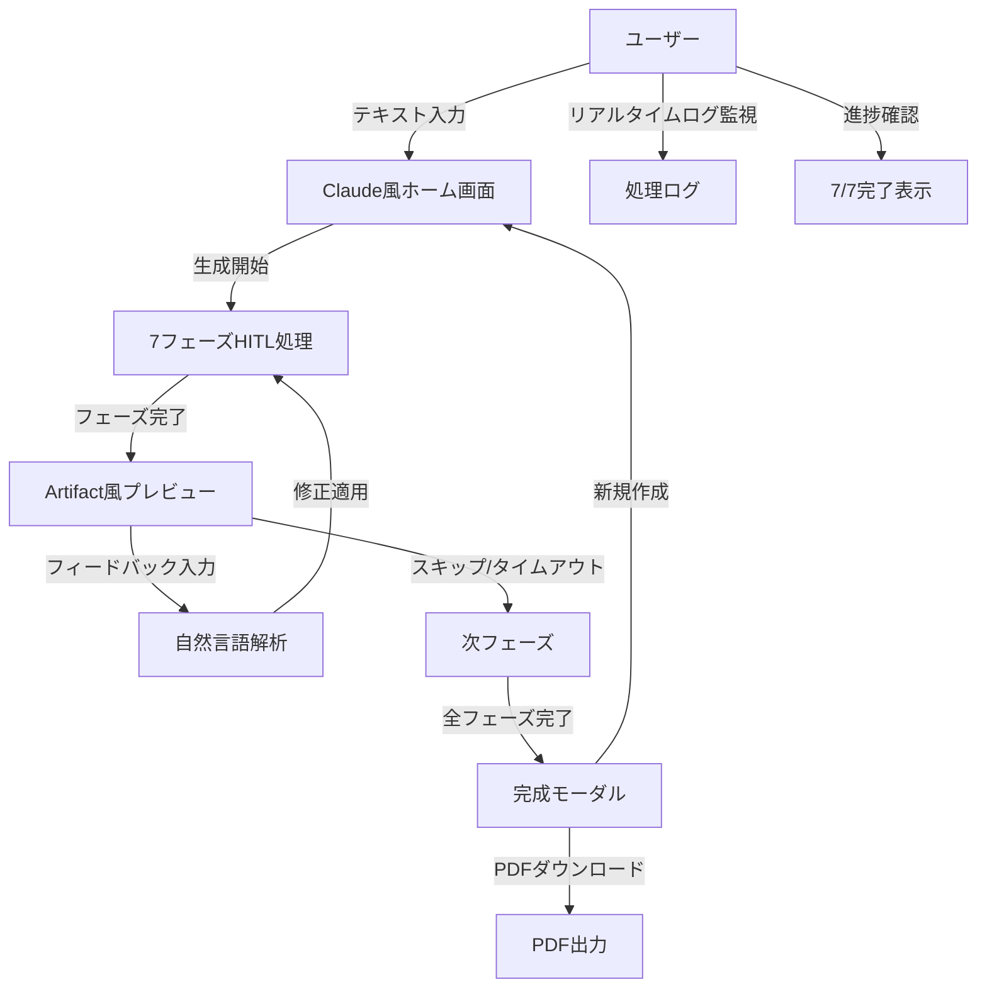

# 機能要件

> **TL;DR**: AI漫画生成サービスの機能要件定義。5つのユーザーストーリー、入力機能（テキスト入力・AI自動設定）、7フェーズHITL処理、品質ゲート管理、出力機能（PDF/WebP・ビューアー・プレビュー・チャットフィードバック）、画像生成並列処理で構成。各フェーズ最大30分フィードバック待機。

## 🎭 ユーザーストーリー

| ID | ユーザー種別 | 機能 | 価値 |
|---|---|---|---|
| US-001 | アマチュア作家 | Spellでテキストから漫画を自動生成 | 絵画スキル不要で作品化 |
| US-002 | コンテンツクリエイター | SNS投稿用漫画作成 | 効率的なコンテンツ制作 |
| US-003 | 全ユーザー | 作品管理・編集 | 継続的な創作活動支援 |
| US-004 | 全ユーザー | 各段階での自然言語による修正指示 | 理想的な作品への調整 |
| US-005 | 全ユーザー | 段階的なプレビューと確認 | 期待通りの結果への誘導 |

## ⚙️ 機能一覧

### 📥 入力機能

**要件ID**: REQ-FNC-001
**要件名**: テキスト入力システム
**説明**: ユーザーはプレーンテキストまたは構造化テキストを入力可能
**優先度**: Must
**受入条件**:
- 最大50,000文字の入力対応
- UTF-8エンコーディング対応
- 構造化マークアップ（章、節）の自動認識

**要件ID**: REQ-FNC-002
**要件名**: AI自動設定システム
**説明**: AIがテキスト内容を分析して適切なスタイル、ページ数、キャラクター数を自動決定
**優先度**: Must
**受入条件**:
- テキスト解析による適切なスタイル自動選択
- 内容量に応じた適切なページ数自動決定
- ストーリー分析による必要キャラクター数自動設定

### ⚡ 処理機能

**要件ID**: REQ-FNC-003
**要件名**: 7フェーズHITL処理システム
**説明**: Human-in-the-loop機能を組み込んだ7フェーズによる漫画生成
**優先度**: Must
**受入条件**:
- 各フェーズでの中間結果表示と自然言語フィードバック機能
- **Phase 1**: コンセプト・世界観分析Agent（12秒以内） - 入力テキストから物語のコンセプト・テーマ・ジャンル・ターゲット読者層・世界観を決定
  - プレビュー: テーマ、ジャンル、世界観、対象読者層の可視化
  - チャット修正: テーマ修正、ジャンル変更、世界観調整、雰囲気変更
- **Phase 2**: キャラクター設定・簡易ビジュアル生成Agent（18秒以内） - Phase1結果を基にキャラクター詳細設定・簡易ビジュアル生成（1-2枚の参考画像）
  - プレビュー: キャラクタービジュアル、性格設定、関係性図
  - チャット修正: キャラ追加/削除、性格変更、ビジュアル調整、関係性修正
- **Phase 3**: プロット・ストーリー構成Agent（15秒以内） - 詳細なプロット・ストーリー構成作成（3幕構成）
  - プレビュー: 3幕構成図、起承転結、感情曲線グラフ
  - チャット修正: プロット変更、ペーシング調整、クライマックス修正
- **Phase 4**: ネーム生成Agent（20秒以内） - コマ割り設計・シーン詳細指示・カメラアングル・演出指示（Phase1の世界観情報を活用）
  - プレビュー: コマ割りレイアウト、構図プレビュー、演出指示
  - チャット修正: コマ割り変更、構図調整、演出修正、セリフ位置変更
- **Phase 5**: シーン画像生成Agent（25秒以内） - コマごとのシーン画像を並列生成（Imagen 4使用）
  - プレビュー: 生成画像ギャラリー、スタイル確認パネル
  - チャット修正: 画像再生成、スタイル変更、品質向上、色調整
- **Phase 6**: セリフ配置Agent（4秒以内） - 吹き出し・セリフ・効果音の配置最適化
  - プレビュー: セリフバブル配置、フォント表示、効果音配置
  - チャット修正: セリフ位置調整、フォント変更、効果音追加/削除
- **Phase 7**: 最終統合・品質調整Agent（3秒以内） - 最終品質チェック・統合処理・出力
  - プレビュー: 最終ページプレビュー、全体構成確認
  - チャット修正: 最終調整、フォーマット選択、品質設定
- 全フェーズ合計97秒以内処理完了（キャッシュ活用で70秒まで短縮可能）
- 各フェーズ最大30分のフィードバック待機時間
- Phase1の世界観情報は全フェーズで参照可能な設計

**要件ID**: REQ-FNC-004
**要件名**: 品質ゲート管理
**説明**: 各Agentで品質判定を実行し、基準未達時は再生成
**優先度**: Must
**受入条件**:
- 各Agent 70%以上の品質スコア（MVP基準）
- 最大3回の再試行
- 詳細な品質レポート生成

### 📤 出力機能

**要件ID**: REQ-FNC-005
**要件名**: 漫画出力システム
**説明**: 複数フォーマットでの漫画出力機能
**優先度**: Must
**受入条件**:
- PDF形式（印刷用）出力
- WebP形式（Web用）出力
- 300dpi解像度保証

**要件ID**: REQ-FNC-006
**要件名**: インタラクティブビューアー
**説明**: ブラウザ上での漫画閲覧機能
**優先度**: Should
**受入条件**:
- ページめくり機能
- ズーム・パン操作
- モバイル対応

**要件ID**: REQ-FNC-007
**要件名**: HITLプレビューシステム
**説明**: 各フェーズの成果物をリアルタイムでプレビュー表示
**優先度**: Must
**受入条件**:
- フェーズ別専用プレビューコンポーネント
- インタラクティブ編集機能（ドラッグ&ドロップ、テキスト編集）
- バージョン管理（無制限履歴、60日保持）
- 品質レベル自動調整（デバイス性能に応じた5段階）
- WebSocket経由のリアルタイム更新

**要件ID**: REQ-FNC-008
**要件名**: チャットベースフィードバックシステム
**説明**: 自然言語でのフィードバック入力と修正指示
**優先度**: Must
**受入条件**:
- 自然言語処理によるフィードバック解析（Gemini Pro使用）
- クイックアクションボタン（よく使う修正オプション）
- フィードバック履歴管理
- タイムアウト機能（30分後自動スキップ）
- リアルタイムチャット通信（WebSocket使用）

### 🚀 高度な処理機能

**要件ID**: REQ-FNC-009
**要件名**: 画像生成並列処理システム
**説明**: Phase 6での画像生成処理の並列化による高速化
**優先度**: Should
**受入条件**:
- 3-5枚の画像を同時生成可能
- 画像生成時間を60-70%短縮（6秒→2秒以内）
- シーン類似度に基づく最適化キャッシング
- 生成進捗のリアルタイム表示
- エラー発生時の部分回復機能
- 並列度の動的調整（システム負荷に応じて）

**要件ID**: REQ-FNC-010
**要件名**: 修正履歴管理
**説明**: ユーザーの修正指示と結果を記録・管理する機能
**優先度**: Should
**受入条件**:
- 修正前後の状態保存
- undo/redo機能
- 修正履歴の可視化

## 📊 ユースケース図

## 🔗 関連文書

- [ビジネス要件](./business-requirements.md)
- [非機能要件](./non-functional-requirements.md)
- [システムアーキテクチャ](./system-architecture.md)
- [要件定義書 README](./README.md)

---

**メタデータ**
- カテゴリ: 機能要件
- 重要度: 最高
- 更新頻度: 中
- レビュー担当: 技術責任者