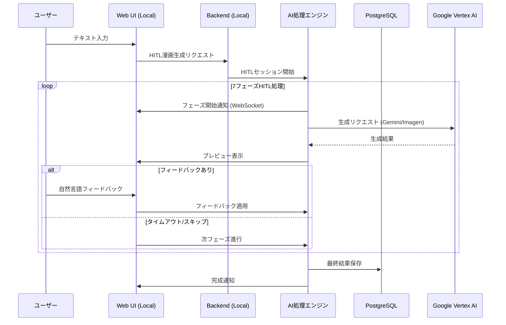

# システムアーキテクチャ

**文書ID**: REQ-ARCH-001
**作成日**: 2025-08-28
**更新日**: 2025-12-06
**親文書**: [要件定義書 README](./README.md)

## 🏗️ システム構成図

```mermaid
graph TB
    subgraph "クライアント環境"
        A[Web UI (Next.js)]
    end

    subgraph "ローカルDocker環境"
        direction TB
        C[API Gateway / Backend (FastAPI)]
        
        subgraph "処理層"
            E[7フェーズHITL処理エンジン]
            F[フィードバック管理]
        end

        subgraph "データ層"
            H[(PostgreSQL)]
            I[(MinIO / Local Storage)]
            J[(Redis)]
        end
    end

    subgraph "外部クラウドAPI (Google Cloud)"
        K[Google Imagen 4]
        L[Gemini Pro]
    end

    A <--> C
    C --> E
    E --> F
    E --> K
    E --> L
    F --> H
    E --> I
    E --> J
```

## 🔄 データフロー図



## ⚙️ 技術方針

### 基本技術方針
- **ローカルファースト**: 全てのインフラコンポーネントをローカル環境（Docker）で完結させる
- **クラウド最小化**: Google Cloudの利用はLLM/画像生成API（Vertex AI）のみに限定
- **コンテナ化**: `docker-compose` による一発起動・環境構築
- **セキュリティ**: APIキー管理による外部アクセス制御

### 技術スタック概要

#### フロントエンド
- **フレームワーク**: Next.js 14 (Dockerコンテナ)
- **UI ライブラリ**: カスタムコンポーネント
- **通信**: WebSocket + REST API

#### バックエンド
- **フレームワーク**: Python 3.11 + FastAPI (Dockerコンテナ)
- **処理エンジン**: 7フェーズAgent システム
- **非同期タスク**: Redis + Worker (Celery/Arq)
- **データベース**: PostgreSQL 15 (Dockerコンテナ)

#### ストレージ・インフラ
- **オブジェクトストレージ**: MinIO (S3互換) または ローカルファイルシステム
- **認証**: ローカルJWT認証 (Firebase不要)
- **構成管理**: Docker Compose

#### AI・外部サービス (唯一のクラウド依存)
- **テキスト処理**: Google Gemini Pro (Vertex AI)
- **画像生成**: Google Imagen 4 (Vertex AI)

## 🔧 システム品質属性

### パフォーマンス
- **ローカル最適化**: ネットワークレイテンシの排除（APIコール以外）
- **リソース管理**: Dockerのリソース制限設定による安定稼働

### 可用性・保守性
- **環境再現性**: コンテナ技術による「どこでも動く」環境
- **オフライン開発**: AI機能以外はオフラインでも動作確認可能（モック利用時）

## 🔗 関連文書

- [ビジネス要件](./business-requirements.md)
- [機能要件](./functional-requirements.md)
- [非機能要件](./non-functional-requirements.md)
- [要件定義書 README](./README.md)
- [インフラ設計書](../07-infrastructure/README.md)

---

**メタデータ**
- カテゴリ: システムアーキテクチャ
- 重要度: 最高
- 更新頻度: 中