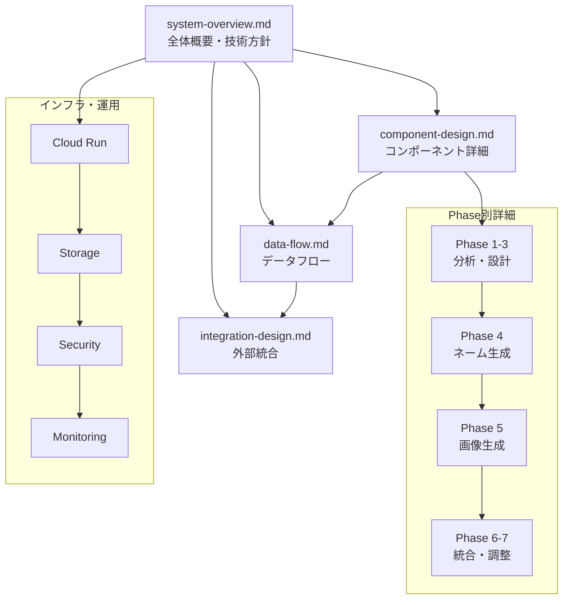

# システムアーキテクチャ文書群

> **TL;DR**: AI漫画生成サービスの論理的に分割されたアーキテクチャ文書群。システム全体概要、コンポーネント設計、データフロー設計、外部統合設計の4文書で構成。7フェーズエージェント、Cloud Run構成、HITLプレビューシステムを包括的に設計。

## 概要

AI漫画生成サービスのシステムアーキテクチャ文書群です。システム設計書の構造を論理的に分割し、各要素の設計詳細とその相互関係を体系的に整理しています。

## 文書構成

| 文書名 | 内容 | 形式 | ページ数 |
|--------|------|------|----------|
| [system-overview.md](./system-overview.md) | システム全体概要、アーキテクチャ方針、技術スタック | YAML設計 | ~500-600行 |
| [component-design.md](./component-design.md) | コンポーネント設計、マイクロサービス設計、モジュール構成 | YAML設計 | ~600-700行 |
| [data-flow.md](./data-flow.md) | データフロー設計、通信プロトコル、メッセージング | YAML設計 | ~400-500行 |
| [integration-design.md](./integration-design.md) | 外部システム統合、API統合、サードパーティ連携 | YAML設計 | ~300-400行 |
| [technical-spec.md](./technical-spec.md) | 技術仕様詳細、非同期処理、環境設定 | YAML設計 | ~800行 |

## ナビゲーション

### 開発フェーズ別推奨読み順

**1. 概要把握フェーズ**
1. [システム全体概要](./system-overview.md) - 設計方針と技術スタックの理解
2. [データフロー設計](./data-flow.md) - 処理流れの把握

**2. 実装準備フェーズ**
1. [コンポーネント設計](./component-design.md) - 詳細実装仕様の理解
2. [外部統合設計](./integration-design.md) - API連携の詳細

**3. インフラ構築フェーズ**
1. [システム全体概要](./system-overview.md#インフラストラクチャ設計) - Cloud Run構成
2. [外部統合設計](./integration-design.md#信頼性設計) - セキュリティ・運用設計

### 機能別参照ガイド

**7フェーズエージェント関連**
- コンセプト分析: [component-design.md#phase1-コンセプト世界観分析](./component-design.md#phase1-コンセプト世界観分析)
- キャラクター設計: [component-design.md#phase2-キャラクター設計](./component-design.md#phase2-キャラクター設計)
- プロット構成: [component-design.md#phase3-プロットストーリー構成](./component-design.md#phase3-プロットストーリー構成)
- ネーム生成: [component-design.md#phase4-ネーム生成詳細設計](./component-design.md#phase4-ネーム生成詳細設計)
- 画像生成: [component-design.md#phase5-並列画像生成](./component-design.md#phase5-並列画像生成)
- セリフ配置: [component-design.md#phase6-セリフ配置](./component-design.md#phase6-セリフ配置)
- 最終統合: [component-design.md#phase7-最終統合品質調整](./component-design.md#phase7-最終統合品質調整)

**インフラ・運用関連**
- Cloud Run設定: [system-overview.md#cloud-run構成](./system-overview.md#cloud-run構成)
- ストレージ設計: [system-overview.md#ストレージ設計](./system-overview.md#ストレージ設計)
- API統合: [integration-design.md#google-ai-api接続](./integration-design.md#google-ai-api接続)
- セキュリティ: [integration-design.md#セキュリティ設計](./integration-design.md#セキュリティ設計)

**HITL・プレビュー関連**
- リアルタイム通信: [data-flow.md#リアルタイム通信サービス](./data-flow.md#リアルタイム通信サービス)
- プレビューシステム: [data-flow.md#プレビューシステム統合設計](./data-flow.md#プレビューシステム統合設計)
- フィードバック処理: [data-flow.md#hitlフィードバックシステム設計](./data-flow.md#hitlフィードバックシステム設計)

## 相互参照マップ

## 更新履歴

| 版数 | 日付 | 変更内容 | 担当者 |
|------|------|----------|--------|
| 1.0 | 2025-08-28 | システム設計書分割によるアーキテクチャ文書群作成 | Claude Code |

---

**文書承認**
- システムアーキテクト: TBD 日付: TBD
- 開発責任者: TBD 日付: TBD