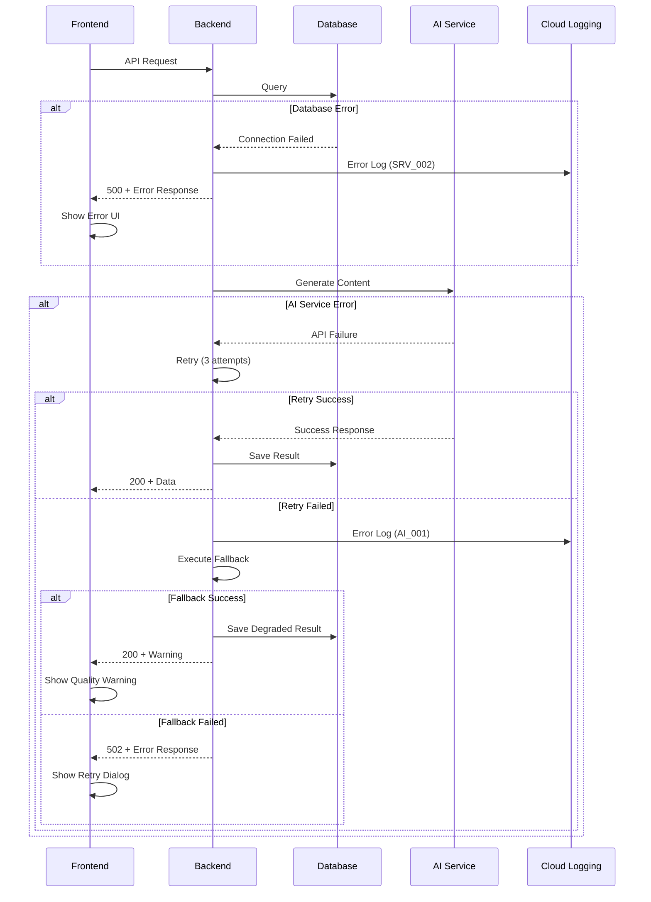

# エラーハンドリング実装仕様

> **TL;DR**: 包括的エラーハンドリング実装仕様。7カテゴリのエラーコード体系（AUTH/AUTHZ/VALID/RATE/RES/SRV/AI）、3回リトライ機構（指数バックオフ10-120秒）、4層フォールバック戦略（品質劣化→代替AI→キャッシュ→エラー返却）、WebSocketエラー通知、構造化ロギング（Cloud Logging）、リアルタイムアラート（Slack/PagerDuty）で構成。

**ナビゲーション**: [README](./README.md) > エラーハンドリング実装仕様

**関連文書**:
- [システム全体概要](./system-overview.md)
- [API設計概要](../03-api/api-overview.md)
- [AI設計概要](../06-ai/ai-overview.md)

---

## 目次

1. [エラー分類体系](#1-エラー分類体系)
2. [エラーコード詳細定義](#2-エラーコード詳細定義)
3. [リトライポリシー実装](#3-リトライポリシー実装)
4. [フォールバック戦略](#4-フォールバック戦略)
5. [エラー伝播パターン](#5-エラー伝播パターン)
6. [ユーザー向けエラーメッセージ](#6-ユーザー向けエラーメッセージ)
7. [エラーロギング・トラッキング](#7-エラーロギングトラッキング)
8. [WebSocketエラーハンドリング](#8-websocketエラーハンドリング)
9. [AI障害時の対応](#9-ai障害時の対応)
10. [実装リファレンス](#10-実装リファレンス)

---

## 1. エラー分類体系

### 1.1 エラーカテゴリ階層

```yaml
Error Classification Hierarchy:
  L1_System_Errors:           # システムレベル（5xx）
    - Infrastructure_Failures  # インフラ障害
    - External_API_Failures    # 外部API障害
    - Database_Failures        # データベース障害
    - Resource_Exhaustion      # リソース枯渇

  L2_Application_Errors:      # アプリケーションレベル（4xx）
    - Authentication_Errors    # 認証エラー
    - Authorization_Errors     # 認可エラー
    - Validation_Errors        # バリデーションエラー
    - Rate_Limit_Errors        # レート制限エラー
    - Resource_Not_Found       # リソース不存在

  L3_Business_Logic_Errors:   # ビジネスロジック（4xx/5xx）
    - AI_Generation_Failures   # AI生成失敗
    - Quality_Gate_Failures    # 品質ゲート失敗
    - HITL_Timeout_Errors      # HITLタイムアウト
    - Phase_Processing_Errors  # フェーズ処理エラー
```

### 1.2 HTTPステータスマッピング

| HTTPステータス | カテゴリ | 復旧可能性 | リトライ推奨 |
|---------------|---------|-----------|-------------|
| 400 Bad Request | バリデーション | 不可 | ❌ |
| 401 Unauthorized | 認証 | 可（トークン再取得） | ✅ |
| 403 Forbidden | 認可 | 不可 | ❌ |
| 404 Not Found | リソース | 不可 | ❌ |
| 409 Conflict | リソース競合 | 可 | ✅ |
| 429 Too Many Requests | レート制限 | 可（待機後） | ✅ |
| 500 Internal Server Error | サーバー | 可 | ✅ |
| 502 Bad Gateway | 外部API | 可 | ✅ |
| 503 Service Unavailable | メンテナンス | 可（待機後） | ✅ |
| 504 Gateway Timeout | タイムアウト | 可 | ✅ |

---

## 2. エラーコード詳細定義

### 2.1 認証エラー（AUTH_001-099）

| コード | HTTPステータス | 説明 | ユーザーメッセージ | 復旧アクション |
|--------|---------------|------|-------------------|---------------|
| AUTH_001 | 401 | Firebase IDトークン無効 | 認証の有効期限が切れました。再ログインしてください。 | トークン再取得 |
| AUTH_002 | 401 | トークン検証失敗 | 認証に失敗しました。再度ログインしてください。 | ログイン画面へ遷移 |
| AUTH_003 | 401 | トークン期限切れ | セッションの有効期限が切れました。 | トークン更新 |
| AUTH_004 | 401 | トークン未提供 | 認証が必要です。ログインしてください。 | ログイン画面へ遷移 |
| AUTH_005 | 401 | 無効な認証形式 | 認証情報の形式が正しくありません。 | クライアント修正 |

**実装例（バックエンド）:**

```python
# backend/app/middleware/auth.py
from fastapi import HTTPException, status
from firebase_admin import auth

class AuthenticationError(Exception):
    def __init__(self, code: str, message: str, details: dict = None):
        self.code = code
        self.message = message
        self.details = details or {}
        super().__init__(message)

async def verify_firebase_token(token: str) -> dict:
    """
    Firebase IDトークン検証

    Raises:
        AuthenticationError: 認証失敗時
    """
    if not token:
        raise AuthenticationError(
            code="AUTH_004",
            message="認証が必要です。ログインしてください。",
            details={"reason": "token_missing"}
        )

    try:
        decoded_token = auth.verify_id_token(token)
        return decoded_token

    except auth.ExpiredIdTokenError:
        raise AuthenticationError(
            code="AUTH_003",
            message="セッションの有効期限が切れました。",
            details={"reason": "token_expired"}
        )

    except auth.InvalidIdTokenError:
        raise AuthenticationError(
            code="AUTH_001",
            message="認証の有効期限が切れました。再ログインしてください。",
            details={"reason": "token_invalid"}
        )

    except Exception as e:
        raise AuthenticationError(
            code="AUTH_002",
            message="認証に失敗しました。再度ログインしてください。",
            details={"reason": "verification_failed", "error": str(e)}
        )
```

### 2.2 認可エラー（AUTHZ_001-099）

| コード | HTTPステータス | 説明 | ユーザーメッセージ | 復旧アクション |
|--------|---------------|------|-------------------|---------------|
| AUTHZ_001 | 403 | アクセス権限なし | この操作を行う権限がありません。 | プラン変更案内 |
| AUTHZ_002 | 403 | リソース所有者不一致 | 他のユーザーのリソースにはアクセスできません。 | 操作不可通知 |
| AUTHZ_003 | 403 | 機能未許可 | この機能はご利用いただけません。 | プラン変更案内 |
| AUTHZ_004 | 403 | セッション所有権なし | このセッションへのアクセス権限がありません。 | セッション一覧へ遷移 |

**実装例（バックエンド）:**

```python
# backend/app/middleware/authorization.py
from typing import Optional
from sqlalchemy.ext.asyncio import AsyncSession

class AuthorizationError(Exception):
    def __init__(self, code: str, message: str, details: dict = None):
        self.code = code
        self.message = message
        self.details = details or {}
        super().__init__(message)

async def check_session_ownership(
    session_id: str,
    user_id: str,
    db: AsyncSession
) -> bool:
    """
    セッション所有権チェック

    Args:
        session_id: セッションID
        user_id: ユーザーID
        db: データベースセッション

    Raises:
        AuthorizationError: 所有権なし
    """
    from app.db.models import MangaSession

    session = await db.get(MangaSession, session_id)

    if not session:
        raise AuthorizationError(
            code="RES_001",
            message="セッションが見つかりません。",
            details={"session_id": session_id}
        )

    if session.user_id != user_id:
        raise AuthorizationError(
            code="AUTHZ_004",
            message="このセッションへのアクセス権限がありません。",
            details={
                "session_id": session_id,
                "owner_id": session.user_id,
                "requester_id": user_id
            }
        )

    return True

async def check_user_tier(user: dict, required_tier: str) -> bool:
    """
    ユーザープランチェック

    Args:
        user: Firebase Custom Claims
        required_tier: 必要なプラン（basic/pro/enterprise）

    Raises:
        AuthorizationError: プラン不足
    """
    tier_hierarchy = {"basic": 0, "pro": 1, "enterprise": 2}

    user_tier = user.get("tier", "basic")
    user_level = tier_hierarchy.get(user_tier, 0)
    required_level = tier_hierarchy.get(required_tier, 0)

    if user_level < required_level:
        raise AuthorizationError(
            code="AUTHZ_003",
            message="この機能はご利用いただけません。",
            details={
                "current_tier": user_tier,
                "required_tier": required_tier,
                "upgrade_url": "/pricing"
            }
        )

    return True
```

### 2.3 バリデーションエラー（VALID_001-099）

| コード | HTTPステータス | 説明 | ユーザーメッセージ | 復旧アクション |
|--------|---------------|------|-------------------|---------------|
| VALID_001 | 400 | 必須項目不足 | {field}は必須項目です。 | フィールド入力 |
| VALID_002 | 400 | 形式エラー | {field}の形式が正しくありません。 | 入力修正 |
| VALID_003 | 400 | 範囲外の値 | {field}は{min}〜{max}の範囲で指定してください。 | 値修正 |
| VALID_004 | 400 | 文字数超過 | {field}は{max}文字以内で入力してください。 | 文字数削減 |
| VALID_005 | 400 | 不正な列挙値 | {field}の値が不正です。有効な値: {allowed_values} | 値選択 |
| VALID_006 | 400 | JSONパースエラー | リクエストボディの形式が不正です。 | JSON修正 |

**実装例（バックエンド）:**

```python
# backend/app/schemas/validation.py
from pydantic import BaseModel, Field, validator
from typing import Optional, List

class ValidationError(Exception):
    def __init__(self, code: str, message: str, details: dict = None):
        self.code = code
        self.message = message
        self.details = details or {}
        super().__init__(message)

class MangaGenerationRequest(BaseModel):
    """マンガ生成リクエストスキーマ"""

    text: str = Field(..., min_length=100, max_length=50000)
    style: Optional[str] = Field(None, regex="^(manga|webtoon|comic)$")
    target_audience: Optional[str] = Field(
        None,
        regex="^(shounen|shoujo|seinen|josei)$"
    )

    @validator("text")
    def validate_text_length(cls, v):
        if len(v) < 100:
            raise ValidationError(
                code="VALID_003",
                message="textは100文字以上で入力してください。",
                details={
                    "field": "text",
                    "min": 100,
                    "current": len(v)
                }
            )
        if len(v) > 50000:
            raise ValidationError(
                code="VALID_004",
                message="textは50000文字以内で入力してください。",
                details={
                    "field": "text",
                    "max": 50000,
                    "current": len(v)
                }
            )
        return v

    @validator("style")
    def validate_style(cls, v):
        if v and v not in ["manga", "webtoon", "comic"]:
            raise ValidationError(
                code="VALID_005",
                message="styleの値が不正です。有効な値: manga, webtoon, comic",
                details={
                    "field": "style",
                    "allowed_values": ["manga", "webtoon", "comic"],
                    "provided": v
                }
            )
        return v

# FastAPIエラーハンドラー
from fastapi import Request
from fastapi.responses import JSONResponse
from pydantic import ValidationError as PydanticValidationError

@app.exception_handler(PydanticValidationError)
async def pydantic_validation_exception_handler(
    request: Request,
    exc: PydanticValidationError
):
    """Pydanticバリデーションエラーハンドラー"""
    errors = []
    for error in exc.errors():
        field = ".".join(str(loc) for loc in error["loc"])
        errors.append({
            "field": field,
            "message": error["msg"],
            "type": error["type"]
        })

    return JSONResponse(
        status_code=400,
        content={
            "error": {
                "code": "VALID_001",
                "message": "入力値にエラーがあります。",
                "details": {"validation_errors": errors},
                "timestamp": datetime.utcnow().isoformat(),
                "path": str(request.url.path)
            }
        }
    )
```

### 2.4 レート制限エラー（RATE_001-099）

| コード | HTTPステータス | 説明 | ユーザーメッセージ | 復旧アクション |
|--------|---------------|------|-------------------|---------------|
| RATE_001 | 429 | 日次制限到達 | 本日の生成上限に達しました。明日再度お試しください。 | プラン変更案内 |
| RATE_002 | 429 | 時間制限到達 | 1時間あたりの上限に達しました。しばらく待ってから再度お試しください。 | 待機 |
| RATE_003 | 429 | 同時実行制限 | 現在他の生成処理が実行中です。完了後に再度お試しください。 | 待機 |
| RATE_004 | 429 | WebSocket接続制限 | 同時接続数の上限に達しました。 | 既存接続終了 |

**実装例（バックエンド）:**

```python
# backend/app/middleware/rate_limiter.py
from datetime import datetime, timedelta
from typing import Optional
import redis.asyncio as redis

class RateLimitError(Exception):
    def __init__(self, code: str, message: str, details: dict = None):
        self.code = code
        self.message = message
        self.details = details or {}
        super().__init__(message)

class RateLimiter:
    def __init__(self, redis_client: redis.Redis):
        self.redis = redis_client

    async def check_daily_limit(
        self,
        user_id: str,
        tier: str = "free"
    ) -> bool:
        """
        日次生成制限チェック

        Args:
            user_id: ユーザーID
            tier: ユーザープラン（free/premium/admin）

        Raises:
            RateLimitError: 制限超過時
        """
        limits = {
            "free": 3,
            "premium": None,  # 無制限
            "admin": None
        }

        daily_limit = limits.get(tier, 3)

        if daily_limit is None:
            return True

        # 今日の生成数を取得
        today = datetime.utcnow().date().isoformat()
        key = f"rate_limit:daily:{user_id}:{today}"

        count = await self.redis.get(key)
        current_count = int(count) if count else 0

        if current_count >= daily_limit:
            reset_time = datetime.utcnow().replace(
                hour=0, minute=0, second=0, microsecond=0
            ) + timedelta(days=1)

            raise RateLimitError(
                code="RATE_001",
                message="本日の生成上限に達しました。明日再度お試しください。",
                details={
                    "limit": daily_limit,
                    "used": current_count,
                    "remaining": 0,
                    "reset_at": reset_time.isoformat(),
                    "upgrade_url": "/pricing"
                }
            )

        return True

    async def increment_daily_count(self, user_id: str) -> int:
        """日次カウント増加"""
        today = datetime.utcnow().date().isoformat()
        key = f"rate_limit:daily:{user_id}:{today}"

        count = await self.redis.incr(key)

        # 24時間後に期限切れ
        if count == 1:
            await self.redis.expire(key, 86400)

        return count

    async def check_concurrent_generation(
        self,
        user_id: str,
        max_concurrent: int = 1
    ) -> bool:
        """
        同時生成数チェック

        Args:
            user_id: ユーザーID
            max_concurrent: 最大同時生成数

        Raises:
            RateLimitError: 同時実行制限超過
        """
        key = f"concurrent:generation:{user_id}"
        count = await self.redis.scard(key)

        if count >= max_concurrent:
            raise RateLimitError(
                code="RATE_003",
                message="現在他の生成処理が実行中です。完了後に再度お試しください。",
                details={
                    "max_concurrent": max_concurrent,
                    "current": count
                }
            )

        return True

    async def add_concurrent_session(
        self,
        user_id: str,
        session_id: str
    ):
        """同時実行セッション追加"""
        key = f"concurrent:generation:{user_id}"
        await self.redis.sadd(key, session_id)
        await self.redis.expire(key, 3600)  # 1時間後に期限切れ

    async def remove_concurrent_session(
        self,
        user_id: str,
        session_id: str
    ):
        """同時実行セッション削除"""
        key = f"concurrent:generation:{user_id}"
        await self.redis.srem(key, session_id)

# FastAPIエンドポイントでの使用例
@app.post("/api/v1/manga/generate")
async def generate_manga(
    request: MangaGenerationRequest,
    user: dict = Depends(get_current_user),
    rate_limiter: RateLimiter = Depends(get_rate_limiter)
):
    """マンガ生成API"""

    # レート制限チェック
    await rate_limiter.check_daily_limit(
        user_id=user["uid"],
        tier=user.get("tier", "free")
    )

    await rate_limiter.check_concurrent_generation(
        user_id=user["uid"]
    )

    # セッション作成
    session_id = str(uuid.uuid4())

    # 同時実行トラッキング追加
    await rate_limiter.add_concurrent_session(
        user_id=user["uid"],
        session_id=session_id
    )

    # 日次カウント増加
    await rate_limiter.increment_daily_count(user["uid"])

    # ... 生成処理 ...

    return {"session_id": session_id, "status": "queued"}
```

### 2.5 リソースエラー（RES_001-099）

| コード | HTTPステータス | 説明 | ユーザーメッセージ | 復旧アクション |
|--------|---------------|------|-------------------|---------------|
| RES_001 | 404 | リソース未発見 | 指定されたリソースが見つかりません。 | パス確認 |
| RES_002 | 404 | セッション不存在 | セッションが見つかりません。 | セッション一覧へ |
| RES_003 | 409 | リソース競合 | リソースが既に存在します。 | 別名使用 |
| RES_004 | 410 | リソース削除済み | このリソースは削除されました。 | 操作不可通知 |

### 2.6 サーバーエラー（SRV_001-099）

| コード | HTTPステータス | 説明 | ユーザーメッセージ | 復旧アクション |
|--------|---------------|------|-------------------|---------------|
| SRV_001 | 500 | 内部サーバーエラー | システムエラーが発生しました。しばらく待ってから再度お試しください。 | リトライ |
| SRV_002 | 500 | データベース接続エラー | データベース接続に失敗しました。 | リトライ |
| SRV_003 | 500 | 予期しない例外 | 予期しないエラーが発生しました。 | サポート連絡 |
| SRV_004 | 503 | メンテナンス中 | 現在メンテナンス中です。しばらくお待ちください。 | 待機 |
| SRV_005 | 504 | 処理タイムアウト | 処理がタイムアウトしました。 | リトライ |

### 2.7 AI生成エラー（AI_001-099）

| コード | HTTPステータス | 説明 | ユーザーメッセージ | 復旧アクション |
|--------|---------------|------|-------------------|---------------|
| AI_001 | 502 | 生成API障害 | AI生成サービスが一時的に利用できません。 | リトライ |
| AI_002 | 500 | 品質ゲート失敗 | 品質基準を満たす結果が生成できませんでした。 | フィードバック提供 |
| AI_003 | 500 | フェーズ処理失敗 | フェーズ{phase}の処理に失敗しました。 | リトライ |
| AI_004 | 502 | Gemini API障害 | テキスト生成サービスが一時的に利用できません。 | リトライ |
| AI_005 | 502 | Imagen API障害 | 画像生成サービスが一時的に利用できません。 | リトライ |
| AI_006 | 408 | HITL タイムアウト | フィードバック待機がタイムアウトしました。 | 自動継続 |
| AI_007 | 500 | プロンプト生成失敗 | AI用プロンプトの生成に失敗しました。 | リトライ |
| AI_008 | 500 | 結果パース失敗 | AI応答の解析に失敗しました。 | リトライ |

**実装例（バックエンド）:**

```python
# backend/app/services/error_handler.py
from typing import Optional, Dict, Any
import logging
from datetime import datetime

logger = logging.getLogger(__name__)

class AIGenerationError(Exception):
    """AI生成エラー"""
    def __init__(
        self,
        code: str,
        message: str,
        phase: Optional[int] = None,
        details: Optional[Dict[str, Any]] = None
    ):
        self.code = code
        self.message = message
        self.phase = phase
        self.details = details or {}
        self.timestamp = datetime.utcnow()
        super().__init__(message)

class ErrorContext:
    """エラーコンテキスト情報"""
    def __init__(
        self,
        session_id: str,
        user_id: str,
        phase: Optional[int] = None,
        operation: Optional[str] = None
    ):
        self.session_id = session_id
        self.user_id = user_id
        self.phase = phase
        self.operation = operation
        self.timestamp = datetime.utcnow()

    def to_dict(self) -> dict:
        return {
            "session_id": self.session_id,
            "user_id": self.user_id,
            "phase": self.phase,
            "operation": self.operation,
            "timestamp": self.timestamp.isoformat()
        }

def create_error_response(
    error: Exception,
    context: Optional[ErrorContext] = None,
    include_trace: bool = False
) -> dict:
    """
    統一エラーレスポンス生成

    Args:
        error: 例外オブジェクト
        context: エラーコンテキスト
        include_trace: トレース情報を含めるか

    Returns:
        統一フォーマットのエラーレスポンス
    """
    error_code = getattr(error, "code", "SRV_001")
    error_message = getattr(error, "message", str(error))
    error_details = getattr(error, "details", {})

    if context:
        error_details.update(context.to_dict())

    response = {
        "error": {
            "code": error_code,
            "message": error_message,
            "details": error_details,
            "timestamp": datetime.utcnow().isoformat()
        }
    }

    if include_trace:
        import traceback
        response["error"]["trace"] = traceback.format_exc()

    # ロギング
    logger.error(
        f"Error occurred: {error_code}",
        extra={
            "error_code": error_code,
            "error_message": error_message,
            "details": error_details
        }
    )

    return response
```

---

## 3. リトライポリシー実装

### 3.1 リトライ戦略

```yaml
Retry Strategy:
  max_attempts: 3                    # 最大リトライ回数
  base_backoff: 10                   # 初期バックオフ（秒）
  max_backoff: 120                   # 最大バックオフ（秒）
  backoff_multiplier: 2              # バックオフ倍率（指数バックオフ）
  jitter: true                       # ジッター適用（衝突回避）
  jitter_range: [0.5, 1.5]          # ジッター範囲係数

Retry Conditions:
  retryable_http_status:
    - 429  # Too Many Requests
    - 500  # Internal Server Error
    - 502  # Bad Gateway
    - 503  # Service Unavailable
    - 504  # Gateway Timeout

  retryable_error_codes:
    - AI_001   # 生成API障害
    - AI_004   # Gemini API障害
    - AI_005   # Imagen API障害
    - SRV_001  # 内部サーバーエラー
    - SRV_002  # データベース接続エラー
    - SRV_005  # 処理タイムアウト

  non_retryable_error_codes:
    - AUTH_*   # 認証エラー（トークン再取得が必要）
    - AUTHZ_*  # 認可エラー（権限なし）
    - VALID_*  # バリデーションエラー（入力修正が必要）
    - RES_001  # リソース未発見
    - RES_004  # リソース削除済み
```

### 3.2 リトライ実装コード

**バックエンド実装:**

```python
# backend/app/utils/retry.py
import asyncio
import random
from typing import Callable, TypeVar, Optional, List
from functools import wraps
import logging

logger = logging.getLogger(__name__)

T = TypeVar('T')

class RetryConfig:
    """リトライ設定"""
    def __init__(
        self,
        max_attempts: int = 3,
        base_backoff: float = 10.0,
        max_backoff: float = 120.0,
        backoff_multiplier: float = 2.0,
        jitter: bool = True,
        jitter_range: tuple = (0.5, 1.5),
        retryable_exceptions: Optional[List[type]] = None,
        retryable_error_codes: Optional[List[str]] = None
    ):
        self.max_attempts = max_attempts
        self.base_backoff = base_backoff
        self.max_backoff = max_backoff
        self.backoff_multiplier = backoff_multiplier
        self.jitter = jitter
        self.jitter_range = jitter_range
        self.retryable_exceptions = retryable_exceptions or []
        self.retryable_error_codes = retryable_error_codes or [
            "AI_001", "AI_004", "AI_005",
            "SRV_001", "SRV_002", "SRV_005"
        ]

def calculate_backoff(
    attempt: int,
    base_backoff: float,
    max_backoff: float,
    multiplier: float,
    jitter: bool,
    jitter_range: tuple
) -> float:
    """
    バックオフ時間計算（指数バックオフ + ジッター）

    Args:
        attempt: リトライ回数（1始まり）
        base_backoff: 基本バックオフ時間
        max_backoff: 最大バックオフ時間
        multiplier: バックオフ倍率
        jitter: ジッター適用フラグ
        jitter_range: ジッター範囲係数

    Returns:
        バックオフ時間（秒）
    """
    # 指数バックオフ計算
    backoff = min(base_backoff * (multiplier ** (attempt - 1)), max_backoff)

    # ジッター適用
    if jitter:
        jitter_factor = random.uniform(*jitter_range)
        backoff = backoff * jitter_factor

    return backoff

def is_retryable(error: Exception, config: RetryConfig) -> bool:
    """
    リトライ可能エラー判定

    Args:
        error: 発生した例外
        config: リトライ設定

    Returns:
        リトライ可能ならTrue
    """
    # 例外クラスチェック
    for exc_type in config.retryable_exceptions:
        if isinstance(error, exc_type):
            return True

    # エラーコードチェック
    error_code = getattr(error, "code", None)
    if error_code:
        # 完全一致
        if error_code in config.retryable_error_codes:
            return True

        # プレフィックス一致（例: AI_*）
        for retryable_code in config.retryable_error_codes:
            if retryable_code.endswith("_*"):
                prefix = retryable_code[:-2]
                if error_code.startswith(prefix):
                    return True

    return False

def retry_async(config: Optional[RetryConfig] = None):
    """
    非同期関数リトライデコレーター

    Usage:
        @retry_async(RetryConfig(max_attempts=3))
        async def fetch_data():
            ...
    """
    if config is None:
        config = RetryConfig()

    def decorator(func: Callable) -> Callable:
        @wraps(func)
        async def wrapper(*args, **kwargs):
            last_exception = None

            for attempt in range(1, config.max_attempts + 1):
                try:
                    return await func(*args, **kwargs)

                except Exception as e:
                    last_exception = e

                    # リトライ可能かチェック
                    if not is_retryable(e, config):
                        logger.warning(
                            f"Non-retryable error occurred: {e}",
                            extra={"error_code": getattr(e, "code", None)}
                        )
                        raise

                    # 最後の試行なら例外をそのまま投げる
                    if attempt == config.max_attempts:
                        logger.error(
                            f"Max retry attempts ({config.max_attempts}) reached",
                            extra={
                                "function": func.__name__,
                                "error": str(e),
                                "error_code": getattr(e, "code", None)
                            }
                        )
                        raise

                    # バックオフ時間計算
                    backoff_time = calculate_backoff(
                        attempt=attempt,
                        base_backoff=config.base_backoff,
                        max_backoff=config.max_backoff,
                        multiplier=config.backoff_multiplier,
                        jitter=config.jitter,
                        jitter_range=config.jitter_range
                    )

                    logger.warning(
                        f"Retry attempt {attempt}/{config.max_attempts} "
                        f"after {backoff_time:.2f}s",
                        extra={
                            "function": func.__name__,
                            "attempt": attempt,
                            "backoff_seconds": backoff_time,
                            "error": str(e),
                            "error_code": getattr(e, "code", None)
                        }
                    )

                    # バックオフ待機
                    await asyncio.sleep(backoff_time)

            # ここには到達しないが、型チェックのため
            if last_exception:
                raise last_exception

        return wrapper
    return decorator

# 使用例
@retry_async(RetryConfig(
    max_attempts=3,
    base_backoff=10.0,
    retryable_exceptions=[AIGenerationError],
    retryable_error_codes=["AI_*", "SRV_*"]
))
async def call_gemini_api(prompt: str) -> str:
    """Gemini API呼び出し（リトライあり）"""
    try:
        response = await gemini_client.generate_content(prompt)
        return response.text

    except Exception as e:
        raise AIGenerationError(
            code="AI_004",
            message="テキスト生成サービスが一時的に利用できません。",
            details={"error": str(e)}
        )

@retry_async(RetryConfig(
    max_attempts=3,
    base_backoff=15.0,
    max_backoff=120.0
))
async def call_imagen_api(prompt: str, **kwargs) -> bytes:
    """Imagen API呼び出し（リトライあり）"""
    try:
        response = await imagen_client.generate_image(prompt, **kwargs)
        return response.image_data

    except Exception as e:
        raise AIGenerationError(
            code="AI_005",
            message="画像生成サービスが一時的に利用できません。",
            details={"error": str(e)}
        )
```

**フロントエンド実装:**

```typescript
// frontend/src/utils/retry.ts
export interface RetryConfig {
  maxAttempts: number;
  baseBackoff: number;
  maxBackoff: number;
  backoffMultiplier: number;
  jitter: boolean;
  jitterRange: [number, number];
  retryableStatusCodes: number[];
  retryableErrorCodes: string[];
}

const DEFAULT_RETRY_CONFIG: RetryConfig = {
  maxAttempts: 3,
  baseBackoff: 1000,  // 1秒
  maxBackoff: 30000,  // 30秒
  backoffMultiplier: 2,
  jitter: true,
  jitterRange: [0.5, 1.5],
  retryableStatusCodes: [429, 500, 502, 503, 504],
  retryableErrorCodes: ["AI_001", "AI_004", "AI_005", "SRV_001"]
};

function calculateBackoff(
  attempt: number,
  config: RetryConfig
): number {
  // 指数バックオフ計算
  let backoff = Math.min(
    config.baseBackoff * Math.pow(config.backoffMultiplier, attempt - 1),
    config.maxBackoff
  );

  // ジッター適用
  if (config.jitter) {
    const [min, max] = config.jitterRange;
    const jitterFactor = Math.random() * (max - min) + min;
    backoff = backoff * jitterFactor;
  }

  return backoff;
}

function isRetryable(
  error: any,
  config: RetryConfig
): boolean {
  // HTTPステータスコードチェック
  if (error.response?.status) {
    if (config.retryableStatusCodes.includes(error.response.status)) {
      return true;
    }
  }

  // エラーコードチェック
  const errorCode = error.response?.data?.error?.code || error.code;
  if (errorCode) {
    return config.retryableErrorCodes.some(retryableCode => {
      if (retryableCode.endsWith("_*")) {
        const prefix = retryableCode.slice(0, -2);
        return errorCode.startsWith(prefix);
      }
      return errorCode === retryableCode;
    });
  }

  return false;
}

export async function retryAsync<T>(
  fn: () => Promise<T>,
  config: Partial<RetryConfig> = {}
): Promise<T> {
  const finalConfig: RetryConfig = { ...DEFAULT_RETRY_CONFIG, ...config };
  let lastError: any;

  for (let attempt = 1; attempt <= finalConfig.maxAttempts; attempt++) {
    try {
      return await fn();
    } catch (error) {
      lastError = error;

      // リトライ可能かチェック
      if (!isRetryable(error, finalConfig)) {
        console.warn("Non-retryable error occurred:", error);
        throw error;
      }

      // 最後の試行なら例外を投げる
      if (attempt === finalConfig.maxAttempts) {
        console.error(`Max retry attempts (${finalConfig.maxAttempts}) reached`);
        throw error;
      }

      // バックオフ時間計算
      const backoffTime = calculateBackoff(attempt, finalConfig);

      console.warn(
        `Retry attempt ${attempt}/${finalConfig.maxAttempts} after ${backoffTime}ms`,
        { error, backoffTime }
      );

      // バックオフ待機
      await new Promise(resolve => setTimeout(resolve, backoffTime));
    }
  }

  throw lastError;
}

// 使用例
export async function fetchMangaSession(sessionId: string) {
  return retryAsync(
    async () => {
      const response = await fetch(`/api/v1/manga/sessions/${sessionId}`);
      if (!response.ok) {
        throw new Error(`HTTP ${response.status}`);
      }
      return response.json();
    },
    {
      maxAttempts: 3,
      baseBackoff: 1000
    }
  );
}
```

### 3.3 フェーズ別リトライ設定

| フェーズ | 最大リトライ | 基本バックオフ | 最大バックオフ | 備考 |
|---------|------------|--------------|--------------|------|
| Phase 1 | 3 | 10秒 | 60秒 | テキスト分析 |
| Phase 2 | 3 | 10秒 | 60秒 | キャラクター設計 |
| Phase 3 | 3 | 10秒 | 60秒 | プロット生成 |
| Phase 4 | 3 | 15秒 | 90秒 | ネーム生成（複雑） |
| Phase 5 | 5 | 20秒 | 120秒 | 画像生成（時間かかる） |
| Phase 6 | 3 | 10秒 | 60秒 | セリフ配置 |
| Phase 7 | 3 | 15秒 | 90秒 | 最終統合 |

---

## 4. フォールバック戦略

### 4.1 階層的フォールバック

```yaml
Fallback Strategy Hierarchy:
  L1_Quality_Degradation:      # 品質劣化許容
    trigger: 品質スコア 70% 未達成
    action: 60%以上の結果を許容
    notification: ユーザーに品質警告表示

  L2_Alternative_AI:           # 代替AI使用
    trigger: 主要AI API障害
    action: バックアップAIモデル使用
    models:
      - primary: Gemini Pro
        fallback: Gemini Flash
      - primary: Imagen 4
        fallback: Imagen 3

  L3_Cached_Results:           # キャッシュ結果使用
    trigger: 全AIサービス障害
    action: 類似入力の過去結果提供
    cache_ttl: 24時間
    similarity_threshold: 0.85

  L4_Error_Response:           # エラー返却
    trigger: 全フォールバック失敗
    action: 明確なエラーメッセージと代替案提示
    retry_suggestion: true
    support_contact: true
```

### 4.2 フォールバック実装

```python
# backend/app/services/fallback_handler.py
from typing import Optional, Any, Callable
from enum import Enum
import logging

logger = logging.getLogger(__name__)

class FallbackLevel(Enum):
    """フォールバックレベル"""
    QUALITY_DEGRADATION = 1
    ALTERNATIVE_AI = 2
    CACHED_RESULTS = 3
    ERROR_RESPONSE = 4

class FallbackStrategy:
    """フォールバック戦略"""

    def __init__(
        self,
        gemini_pro_client,
        gemini_flash_client,
        imagen4_client,
        imagen3_client,
        cache_service
    ):
        self.gemini_pro = gemini_pro_client
        self.gemini_flash = gemini_flash_client
        self.imagen4 = imagen4_client
        self.imagen3 = imagen3_client
        self.cache = cache_service

    async def execute_with_fallback(
        self,
        primary_fn: Callable,
        fallback_fn: Optional[Callable] = None,
        cache_key: Optional[str] = None,
        quality_threshold: float = 0.70,
        degraded_threshold: float = 0.60
    ) -> tuple[Any, FallbackLevel]:
        """
        フォールバック付き実行

        Args:
            primary_fn: 主要処理関数
            fallback_fn: フォールバック処理関数
            cache_key: キャッシュキー
            quality_threshold: 品質閾値
            degraded_threshold: 劣化品質閾値

        Returns:
            (結果, フォールバックレベル)
        """
        # L1: 主要処理実行
        try:
            result, quality_score = await primary_fn()

            # 品質チェック
            if quality_score >= quality_threshold:
                return result, FallbackLevel.QUALITY_DEGRADATION

            # 劣化品質許容
            if quality_score >= degraded_threshold:
                logger.warning(
                    f"Quality degradation accepted: {quality_score:.2%}",
                    extra={"quality_score": quality_score}
                )
                return result, FallbackLevel.QUALITY_DEGRADATION

            logger.warning(f"Quality below threshold: {quality_score:.2%}")

        except Exception as e:
            logger.error(f"Primary function failed: {e}")

        # L2: 代替AI使用
        if fallback_fn:
            try:
                result, quality_score = await fallback_fn()

                if quality_score >= degraded_threshold:
                    logger.info(
                        "Fallback AI succeeded",
                        extra={"quality_score": quality_score}
                    )
                    return result, FallbackLevel.ALTERNATIVE_AI

            except Exception as e:
                logger.error(f"Fallback function failed: {e}")

        # L3: キャッシュ結果使用
        if cache_key:
            try:
                cached_result = await self.cache.get(cache_key)

                if cached_result:
                    logger.info(
                        "Using cached result",
                        extra={"cache_key": cache_key}
                    )
                    return cached_result, FallbackLevel.CACHED_RESULTS

            except Exception as e:
                logger.error(f"Cache retrieval failed: {e}")

        # L4: エラー返却
        raise AIGenerationError(
            code="AI_001",
            message="AI生成サービスが一時的に利用できません。",
            details={
                "fallback_level": FallbackLevel.ERROR_RESPONSE.name,
                "retry_suggestion": True
            }
        )

    async def generate_text_with_fallback(
        self,
        prompt: str,
        phase: int
    ) -> tuple[str, FallbackLevel]:
        """
        テキスト生成（フォールバック付き）

        Args:
            prompt: プロンプト
            phase: フェーズ番号

        Returns:
            (生成テキスト, フォールバックレベル)
        """
        # 主要処理: Gemini Pro
        async def primary():
            response = await self.gemini_pro.generate_content(prompt)
            quality_score = self._evaluate_text_quality(response.text)
            return response.text, quality_score

        # フォールバック処理: Gemini Flash
        async def fallback():
            response = await self.gemini_flash.generate_content(prompt)
            quality_score = self._evaluate_text_quality(response.text)
            return response.text, quality_score

        cache_key = f"text:phase{phase}:{hash(prompt)}"

        return await self.execute_with_fallback(
            primary_fn=primary,
            fallback_fn=fallback,
            cache_key=cache_key
        )

    async def generate_image_with_fallback(
        self,
        prompt: str,
        phase: int
    ) -> tuple[bytes, FallbackLevel]:
        """
        画像生成（フォールバック付き）

        Args:
            prompt: プロンプト
            phase: フェーズ番号

        Returns:
            (画像データ, フォールバックレベル)
        """
        # 主要処理: Imagen 4
        async def primary():
            response = await self.imagen4.generate_image(prompt)
            quality_score = self._evaluate_image_quality(response.image_data)
            return response.image_data, quality_score

        # フォールバック処理: Imagen 3
        async def fallback():
            response = await self.imagen3.generate_image(prompt)
            quality_score = self._evaluate_image_quality(response.image_data)
            return response.image_data, quality_score

        cache_key = f"image:phase{phase}:{hash(prompt)}"

        return await self.execute_with_fallback(
            primary_fn=primary,
            fallback_fn=fallback,
            cache_key=cache_key
        )

    def _evaluate_text_quality(self, text: str) -> float:
        """テキスト品質評価"""
        # 簡易的な品質評価（実際はより複雑なロジック）
        if not text or len(text) < 10:
            return 0.0

        # 文字数、構造、コヒーレンスなどを評価
        score = min(len(text) / 1000, 1.0) * 0.7
        score += 0.3  # ベーススコア

        return min(score, 1.0)

    def _evaluate_image_quality(self, image_data: bytes) -> float:
        """画像品質評価"""
        # 簡易的な品質評価
        if not image_data or len(image_data) < 1024:
            return 0.0

        # ファイルサイズ、解像度などを評価
        score = min(len(image_data) / (1024 * 1024), 1.0) * 0.8
        score += 0.2  # ベーススコア

        return min(score, 1.0)
```

### 4.3 フェーズ別フォールバック設定

```python
# backend/app/config/fallback_config.py
from typing import Dict, Any

PHASE_FALLBACK_CONFIG: Dict[int, Dict[str, Any]] = {
    1: {  # Phase 1: コンセプト分析
        "quality_threshold": 0.70,
        "degraded_threshold": 0.60,
        "enable_cache": True,
        "cache_ttl": 86400,  # 24時間
        "alternative_model": "gemini-flash"
    },
    2: {  # Phase 2: キャラクター設計
        "quality_threshold": 0.75,
        "degraded_threshold": 0.65,
        "enable_cache": True,
        "cache_ttl": 86400,
        "alternative_model": "gemini-flash"
    },
    3: {  # Phase 3: プロット構成
        "quality_threshold": 0.70,
        "degraded_threshold": 0.60,
        "enable_cache": True,
        "cache_ttl": 43200,  # 12時間
        "alternative_model": "gemini-flash"
    },
    4: {  # Phase 4: ネーム生成
        "quality_threshold": 0.80,
        "degraded_threshold": 0.70,
        "enable_cache": False,  # 創作性重視
        "alternative_model": "gemini-flash"
    },
    5: {  # Phase 5: 画像生成
        "quality_threshold": 0.75,
        "degraded_threshold": 0.65,
        "enable_cache": True,
        "cache_ttl": 86400,
        "alternative_model": "imagen-3"
    },
    6: {  # Phase 6: セリフ配置
        "quality_threshold": 0.70,
        "degraded_threshold": 0.60,
        "enable_cache": True,
        "cache_ttl": 43200,
        "alternative_model": "gemini-flash"
    },
    7: {  # Phase 7: 最終統合
        "quality_threshold": 0.85,
        "degraded_threshold": 0.75,
        "enable_cache": False,  # 品質最優先
        "alternative_model": "gemini-flash"
    }
}
```

---

## 5. エラー伝播パターン

### 5.1 エラー伝播フロー



### 5.2 エラー伝播レイヤー

```python
# backend/app/middleware/error_propagation.py
from fastapi import Request, Response
from fastapi.responses import JSONResponse
from typing import Optional
import logging
from datetime import datetime

logger = logging.getLogger(__name__)

class ErrorPropagationMiddleware:
    """エラー伝播ミドルウェア"""

    def __init__(self, app):
        self.app = app

    async def __call__(self, request: Request, call_next):
        try:
            response = await call_next(request)
            return response

        except Exception as error:
            # エラーコンテキスト収集
            context = ErrorContext(
                session_id=request.headers.get("X-Session-ID"),
                user_id=getattr(request.state, "user_id", None),
                operation=f"{request.method} {request.url.path}"
            )

            # エラー分類
            error_response = self._classify_and_format_error(
                error,
                context,
                request
            )

            # ロギング
            await self._log_error(error, context, request)

            # WebSocket通知（該当する場合）
            if context.session_id:
                await self._notify_websocket_error(
                    context.session_id,
                    error_response
                )

            # HTTPレスポンス返却
            return JSONResponse(
                status_code=error_response["status_code"],
                content=error_response["body"]
            )

    def _classify_and_format_error(
        self,
        error: Exception,
        context: ErrorContext,
        request: Request
    ) -> dict:
        """エラー分類とフォーマット"""

        # 認証エラー
        if isinstance(error, AuthenticationError):
            return {
                "status_code": 401,
                "body": create_error_response(error, context)
            }

        # 認可エラー
        if isinstance(error, AuthorizationError):
            return {
                "status_code": 403,
                "body": create_error_response(error, context)
            }

        # バリデーションエラー
        if isinstance(error, ValidationError):
            return {
                "status_code": 400,
                "body": create_error_response(error, context)
            }

        # レート制限エラー
        if isinstance(error, RateLimitError):
            return {
                "status_code": 429,
                "body": create_error_response(error, context)
            }

        # AI生成エラー
        if isinstance(error, AIGenerationError):
            status_code = 502 if error.code.startswith("AI_00") else 500
            return {
                "status_code": status_code,
                "body": create_error_response(error, context)
            }

        # その他のエラー（内部サーバーエラー）
        server_error = Exception("システムエラーが発生しました。")
        server_error.code = "SRV_001"
        server_error.message = "システムエラーが発生しました。しばらく待ってから再度お試しください。"
        server_error.details = {"original_error": str(error)}

        return {
            "status_code": 500,
            "body": create_error_response(server_error, context)
        }

    async def _log_error(
        self,
        error: Exception,
        context: ErrorContext,
        request: Request
    ):
        """エラーログ記録"""
        log_entry = {
            "error_code": getattr(error, "code", "UNKNOWN"),
            "error_message": str(error),
            "session_id": context.session_id,
            "user_id": context.user_id,
            "operation": context.operation,
            "request_path": str(request.url.path),
            "request_method": request.method,
            "timestamp": datetime.utcnow().isoformat()
        }

        # エラーレベル判定
        if isinstance(error, (AuthenticationError, AuthorizationError)):
            logger.warning("Security error", extra=log_entry)
        elif isinstance(error, ValidationError):
            logger.info("Validation error", extra=log_entry)
        elif isinstance(error, RateLimitError):
            logger.warning("Rate limit error", extra=log_entry)
        else:
            logger.error("Server error", extra=log_entry, exc_info=True)

    async def _notify_websocket_error(
        self,
        session_id: str,
        error_response: dict
    ):
        """WebSocketエラー通知"""
        from app.services.websocket_manager import manager

        await manager.send_message(
            session_id=session_id,
            message={
                "type": "error",
                "data": error_response["body"]["error"]
            }
        )
```

---

## 6. ユーザー向けエラーメッセージ

### 6.1 エラーメッセージマッピング

```python
# backend/app/config/error_messages.py
from typing import Dict

# 日本語エラーメッセージ
ERROR_MESSAGES_JA: Dict[str, Dict[str, str]] = {
    # 認証エラー
    "AUTH_001": {
        "user_message": "認証の有効期限が切れました。再ログインしてください。",
        "action_message": "ログインページに移動します。",
        "action_button": "ログイン"
    },
    "AUTH_002": {
        "user_message": "認証に失敗しました。再度ログインしてください。",
        "action_message": "ログイン情報を確認してください。",
        "action_button": "ログイン"
    },
    "AUTH_003": {
        "user_message": "セッションの有効期限が切れました。",
        "action_message": "再度ログインしてください。",
        "action_button": "ログイン"
    },

    # 認可エラー
    "AUTHZ_001": {
        "user_message": "この操作を行う権限がありません。",
        "action_message": "プランをアップグレードすることで利用可能になります。",
        "action_button": "プランを見る"
    },
    "AUTHZ_002": {
        "user_message": "他のユーザーのリソースにはアクセスできません。",
        "action_message": "自分のリソースにアクセスしてください。",
        "action_button": "マイページ"
    },

    # レート制限エラー
    "RATE_001": {
        "user_message": "本日の生成上限に達しました。明日再度お試しください。",
        "action_message": "プレミアムプランでは無制限に生成できます。",
        "action_button": "プランを見る"
    },
    "RATE_002": {
        "user_message": "1時間あたりの上限に達しました。しばらく待ってから再度お試しください。",
        "action_message": "{reset_at}以降に再度お試しください。",
        "action_button": "閉じる"
    },
    "RATE_003": {
        "user_message": "現在他の生成処理が実行中です。完了後に再度お試しください。",
        "action_message": "進行中のセッションを確認してください。",
        "action_button": "セッション一覧"
    },

    # AI生成エラー
    "AI_001": {
        "user_message": "AI生成サービスが一時的に利用できません。",
        "action_message": "しばらく待ってから再度お試しください。",
        "action_button": "再試行"
    },
    "AI_002": {
        "user_message": "品質基準を満たす結果が生成できませんでした。",
        "action_message": "フィードバックを提供することで改善できます。",
        "action_button": "フィードバック"
    },
    "AI_004": {
        "user_message": "テキスト生成サービスが一時的に利用できません。",
        "action_message": "しばらく待ってから再度お試しください。",
        "action_button": "再試行"
    },
    "AI_005": {
        "user_message": "画像生成サービスが一時的に利用できません。",
        "action_message": "しばらく待ってから再度お試しください。",
        "action_button": "再試行"
    },
    "AI_006": {
        "user_message": "フィードバック待機がタイムアウトしました。",
        "action_message": "自動的に次のフェーズに進みます。",
        "action_button": "続行"
    },

    # サーバーエラー
    "SRV_001": {
        "user_message": "システムエラーが発生しました。しばらく待ってから再度お試しください。",
        "action_message": "問題が解決しない場合はサポートにお問い合わせください。",
        "action_button": "再試行"
    },
    "SRV_002": {
        "user_message": "データベース接続に失敗しました。",
        "action_message": "しばらく待ってから再度お試しください。",
        "action_button": "再試行"
    },
    "SRV_004": {
        "user_message": "現在メンテナンス中です。しばらくお待ちください。",
        "action_message": "メンテナンスは{estimated_end}に完了予定です。",
        "action_button": "閉じる"
    }
}

def get_user_friendly_message(
    error_code: str,
    details: dict = None,
    language: str = "ja"
) -> dict:
    """
    ユーザー向けエラーメッセージ取得

    Args:
        error_code: エラーコード
        details: エラー詳細情報
        language: 言語（ja/en）

    Returns:
        ユーザー向けメッセージ辞書
    """
    messages = ERROR_MESSAGES_JA if language == "ja" else ERROR_MESSAGES_EN

    if error_code not in messages:
        return {
            "user_message": "エラーが発生しました。",
            "action_message": "しばらく待ってから再度お試しください。",
            "action_button": "再試行"
        }

    message = messages[error_code].copy()

    # 詳細情報を埋め込み
    if details:
        for key, value in message.items():
            if isinstance(value, str):
                message[key] = value.format(**details)

    return message
```

### 6.2 フロントエンドエラー表示

```typescript
// frontend/src/components/ErrorDisplay.tsx
import React from 'react';
import { Button } from '@/components/ui/button';

interface ErrorInfo {
  code: string;
  message: string;
  details?: {
    user_message?: string;
    action_message?: string;
    action_button?: string;
    [key: string]: any;
  };
}

interface ErrorDisplayProps {
  error: ErrorInfo;
  onRetry?: () => void;
  onDismiss?: () => void;
}

export const ErrorDisplay: React.FC<ErrorDisplayProps> = ({
  error,
  onRetry,
  onDismiss
}) => {
  const userMessage = error.details?.user_message || error.message;
  const actionMessage = error.details?.action_message;
  const actionButton = error.details?.action_button || "閉じる";

  const getErrorIcon = (code: string) => {
    if (code.startsWith("AUTH") || code.startsWith("AUTHZ")) {
      return "🔒";
    }
    if (code.startsWith("RATE")) {
      return "⏳";
    }
    if (code.startsWith("AI")) {
      return "🤖";
    }
    if (code.startsWith("SRV")) {
      return "⚠️";
    }
    return "❌";
  };

  const isRetryable = () => {
    const retryablePrefixes = ["AI_", "SRV_", "RATE_002", "RATE_003"];
    return retryablePrefixes.some(prefix => error.code.startsWith(prefix));
  };

  return (
    <div className="error-display">
      <div className="error-icon">{getErrorIcon(error.code)}</div>

      <div className="error-content">
        <h3 className="error-title">{userMessage}</h3>

        {actionMessage && (
          <p className="error-action-message">{actionMessage}</p>
        )}

        <div className="error-code">エラーコード: {error.code}</div>
      </div>

      <div className="error-actions">
        {isRetryable() && onRetry && (
          <Button onClick={onRetry} variant="primary">
            再試行
          </Button>
        )}

        {onDismiss && (
          <Button onClick={onDismiss} variant="secondary">
            {actionButton}
          </Button>
        )}
      </div>
    </div>
  );
};
```

---

## 7. エラーロギング・トラッキング

### 7.1 構造化ロギング

```python
# backend/app/utils/structured_logging.py
import logging
import json
from typing import Dict, Any, Optional
from datetime import datetime
from google.cloud import logging as cloud_logging

class StructuredLogger:
    """構造化ログ出力"""

    def __init__(self, service_name: str = "manga-generation"):
        self.service_name = service_name
        self.client = cloud_logging.Client()
        self.logger = self.client.logger(service_name)

    def log_error(
        self,
        error_code: str,
        error_message: str,
        severity: str = "ERROR",
        context: Optional[Dict[str, Any]] = None,
        exception: Optional[Exception] = None
    ):
        """
        エラーログ出力

        Args:
            error_code: エラーコード
            error_message: エラーメッセージ
            severity: ログレベル（DEBUG/INFO/WARNING/ERROR/CRITICAL）
            context: コンテキスト情報
            exception: 例外オブジェクト
        """
        log_entry = {
            "timestamp": datetime.utcnow().isoformat(),
            "service": self.service_name,
            "severity": severity,
            "error": {
                "code": error_code,
                "message": error_message
            }
        }

        if context:
            log_entry["context"] = context

        if exception:
            log_entry["exception"] = {
                "type": type(exception).__name__,
                "message": str(exception),
                "traceback": self._get_traceback(exception)
            }

        # Cloud Loggingに出力
        self.logger.log_struct(log_entry, severity=severity)

    def log_performance(
        self,
        operation: str,
        duration_ms: float,
        context: Optional[Dict[str, Any]] = None
    ):
        """
        パフォーマンスログ出力

        Args:
            operation: 操作名
            duration_ms: 実行時間（ミリ秒）
            context: コンテキスト情報
        """
        log_entry = {
            "timestamp": datetime.utcnow().isoformat(),
            "service": self.service_name,
            "severity": "INFO",
            "performance": {
                "operation": operation,
                "duration_ms": duration_ms
            }
        }

        if context:
            log_entry["context"] = context

        self.logger.log_struct(log_entry, severity="INFO")

    def log_phase_completion(
        self,
        session_id: str,
        phase: int,
        duration_seconds: float,
        quality_score: float,
        success: bool
    ):
        """
        フェーズ完了ログ出力

        Args:
            session_id: セッションID
            phase: フェーズ番号
            duration_seconds: 実行時間（秒）
            quality_score: 品質スコア
            success: 成功フラグ
        """
        log_entry = {
            "timestamp": datetime.utcnow().isoformat(),
            "service": self.service_name,
            "severity": "INFO" if success else "WARNING",
            "phase_completion": {
                "session_id": session_id,
                "phase": phase,
                "duration_seconds": duration_seconds,
                "quality_score": quality_score,
                "success": success
            }
        }

        self.logger.log_struct(log_entry, severity=log_entry["severity"])

    def _get_traceback(self, exception: Exception) -> str:
        """トレースバック取得"""
        import traceback
        return "".join(traceback.format_tb(exception.__traceback__))

# グローバルロガーインスタンス
structured_logger = StructuredLogger()
```

### 7.2 アラート設定

```yaml
# backend/config/alerting.yaml
alert_policies:
  - name: "High Error Rate"
    condition:
      metric: "error_count"
      threshold: 10
      duration: "5m"
      severity: "ERROR"
    notification:
      channels: ["slack", "pagerduty"]
      message: "エラー発生率が閾値を超えました"

  - name: "AI Service Failure"
    condition:
      error_codes: ["AI_001", "AI_004", "AI_005"]
      threshold: 5
      duration: "5m"
    notification:
      channels: ["slack"]
      message: "AI サービスで障害が発生しています"

  - name: "Database Connection Issues"
    condition:
      error_codes: ["SRV_002"]
      threshold: 3
      duration: "1m"
    notification:
      channels: ["slack", "pagerduty"]
      message: "データベース接続エラーが発生しています"
      severity: "CRITICAL"

  - name: "Rate Limit Exceeded Frequently"
    condition:
      error_codes: ["RATE_001"]
      threshold: 50
      duration: "1h"
    notification:
      channels: ["slack"]
      message: "多数のユーザーがレート制限に達しています"

notification_channels:
  slack:
    webhook_url: "${SLACK_WEBHOOK_URL}"
    channel: "#alerts-production"
    username: "Manga Gen Alert Bot"

  pagerduty:
    integration_key: "${PAGERDUTY_INTEGRATION_KEY}"
    severity_mapping:
      ERROR: "warning"
      CRITICAL: "error"
```

### 7.3 アラート実装

```python
# backend/app/services/alerting.py
import aiohttp
from typing import List, Dict, Any
from datetime import datetime
import os

class AlertingService:
    """アラート送信サービス"""

    def __init__(self):
        self.slack_webhook_url = os.getenv("SLACK_WEBHOOK_URL")
        self.pagerduty_key = os.getenv("PAGERDUTY_INTEGRATION_KEY")

    async def send_slack_alert(
        self,
        message: str,
        severity: str = "WARNING",
        details: Optional[Dict[str, Any]] = None
    ):
        """
        Slackアラート送信

        Args:
            message: アラートメッセージ
            severity: 深刻度
            details: 詳細情報
        """
        if not self.slack_webhook_url:
            return

        # Slack色マッピング
        color_map = {
            "INFO": "#36a64f",      # 緑
            "WARNING": "#ff9900",    # オレンジ
            "ERROR": "#ff0000",      # 赤
            "CRITICAL": "#8b0000"    # 濃赤
        }

        payload = {
            "attachments": [
                {
                    "color": color_map.get(severity, "#ff9900"),
                    "title": f"{severity}: {message}",
                    "text": self._format_slack_details(details),
                    "footer": "Manga Generation Service",
                    "ts": int(datetime.utcnow().timestamp())
                }
            ]
        }

        async with aiohttp.ClientSession() as session:
            async with session.post(
                self.slack_webhook_url,
                json=payload
            ) as response:
                if response.status != 200:
                    logger.error(
                        f"Failed to send Slack alert: {response.status}"
                    )

    async def send_pagerduty_alert(
        self,
        message: str,
        severity: str = "error",
        details: Optional[Dict[str, Any]] = None
    ):
        """
        PagerDutyアラート送信

        Args:
            message: アラートメッセージ
            severity: 深刻度（info/warning/error/critical）
            details: 詳細情報
        """
        if not self.pagerduty_key:
            return

        payload = {
            "routing_key": self.pagerduty_key,
            "event_action": "trigger",
            "payload": {
                "summary": message,
                "severity": severity,
                "source": "manga-generation-service",
                "custom_details": details or {}
            }
        }

        async with aiohttp.ClientSession() as session:
            async with session.post(
                "https://events.pagerduty.com/v2/enqueue",
                json=payload
            ) as response:
                if response.status != 202:
                    logger.error(
                        f"Failed to send PagerDuty alert: {response.status}"
                    )

    def _format_slack_details(
        self,
        details: Optional[Dict[str, Any]]
    ) -> str:
        """Slack詳細情報フォーマット"""
        if not details:
            return ""

        lines = []
        for key, value in details.items():
            lines.append(f"*{key}*: {value}")

        return "\n".join(lines)

# グローバルインスタンス
alerting_service = AlertingService()
```

---

## 8. WebSocketエラーハンドリング

### 8.1 WebSocketエラーメッセージ

```typescript
// WebSocketエラーメッセージタイプ
interface WebSocketError {
  type: "error";
  data: {
    code: string;
    message: string;
    details?: {
      phase?: number;
      retryable?: boolean;
      [key: string]: any;
    };
    timestamp: string;
  };
}
```

### 8.2 WebSocketエラーハンドリング実装

```python
# backend/app/services/websocket_manager.py
from typing import Dict, Optional
from fastapi import WebSocket
import json
import logging

logger = logging.getLogger(__name__)

class WebSocketManager:
    """WebSocket接続管理"""

    def __init__(self):
        self.active_connections: Dict[str, WebSocket] = {}

    async def connect(self, session_id: str, websocket: WebSocket):
        """WebSocket接続確立"""
        await websocket.accept()
        self.active_connections[session_id] = websocket
        logger.info(f"WebSocket connected: {session_id}")

    async def disconnect(self, session_id: str):
        """WebSocket切断"""
        if session_id in self.active_connections:
            del self.active_connections[session_id]
            logger.info(f"WebSocket disconnected: {session_id}")

    async def send_error(
        self,
        session_id: str,
        error_code: str,
        error_message: str,
        phase: Optional[int] = None,
        retryable: bool = False,
        details: Optional[dict] = None
    ):
        """
        WebSocketエラーメッセージ送信

        Args:
            session_id: セッションID
            error_code: エラーコード
            error_message: エラーメッセージ
            phase: フェーズ番号
            retryable: リトライ可能フラグ
            details: 追加詳細情報
        """
        websocket = self.active_connections.get(session_id)

        if not websocket:
            logger.warning(f"WebSocket not found: {session_id}")
            return

        error_data = {
            "code": error_code,
            "message": error_message,
            "details": details or {},
            "timestamp": datetime.utcnow().isoformat()
        }

        if phase is not None:
            error_data["details"]["phase"] = phase

        error_data["details"]["retryable"] = retryable

        message = {
            "type": "error",
            "data": error_data
        }

        try:
            await websocket.send_json(message)
            logger.info(
                f"Error message sent via WebSocket: {session_id}",
                extra={"error_code": error_code}
            )

        except Exception as e:
            logger.error(
                f"Failed to send error via WebSocket: {e}",
                extra={"session_id": session_id}
            )
            await self.disconnect(session_id)

    async def send_phase_error(
        self,
        session_id: str,
        phase: int,
        error: AIGenerationError
    ):
        """
        フェーズエラー送信

        Args:
            session_id: セッションID
            phase: フェーズ番号
            error: AI生成エラー
        """
        await self.send_error(
            session_id=session_id,
            error_code=error.code,
            error_message=error.message,
            phase=phase,
            retryable=is_retryable(error, RetryConfig()),
            details=error.details
        )

# グローバルインスタンス
manager = WebSocketManager()
```

**フロントエンド実装:**

```typescript
// frontend/src/services/websocket.ts
export class WebSocketService {
  private ws: WebSocket | null = null;
  private sessionId: string;
  private onErrorCallback?: (error: WebSocketError) => void;

  constructor(sessionId: string) {
    this.sessionId = sessionId;
  }

  connect(token: string, onError?: (error: WebSocketError) => void) {
    this.onErrorCallback = onError;

    this.ws = new WebSocket(
      `wss://${window.location.host}/ws/session/${this.sessionId}?token=${token}`
    );

    this.ws.onmessage = (event) => {
      const message = JSON.parse(event.data);

      if (message.type === "error") {
        this.handleError(message as WebSocketError);
      }
    };

    this.ws.onerror = (event) => {
      console.error("WebSocket error:", event);
      this.handleConnectionError();
    };

    this.ws.onclose = () => {
      console.log("WebSocket closed");
      this.handleConnectionClose();
    };
  }

  private handleError(error: WebSocketError) {
    console.error("WebSocket error message:", error);

    // エラーコールバック呼び出し
    if (this.onErrorCallback) {
      this.onErrorCallback(error);
    }

    // リトライ可能な場合は自動リトライ
    if (error.data.details?.retryable) {
      console.log("Retrying operation...");
      // リトライロジック
    }
  }

  private handleConnectionError() {
    // 接続エラー処理
    // 再接続ロジックなど
  }

  private handleConnectionClose() {
    // 切断処理
    // 必要に応じて再接続
  }

  disconnect() {
    if (this.ws) {
      this.ws.close();
      this.ws = null;
    }
  }
}
```

---

## 9. AI障害時の対応

### 9.1 AI障害検知

```python
# backend/app/services/ai_health_monitor.py
from typing import Dict, List
from datetime import datetime, timedelta
import asyncio

class AIHealthMonitor:
    """AI サービスヘルスモニター"""

    def __init__(self):
        self.failure_counts: Dict[str, List[datetime]] = {}
        self.circuit_breakers: Dict[str, bool] = {}
        self.failure_threshold = 5  # 5分間に5回失敗でサーキットブレーカー作動
        self.time_window = timedelta(minutes=5)
        self.circuit_reset_time = timedelta(minutes=10)

    async def record_failure(self, service: str, error_code: str):
        """
        AI サービス障害記録

        Args:
            service: サービス名（gemini/imagen）
            error_code: エラーコード
        """
        if service not in self.failure_counts:
            self.failure_counts[service] = []

        # 障害記録
        self.failure_counts[service].append(datetime.utcnow())

        # 古い記録を削除（時間窓外）
        cutoff_time = datetime.utcnow() - self.time_window
        self.failure_counts[service] = [
            t for t in self.failure_counts[service]
            if t > cutoff_time
        ]

        # サーキットブレーカーチェック
        if len(self.failure_counts[service]) >= self.failure_threshold:
            await self.open_circuit_breaker(service)

        # アラート送信
        await self._send_alert(service, error_code)

    async def open_circuit_breaker(self, service: str):
        """
        サーキットブレーカー作動

        Args:
            service: サービス名
        """
        self.circuit_breakers[service] = True
        logger.error(
            f"Circuit breaker opened for service: {service}",
            extra={"service": service}
        )

        # アラート送信
        await alerting_service.send_slack_alert(
            message=f"{service} サービスでサーキットブレーカーが作動しました",
            severity="CRITICAL",
            details={
                "service": service,
                "failure_count": len(self.failure_counts[service]),
                "time_window": str(self.time_window)
            }
        )

        # 自動リセットスケジュール
        asyncio.create_task(self._schedule_circuit_reset(service))

    async def _schedule_circuit_reset(self, service: str):
        """サーキットブレーカー自動リセット"""
        await asyncio.sleep(self.circuit_reset_time.total_seconds())

        self.circuit_breakers[service] = False
        self.failure_counts[service] = []

        logger.info(
            f"Circuit breaker reset for service: {service}",
            extra={"service": service}
        )

    def is_circuit_open(self, service: str) -> bool:
        """
        サーキットブレーカー状態確認

        Returns:
            オープン状態ならTrue
        """
        return self.circuit_breakers.get(service, False)

    async def _send_alert(self, service: str, error_code: str):
        """アラート送信"""
        failure_count = len(self.failure_counts.get(service, []))

        if failure_count >= 3:
            await alerting_service.send_slack_alert(
                message=f"{service} サービスで障害が発生しています",
                severity="WARNING",
                details={
                    "service": service,
                    "error_code": error_code,
                    "failure_count": failure_count,
                    "time_window": str(self.time_window)
                }
            )

# グローバルインスタンス
ai_health_monitor = AIHealthMonitor()
```

### 9.2 AI障害時の自動対応

```python
# backend/app/services/ai_fallback_handler.py
class AIFallbackHandler:
    """AI障害時フォールバックハンドラー"""

    def __init__(
        self,
        health_monitor: AIHealthMonitor,
        fallback_strategy: FallbackStrategy
    ):
        self.health_monitor = health_monitor
        self.fallback_strategy = fallback_strategy

    async def execute_with_health_check(
        self,
        service: str,
        primary_fn: Callable,
        fallback_fn: Optional[Callable] = None,
        phase: Optional[int] = None
    ):
        """
        ヘルスチェック付き実行

        Args:
            service: サービス名
            primary_fn: 主要処理関数
            fallback_fn: フォールバック処理関数
            phase: フェーズ番号

        Returns:
            実行結果
        """
        # サーキットブレーカーチェック
        if self.health_monitor.is_circuit_open(service):
            logger.warning(
                f"Circuit breaker is open for {service}, using fallback"
            )

            if fallback_fn:
                return await fallback_fn()
            else:
                raise AIGenerationError(
                    code="AI_001",
                    message=f"{service}サービスが一時的に利用できません。",
                    phase=phase,
                    details={"circuit_breaker": "open"}
                )

        # 主要処理実行
        try:
            result = await primary_fn()
            return result

        except Exception as e:
            # 障害記録
            error_code = getattr(e, "code", "AI_001")
            await self.health_monitor.record_failure(service, error_code)

            # フォールバック実行
            if fallback_fn:
                try:
                    result = await fallback_fn()
                    return result
                except Exception as fallback_error:
                    logger.error(f"Fallback also failed: {fallback_error}")

            raise
```

---

## 10. 実装リファレンス

### 10.1 エラーハンドリング実装チェックリスト

- [ ] 全エラーカテゴリの例外クラス定義
- [ ] HTTPステータスコードマッピング実装
- [ ] 統一エラーレスポンスフォーマット実装
- [ ] リトライポリシー実装（指数バックオフ + ジッター）
- [ ] フォールバック戦略実装（品質劣化→代替AI→キャッシュ→エラー）
- [ ] エラー伝播ミドルウェア実装
- [ ] ユーザー向けエラーメッセージマッピング
- [ ] 構造化ロギング実装（Cloud Logging）
- [ ] アラート設定（Slack/PagerDuty）
- [ ] WebSocketエラー通知実装
- [ ] AIサービスヘルスモニター実装
- [ ] サーキットブレーカーパターン実装

### 10.2 実装ファイル構成

```
backend/
├── app/
│   ├── middleware/
│   │   ├── auth.py                    # 認証エラーハンドリング
│   │   ├── authorization.py           # 認可エラーハンドリング
│   │   ├── rate_limiter.py            # レート制限エラーハンドリング
│   │   └── error_propagation.py       # エラー伝播ミドルウェア
│   │
│   ├── services/
│   │   ├── error_handler.py           # 統一エラーハンドラー
│   │   ├── fallback_handler.py        # フォールバック戦略
│   │   ├── ai_health_monitor.py       # AIヘルスモニター
│   │   ├── ai_fallback_handler.py     # AI障害時フォールバック
│   │   ├── websocket_manager.py       # WebSocketエラー通知
│   │   └── alerting.py                # アラート送信
│   │
│   ├── utils/
│   │   ├── retry.py                   # リトライポリシー
│   │   └── structured_logging.py      # 構造化ロギング
│   │
│   ├── config/
│   │   ├── error_messages.py          # エラーメッセージマッピング
│   │   ├── fallback_config.py         # フォールバック設定
│   │   └── alerting.yaml              # アラート設定
│   │
│   └── schemas/
│       └── validation.py              # バリデーションエラー

frontend/
├── src/
│   ├── utils/
│   │   └── retry.ts                   # フロントエンドリトライ
│   │
│   ├── services/
│   │   └── websocket.ts               # WebSocketエラーハンドリング
│   │
│   └── components/
│       └── ErrorDisplay.tsx           # エラー表示UI
```

### 10.3 環境変数設定

```bash
# エラーハンドリング設定
ERROR_TRACKING_ENABLED=true
STRUCTURED_LOGGING_ENABLED=true

# リトライ設定
MAX_RETRY_ATTEMPTS=3
BASE_BACKOFF_SECONDS=10
MAX_BACKOFF_SECONDS=120

# アラート設定
SLACK_WEBHOOK_URL=https://hooks.slack.com/services/...
PAGERDUTY_INTEGRATION_KEY=your_pagerduty_key

# サーキットブレーカー設定
CIRCUIT_BREAKER_FAILURE_THRESHOLD=5
CIRCUIT_BREAKER_TIME_WINDOW_MINUTES=5
CIRCUIT_BREAKER_RESET_TIME_MINUTES=10
```

---

## 改訂履歴

| 版数 | 日付 | 変更内容 | 担当者 |
|------|------|----------|--------|
| 1.0 | 2025-10-01 | 初版作成 | Claude Code |

---

**文書承認**
- バックエンドリード: TBD 日付: TBD
- SREリード: TBD 日付: TBD