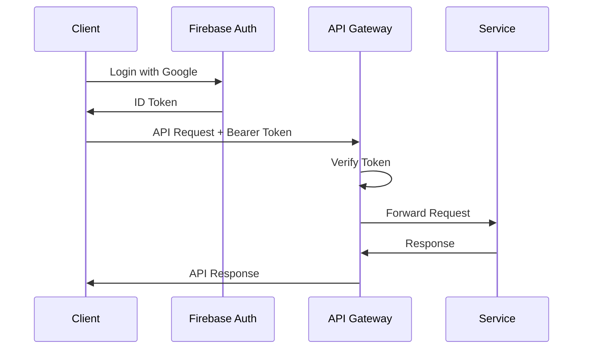
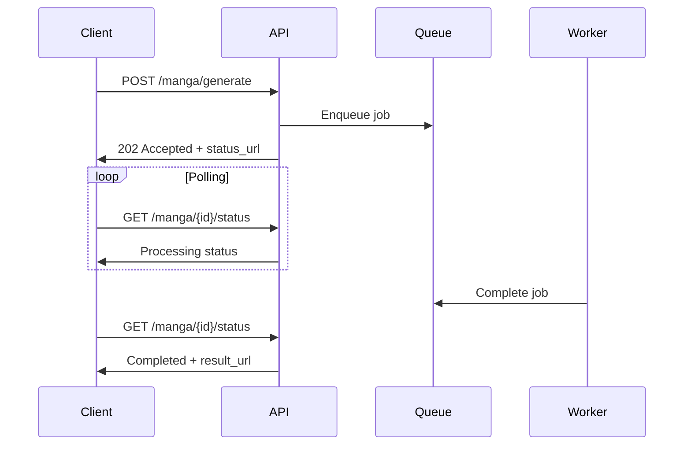
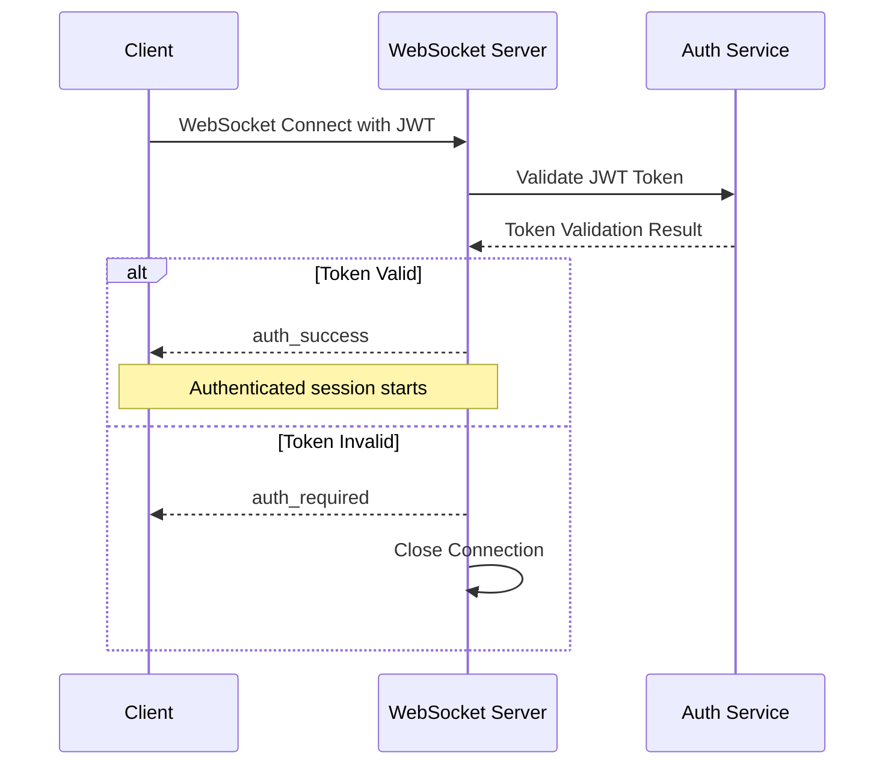

# API設計概要

> **TL;DR**: RESTful API基本方針とWebSocket統合仕様。HTTPS/JSON/Firebase認証、URLパスバージョニング、RFC7807エラー形式、統一エラー処理システム、レート制限（無料3作品/日）、非同期処理（ポーリング/Webhook）、WebSocket統合、APIバージョン管理で構成。

[← メインページへ戻る](README.md)

---

## 1. API設計方針

### 1.1 基本方針

| 項目 | 方針 |
|------|------|
| プロトコル | HTTPS (TLS 1.3) |
| データ形式 | JSON (UTF-8) |
| API形式 | RESTful |
| 認証方式 | Firebase Authentication |
| バージョニング | URLパス方式 |
| エラー形式 | RFC 7807 Problem Details |
| 非同期通知 | ポーリング + Webhook + WebSocket |

### 1.2 ベースURL設計原則

**環境別URL体系:**
- **本番環境**: セキュアなHTTPS接続での安定したAPIエンドポイント提供
- **ステージング環境**: 本番同等環境でのテスト実行とバリデーション
- **API バージョニング**: `/api/v1`形式での後方互換性確保と段階的移行サポート

### 1.3 共通ヘッダー

**リクエストヘッダー**
```http
Authorization: Bearer {firebase_id_token}
Content-Type: application/json
Accept: application/json
X-Request-ID: {uuid}
```

**レスポンスヘッダー**
```http
Content-Type: application/json
X-Request-ID: {uuid}
X-RateLimit-Limit: {limit}
X-RateLimit-Remaining: {remaining}
X-RateLimit-Reset: {timestamp}
```

---

## 2. 認証・認可

### 2.1 認証フロー



### 2.2 認可ルール

| ユーザータイプ | 権限 | レート制限 |
|---------------|------|-----------||
| 無料ユーザー | 読取・作成（制限付） | 3作品/日 |
| 有料ユーザー | 読取・作成・更新・削除 | 無制限 |
| 管理者 | 全権限 | 無制限 |

### 2.3 Firebase Custom Claims
```json
{
  "user_type": "free|premium|admin",
  "tier": "basic|pro|enterprise",
  "quota": {
    "daily_limit": 3,
    "monthly_limit": 90
  }
}
```

---

## 3. エラーハンドリング

### 3.1 HTTPステータスコード

| コード | 意味 | 使用場面 |
|--------|------|----------|
| 200 | OK | 正常な取得・更新 |
| 201 | Created | リソース作成成功 |
| 202 | Accepted | 非同期処理受付 |
| 204 | No Content | 削除成功 |
| 400 | Bad Request | バリデーションエラー |
| 401 | Unauthorized | 認証失敗 |
| 403 | Forbidden | 権限不足 |
| 404 | Not Found | リソース不存在 |
| 409 | Conflict | リソース競合 |
| 429 | Too Many Requests | レート制限超過 |
| 500 | Internal Server Error | サーバーエラー |
| 503 | Service Unavailable | メンテナンス中 |

### 3.2 統一エラー処理システム

全てのAPIエラーレスポンスは以下の統一フォーマットを使用します：

```typescript
interface APIErrorResponse {
  error: {
    code: string              // 統一エラーコード
    message: string           // ユーザー向けメッセージ
    details?: {              // 詳細情報（オプション）
      field?: string         // バリデーションエラー時のフィールド名
      constraint?: string    // 制約違反の詳細
      trace_id?: string     // トレースID（デバッグ用）
      context?: any         // エラーコンテキスト
    }
    timestamp: string        // ISO8601形式のタイムスタンプ
    path: string            // リクエストパス
  }
}
```

### 3.3 エラーコード体系

| カテゴリ | コード範囲 | HTTPステータス | 説明 | 例 |
|---------|-----------|---------------|-----|-----|
| **認証エラー** | AUTH_001-099 | 401 | 認証に関する問題 | AUTH_001: トークン無効 |
| **認可エラー** | AUTHZ_001-099 | 403 | アクセス権限に関する問題 | AUTHZ_001: アクセス拒否 |
| **バリデーション** | VALID_001-099 | 400 | 入力値検証エラー | VALID_001: 必須項目不足 |
| **レート制限** | RATE_001-099 | 429 | 利用制限に関する問題 | RATE_001: 日次上限到達 |
| **リソース** | RES_001-099 | 404 | リソース関連の問題 | RES_001: リソース未発見 |
| **サーバー** | SRV_001-099 | 500 | サーバー内部エラー | SRV_001: 内部サーバーエラー |
| **AI生成** | AI_001-099 | 502 | AI生成処理のエラー | AI_001: 生成API障害 |

---

## 4. レート制限

### 4.1 制限ルール

| エンドポイント | 無料ユーザー | 有料ユーザー |
|---------------|------------|------------|
| POST /manga/generate | 3/日 | 無制限 |
| GET /manga/* | 100/時 | 1000/時 |
| PUT/DELETE /manga/* | 10/時 | 100/時 |
| GET /user/* | 60/時 | 600/時 |

### 4.2 同時処理制限

| 制限項目 | 値 |
|---------|----- |
| 同時生成数/ユーザー | 1 |
| 同時API呼び出し数 | 10 |
| WebSocket同時接続数 | 3 |

### 4.3 レート制限ヘッダー

```http
X-RateLimit-Limit: 100
X-RateLimit-Remaining: 45
X-RateLimit-Reset: 1705756800
X-RateLimit-Resource: manga_generation
X-RateLimit-Used: 55
```

---

## 5. 非同期処理

### 5.1 ポーリング方式



### 5.2 Webhook通知

**Webhook リクエスト**
```json
{
  "event": "manga.completed",
  "timestamp": "ISO8601",
  "data": {
    "request_id": "uuid",
    "manga_id": "uuid",
    "status": "completed",
    "result_url": "https://api.manga-service.com/api/v1/manga/{id}"
  },
  "signature": "hmac-sha256-signature"
}
```

---

## 6. WebSocket統合仕様

### 6.1 接続エンドポイント

```
WSS /ws/v1/generation/{session_id}?token={jwt_token}
WSS /ws/v1/sessions/{session_id}/phases/{phase_number}?token={jwt_token}
WSS /ws/v1/global/user/{user_id}?token={jwt_token}
WSS /ws/v1/health
WSS /ws/v1/generation/{request_id}/progress?token={jwt_token}
```

**エンドポイント詳細:**
- `/generation/{session_id}` - マンガ生成セッション全体の通信
- `/sessions/{session_id}/phases/{phase_number}` - 特定フェーズの詳細通信
- `/global/user/{user_id}` - ユーザー全体のグローバル通知
- `/health` - WebSocketヘルスチェック（認証不要）
- `/generation/{request_id}/progress` - リアルタイム画像生成進捗

### 6.2 認証フロー



---

## 7. APIバージョニング

### 7.1 バージョン管理方針

| 項目 | 方針 |
|------|------|
| 形式 | URLパス (/api/v1/) |
| サポート期間 | 最新2バージョン |
| 廃止予告期間 | 6ヶ月 |
| 互換性 | 後方互換性維持 |

### 7.2 バージョン移行

```http
# 廃止予定の通知
Sunset: Sat, 31 Dec 2025 23:59:59 GMT
Deprecation: true
Link: <https://api.manga-service.com/api/v2/manga>; rel="successor-version"
```

### 7.3 変更管理

| バージョン | リリース日 | 主な変更 | サポート終了 |
|-----------|-----------|---------|------------|
| v1 | 2025-03-01 | 初期リリース | - |
| v2 | 2025-09-01 | GraphQL追加（予定） | - |

---

## 関連リンク

- [認証API](endpoints/auth-api.md)
- [漫画生成API](endpoints/generation-api.md)
- [データ管理API](endpoints/management-api.md)
- [データモデル・スキーマ](schemas/data-models.md)
- [OpenAPI仕様書](schemas/openapi.yaml)