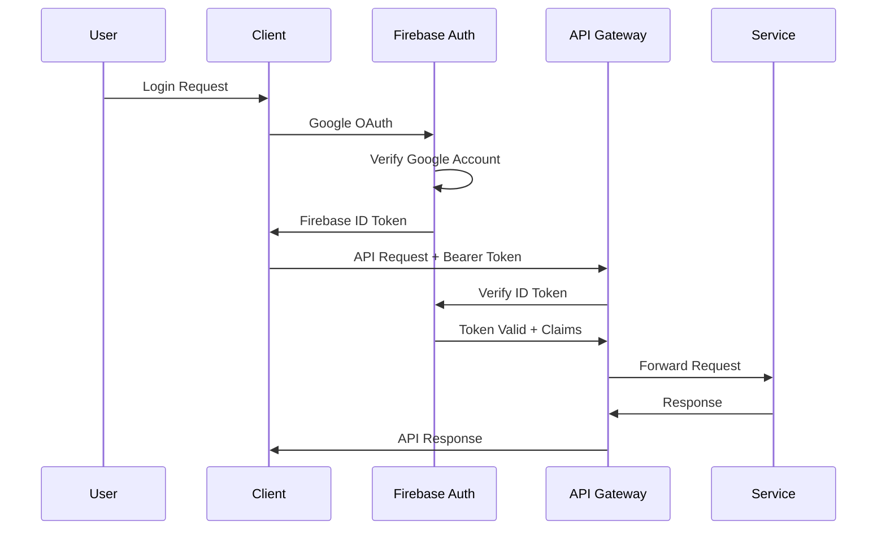

# 認証API

> **TL;DR**: Firebase Authentication基盤のJWTトークンベース認証システム。Google OAuthログイン、トークン更新・無効化、ユーザー情報取得で構成。アクセストークン1時間・リフレッシュトークン30日有効期限、HTTPS必須、レート制限（ログイン10回/分・更新60回/時）、5種類認証エラーコード体系。

[← メインページへ戻る](../README.md) | [← API概要](../api-overview.md)

---

## 概要

Firebase Authenticationを基盤としたJWTトークンベースの認証システムです。Google OAuth連携、トークン管理、ユーザー情報管理機能を提供します。

## 認証フロー



---

## エンドポイント一覧

| メソッド | エンドポイント | 説明 | 認証 |
|--------|------------|------|------|
| POST | `/api/v1/auth/google/login` | Google OAuthログイン | 不要 |
| POST | `/api/v1/auth/refresh` | アクセストークン更新 | 不要 |
| POST | `/api/v1/auth/logout` | ログアウト | 不要 |
| GET | `/api/v1/auth/me` | ユーザー情報取得 | 必須 |

---

## POST /api/v1/auth/google/login

Firebase ID Token を用いたGoogle OAuth認証

### リクエスト

```json
{
  "id_token": "string (Firebase ID Token)"
}
```

### レスポンス (200 OK)

```json
{
  "access_token": "string (JWT)",
  "refresh_token": "string (JWT)",
  "expires_in": 3600,
  "user": {
    "id": "string",
    "email": "string",
    "username": "string",
    "display_name": "string",
    "account_type": "free|premium|admin",
    "provider": "google",
    "is_active": true,
    "photo_url": "string (optional)",
    "created_at": "ISO8601",
    "last_login": "ISO8601"
  }
}
```

### エラーレスポンス (400 Bad Request)

```json
{
  "error": {
    "code": "AUTH_001",
    "message": "Firebase IDトークンが無効です",
    "details": {
      "field": "id_token",
      "constraint": "token_verification_failed"
    },
    "timestamp": "ISO8601",
    "path": "/api/v1/auth/google/login"
  }
}
```

---

## POST /api/v1/auth/refresh

JWT Refresh Token を用いたアクセストークン更新

### リクエスト

```json
{
  "refresh_token": "string"
}
```

### レスポンス (200 OK)

```json
{
  "access_token": "string (JWT)",
  "expires_in": 3600
}
```

### エラーレスポンス (401 Unauthorized)

```json
{
  "error": {
    "code": "AUTH_002",
    "message": "リフレッシュトークンが無効または期限切れです",
    "timestamp": "ISO8601",
    "path": "/api/v1/auth/refresh"
  }
}
```

---

## POST /api/v1/auth/logout

ログアウト（トークン無効化）

### リクエスト

```json
{
  "refresh_token": "string (optional)"
}
```

### レスポンス (200 OK)

```json
{
  "message": "Successfully logged out"
}
```

---

## GET /api/v1/auth/me

認証済みユーザー情報取得

### 認証
**必須**: Bearer Token

### レスポンス (200 OK)

```json
{
  "id": "string",
  "email": "string",
  "username": "string",
  "display_name": "string",
  "account_type": "free|premium|admin",
  "provider": "google|email",
  "firebase_claims": {
    "user_type": "free",
    "tier": "basic",
    "quota": {
      "daily_limit": 3,
      "monthly_limit": 90
    }
  },
  "is_active": true,
  "created_at": "ISO8601",
  "last_login_at": "ISO8601"
}
```

### エラーレスポンス (401 Unauthorized)

```json
{
  "error": {
    "code": "AUTH_003",
    "message": "認証トークンが必要です",
    "timestamp": "ISO8601",
    "path": "/api/v1/auth/me"
  }
}
```

---

## 認証エラーコード

| コード | 説明 | HTTPステータス |
|------|------|---------------|
| AUTH_001 | Firebase IDトークン無効 | 400 |
| AUTH_002 | リフレッシュトークン無効/期限切れ | 401 |
| AUTH_003 | 認証トークン不足 | 401 |
| AUTH_004 | ユーザーアカウント無効 | 403 |
| AUTH_005 | メール未認証 | 400 |

---

## セキュリティ考慮事項

### トークンセキュリティ
- **アクセストークン有効期間**: 1時間
- **リフレッシュトークン有効期間**: 30日
- **トークンローテーション**: アクセストークン期限切れ前の自動更新推奨

### HTTPS必須
- 全ての認証エンドポイントはHTTPS通信が必須
- TLS 1.3以上を推奨

### レート制限
- ログイン試行: 10回/分・IPアドレス
- トークン更新: 60回/時・ユーザー

---

## 関連リンク

- [漫画生成API](generation-api.md)
- [データ管理API](management-api.md)
- [データモデル](../schemas/data-models.md)
- [API概要](../api-overview.md)