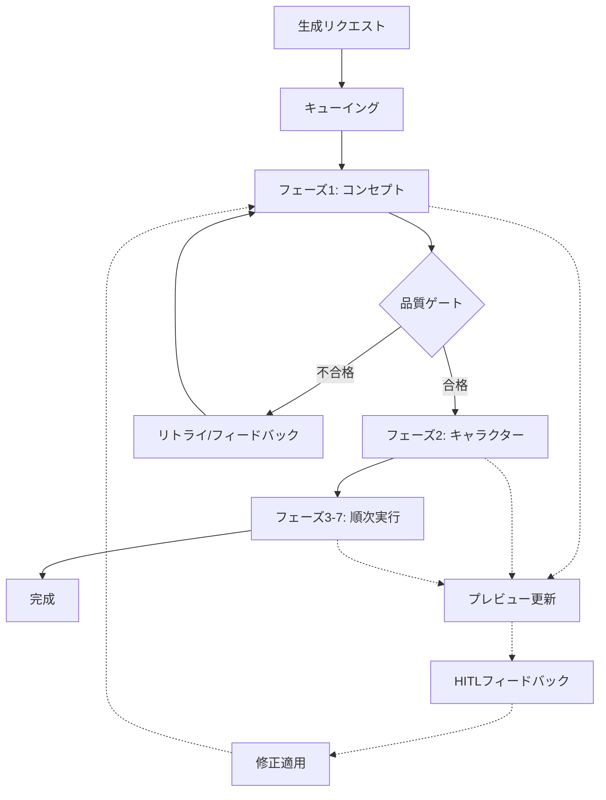

# 漫画生成API

> **TL;DR**: AI漫画生成の中核API仕様。生成制御（POST /generate）、進捗監視（GET /status, SSE /stream）、品質ゲート管理、画像生成進捗（WebSocket）、プレビューシステム（フェーズ別）、HITLフィードバック（自然言語・チャット）で構成。全体8-15分処理、最大5ワーカー並列実行。

[← メインページへ戻る](../README.md) | [← API概要](../api-overview.md)

---

## 概要

AI漫画生成の中核となるAPIです。テキストからの漫画生成、進捗監視、品質ゲート、HITLフィードバック、プレビューシステムを提供します。WebSocketとRESTful APIの組み合わせによりリアルタイム進捗通知と効率的な制御を実現します。

## 生成フロー



---

## エンドポイント一覧

### 生成制御
| メソッド | エンドポイント | 説明 | 認証 |
|--------|------------|------|------|
| POST | `/api/v1/manga/generate` | 生成開始 | 必須 |
| POST | `/api/v1/manga/test-generate` | テスト生成 | 必須 |
| POST | `/api/v1/manga/dev-generate` | 開発専用生成 | 必須 |

### 進捗監視
| メソッド | エンドポイント | 説明 | 認証 |
|--------|------------|------|------|
| GET | `/api/v1/manga/{request_id}/status` | 生成状態取得 | 必須 |
| GET | `/api/v1/manga/{request_id}/stream` | SSE進捗通知 | 必須 |
| GET | `/api/v1/generation/{request_id}/progress` | 画像生成進捗 | 必須 |

### 品質ゲート
| メソッド | エンドポイント | 説明 | 認証 |
|--------|------------|------|------|
| GET | `/api/v1/manga/{request_id}/quality-gate` | 品質ゲート状態 | 必須 |
| POST | `/api/v1/manga/{request_id}/phase/{phase}/quality-override` | 品質オーバーライド | 管理者 |
| GET | `/api/v1/quality/metrics` | 品質メトリクス | 必須 |
| GET | `/api/v1/quality/health` | 品質ゲートヘルス | 必須 |

---

## POST /api/v1/manga/generate

漫画生成リクエストを開始する

### リクエスト

```json
{
  "title": "string",
  "text": "string (max 50,000 chars)",
  "ai_auto_settings": true,
  "feedback_mode": {
    "enabled": true,
    "timeout_minutes": 30,
    "allow_skip": true
  },
  "options": {
    "priority": "normal|high",
    "webhook_url": "string (optional)",
    "auto_publish": "boolean"
  }
}
```

### レスポンス (202 Accepted)

```json
{
  "request_id": "uuid",
  "status": "queued",
  "estimated_completion_time": "ISO8601",
  "performance_mode": "monolithic",
  "expected_duration_minutes": 8,
  "status_url": "/api/v1/manga/{request_id}/status",
  "websocket_channel": "wss://api.manga-service.com/ws/session/{request_id}"
}
```

---

## GET /api/v1/manga/{request_id}/status

生成状態を取得する

### レスポンス (200 OK)

```json
{
  "request_id": "uuid",
  "status": "queued|processing|completed|failed",
  "current_module": 1,
  "total_modules": 8,
  "module_details": {
    "module_number": 1,
    "module_name": "phase1_concept",
    "status": "processing",
    "started_at": "ISO8601",
    "estimated_completion": "ISO8601",
    "progress_percentage": 45,
    "processing_mode": "in_memory"
  },
  "modules_history": [
    {
      "module_number": 1,
      "module_name": "phase1_concept",
      "status": "completed",
      "started_at": "ISO8601",
      "completed_at": "ISO8601",
      "duration_seconds": 25
    }
  ],
  "overall_progress": 12.5,
  "started_at": "ISO8601",
  "estimated_completion": "ISO8601",
  "result_url": "/api/v1/manga/{manga_id}"
}
```

---

## GET /api/v1/manga/{request_id}/stream

Server-Sent Events による進捗通知

### レスポンス (200 OK)

```
event: progress
data: {"module": 1, "status": "processing", "progress": 50}

event: module_complete
data: {"module": 1, "duration": 25, "next_module": 2}

event: phase_progress
data: {"phase": 1, "status": "processing", "progress": 50}

event: phase_complete
data: {"phase": 1, "duration": 10, "preview_url": "string", "next_phase": 2}

event: feedback_waiting
data: {"phase": 1, "preview_url": "string", "timeout": 1800, "feedback_url": "/api/v1/manga/{request_id}/feedback"}

event: feedback_applied
data: {"phase": 1, "modifications": ["story_pace_faster"], "retry_phase": true}

event: complete
data: {"manga_id": "uuid", "url": "/api/v1/manga/{manga_id}"}

event: error
data: {"error": "Processing failed", "phase": 4, "retry_available": true}
```

---

## 画像生成進捗API

### GET /api/v1/generation/{request_id}/progress

画像生成進捗を取得

#### レスポンス (200 OK)

```json
{
  "request_id": "uuid",
  "phase": 6,
  "phase_name": "phase5_scene",
  "progress": {
    "completed_images": 15,
    "total_images": 25,
    "percentage": 60.0,
    "current_batch": 4,
    "total_batches": 5
  },
  "parallel_status": {
    "active_workers": 3,
    "max_workers": 5,
    "queue_size": 2
  },
  "cache_performance": {
    "cache_hits": 8,
    "cache_misses": 17,
    "cache_hit_rate": 0.32
  },
  "estimated_completion": "ISO8601",
  "errors": [
    {
      "scene_id": "scene_12",
      "error_type": "api_timeout",
      "fallback_used": true,
      "timestamp": "ISO8601"
    }
  ]
}
```

### WebSocket /ws/generation/{request_id}/progress

リアルタイム画像生成進捗通知

#### メッセージ形式

```json
{
  "type": "image_progress",
  "data": {
    "completed": 16,
    "total": 25,
    "percentage": 64.0,
    "current_scene": {
      "scene_id": "scene_16",
      "description": "Character in forest setting",
      "status": "generating"
    },
    "timestamp": "ISO8601"
  }
}
```

---

## 品質ゲートAPI

### GET /api/v1/manga/{request_id}/quality-gate

品質ゲート状態を取得

#### レスポンス (200 OK)

```json
{
  "request_id": "uuid",
  "overall_status": "in_progress",
  "phases": [
    {
      "phase": 1,
      "agent_name": "plot_generation",
      "quality_score": 0.85,
      "status": "passed",
      "threshold": 0.70,
      "retry_count": 0,
      "max_retries": 3,
      "last_updated": "ISO8601"
    },
    {
      "phase": 2,
      "agent_name": "name_generation",
      "quality_score": 0.65,
      "status": "failed",
      "threshold": 0.70,
      "retry_count": 2,
      "max_retries": 3,
      "last_updated": "ISO8601"
    }
  ],
  "quality_report_url": "string"
}
```

### POST /api/v1/manga/{request_id}/phase/{phase}/quality-override

品質ゲート手動オーバーライド（管理者のみ）

#### リクエスト

```json
{
  "override_reason": "User feedback indicates acceptable quality",
  "admin_user_id": "uuid",
  "force_proceed": true
}
```

#### レスポンス (200 OK)

```json
{
  "phase": 2,
  "status": "override_approved",
  "override_by": "admin_user_id",
  "override_at": "ISO8601",
  "next_phase_started": true
}
```

---

## プレビューシステムAPI

### GET /api/v1/manga/{request_id}/preview/{phase}

フェーズ特化型プレビューデータを取得

#### クエリパラメータ

```
?quality_level=1-5
&version_id=uuid (optional)
&adaptive=true (optional)
```

#### レスポンス (200 OK)

```json
{
  "phase": 1,
  "version_id": "uuid",
  "timestamp": "ISO8601",
  "quality_level": 3,

  "data": {
    "concept": {
      "title": "物語のタイトル",
      "summary": "あらすじ",
      "keywords": ["友情", "成長", "冒険"]
    },
    "genre": {
      "primary": "日常系",
      "secondary": "コメディ",
      "subgenres": ["学園"]
    }
  },

  "interactive_elements": {
    "concept_editor": true,
    "genre_selector": true,
    "audience_adjuster": true
  },

  "preview_urls": {
    "thumbnail": "string",
    "full_preview": "string"
  }
}
```

### POST /api/v1/manga/{request_id}/preview/{phase}/apply-change

インタラクティブ変更を適用

#### リクエスト

```json
{
  "element_id": "concept.title",
  "change_type": "text_edit",
  "change_data": {
    "new_value": "新しいタイトル",
    "previous_value": "古いタイトル"
  },
  "apply_immediately": true,
  "create_branch": false
}
```

#### レスポンス (200 OK)

```json
{
  "version_id": "uuid",
  "branch_id": "uuid",
  "change_applied": true,
  "preview_updated": true,
  "preview_url": "string",
  "estimated_regeneration_time": 5
}
```

---

## HITLフィードバックAPI

### POST /api/v1/manga/{request_id}/feedback

各フェーズの結果に対してユーザーがフィードバックを送信

#### リクエスト

```json
{
  "phase": 1,
  "feedback_type": "natural_language|quick_option|skip",
  "content": {
    "natural_language": "もっと明るい雰囲気にして、コメディ要素を強くして",
    "quick_option": "make_brighter|more_serious|add_detail|simplify",
    "intensity": 0.7,
    "target_elements": ["story_pace", "character_mood"]
  }
}
```

#### レスポンス (200 OK)

```json
{
  "feedback_id": "uuid",
  "request_id": "uuid",
  "phase": 1,
  "status": "accepted",
  "parsed_modifications": [
    {
      "type": "mood_adjustment",
      "target": "story_atmosphere",
      "direction": "brighter",
      "intensity": 0.7
    },
    {
      "type": "element_addition",
      "target": "story_elements",
      "addition": "comedy",
      "intensity": 0.8
    }
  ],
  "estimated_modification_time": 45,
  "modification_url": "/api/v1/manga/{request_id}/modification/{feedback_id}/status"
}
```

### POST /api/v1/manga/{request_id}/chat

チャットインターフェース経由でのフィードバック送信

#### リクエスト

```json
{
  "phase": 1,
  "message": "キャラクターをもう一人追加して、主人公のライバルにしてください",
  "session_id": "chat_session_uuid",
  "message_type": "text|quick_action"
}
```

#### レスポンス (200 OK)

```json
{
  "message_id": "uuid",
  "phase": 1,
  "status": "processing",
  "interpreted_action": {
    "type": "character_addition",
    "parameters": {
      "role": "rival",
      "relationship": "antagonist"
    }
  },
  "preview_update": {
    "version_id": "uuid",
    "preview_url": "string"
  },
  "suggested_actions": [
    {"label": "性格を決める", "action": "define_personality"},
    {"label": "ビジュアルを調整", "action": "adjust_visual"},
    {"label": "関係性を設定", "action": "set_relationship"}
  ]
}
```

### POST /api/v1/manga/{request_id}/skip-feedback

フィードバックをスキップして次のフェーズに進む

#### リクエスト

```json
{
  "phase": 1,
  "skip_reason": "satisfied|time_constraint|default_acceptable"
}
```

#### レスポンス (200 OK)

```json
{
  "skipped_phase": 1,
  "next_phase": 2,
  "processing_resumed": true,
  "estimated_completion": "ISO8601"
}
```

---

## 生成エラーコード

| コード | 説明 | HTTPステータス |
|------|------|---------------|
| AI_001 | AI生成API障害 | 502 |
| AI_002 | 生成タイムアウト | 504 |
| AI_003 | コンテンツポリシー違反 | 400 |
| AI_004 | 品質基準未達 | 422 |
| AI_005 | リソース不足 | 503 |

---

## パフォーマンス情報

### 推定処理時間
- **フェーズ1-3**: 30-60秒
- **フェーズ4-5**: 60-120秒
- **フェーズ6（画像生成）**: 150-300秒
- **フェーズ7-8**: 30-90秒
- **全体**: 約8-15分

### 並列処理
- 画像生成における最大5ワーカー並列実行
- キャッシュヒット率30-60%で高速化
- 品質ゲートによる自動リトライ制御

---

## 関連リンク

- [認証API](auth-api.md)
- [データ管理API](management-api.md)
- [データモデル](../schemas/data-models.md)
- [WebSocket仕様](../api-overview.md#6-websocket統合仕様)