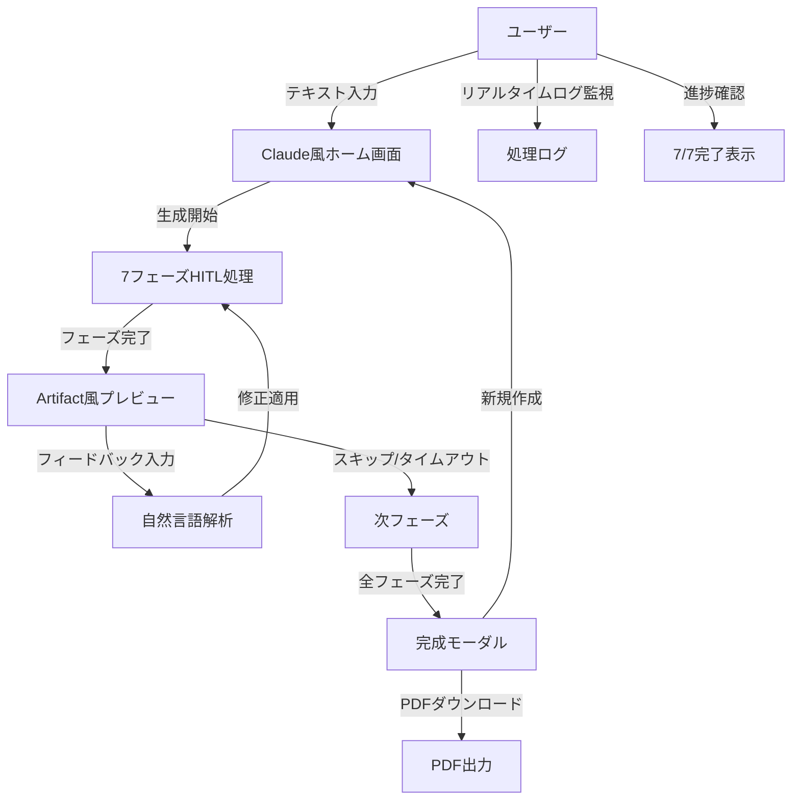
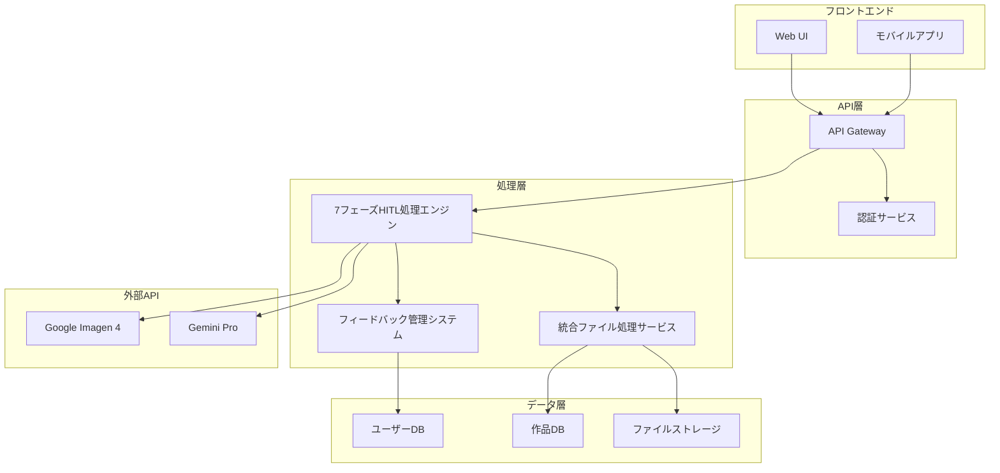
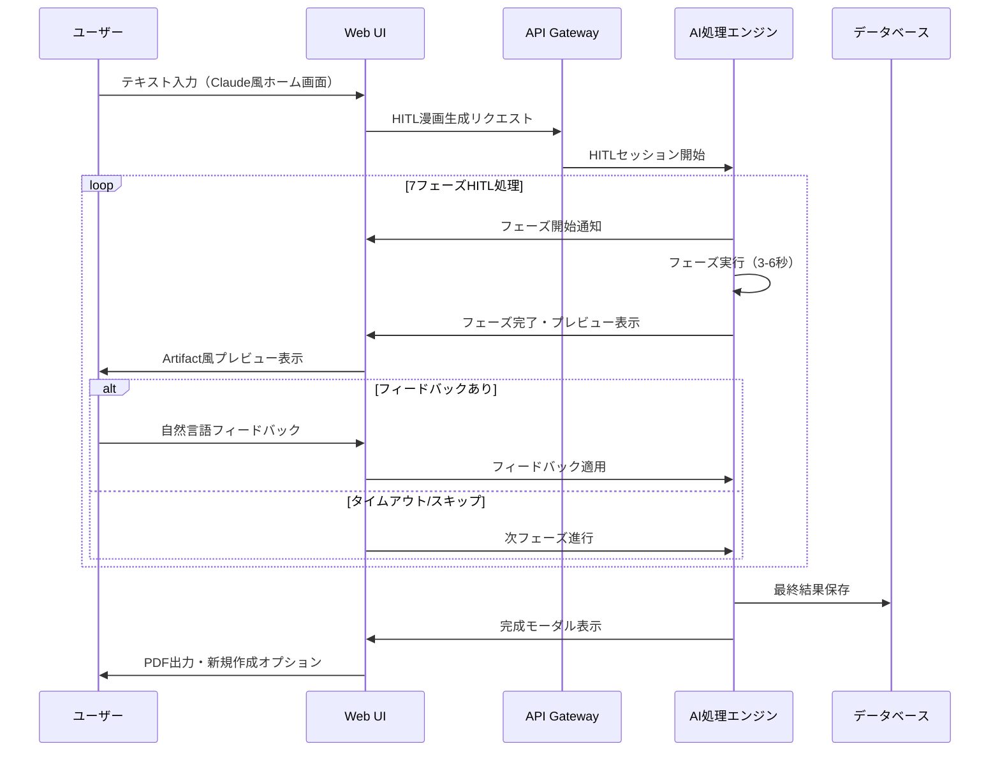

# AI漫画生成サービス 要件定義書

**文書管理情報**
- 文書ID: REQ-DOC-001
- 作成日: 2025-08-28
- 版数: 5.0
- 承認者: [承認者名]

## 目次

- [1. エグゼクティブサマリー](#1-エグゼクティブサマリー)
  - [プロジェクト概要](#プロジェクト概要)
  - [ビジネス価値と期待効果](#ビジネス価値と期待効果)
  - [主要なステークホルダー](#主要なステークホルダー)
  - [スコープと制約事項](#スコープと制約事項)
- [2. 機能要件](#2-機能要件)
  - [2.1 ユーザーストーリー](#21-ユーザーストーリー)
  - [2.2 機能一覧](#22-機能一覧)
    - [2.2.1 入力機能](#221-入力機能)
    - [2.2.2 処理機能](#222-処理機能)
    - [2.2.3 出力機能](#223-出力機能)
  - [2.3 ユースケース図](#23-ユースケース図)
- [3. 非機能要件](#3-非機能要件)
  - [3.1 性能要件](#31-性能要件)
  - [3.2 セキュリティ要件](#32-セキュリティ要件)
  - [3.3 可用性要件](#33-可用性要件)
- [4. 実装要件詳細](#4-実装要件詳細)
  - [4.1 機能要件マップ](#41-機能要件マップ)
  - [4.2 技術スタック要件](#42-技術スタック要件)
  - [4.3 実装依存関係](#43-実装依存関係)
  - [4.4 品質・パフォーマンス制約](#44-品質パフォーマンス制約)
  - [4.5 実装優先度マトリクス](#45-実装優先度マトリクス)
- [5. システムアーキテクチャ](#5-システムアーキテクチャ)
  - [5.1 システム構成図](#51-システム構成図)
  - [5.2 データフロー図](#52-データフロー図)
  - [5.3 技術スタック](#53-技術スタック)
- [6. 制約事項とリスク](#6-制約事項とリスク)
  - [6.1 技術的制約](#61-技術的制約)
  - [6.2 ビジネス制約](#62-ビジネス制約)
  - [6.3 リスク評価マトリクス](#63-リスク評価マトリクス)
- [7. 用語集と略語一覧](#7-用語集と略語一覧)
  - [用語集](#用語集)
  - [略語一覧](#略語一覧)
- [改訂履歴](#改訂履歴)

---

## 1. エグゼクティブサマリー

### プロジェクト概要
小説や自己啓発本から完全自動で長編漫画を生成するAIサービス。テキスト入力のみで高品質な漫画コンテンツを制作可能。

### ビジネス価値と期待効果
- **市場機会**: 創作スキルのない層への漫画制作サービス提供
- **収益予測**: サブスクリプション及び従量課金モデル
- **差別化要因**: 業界初の完全自動化による圧倒的利便性

### 主要なステークホルダー
- **プライマリユーザー**: アマチュア作家、コンテンツクリエイター
- **技術パートナー**: Google Cloud Platform
- **競合**: Midjourney、ComicAI（半自動ツール）

### スコープと制約事項
- **対象**: 日本語テキストからの漫画生成（初期フェーズ）
- **制約**: Google統合スタック必須、著作権フィルタリング必要
- **除外**: リアルタイム生成、動画形式出力（将来フェーズ）

---

## 2. 機能要件

### 2.1 ユーザーストーリー

| ID | ユーザー種別 | 機能 | 価値 |
|---|---|---|---|
| US-001 | アマチュア作家 | テキストから漫画を自動生成 | 絵画スキル不要で作品化 |
| US-002 | コンテンツクリエイター | SNS投稿用漫画作成 | 効率的なコンテンツ制作 |
| US-003 | 全ユーザー | 作品管理・編集 | 継続的な創作活動支援 |
| US-004 | 全ユーザー | 各段階での自然言語による修正指示 | 理想的な作品への調整 |
| US-005 | 全ユーザー | 段階的なプレビューと確認 | 期待通りの結果への誘導 |

### 2.2 機能一覧

#### 2.2.1 入力機能

**要件ID**: REQ-FNC-001  
**要件名**: テキスト入力システム  
**説明**: ユーザーはプレーンテキストまたは構造化テキストを入力可能  
**優先度**: Must  
**受入条件**: 
- 最大50,000文字の入力対応
- UTF-8エンコーディング対応
- 構造化マークアップ（章、節）の自動認識

**要件ID**: REQ-FNC-002  
**要件名**: AI自動設定システム  
**説明**: AIがテキスト内容を分析して適切なスタイル、ページ数、キャラクター数を自動決定  
**優先度**: Must  
**受入条件**: 
- テキスト解析による適切なスタイル自動選択
- 内容量に応じた適切なページ数自動決定
- ストーリー分析による必要キャラクター数自動設定

#### 2.2.2 処理機能

**要件ID**: REQ-FNC-003  
**要件名**: 7段階HITL処理システム  
**説明**: Human-in-the-loop機能を組み込んだ7段階フェーズによる漫画生成  
**優先度**: Must  
**受入条件**: 
- 各フェーズでの中間結果表示と自然言語フィードバック機能
- Phase 1: コンセプト・世界観分析Agent（12秒以内） - 入力テキストから物語のコンセプト・テーマ・ジャンル・ターゲット読者層・世界観を決定
  - プレビュー: テーマ、ジャンル、世界観、対象読者層の可視化
  - チャット修正: テーマ修正、ジャンル変更、世界観調整、雰囲気変更
- Phase 2: キャラクター設定・簡易ビジュアル生成Agent（18秒以内） - Phase1結果を基にキャラクター詳細設定・簡易ビジュアル生成（1-2枚の参考画像）
  - プレビュー: キャラクタービジュアル、性格設定、関係性図
  - チャット修正: キャラ追加/削除、性格変更、ビジュアル調整、関係性修正
- Phase 3: プロット・ストーリー構成Agent（15秒以内） - 詳細なプロット・ストーリー構成作成（3幕構成）
  - プレビュー: 3幕構成図、起承転結、感情曲線グラフ
  - チャット修正: プロット変更、ペーシング調整、クライマックス修正
- Phase 4: ネーム生成Agent（20秒以内） - コマ割り設計・シーン詳細指示・カメラアングル・演出指示（Phase1の世界観情報を活用）
  - プレビュー: コマ割りレイアウト、構図プレビュー、演出指示
  - チャット修正: コマ割り変更、構図調整、演出修正、セリフ位置変更
- Phase 5: シーン画像生成Agent（25秒以内） - コマごとのシーン画像を並列生成（Imagen 4使用）
  - プレビュー: 生成画像ギャラリー、スタイル確認パネル
  - チャット修正: 画像再生成、スタイル変更、品質向上、色調整
- Phase 6: セリフ配置Agent（4秒以内） - 吹き出し・セリフ・効果音の配置最適化
  - プレビュー: セリフバブル配置、フォント表示、効果音配置
  - チャット修正: セリフ位置調整、フォント変更、効果音追加/削除
- Phase 7: 最終統合・品質調整Agent（3秒以内） - 最終品質チェック・統合処理・出力
  - プレビュー: 最終ページプレビュー、全体構成確認
  - チャット修正: 最終調整、フォーマット選択、品質設定
- 全フェーズ合計97秒以内処理完了（キャッシュ活用で70秒まで短縮可能）
- 各フェーズ最大30分のフィードバック待機時間
- Phase1の世界観情報は全フェーズで参照可能な設計

**要件ID**: REQ-FNC-004  
**要件名**: 品質ゲート管理  
**説明**: 各Agentで品質判定を実行し、基準未達時は再生成  
**優先度**: Must  
**受入条件**: 
- 各Agent 70%以上の品質スコア（MVP基準）
- 最大3回の再試行
- 詳細な品質レポート生成

#### 2.2.3 出力機能

**要件ID**: REQ-FNC-005  
**要件名**: 漫画出力システム  
**説明**: 複数フォーマットでの漫画出力機能  
**優先度**: Must  
**受入条件**: 
- PDF形式（印刷用）出力
- WebP形式（Web用）出力
- 300dpi解像度保証

**要件ID**: REQ-FNC-006  
**要件名**: インタラクティブビューアー  
**説明**: ブラウザ上での漫画閲覧機能  
**優先度**: Should  
**受入条件**: 
- ページめくり機能
- ズーム・パン操作
- モバイル対応

**要件ID**: REQ-FNC-007  
**要件名**: HITLプレビューシステム  
**説明**: 各フェーズの成果物をリアルタイムでプレビュー表示  
**優先度**: Must  
**受入条件**: 
- フェーズ別専用プレビューコンポーネント
- インタラクティブ編集機能（ドラッグ&ドロップ、テキスト編集）
- バージョン管理（無制限履歴、60日保持）
- 品質レベル自動調整（デバイス性能に応じた5段階）
- WebSocket経由のリアルタイム更新

**要件ID**: REQ-FNC-008  
**要件名**: チャットベースフィードバックシステム  
**説明**: 自然言語でのフィードバック入力と修正指示  
**優先度**: Must  
**受入条件**: 
- 自然言語処理によるフィードバック解析（Gemini Pro使用）
- クイックアクションボタン（よく使う修正オプション）
- フィードバック履歴管理
- タイムアウト機能（30分後自動スキップ）
- リアルタイムチャット通信（WebSocket使用）

**要件ID**: REQ-FNC-007  
**要件名**: 画像生成並列処理システム  
**説明**: Phase 6での画像生成処理の並列化による高速化  
**優先度**: Should  
**受入条件**: 
- 3-5枚の画像を同時生成可能
- 画像生成時間を60-70%短縮（6秒→2秒以内）
- シーン類似度に基づく最適化キャッシング
- 生成進捗のリアルタイム表示
- エラー発生時の部分回復機能
- 並列度の動的調整（システム負荷に応じて）

**要件ID**: REQ-FNC-008  
**要件名**: リアルタイムフィードバックシステム（HITL）  
**説明**: 各フェーズ完了時にユーザーが自然言語により修正指示を行える機能  
**優先度**: Must  
**受入条件**: 
- 各フェーズ完了時の結果プレビュー表示（Claude Artifact風UI）
- 自然言語入力による修正指示（例：「キャラクター名をもっと印象的に」）
- 30秒のフィードバックタイムアウト機能
- AI応答によるフィードバック反映の確認
- フィードバックスキップ機能

**要件ID**: REQ-FNC-008  
**要件名**: 修正履歴管理  
**説明**: ユーザーの修正指示と結果を記録・管理する機能  
**優先度**: Should  
**受入条件**: 
- 修正前後の状態保存
- undo/redo機能
- 修正履歴の可視化

### 2.3 ユースケース図



---

## 3. 非機能要件

### 3.1 性能要件

**要件ID**: REQ-NFR-001  
**要件名**: 処理時間制限（HITLモード）  
**説明**: 各フェーズは高速処理、全体は3-5分で完了（フィードバック時間除く）  
**根拠**: 実装済みモックでの検証結果  
**受入条件**: 
- フェーズ1: テキスト解析（3秒）
- フェーズ2-7: 各3-6秒での高速処理
- 全フェーズ合計: 97秒以内（標準版）/ 70秒以内（キャッシュ活用版）（フィードバック待機時間除く）
- リアルタイムログ表示とタイムスタンプ

**要件ID**: REQ-NFR-002  
**要件名**: 同時処理能力（HITL対応）  
**説明**: 10ユーザーの同時処理をサポート（HITLセッション管理含む）  
**根拠**: ハッカソンデモでの現実的な同時処理数  
**受入条件**: 
- 10並行HITLセッションでの安定動作
- セッション状態管理（各フェーズ30秒のフィードバックタイムアウト）
- EventTarget設計による疎結合アーキテクチャ
- 基本的なオートスケーリング（最大10インスタンス）

### 3.2 セキュリティ要件

**要件ID**: REQ-NFR-003  
**要件名**: データ保護  
**説明**: ユーザーデータの暗号化と安全な保存  
**根拠**: 個人情報保護法準拠  
**受入条件**: 
- 保存時暗号化（AES-256）
- 転送時暗号化（TLS 1.3）
- アクセスログ記録

**要件ID**: REQ-NFR-004  
**要件名**: コンテンツフィルタリング  
**説明**: 不適切コンテンツの基本的な検出・除外  
**根拠**: ハッカソンデモでの安全性確保  
**受入条件**: 
- 暴力・性的表現の基本検出（60%以上）
- 明らかに不適切なコンテンツの除外
- 簡単な管理者確認

### 3.3 可用性要件

**要件ID**: REQ-NFR-005  
**要件名**: システム稼働率  
**説明**: 90%以上の可用性を保証（MVP基準）  
**根拠**: ハッカソンデモ期間での現実的な稼働目標  
**受入条件**: 
- デモ期間中の基本機能稼働
- 簡単な稼働確認
- 必要時のみバックアップ

---

## 4. 実装要件詳細

### 4.1 機能要件マップ

#### Core Features

##### 統合漫画生成システム（モノリシック7フェーズ）
- **Phase 1**: コンセプト・世界観分析Agent → 12秒処理
- **Phase 2**: キャラクター設定・簡易ビジュアル生成Agent → 18秒処理
- **Phase 3**: プロット・ストーリー構成Agent → 15秒処理
- **Phase 4**: ネーム生成Agent → 20秒処理（Phase1の世界観情報を活用）
- **Phase 5**: シーン画像生成Agent → 25秒処理（Imagen 4使用）
- **Phase 6**: セリフ配置Agent → 4秒処理
- **Phase 7**: 最終統合・品質調整Agent → 3秒処理
- **合計処理時間**: 97秒

##### Human-in-the-Loop（HITL）フィードバック機能
- **各フェーズ完了後**: 30秒のユーザーフィードバック待機
- **フィードバック形式**: 自然言語入力・クイックオプション・スキップ機能
- **リアルタイム適用**: WebSocket経由での即時修正反映
- **修正対象**: コンセプト・ジャンル・キャラクター設定・プロット・画像品質等

##### 品質ゲートシステム
- **品質スコア管理**: 各フェーズで0.70以上の品質閾値
- **自動リトライ**: 最大3回までの品質向上再試行
- **管理者オーバーライド**: 品質閾値の手動承認機能

#### Preview System Features

##### フェーズ特化型プレビューシステム
- **Phase1プレビュー**: コンセプト・世界観分析結果（テーマ・ジャンル・対象読者・世界観）のインタラクティブ編集
- **Phase2プレビュー**: キャラクター設定（詳細設定・ビジュアル選択・関係性グラフ）の編集
- **Phase3プレビュー**: プロット・ストーリー構成（3幕構成・感情曲線）のドラッグ&ドロップ調整
- **Phase4プレビュー**: ネーム生成（コマサイズ・配置・レイアウト・演出指示）のリサイズ・ドラッグ機能
- **Phase5プレビュー**: シーン画像生成結果の選択・スタイル調整・品質向上
- **Phase6プレビュー**: セリフ配置（吹き出し・効果音）位置のテキスト編集・ドラッグ機能
- **Phase7プレビュー**: 最終統合（ページ順序・出力設定）の調整

##### アダプティブ品質システム
- **5段階品質レベル**: ULTRA_LOW(1) → ULTRA_HIGH(5)
- **デバイス性能検出**: メモリ・CPU・画面解像度・ネットワーク速度
- **自動品質調整**: デバイス能力×ネットワーク状況による最適化
- **ユーザー設定**: 手動品質選択・自動適応ON/OFF

##### ブランチ型バージョン管理
- **バージョンブランチ**: 親子関係を持つツリー構造での履歴管理
- **比較機能**: サイドバイサイド・オーバーレイ・差分ハイライト
- **復元機能**: 特定バージョンへの巻き戻し・新ブランチ作成
- **品質追跡**: 各バージョンの品質スコア記録

### 4.2 技術スタック要件

#### Backend Requirements

##### アプリケーション基盤
- **言語**: Python 3.11
- **フレームワーク**: FastAPI + Pydantic
- **アーキテクチャ**: モノリシックサービス（単一コンテナ）
- **コンテナサイズ**: 8 vCPU, 32GB RAM
- **処理時間制限**: 600秒（10分）

##### AI API統合
- **Google Gemini Pro**: テキスト処理（Phase 1-4, 6-7）
- **Google Imagen 4**: 画像生成（Phase 2, 5）
- **API制限管理**: Redis カウンターによる日次制限追跡
- **エラーハンドリング**: 指数バックオフによる3回リトライ

##### データベース
- **メインDB**: PostgreSQL 15（Cloud SQL）
- **スキーマ**: users, manga_projects, generation_requests, phase_executions, feedback_requests, preview_versions等
- **パーティション**: api_usage_logs の月次パーティション
- **インデックス**: 複合インデックス・GINインデックス・部分インデックス

##### キャッシュ・セッション管理
- **Redis**: Memory Store for Redis（1GB Basic tier）
- **用途**: WebSocketセッション・APIレート制限・プレビュー一時データ
- **TTL設定**: リクエストメタデータ24時間・セッション1時間

##### プレビューシステム技術要件
- **データ構造**: フェーズ特化型TypeScript Interface
- **リアルタイム更新**: WebSocket + デバウンス処理（300ms）
- **品質レンダリング**: 品質レベル別の段階的コンテンツ生成
- **バージョン管理**: データベース + Cloud Storage のハイブリッド

#### Frontend Requirements

##### フロントエンド基盤
- **フレームワーク**: Next.js 14（App Router）
- **言語**: TypeScript
- **スタイリング**: Tailwind CSS + CSS Variables
- **状態管理**: React Context + Custom Hooks

##### UI/UXデザインシステム
- **デザイン哲学**: Genspark風モダンデザイン
- **カラー**: ダークモード基調（#1a1a1a背景）
- **レイアウト**: 左右分割（左:リアルタイムログ、右:プレビュー）
- **入力**: Claudeライク単一入力欄
- **テーマ**: ダークモード標準・ライトモード補助

##### インタラクティブ機能
- **リアルタイム通信**: WebSocket接続・Custom Event システム
- **プレビューエディタ**: ドラッグ&ドロップ・リサイズ・テキスト編集
- **フィードバックUI**: 自然言語入力・クイックオプション・スキップボタン
- **進捗表示**: リアルタイムプログレスバー・フェーズ別詳細

#### Infrastructure Requirements

##### クラウドインフラ（GCP）
- **コンピューティング**: Cloud Run（serverless）
- **ネットワーク**: VPC（manga-service-vpc）+ Direct VPC Egress
- **ストレージ**: Cloud Storage（4バケット構成）+ CDN
- **監視**: Cloud Monitoring + Cloud Logging

##### セキュリティ
- **認証**: Firebase Authentication + JWT
- **認可**: カスタムClaims + Row Level Security
- **データ暗号化**: TLS 1.3 + AES-256
- **Secret管理**: Secret Manager

### 4.3 実装依存関係

#### Critical Path Dependencies

##### システム基盤構築（Phase 1）
```
1. インフラ基盤 → データベース → Redis
   ├─ Cloud Run環境構築
   ├─ PostgreSQL Cloud SQL セットアップ
   ├─ Memory Store Redis インスタンス
   └─ Cloud Storage バケット設定

2. 認証システム → ユーザー管理
   ├─ Firebase Authentication統合
   ├─ JWT トークン検証
   └─ ユーザーロール管理

3. 基本APIフレームワーク → エラーハンドリング
   ├─ FastAPI基盤構築
   ├─ 統一エラー処理システム
   └─ ログ・監視システム
```

##### コア機能実装（Phase 2）
```
1. 7フェーズエンジン構築
   Phase1（コンセプト分析） → Phase2（キャラビジュアル） → 
   Phase3（プロット構成） → Phase4（ネーム生成） → 
   Phase5（画像生成） → Phase6（セリフ配置） → 
   Phase7（最終統合）

2. プレビューシステム基盤
   ├─ フェーズ特化型データ構造
   ├─ 品質レベル判定システム
   └─ CDN キャッシュ戦略

3. HITL フィードバックシステム
   ├─ WebSocket リアルタイム通信
   ├─ フィードバック解析・適用
   └─ 30秒タイムアウト処理
```

##### プレビューシステム（Phase 3）
```
1. インタラクティブプレビュー機能
   ├─ リアルタイム編集機能
   ├─ ドラッグ&ドロップ処理
   └─ デバウンス処理（300ms）

2. バージョン管理システム
   ├─ ブランチ型データ構造
   ├─ 比較・差分表示
   └─ 復元機能

3. アダプティブ品質システム
   ├─ デバイス性能検出
   ├─ 自動品質調整
   └─ 段階的レンダリング
```

#### Parallel Implementation Opportunities

##### 並行実装可能領域

**フロントエンド並行作業**:
```
Group A: 基本UI実装
├─ デザインシステム構築
├─ コンポーネントライブラリ
└─ レスポンシブレイアウト

Group B: インタラクション実装  
├─ WebSocket クライアント
├─ リアルタイム状態管理
└─ フィードバックUI

Group C: プレビューシステム
├─ インタラクティブエディタ
├─ バージョン比較UI
└─ 品質調整インターフェース
```

**バックエンド並行作業**:
```
Group A: 基盤システム
├─ データベースマイグレーション
├─ Redis セッション管理
└─ ログ・監視システム

Group B: AI統合システム
├─ Google AI APIクライアント
├─ プロンプト管理システム
└─ エラー・リトライ処理

Group C: プレビューバックエンド
├─ CDN キャッシュシステム
├─ バージョン管理API
└─ 品質評価システム
```

### 4.4 品質・パフォーマンス制約

#### Performance Constraints

##### 処理時間制約
- **全体処理時間**: 8分目標・10分最大（600秒）
- **フェーズ別目標**: Phase5（40秒）が最長・他は6-12秒
- **フィードバック応答**: 300ms以内のデバウンス処理
- **プレビュー生成**: 5秒以内の初期表示・段階的品質向上

##### システムパフォーマンス
- **同時処理数**: 100リクエスト並行処理
- **スループット**: 500req/hour目標
- **API応答時間**: <100ms（キャッシュ利用時）
- **WebSocket接続**: 最大1000同時接続

##### リソース制約
- **メモリ使用量**: 32GB RAM（単一コンテナ）
- **CPU使用率**: 8 vCPU・80%閾値でスケールアウト
- **ストレージ**: 100GB初期・500GB上限の自動拡張
- **ネットワーク**: VPC内部通信・Direct VPC Egress

#### Quality Gates

##### 品質ゲート定義
- **コード品質**: 単体テストカバレッジ 85%以上
- **パフォーマンス**: Core Web Vitals全項目グリーン
- **セキュリティ**: OWASP Top 10 対策完備
- **アクセシビリティ**: WCAG 2.1 AA準拠

##### AI生成品質管理
- **品質スコア閾値**: 各フェーズ0.70以上
- **リトライ上限**: 最大3回までの自動再試行
- **フォールバック**: エラー時のプレースホルダー生成
- **キャッシュ活用**: 類似コンテンツの85%類似度マッチング

##### プレビューシステム品質
- **レンダリング品質**: デバイス性能に応じた5段階調整
- **インタラクション応答**: 100ms以内の操作フィードバック
- **バージョン管理**: 無制限履歴・60日保持期間
- **CDN配信**: 全世界1秒以内のプレビュー表示

### 4.5 実装優先度マトリクス

#### 🔴 Critical（必須・最優先）
1. **基盤システム**: インフラ・DB・認証（Week 1-2）
2. **7フェーズエンジン**: コア漫画生成ロジック（Week 3-6）
3. **基本プレビューシステム**: テキストベース表示（Week 4-5）
4. **HITL基本機能**: フィードバック受付・適用（Week 5-6）

#### 🟡 Important（重要・次優先）
1. **インタラクティブプレビュー**: リアルタイム編集機能（Week 7-9）
2. **品質アダプティブシステム**: デバイス性能対応（Week 8-9）
3. **バージョン管理**: 履歴・比較機能（Week 10-11）
4. **UI/UXポリッシュ**: Genspark風デザイン完成（Week 9-12）

#### 🟢 Optional（補助・将来実装）
1. **高度なアニメーション**: マイクロインタラクション
2. **オフライン対応**: Progressive Web App化
3. **多言語対応**: 国際化対応
4. **ソーシャル機能**: 作品共有・コメント機能

---

## 5. システムアーキテクチャ

### 5.1 システム構成図



### 5.2 データフロー図



### 5.3 技術スタック

| レイヤー | 技術 | 理由 |
|---------|------|------|
| フロントエンド | HTML/CSS/JavaScript (Claude風UI) | HITLプロトタイプ実装済み |
| API | Python, FastAPI | AI処理との親和性、HITL対応 |
| HITL処理 | EventTarget, CustomEvent | リアルタイムフィードバック対応 |
| UI設計 | Claude Artifact風分割画面 | ユーザビリティ向上 |
| データベース | Cloud SQL (PostgreSQL) | セッション・フィードバック管理 |
| ストレージ | Google Cloud Storage | 漫画ファイル・プレビュー管理 |
| AI API | Google Imagen 4, Gemini Pro | 高品質生成AI |
| インフラ | Google Cloud Platform | 統合クラウド環境 |

---

## 6. 制約事項とリスク

### 6.1 技術的制約

| 項目 | 制約内容 | 影響 |
|------|----------|------|
| API制限 | Google AI API 1日1,000リクエスト（MVP基準） | 同時ユーザー数制限 |
| 処理能力 | 単一処理に最大8GB RAM（MVP基準） | 基本スケーリング |
| ファイルサイズ | 出力PDF最大100MB | 長編作品制限 |

### 6.2 ビジネス制約

| 項目 | 制約内容 | 対策 |
|------|----------|------|
| 著作権 | 既存作品の類似性チェック必要 | AI検出システム導入 |
| 利用料金 | Google API従量課金 | 適切な課金モデル設計 |
| 法的責任 | 生成コンテンツの責任範囲 | 利用規約での明確化 |

### 6.3 リスク評価マトリクス

| リスク | 影響度 | 発生確率 | 対策 |
|--------|--------|----------|------|
| AI API障害 | 高 | 中 | 冗長化・代替API準備 |
| 著作権侵害 | 高 | 低 | 事前フィルタリング強化 |
| 処理性能劣化 | 中 | 中 | 監視・自動スケーリング |

---

## 7. 用語集と略語一覧

### 用語集

| 用語 | 定義 |
|------|------|
| HITLフェーズ | Human-in-the-loopによる7段階処理フェーズ |
| Claude風UI | Claudeのダークテーマを参考にしたシンプルチャット画面 |
| Artifact風プレビュー | Claude Artifactの左右分割レイアウトを参考にした表示 |
| フィードバックタイムアウト | 各フェーズでの30秒間のユーザー応答待ち時間 |
| 品質ゲート | 各処理段階での品質基準チェックポイント |
| コマ割り | 漫画ページの構成・レイアウト設計 |
| フィジビリティ | 技術的・事業的実現可能性 |
| HITL | Human-in-the-loop（人間参加型AI）|
| 自然言語フィードバック | ユーザーが普通の言葉で修正指示を行うこと |

### 略語一覧

| 略語 | 正式名称 |
|------|----------|
| AI | Artificial Intelligence |
| API | Application Programming Interface |
| UI | User Interface |
| UX | User Experience |
| SLA | Service Level Agreement |
| PDF | Portable Document Format |
| TLS | Transport Layer Security |
| UTF-8 | 8-bit Unicode Transformation Format |

---

## 改訂履歴

| 版数 | 日付 | 変更内容 | 担当者 |
|------|------|----------|--------|
| 1.0 | 2025-01-15 | 初版作成 | [担当者名] |
| 2.0 | 2025-01-20 | 構造改善・要件ID付与 | Claude Code |
| 3.0 | 2025-08-24 | HITL機能統合・7段階処理への変更 | Claude Code |
| 4.0 | 2025-08-24 | 実装済みClaud風UI・7フェーズHITL反映 | Claude Code |
| 5.0 | 2025-08-28 | Implementation_Requirements_Analysis.md統合・実装要件詳細追加 | Claude Code |

---

**文書承認**
- 技術責任者: [署名] 日付: [日付]
- プロダクトマネージャー: [署名] 日付: [日付]
- プロジェクトマネージャー: [署名] 日付: [日付]