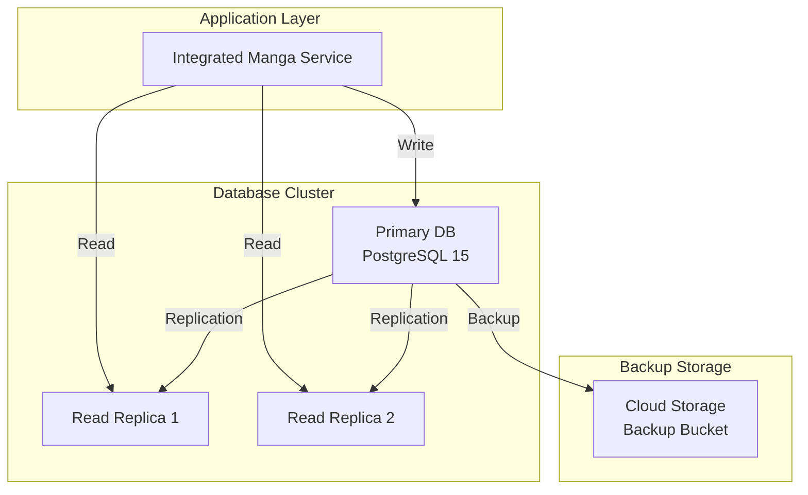

# データベース設計書

> **TL;DR**: PostgreSQL 15ベースのデータベース設計仕様書。スキーマ設計、マイグレーション戦略、パフォーマンス最適化の3文書で構成。リードレプリカ構成、月次パーティショニング、PITR+日次バックアップによる高可用性とパフォーマンスを実現。

## 📖 概要

AI漫画生成サービスのデータベース設計書です。本ドキュメントは以下の4つのファイルに分割されています。

## 📋 文書構成

### [schema-design.md](./schema-design.md)
**スキーマ設計（YAML設計）**
- データベース概要と設計方針
- システム構成図
- ER図とテーブル定義（YAMLスキーマ）
- 関係性とインデックス設計

### [migration-strategy.md](./migration-strategy.md)
**マイグレーション戦略（YAML設計）**
- マイグレーション実行方針
- バージョン管理とロールバック戦略
- 環境別デプロイメント手順（YAML定義）
- データライフサイクル管理

### [performance-optimization.md](./performance-optimization.md)
**パフォーマンス最適化（YAML設計）**
- クエリ最適化戦略
- インデックス設計詳細（YAML定義）
- 接続管理とキャッシュ戦略
- 読み書き負荷分散

### セキュリティとガバナンス
**データベースセキュリティ設計** → [セキュリティ設計書](../08-security/README.md)で詳細管理

## 🏗️ システム構成概要

## 📊 設計方針サマリー

| 項目 | 方針 | 理由 |
|------|------|------|
| DBMS | PostgreSQL 15 | JSONB、フルテキスト検索、高い拡張性 |
| データ保存期間 | 無料:30日、有料:無期限 | コスト最適化とサービス差別化 |
| メタデータ管理 | JSONB型で柔軟に保存 | スキーマ変更への対応力 |
| 読み取り負荷分散 | リードレプリカ構成 | 高可用性とパフォーマンス |
| トランザクション | 統合処理単位（1回） | 一貫性とパフォーマンス重視 |
| 削除方式 | 物理削除 | ストレージコスト最適化 |
| スケーラビリティ | 月次パーティショニング | 大量データの効率的管理 |
| バックアップ | PITR + 日次バックアップ | 柔軟な復旧ポイント |

## 🔗 関連文書

- [要件定義書](../01-requirements/README.md)
- [システム設計書](../05-system/README.md)
- [API設計書](../06-api/README.md)
- [セキュリティ設計書](../08-security/README.md)
- [インフラ設計書](../07-infrastructure/README.md)

## 📝 改訂履歴

| 版数 | 日付 | 変更内容 | 担当者 |
|------|------|----------|--------|
| 1.0 | 2025-01-20 | 初版作成 | Claude Code |

---

**メタデータ**
- プロジェクト: AI Manga Generator with HITL
- フェーズ: データベース設計フェーズ
- 最終更新: 2025-01-20
- ドキュメント形式: Markdown