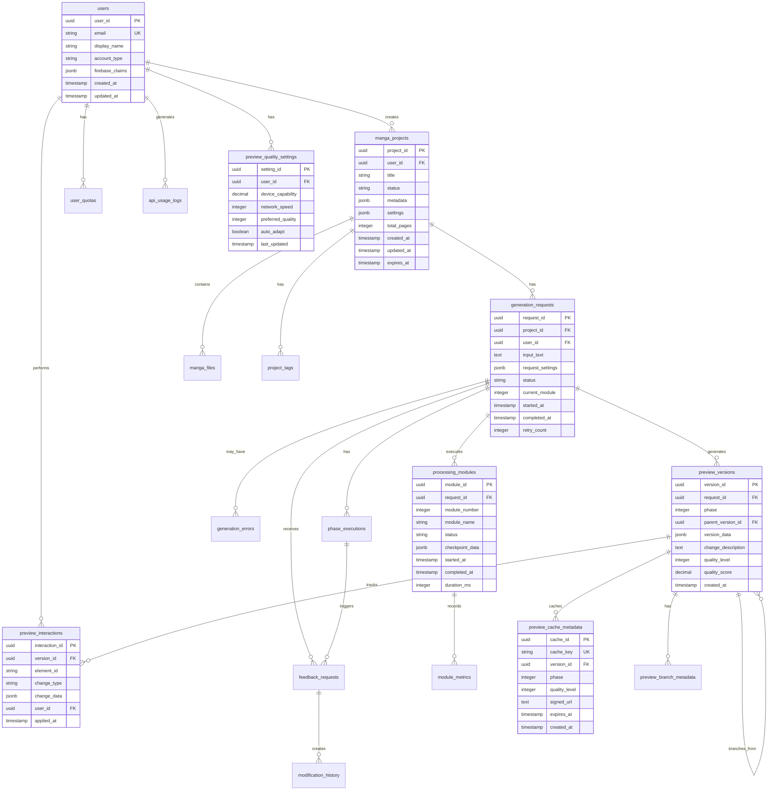

# データベーススキーマ設計

> **TL;DR**: PostgreSQL基盤の包括的データベーススキーマ設計。13テーブル構成（users・manga_projects・generation_requests・phase_executions・feedback_requests・preview_versions等）、完全なER図、JSONB活用、適切なインデックス設計（複合・UNIQUE・PARTIAL）、外部キー制約、月次パーティショニング（api_usage_logs）で構成。UUID主キー、タイムスタンプ管理、品質スコア0.0-1.0範囲、30日/1年データ保持ポリシー完備。

## 📊 ER図

## 📋 テーブル定義

### 👤 ユーザー管理テーブル

#### users（ユーザー）

| カラム名 | データ型 | 制約 | 説明 |
|---------|---------|------|------|
| user_id | UUID | PRIMARY KEY | ユーザー識別子 |
| email | VARCHAR(255) | UNIQUE, NOT NULL | メールアドレス |
| display_name | VARCHAR(100) | NOT NULL | 表示名 |
| account_type | VARCHAR(20) | NOT NULL, CHECK | free/premium/admin |
| firebase_claims | JSONB | | Firebase Custom Claims |
| created_at | TIMESTAMP | NOT NULL, DEFAULT NOW() | 作成日時 |
| updated_at | TIMESTAMP | NOT NULL, DEFAULT NOW() | 更新日時 |

**インデックス**:
- PRIMARY KEY (user_id)
- UNIQUE INDEX idx_users_email (email)
- INDEX idx_users_account_type (account_type)

#### user_quotas（ユーザークォータ）

| カラム名 | データ型 | 制約 | 説明 |
|---------|---------|------|------|
| quota_id | UUID | PRIMARY KEY | クォータ識別子 |
| user_id | UUID | NOT NULL, FOREIGN KEY | ユーザーID |
| quota_type | VARCHAR(20) | NOT NULL | daily/monthly |
| limit_value | INTEGER | NOT NULL | 制限値 |
| used_value | INTEGER | DEFAULT 0 | 使用済み値 |
| reset_at | TIMESTAMP | NOT NULL | リセット日時 |
| created_at | TIMESTAMP | NOT NULL, DEFAULT NOW() | 作成日時 |
| updated_at | TIMESTAMP | NOT NULL, DEFAULT NOW() | 更新日時 |

**インデックス**:
- PRIMARY KEY (quota_id)
- UNIQUE INDEX idx_quotas_user_type (user_id, quota_type)
- INDEX idx_quotas_reset (reset_at)

### 📚 プロジェクト管理テーブル

#### manga_projects（漫画プロジェクト）

| カラム名 | データ型 | 制約 | 説明 |
|---------|---------|------|------|
| project_id | UUID | PRIMARY KEY | プロジェクト識別子 |
| user_id | UUID | NOT NULL, FOREIGN KEY | ユーザーID |
| title | VARCHAR(255) | NOT NULL | タイトル |
| status | VARCHAR(20) | NOT NULL | completed/processing/failed |
| metadata | JSONB | | メタデータ（スタイル、キャラクター数等） |
| settings | JSONB | | 生成設定 |
| total_pages | INTEGER | | 総ページ数 |
| visibility | VARCHAR(20) | DEFAULT 'private' | private/public/unlisted |
| created_at | TIMESTAMP | NOT NULL, DEFAULT NOW() | 作成日時 |
| updated_at | TIMESTAMP | NOT NULL, DEFAULT NOW() | 更新日時 |
| expires_at | TIMESTAMP | | 有効期限（無料ユーザー用） |

**インデックス**:
- PRIMARY KEY (project_id)
- INDEX idx_projects_user_id (user_id)
- INDEX idx_projects_status (status)
- INDEX idx_projects_created_at (created_at DESC)
- INDEX idx_projects_expires_at (expires_at) WHERE expires_at IS NOT NULL

#### manga_files（漫画ファイル）

| カラム名 | データ型 | 制約 | 説明 |
|---------|---------|------|------|
| file_id | UUID | PRIMARY KEY | ファイル識別子 |
| project_id | UUID | NOT NULL, FOREIGN KEY | プロジェクトID |
| file_type | VARCHAR(20) | NOT NULL | pdf/webp/thumbnail |
| file_path | VARCHAR(500) | NOT NULL | Cloud Storage パス |
| file_size | BIGINT | | ファイルサイズ（バイト） |
| mime_type | VARCHAR(100) | | MIMEタイプ |
| page_number | INTEGER | | ページ番号（WebPの場合） |
| metadata | JSONB | | ファイルメタデータ |
| created_at | TIMESTAMP | NOT NULL, DEFAULT NOW() | 作成日時 |

**インデックス**:
- PRIMARY KEY (file_id)
- INDEX idx_files_project_id (project_id)
- INDEX idx_files_type (file_type)
- INDEX idx_files_page (project_id, page_number) WHERE page_number IS NOT NULL

### ⚙️ 処理・生成管理テーブル

#### generation_requests（生成リクエスト）

| カラム名 | データ型 | 制約 | 説明 |
|---------|---------|------|------|
| request_id | UUID | PRIMARY KEY | リクエスト識別子 |
| project_id | UUID | FOREIGN KEY | プロジェクトID |
| user_id | UUID | NOT NULL, FOREIGN KEY | ユーザーID |
| input_text | TEXT | NOT NULL | 入力テキスト |
| request_settings | JSONB | NOT NULL | リクエスト設定 |
| status | VARCHAR(20) | NOT NULL | queued/processing/completed/failed |
| current_module | INTEGER | DEFAULT 0 | 現在のモジュール番号 |
| priority | VARCHAR(10) | DEFAULT 'normal' | normal/high |
| webhook_url | VARCHAR(500) | | Webhook URL |
| started_at | TIMESTAMP | | 処理開始日時 |
| completed_at | TIMESTAMP | | 処理完了日時 |
| retry_count | INTEGER | DEFAULT 0 | リトライ回数 |
| error_message | TEXT | | エラーメッセージ |

**インデックス**:
- PRIMARY KEY (request_id)
- INDEX idx_requests_project_id (project_id)
- INDEX idx_requests_user_id (user_id)
- INDEX idx_requests_status (status)
- INDEX idx_requests_priority_created (priority DESC, created_at)

#### phase_executions（フェーズ実行）

| カラム名 | データ型 | 制約 | 説明 |
|---------|---------|------|------|
| execution_id | UUID | PRIMARY KEY | 実行識別子 |
| request_id | UUID | NOT NULL, FOREIGN KEY | リクエストID |
| phase_number | INTEGER | NOT NULL | フェーズ番号(1-7) |
| phase_name | VARCHAR(50) | NOT NULL | フェーズ名（phase1_concept/phase2_character/phase3_plot/phase4_name/phase5_scene/phase6_dialog/phase7_final） |
| status | VARCHAR(20) | NOT NULL | pending/processing/feedback_waiting/completed/failed |
| input_data | JSONB | | 入力データ |
| output_data | JSONB | | 出力データ |
| preview_url | VARCHAR(500) | | プレビューURL |
| feedback_timeout | TIMESTAMP | | フィードバックタイムアウト |
| started_at | TIMESTAMP | | 開始日時 |
| completed_at | TIMESTAMP | | 完了日時 |
| duration_ms | INTEGER | | 処理時間（ミリ秒） |
| retry_count | INTEGER | DEFAULT 0 | リトライ回数 |
| error_details | JSONB | | エラー詳細 |

**インデックス**:
- PRIMARY KEY (execution_id)
- UNIQUE INDEX idx_executions_request_phase (request_id, phase_number)
- INDEX idx_executions_status (status)
- INDEX idx_executions_feedback_timeout (feedback_timeout) WHERE feedback_timeout IS NOT NULL

### 💬 フィードバック管理テーブル

#### feedback_requests（フィードバックリクエスト）

| カラム名 | データ型 | 制約 | 説明 |
|---------|---------|------|------|
| feedback_id | UUID | PRIMARY KEY | フィードバック識別子 |
| request_id | UUID | NOT NULL, FOREIGN KEY | リクエストID |
| phase_number | INTEGER | NOT NULL | フェーズ番号 |
| feedback_type | VARCHAR(20) | NOT NULL | natural_language/quick_option/skip |
| natural_language_input | TEXT | | 自然言語入力 |
| quick_option | VARCHAR(50) | | クイックオプション |
| intensity | DECIMAL(3,2) | CHECK (intensity BETWEEN 0.0 AND 1.0) | 修正強度 |
| target_elements | JSONB | | 対象要素リスト |
| status | VARCHAR(20) | NOT NULL | pending/processing/completed/failed |
| estimated_modification_time | INTEGER | | 予想修正時間(秒) |
| created_at | TIMESTAMP | NOT NULL, DEFAULT NOW() | 作成日時 |
| timeout_at | TIMESTAMP | | タイムアウト日時 |
| processed_at | TIMESTAMP | | 処理完了日時 |

**インデックス**:
- PRIMARY KEY (feedback_id)
- INDEX idx_feedback_request_phase (request_id, phase_number)
- INDEX idx_feedback_status (status)
- INDEX idx_feedback_timeout (timeout_at) WHERE timeout_at IS NOT NULL

#### modification_history（修正履歴）

| カラム名 | データ型 | 制約 | 説明 |
|---------|---------|------|------|
| modification_id | UUID | PRIMARY KEY | 修正識別子 |
| feedback_id | UUID | NOT NULL, FOREIGN KEY | フィードバックID |
| modification_type | VARCHAR(50) | NOT NULL | 修正タイプ |
| target_element | VARCHAR(100) | NOT NULL | 対象要素 |
| original_value | JSONB | | 元の値 |
| modified_value | JSONB | | 修正後の値 |
| confidence_score | DECIMAL(3,2) | CHECK (confidence_score BETWEEN 0.0 AND 1.0) | 信頼度スコア |
| llm_reasoning | TEXT | | LLMの推論ログ |
| applied_at | TIMESTAMP | NOT NULL, DEFAULT NOW() | 適用日時 |

**インデックス**:
- PRIMARY KEY (modification_id)
- INDEX idx_modifications_feedback (feedback_id)
- INDEX idx_modifications_type (modification_type)
- INDEX idx_modifications_element (target_element)

### 🎨 プレビュー管理テーブル

#### preview_versions（プレビューバージョン管理）

| カラム名 | データ型 | 制約 | 説明 |
|---------|---------|------|------|
| version_id | UUID | PRIMARY KEY | バージョン識別子 |
| request_id | UUID | NOT NULL, FOREIGN KEY | リクエストID |
| phase_number | INTEGER | NOT NULL, CHECK (phase BETWEEN 1 AND 7) | フェーズ番号 |
| parent_version_id | UUID | FOREIGN KEY | 親バージョンID（ブランチ管理） |
| version_data | JSONB | NOT NULL | プレビューデータ |
| change_description | TEXT | NOT NULL | 変更内容説明 |
| quality_level | INTEGER | CHECK (quality_level BETWEEN 1 AND 5) | 品質レベル |
| user_feedback | TEXT | | ユーザーフィードバック |
| quality_score | DECIMAL(3,2) | CHECK (quality_score BETWEEN 0.0 AND 1.0) | 品質スコア |
| is_automatic | BOOLEAN | DEFAULT FALSE | 自動生成フラグ |
| created_at | TIMESTAMP | NOT NULL, DEFAULT NOW() | 作成日時 |
| expired_at | TIMESTAMP | | 有効期限（60日後） |

**インデックス**:
- PRIMARY KEY (version_id)
- INDEX idx_versions_request_phase (request_id, phase_number)
- INDEX idx_versions_parent (parent_version_id)
- INDEX idx_versions_created (created_at DESC)
- INDEX idx_versions_quality (quality_score DESC)
- INDEX idx_version_expired (expired_at) WHERE expired_at IS NOT NULL

#### preview_interactions（プレビューインタラクション）

| カラム名 | データ型 | 制約 | 説明 |
|---------|---------|------|------|
| interaction_id | UUID | PRIMARY KEY | インタラクション識別子 |
| version_id | UUID | NOT NULL, FOREIGN KEY | バージョンID |
| element_id | VARCHAR(100) | NOT NULL | 要素ID |
| change_type | VARCHAR(50) | NOT NULL | 変更タイプ |
| change_data | JSONB | NOT NULL | 変更データ |
| user_id | UUID | NOT NULL, FOREIGN KEY | ユーザーID |
| applied_at | TIMESTAMP | NOT NULL, DEFAULT NOW() | 適用日時 |
| reverted_at | TIMESTAMP | | 取消日時 |

**インデックス**:
- PRIMARY KEY (interaction_id)
- INDEX idx_interactions_version (version_id)
- INDEX idx_interactions_element (element_id)
- INDEX idx_interactions_user_applied (user_id, applied_at DESC)

#### preview_quality_settings（プレビュー品質設定）

| カラム名 | データ型 | 制約 | 説明 |
|---------|---------|------|------|
| setting_id | UUID | PRIMARY KEY | 設定識別子 |
| user_id | UUID | NOT NULL, FOREIGN KEY | ユーザーID |
| device_capability | DECIMAL(3,2) | CHECK (device_capability BETWEEN 0.0 AND 1.0) | デバイス性能スコア |
| network_speed | INTEGER | | ネットワーク速度(Kbps) |
| preferred_quality | INTEGER | CHECK (preferred_quality BETWEEN 1 AND 5) | 優先品質レベル |
| auto_adapt | BOOLEAN | DEFAULT TRUE | 自動適応フラグ |
| last_updated | TIMESTAMP | NOT NULL, DEFAULT NOW() | 最終更新日時 |

**インデックス**:
- PRIMARY KEY (setting_id)
- UNIQUE INDEX idx_quality_user (user_id)
- INDEX idx_quality_capability (device_capability DESC)

#### preview_cache_metadata（プレビューキャッシュメタデータ）

| カラム名 | データ型 | 制約 | 説明 |
|---------|---------|------|------|
| cache_id | UUID | PRIMARY KEY | キャッシュ識別子 |
| cache_key | VARCHAR(255) | UNIQUE, NOT NULL | キャッシュキー |
| version_id | UUID | FOREIGN KEY | バージョンID |
| phase | INTEGER | NOT NULL | フェーズ番号 |
| quality_level | INTEGER | NOT NULL | 品質レベル |
| signed_url | TEXT | NOT NULL | 署名付きURL |
| content_type | VARCHAR(100) | NOT NULL | コンテンツタイプ |
| file_size | BIGINT | | ファイルサイズ |
| expires_at | TIMESTAMP | NOT NULL | 有効期限 |
| created_at | TIMESTAMP | NOT NULL, DEFAULT NOW() | 作成日時 |
| last_accessed | TIMESTAMP | | 最終アクセス日時 |

**インデックス**:
- PRIMARY KEY (cache_id)
- UNIQUE INDEX idx_cache_key (cache_key)
- INDEX idx_cache_version (version_id)
- INDEX idx_cache_phase_quality (phase, quality_level)
- INDEX idx_cache_expires (expires_at)

### 📊 ログ・監視テーブル

#### api_usage_logs（API使用ログ）

| カラム名 | データ型 | 制約 | 説明 |
|---------|---------|------|------|
| log_id | UUID | PRIMARY KEY | ログ識別子 |
| user_id | UUID | FOREIGN KEY | ユーザーID |
| endpoint | VARCHAR(255) | NOT NULL | APIエンドポイント |
| method | VARCHAR(10) | NOT NULL | HTTPメソッド |
| status_code | INTEGER | NOT NULL | ステータスコード |
| response_time_ms | INTEGER | | レスポンス時間 |
| request_size | INTEGER | | リクエストサイズ |
| response_size | INTEGER | | レスポンスサイズ |
| ip_address | INET | | IPアドレス |
| user_agent | TEXT | | User-Agent |
| created_at | TIMESTAMP | NOT NULL, DEFAULT NOW() | 作成日時 |

**パーティショニング**: 月次パーティション（created_at）

**インデックス**:
- PRIMARY KEY (log_id, created_at)
- INDEX idx_logs_user_id (user_id, created_at DESC)
- INDEX idx_logs_endpoint (endpoint, created_at DESC)

#### generation_errors（生成エラー）

| カラム名 | データ型 | 制約 | 説明 |
|---------|---------|------|------|
| error_id | UUID | PRIMARY KEY | エラー識別子 |
| request_id | UUID | FOREIGN KEY | リクエストID |
| module_number | INTEGER | | モジュール番号 |
| error_code | VARCHAR(50) | NOT NULL | エラーコード |
| error_message | TEXT | NOT NULL | エラーメッセージ |
| error_details | JSONB | | エラー詳細 |
| stack_trace | TEXT | | スタックトレース |
| created_at | TIMESTAMP | NOT NULL, DEFAULT NOW() | 発生日時 |

**インデックス**:
- PRIMARY KEY (error_id)
- INDEX idx_errors_request_id (request_id)
- INDEX idx_errors_code (error_code)

## 🔗 関連文書

- [マイグレーション戦略](./migration-strategy.md)
- [パフォーマンス最適化](./performance-optimization.md)
- [データベース設計書 README](./README.md)
- [セキュリティ設計書](../08-security/README.md)

---

**メタデータ**
- カテゴリ: データベーススキーマ設計
- 重要度: 最高
- 更新頻度: 中
- レビュー担当: データベースアーキテクト