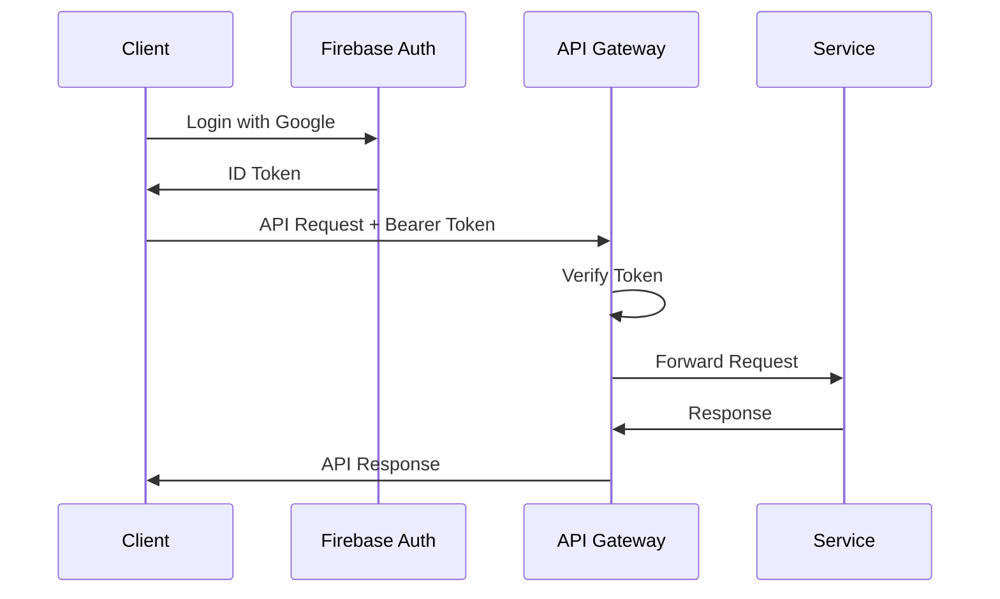
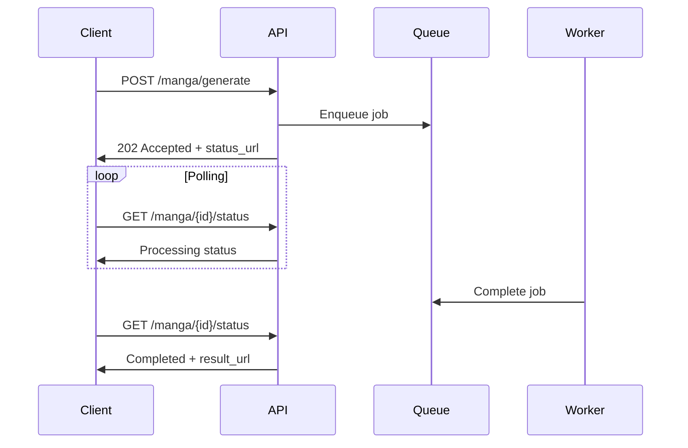
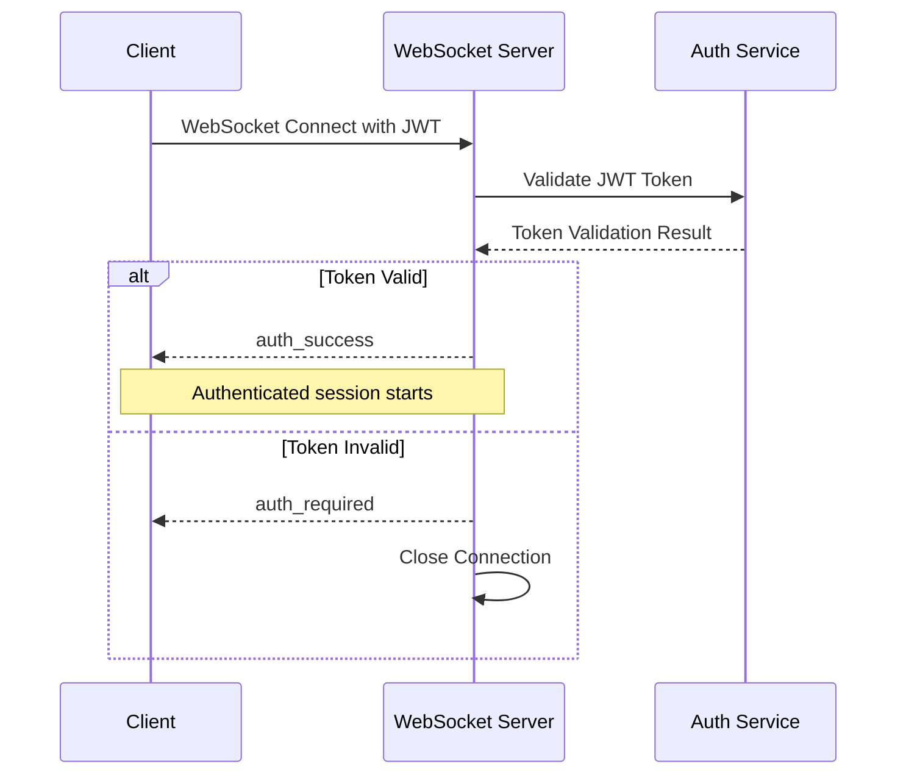

# AI漫画生成サービス API設計書

**文書管理情報**
- 文書ID: API-DOC-001
- 作成日: 2025-08-28
- 更新日: 2025-09-14
- 版数: 4.0
- 承認者: 根岸祐樹
- 関連文書: SYS-DOC-001（システム設計書）、REQ-DOC-001（要件定義書）
- 更新内容: 実装済みAPI仕様の反映、システム監視API追加、WebSocket仕様更新

## 目次

- [1. API概要](#1-api概要)
  - [1.1 設計方針](#11-設計方針)
  - [1.2 基本仕様](#12-基本仕様)
- [2. 認証・認可](#2-認証認可)
  - [2.1 認証フロー](#21-認証フロー)
  - [2.2 認可ルール](#22-認可ルール)
- [3. エンドポイント仕様](#3-エンドポイント仕様)
  - [3.1 認証API](#31-認証api)
  - [3.2 漫画生成API](#32-漫画生成api)
  - [3.3 フィードバックAPI](#33-フィードバックapi)
  - [3.4 作品管理API](#34-作品管理api)
  - [3.5 ユーザー管理API](#35-ユーザー管理api)
  - [3.6 システムAPI](#36-システムapi)
- [4. データモデル](#4-データモデル)
  - [4.1 リクエスト/レスポンス型](#41-リクエストレスポンス型)
  - [4.2 共通型定義](#42-共通型定義)
- [5. エラーハンドリング](#5-エラーハンドリング)
- [6. レート制限](#6-レート制限)
- [7. 非同期処理](#7-非同期処理)
- [8. 統一エラー処理システム](#8-統一エラー処理システム)
- [9. WebSocket統合仕様](#9-websocket統合仕様)
- [10. APIバージョニング](#10-apiバージョニング)

---

## 1. API概要

### 1.1 設計方針

| 項目 | 方針 |
|------|------|
| プロトコル | HTTPS (TLS 1.3) |
| データ形式 | JSON (UTF-8) |
| API形式 | RESTful |
| 認証方式 | Firebase Authentication |
| バージョニング | URLパス方式 |
| エラー形式 | RFC 7807 Problem Details |
| 非同期通知 | ポーリング + SSE + Webhook |

### 1.2 基本仕様

#### ベースURL設計原則

**環境別URL体系:**
- **本番環境**: セキュアなHTTPS接続での安定したAPIエンドポイント提供
- **ステージング環境**: 本番同等環境でのテスト実行とバリデーション
- **API バージョニング**: `/api/v1`形式での後方互換性確保と段階的移行サポート

#### 共通ヘッダー

**リクエストヘッダー**
```http
Authorization: Bearer {firebase_id_token}
Content-Type: application/json
Accept: application/json
X-Request-ID: {uuid}
```

**レスポンスヘッダー**
```http
Content-Type: application/json
X-Request-ID: {uuid}
X-RateLimit-Limit: {limit}
X-RateLimit-Remaining: {remaining}
X-RateLimit-Reset: {timestamp}
```

---

## 2. 認証・認可

### 2.1 認証フロー



### 2.2 認可ルール

| ユーザータイプ | 権限 | レート制限 |
|---------------|------|-----------|
| 無料ユーザー | 読取・作成（制限付） | 3作品/日 |
| 有料ユーザー | 読取・作成・更新・削除 | 無制限 |
| 管理者 | 全権限 | 無制限 |

#### Firebase Custom Claims
```json
{
  "user_type": "free|premium|admin",
  "tier": "basic|pro|enterprise",
  "quota": {
    "daily_limit": 3,
    "monthly_limit": 90
  }
}
```

---

## 3. エンドポイント仕様

### 3.1 認証API

#### POST /api/v1/auth/google/login
Firebase ID Token を用いたGoogle OAuth認証

**リクエスト**
```json
{
  "id_token": "string (Firebase ID Token)"
}
```

**レスポンス (200 OK)**
```json
{
  "access_token": "string (JWT)",
  "refresh_token": "string (JWT)",
  "expires_in": 3600,
  "user": {
    "id": "string",
    "email": "string",
    "username": "string",
    "display_name": "string",
    "account_type": "free|premium|admin",
    "provider": "google",
    "is_active": true,
    "photo_url": "string (optional)",
    "created_at": "ISO8601",
    "last_login": "ISO8601"
  }
}
```

**エラーレスポンス (400 Bad Request)**
```json
{
  "type": "validation_error",
  "title": "Invalid Firebase ID Token",
  "status": 400,
  "detail": "Email not verified. Please verify your email with Google."
}
```

#### POST /api/v1/auth/refresh
JWT Refresh Token を用いたアクセストークン更新

**リクエスト**
```json
{
  "refresh_token": "string"
}
```

**レスポンス (200 OK)**
```json
{
  "access_token": "string (JWT)",
  "expires_in": 3600
}
```

#### POST /api/v1/auth/logout
ログアウト（トークン無効化）

**リクエスト**
```json
{
  "refresh_token": "string (optional)"
}
```

**レスポンス (200 OK)**
```json
{
  "message": "Successfully logged out"
}
```

#### GET /api/v1/auth/me
認証済みユーザー情報取得

**認証**: Bearer Token 必須

**レスポンス (200 OK)**
```json
{
  "id": "string",
  "email": "string",
  "username": "string",
  "display_name": "string",
  "account_type": "free|premium|admin",
  "provider": "google|email",
  "firebase_claims": {
    "user_type": "free",
    "tier": "basic",
    "quota": {
      "daily_limit": 3,
      "monthly_limit": 90
    }
  },
  "is_active": true,
  "created_at": "ISO8601",
  "last_login_at": "ISO8601"
}
```

### 3.2 マンガ生成API

#### POST /api/v1/manga/generate
マンガ生成リクエストを開始する

**リクエスト**
```json
{
  "title": "string",
  "text": "string (max 50,000 chars)",
  "ai_auto_settings": true,
  "feedback_mode": {
    "enabled": true,
    "timeout_minutes": 30,
    "allow_skip": true
  },
  "options": {
    "priority": "normal|high",
    "webhook_url": "string (optional)",
    "auto_publish": "boolean"
  }
}
```

**レスポンス (202 Accepted)**
```json
{
  "request_id": "uuid",
  "status": "queued",
  "estimated_completion_time": "ISO8601",
  "performance_mode": "monolithic",
  "expected_duration_minutes": 8,
  "status_url": "/api/v1/manga/{request_id}/status",
  "sse_url": "/api/v1/manga/{request_id}/stream"
}
```

#### POST /api/v1/manga/test-generate
開発用テスト生成エンドポイント

**リクエスト**
```json
{
  "text": "string",
  "test_mode": true
}
```

#### POST /api/v1/manga/dev-generate
開発環境専用の簡易生成エンドポイント

**リクエスト**
```json
{
  "prompt": "string",
  "fast_mode": true
}
```

#### GET /api/v1/manga/{request_id}/status
生成状態を取得する

**レスポンス (200 OK)**
```json
{
  "request_id": "uuid",
  "status": "queued|processing|completed|failed",
  "current_module": 1,
  "total_modules": 8,
  "module_details": {
    "module_number": 1,
    "module_name": "phase1_concept",
    "status": "processing",
    "started_at": "ISO8601",
    "estimated_completion": "ISO8601",
    "progress_percentage": 45,
    "processing_mode": "in_memory"
  },
  "modules_history": [
    {
      "module_number": 1,
      "module_name": "phase1_concept",
      "status": "completed",
      "started_at": "ISO8601",
      "completed_at": "ISO8601",
      "duration_seconds": 25
    }
  ],
  "overall_progress": 12.5,
  "started_at": "ISO8601",
  "estimated_completion": "ISO8601",
  "result_url": "/api/v1/manga/{manga_id}"
}
```

#### GET /api/v1/manga/{request_id}/stream
Server-Sent Events による進捗通知

**レスポンス (200 OK)**
```
event: progress
data: {"module": 1, "status": "processing", "progress": 50}

event: module_complete
data: {"module": 1, "duration": 25, "next_module": 2}

event: complete
data: {"manga_id": "uuid", "url": "/api/v1/manga/{manga_id}"}

event: phase_progress
data: {"phase": 1, "status": "processing", "progress": 50}

event: phase_complete
data: {"phase": 1, "duration": 10, "preview_url": "string", "next_phase": 2}

event: feedback_waiting
data: {"phase": 1, "preview_url": "string", "timeout": 1800, "feedback_url": "/api/v1/manga/{request_id}/feedback"}

event: feedback_applied
data: {"phase": 1, "modifications": ["story_pace_faster"], "retry_phase": true}

event: complete
data: {"manga_id": "uuid", "url": "/api/v1/manga/{manga_id}"}

event: error
data: {"error": "Processing failed", "phase": 4, "retry_available": true}

event: preview_change
data: {"phase": 1, "element_id": "concept.title", "change_data": {"new_value": "新しいタイトル"}, "version_id": "uuid", "timestamp": 1642762800}

event: preview_update
data: {"phase": 2, "preview_url": "string", "quality_level": 3, "load_time": 1200, "version_id": "uuid"}

event: interaction_state
data: {"phase": 3, "available_interactions": ["text_edit", "drag_drop", "resize"], "current_tool": "text_editor"}

event: quality_adaptation
data: {"new_quality_level": 4, "reason": "network_improvement", "adaptation_score": 0.87}

event: version_created
data: {"version_id": "uuid", "parent_version_id": "uuid", "phase": 1, "change_description": "ユーザー編集", "branch_created": false}
```

### 3.2 画像生成進捗API

#### GET /api/v1/generation/{request_id}/progress
画像生成進捗を取得

**レスポンス (200 OK)**
```json
{
  "request_id": "uuid",
  "phase": 6,
  "phase_name": "phase5_scene",
  "progress": {
    "completed_images": 15,
    "total_images": 25,
    "percentage": 60.0,
    "current_batch": 4,
    "total_batches": 5
  },
  "parallel_status": {
    "active_workers": 3,
    "max_workers": 5,
    "queue_size": 2
  },
  "cache_performance": {
    "cache_hits": 8,
    "cache_misses": 17,
    "cache_hit_rate": 0.32
  },
  "estimated_completion": "ISO8601",
  "errors": [
    {
      "scene_id": "scene_12",
      "error_type": "api_timeout",
      "fallback_used": true,
      "timestamp": "ISO8601"
    }
  ]
}
```

#### WebSocket /ws/generation/{request_id}/progress
リアルタイム画像生成進捗通知

**メッセージ形式**
```json
{
  "type": "image_progress",
  "data": {
    "completed": 16,
    "total": 25,
    "percentage": 64.0,
    "current_scene": {
      "scene_id": "scene_16",
      "description": "Character in forest setting",
      "status": "generating"
    },
    "timestamp": "ISO8601"
  }
}
```

### 3.3 品質ゲートAPI

#### GET /api/v1/manga/{request_id}/quality-gate
品質ゲート状態を取得

**レスポンス (200 OK)**
```json
{
  "request_id": "uuid",
  "overall_status": "in_progress",
  "phases": [
    {
      "phase": 1,
      "agent_name": "plot_generation",
      "quality_score": 0.85,
      "status": "passed",
      "threshold": 0.70,
      "retry_count": 0,
      "max_retries": 3,
      "last_updated": "ISO8601"
    },
    {
      "phase": 2,
      "agent_name": "name_generation", 
      "quality_score": 0.65,
      "status": "failed",
      "threshold": 0.70,
      "retry_count": 2,
      "max_retries": 3,
      "last_updated": "ISO8601"
    }
  ],
  "quality_report_url": "string"
}
```

#### POST /api/v1/manga/{request_id}/phase/{phase}/quality-override
品質ゲート手動オーバーライド（管理者のみ）

**リクエスト**
```json
{
  "override_reason": "User feedback indicates acceptable quality",
  "admin_user_id": "uuid",
  "force_proceed": true
}
```

**レスポンス (200 OK)**
```json
{
  "phase": 2,
  "status": "override_approved",
  "override_by": "admin_user_id",
  "override_at": "ISO8601",
  "next_phase_started": true
}
```

#### GET /api/v1/quality/metrics
システム全体の品質メトリクス取得

**レスポンス (200 OK)**  
```json
{
  "system_metrics": {
    "average_quality_scores": {
      "phase_1": 0.82,
      "phase_2": 0.78,
      "phase_3": 0.85
    },
    "failure_rates": {
      "phase_1": 0.05,
      "phase_2": 0.12,
      "phase_3": 0.03
    },
    "retry_statistics": {
      "average_retries_per_phase": 1.2,
      "max_retries_exceeded_rate": 0.02
    }
  },
  "period": {
    "start_date": "ISO8601",
    "end_date": "ISO8601"
  }
}
```

#### GET /api/v1/quality/health
品質ゲートシステムのヘルスチェック

**レスポンス (200 OK)**
```json
{
  "status": "healthy",
  "components": {
    "quality_evaluator": {
      "status": "up",
      "response_time_ms": 45
    },
    "threshold_manager": {
      "status": "up",
      "response_time_ms": 12
    },
    "retry_controller": {
      "status": "up",
      "response_time_ms": 8
    }
  },
  "system_load": {
    "active_evaluations": 23,
    "queue_length": 5,
    "average_evaluation_time_ms": 850
  },
  "timestamp": "ISO8601"
}
```

#### GET /api/v1/manga/{request_id}/quality-report
詳細品質レポートを取得

**レスポンス (200 OK)**
```json
{
  "request_id": "uuid",
  "overall_quality_score": 0.78,
  "detailed_analysis": {
    "phase_1": {
      "score": 0.85,
      "metrics": {
        "concept_clarity": 0.90,
        "genre_consistency": 0.80,
        "target_audience_alignment": 0.85
      },
      "feedback": "Strong concept with clear direction",
      "improvement_suggestions": []
    },
    "phase_2": {
      "score": 0.72,
      "metrics": {
        "character_depth": 0.75,
        "visual_consistency": 0.70,
        "personality_definition": 0.72
      },
      "feedback": "Characters need more depth",
      "improvement_suggestions": [
        "Add more personality traits",
        "Strengthen character relationships"
      ]
    }
  },
  "quality_trend": {
    "improving": true,
    "confidence": 0.85
  },
  "generated_at": "ISO8601"
}
```

### 3.4 プレビューシステムAPI

#### GET /api/v1/manga/{request_id}/preview/{phase}
フェーズ特化型プレビューデータを取得

**クエリパラメータ**
```
?quality_level=1-5
&version_id=uuid (optional)
&adaptive=true (optional)
```

**レスポンス (200 OK)**
```json
{
  "phase": 1,
  "version_id": "uuid",
  "timestamp": "ISO8601",
  "quality_level": 3,
  
  "data": {
    "concept": {
      "title": "物語のタイトル",
      "summary": "あらすじ",
      "keywords": ["友情", "成長", "冒険"]
    },
    "genre": {
      "primary": "日常系",
      "secondary": "コメディ",
      "subgenres": ["学園"]
    }
  },
  
  "interactive_elements": {
    "concept_editor": true,
    "genre_selector": true,
    "audience_adjuster": true
  },
  
  "preview_urls": {
    "thumbnail": "string",
    "full_preview": "string"
  }
}
```

#### POST /api/v1/manga/{request_id}/preview/{phase}/apply-change
インタラクティブ変更を適用

**リクエスト**
```json
{
  "element_id": "concept.title",
  "change_type": "text_edit",
  "change_data": {
    "new_value": "新しいタイトル",
    "previous_value": "古いタイトル"
  },
  "apply_immediately": true,
  "create_branch": false
}
```

**レスポンス (200 OK)**
```json
{
  "version_id": "uuid",
  "branch_id": "uuid",
  "change_applied": true,
  "preview_updated": true,
  "preview_url": "string",
  "estimated_regeneration_time": 5
}
```

#### GET /api/v1/manga/{request_id}/preview/{phase}/versions
プレビューバージョン履歴を取得

**レスポンス (200 OK)**
```json
{
  "current_version": "uuid",
  "timeline": [
    {
      "version_id": "uuid",
      "parent_version_id": "uuid",
      "created_at": "ISO8601",
      "change_description": "ジャンルをコメディに変更",
      "quality_score": 0.85,
      "is_automatic": false,
      "branch_depth": 0
    }
  ],
  "branches": [
    {
      "branch_id": "uuid", 
      "branch_name": "コメディバージョン",
      "versions_count": 3,
      "latest_version_id": "uuid"
    }
  ]
}
```

#### GET /api/v1/manga/{request_id}/preview/compare
バージョン比較

**クエリパラメータ**
```
?version1=uuid
&version2=uuid
&comparison_type=side-by-side|overlay|diff
```

**レスポンス (200 OK)**
```json
{
  "version1": {
    "version_id": "uuid",
    "data": {},
    "quality_score": 0.82
  },
  "version2": {
    "version_id": "uuid", 
    "data": {},
    "quality_score": 0.89
  },
  "differences": [
    {
      "path": "concept.genre.primary",
      "type": "value_change",
      "old_value": "アクション",
      "new_value": "コメディ"
    }
  ],
  "quality_improvement": 0.07,
  "visual_diff_url": "string"
}
```

#### POST /api/v1/manga/{request_id}/preview/{phase}/revert
特定のバージョンに復元

**リクエスト**
```json
{
  "target_version_id": "uuid",
  "create_new_branch": true,
  "branch_name": "復元されたバージョン"
}
```

**レスポンス (200 OK)**
```json
{
  "reverted_to_version": "uuid",
  "new_version_id": "uuid",
  "branch_created": true,
  "preview_updated": true
}
```

#### GET /api/v1/preview/quality/detect
デバイス性能・ネットワーク品質検出

**レスポンス (200 OK)**
```json
{
  "device_capability": 0.75,
  "network_speed": 8500,
  "recommended_quality": 4,
  "detection_confidence": 0.92,
  "capabilities": {
    "memory_gb": 8,
    "cpu_cores": 8,
    "pixel_ratio": 2.0,
    "connection_type": "4g"
  }
}
```

#### PUT /api/v1/user/preview-quality-settings
プレビュー品質設定を更新

**リクエスト**
```json
{
  "preferred_quality": 4,
  "auto_adapt": true,
  "device_capability": 0.75,
  "network_speed": 8500
}
```

**レスポンス (200 OK)**
```json
{
  "settings_updated": true,
  "effective_quality": 4,
  "auto_adaptation_enabled": true
}
```

### 3.5 HITLフィードバックAPI

#### POST /api/v1/manga/{request_id}/feedback
各フェーズの結果に対してユーザーがフィードバックを送信

**リクエスト**
```json
{
  "phase": 1,
  "feedback_type": "natural_language|quick_option|skip",
  "content": {
    "natural_language": "もっと明るい雰囲気にして、コメディ要素を強くして",
    "quick_option": "make_brighter|more_serious|add_detail|simplify",
    "intensity": 0.7,
    "target_elements": ["story_pace", "character_mood"]
  }
}
```

#### POST /api/v1/manga/{request_id}/chat
チャットインターフェース経由でのフィードバック送信

**リクエスト**
```json
{
  "phase": 1,
  "message": "キャラクターをもう一人追加して、主人公のライバルにしてください",
  "session_id": "chat_session_uuid",
  "message_type": "text|quick_action"
}
```

**レスポンス (200 OK)**
```json
{
  "message_id": "uuid",
  "phase": 1,
  "status": "processing",
  "interpreted_action": {
    "type": "character_addition",
    "parameters": {
      "role": "rival",
      "relationship": "antagonist"
    }
  },
  "preview_update": {
    "version_id": "uuid",
    "preview_url": "string"
  },
  "suggested_actions": [
    {"label": "性格を決める", "action": "define_personality"},
    {"label": "ビジュアルを調整", "action": "adjust_visual"},
    {"label": "関係性を設定", "action": "set_relationship"}
  ]
}
```

#### GET /api/v1/manga/{request_id}/chat/history
チャット履歴取得

**レスポンス (200 OK)**
```json
{
  "session_id": "chat_session_uuid",
  "messages": [
    {
      "message_id": "uuid",
      "timestamp": "ISO8601",
      "sender": "user|system",
      "phase": 1,
      "content": "string",
      "applied_changes": {
        "type": "string",
        "description": "string"
      }
    }
  ],
  "total_messages": 25,
  "phases_modified": [1, 2, 4]
}
```

**レスポンス (200 OK)**
```json
{
  "feedback_id": "uuid",
  "request_id": "uuid",
  "phase": 1,
  "status": "accepted",
  "parsed_modifications": [
    {
      "type": "mood_adjustment",
      "target": "story_atmosphere",
      "direction": "brighter",
      "intensity": 0.7
    },
    {
      "type": "element_addition",
      "target": "story_elements",
      "addition": "comedy",
      "intensity": 0.8
    }
  ],
  "estimated_modification_time": 45,
  "modification_url": "/api/v1/manga/{request_id}/modification/{feedback_id}/status"
}
```

#### GET /api/v1/manga/{request_id}/phase/{phase_number}/preview
特定フェーズの結果プレビューを取得

**レスポンス (200 OK)**
```json
{
  "phase": 1,
  "phase_name": "story_theme",
  "content": {
    "phase3_plot": {
      "theme": "友情と成長",
      "genre": "日常系",
      "target_pages": 15,
      "main_scenes": [
        {
          "scene_id": 1,
          "title": "出会い",
          "description": "主人公が新しいクラスメイトと出会う",
          "emotion": "nervous",
          "pages": 3
        }
      ]
    }
  },
  "preview_urls": {
    "thumbnail": "string",
    "structure_diagram": "string"
  },
  "modification_options": {
    "quick_options": [
      {"label": "明るく", "value": "make_brighter"},
      {"label": "シリアスに", "value": "more_serious"},
      {"label": "詳細化", "value": "add_detail"}
    ],
    "modifiable_elements": ["theme", "genre", "scene_count", "emotion_tone"]
  },
  "feedback_deadline": "ISO8601"
}
```

#### GET /api/v1/manga/{request_id}/modification/{feedback_id}/status
フィードバック適用状態を取得

**レスポンス (200 OK)**
```json
{
  "feedback_id": "uuid",
  "status": "processing|completed|failed",
  "progress": 80,
  "applied_modifications": [
    {
      "type": "mood_adjustment",
      "status": "completed",
      "result_preview": "string"
    }
  ],
  "estimated_completion": "ISO8601",
  "next_phase_available": true
}
```

#### POST /api/v1/manga/{request_id}/skip-feedback
フィードバックをスキップして次のフェーズに進む

**リクエスト**
```json
{
  "phase": 1,
  "skip_reason": "satisfied|time_constraint|default_acceptable"
}
```

**レスポンス (200 OK)**
```json
{
  "skipped_phase": 1,
  "next_phase": 2,
  "processing_resumed": true,
  "estimated_completion": "ISO8601"
}
```

### 3.3 作品管理API

#### GET /api/v1/manga
ユーザーの作品一覧を取得

**クエリパラメータ**
```
?page=1
&limit=20
&sort=created_at|updated_at|title
&order=asc|desc
&status=all|completed|processing|failed
```

**レスポンス (200 OK)**
```json
{
  "items": [
    {
      "manga_id": "uuid",
      "title": "string",
      "status": "completed",
      "pages": 20,
      "style": "anime",
      "created_at": "ISO8601",
      "updated_at": "ISO8601",
      "thumbnail_url": "string",
      "size_bytes": 10485760
    }
  ],
  "pagination": {
    "page": 1,
    "limit": 20,
    "total_items": 100,
    "total_pages": 5,
    "has_next": true,
    "has_previous": false
  }
}
```

#### GET /api/v1/manga/{manga_id}
特定の作品詳細を取得

**レスポンス (200 OK)**
```json
{
  "manga_id": "uuid",
  "title": "string",
  "status": "completed",
  "metadata": {
    "pages": 20,
    "style": "anime",
    "characters_count": 3,
    "word_count": 5000,
    "processing_time_seconds": 480
  },
  "files": {
    "pdf_url": "string (signed URL)",
    "webp_urls": ["string"],
    "thumbnail_url": "string"
  },
  "created_at": "ISO8601",
  "updated_at": "ISO8601",
  "expires_at": "ISO8601"
}
```

#### PUT /api/v1/manga/{manga_id}
作品情報を更新

**リクエスト**
```json
{
  "title": "string (optional)",
  "description": "string (optional)",
  "tags": ["string"],
  "visibility": "private|public|unlisted"
}
```

**レスポンス (200 OK)**
```json
{
  "manga_id": "uuid",
  "updated_fields": ["title", "tags"],
  "updated_at": "ISO8601"
}
```

#### DELETE /api/v1/manga/{manga_id}
作品を削除

**レスポンス (204 No Content)**
```
(No body)
```

### 3.4 ユーザー管理API

#### GET /api/v1/user/profile
ユーザープロフィール取得

**レスポンス (200 OK)**
```json
{
  "user_id": "string",
  "email": "string",
  "display_name": "string",
  "account_type": "free|premium",
  "quota": {
    "daily_limit": 3,
    "daily_used": 0,
    "monthly_limit": 90,
    "monthly_used": 15,
    "reset_at": "ISO8601"
  },
  "statistics": {
    "total_manga_created": 10,
    "total_pages_generated": 200,
    "average_processing_time": 450
  },
  "created_at": "ISO8601"
}
```

#### GET /api/v1/user/usage
利用状況取得

**レスポンス (200 OK)**
```json
{
  "current_period": {
    "start_date": "2025-01-01",
    "end_date": "2025-01-31",
    "manga_created": 15,
    "api_calls": 450,
    "storage_used_bytes": 52428800
  },
  "daily_usage": [
    {
      "date": "2025-01-20",
      "manga_created": 1,
      "api_calls": 25,
      "processing_time_seconds": 480,
      "architecture": "monolithic",
      "performance_improvement": "40% faster than microservices"
    }
  ],
  "quota_status": {
    "daily_remaining": 2,
    "monthly_remaining": 75,
    "next_reset": "ISO8601"
  }
}
```

### 3.5 システムAPI

#### GET /api/v1/health
ヘルスチェック

**レスポンス (200 OK)**
```json
{
  "status": "healthy",
  "version": "1.0.0",
  "timestamp": "ISO8601",
  "services": {
    "database": "healthy",
    "redis": "healthy",
    "storage": "healthy",
    "ai_api": "healthy"
  }
}
```

#### GET /api/v1/system/capabilities
システム機能情報

**レスポンス (200 OK)**
```json
{
  "supported_styles": ["realistic", "anime", "cartoon", "sketch", "watercolor"],
  "max_pages": 100,
  "max_text_length": 50000,
  "max_characters": 5,
  "languages": ["ja", "en"],
  "file_formats": ["pdf", "webp"],
  "processing_time_estimate": {
    "per_1000_chars": 96,
    "base_time": 300
  }
}
```

### 3.6 システム監視・管理API

#### GET /api/v1/system/dashboard
システムダッシュボード取得

**レスポンス (200 OK)**
```json
{
  "system_overview": {
    "uptime_seconds": 86400,
    "cpu_usage": 45.2,
    "memory_usage": 68.5,
    "disk_usage": 12.3,
    "active_connections": 142
  },
  "generation_stats": {
    "total_generations_today": 245,
    "average_processing_time": 450,
    "success_rate": 0.97,
    "queue_length": 5
  },
  "ai_services": {
    "vertex_ai": {
      "status": "healthy",
      "response_time_ms": 850,
      "quota_remaining": 0.85
    }
  }
}
```

#### GET /api/v1/system/health
詳細システムヘルスチェック

**レスポンス (200 OK)**
```json
{
  "status": "healthy",
  "components": {
    "api": "healthy",
    "database": "healthy",
    "redis": "healthy",
    "websocket": "healthy"
  },
  "version": "1.0",
  "timestamp": "ISO8601"
}
```

#### GET /api/v1/system/performance/summary
パフォーマンス概要

**レスポンス (200 OK)**
```json
{
  "processing_performance": {
    "average_time_per_phase": {
      "phase_1": 12.5,
      "phase_2": 18.3,
      "phase_3": 22.1,
      "phase_4": 8.7,
      "phase_5": 156.2,
      "phase_6": 45.3,
      "phase_7": 32.8
    },
    "total_average_time": 295.9
  },
  "system_resources": {
    "cpu_usage": 45.2,
    "memory_usage": 68.5,
    "concurrent_requests": 12
  }
}
```

#### GET /api/v1/system/performance/report
詳細パフォーマンスレポート生成

**レスポンス (200 OK)**
```json
{
  "report_id": "uuid",
  "generated_at": "ISO8601",
  "period": {
    "start": "ISO8601",
    "end": "ISO8601"
  },
  "detailed_metrics": {
    "phase_performance": {
      "phase_1": {
        "total_executions": 1250,
        "average_time": 12.5,
        "success_rate": 0.99,
        "error_rate": 0.01
      }
    },
    "resource_utilization": {
      "peak_cpu": 78.5,
      "peak_memory": 89.2,
      "average_concurrent_requests": 15.3
    }
  }
}
```

#### GET /api/v1/system/configuration/status
システム設定状況

**レスポンス (200 OK)**
```json
{
  "configuration_version": "1.2.5",
  "last_updated": "ISO8601",
  "active_settings": {
    "phase_timeouts": {
      "phase_1": 30,
      "phase_2": 45,
      "phase_3": 60,
      "phase_4": 20,
      "phase_5": 300,
      "phase_6": 120,
      "phase_7": 90
    },
    "parallel_processing": true,
    "auto_optimization": true
  }
}
```

#### POST /api/v1/system/configuration/update
システム設定更新

**リクエスト**
```json
{
  "settings": {
    "phase_timeouts": {
      "phase_5": 250
    },
    "parallel_processing": false
  },
  "apply_immediately": true
}
```

#### GET /api/v1/system/alerts
システムアラート取得

**レスポンス (200 OK)**
```json
{
  "active_alerts": [
    {
      "alert_id": "uuid",
      "severity": "warning",
      "component": "vertex_ai",
      "message": "API response time elevated",
      "created_at": "ISO8601",
      "acknowledged": false
    }
  ],
  "alert_summary": {
    "critical": 0,
    "warning": 2,
    "info": 5
  }
}
```

#### GET /api/v1/system/statistics
システム統計情報

**レスポンス (200 OK)**
```json
{
  "usage_stats": {
    "total_manga_generated": 15420,
    "total_users": 2850,
    "average_sessions_per_day": 145,
    "peak_concurrent_users": 89
  },
  "performance_stats": {
    "average_processing_time": 295.9,
    "fastest_generation": 180.2,
    "success_rate_7_days": 0.97
  },
  "resource_stats": {
    "storage_used_gb": 124.5,
    "bandwidth_used_gb": 856.3,
    "ai_api_calls_today": 1240
  }
}
```

---

## 4. データモデル

### 4.1 リクエスト/レスポンス型

#### MangaRequest
```typescript
interface MangaRequest {
  title: string;
  text: string;
  settings: MangaSettings;
  options?: MangaOptions;
}

interface MangaSettings {
  style: StyleType;
  pages: number;
  characters_count: number;
  color_mode: ColorMode;
  language: Language;
}

interface MangaOptions {
  priority?: Priority;
  webhook_url?: string;
  auto_publish?: boolean;
}
```

#### MangaResponse
```typescript
interface MangaResponse {
  manga_id: string;
  title: string;
  status: ProcessingStatus;
  metadata: MangaMetadata;
  files: MangaFiles;
  created_at: string;
  updated_at: string;
  expires_at?: string;
}

interface MangaMetadata {
  pages: number;
  style: StyleType;
  characters_count: number;
  word_count: number;
  processing_time_seconds: number;
}

interface MangaFiles {
  pdf_url?: string;
  webp_urls?: string[];
  thumbnail_url?: string;
}
```

### 4.2 共通型定義

#### Enums
```typescript
enum StyleType {
  REALISTIC = "realistic",
  ANIME = "anime",
  CARTOON = "cartoon",
  SKETCH = "sketch",
  WATERCOLOR = "watercolor"
}

enum ProcessingStatus {
  QUEUED = "queued",
  PROCESSING = "processing",
  COMPLETED = "completed",
  FAILED = "failed"
}

enum ColorMode {
  FULL_COLOR = "full_color",
  MONOCHROME = "monochrome"
}

enum Language {
  JAPANESE = "ja",
  ENGLISH = "en"
}

enum Priority {
  NORMAL = "normal",
  HIGH = "high"
}
```

#### Error Response (RFC 7807)
```typescript
interface ProblemDetails {
  type: string;        // URI reference
  title: string;       // Short summary
  status: number;      // HTTP status code
  detail: string;      // Explanation
  instance: string;    // URI reference for specific occurrence
  errors?: ValidationError[];
}

interface ValidationError {
  field: string;
  code: string;
  message: string;
}
```

---

## 5. エラーハンドリング

### 5.1 HTTPステータスコード

| コード | 意味 | 使用場面 |
|--------|------|----------|
| 200 | OK | 正常な取得・更新 |
| 201 | Created | リソース作成成功 |
| 202 | Accepted | 非同期処理受付 |
| 204 | No Content | 削除成功 |
| 400 | Bad Request | バリデーションエラー |
| 401 | Unauthorized | 認証失敗 |
| 403 | Forbidden | 権限不足 |
| 404 | Not Found | リソース不存在 |
| 409 | Conflict | リソース競合 |
| 429 | Too Many Requests | レート制限超過 |
| 500 | Internal Server Error | サーバーエラー |
| 503 | Service Unavailable | メンテナンス中 |

### 5.2 エラーレスポンス例

**400 Bad Request**
```json
{
  "type": "https://api.manga-service.com/errors/validation",
  "title": "Validation Error",
  "status": 400,
  "detail": "The request contains invalid parameters",
  "instance": "/api/v1/manga/generate",
  "errors": [
    {
      "field": "settings.pages",
      "code": "out_of_range",
      "message": "Pages must be between 10 and 100"
    }
  ]
}
```

**429 Too Many Requests**
```json
{
  "type": "https://api.manga-service.com/errors/rate-limit",
  "title": "Rate Limit Exceeded",
  "status": 429,
  "detail": "Daily manga generation limit (3/day) reached",
  "instance": "/api/v1/manga/generate",
  "retry_after": 86400
}
```

---

## 6. レート制限

### 6.1 制限ルール

| エンドポイント | 無料ユーザー | 有料ユーザー |
|---------------|------------|------------|
| POST /manga/generate | 3/日 | 無制限 |
| GET /manga/* | 100/時 | 1000/時 |
| PUT/DELETE /manga/* | 10/時 | 100/時 |
| GET /user/* | 60/時 | 600/時 |

### 6.2 同時処理制限

| 制限項目 | 値 |
|---------|-----|
| 同時生成数/ユーザー | 1 |
| 同時API呼び出し数 | 10 |
| WebSocket同時接続数 | 3 |

### 6.3 レート制限ヘッダー

```http
X-RateLimit-Limit: 100
X-RateLimit-Remaining: 45
X-RateLimit-Reset: 1705756800
X-RateLimit-Resource: manga_generation
X-RateLimit-Used: 55
```

---

## 7. 非同期処理

### 7.1 ポーリング方式



### 7.2 SSE通知

#### SSE通知設計原則

**リアルタイム通知戦略:**
- **進捗通知**: 各フェーズでの処理進捗をリアルタイムで配信
- **完了通知**: 生成完了時の結果URL及びステータス情報送信
- **エラー通知**: 異常発生時の詳細情報と復旧方針の通知

**通信制御設計:**
- クライアント接続の自動管理と適切な接続終了
- データ形式の標準化とJSON構造での一貫性確保
- エラーハンドリング統合とフォールバック戦略

### 7.3 Webhook通知

**Webhook リクエスト**
```json
{
  "event": "manga.completed",
  "timestamp": "ISO8601",
  "data": {
    "request_id": "uuid",
    "manga_id": "uuid",
    "status": "completed",
    "result_url": "https://api.manga-service.com/api/v1/manga/{id}"
  },
  "signature": "hmac-sha256-signature"
}
```

---

## 8. 統一エラー処理システム

### 8.1 統一エラーレスポンス形式

全てのAPIエラーレスポンスは以下の統一フォーマットを使用します：

```typescript
interface APIErrorResponse {
  error: {
    code: string              // 統一エラーコード
    message: string           // ユーザー向けメッセージ
    details?: {              // 詳細情報（オプション）
      field?: string         // バリデーションエラー時のフィールド名
      constraint?: string    // 制約違反の詳細
      trace_id?: string     // トレースID（デバッグ用）
      context?: any         // エラーコンテキスト
    }
    timestamp: string        // ISO8601形式のタイムスタンプ
    path: string            // リクエストパス
  }
}
```

### 8.2 エラーコード体系

| カテゴリ | コード範囲 | HTTPステータス | 説明 | 例 |
|---------|-----------|---------------|-----|-----|
| **認証エラー** | AUTH_001-099 | 401 | 認証に関する問題 | AUTH_001: トークン無効 |
| **認可エラー** | AUTHZ_001-099 | 403 | アクセス権限に関する問題 | AUTHZ_001: アクセス拒否 |
| **バリデーション** | VALID_001-099 | 400 | 入力値検証エラー | VALID_001: 必須項目不足 |
| **レート制限** | RATE_001-099 | 429 | 利用制限に関する問題 | RATE_001: 日次上限到達 |
| **リソース** | RES_001-099 | 404 | リソース関連の問題 | RES_001: リソース未発見 |
| **サーバー** | SRV_001-099 | 500 | サーバー内部エラー | SRV_001: 内部サーバーエラー |
| **AI生成** | AI_001-099 | 502 | AI生成処理のエラー | AI_001: 生成API障害 |

### 8.3 具体的なエラー定義

#### エラー分類設計原則

**エラーカテゴリ体系:**
- **認証エラー系**: JWTトークン検証失敗、セッション管理エラーの統一的処理
- **認可エラー系**: アクセス権限不足、リソース参照権限エラーの適切な制御
- **バリデーションエラー系**: 入力値検証、必須項目チェックの包括的実装
- **レート制限エラー系**: 利用量制限到達、サービス保護機能の適切な動作
- **リソースエラー系**: データ未発見、リソース状態不整合の統一的対応
- **サーバーエラー系**: 内部システム障害、依存サービス障害の適切なハンドリング
- **AI生成エラー系**: 生成サービス障害、コンテンツポリシー検証、処理タイムアウトの管理

**エラーコード設計方針:**
- 接頭辞ベースでのカテゴリ分類による保守性向上
- 一意性確保と将来拡張性を考慮したコード体系
- クライアント側での適切なエラーハンドリング支援

### 8.4 エラーレスポンス例

```json
{
  "error": {
    "code": "RATE_001",
    "message": "本日の生成上限に達しました。明日リセットされます。",
    "details": {
      "current_count": 10,
      "limit": 10,
      "reset_time": "2025-01-25T00:00:00Z",
      "trace_id": "abc123def456"
    },
    "timestamp": "2025-01-24T15:30:00Z",
    "path": "/api/v1/manga/generate"
  }
}
```

---

## 9. WebSocket統合仕様

### 9.1 WebSocket接続仕様

#### 接続エンドポイント
```
WSS /ws/v1/generation/{session_id}?token={jwt_token}
WSS /ws/v1/sessions/{session_id}/phases/{phase_number}?token={jwt_token}
WSS /ws/v1/global/user/{user_id}?token={jwt_token}
WSS /ws/v1/health
WSS /ws/v1/generation/{request_id}/progress?token={jwt_token}
```

**エンドポイント詳細:**
- `/generation/{session_id}` - マンガ生成セッション全体の通信
- `/sessions/{session_id}/phases/{phase_number}` - 特定フェーズの詳細通信
- `/global/user/{user_id}` - ユーザー全体のグローバル通知
- `/health` - WebSocketヘルスチェック（認証不要）
- `/generation/{request_id}/progress` - リアルタイム画像生成進捗

#### 認証フロー


### 9.2 メッセージ仕様

#### クライアント→サーバー メッセージ
```typescript
interface WebSocketClientMessage {
  type: 'ping' | 'auth' | 'subscribe' | 'unsubscribe' | 'feedback' | 'quality_override'
  data: {
    token?: string        // auth時
    requestId?: string    // subscribe時
    sessionId?: string    // session操作時
    phaseNumber?: number  // フェーズ指定時
    timestamp?: number    // ping時
    feedback?: {          // HITLフィードバック時
      phase: number
      content: string
      type: 'natural_language' | 'quick_option' | 'skip'
    }
    qualityOverride?: {   // 品質ゲートオーバーライド時
      phase: number
      reason: string
      forceApprove: boolean
    }
  }
}
```

#### サーバー→クライアント メッセージ
```typescript
interface WebSocketServerMessage {
  type: 'pong' | 'auth_success' | 'auth_required' |
        'generation_update' | 'phase_complete' | 'complete' | 'error' |
        'feedback_waiting' | 'quality_gate_status' | 'preview_update' |
        'image_progress' | 'hitl_chat_response'
  data: {
    // 統一エラーフォーマット（error時）
    errorCode?: string    // 統一エラーコード
    message?: string      // エラーメッセージ
    details?: any         // エラー詳細

    // 進捗データ（generation_update時）
    requestId?: string
    sessionId?: string
    phase?: number
    progress?: number
    status?: 'pending' | 'processing' | 'completed' | 'error' | 'waiting_feedback'

    // フェーズ完了データ（phase_complete時）
    phaseResults?: any
    previewUrl?: string
    qualityScore?: number

    // 品質ゲート（quality_gate_status時）
    qualityGate?: {
      phase: number
      status: 'passed' | 'failed' | 'override_required'
      score: number
      threshold: number
    }

    // HITLフィードバック待ち（feedback_waiting時）
    feedbackContext?: {
      phase: number
      previewUrl: string
      timeoutMinutes: number
      suggestedActions: string[]
    }

    // 画像生成進捗（image_progress時）
    imageProgress?: {
      completedImages: number
      totalImages: number
      percentage: number
      currentScene: string
    }

    // 完了データ（complete時）
    result?: any
    finalUrl?: string

    // その他
    timestamp?: number
    latency?: number
  }
}
```

### 9.3 生成進捗メッセージの詳細

```json
{
  "type": "generation_update",
  "data": {
    "requestId": "req_12345",
    "module": 3,
    "title": "場面分割",
    "description": "重要な場面を特定しています",
    "progress": 65,
    "status": "processing",
    "estimatedTime": 30,
    "remainingTime": 15,
    "metrics": {
      "tokenUsage": 2350,
      "sceneCount": 8
    },
    "logs": [
      "2025-01-24T15:30:00Z: 場面分割を開始",
      "2025-01-24T15:30:15Z: 8つの主要場面を特定"
    ]
  }
}
```

### 9.4 WebSocketエラー処理

WebSocketでも統一エラーコードを使用：

```json
{
  "type": "error",
  "data": {
    "errorCode": "AI_001",
    "message": "AI生成サービスで一時的な障害が発生しました",
    "details": {
      "module": 6,
      "retryable": true,
      "trace_id": "ws_error_789"
    },
    "timestamp": "2025-01-24T15:35:00Z"
  }
}
```

---

## 10. APIバージョニング

### 10.1 バージョン管理方針

| 項目 | 方針 |
|------|------|
| 形式 | URLパス (/api/v1/) |
| サポート期間 | 最新2バージョン |
| 廃止予告期間 | 6ヶ月 |
| 互換性 | 後方互換性維持 |

### 10.2 バージョン移行

```http
# 廃止予定の通知
Sunset: Sat, 31 Dec 2025 23:59:59 GMT
Deprecation: true
Link: <https://api.manga-service.com/api/v2/manga>; rel="successor-version"
```

### 10.3 変更管理

| バージョン | リリース日 | 主な変更 | サポート終了 |
|-----------|-----------|---------|------------|
| v1 | 2025-03-01 | 初期リリース | - |
| v2 | 2025-09-01 | GraphQL追加（予定） | - |

---

## 改訂履歴

| 版数 | 日付 | 変更内容 | 担当者 |
|------|------|----------|--------|
| 1.0 | 2025-01-20 | 初版作成 | Claude Code |
| 3.0 | 2025-08-28 | Quality Gates API拡張・追加エンドポイント実装 | Claude Code |

---

**文書承認**
- APIアーキテクト: [署名] 日付: [日付]
- セキュリティ責任者: [署名] 日付: [日付]
- プロダクトマネージャー: [署名] 日付: [日付]