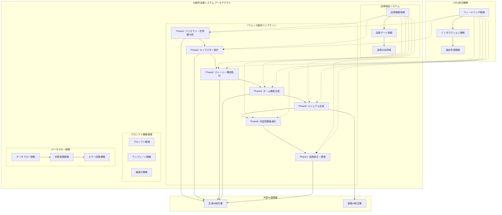

# AI設計概要

> **TL;DR**: AI漫画生成の設計方針と統合モジュールアーキテクチャ。HITL統合、品質協調、効率的相互作用、継続学習の4原則。7フェーズ創作パイプライン、品質保証システム、プロンプト戦略管理、データフロー管理で構成。各フェーズの品質基準と処理時間目標を含む。

**ナビゲーション**: [README](./README.md) > AI設計概要

**関連文書**:
- [HITLシステム設計](./hitl-system.md)
- [プロンプトエンジニアリング](./prompt-engineering.md)
- [品質制御システム](./quality-control.md)

---

## 1. AI設計方針

### 1.1 基本原則

| 原則 | 内容 | 実装アプローチ |
|------|------|---------------|
| HITL統合 | 7フェーズユーザー参加型処理 | インタラクティブフィードバックシステム |
| 品質協調 | ユーザーとAIの協調による品質向上 | リアルタイムフィードバック統合 |
| 効率的相互作用 | 30秒タイムアウト付きスムーズなやり取り | EventTarget+自然言語処理 |
| 継続学習 | フィードバックからの自動学習 | フィードバック分析・改善サイクル |

### 1.2 AI設計思想

```yaml
AI Design Philosophy:
  Processing Model: Human-in-the-loop協調型
    - 各フェーズでユーザーフィードバック統合
    - AI提案→ユーザー確認・修正→反映のサイクル
    - 自然言語フィードバック処理による学習

  Quality Assurance: 協調品質管理
    - 85%品質スコア閾値による段階的品質保証
    - AI品質評価とユーザー主観評価の統合
    - フィードバック統合による継続的改善
    - 品質ゲートによる段階的品質保証
    - 3回リトライ機構による品質目標達成

  User Experience: 参加型創作支援
    - リアルタイムプレビューによる即座の確認
    - 直感的フィードバック入力インターフェース
    - 応答性を重視したスムーズな進行

  Performance Requirements:
    - フェーズ間遷移: 最適化された応答時間
    - ユーザーフィードバック処理: リアルタイム対応
    - 品質評価サイクル: 効率的な評価プロセス
```

## 2. 統合モジュールアーキテクチャ

### 2.1 統合AIサービス構成



### 2.2 統合AIサービス設計原則

**統合AI処理サービスの設計考慮事項:**

- **7フェーズモジュール統合アーキテクチャ**: コンセプト分析から最終統合まで段階的処理を実現する設計パターン
- **品質管理システム統合**: 各フェーズでの品質評価と全体的な品質保証の統合メカニズム
- **プロンプト管理戦略**: フェーズ固有の最適化プロンプトと動的調整機能の設計
- **データパイプライン設計**: フェーズ間のデータ流通と永続化戦略
- **非同期処理アーキテクチャ**: チェックポイント保存と並列処理の最適化設計

**統合処理実行の設計原則:**

- **インメモリパイプライン**: 高速処理を実現する一時的データ保持戦略
- **順次実行制御**: フェーズ依存関係を考慮した実行順序管理
- **処理時間追跡**: パフォーマンス分析のためのメトリクス収集設計
- **エラー回復戦略**: フェーズ失敗時の包括的エラーハンドリングとリカバリ機構

**基底AIモジュール設計仕様:**

- **品質閾値管理**: フェーズごとの適切な品質基準設定（標準: 70%、最適: 85%）
- **リトライ戦略**: 最大3回のリトライと段階的品質向上アプローチ
- **品質ゲート実装**: 品質基準未達成時の自動再処理と結果最適化
- **結果永続化**: PostgreSQLチェックポイントとCloud Storageプレビューによるハイブリッド保存
- **劣化許容設計**: 60%以上の品質で許容可能な代替結果提供

## 3. フェーズ概要

### 3.1 Phase 1: コンセプト・世界観分析

**設計アプローチ:**

- **動的プロンプト戦略**: テキスト長、スタイル、ジャンル特性に応じた最適化プロンプト生成
- **包括的コンセプト分析**: 主要コンセプト、テーマ、ジャンル、読者層、世界観の体系的抽出
- **Gemini Pro統合**: 高度な自然言語理解能力を活用した分析処理
- **構造化結果生成**: 後続フェーズで活用しやすい形式での分析結果出力

**品質評価設計:**

- **キャラクター抽出品質 (40%)**: 入力テキストからの適切なキャラクター識別と特性抽出
- **テーマ理解品質 (30%)**: 作品の核となるテーマの的確な把握と表現
- **構造理解品質 (30%)**: ストーリー構造と章立ての論理的理解

**期待成果物:**

- 作品の主要コンセプト定義
- メインテーマとサブテーマ
- ジャンル分類（少年、少女、青年等）
- ターゲット読者層の特定
- 世界観・設定の詳細化
- 作品トーンの設定
- 想定ページ数の見積もり

**詳細**: [Phase 1設計詳細](./phases/phase1-concept.md)

### 3.2 全フェーズ概要

| フェーズ | 主要機能 | 入力 | 出力 | 品質基準 |
|---------|----------|------|------|----------|
| [Phase 1](./phases/phase1-concept.md) | コンセプト・世界観分析 | 原作テキスト | コンセプト定義 | 70% |
| [Phase 2](./phases/phase2-character.md) | キャラクター設計 | コンセプト | キャラプロファイル | 75% |
| [Phase 3](./phases/phase3-plot.md) | ストーリー構造設計 | キャラ+コンセプト | プロット構造 | 70% |
| [Phase 4](./phases/phase4-layout.md) | ネーム構成生成 | プロット | コマ割り設計 | 80% |
| [Phase 5](./phases/phase5-scene.md) | ビジュアル生成 | ネーム構成 | シーン画像 | 75% |
| [Phase 6](./phases/phase6-dialog.md) | 対話配置最適化 | 画像+プロット | テキスト配置 | 70% |
| [Phase 7](./phases/phase7-integration.md) | 品質統合・調整 | 全要素 | 完成作品 | 85% |

---

**関連リンク**:
- [HITLシステム設計詳細](./hitl-system.md)
- [外部API統合設計](./external-apis.md)
- [システム全体設計](../04.システム設計書.md)

*最終更新: 2025-01-20*