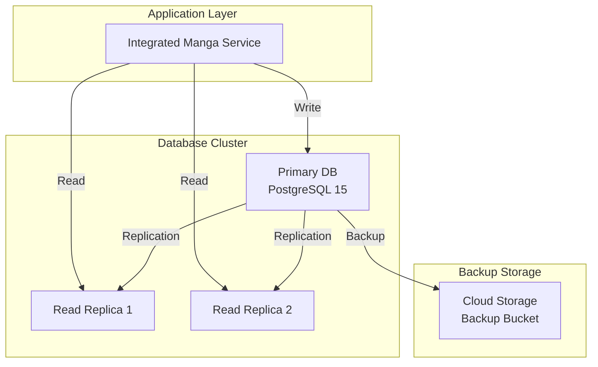

# AI漫画生成サービス データベース設計書

**文書管理情報**
- 文書ID: DB-DOC-001
- 作成日: 2025-01-20
- 版数: 1.0
- 承認者: 根岸祐樹
- 関連文書: SYS-DOC-001（システム設計書）、API-DOC-001（API設計書）

## 目次

- [1. データベース概要](#1-データベース概要)
  - [1.1 設計方針](#11-設計方針)
  - [1.2 システム構成](#12-システム構成)
- [2. データモデル設計](#2-データモデル設計)
  - [2.1 ER図](#21-er図)
  - [2.2 テーブル定義](#22-テーブル定義)
- [3. インデックス設計](#3-インデックス設計)
- [4. パーティショニング設計](#4-パーティショニング設計)
- [5. パフォーマンス設計](#5-パフォーマンス設計)
- [6. セキュリティ設計](#6-セキュリティ設計)
- [7. マイグレーション計画](#7-マイグレーション計画)

---

## 1. データベース概要

### 1.1 設計方針

| 項目 | 方針 | 理由 |
|------|------|------|
| DBMS | PostgreSQL 15 | JSONB、フルテキスト検索、高い拡張性 |
| データ保存期間 | 無料:30日、有料:無期限 | コスト最適化とサービス差別化 |
| メタデータ管理 | JSONB型で柔軟に保存 | スキーマ変更への対応力 |
| 読み取り負荷分散 | リードレプリカ構成 | 高可用性とパフォーマンス |
| トランザクション | 統合処理単位（1回） | 一貫性とパフォーマンス重視 |
| 削除方式 | 物理削除 | ストレージコスト最適化 |
| スケーラビリティ | 月次パーティショニング | 大量データの効率的管理 |
| バックアップ | PITR + 日次バックアップ | 柔軟な復旧ポイント |

### 1.2 システム構成

---

## 2. データモデル設計

### 2.1 ER図

### 2.2 テーブル定義

#### users（ユーザー）

| カラム名 | データ型 | 制約 | 説明 |
|---------|---------|------|------|
| user_id | UUID | PRIMARY KEY | ユーザー識別子 |
| email | VARCHAR(255) | UNIQUE, NOT NULL | メールアドレス |
| display_name | VARCHAR(100) | NOT NULL | 表示名 |
| account_type | VARCHAR(20) | NOT NULL, CHECK | free/premium/admin |
| firebase_claims | JSONB | | Firebase Custom Claims |
| created_at | TIMESTAMP | NOT NULL, DEFAULT NOW() | 作成日時 |
| updated_at | TIMESTAMP | NOT NULL, DEFAULT NOW() | 更新日時 |

**インデックス**:
- PRIMARY KEY (user_id)
- UNIQUE INDEX idx_users_email (email)
- INDEX idx_users_account_type (account_type)

#### manga_projects（漫画プロジェクト）

| カラム名 | データ型 | 制約 | 説明 |
|---------|---------|------|------|
| project_id | UUID | PRIMARY KEY | プロジェクト識別子 |
| user_id | UUID | NOT NULL, FOREIGN KEY | ユーザーID |
| title | VARCHAR(255) | NOT NULL | タイトル |
| status | VARCHAR(20) | NOT NULL | completed/processing/failed |
| metadata | JSONB | | メタデータ（スタイル、キャラクター数等） |
| settings | JSONB | | 生成設定 |
| total_pages | INTEGER | | 総ページ数 |
| visibility | VARCHAR(20) | DEFAULT 'private' | private/public/unlisted |
| created_at | TIMESTAMP | NOT NULL, DEFAULT NOW() | 作成日時 |
| updated_at | TIMESTAMP | NOT NULL, DEFAULT NOW() | 更新日時 |
| expires_at | TIMESTAMP | | 有効期限（無料ユーザー用） |

**インデックス**:
- PRIMARY KEY (project_id)
- INDEX idx_projects_user_id (user_id)
- INDEX idx_projects_status (status)
- INDEX idx_projects_created_at (created_at DESC)
- INDEX idx_projects_expires_at (expires_at) WHERE expires_at IS NOT NULL

#### generation_requests（生成リクエスト）

| カラム名 | データ型 | 制約 | 説明 |
|---------|---------|------|------|
| request_id | UUID | PRIMARY KEY | リクエスト識別子 |
| project_id | UUID | FOREIGN KEY | プロジェクトID |
| user_id | UUID | NOT NULL, FOREIGN KEY | ユーザーID |
| input_text | TEXT | NOT NULL | 入力テキスト |
| request_settings | JSONB | NOT NULL | リクエスト設定 |
| status | VARCHAR(20) | NOT NULL | queued/processing/completed/failed |
| current_module | INTEGER | DEFAULT 0 | 現在のモジュール番号 |
| priority | VARCHAR(10) | DEFAULT 'normal' | normal/high |
| webhook_url | VARCHAR(500) | | Webhook URL |
| started_at | TIMESTAMP | | 処理開始日時 |
| completed_at | TIMESTAMP | | 処理完了日時 |
| retry_count | INTEGER | DEFAULT 0 | リトライ回数 |
| error_message | TEXT | | エラーメッセージ |

**インデックス**:
- PRIMARY KEY (request_id)
- INDEX idx_requests_project_id (project_id)
- INDEX idx_requests_user_id (user_id)
- INDEX idx_requests_status (status)
- INDEX idx_requests_priority_created (priority DESC, created_at)

#### phase_executions（フェーズ実行）

| カラム名 | データ型 | 制約 | 説明 |
|---------|---------|------|------|
| execution_id | UUID | PRIMARY KEY | 実行識別子 |
| request_id | UUID | NOT NULL, FOREIGN KEY | リクエストID |
| phase_number | INTEGER | NOT NULL | フェーズ番号(1-7) |
| phase_name | VARCHAR(50) | NOT NULL | フェーズ名（phase1_concept/phase2_character/phase3_plot/phase4_name/phase5_scene/phase6_dialog/phase7_final） |
| status | VARCHAR(20) | NOT NULL | pending/processing/feedback_waiting/completed/failed |
| input_data | JSONB | | 入力データ |
| output_data | JSONB | | 出力データ |
| preview_url | VARCHAR(500) | | プレビューURL |
| feedback_timeout | TIMESTAMP | | フィードバックタイムアウト |
| started_at | TIMESTAMP | | 開始日時 |
| completed_at | TIMESTAMP | | 完了日時 |
| duration_ms | INTEGER | | 処理時間（ミリ秒） |
| retry_count | INTEGER | DEFAULT 0 | リトライ回数 |
| error_details | JSONB | | エラー詳細 |

**インデックス**:
- PRIMARY KEY (execution_id)
- UNIQUE INDEX idx_executions_request_phase (request_id, phase_number)
- INDEX idx_executions_status (status)
- INDEX idx_executions_feedback_timeout (feedback_timeout) WHERE feedback_timeout IS NOT NULL

#### feedback_requests（フィードバックリクエスト）

| カラム名 | データ型 | 制約 | 説明 |
|---------|---------|------|------|
| feedback_id | UUID | PRIMARY KEY | フィードバック識別子 |
| request_id | UUID | NOT NULL, FOREIGN KEY | リクエストID |
| phase_number | INTEGER | NOT NULL | フェーズ番号 |
| feedback_type | VARCHAR(20) | NOT NULL | natural_language/quick_option/skip |
| natural_language_input | TEXT | | 自然言語入力 |
| quick_option | VARCHAR(50) | | クイックオプション |
| intensity | DECIMAL(3,2) | CHECK (intensity BETWEEN 0.0 AND 1.0) | 修正強度 |
| target_elements | JSONB | | 対象要素リスト |
| status | VARCHAR(20) | NOT NULL | pending/processing/completed/failed |
| estimated_modification_time | INTEGER | | 予想修正時間(秒) |
| created_at | TIMESTAMP | NOT NULL, DEFAULT NOW() | 作成日時 |
| timeout_at | TIMESTAMP | | タイムアウト日時 |
| processed_at | TIMESTAMP | | 処理完了日時 |

**インデックス**:
- PRIMARY KEY (feedback_id)
- INDEX idx_feedback_request_phase (request_id, phase_number)
- INDEX idx_feedback_status (status)
- INDEX idx_feedback_timeout (timeout_at) WHERE timeout_at IS NOT NULL

#### modification_history（修正履歴）

| カラム名 | データ型 | 制約 | 説明 |
|---------|---------|------|------|
| modification_id | UUID | PRIMARY KEY | 修正識別子 |
| feedback_id | UUID | NOT NULL, FOREIGN KEY | フィードバックID |
| modification_type | VARCHAR(50) | NOT NULL | 修正タイプ |
| target_element | VARCHAR(100) | NOT NULL | 対象要素 |
| original_value | JSONB | | 元の値 |
| modified_value | JSONB | | 修正後の値 |
| confidence_score | DECIMAL(3,2) | CHECK (confidence_score BETWEEN 0.0 AND 1.0) | 信頼度スコア |
| llm_reasoning | TEXT | | LLMの推論ログ |
| applied_at | TIMESTAMP | NOT NULL, DEFAULT NOW() | 適用日時 |

**インデックス**:
- PRIMARY KEY (modification_id)
- INDEX idx_modifications_feedback (feedback_id)
- INDEX idx_modifications_type (modification_type)
- INDEX idx_modifications_element (target_element)

#### manga_files（漫画ファイル）

| カラム名 | データ型 | 制約 | 説明 |
|---------|---------|------|------|
| file_id | UUID | PRIMARY KEY | ファイル識別子 |
| project_id | UUID | NOT NULL, FOREIGN KEY | プロジェクトID |
| file_type | VARCHAR(20) | NOT NULL | pdf/webp/thumbnail |
| file_path | VARCHAR(500) | NOT NULL | Cloud Storage パス |
| file_size | BIGINT | | ファイルサイズ（バイト） |
| mime_type | VARCHAR(100) | | MIMEタイプ |
| page_number | INTEGER | | ページ番号（WebPの場合） |
| metadata | JSONB | | ファイルメタデータ |
| created_at | TIMESTAMP | NOT NULL, DEFAULT NOW() | 作成日時 |

**インデックス**:
- PRIMARY KEY (file_id)

#### phase_feedbacks（フェーズフィードバック）

| カラム名 | データ型 | 制約 | 説明 |
|---------|---------|------|------|
| feedback_id | UUID | PRIMARY KEY | フィードバック識別子 |
| request_id | UUID | NOT NULL, FOREIGN KEY | リクエストID |
| phase_number | INTEGER | NOT NULL, CHECK (1-7) | フェーズ番号 |
| user_id | UUID | NOT NULL, FOREIGN KEY | ユーザーID |
| feedback_type | VARCHAR(30) | NOT NULL | natural_language/quick_action/skip |
| natural_language | TEXT | | 自然言語フィードバック |
| quick_action | VARCHAR(50) | | クイックアクション選択 |
| parsed_intent | JSONB | | 解析済み意図（Gemini Pro解析結果） |
| applied_modifications | JSONB | | 適用された修正内容 |
| preview_version_before | UUID | FOREIGN KEY | 修正前プレビューバージョン |
| preview_version_after | UUID | FOREIGN KEY | 修正後プレビューバージョン |
| created_at | TIMESTAMP | NOT NULL, DEFAULT NOW() | 作成日時 |
| applied_at | TIMESTAMP | | 適用日時 |

**インデックス**:
- PRIMARY KEY (feedback_id)
- INDEX idx_phase_feedback_request (request_id, phase_number)
- INDEX idx_phase_feedback_user (user_id, created_at DESC)

#### chat_messages（チャットメッセージ）

| カラム名 | データ型 | 制約 | 説明 |
|---------|---------|------|------|
| message_id | UUID | PRIMARY KEY | メッセージ識別子 |
| session_id | UUID | NOT NULL | チャットセッションID |
| request_id | UUID | NOT NULL, FOREIGN KEY | リクエストID |
| phase_number | INTEGER | NOT NULL, CHECK (1-7) | フェーズ番号 |
| sender_type | VARCHAR(20) | NOT NULL | user/system/assistant |
| message_content | TEXT | NOT NULL | メッセージ内容 |
| message_type | VARCHAR(20) | NOT NULL | text/quick_action/status |
| interpreted_action | JSONB | | 解釈されたアクション |
| applied_changes | JSONB | | 適用された変更 |
| suggested_actions | JSONB | | 提案されたアクション |
| created_at | TIMESTAMP | NOT NULL, DEFAULT NOW() | 作成日時 |

**インデックス**:
- PRIMARY KEY (message_id)
- INDEX idx_chat_session (session_id, created_at)
- INDEX idx_chat_request_phase (request_id, phase_number)

#### phase_previews（フェーズプレビュー）

| カラム名 | データ型 | 制約 | 説明 |
|---------|---------|------|------|
| preview_id | UUID | PRIMARY KEY | プレビュー識別子 |
| request_id | UUID | NOT NULL, FOREIGN KEY | リクエストID |
| phase_number | INTEGER | NOT NULL, CHECK (1-7) | フェーズ番号 |
| version_id | UUID | NOT NULL, UNIQUE | バージョンID |
| preview_data | JSONB | NOT NULL | プレビューデータ |
| interactive_elements | JSONB | | インタラクティブ要素設定 |
| quality_level | INTEGER | CHECK (1-5) | 品質レベル |
| device_capability | DECIMAL(3,2) | | デバイス性能スコア |
| rendering_time_ms | INTEGER | | レンダリング時間 |
| created_at | TIMESTAMP | NOT NULL, DEFAULT NOW() | 作成日時 |

**インデックス**:
- PRIMARY KEY (preview_id)
- UNIQUE INDEX idx_preview_version (version_id)
- INDEX idx_preview_request_phase (request_id, phase_number, created_at DESC)

#### preview_versions（プレビューバージョン管理）

| カラム名 | データ型 | 制約 | 説明 |
|---------|---------|------|------|
| version_id | UUID | PRIMARY KEY | バージョン識別子 |
| request_id | UUID | NOT NULL, FOREIGN KEY | リクエストID |
| phase_number | INTEGER | NOT NULL, CHECK (1-7) | フェーズ番号 |
| parent_version_id | UUID | FOREIGN KEY | 親バージョンID（ブランチ用） |
| version_number | INTEGER | NOT NULL | バージョン番号 |
| change_description | TEXT | | 変更内容説明 |
| version_data | JSONB | NOT NULL | バージョンデータ |
| quality_score | DECIMAL(3,2) | | 品質スコア |
| is_branch | BOOLEAN | DEFAULT FALSE | ブランチフラグ |
| branch_name | VARCHAR(100) | | ブランチ名 |
| created_by | UUID | NOT NULL, FOREIGN KEY | 作成ユーザーID |
| created_at | TIMESTAMP | NOT NULL, DEFAULT NOW() | 作成日時 |
| expired_at | TIMESTAMP | | 有効期限（60日後） |

**インデックス**:
- PRIMARY KEY (version_id)
- INDEX idx_version_request_phase (request_id, phase_number)
- INDEX idx_version_parent (parent_version_id) WHERE parent_version_id IS NOT NULL
- INDEX idx_version_expired (expired_at) WHERE expired_at IS NOT NULL
- INDEX idx_files_project_id (project_id)
- INDEX idx_files_type (file_type)
- INDEX idx_files_page (project_id, page_number) WHERE page_number IS NOT NULL

#### user_quotas（ユーザークォータ）

| カラム名 | データ型 | 制約 | 説明 |
|---------|---------|------|------|
| quota_id | UUID | PRIMARY KEY | クォータ識別子 |
| user_id | UUID | NOT NULL, FOREIGN KEY | ユーザーID |
| quota_type | VARCHAR(20) | NOT NULL | daily/monthly |
| limit_value | INTEGER | NOT NULL | 制限値 |
| used_value | INTEGER | DEFAULT 0 | 使用済み値 |
| reset_at | TIMESTAMP | NOT NULL | リセット日時 |
| created_at | TIMESTAMP | NOT NULL, DEFAULT NOW() | 作成日時 |
| updated_at | TIMESTAMP | NOT NULL, DEFAULT NOW() | 更新日時 |

**インデックス**:
- PRIMARY KEY (quota_id)
- UNIQUE INDEX idx_quotas_user_type (user_id, quota_type)
- INDEX idx_quotas_reset (reset_at)

#### api_usage_logs（API使用ログ）

| カラム名 | データ型 | 制約 | 説明 |
|---------|---------|------|------|
| log_id | UUID | PRIMARY KEY | ログ識別子 |
| user_id | UUID | FOREIGN KEY | ユーザーID |
| endpoint | VARCHAR(255) | NOT NULL | APIエンドポイント |
| method | VARCHAR(10) | NOT NULL | HTTPメソッド |
| status_code | INTEGER | NOT NULL | ステータスコード |
| response_time_ms | INTEGER | | レスポンス時間 |
| request_size | INTEGER | | リクエストサイズ |
| response_size | INTEGER | | レスポンスサイズ |
| ip_address | INET | | IPアドレス |
| user_agent | TEXT | | User-Agent |
| created_at | TIMESTAMP | NOT NULL, DEFAULT NOW() | 作成日時 |

**パーティショニング**: 月次パーティション（created_at）

**インデックス**:
- PRIMARY KEY (log_id, created_at)
- INDEX idx_logs_user_id (user_id, created_at DESC)
- INDEX idx_logs_endpoint (endpoint, created_at DESC)

#### generation_errors（生成エラー）

| カラム名 | データ型 | 制約 | 説明 |
|---------|---------|------|------|
| error_id | UUID | PRIMARY KEY | エラー識別子 |
| request_id | UUID | FOREIGN KEY | リクエストID |
| module_number | INTEGER | | モジュール番号 |
| error_code | VARCHAR(50) | NOT NULL | エラーコード |
| error_message | TEXT | NOT NULL | エラーメッセージ |
| error_details | JSONB | | エラー詳細 |
| stack_trace | TEXT | | スタックトレース |
| created_at | TIMESTAMP | NOT NULL, DEFAULT NOW() | 発生日時 |

**インデックス**:
- PRIMARY KEY (error_id)
- INDEX idx_errors_request_id (request_id)
- INDEX idx_errors_code (error_code)

#### module_metrics（モジュールメトリクス）

| カラム名 | データ型 | 制約 | 説明 |
|---------|---------|------|------|
| metric_id | UUID | PRIMARY KEY | メトリクス識別子 |
| module_id | UUID | NOT NULL, FOREIGN KEY | モジュールID |
| metric_name | VARCHAR(100) | NOT NULL | メトリクス名 |
| metric_value | NUMERIC | NOT NULL | メトリクス値 |
| unit | VARCHAR(20) | | 単位 |
| created_at | TIMESTAMP | NOT NULL, DEFAULT NOW() | 記録日時 |

**インデックス**:
- PRIMARY KEY (metric_id)
- INDEX idx_metrics_module_id (module_id)
- INDEX idx_metrics_name (metric_name)

#### preview_versions（プレビューバージョン管理）

| カラム名 | データ型 | 制約 | 説明 |
|---------|---------|------|------|
| version_id | UUID | PRIMARY KEY | バージョン識別子 |
| request_id | UUID | NOT NULL, FOREIGN KEY | リクエストID |
| phase | INTEGER | NOT NULL, CHECK (phase BETWEEN 1 AND 7) | フェーズ番号 |
| parent_version_id | UUID | FOREIGN KEY | 親バージョンID（ブランチ管理） |
| version_data | JSONB | NOT NULL | プレビューデータ |
| change_description | TEXT | NOT NULL | 変更内容説明 |
| quality_level | INTEGER | CHECK (quality_level BETWEEN 1 AND 5) | 品質レベル |
| user_feedback | TEXT | | ユーザーフィードバック |
| quality_score | DECIMAL(3,2) | CHECK (quality_score BETWEEN 0.0 AND 1.0) | 品質スコア |
| is_automatic | BOOLEAN | DEFAULT FALSE | 自動生成フラグ |
| created_at | TIMESTAMP | NOT NULL, DEFAULT NOW() | 作成日時 |

**インデックス**:
- PRIMARY KEY (version_id)
- INDEX idx_versions_request_phase (request_id, phase)
- INDEX idx_versions_parent (parent_version_id)
- INDEX idx_versions_created (created_at DESC)
- INDEX idx_versions_quality (quality_score DESC)

#### preview_interactions（プレビューインタラクション）

| カラム名 | データ型 | 制約 | 説明 |
|---------|---------|------|------|
| interaction_id | UUID | PRIMARY KEY | インタラクション識別子 |
| version_id | UUID | NOT NULL, FOREIGN KEY | バージョンID |
| element_id | VARCHAR(100) | NOT NULL | 要素ID |
| change_type | VARCHAR(50) | NOT NULL | 変更タイプ |
| change_data | JSONB | NOT NULL | 変更データ |
| user_id | UUID | NOT NULL, FOREIGN KEY | ユーザーID |
| applied_at | TIMESTAMP | NOT NULL, DEFAULT NOW() | 適用日時 |
| reverted_at | TIMESTAMP | | 取消日時 |

**インデックス**:
- PRIMARY KEY (interaction_id)
- INDEX idx_interactions_version (version_id)
- INDEX idx_interactions_element (element_id)
- INDEX idx_interactions_user_applied (user_id, applied_at DESC)

#### preview_quality_settings（プレビュー品質設定）

| カラム名 | データ型 | 制約 | 説明 |
|---------|---------|------|------|
| setting_id | UUID | PRIMARY KEY | 設定識別子 |
| user_id | UUID | NOT NULL, FOREIGN KEY | ユーザーID |
| device_capability | DECIMAL(3,2) | CHECK (device_capability BETWEEN 0.0 AND 1.0) | デバイス性能スコア |
| network_speed | INTEGER | | ネットワーク速度(Kbps) |
| preferred_quality | INTEGER | CHECK (preferred_quality BETWEEN 1 AND 5) | 優先品質レベル |
| auto_adapt | BOOLEAN | DEFAULT TRUE | 自動適応フラグ |
| last_updated | TIMESTAMP | NOT NULL, DEFAULT NOW() | 最終更新日時 |

**インデックス**:
- PRIMARY KEY (setting_id)
- UNIQUE INDEX idx_quality_user (user_id)
- INDEX idx_quality_capability (device_capability DESC)

#### preview_cache_metadata（プレビューキャッシュメタデータ）

| カラム名 | データ型 | 制約 | 説明 |
|---------|---------|------|------|
| cache_id | UUID | PRIMARY KEY | キャッシュ識別子 |
| cache_key | VARCHAR(255) | UNIQUE, NOT NULL | キャッシュキー |
| version_id | UUID | FOREIGN KEY | バージョンID |
| phase | INTEGER | NOT NULL | フェーズ番号 |
| quality_level | INTEGER | NOT NULL | 品質レベル |
| signed_url | TEXT | NOT NULL | 署名付きURL |
| content_type | VARCHAR(100) | NOT NULL | コンテンツタイプ |
| file_size | BIGINT | | ファイルサイズ |
| expires_at | TIMESTAMP | NOT NULL | 有効期限 |
| created_at | TIMESTAMP | NOT NULL, DEFAULT NOW() | 作成日時 |
| last_accessed | TIMESTAMP | | 最終アクセス日時 |

**インデックス**:
- PRIMARY KEY (cache_id)
- UNIQUE INDEX idx_cache_key (cache_key)
- INDEX idx_cache_version (version_id)
- INDEX idx_cache_phase_quality (phase, quality_level)
- INDEX idx_cache_expires (expires_at)

#### preview_branch_metadata（プレビューブランチメタデータ）

| カラム名 | データ型 | 制約 | 説明 |
|---------|---------|------|------|
| branch_id | UUID | PRIMARY KEY | ブランチ識別子 |
| version_id | UUID | NOT NULL, FOREIGN KEY | バージョンID |
| branch_name | VARCHAR(100) | | ブランチ名 |
| is_main_branch | BOOLEAN | DEFAULT FALSE | メインブランチフラグ |
| branch_depth | INTEGER | DEFAULT 0 | ブランチ深度 |
| child_count | INTEGER | DEFAULT 0 | 子ブランチ数 |
| created_at | TIMESTAMP | NOT NULL, DEFAULT NOW() | 作成日時 |

**インデックス**:
- PRIMARY KEY (branch_id)
- INDEX idx_branch_version (version_id)
- INDEX idx_branch_main (is_main_branch) WHERE is_main_branch = TRUE
- INDEX idx_branch_depth (branch_depth)

---

## 3. インデックス設計

### 3.1 インデックス戦略

| テーブル | インデックス | 用途 | 種類 |
|---------|------------|------|------|
| users | email | ログイン時の検索 | UNIQUE |
| manga_projects | (user_id, created_at DESC) | ユーザーの作品一覧 | BTREE |
| manga_projects | expires_at | 期限切れ削除バッチ | BTREE PARTIAL |
| generation_requests | (status, priority DESC, created_at) | キュー処理 | BTREE |
| processing_modules | (request_id, module_number) | モジュール順序管理 | UNIQUE |
| api_usage_logs | (user_id, created_at DESC) | 使用状況分析 | BTREE |

### 3.2 パフォーマンス最適化戦略

**複合インデックス戦略**
- ユーザー別、ステータス別、作成日時順でのアクセスパターンを考慮した複合インデックス設計
- クエリ実行頻度とデータアクセスパターンに基づく最適化

**JSONB最適化アプローチ**
- メタデータフィールドに対するGINインデックスによる高速JSON検索実現
- 柔軟なスキーマ変更とクエリパフォーマンスのバランス

**全文検索設計方針**
- 日本語テキスト対応のフルテキスト検索インデックス
- タイトル検索における高速化とユーザビリティ向上

**部分インデックス活用**
- アクティブなリクエストのみに限定したインデックスによる効率化
- ストレージ使用量削減とメンテナンス負荷軽減

---

## 5. パフォーマンス設計

### 5.1 クエリ最適化

#### 主要クエリパターンの最適化戦略

**ユーザー作品一覧取得の最適化**
- ユーザーID、有効期限、作成日時による効率的なフィルタリング
- ページネーション対応とインデックス活用による高速化
- メタデータのJSONB抽出パフォーマンス考慮

**処理状況確認の設計方針**
- リクエストとモジュール情報の効率的な結合処理
- リアルタイム状況更新への対応
- 主キーとモジュール番号による高速アクセス

### 5.2 接続管理設計

**接続プール戦略**
- 同時接続数制御による適切なリソース管理
- タイムアウト設定によるデッドロック回避
- 接続の再利用とライフサイクル管理

**リードレプリカ負荷分散方針**
- ラウンドロビン方式による均等な負荷分散
- ヘルスチェックによる可用性確保
- 障害時の自動フェイルオーバー機構

### 5.3 キャッシュ戦略

| データ種別 | キャッシュ場所 | TTL | 無効化タイミング |
|-----------|--------------|-----|---------------|
| ユーザー情報 | PostgreSQL Materialized View | 1時間（リフレッシュ） | 更新時 |
| プロジェクト一覧 | アプリケーションメモリ | 5分 | 作成/更新時 |
| 処理状況 | PostgreSQL LISTEN/NOTIFY | 即時 | フェーズ完了時 |
| システム設定 | アプリケーション | 1時間 | デプロイ時 |

---

## 6. セキュリティ設計

### 6.1 アクセス制御設計

**行レベルセキュリティ（RLS）戦略**
- ユーザーデータの完全な分離とプライバシー保護
- アプリケーション層とデータベース層での二重セキュリティ
- 管理者権限の適切な分離と監査可能性

**アクセス制御ポリシー**
- ユーザー単位でのデータアクセス制限
- ロールベースでの柔軟な権限管理
- セキュリティコンテキストの動的な適用

### 6.2 データ暗号化

| 項目 | 暗号化方式 | 実装 |
|------|-----------|------|
| 保存時暗号化 | AES-256 | Cloud SQL自動暗号化 |
| カラムレベル暗号化 | pgcrypto | 個人情報フィールド |
| 接続暗号化 | TLS 1.3 | SSL証明書必須 |
| バックアップ暗号化 | AES-256 | Cloud Storage暗号化 |

### 6.3 監査設計

**監査ログ戦略**
- 全データベース操作の追跡可能性確保
- 変更履歴の永続化と検索可能性
- セキュリティインシデント対応のための証跡管理

**監査トリガー設計方針**
- 重要テーブルの全操作（挿入・更新・削除）の自動記録
- 変更前後のデータ差分保存
- ユーザー識別とタイムスタンプの正確な記録

**監査対象とガバナンス**
- 個人情報を含むテーブルの優先的監査
- データ保護規制への準拠
- 定期的な監査ログレビューとアラート機能

---

---

## 7. マイグレーション計画

### 7.1 マイグレーション戦略

**スキーマ変更管理方針**
- バージョン管理システムとの統合による変更履歴の一元管理
- 環境別の段階的デプロイとリスク最小化
- 本番環境での変更窓口と承認プロセス

**マイグレーション実行戦略**
- 開発環境での自動実行による開発効率化
- ステージング環境での手動承認による品質保証
- 本番環境での計画的実行とダウンタイム最小化

### 7.2 マイグレーション構成設計

**マイグレーションファイル体系**
- 段階的な機能追加に対応した論理的分割
- 初期スキーマ、クォータ機能、パーティション、インデックス、監査機能の順序
- 依存関係を考慮した実行順序の最適化

### 7.3 ロールバック戦略

**安全なロールバック方針**
- マイグレーション履歴の追跡可能性
- 段階的なロールバック実行とデータ整合性確認
- スキーマオブジェクト（インデックス、ルール、トリガー）の状態検証

### 7.4 データライフサイクル管理

**期限切れデータの削除戦略**
- 無料ユーザーデータの30日保持ルールに基づく自動削除
- アカウントタイプ別の差別化されたデータ保持ポリシー
- 削除処理の統計情報とログ記録による運用監視

**ログデータのアーカイブ戦略**  
- 長期保存不要なログデータの定期削除
- パーティション単位での効率的な削除処理
- 運用統計とパフォーマンスメトリクスの保持

**自動化とスケジューリング**
- 日次バッチ処理による定期的な自動実行
- 深夜帯実行によるサービス影響の最小化
- 削除処理結果の監視とアラート機能

---

## 改訂履歴

| 版数 | 日付 | 変更内容 | 担当者 |
|------|------|----------|--------|
| 1.0 | 2025-01-20 | 初版作成 | Claude Code |

---

**文書承認**
- データベースアーキテクト: [署名] 日付: [日付]
- システムアーキテクト: [署名] 日付: [日付]
- セキュリティ責任者: [署名] 日付: [日付]
