# インフラ設計書 - 全体概要

> **TL;DR**: Google Cloud Platform（GCP）ベースのインフラ設計書群。インフラ概要・基本設計、デプロイメント設計・CI/CD、監視・ログ・アラート、GCP/AWSサービス統合の4文書で構成。Cloud Run + Cloud SQL + Cloud Storageによるスタートアップ最適化構成を実現。

## 目次

このディレクトリには、AI漫画生成サービスのインフラ設計に関する分割された設計書が含まれています。

### 設計書一覧

1. **[インフラ概要・基本設計](./infrastructure-overview.md)** (INF-OVW-001)
   - 設計方針とアーキテクチャ概要
   - ネットワーク設計（VPC、サブネット、ファイアウォール）
   - コンピューティング設計（Cloud Run、オートスケーリング）
   - データストレージ設計（Cloud SQL、Cloud Storage、Cloud Tasks）

2. **[デプロイメント設計・CI/CD](./deployment.md)** (INF-DEP-001)
   - CI/CDパイプライン設計
   - 環境別デプロイフロー
   - 段階的ロールアウトとロールバック戦略
   - セキュリティとガバナンス

3. **[監視・ログ・アラート設計](./monitoring.md)** (INF-MON-001)
   - 監視システム概要とメトリクス体系
   - ログ管理設計（集約、分析、保存）
   - パフォーマンス監視（アプリ、インフラ、ビジネス）
   - アラート管理とダッシュボード

4. **[GCP/AWSサービス統合](./cloud-services.md)** (INF-CLD-001)
   - Google Cloud Platformサービス統合
   - AWSサービス統合（将来考慮）
   - 外部API統合（AI、Firebase、サードパーティ）
   - コスト最適化戦略

5. **[統合インフラ設計書](./legacy-infrastructure-design.md)** (INF-DOC-001)
   - 元の統合設計書（参考用）
   - 全体の詳細な統合設計

## 🏗️ アーキテクチャ概要

```mermaid
graph TB
    subgraph "Internet"
        U[Users]
    end

    subgraph "Google Cloud Platform"
        LB[Cloud Load Balancer]
        FH[Firebase Hosting]

        subgraph "VPC: manga-service-vpc (10.0.0.0/16)"
            subgraph "Public Subnet (10.0.1.0/24)"
                CR[Cloud Run Services]
            end

            subgraph "Private Subnet (10.0.2.0/24)"
                DB[Cloud SQL PostgreSQL]
            end
        end

        subgraph "Storage"
            CS[Cloud Storage]
        end

        subgraph "Async Processing"
            QT[Cloud Tasks Queue]
        end

        subgraph "External APIs"
            GM[Gemini Pro]
            IM[Imagen 4]
        end
    end

    U --> FH
    U --> LB
    LB --> CR
    CR --> DB
    CR --> CS
    CR --> QT
    CR --> GM
    CR --> IM
```

## ⚙️ 設計方針

| 方針 | 内容 | 理由 |
|------|------|------|
| スタートアップ最適化 | 軽量構成でスタート、段階的拡張 | 初期コスト抑制、迅速なMVP展開 |
| Google Cloud ネイティブ | GCP標準サービス活用 | 運用負荷削減、統合管理 |
| シンプルネットワーク | 単一VPC、必要最小限の分離 | 複雑性排除、トラブルシューティング簡素化 |
| フルマネージド優先 | Cloud SQL・Cloud Storage・Cloud Tasks活用 | 運用工数削減、自動化推進 |

## 📊 主要サービス構成

### コンピューティング
- **Cloud Run**: マイクロサービス実行環境
- **Firebase Hosting**: フロントエンド配信

### データストレージ
- **Cloud SQL PostgreSQL**: データベース
- **Cloud Storage**: ファイルストレージ
- **Cloud Tasks**: 非同期ジョブキュー

### セキュリティ・監視
- **Secret Manager**: 機密情報管理
- **Cloud Monitoring**: 監視・アラート
- **Cloud Logging**: ログ集約・分析

## 🔗 関連文書

- [要件定義書](../01-requirements/README.md)
- [データベース設計書](../04-database/README.md)
- [セキュリティ設計書](../08-security/README.md)
- [テスト設計書](../09-testing/README.md)

## 📝 改訂履歴

| 版数 | 日付 | 変更内容 | 担当者 |
|------|------|----------|--------|
| 1.0 | 2025-01-20 | 基本インフラ設計完成 | Claude Code |
| 2.0 | 2025-01-20 | 開発環境設計統合 | Claude Code |

---

**メタデータ**
- プロジェクト: AI Manga Generator with HITL
- フェーズ: インフラ設計フェーズ
- 最終更新: 2025-01-20
- ドキュメント形式: Markdown