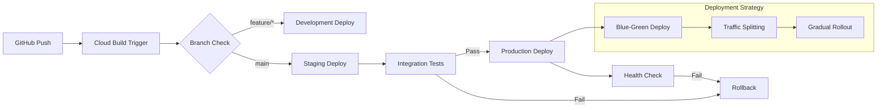

# デプロイメント設計・CI/CD

> **TL;DR**: Cloud Build基盤のCI/CDパイプライン設計。段階的ロールアウト（10%→50%→100%）、ブルーグリーンデプロイメント、自動ロールバック（エラー率>1%）、環境別管理（dev/staging/prod）で構成。品質保証（80%カバレッジ）、セキュリティスキャン、20分ビルドタイムアウト、E2_HIGHCPU_8マシン。セキュリティガバナンス（環境別サービスアカウント）、シークレット管理（Secret Manager統合）、監査ログ7年保持。

## ナビゲーション
- [← 親文書に戻る](./09.インフラ設計書.md)
- [← インフラ概要](./infrastructure-overview.md)
- [→ 監視・ログ設計](./monitoring.md)
- [→ クラウドサービス統合](./cloud-services.md)

---

## 目次

- [1. CI/CD設計](#1-cicd設計)
  - [1.1 Cloud Build設定](#11-cloud-build設定)
  - [1.2 デプロイメント戦略](#12-デプロイメント戦略)
  - [1.3 環境管理](#13-環境管理)
- [2. 環境別デプロイフロー](#2-環境別デプロイフロー)
  - [2.1 開発環境デプロイ](#21-開発環境デプロイ)
  - [2.2 ステージング環境デプロイ](#22-ステージング環境デプロイ)
  - [2.3 本番環境デプロイ](#23-本番環境デプロイ)
- [3. デプロイメント最適化](#3-デプロイメント最適化)
  - [3.1 段階的ロールアウト](#31-段階的ロールアウト)
  - [3.2 ロールバック戦略](#32-ロールバック戦略)
  - [3.3 パフォーマンス監視](#33-パフォーマンス監視)
- [4. セキュリティとガバナンス](#4-セキュリティとガバナンス)
  - [4.1 認証・認可](#41-認証認可)
  - [4.2 シークレット管理](#42-シークレット管理)
  - [4.3 監査とコンプライアンス](#43-監査とコンプライアンス)

---

## 1. CI/CD設計

### 1.1 Cloud Build設定

#### CI/CDパイプライン設計原則

**ビルドステージ構成:**
1. **品質保証ステージ**
   - ユニットテスト実行でコード品質確保
   - カバレッジレポート生成でテスト範囲可視化
   - セキュリティスキャンで脆弱性早期発見

2. **コンテナイメージ管理**
   - マルチタグ付与でバージョン管理を簡素化
   - 短縮コミットID使用でトレーサビリティ向上
   - Container Registryへのプッシュで集中管理

3. **デプロイメント戦略**
   - Cloud Runマネージドプラットフォームで運用負荷軽減
   - リソース制限設定でコスト制御とパフォーマンスバランス
   - オートスケーリング設定で負荷変動対応

**パフォーマンス最適化:**
- 高性能ビルドマシン使用でビルド時間短縮
- Cloud Logging一元化でログ管理を効率化
- 並列処理可能なステップの最適化配置

#### Cloud Buildパイプライン設定
```yaml
# cloudbuild.yaml
steps:
  # 1. 依存関係インストール
  - name: 'python:3.11'
    entrypoint: 'bash'
    args:
      - '-c'
      - |
        pip install -r backend/requirements.txt
        pip install pytest pytest-cov
    
  # 2. ユニットテスト実行
  - name: 'python:3.11'
    entrypoint: 'bash'
    args:
      - '-c'
      - |
        cd backend
        pytest tests/ \
          --cov=./ \
          --cov-report=xml \
          --cov-fail-under=80
    
  # 3. セキュリティスキャン
  - name: 'python:3.11'
    entrypoint: 'bash'
    args:
      - '-c'
      - |
        pip install bandit safety
        bandit -r backend/app/
        safety check -r backend/requirements.txt
    
  # 4. Dockerイメージビルド
  - name: 'gcr.io/cloud-builders/docker'
    args:
      - 'build'
      - '-t'
      - 'gcr.io/$PROJECT_ID/manga-service:${SHORT_SHA}'
      - '-t'
      - 'gcr.io/$PROJECT_ID/manga-service:latest'
      - '.'
    
  # 5. イメージプッシュ
  - name: 'gcr.io/cloud-builders/docker'
    args:
      - 'push'
      - '--all-tags'
      - 'gcr.io/$PROJECT_ID/manga-service'
    
  # 6. Cloud Runデプロイ
  - name: 'gcr.io/cloud-builders/gcloud'
    args:
      - 'run'
      - 'deploy'
      - 'manga-service-${_ENVIRONMENT}'
      - '--image=gcr.io/$PROJECT_ID/manga-service:${SHORT_SHA}'
      - '--region=asia-northeast1'
      - '--platform=managed'
      - '--allow-unauthenticated'
      - '--set-env-vars=ENVIRONMENT=${_ENVIRONMENT}'
      - '--memory=2Gi'
      - '--cpu=1'
      - '--max-instances=50'
      - '--min-instances=1'

substitutions:
  _ENVIRONMENT: 'dev'

timeout: 1200s  # 20分タイムアウト

options:
  logging: CLOUD_LOGGING_ONLY
  machineType: 'E2_HIGHCPU_8'
```

### 1.2 デプロイメント戦略

#### 環境別デプロイフロー


#### 段階的ロールアウト
```yaml
Deployment Strategy:
  Development:
    Trigger: feature/* branch push
    Target: dev-phase*-service
    Traffic: 100%
    
  Staging:
    Trigger: main branch push
    Target: staging-phase*-service
    Testing: Automated integration tests
    
  Production:
    Trigger: Manual approval after staging
    Strategy: Blue-Green with traffic splitting
    Rollout:
      - Phase 1: 10% traffic for 10 minutes
      - Phase 2: 50% traffic for 30 minutes  
      - Phase 3: 100% traffic
    Rollback: Automatic if error rate > 1%
```

### 1.3 環境管理

#### 環境管理設計原則

**環境別設定戦略:**
- 環境識別子で動作モードを制御
- ログレベルの環境別最適化（開発時詳細、本番簡素）
- ホスト情報の環境固有設定で適切なルーティング

**シークレット管理戦略:**
- Secret Manager参照形式でセキュリティを強化
- 最新バージョン自動参照でローテーション対応
- プロジェクトID変数使用で環境間ポータビリティ向上

**運用効率化:**
- 環境固有設定の統一管理で運用負荷軽減
- シークレット参照の標準化でセキュリティポリシー統一

#### 環境設定ファイル
```yaml
# environments/development.yaml
environment:
  name: development
  log_level: DEBUG
  
cloud_run:
  service_name: manga-service-dev
  memory: 2Gi
  cpu: 1
  min_instances: 0
  max_instances: 10
  
database:
  instance: manga-db-dev
  name: manga_dev
  
secrets:
  app_secret: projects/${PROJECT_ID}/secrets/app-secret-dev/versions/latest
  database_url: projects/${PROJECT_ID}/secrets/db-url-dev/versions/latest

---
# environments/production.yaml
environment:
  name: production
  log_level: INFO
  
cloud_run:
  service_name: manga-service-prod
  memory: 4Gi
  cpu: 2
  min_instances: 1
  max_instances: 100
  
database:
  instance: manga-db-prod
  name: manga_prod
  
secrets:
  app_secret: projects/${PROJECT_ID}/secrets/app-secret-prod/versions/latest
  database_url: projects/${PROJECT_ID}/secrets/db-url-prod/versions/latest
```

---

## 2. 環境別デプロイフロー

### 2.1 開発環境デプロイ

#### 開発環境デプロイ戦略
```yaml
Development Deployment:
  Trigger:
    - Feature branch push
    - Pull request creation
  
  Process:
    1. Automated testing
    2. Security scanning
    3. Container build
    4. Deploy to dev environment
    5. Integration test execution
  
  Configuration:
    Auto-scaling: Disabled
    Resources: Minimal (1 CPU, 2GB RAM)
    Traffic: 100% (no splitting)
    Monitoring: Basic
    
  Quality Gates:
    - Unit test coverage > 80%
    - No critical security vulnerabilities
    - Basic integration tests pass
```

#### 開発環境特別設定
```bash
#!/bin/bash
# deploy-development.sh

set -e

ENVIRONMENT="development"
SERVICE_NAME="manga-service-dev"
IMAGE_TAG="${SHORT_SHA:-latest}"

echo "=== Deploying to Development Environment ==="

# 開発環境向け設定
gcloud run deploy $SERVICE_NAME \
  --image gcr.io/$PROJECT_ID/manga-service:$IMAGE_TAG \
  --region asia-northeast1 \
  --platform managed \
  --allow-unauthenticated \
  --set-env-vars="ENVIRONMENT=$ENVIRONMENT,LOG_LEVEL=DEBUG" \
  --memory 2Gi \
  --cpu 1 \
  --min-instances 0 \
  --max-instances 10 \
  --timeout 300 \
  --concurrency 80

echo "=== Development deployment completed ==="
```

### 2.2 ステージング環境デプロイ

#### ステージング環境戦略
```yaml
Staging Deployment:
  Trigger:
    - Main branch merge
    - Release candidate creation
  
  Process:
    1. Full test suite execution
    2. Performance testing
    3. Security validation
    4. Container build with staging tag
    5. Deploy to staging environment
    6. End-to-end testing
    7. Performance benchmarking
  
  Configuration:
    Auto-scaling: Production-like
    Resources: Production equivalent
    Traffic: Production simulation
    Monitoring: Full monitoring stack
    
  Quality Gates:
    - All tests pass (unit, integration, e2e)
    - Performance benchmarks met
    - Security scan clean
    - Manual approval required for production
```

#### ステージング環境設定
```yaml
# staging deployment configuration
Staging Environment:
  Resources:
    CPU: 2 vCPU
    Memory: 4Gi
    Min Instances: 1
    Max Instances: 50
    
  Networking:
    VPC: manga-service-vpc
    Subnet: manga-private
    
  Database:
    Instance: manga-db-staging
    Backup: Enabled
    
  Monitoring:
    Logs: Cloud Logging
    Metrics: Cloud Monitoring
    Alerts: Enabled
    
  Testing:
    Load Testing: 50 concurrent users
    Duration: 10 minutes
    Success Criteria: < 2s response time, < 1% error rate
```

### 2.3 本番環境デプロイ

#### 本番環境デプロイ戦略
```yaml
Production Deployment:
  Trigger:
    - Manual approval after staging success
    - Release tag creation
  
  Process:
    1. Pre-deployment validation
    2. Blue-green deployment
    3. Traffic shifting (10% → 50% → 100%)
    4. Health monitoring
    5. Rollback capability
  
  Configuration:
    Auto-scaling: Full production settings
    Resources: Optimized for production load
    Traffic: Gradual traffic shifting
    Monitoring: Comprehensive monitoring
    
  Quality Gates:
    - Zero downtime requirement
    - Performance SLA compliance
    - Error rate < 0.1%
    - Automatic rollback if issues detected
```

#### 本番デプロイメントスクリプト
```bash
#!/bin/bash
# deploy-production.sh

set -e

ENVIRONMENT="production"
SERVICE_NAME="manga-service-prod"
IMAGE_TAG="${SHORT_SHA}"
TRAFFIC_PERCENTAGE=${1:-10}  # デフォルト10%から開始

echo "=== Production Deployment Phase: ${TRAFFIC_PERCENTAGE}% ==="

# 本番環境設定値
CPU_LIMIT="2"
MEMORY_LIMIT="4Gi"
MIN_INSTANCES="2"
MAX_INSTANCES="100"
CONCURRENCY="50"
TIMEOUT="900"

# Blue-Green デプロイメント
NEW_REVISION="manga-service-prod-${IMAGE_TAG}"

gcloud run deploy $SERVICE_NAME \
  --image gcr.io/$PROJECT_ID/manga-service:$IMAGE_TAG \
  --region asia-northeast1 \
  --platform managed \
  --no-allow-unauthenticated \
  --set-env-vars="ENVIRONMENT=$ENVIRONMENT,LOG_LEVEL=INFO" \
  --memory $MEMORY_LIMIT \
  --cpu $CPU_LIMIT \
  --min-instances $MIN_INSTANCES \
  --max-instances $MAX_INSTANCES \
  --timeout $TIMEOUT \
  --concurrency $CONCURRENCY \
  --revision-suffix $IMAGE_TAG

# トラフィック分割
gcloud run services update-traffic $SERVICE_NAME \
  --to-revisions="$NEW_REVISION=$TRAFFIC_PERCENTAGE" \
  --region asia-northeast1

echo "=== Monitoring new revision for 10 minutes ==="
sleep 600  # 10分間監視

# ヘルスチェック
ERROR_RATE=$(gcloud logging read "resource.type=cloud_run_revision AND resource.labels.service_name=$SERVICE_NAME" \
  --limit 1000 --format="value(severity)" | grep -c ERROR || echo 0)

if [ $ERROR_RATE -gt 10 ]; then
  echo "ERROR: High error rate detected. Rolling back..."
  gcloud run services update-traffic $SERVICE_NAME \
    --to-latest=false \
    --region asia-northeast1
  exit 1
fi

echo "=== Production deployment phase ${TRAFFIC_PERCENTAGE}% completed ==="
```

---

## 3. デプロイメント最適化

### 3.1 段階的ロールアウト

#### カナリアデプロイメント戦略
```yaml
Canary Deployment Strategy:
  Phase 1 - Initial Canary (10%):
    Duration: 10 minutes
    Monitoring:
      - Error rate < 0.5%
      - Response time < 2s
      - CPU usage < 70%
    
  Phase 2 - Extended Canary (50%):
    Duration: 30 minutes
    Monitoring:
      - Error rate < 0.3%
      - Response time < 1.5s
      - Memory usage < 80%
    
  Phase 3 - Full Rollout (100%):
    Duration: Continuous
    Monitoring:
      - Error rate < 0.1%
      - Response time < 1s
      - All SLIs within targets
    
  Rollback Triggers:
    - Error rate > 1%
    - Response time > 5s
    - CPU usage > 90%
    - Manual trigger
```

#### トラフィック制御スクリプト
```python
# traffic_manager.py
import time
import logging
from google.cloud import run_v2
from google.cloud import monitoring_v3

class TrafficManager:
    def __init__(self, project_id, region, service_name):
        self.project_id = project_id
        self.region = region
        self.service_name = service_name
        self.run_client = run_v2.ServicesClient()
        self.monitoring_client = monitoring_v3.MetricServiceClient()
    
    def gradual_rollout(self, new_revision, phases=[10, 50, 100]):
        """段階的なトラフィック移行"""
        for phase_percentage in phases:
            logging.info(f"Phase {phase_percentage}% rollout starting")
            
            # トラフィック更新
            self.update_traffic(new_revision, phase_percentage)
            
            # 監視期間
            monitoring_duration = 600 if phase_percentage < 100 else 0  # 10分
            
            if monitoring_duration > 0:
                if not self.monitor_health(monitoring_duration):
                    logging.error("Health check failed, rolling back")
                    self.rollback()
                    return False
            
            logging.info(f"Phase {phase_percentage}% completed successfully")
        
        return True
    
    def monitor_health(self, duration_seconds):
        """ヘルスモニタリング"""
        end_time = time.time() + duration_seconds
        
        while time.time() < end_time:
            metrics = self.get_service_metrics()
            
            if metrics['error_rate'] > 0.01:  # 1%
                logging.error(f"High error rate: {metrics['error_rate']}")
                return False
            
            if metrics['response_time_p95'] > 2.0:  # 2秒
                logging.error(f"High response time: {metrics['response_time_p95']}")
                return False
            
            time.sleep(30)  # 30秒間隔でチェック
        
        return True
    
    def rollback(self):
        """自動ロールバック"""
        logging.info("Initiating automatic rollback")
        # 前のリビジョンに100%トラフィックを戻す
        # 実装詳細は省略
        pass
```

### 3.2 ロールバック戦略

#### 自動ロールバック条件
```yaml
Automatic Rollback Triggers:
  Error Rate:
    Threshold: > 1%
    Window: 5 minutes
    Action: Immediate rollback
    
  Response Time:
    Threshold: P95 > 5 seconds
    Window: 3 minutes
    Action: Immediate rollback
    
  Availability:
    Threshold: < 99.5%
    Window: 2 minutes
    Action: Immediate rollback
    
  Custom Metrics:
    Database Connection Errors: > 5%
    Memory Usage: > 95%
    CPU Usage: > 95% (sustained)
    
Manual Rollback:
  Trigger: Operations team decision
  Process: One-click rollback via Cloud Console
  Notification: Slack + Email alerts
```

#### ロールバック実行スクリプト
```bash
#!/bin/bash
# rollback.sh

set -e

SERVICE_NAME="manga-service-prod"
REGION="asia-northeast1"
ROLLBACK_REASON="${1:-Manual rollback}"

echo "=== EMERGENCY ROLLBACK INITIATED ==="
echo "Reason: $ROLLBACK_REASON"
echo "Timestamp: $(date)"

# 現在のリビジョン情報を取得
CURRENT_REVISION=$(gcloud run revisions list \
  --service=$SERVICE_NAME \
  --region=$REGION \
  --format="value(metadata.name)" \
  --filter="status.conditions.type:Active" \
  --limit=1)

# 前のリビジョンを取得
PREVIOUS_REVISION=$(gcloud run revisions list \
  --service=$SERVICE_NAME \
  --region=$REGION \
  --format="value(metadata.name)" \
  --sort-by="~metadata.creationTimestamp" \
  --limit=2 | tail -n 1)

echo "Rolling back from: $CURRENT_REVISION"
echo "Rolling back to: $PREVIOUS_REVISION"

# 即座に前のリビジョンに100%トラフィックを移行
gcloud run services update-traffic $SERVICE_NAME \
  --to-revisions="$PREVIOUS_REVISION=100" \
  --region=$REGION

# Slack通知（実際の実装では適切なWebhook URLを使用）
curl -X POST -H 'Content-type: application/json' \
  --data "{\"text\":\"🚨 ROLLBACK EXECUTED\\nService: $SERVICE_NAME\\nReason: $ROLLBACK_REASON\\nTimestamp: $(date)\"}" \
  $SLACK_WEBHOOK_URL

echo "=== ROLLBACK COMPLETED ==="
```

### 3.3 パフォーマンス監視

#### デプロイメント監視メトリクス
```yaml
Deployment Monitoring:
  Core Metrics:
    - Request latency (P50, P95, P99)
    - Error rate (4xx, 5xx)
    - Request throughput (RPS)
    - Container CPU usage
    - Container memory usage
    
  Business Metrics:
    - Manga generation success rate
    - User authentication success rate
    - API quota utilization
    - Storage operations success rate
    
  Infrastructure Metrics:
    - Cloud SQL connection pool
    - Cloud Tasks queue depth
    - Cloud Storage operation latency
    - Network ingress/egress
    
  Alerting Thresholds:
    Critical:
      - Error rate > 5%
      - P95 latency > 10s
      - Service availability < 99%
    Warning:
      - Error rate > 1%
      - P95 latency > 3s
      - CPU usage > 80%
```

---

## 4. セキュリティとガバナンス

### 4.1 認証・認可

#### デプロイメント認証戦略
```yaml
Deployment Authentication:
  Service Accounts:
    dev-deployment-sa:
      roles:
        - roles/run.developer
        - roles/storage.objectViewer
      environments: [development]
      
    staging-deployment-sa:
      roles:
        - roles/run.developer
        - roles/storage.objectAdmin
        - roles/cloudsql.client
      environments: [staging]
      
    prod-deployment-sa:
      roles:
        - roles/run.admin
        - roles/storage.objectAdmin
        - roles/cloudsql.client
        - roles/secretmanager.secretAccessor
      environments: [production]
      
  Access Control:
    development:
      - All team members can deploy
      - No approval required
      
    staging:
      - Senior developers only
      - Automated testing required
      
    production:
      - Tech lead approval required
      - Change management process
      - Business hours deployment only
```

### 4.2 シークレット管理

#### デプロイメント時シークレット管理
```yaml
Deployment Secrets Management:
  Secret Sources:
    - Cloud Secret Manager (primary)
    - Environment-specific configurations
    - Runtime secret injection
    
  Secret Categories:
    Database Credentials:
      - Connection strings
      - Authentication tokens
      
    API Keys:
      - External service keys
      - Third-party integrations
      
    Application Secrets:
      - JWT signing keys
      - Encryption keys
      
  Security Practices:
    - No secrets in source code
    - Environment-specific secret isolation
    - Automatic secret rotation
    - Audit logging for secret access
```

### 4.3 監査とコンプライアンス

#### デプロイメント監査
```yaml
Deployment Auditing:
  Audit Events:
    - Deployment initiation
    - Environment promotions
    - Configuration changes
    - Rollback events
    - Access control changes
    
  Audit Data:
    - Timestamp
    - User identity
    - Source code version
    - Target environment
    - Deployment outcome
    - Performance impact
    
  Compliance Requirements:
    - Change approval workflows
    - Deployment documentation
    - Security scan results
    - Performance test results
    - Business impact assessment
    
  Retention Policy:
    - Audit logs: 7 years
    - Deployment artifacts: 2 years
    - Performance data: 1 year
    - Security scan results: 3 years
```

---

## 相互参照

### 関連設計書
- [インフラ概要](./infrastructure-overview.md) - インフラ基本設計
- [監視・ログ設計](./monitoring.md) - 運用監視システム
- [クラウドサービス統合](./cloud-services.md) - GCP/AWSサービス
- [テスト設計](../09-testing/README.md) - テスト戦略

### 運用フロー
1. **開発**: フィーチャーブランチ → 自動デプロイ → 開発環境テスト
2. **統合**: メインブランチ → ステージング → 統合テスト
3. **本番**: 手動承認 → カナリアデプロイ → 段階的ロールアウト
4. **監視**: 継続的モニタリング → 自動アラート → 必要時ロールバック

---

**文書承認**
- DevOpsエンジニア: TBD 日付: TBD
- インフラアーキテクト: TBD 日付: TBD
- セキュリティエンジニア: TBD 日付: TBD