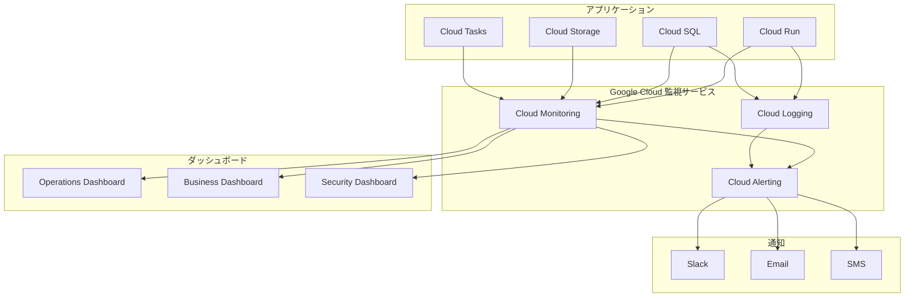

# 監視・ログ・アラート設計

> **TL;DR**: Cloud Monitoring/Logging統合の包括的監視システム設計。Golden Signals監視（Latency/Traffic/Errors/Saturation）、構造化ログ（JSON形式・30日-7年保持）、カスタムメトリクス（漫画生成・ユーザー行動・ビジネス指標）で構成。4段階アラート体系（P1:5分・P2:15分・P3:1時間・P4:翌営業日）、3種類ダッシュボード（Operations/Business/Security）、エスカレーションマトリックス、Slack/Email/SMS通知統合。可観測性優先・プロアクティブアラート・コスト効率・自動化重視の原則。

## ナビゲーション
- [← 親文書に戻る](./09.インフラ設計書.md)
- [← デプロイメント設計](./deployment.md)
- [→ クラウドサービス統合](./cloud-services.md)
- [← インフラ概要](./infrastructure-overview.md)

---

## 目次

- [1. 監視システム概要](#1-監視システム概要)
  - [1.1 監視戦略](#11-監視戦略)
  - [1.2 メトリクス体系](#12-メトリクス体系)
  - [1.3 アラート戦略](#13-アラート戦略)
- [2. ログ管理設計](#2-ログ管理設計)
  - [2.1 ログ集約戦略](#21-ログ集約戦略)
  - [2.2 ログ分析システム](#22-ログ分析システム)
  - [2.3 ログ保存ポリシー](#23-ログ保存ポリシー)
- [3. パフォーマンス監視](#3-パフォーマンス監視)
  - [3.1 アプリケーションメトリクス](#31-アプリケーションメトリクス)
  - [3.2 インフラメトリクス](#32-インフラメトリクス)
  - [3.3 ビジネスメトリクス](#33-ビジネスメトリクス)
- [4. アラート管理](#4-アラート管理)
  - [4.1 アラートポリシー](#41-アラートポリシー)
  - [4.2 エスカレーションマトリックス](#42-エスカレーションマトリックス)
  - [4.3 通知チャネル](#43-通知チャネル)
- [5. ダッシュボード設計](#5-ダッシュボード設計)
  - [5.1 オペレーションダッシュボード](#51-オペレーションダッシュボード)
  - [5.2 ビジネスダッシュボード](#52-ビジネスダッシュボード)
  - [5.3 セキュリティダッシュボード](#53-セキュリティダッシュボード)

---

## 1. 監視システム概要

### 1.1 監視戦略

#### 監視設計原則
| 原則 | 内容 | 実装レベル |
|------|------|----------|
| 可観測性優先 | システムの健全性を理解可能な形で可視化 | 基本 |
| プロアクティブアラート | 問題を事前に検出し、影響を最小限に抑制 | 基本 |
| コスト効率 | スタートアップに適した効率的な監視システム | 基本 |
| 自動化重視 | 手動作業を最小限にし、自動化で運用効率向上 | 基本 |

#### 監視アーキテクチャ


### 1.2 メトリクス体系

#### 主要メトリクス分類
```yaml
Metrics Hierarchy:
  Infrastructure Metrics:    # インフラレベル
    - Cloud Run: CPU, Memory, Request Count, Response Time
    - Cloud SQL: Connections, Query Performance, Storage
    - Cloud Storage: Operations, Transfer, Storage Usage
    - Cloud Tasks: Queue Depth, Processing Time, Error Rate
    
  Application Metrics:       # アプリケーションレベル
    - API Performance: Response Time, Error Rate, Throughput
    - Business Logic: Generation Success Rate, Quality Score
    - User Experience: Session Duration, Conversion Rate
    - Security: Authentication Events, Rate Limit Hits
    
  Business Metrics:          # ビジネスレベル
    - User Activity: Active Users, Generation Requests
    - Revenue: Subscription Conversions, Usage Patterns
    - Content Quality: User Ratings, Completion Rates
    - Operational Costs: Resource Usage, API Costs
```

### 1.3 アラート戦略

#### アラートレベル定義
```yaml
Alert Severity Levels:
  Critical (P1):
    Response Time: 5 minutes
    Examples:
      - Service completely down
      - Database connection failure
      - Security breach detected
    Notification: Slack + Email + SMS
    
  High (P2):
    Response Time: 15 minutes
    Examples:
      - High error rate (>5%)
      - Slow response time (>10s)
      - Resource exhaustion warning
    Notification: Slack + Email
    
  Medium (P3):
    Response Time: 1 hour
    Examples:
      - Moderate performance degradation
      - Non-critical feature issues
      - Resource usage trending up
    Notification: Slack
    
  Low (P4):
    Response Time: Next business day
    Examples:
      - Minor performance issues
      - Informational alerts
      - Capacity planning warnings
    Notification: Email summary
```

---

## 2. ログ管理設計

### 2.1 ログ集約戦略

#### 構造化ログ設計
```yaml
Structured Logging Strategy:
  Log Format: JSON
  
  Standard Fields:
    timestamp: ISO 8601 format
    severity: DEBUG, INFO, WARNING, ERROR, CRITICAL
    service: Service identifier
    version: Application version
    trace_id: Request trace identifier
    user_id: User identifier (if available)
    request_id: Unique request identifier
    
  Application-Specific Fields:
    manga_generation:
      phase: Current processing phase (1-8)
      quality_score: AI quality assessment
      processing_time: Phase execution time
      retry_count: Number of retries
      
    api_requests:
      method: HTTP method
      endpoint: API endpoint
      status_code: HTTP status code
      response_time: Request duration
      user_agent: Client user agent
      
    security_events:
      event_type: Authentication, authorization, etc.
      source_ip: Client IP address
      result: SUCCESS, FAILURE, BLOCKED
      reason: Detailed reason for security decision
```

#### ログルーティング設計
```yaml
Log Routing Configuration:
  Cloud Logging Sinks:
    application-logs:
      filter: 'resource.type="cloud_run_revision"'
      destination: Cloud Logging
      retention: 30 days
      
    security-logs:
      filter: 'jsonPayload.event_type="security"'
      destination: Cloud Logging + BigQuery
      retention: 1 year
      
    error-logs:
      filter: 'severity >= ERROR'
      destination: Cloud Logging + Cloud Storage
      retention: 90 days
      
    performance-logs:
      filter: 'jsonPayload.response_time > 1000'
      destination: BigQuery
      retention: 6 months
      
  External Integration:
    slack-critical-alerts:
      filter: 'severity = CRITICAL'
      destination: Slack webhook
      
    datadog-metrics:
      filter: 'jsonPayload.metrics EXISTS'
      destination: Datadog API
```

### 2.2 ログ分析システム

#### リアルタイムログ分析
```yaml
Real-time Log Analysis:
  Cloud Logging Analytics:
    Usage:
      - Error pattern detection
      - Performance anomaly identification
      - Security incident investigation
      
    Queries:
      error_rate_analysis: |
        resource.type="cloud_run_revision"
        AND severity >= ERROR
        AND timestamp >= timestamp_sub(current_timestamp(), interval 1 hour)
        
      slow_requests: |
        resource.type="cloud_run_revision"
        AND jsonPayload.response_time > 5000
        AND timestamp >= timestamp_sub(current_timestamp(), interval 15 minute)
        
      security_events: |
        jsonPayload.event_type="security"
        AND jsonPayload.result="FAILURE"
        AND timestamp >= timestamp_sub(current_timestamp(), interval 1 hour)
  
  BigQuery Log Analysis:
    Tables:
      - daily_application_logs
      - security_audit_logs
      - performance_metrics_logs
      
    Scheduled Queries:
      daily_error_summary:
        schedule: "0 9 * * *"  # Daily at 9 AM
        query: Aggregate error patterns by service and endpoint
        
      weekly_performance_trends:
        schedule: "0 10 * * 1"  # Monday at 10 AM
        query: Analyze response time trends and identify degradation
        
      monthly_security_report:
        schedule: "0 9 1 * *"   # First day of month at 9 AM
        query: Comprehensive security event analysis
```

### 2.3 ログ保存ポリシー

#### データライフサイクル管理
```yaml
Log Retention Policy:
  Application Logs:
    Cloud Logging: 30 days
    Cloud Storage (archive): 1 year
    Compression: gzip
    
  Security Logs:
    Cloud Logging: 90 days
    BigQuery: 1 year
    Cloud Storage (compliance): 7 years
    Encryption: Customer-managed keys
    
  Performance Logs:
    Cloud Logging: 7 days
    BigQuery: 6 months
    Data Studio cache: 30 days
    
  Error Logs:
    Cloud Logging: 90 days
    Cloud Storage: 2 years
    Indexing: Error type, timestamp, service
    
  Cost Optimization:
    Lifecycle Rules:
      - Standard Storage: 0-30 days
      - Nearline Storage: 31-90 days
      - Coldline Storage: 91 days-2 years
      - Archive Storage: 2+ years
      
  Compliance Requirements:
    GDPR: Personal data anonymization after 30 days
    SOX: Financial transaction logs retained for 7 years
    PCI: Payment-related logs retained for 1 year
```

---

## 3. パフォーマンス監視

### 3.1 アプリケーションメトリクス

#### Golden Signals メトリクス
```yaml
Golden Signals Monitoring:
  Latency:
    Response Time (P50, P95, P99):
      source: Cloud Run request latency
      target_p95: < 2 seconds
      alert_p95: > 5 seconds
      
    Database Query Time:
      source: Cloud SQL insights
      target_avg: < 100ms
      alert_avg: > 500ms
      
    AI Processing Time:
      source: Custom metrics
      target_phase: < 30s per phase
      alert_phase: > 60s per phase
      
  Traffic:
    Request Rate:
      source: Cloud Run requests/second
      baseline: Variable by time of day
      alert: 50% deviation from baseline
      
    Active Users:
      source: Custom metrics
      measurement: Concurrent active sessions
      alert: < 10% of expected concurrent users
      
  Errors:
    Error Rate:
      source: HTTP 4xx/5xx responses
      target: < 1%
      alert: > 5%
      
    AI Generation Failures:
      source: Custom metrics
      target: < 2% per phase
      alert: > 10% per phase
      
  Saturation:
    CPU Utilization:
      source: Cloud Run CPU metrics
      target: < 70%
      alert: > 85%
      
    Memory Utilization:
      source: Cloud Run memory metrics
      target: < 80%
      alert: > 90%
      
    Database Connections:
      source: Cloud SQL connection metrics
      target: < 80% of max connections
      alert: > 95% of max connections
```

#### カスタムメトリクス
```python
# custom_metrics.py - アプリケーションメトリクスの実装
from google.cloud import monitoring_v3
import time

class MangaMetricsCollector:
    def __init__(self, project_id):
        self.project_id = project_id
        self.client = monitoring_v3.MetricServiceClient()
        self.project_name = f"projects/{project_id}"
    
    def record_generation_metrics(self, phase, quality_score, processing_time, success):
        """AI漫画生成メトリクスを記録"""
        
        # 処理時間メトリクス
        self._write_metric(
            metric_type="custom.googleapis.com/manga/generation/processing_time",
            value=processing_time,
            labels={"phase": str(phase)}
        )
        
        # 品質スコアメトリクス
        self._write_metric(
            metric_type="custom.googleapis.com/manga/generation/quality_score",
            value=quality_score,
            labels={"phase": str(phase)}
        )
        
        # 成功率メトリクス
        self._write_metric(
            metric_type="custom.googleapis.com/manga/generation/success_count",
            value=1 if success else 0,
            labels={"phase": str(phase), "result": "success" if success else "failure"}
        )
    
    def record_user_metrics(self, user_id, action, session_duration=None):
        """USER行動メトリクスを記録"""
        
        # ユーザーアクションカウント
        self._write_metric(
            metric_type="custom.googleapis.com/manga/user/action_count",
            value=1,
            labels={"action": action}
        )
        
        # セッション継続時間（ログアウト時のみ）
        if session_duration and action == "logout":
            self._write_metric(
                metric_type="custom.googleapis.com/manga/user/session_duration",
                value=session_duration,
                labels={"user_type": "authenticated"}
            )
    
    def record_business_metrics(self, metric_name, value, labels=None):
        """Business metricsを記録"""
        self._write_metric(
            metric_type=f"custom.googleapis.com/manga/business/{metric_name}",
            value=value,
            labels=labels or {}
        )
    
    def _write_metric(self, metric_type, value, labels=None):
        """Cloud Monitoringにメトリクスを書き込み"""
        series = monitoring_v3.TimeSeries()
        series.metric.type = metric_type
        series.resource.type = "cloud_run_revision"
        
        # ラベル設定
        if labels:
            for key, value in labels.items():
                series.metric.labels[key] = str(value)
        
        # タイムスタンプと値
        now = time.time()
        seconds = int(now)
        nanos = int((now - seconds) * 10 ** 9)
        interval = monitoring_v3.TimeInterval(
            {"end_time": {"seconds": seconds, "nanos": nanos}}
        )
        point = monitoring_v3.Point(
            {"interval": interval, "value": {"double_value": float(value)}}
        )
        series.points = [point]
        
        # メトリクス送信
        self.client.create_time_series(
            name=self.project_name, time_series=[series]
        )
```

### 3.2 インフラメトリクス

#### インフラストラクチャ監視
```yaml
Infrastructure Monitoring:
  Cloud Run:
    Container Metrics:
      - CPU utilization percentage
      - Memory utilization percentage
      - Request count per second
      - Request latency (P50, P95, P99)
      - Error rate percentage
      - Instance count (current/max)
      
    Thresholds:
      cpu_alert: > 85%
      memory_alert: > 90%
      error_rate_alert: > 5%
      latency_p95_alert: > 3s
      
  Cloud SQL:
    Database Metrics:
      - Connection count / max connections
      - CPU utilization percentage
      - Memory utilization percentage
      - Disk utilization percentage
      - Queries per second
      - Slow query count
      - Replication lag (if applicable)
      
    Thresholds:
      connection_alert: > 80% of max
      cpu_alert: > 80%
      memory_alert: > 85%
      disk_alert: > 90%
      slow_query_alert: > 10 queries/minute
      
  Cloud Storage:
    Storage Metrics:
      - Request count by operation type
      - Request latency by operation type
      - Storage bytes used
      - Transfer bytes (ingress/egress)
      - Error count by error code
      
    Thresholds:
      latency_alert: P95 > 2s
      error_rate_alert: > 2%
      
  Cloud Tasks:
    Queue Metrics:
      - Queue depth
      - Tasks dispatched per second
      - Task execution latency
      - Task retry count
      - Dead letter queue size
      
    Thresholds:
      queue_depth_alert: > 1000 tasks
      latency_alert: P95 > 30s
      retry_rate_alert: > 10%
```

### 3.3 ビジネスメトリクス

#### KPI メトリクス
```yaml
Business KPI Monitoring:
  User Engagement:
    Daily Active Users (DAU):
      source: Authentication events
      target: Growth trend
      alert: 20% week-over-week decline
      
    Session Duration:
      source: Custom metrics
      target: > 10 minutes average
      alert: < 5 minutes average
      
    Feature Adoption:
      manga_generation_rate:
        target: > 70% of active users
        alert: < 50% of active users
      
      style_preference_distribution:
        measurement: Style selection frequency
        reporting: Weekly distribution analysis
        
  Content Quality:
    AI Generation Success Rate:
      source: Phase completion metrics
      target: > 85% per phase
      alert: < 70% per phase
      
    User Satisfaction:
      rating_average:
        source: User feedback ratings
        target: > 4.0/5.0
        alert: < 3.5/5.0
        
      completion_rate:
        measurement: Full manga generation completion
        target: > 80%
        alert: < 60%
        
  Operational Efficiency:
    Cost per Generation:
      calculation: Total infrastructure cost / Total generations
      target: < $0.50 per generation
      alert: > $1.00 per generation
      
    API Usage Efficiency:
      gemini_api_cost_per_generation:
        target: < $0.10 per generation
        alert: > $0.25 per generation
        
      imagen_api_cost_per_generation:
        target: < $0.20 per generation
        alert: > $0.40 per generation
        
  Revenue Metrics:
    Subscription Conversion Rate:
      source: Payment system events
      target: > 5% free-to-paid conversion
      alert: < 2% conversion rate
      
    Monthly Recurring Revenue (MRR):
      calculation: Monthly subscription revenue
      target: 20% month-over-month growth
      alert: Negative growth for 2 consecutive months
```

---

## 4. アラート管理

### 4.1 アラートポリシー

#### アラートルール定義
```yaml
Alert Policies:
  Critical Service Health:
    service_availability:
      condition: Availability < 99.5% for 5 minutes
      notification: Slack + Email + SMS
      severity: Critical
      
    database_connectivity:
      condition: Cloud SQL connection errors > 10% for 2 minutes
      notification: Slack + Email + SMS
      severity: Critical
      
  Performance Degradation:
    high_latency:
      condition: P95 response time > 5s for 10 minutes
      notification: Slack + Email
      severity: High
      
    high_error_rate:
      condition: Error rate > 5% for 5 minutes
      notification: Slack + Email
      severity: High
      
  Resource Utilization:
    cpu_exhaustion:
      condition: CPU utilization > 85% for 15 minutes
      notification: Slack
      severity: Medium
      
    memory_exhaustion:
      condition: Memory utilization > 90% for 10 minutes
      notification: Slack
      severity: Medium
      
  Business Metrics:
    generation_failure_spike:
      condition: AI generation failure rate > 20% for 30 minutes
      notification: Slack + Email
      severity: High
      
    user_engagement_drop:
      condition: DAU decreases by > 30% compared to previous week
      notification: Email
      severity: Medium
```

### 4.2 エスカレーションマトリックス

#### エスカレーションフロー
```yaml
Escalation Matrix:
  Critical Alerts (P1):
    Primary Response: On-call Engineer
    Response Time: 5 minutes
    Escalation Level 1: Technical Lead (after 15 minutes)
    Escalation Level 2: Engineering Manager (after 30 minutes)
    Escalation Level 3: CTO (after 1 hour)
    
  High Alerts (P2):
    Primary Response: On-call Engineer
    Response Time: 15 minutes
    Escalation Level 1: Technical Lead (after 1 hour)
    Escalation Level 2: Engineering Manager (next business day)
    
  Medium Alerts (P3):
    Primary Response: Team Lead
    Response Time: 1 hour
    Escalation: Engineering team daily standup
    
  Low Alerts (P4):
    Primary Response: Assigned Engineer
    Response Time: Next business day
    Escalation: Weekly team meeting
    
On-Call Schedule:
  Primary Engineer: 24/7 rotation (1 week shifts)
  Secondary Engineer: Backup support
  Coverage: 
    Business Hours: Tokyo timezone (9 AM - 6 PM JST)
    After Hours: Remote support + automated escalation
    Weekends: Reduced response times for non-critical alerts
```

### 4.3 通知チャネル

#### 通知設定
```yaml
Notification Channels:
  Slack Integration:
    alerts-critical:
#      webhook: https://hooks.slack.com/services/PLACEHOLDER/WEBHOOK/URL
      format: "[🚨 CRITICAL] {alert_name}\n{description}\nRunbook: {runbook_url}"
      mentions: "@oncall-engineer @tech-lead"
      
    alerts-general:
#      webhook: https://hooks.slack.com/services/PLACEHOLDER/WEBHOOK/URL
      format: "[⚠️ {severity}] {alert_name}\n{description}"
      throttling: 5 minutes per unique alert
      
  Email Integration:
    critical-alerts@company.com:
      recipients:
        - oncall-engineer@company.com
        - tech-lead@company.com
        - engineering-manager@company.com
      format: HTML with charts and links
      
    team-alerts@company.com:
      recipients:
        - engineering-team@company.com
      format: Summary digest (daily)
      
  SMS Integration:
    twilio:
      phone_numbers:
        - "+81-90-1234-5678"  # On-call engineer
        - "+81-80-9876-5432"  # Tech lead
      conditions:
        - severity: Critical
        - time: After hours (6 PM - 9 AM JST)
        - unacknowledged: 15 minutes
        
  PagerDuty Integration:
    service_key: "PAGER_DUTY_SERVICE_KEY"
    escalation_policy: "manga-service-escalation"
    conditions:
      - severity: Critical
      - business_hours: Outside Tokyo timezone
```

---

## 5. ダッシュボード設計

### 5.1 オペレーションダッシュボード

#### システム健全性ダッシュボード
```yaml
Operations Dashboard Layout:
  System Health Overview:
    Service Status Grid:
      - Cloud Run services (green/yellow/red status)
      - Database health indicator
      - Storage system status
      - External API connectivity
      
    Key Metrics Summary:
      - Overall system availability (99.9%)
      - P95 response time (1.2s)
      - Error rate (0.3%)
      - Active user count (234)
      
  Performance Monitoring:
    Response Time Charts:
      - Time series: P50, P95, P99 latency (last 24 hours)
      - Heatmap: Response time distribution by endpoint
      
    Throughput Monitoring:
      - Requests per second (current vs baseline)
      - Concurrent users (real-time)
      - Database queries per second
      
    Error Analysis:
      - Error rate trend (last 7 days)
      - Error breakdown by type (4xx vs 5xx)
      - Top error endpoints
      
  Resource Utilization:
    Infrastructure Metrics:
      - CPU utilization (all services)
      - Memory utilization (all services)
      - Database connection pool usage
      - Storage usage trends
      
    Capacity Planning:
      - Auto-scaling events
      - Resource usage predictions
      - Cost optimization opportunities
      
  Recent Events:
    Alert History:
      - Last 20 alerts with resolution status
      - Current active incidents
      - Escalation status
      
    Deployment History:
      - Recent deployments with success/failure status
      - Rollback events
      - Performance impact analysis
```

### 5.2 ビジネスダッシュボード

#### ビジネスメトリクスダッシュボード
```yaml
Business Dashboard Layout:
  User Engagement Overview:
    Key User Metrics:
      - Daily Active Users (DAU): 1,234
      - Weekly Active Users (WAU): 4,567
      - Monthly Active Users (MAU): 12,345
      - Average session duration: 15.3 minutes
      
    User Journey Analytics:
      - Conversion funnel: Registration → First generation → Subscription
      - Feature adoption rates
      - User retention cohort analysis
      
  Content Generation Metrics:
    Generation Statistics:
      - Total generations today: 456
      - Success rate by phase: Phase 1 (98%), Phase 2 (95%), ...
      - Average generation time: 8.5 minutes
      - Quality score distribution
      
    Content Analysis:
      - Popular manga styles
      - Content length distribution
      - User rating trends
      
  Revenue Metrics:
    Financial Overview:
      - Monthly Recurring Revenue (MRR): $12,345
      - Conversion rate: 4.2%
      - Average Revenue Per User (ARPU): $15.67
      - Churn rate: 2.1%
      
    Cost Analysis:
      - Infrastructure costs: $2,345/month
      - AI API costs: $1,234/month
      - Cost per generation: $0.45
      
  Operational Efficiency:
    AI Performance:
      - Phase success rates
      - Quality improvement trends
      - AI cost optimization opportunities
      
    User Support:
      - Support ticket volume
      - Response time metrics
      - User satisfaction scores
```

### 5.3 セキュリティダッシュボード

#### セキュリティ監視ダッシュボード
```yaml
Security Dashboard Layout:
  Authentication & Access:
    Login Security:
      - Successful logins: 2,345 (last 24h)
      - Failed login attempts: 67 (last 24h)
      - Account lockouts: 3 (last 24h)
      - Multi-factor auth usage: 89%
      
    API Security:
      - API key usage patterns
      - Rate limiting violations: 23 (last 24h)
      - Unauthorized access attempts: 5 (last 24h)
      
  Content Security:
    Copyright Protection:
      - Content filter triggers: 12 (last 24h)
      - Copyright detection alerts: 2 (last 24h)
      - Manual content reviews: 5 (pending)
      
    Data Protection:
      - Personal data access events
      - Data deletion requests: 1 (last 7 days)
      - GDPR compliance status
      
  Threat Detection:
    Security Events:
      - DDoS attempts: 0 (last 24h)
      - SQL injection attempts: 3 (blocked)
      - XSS attempts: 1 (blocked)
      - Suspicious IP addresses: 12 (monitored)
      
    Vulnerability Status:
      - Container security scan results
      - Dependency vulnerability count: 0 critical, 2 medium
      - Security patch status: Up to date
      
  Compliance Monitoring:
    Audit Trail:
      - Admin actions: 15 (last 24h)
      - Configuration changes: 2 (last 7 days)
      - Access control modifications: 0 (last 30 days)
      
    Compliance Status:
      - GDPR compliance: ✓ Compliant
      - SOC 2 requirements: ✓ Compliant
      - Data retention policy: ✓ Enforced
```

---

## 相互参照

### 関連設計書
- [インフラ概要](./infrastructure-overview.md) - ベースインフラ設計
- [デプロイメント設計](./deployment.md) - CI/CDパイプライン
- [クラウドサービス統合](./cloud-services.md) - 外部サービス連携
- [セキュリティ設計](../08-security/README.md) - セキュリティ監視

### 監視フロー
1. **メトリクス収集**: アプリケーション → Cloud Monitoring → ダッシュボード
2. **アラート**: 闾値超過 → 通知 → エスカレーション → 対応
3. **ログ分析**: リアルタイム分析 → パターン検出 → 改善提案
4. **報告**: 日次/週次/月次レポート生成 → ステークホルダー共有

### 最適化アプローチ
1. **コスト効率**: 必要最小限のメトリクスで最大の洞察
2. **自動化**: 手動作業を減らし、迅速な対応を実現
3. **スケーラビリティ**: 成長に合わせて監視システムも拡張可能
4. **アクショナブル**: メトリクスから具体的改善アクションを導出

---

**文書承認**
- SREエンジニア: TBD 日付: TBD
- インフラアーキテクト: TBD 日付: TBD
- プロダクトマネージャー: TBD 日付: TBD