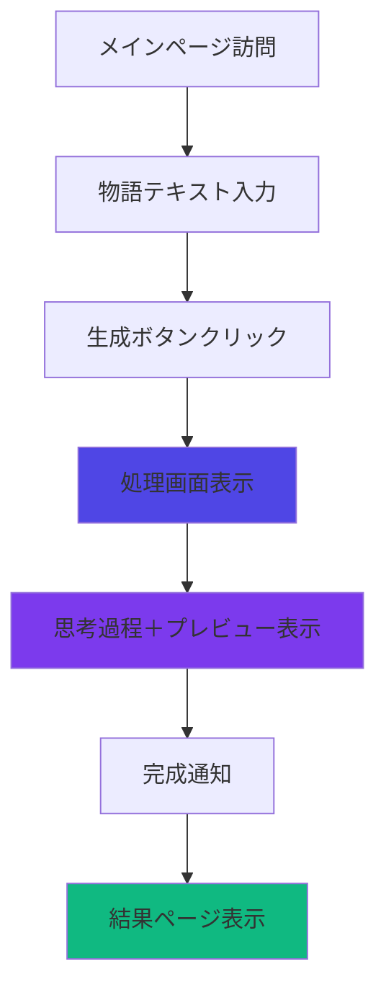
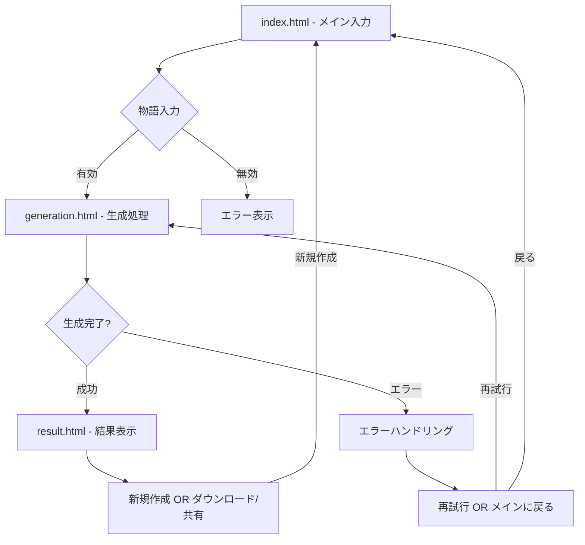
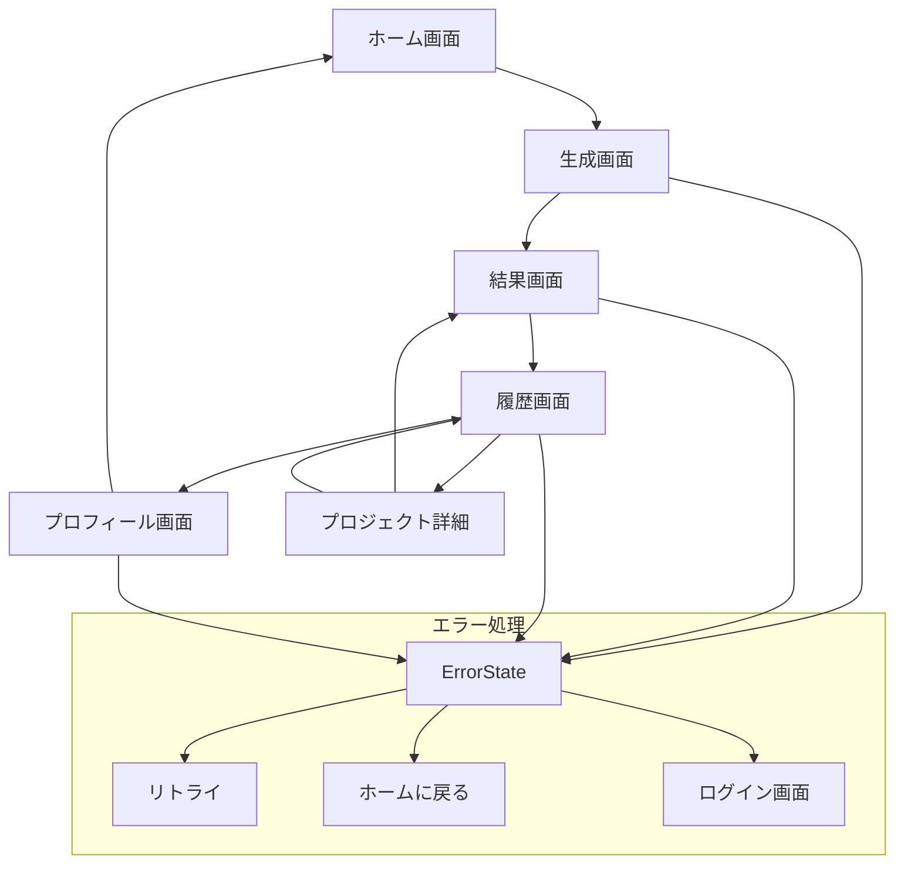

# Spell UI/UX設計書 Genspark風モダンデザイン版

**文書管理情報**
- 文書ID: UI-DOC-005
- 作成日: 2025-08-28
- 版数: 6.0
- 承認者: 根岸祐樹
- 関連文書: API-DOC-001（API設計書）、REQ-DOC-001（要件定義書）
- 更新元: UI-DOC-004（Orcha AI風モダン版）→ Genspark風モダンデザインに全面刷新

## 目次

- [1. デザイン概要](#1-デザイン概要)
  - [1.1 デザイン哲学](#11-デザイン哲学)
  - [1.2 ユーザー体験方針](#12-ユーザー体験方針)
- [2. デザインシステム](#2-デザインシステム)
  - [2.1 カラーパレット](#21-カラーパレット)
  - [2.2 タイポグラフィ](#22-タイポグラフィ)
  - [2.3 テーマシステム](#23-テーマシステム)
- [3. ユーザージャーニー](#3-ユーザージャーニー)
  - [3.1 シンプル入力フロー](#31-シンプル入力フロー)
  - [3.2 Human-in-the-loopフィードバック体験](#32-human-in-the-loopフィードバック体験)
  - [3.3 結果確認フロー](#33-結果確認フロー)
- [4. 画面設計](#4-画面設計)
  - [4.1 メインページ](#41-メインページ)
  - [4.2 HITLフィードバック画面](#42-hitlフィードバック画面)
  - [4.3 結果ビューアー](#43-結果ビューアー)
- [5. コンポーネント設計](#5-コンポーネント設計)
  - [5.1 基本コンポーネント](#51-基本コンポーネント)
  - [5.2 インタラクティブプレビューシステム](#52-インタラクティブプレビューシステム)
  - [5.3 テーマトグル](#53-テーマトグル)
  - [5.4 アニメーション仕様](#54-アニメーション仕様)
- [6. 技術実装](#6-技術実装)
  - [6.1 CSS Variables活用](#61-css-variables活用)
  - [6.2 WebSocket統合](#62-websocket統合)
  - [6.3 通知システム](#63-通知システム)
- [7. レスポンシブ設計](#7-レスポンシブ設計)
  - [7.1 ブレイクポイント仕様](#71-ブレイクポイント仕様)
  - [7.2 デバイス別最適化](#72-デバイス別最適化)
- [8. アクセシビリティ設計](#8-アクセシビリティ設計)
  - [8.1 WCAG準拠チェックリスト](#81-wcag準拠チェックリスト)
  - [8.2 キーボードナビゲーション](#82-キーボードナビゲーション)
- [9. パフォーマンス設計](#9-パフォーマンス設計)
  - [9.1 Core Web Vitals目標](#91-core-web-vitals目標)
  - [9.2 最適化戦略](#92-最適化戦略)
- [10. 実装仕様](#10-実装仕様)
- [11. デザインシステム仕様書](#11-デザインシステム仕様書)
  - [11.1 コンポーネントライブラリ](#111-コンポーネントライブラリ)
  - [11.2 アイコンシステム](#112-アイコンシステム)
  - [11.3 アニメーション定義](#113-アニメーション定義)
- [12. インタラクション・UXフロー仕様](#12-インタラクションuxフロー仕様)
  - [12.1 画面遷移フロー](#121-画面遷移フロー)
  - [12.2 エラーハンドリング](#122-エラーハンドリング)
  - [12.3 ローディング状態](#123-ローディング状態)
- [13. 実装済み機能の設計統合](#13-実装済み機能の設計統合)
  - [13.1 統一エラー処理システム](#131-統一エラー処理システム)
  - [13.2 詳細プログレス表示](#132-詳細プログレス表示)
  - [13.3 プロフィール・履歴画面](#133-プロフィール履歴画面)
- [14. 実装チェックリスト](#14-実装チェックリスト)
  - [14.1 開発フェーズ別チェック項目](#141-開発フェーズ別チェック項目)
  - [14.2 品質保証項目](#142-品質保証項目)

---

## 1. デザイン概要

### 1.1 デザイン哲学

#### 核心原則 (Genspark風モダンデザイン)
```
🌑 Dark Mode First: ダークモードを基調としたモダンデザイン
💬 Conversational UI: Claudeライクなシンプル入力インターフェース
📱 Split View: 左側チャット・右側出力のGenspark風レイアウト
⚡ Real-time Generation: リアルタイムで生成過程を表示
🎯 Zero Friction: 入力欄のみの極限までシンプルなUI
```

#### Human-in-the-loop体験設計（実装済み）
- **Claude風ホーム画面**: #1a1a1a背景のシンプルなチャット風入力画面
- **Artifact風処理画面**: 左右分割レイアウト（左:リアルタイムログ+HITL入力、右:7フェーズプレビューブロック）
- **7フェーズHITL**: 各フェーズで任意のタイミングでフィードバック可能（タイムアウトなし）
- **EventTarget設計**: CustomEventによるリアルタイム状態更新
- **インタラクティブ生成**: 各フェーズでユーザーフィードバックを受け取って修正
- **HITL入力デザイン**: ホーム画面と同じClaude風入力欄を左側下部に配置

### 1.2 ユーザー体験方針

| 設計方針 | 実装戦略 |
|---------|--------|
| Claudeライク入力 | 入力欄のみ、説明文・ラベル一切なし |
| ダークモード標準 | ダークテーマをデフォルト、ライトは補助的 |
| HITLフィードバック画面 | 左フェーズ処理、右プレビュー・フィードバックのレイアウト |
| ミニマルアニメーション | 必要最小限の動き、フォーカスは内容に |
| リアルタイム更新 | WebSocketで瞬時に進捗・結果を反映 |
| コンテキスト保持 | 対話の流れを左側で常に表示 |
| 直感的フロー | 入力→生成→結果の3ステップのみ |

---

## 2. デザインシステム

### 2.1 カラーパレット

#### CSS Variables テーマシステム
```css
:root {
  /* Dark Theme (Default) - Genspark風 */
  --color-bg-primary: #1a1a1a;      /* 深い黒背景 */
  --color-bg-secondary: #141414;    /* カード背景 */
  --color-bg-tertiary: #1f1f1f;     /* 入力欄背景 */
  
  --color-text-primary: #ffffff;    /* メインテキスト */
  --color-text-secondary: #a1a1aa;  /* サブテキスト */
  --color-text-tertiary: #71717a;   /* プレースホルダー */
  
  --color-border-primary: #27272a;  /* 微細な境界線 */
  --color-border-secondary: #3f3f46;
  
  --color-accent-primary: #2563eb;  /* 青系アクセント */
  --color-accent-secondary: #3b82f6;
  
  --color-success: #10b981;
  --color-warning: #f59e0b;
  --color-error: #ef4444;
  
  /* Shadows & Effects */
  --shadow-sm: 0 1px 2px 0 rgb(0 0 0 / 0.05);
  --shadow-md: 0 4px 6px -1px rgb(0 0 0 / 0.1);
  --shadow-lg: 0 10px 15px -3px rgb(0 0 0 / 0.1);
  --shadow-xl: 0 20px 25px -5px rgb(0 0 0 / 0.1);
  
  /* Border Radius */
  --radius-sm: 0.25rem;
  --radius-md: 0.375rem;
  --radius-lg: 0.5rem;
  --radius-xl: 0.75rem;
}

[data-theme="light"] {
  /* Light Theme (Optional) */
  --color-bg-primary: #ffffff;
  --color-bg-secondary: #f9fafb;
  --color-bg-tertiary: #f3f4f6;
  
  --color-text-primary: #111827;
  --color-text-secondary: #6b7280;
  --color-text-tertiary: #9ca3af;
  
  --color-border-primary: #e5e7eb;
  --color-border-secondary: #d1d5db;
  
  --color-accent-primary: #2563eb;
  --color-accent-secondary: #3b82f6;
}
```

#### カラー使用ガイドライン
| 用途 | カラー変数 | 使用場面 |
|------|-----------|--------|
| メイン背景 | --color-bg-primary (#1a1a1a) | ダーク背景全体 |
| 入力欄背景 | --color-bg-tertiary (#1f1f1f) | テキストエリア |
| 分割パネル | --color-bg-secondary (#141414) | チャット・出力エリア |
| 境界線 | --color-border-primary (#27272a) | 微細な区切り |
| アクセント | --color-accent-primary (#2563eb) | 送信ボタン |

### 2.2 タイポグラフィ

#### Robotoフォント統一
```css
:root {
  /* Roboto を主要フォントとして統一 */
  --font-sans: 'Roboto', -apple-system, BlinkMacSystemFont, 
               "Segoe UI", "Helvetica Neue", Arial, "Noto Sans", 
               sans-serif, "Apple Color Emoji", "Segoe UI Emoji", 
               "Segoe UI Symbol", "Noto Color Emoji";
  
  --font-mono: ui-monospace, SFMono-Regular, "SF Mono", Consolas, 
               "Liberation Mono", Menlo, monospace;
  
  /* Font Weights */
  --font-weight-normal: 400;
  --font-weight-medium: 500;
  --font-weight-semibold: 600;
  --font-weight-bold: 700;
  
  /* Font Sizes */
  --text-xs: 0.75rem;
  --text-sm: 0.875rem;
  --text-base: 1rem;
  --text-lg: 1.125rem;
  --text-xl: 1.25rem;
  --text-2xl: 1.5rem;
  --text-3xl: 1.875rem;
  --text-4xl: 2.25rem;
  
  /* Line Heights */
  --leading-tight: 1.25;
  --leading-normal: 1.5;
  --leading-relaxed: 1.625;
}
```

#### タイポグラフィ階層
```css
/* Typography Hierarchy */
.hero-title {
  font-size: var(--text-4xl);
  font-weight: var(--font-weight-bold);
  line-height: var(--leading-tight);
  letter-spacing: -0.025em;
}

.section-title {
  font-size: var(--text-2xl);
  font-weight: var(--font-weight-semibold);
  line-height: var(--leading-tight);
}

.body-text {
  font-size: var(--text-base);
  font-weight: var(--font-weight-normal);
  line-height: var(--leading-normal);
}

.caption-text {
  font-size: var(--text-sm);
  font-weight: var(--font-weight-medium);
  color: var(--color-text-secondary);
}
```

### 2.3 テーマシステム

#### テーマ切り替え実装
```typescript
class ThemeManager {
  constructor() {
    this.theme = localStorage.getItem('theme') || 
                 (window.matchMedia('(prefers-color-scheme: dark)').matches ? 'dark' : 'light');
    this.init();
  }

  init() {
    this.setTheme(this.theme);
    this.setupToggle();
    this.watchSystemTheme();
  }

  setTheme(theme: 'light' | 'dark') {
    this.theme = theme;
    document.documentElement.setAttribute('data-theme', theme);
    localStorage.setItem('theme', theme);
    this.updateToggleIcon();
  }

  toggleTheme() {
    const newTheme = this.theme === 'light' ? 'dark' : 'light';
    this.setTheme(newTheme);
  }

  private watchSystemTheme() {
    window.matchMedia('(prefers-color-scheme: dark)')
          .addEventListener('change', (e) => {
            if (!localStorage.getItem('theme')) {
              this.setTheme(e.matches ? 'dark' : 'light');
            }
          });
  }
}
```

#### モダンエフェクト
```css
/* Subtle Shadows */
.card {
  background: var(--color-bg-secondary);
  border: 1px solid var(--color-border-primary);
  border-radius: var(--radius-lg);
  box-shadow: var(--shadow-sm);
  transition: all 0.2s ease;
}

.card:hover {
  box-shadow: var(--shadow-md);
  transform: translateY(-2px);
}

/* Button Styles */
.btn-primary {
  background: var(--color-accent-primary);
  color: white;
  border: none;
  border-radius: var(--radius-md);
  padding: 0.75rem 1.5rem;
  font-weight: var(--font-weight-medium);
  transition: all 0.2s ease;
  cursor: pointer;
}

.btn-primary:hover {
  background: var(--color-accent-secondary);
  transform: translateY(-1px);
  box-shadow: var(--shadow-lg);
}

/* Focus States */
.focusable:focus {
  outline: 2px solid var(--color-accent-primary);
  outline-offset: 2px;
}
```

---

## 3. ユーザージャーニー

### 3.1 シンプル入力フロー



#### フロー詳細
| 段階 | アクション | 所要時間 | UI状態 |
|------|-----------|---------|-------|
| 入力 | テキスト入力 | 30秒-5分 | プレースホルダー表示 |
| 開始 | 生成ボタンクリック | 1秒 | ローディング状態 |
| 処理 | AI処理実行 | 8-10分 | 思考過程+プレビュー |
| 完了 | 結果表示 | - | 成功状態 |

### 3.2 Human-in-the-loopフィードバック体験

#### HITL分割レイアウト設計

##### 独立スクロール仕様
- **全体固定**: 画面全体を100vh固定、スクロール禁止
- **左パネル**: ヘッダー固定、ログエリア独立スクロール、下部にClaude風HITL入力欄固定
- **右パネル**: ヘッダー固定、フェーズカードエリア独立スクロール
- **フレーム完全分離**: 左右パネルが互いに影響しない独立したスクロール領域
- **HITL入力**: ホーム画面と同一デザイン（#2d2d2d背景、白いボーダー、Google Icons送信ボタン）

```html
<div class="hitl-layout">
  <!-- 左パネル: ログストリーム + HITL入力 -->
  <div class="left-panel">
    <!-- ログエリア（スクロール可能） -->
    <div class="log-stream" id="log-stream">
      <div class="log-entry">[22:50:15] システム初期化...</div>
      <div class="log-entry">[22:50:16] セッション開始</div>
      <!-- リアルタイムログ表示 -->
    </div>
    
    <!-- HITL入力エリア（下部固定） -->
    <div class="hitl-input-container">
      <div class="input-wrapper">
        <textarea 
          id="hitl-input"
          placeholder="フィードバックを入力..."
          class="hitl-textarea"
        ></textarea>
        <div class="bottom-bar">
          <span class="char-counter">0/500</span>
          <button class="send-btn" id="send-feedback">
            <span class="material-symbols-outlined">send</span>
          </button>
        </div>
      </div>
    </div>
  </div>
  
  <!-- 右パネル: フェーズ進行状況 -->
  <div class="right-panel">
    <div class="phase-list" id="phase-list">
      <!-- 7フェーズのプレビューブロック -->
      <div class="phase-block">
        <div class="phase-info">
          <span class="material-symbols-outlined phase-icon">check_circle</span>
          <span class="phase-number">01</span>
          <span class="phase-name">テキスト分析</span>
        </div>
        <div class="progress-bar">
          <div class="progress-fill"></div>
        </div>
      </div>
      <!-- 他のフェーズ -->
    </div>
  </div>
</div>
```

#### WebSocket連携
```typescript
interface HITLPhase {
  phase: number;
  title: string;
  description: string;
  progress: number;
  preview?: {
    type: 'text' | 'image' | 'layout';
    content: string;
    thumbnail?: string;
  };
  status: 'pending' | 'processing' | 'feedback_waiting' | 'completed';
  feedbackApplied?: FeedbackModification[];
}

interface FeedbackModification {
  type: string;
  description: string;
  intensity: number;
}

class HITLProcessDisplay {
  private socket: WebSocket;
  private currentPhase: number = 0;
  
  constructor() {
    this.initWebSocket();
    this.initFeedbackHandlers();
  }
  
  private initWebSocket() {
    this.socket = new WebSocket('ws://localhost:8000/ws/generation');
    
    this.socket.onmessage = (event) => {
      const data = JSON.parse(event.data);
      
      switch(data.type) {
        case 'phase_progress':
          this.updatePhaseProgress(data.data);
          break;
        case 'phase_complete':
          this.handlePhaseComplete(data.data);
          break;
        case 'feedback_waiting':
          this.showFeedbackInterface(data.data);
          break;
        case 'feedback_applied':
          this.handleFeedbackApplied(data.data);
          break;
      }
    };
  }
  
  private updatePhaseProgress(phase: HITLPhase) {
    const phaseElement = document.getElementById(`phase-${phase.phase}`);
    phaseElement.className = `phase-item ${phase.status}`;
    
    // プレビュー更新
    if (phase.preview) {
      this.updatePreview(phase.preview);
    }
  }
  
  private showFeedbackInterface(phase: HITLPhase) {
    const feedbackInput = document.getElementById('hitl-input');
    feedbackInput.disabled = false;
    feedbackInput.placeholder = `Phase ${phase.phase} へのフィードバックを入力...`;
    
    // タイムアウトなし - ユーザーが任意のタイミングでフィードバック可能
  }
  
  private initFeedbackHandlers() {
    // クイックオプション
    document.querySelectorAll('.quick-btn').forEach(btn => {
      btn.addEventListener('click', (e) => {
        const feedback = e.target.dataset.feedback;
        this.sendFeedback({ type: 'quick_option', value: feedback });
      });
    });
    
    // 自然言語フィードバック
    document.getElementById('apply-feedback').addEventListener('click', () => {
      const input = document.querySelector('.feedback-input').value;
      if (input.trim()) {
        this.sendFeedback({ type: 'natural_language', value: input });
      }
    });
    
    // スキップ
    document.getElementById('skip-feedback').addEventListener('click', () => {
      this.sendFeedback({ type: 'skip' });
    });
  }
  
  private sendFeedback(feedback: any) {
    this.socket.send(JSON.stringify({
      type: 'user_feedback',
      phase: this.currentPhase,
      feedback: feedback
    }));
    
    // UIをローディング状態に
    document.getElementById('feedback-section').style.display = 'none';
    this.showProcessingMessage('フィードバックを適用中...');
  }
  
  private autoSkipFeedback() {
    this.sendFeedback({ type: 'timeout_skip' });
  }
}
```

### 3.3 結果確認フロー

#### 結果画面構成
```html
<div class="result-container">
  <!-- 成功ヘッダー -->
  <div class="success-hero">
    <div class="success-icon">✅</div>
    <h1 class="success-title">漫画が完成しました</h1>
    <p class="success-subtitle">あなたの物語が美しい作品に生まれ変わりました</p>
  </div>
  
  <!-- メインアクション -->
  <div class="action-buttons">
    <button class="btn-primary btn-lg">📱 作品を見る</button>
    <button class="btn-secondary">📥 ダウンロード</button>
    <button class="btn-secondary">🔗 共有</button>
  </div>
  
  <!-- 漫画ビューアー -->
  <div class="manga-viewer">
    <!-- 実装済みのビューアーコンポーネント -->
  </div>
</div>
```

---

## 4. 画面設計

### 4.1 メインページ

#### Claudeライクシンプルレイアウト
```html
<!DOCTYPE html>
<html lang="ja" data-theme="dark">
<head>
  <meta charset="UTF-8">
  <meta name="viewport" content="width=device-width, initial-scale=1.0">
  <title>AI漫画生成</title>
  <link rel="stylesheet" href="styles/main.css">
</head>
<body>
  <div class="app-container">
    <!-- 最小限のヘッダー -->
    <header class="minimal-header">
      <div class="header-inner">
        <h1 class="app-title">AI Manga</h1>
      </div>
    </header>

    <!-- Claudeライク入力エリア -->
    <main class="main-content">
      <div class="chat-container">
        <div class="input-container">
          <form class="message-form" id="story-form">
            <div class="input-wrapper">
              <textarea 
                class="message-input"
                id="story-input"
                placeholder="物語を入力してください..."
                maxlength="10000"
                rows="1"
                required
              ></textarea>
              <button type="submit" class="send-button" id="generate-btn">
                <svg class="send-icon" viewBox="0 0 24 24">
                  <path d="M2 21l21-9L2 3v7l15 2-15 2v7z"/>
                </svg>
              </button>
            </div>
          </form>
        </div>
      </div>
    </main>
  </div>
  
  <script src="scripts/main.js"></script>
</body>
</html>
```

#### CSS実装（Claudeライクデザイン）
```css
/* ダーク背景ベース */
body {
  background: var(--color-bg-primary);
  color: var(--color-text-primary);
  margin: 0;
  font-family: var(--font-sans);
}

/* 最小限ヘッダー */
.minimal-header {
  position: fixed;
  top: 0;
  left: 0;
  right: 0;
  height: 48px;
  background: var(--color-bg-secondary);
  border-bottom: 1px solid var(--color-border-primary);
  z-index: 100;
}

.app-title {
  font-size: var(--text-base);
  font-weight: var(--font-weight-medium);
  color: var(--color-text-secondary);
  margin: 0;
  line-height: 48px;
  padding: 0 20px;
}

/* メインコンテンツ */
.main-content {
  padding-top: 48px;
  height: 100vh;
  display: flex;
  align-items: center;
  justify-content: center;
}

/* チャットコンテナ */
.chat-container {
  width: 100%;
  max-width: 768px;
  padding: 0 20px;
}

/* 入力エリア（Claudeスタイル） */
.input-container {
  position: relative;
}

.input-wrapper {
  position: relative;
  background: var(--color-bg-tertiary);
  border: 1px solid var(--color-border-primary);
  border-radius: 12px;
  transition: border-color 0.2s;
}

.input-wrapper:focus-within {
  border-color: var(--color-accent-primary);
}

.message-input {
  width: 100%;
  padding: 16px 48px 16px 16px;
  background: transparent;
  border: none;
  color: var(--color-text-primary);
  font-size: var(--text-base);
  font-family: var(--font-sans);
  resize: none;
  outline: none;
  line-height: 1.5;
  min-height: 24px;
  max-height: 200px;
}

.message-input::placeholder {
  color: var(--color-text-tertiary);
}

/* 送信ボタン（埋め込み型） */
.send-button {
  position: absolute;
  right: 8px;
  bottom: 8px;
  width: 32px;
  height: 32px;
  background: var(--color-accent-primary);
  border: none;
  border-radius: 6px;
  cursor: pointer;
  display: flex;
  align-items: center;
  justify-content: center;
  transition: background-color 0.2s;
}

.send-button:hover {
  background: var(--color-accent-secondary);
}

.send-icon {
  width: 16px;
  height: 16px;
  fill: white;
}
```

### 4.2 HITLフィードバック画面

#### HITLフィードバックレイアウト
```html
<!DOCTYPE html>
<html lang="ja">
<head>
  <meta charset="UTF-8">
  <meta name="viewport" content="width=device-width, initial-scale=1.0">
  <title>AI漫画生成 - 処理中</title>
  <link rel="stylesheet" href="styles/main.css">
  <link rel="stylesheet" href="styles/process.css">
</head>
<body>
  <div class="container">
    <!-- ヘッダー -->
    <header class="header">
      <div class="header-content">
        <h1 class="logo">AI漫画生成</h1>
        <button class="theme-toggle" id="theme-toggle">
          <span class="theme-icon" id="theme-icon-light">☀️</span>
          <span class="theme-icon" id="theme-icon-dark" style="display: none;">🌙</span>
        </button>
      </div>
    </header>

    <!-- HITLフィードバック画面 -->
    <main class="hitl-container">
      <div class="hitl-layout">
        <!-- 左側: フェーズタイムライン -->
        <div class="phase-panel">
          <div class="phase-header">
            <h2 class="phase-title">生成進行 (7フェーズ)</h2>
          </div>
          <div class="phase-timeline" id="phase-timeline">
            <div class="phase-item processing" data-phase="1">
              <div class="phase-number">1</div>
              <div class="phase-info">
                <h3>ストーリー構造分析</h3>
                <p>テーマやジャンルを特定中...</p>
                <div class="phase-progress">
                  <div class="progress-bar">
                    <div class="progress-fill" style="width: 60%"></div>
                  </div>
                </div>
              </div>
            </div>
            <!-- 他のフェーズも同様に追加 -->
          </div>
        </div>
        
        <!-- 右側: プレビュー + フィードバック -->
        <div class="content-panel">
          <!-- プレビューエリア -->
          <div class="preview-area">
            <div class="preview-header">
              <h2 class="preview-title">Phase 1: コンセプト・世界観分析 結果プレビュー</h2>
              <div class="preview-status">
                <span class="status-dot completed"></span>
                <span class="status-text">完了</span>
              </div>
            </div>
            <div class="preview-content" id="preview-content">
              <!-- フェーズ結果のプレビュー表示 -->
            </div>
          </div>
          
          <!-- フィードバックエリア -->
          <div class="feedback-area" id="feedback-area">
            <div class="feedback-header">
              <h3 class="feedback-title">👀 結果はいかがですか？</h3>
              <p class="feedback-subtitle">修正したい点があればお気軽にどうぞ。</p>
            </div>
            
            <div class="feedback-options">
              <!-- クイックオプション -->
              <div class="quick-feedback">
                <h4>クイック修正</h4>
                <div class="quick-buttons">
                  <button class="quick-btn" data-feedback="brighter">
                    😊 明るく
                  </button>
                  <button class="quick-btn" data-feedback="serious">
                    😐 シリアスに
                  </button>
                  <button class="quick-btn" data-feedback="detailed">
                    🔍 詳細化
                  </button>
                  <button class="quick-btn" data-feedback="simple">
                    ✨ シンプルに
                  </button>
                </div>
              </div>
              
              <!-- 自然言語入力 -->
              <div class="natural-feedback">
                <h4>自由なフィードバック</h4>
                <textarea 
                  class="feedback-input" 
                  placeholder="例: 'もっと若々しいキャラクターにして' '背景を学校に変更' 'コメディ要素を追加'"
                  rows="3"></textarea>
              </div>
              
              <!-- アクションボタン -->
              <div class="feedback-actions">
                <button class="btn-secondary" id="skip-feedback">
                  このまま次へ →
                </button>
                <button class="btn-primary" id="apply-feedback">
                  修正を適用 ✨
                </button>
              </div>
              
              <!-- タイムアウト表示 -->
              <div class="feedback-timeout">
                <small>🕰️ あと <span id="timeout-counter">30:00</span> で自動的に次のフェーズに進みます</small>
              </div>
            </div>
          </div>
        </div>
      </div>
    </main>
  </div>
  
  <script src="scripts/process.js"></script>
</body>
</html>
```

#### 処理画面CSS
```css
/* HITLフィードバックレイアウト */
.hitl-container {
  height: 100vh;
  overflow: hidden; /* 画面全体のスクロール防止 */
  padding-top: 48px;
}

.hitl-layout {
  display: grid;
  grid-template-columns: 400px 1fr;
  height: calc(100vh - 48px);
  background: var(--color-bg-primary);
  gap: 1px;
}

@media (max-width: 1024px) {
  .hitl-layout {
    grid-template-columns: 1fr;
    grid-template-rows: auto 1fr;
  }
}

/* 左側: フェーズパネル（独立スクロール対応） */
.phase-panel {
  height: 100%;
  display: flex;
  flex-direction: column;
  background: var(--color-bg-secondary);
  border-right: 1px solid var(--color-border-primary);
}

.phase-panel-header {
  flex-shrink: 0; /* ヘッダー固定 */
  padding: 1rem;
  border-bottom: 1px solid var(--color-border-primary);
}

.phase-panel-content {
  flex: 1;
  overflow-y: auto; /* ログエリア独立スクロール */
  padding: 1rem;
}

.phase-panel-footer {
  flex-shrink: 0; /* フィードバック入力固定 */
  padding: 1rem;
  border-top: 1px solid var(--color-border-primary);
}

.phase-header {
  padding: 20px;
  border-bottom: 1px solid var(--color-border-primary);
}

.phase-title {
  font-size: var(--text-lg);
  font-weight: var(--font-weight-semibold);
  color: var(--color-text-primary);
  margin: 0;
}

.phase-timeline {
  flex: 1;
  padding: 16px;
  display: flex;
  flex-direction: column;
  gap: 12px;
}

.phase-item {
  display: flex;
  gap: 12px;
  padding: 16px;
  background: var(--color-bg-tertiary);
  border-radius: var(--radius-md);
  border: 2px solid transparent;
  transition: all 0.2s ease;
}

.phase-item.processing {
  border-color: var(--color-accent-primary);
  background: rgba(37, 99, 235, 0.05);
}

.phase-item.completed {
  border-color: var(--color-success);
  background: rgba(16, 185, 129, 0.05);
}

.phase-item.feedback_waiting {
  border-color: var(--color-warning);
  background: rgba(245, 158, 11, 0.05);
  animation: pulse 2s infinite;
}

.phase-number {
  width: 32px;
  height: 32px;
  background: var(--color-accent-primary);
  color: white;
  border-radius: 50%;
  display: flex;
  align-items: center;
  justify-content: center;
  font-weight: var(--font-weight-semibold);
  flex-shrink: 0;
}

.phase-info {
  flex: 1;
}

.phase-info h3 {
  margin: 0 0 4px 0;
  font-size: var(--text-base);
  font-weight: var(--font-weight-medium);
  color: var(--color-text-primary);
}

.phase-info p {
  margin: 0 0 8px 0;
  font-size: var(--text-sm);
  color: var(--color-text-secondary);
  line-height: 1.4;
}

.phase-progress {
  margin-top: 8px;
}

.progress-bar {
  height: 6px;
  background: var(--color-bg-primary);
  border-radius: 3px;
  overflow: hidden;
}

.progress-fill {
  height: 100%;
  background: var(--color-accent-primary);
  border-radius: 3px;
  transition: width 0.3s ease;
}

/* プログレスバー */
.progress-bar {
  height: 4px;
  background: var(--color-bg-tertiary);
  border-radius: 2px;
  overflow: hidden;
  margin-top: 8px;
}

.progress-fill {
  height: 100%;
  background: var(--color-accent-primary);
  border-radius: 2px;
  transition: width 0.3s ease;
}

/* 右側: コンテンツパネル（独立スクロール対応） */
.content-panel {
  height: 100%;
  background: var(--color-bg-primary);
  display: flex;
  flex-direction: column;
  overflow: hidden;
}

/* プレビューエリア */
.preview-area {
  flex: 1;
  min-height: 0;
  display: flex;
  flex-direction: column;
}

.preview-header {
  padding: 20px 24px;
  border-bottom: 1px solid var(--color-border-primary);
  display: flex;
  justify-content: space-between;
  align-items: center;
}

.preview-title {
  font-size: var(--text-lg);
  font-weight: var(--font-weight-medium);
  color: var(--color-text-primary);
  margin: 0;
}

.preview-status {
  display: flex;
  align-items: center;
  gap: 8px;
}

.status-dot {
  width: 8px;
  height: 8px;
  border-radius: 50%;
  background: var(--color-accent-primary);
}

.status-dot.completed {
  background: var(--color-success);
}

.status-dot.processing {
  background: var(--color-accent-primary);
  animation: pulse 2s infinite;
}

.status-text {
  font-size: var(--text-sm);
  color: var(--color-text-secondary);
}

.preview-content {
  flex: 1;
  padding: 24px;
  overflow-y: auto;
  background: var(--color-bg-secondary);
  border-radius: var(--radius-lg);
  margin: 0 20px 20px 20px;
}

/* フィードバックエリア */
.feedback-area {
  border-top: 1px solid var(--color-border-primary);
  background: var(--color-bg-secondary);
  padding: 24px;
  max-height: 400px;
  overflow-y: auto;
}

.feedback-header {
  margin-bottom: 20px;
  text-align: center;
}

.feedback-title {
  font-size: var(--text-xl);
  font-weight: var(--font-weight-semibold);
  color: var(--color-text-primary);
  margin: 0 0 8px 0;
}

.feedback-subtitle {
  font-size: var(--text-sm);
  color: var(--color-text-secondary);
  margin: 0;
}

.feedback-options {
  display: flex;
  flex-direction: column;
  gap: 20px;
}

/* クイックフィードバック */
.quick-feedback h4 {
  font-size: var(--text-base);
  font-weight: var(--font-weight-medium);
  color: var(--color-text-primary);
  margin: 0 0 12px 0;
}

.quick-buttons {
  display: grid;
  grid-template-columns: repeat(auto-fit, minmax(120px, 1fr));
  gap: 8px;
}

.quick-btn {
  padding: 12px 16px;
  background: var(--color-bg-tertiary);
  border: 2px solid var(--color-border-primary);
  border-radius: var(--radius-md);
  color: var(--color-text-primary);
  font-size: var(--text-sm);
  cursor: pointer;
  transition: all 0.2s ease;
  text-align: center;
}

.quick-btn:hover {
  border-color: var(--color-accent-primary);
  background: rgba(37, 99, 235, 0.1);
}

.quick-btn:active {
  transform: scale(0.98);
}

/* 自然言語フィードバック */
.natural-feedback h4 {
  font-size: var(--text-base);
  font-weight: var(--font-weight-medium);
  color: var(--color-text-primary);
  margin: 0 0 12px 0;
}

.feedback-input {
  width: 100%;
  padding: 12px 16px;
  background: var(--color-bg-tertiary);
  border: 2px solid var(--color-border-primary);
  border-radius: var(--radius-md);
  color: var(--color-text-primary);
  font-size: var(--text-base);
  font-family: var(--font-sans);
  resize: vertical;
  min-height: 80px;
  transition: border-color 0.2s ease;
}

.feedback-input:focus {
  outline: none;
  border-color: var(--color-accent-primary);
}

.feedback-input::placeholder {
  color: var(--color-text-tertiary);
}

/* アクションボタン */
.feedback-actions {
  display: flex;
  gap: 12px;
  justify-content: flex-end;
}

.btn-secondary {
  padding: 12px 24px;
  background: transparent;
  border: 2px solid var(--color-border-secondary);
  border-radius: var(--radius-md);
  color: var(--color-text-secondary);
  font-size: var(--text-base);
  cursor: pointer;
  transition: all 0.2s ease;
}

.btn-secondary:hover {
  border-color: var(--color-text-secondary);
  background: var(--color-bg-tertiary);
}

.btn-primary {
  padding: 12px 24px;
  background: var(--color-accent-primary);
  border: 2px solid var(--color-accent-primary);
  border-radius: var(--radius-md);
  color: white;
  font-size: var(--text-base);
  font-weight: var(--font-weight-medium);
  cursor: pointer;
  transition: all 0.2s ease;
}

.btn-primary:hover {
  background: var(--color-accent-secondary);
  border-color: var(--color-accent-secondary);
  transform: translateY(-1px);
}

/* タイムアウト表示 */
.feedback-timeout {
  text-align: center;
  margin-top: 16px;
}

.feedback-timeout small {
  color: var(--color-text-tertiary);
  font-size: var(--text-xs);
}

#timeout-counter {
  color: var(--color-warning);
  font-weight: var(--font-weight-medium);
}

.output-placeholder {
  height: 100%;
  display: flex;
  align-items: center;
  justify-content: center;
}

.generating-animation {
  text-align: center;
}

.pulse-circle {
  width: 64px;
  height: 64px;
  background: var(--color-accent-primary);
  border-radius: 50%;
  margin: 0 auto 16px;
  opacity: 0.1;
  animation: pulse 2s infinite;
}

.generating-text {
  color: var(--color-text-secondary);
  font-size: var(--text-base);
}

/* アニメーション */
@keyframes fadeInUp {
  from {
    opacity: 0;
    transform: translateY(10px);
  }
  to {
    opacity: 1;
    transform: translateY(0);
  }
}

@keyframes pulse {
  0%, 100% {
    opacity: 0.1;
    transform: scale(1);
  }
  50% {
    opacity: 0.3;
    transform: scale(1.05);
  }
}
```

### 4.3 結果ビューアー

既存のresult.htmlの実装を活用し、モダンデザインシステムに統合。

#### 主な改修点
```css
/* テーマシステム統合 */
.success-hero {
  background: var(--color-bg-secondary);
  color: var(--color-text-primary);
  /* Skyreels風の複雑なエフェクトを削除 */
}

.manga-viewer {
  background: var(--color-bg-primary);
  border: 1px solid var(--color-border-primary);
  /* グラスモーフィズムからモダンフラットデザインに変更 */
}

.action-buttons .btn {
  /* 既存のボタンスタイルをCSS Variables化 */
  background: var(--color-accent-primary);
  color: white;
  border: none;
  border-radius: var(--radius-md);
  /* ネオンエフェクト削除、シンプルなホバーエフェクト */
}
```

---

## 5. コンポーネント設計

### 5.1 基本コンポーネント

#### Button Component
```typescript
interface ButtonProps {
  variant?: 'primary' | 'secondary' | 'outline';
  size?: 'sm' | 'md' | 'lg';
  disabled?: boolean;
  loading?: boolean;
  children: React.ReactNode;
  onClick?: () => void;
}

const Button: React.FC<ButtonProps> = ({ 
  variant = 'primary', 
  size = 'md', 
  disabled = false,
  loading = false,
  children, 
  onClick 
}) => {
  const baseClasses = 'btn transition-all duration-200 ease-in-out';
  const variantClasses = {
    primary: 'btn-primary bg-accent-primary text-white hover:bg-accent-secondary',
    secondary: 'btn-secondary bg-bg-secondary text-text-primary hover:bg-bg-tertiary',
    outline: 'btn-outline border-2 border-accent-primary text-accent-primary hover:bg-accent-primary hover:text-white'
  };
  const sizeClasses = {
    sm: 'text-sm px-3 py-1.5',
    md: 'text-base px-4 py-2',
    lg: 'text-lg px-6 py-3'
  };
  
  return (
    <button 
      className={`${baseClasses} ${variantClasses[variant]} ${sizeClasses[size]}`}
      onClick={onClick}
      disabled={disabled || loading}
    >
      {loading && <Spinner size="sm" />}
      {children}
    </button>
  );
};
```

#### Card Component
```typescript
interface CardProps {
  children: React.ReactNode;
  hover?: boolean;
  padding?: 'sm' | 'md' | 'lg';
  className?: string;
}

const Card: React.FC<CardProps> = ({ 
  children, 
  hover = false, 
  padding = 'md',
  className = '' 
}) => {
  const paddingClasses = {
    sm: 'p-4',
    md: 'p-6',
    lg: 'p-8'
  };
  
  return (
    <div className={`
      bg-bg-secondary 
      border border-border-primary 
      rounded-lg 
      ${paddingClasses[padding]}
      ${hover ? 'hover:shadow-md hover:transform hover:-translate-y-1 transition-all duration-200' : ''} 
      ${className}
    `}>
      {children}
    </div>
  );
};
```

### 5.2 インタラクティブプレビューシステム

#### 5.2.1 フェーズ特化型プレビューコンポーネント

**Phase 1: コンセプト編集コンポーネント**
```typescript
interface ConceptEditorProps {
  data: Phase1PreviewData;
  onConceptChange: (field: string, value: string) => void;
  onGenreSelect: (genre: string) => void;
  onAudienceAdjust: (audience: TargetAudience) => void;
  quality: QualityLevel;
}

const ConceptEditor: React.FC<ConceptEditorProps> = ({ data, onConceptChange, quality }) => {
  return (
    <div className="concept-editor">
      {/* リアルタイムテキスト編集 */}
      <EditableField
        label="物語のタイトル"
        value={data.concept.title}
        onChange={(value) => onConceptChange('title', value)}
        placeholder="魅力的なタイトルを入力..."
        realtime={true}
      />
      
      {/* ジャンル選択器 */}
      <GenreSelector
        primary={data.genre.primary}
        secondary={data.genre.secondary}
        onSelect={onGenreSelect}
        interactive={quality >= QualityLevel.MEDIUM}
      />
      
      {/* 対象読者調整スライダー */}
      <AudienceSlider
        audience={data.target_audience}
        onChange={onAudienceAdjust}
        realtime={quality >= QualityLevel.HIGH}
      />
    </div>
  );
};
```

**Phase 4: ネーム編集コンポーネント（ドラッグ&ドロップ対応）**
```typescript
interface NameEditorProps {
  data: Phase4PreviewData;
  onPanelResize: (panelId: string, dimensions: Dimensions) => void;
  onPanelMove: (panelId: string, position: Position) => void;
  onLayoutChange: (layoutType: string) => void;
}

const NameEditor: React.FC<NameEditorProps> = ({ data, onPanelResize, onPanelMove }) => {
  return (
    <div className="name-editor">
      <DraggablePanelGrid>
        {data.pages.map(page => (
          <DraggablePage key={page.number} pageData={page}>
            {page.panels.map(panel => (
              <ResizablePanel
                key={panel.id}
                panelData={panel}
                onResize={(dimensions) => onPanelResize(panel.id, dimensions)}
                onMove={(position) => onPanelMove(panel.id, position)}
                interactive={data.interactive_elements.panel_resizable}
              />
            ))}
          </DraggablePage>
        ))}
      </DraggablePanelGrid>
    </div>
  );
};
```

#### 5.2.2 品質適応型レンダリング

**アダプティブ品質コンポーネント**
```typescript
const AdaptivePreview: React.FC<AdaptivePreviewProps> = ({ 
  data, 
  detectedQuality, 
  userPreference 
}) => {
  const [currentQuality, setCurrentQuality] = useState(detectedQuality);
  const [isAdapting, setIsAdapting] = useState(false);
  
  // 品質レベル別レンダリング
  const renderByQuality = useCallback(() => {
    switch(currentQuality) {
      case QualityLevel.ULTRA_LOW:
        return <TextOnlyPreview data={data} />;
      case QualityLevel.LOW:
        return <BasicImagePreview data={data} />;
      case QualityLevel.MEDIUM:
        return <InteractivePreview data={data} limited={true} />;
      case QualityLevel.HIGH:
        return <FullInteractivePreview data={data} />;
      case QualityLevel.ULTRA_HIGH:
        return <UltraHighPreview data={data} animations={true} />;
    }
  }, [currentQuality, data]);
  
  // 自動品質適応
  useEffect(() => {
    const adaptQuality = async () => {
      setIsAdapting(true);
      const newQuality = await detectOptimalQuality();
      setCurrentQuality(newQuality);
      setIsAdapting(false);
    };
    
    if (userPreference.auto_adapt) {
      adaptQuality();
    }
  }, [userPreference]);
  
  return (
    <div className="adaptive-preview">
      {/* 品質インジケータ */}
      <QualityIndicator 
        level={currentQuality} 
        isAdapting={isAdapting}
        onManualChange={setCurrentQuality}
      />
      
      {/* 適応型コンテンツ */}
      <Suspense fallback={<PreviewSkeleton quality={currentQuality} />}>
        {renderByQuality()}
      </Suspense>
    </div>
  );
};
```

#### 5.2.3 バージョン比較UI

**サイドバイサイド比較コンポーネント**
```typescript
const VersionComparison: React.FC<VersionComparisonProps> = ({
  version1,
  version2,
  comparisonMode = 'side-by-side'
}) => {
  return (
    <div className="version-comparison">
      {/* 比較モード選択 */}
      <ComparisonModeSelector
        mode={comparisonMode}
        options={['side-by-side', 'overlay', 'diff-highlight']}
        onChange={setComparisonMode}
      />
      
      {comparisonMode === 'side-by-side' && (
        <div className="side-by-side-view">
          <div className="version-panel">
            <VersionHeader version={version1} label="Before" />
            <PreviewRenderer data={version1.data} />
          </div>
          <div className="version-panel">
            <VersionHeader version={version2} label="After" />
            <PreviewRenderer data={version2.data} />
          </div>
        </div>
      )}
      
      {comparisonMode === 'overlay' && (
        <OverlayComparison version1={version1} version2={version2} />
      )}
      
      {comparisonMode === 'diff-highlight' && (
        <DiffHighlightView differences={calculateDifferences(version1, version2)} />
      )}
    </div>
  );
};
```

#### 5.2.4 履歴・ブランチ管理UI

**ブランチ履歴ツリー**
```typescript
const BranchHistoryTree: React.FC<BranchHistoryProps> = ({
  branches,
  currentBranch,
  onBranchSelect,
  onRevert
}) => {
  return (
    <div className="branch-history">
      <div className="history-header">
        <h3>プレビュー履歴</h3>
        <button className="collapse-all">全て折りたたむ</button>
      </div>
      
      <div className="branch-tree">
        {branches.map(branch => (
          <BranchNode
            key={branch.id}
            branch={branch}
            isCurrent={branch.id === currentBranch}
            onSelect={() => onBranchSelect(branch.id)}
            onRevert={() => onRevert(branch.id)}
            depth={branch.depth}
          />
        ))}
      </div>
      
      {/* タイムライン表示 */}
      <div className="timeline-view">
        <Timeline
          versions={branches}
          onVersionClick={onBranchSelect}
          showQualityScores={true}
        />
      </div>
    </div>
  );
};
```

#### 5.2.5 リアルタイム編集インターフェース

**WebSocket統合エディタ**
```typescript
const RealtimeEditor: React.FC<RealtimeEditorProps> = ({
  elementId,
  initialValue,
  websocket
}) => {
  const [value, setValue] = useState(initialValue);
  const [isTyping, setIsTyping] = useState(false);
  const debouncedValue = useDebounce(value, 300);
  
  // リアルタイム変更送信
  useEffect(() => {
    if (debouncedValue !== initialValue && websocket) {
      websocket.send(JSON.stringify({
        type: 'preview_change',
        element_id: elementId,
        change_data: { new_value: debouncedValue },
        timestamp: Date.now()
      }));
    }
  }, [debouncedValue, elementId, websocket]);
  
  // 他のユーザーからの変更受信
  useEffect(() => {
    if (!websocket) return;
    
    const handleChange = (event) => {
      const data = JSON.parse(event.data);
      if (data.type === 'preview_change' && data.element_id === elementId) {
        setValue(data.change_data.new_value);
      }
    };
    
    websocket.addEventListener('message', handleChange);
    return () => websocket.removeEventListener('message', handleChange);
  }, [websocket, elementId]);
  
  return (
    <div className="realtime-editor">
      <textarea
        value={value}
        onChange={(e) => {
          setValue(e.target.value);
          setIsTyping(true);
          setTimeout(() => setIsTyping(false), 1000);
        }}
        className="realtime-input"
        placeholder="リアルタイムで編集..."
      />
      
      {isTyping && (
        <div className="typing-indicator">
          <span>編集中...</span>
          <div className="pulse-dot" />
        </div>
      )}
    </div>
  );
};
```

#### 5.2.6 Advanced Adaptive Quality System

**デバイス性能対応品質システム**
```typescript
enum QualityLevel {
  ULTRA_LOW = 1,   // 超低品質：テキストのみ、プレースホルダー画像
  LOW = 2,         // 低品質：低解像度画像、基本スタイリング
  MEDIUM = 3,      // 中品質：標準解像度、部分インタラクション
  HIGH = 4,        // 高品質：高解像度、フルインタラクション
  ULTRA_HIGH = 5   // 超高品質：最高解像度、全機能有効
}

class AdaptiveQualityManager {
  private deviceCapability: number;
  private networkSpeed: number;
  private userPreference: QualityLevel;
  
  determineOptimalQuality(phaseData: any): QualityLevel {
    const deviceScore = this.detectDeviceCapability();
    const networkScore = this.detectNetworkSpeed() / 10000;
    const contentComplexity = this.calculateComplexity(phaseData);
    
    const baseScore = (deviceScore + networkScore) / 2;
    const adjustedScore = baseScore * (1 - contentComplexity * 0.3);
    
    if (adjustedScore >= 0.8) return QualityLevel.ULTRA_HIGH;
    if (adjustedScore >= 0.6) return QualityLevel.HIGH;
    if (adjustedScore >= 0.4) return QualityLevel.MEDIUM;
    if (adjustedScore >= 0.2) return QualityLevel.LOW;
    return QualityLevel.ULTRA_LOW;
  }
  
  private detectDeviceCapability(): number {
    const memory = (navigator as any).deviceMemory || 4;
    const cores = navigator.hardwareConcurrency || 2;
    const pixelRatio = window.devicePixelRatio || 1;
    
    return Math.min(1, (memory / 8 + cores / 8 + pixelRatio / 3) / 3);
  }
}
```

#### 5.2.7 CDN最適化キャッシュ戦略

**高性能プレビュー配信システム**
```typescript
class CDNOptimizedCacheStrategy {
  private cdnBaseUrl: string;
  private cacheHeaders: CacheHeaders;
  
  private setupCacheHeaders(): CacheHeaders {
    return {
      // 静的画像ファイル - 7日間キャッシュ
      images: {
        'Cache-Control': 'public, max-age=604800, immutable',
        'CDN-Cache-Control': 'public, max-age=2592000' // CDNで30日
      },
      
      // プレビューメタデータ - 30分キャッシュ
      metadata: {
        'Cache-Control': 'public, max-age=1800',
        'CDN-Cache-Control': 'public, max-age=3600' // CDNで1時間
      },
      
      // インタラクティブアセット - 1日キャッシュ
      interactive: {
        'Cache-Control': 'public, max-age=86400',
        'CDN-Cache-Control': 'public, max-age=604800' // CDNで7日
      }
    };
  }
  
  async cachePreviewData(phase: number, data: PreviewData): Promise<string> {
    const cacheKey = this.generateCacheKey(phase, data);
    const cdnUrl = await this.uploadToCDN(cacheKey, data);
    
    // Edge キャッシュ無効化 (バージョン更新時)
    await this.invalidateCacheIfNeeded(cacheKey);
    
    return cdnUrl;
  }
}
```

#### 5.2.8 フェーズ特化型データ構造

**Phase 1: コンセプト・世界観詳細構造**
```typescript
interface Phase1PreviewData {
  phase: 1;
  timestamp: string;
  version: number;
  
  concept: {
    title: string;
    summary: string;
    tagline: string;
    keywords: string[];
  };
  
  genre: {
    primary: string;
    secondary?: string;
    subgenres: string[];
    style_influences: string[];
  };
  
  target_audience: {
    age_group: string;
    gender_focus: string;
    interests: string[];
    reading_habits: string[];
  };
  
  world_setting: {
    era: string;
    location: string;
    social_context: string;
    key_elements: string[];
    visual_motifs: string[];
  };
  
  tone: {
    mood: string;
    atmosphere: string;
    emotional_range: string[];
    visual_style_hints: string[];
  };
  
  interactive_elements: {
    concept_editor: boolean;
    genre_selector: boolean;
    audience_adjuster: boolean;
    tone_slider: boolean;
  };
}
```

**Phase 2: キャラクター詳細構造**
```typescript
interface Phase2PreviewData {
  phase: 2;
  characters: Character[];
  interactive_elements: {
    character_editor: boolean;
    visual_style_picker: boolean;
    relationship_graph_editor: boolean;
    appearance_customizer: boolean;
  };
}

interface Character {
  id: string;
  name: string;
  role: "protagonist" | "antagonist" | "supporting" | "background";
  
  demographics: {
    age: number;
    gender: string;
    personality_traits: string[];
  };
  
  visual_reference: {
    primary_image: {
      url: string;
      thumbnail_url: string;
      alt_text: string;
    };
    variations?: {
      expressions: ImageVariation[];
      outfits: ImageVariation[];
      poses: ImageVariation[];
    };
  };
  
  relationships: {
    character_id: string;
    relationship_type: string;
    strength: number; // 0-1
    description: string;
  }[];
  
  interactive_features: {
    appearance_editable: boolean;
    name_editable: boolean;
    personality_editable: boolean;
    relationship_editable: boolean;
  };
}
```

#### 5.2.9 Performance Metrics & Monitoring

**プレビューシステム監視指標**
```typescript
interface PreviewMetrics {
  // レンダリング性能
  renderingPerformance: {
    averageRenderTime: number;
    cacheHitRate: number;
    cdnResponseTime: number;
  };
  
  // ユーザーインタラクション
  userEngagement: {
    interactionRate: number;
    sessionDuration: number;
    featureUsage: Record<string, number>;
  };
  
  // 品質適応
  qualityAdaptation: {
    averageQualityLevel: number;
    adaptationTriggers: number;
    userSatisfactionScore: number;
  };
  
  // システム負荷
  systemLoad: {
    memoryUsage: number;
    cpuUtilization: number;
    networkBandwidth: number;
  };
}

class PreviewMetricsCollector {
  collectMetrics(): PreviewMetrics {
    return {
      renderingPerformance: this.collectRenderingMetrics(),
      userEngagement: this.collectEngagementMetrics(),
      qualityAdaptation: this.collectQualityMetrics(),
      systemLoad: this.collectSystemMetrics()
    };
  }
  
  private collectRenderingMetrics() {
    const renderTimes = performance.getEntriesByType('measure')
      .filter(entry => entry.name.startsWith('preview-render'))
      .map(entry => entry.duration);
      
    return {
      averageRenderTime: renderTimes.length ? 
        renderTimes.reduce((a, b) => a + b) / renderTimes.length : 0,
      cacheHitRate: this.getCacheHitRate(),
      cdnResponseTime: this.getCdnResponseTime()
    };
  }
}
```

### 5.3 テーマトグル

#### 実装仕様
```typescript
const ThemeToggle: React.FC = () => {
  const [theme, setTheme] = useState<'light' | 'dark'>('light');
  
  useEffect(() => {
    const savedTheme = localStorage.getItem('theme') as 'light' | 'dark';
    const systemPreference = window.matchMedia('(prefers-color-scheme: dark)').matches ? 'dark' : 'light';
    
    const initialTheme = savedTheme || systemPreference;
    setTheme(initialTheme);
    document.documentElement.setAttribute('data-theme', initialTheme);
  }, []);
  
  const toggleTheme = () => {
    const newTheme = theme === 'light' ? 'dark' : 'light';
    setTheme(newTheme);
    localStorage.setItem('theme', newTheme);
    document.documentElement.setAttribute('data-theme', newTheme);
  };
  
  return (
    <button
      onClick={toggleTheme}
      className="theme-toggle p-2 rounded-md hover:bg-bg-tertiary transition-colors duration-200"
      aria-label={`Switch to ${theme === 'light' ? 'dark' : 'light'} mode`}
    >
      {theme === 'light' ? (
        <span className="text-xl">☀️</span>
      ) : (
        <span className="text-xl">🌙</span>
      )}
    </button>
  );
};
```

### 5.4 アニメーション仕様

#### 控えめなアニメーション
```css
/* 基本トランジション */
.transition-base {
  transition: all 0.2s ease-in-out;
}

/* ホバーエフェクト */
.hover-lift:hover {
  transform: translateY(-2px);
  box-shadow: var(--shadow-md);
}

/* フェードイン */
@keyframes fadeIn {
  from { opacity: 0; transform: translateY(10px); }
  to { opacity: 1; transform: translateY(0); }
}

.animate-fade-in {
  animation: fadeIn 0.3s ease-out;
}

/* スケールアニメーション */
.scale-on-hover:hover {
  transform: scale(1.02);
}

/* 読み込み中スピナー */
@keyframes spin {
  from { transform: rotate(0deg); }
  to { transform: rotate(360deg); }
}

.loading-spinner {
  animation: spin 1s linear infinite;
}
```

---

## 6. 技術実装

### 6.1 CSS Variables活用

#### 完全変数化システム
```css
:root {
  /* 基本変数定義 */
  --color-bg-primary: #ffffff;
  --color-text-primary: #0f172a;
  
  /* 計算変数 */
  --color-bg-hover: color-mix(in srgb, var(--color-bg-primary) 95%, black);
  --color-border-focus: color-mix(in srgb, var(--color-accent-primary) 20%, transparent);
  
  /* コンポーネント固有変数 */
  --button-padding-x: 1rem;
  --button-padding-y: 0.5rem;
  --card-border-radius: var(--radius-lg);
}

/* テーマ切り替え時の滑らかな遷移 */
* {
  transition: background-color 0.2s ease, border-color 0.2s ease, color 0.2s ease;
}
```

### 6.2 WebSocket統合

#### リアルタイム通信
```typescript
interface GenerationUpdate {
  phase: number;
  title: string;
  description: string;
  progress: number;
  preview?: {
    type: 'text' | 'image';
    content: string;
  };
  status: 'pending' | 'processing' | 'completed' | 'error';
}

class GenerationWebSocket {
  private socket: WebSocket;
  private callbacks: Map<string, Function> = new Map();
  
  constructor(sessionId: string) {
    this.connect(sessionId);
  }
  
  private connect(sessionId: string) {
    const protocol = window.location.protocol === 'https:' ? 'wss:' : 'ws:';
    const host = window.location.host;
    
    this.socket = new WebSocket(`${protocol}//${host}/ws/generation/${sessionId}`);
    
    this.socket.onopen = () => {
      console.log('WebSocket connected');
    };
    
    this.socket.onmessage = (event) => {
      const data: GenerationUpdate = JSON.parse(event.data);
      this.handleUpdate(data);
    };
    
    this.socket.onclose = () => {
      console.log('WebSocket disconnected');
      // 自動再接続ロジック
      setTimeout(() => this.connect(sessionId), 3000);
    };
  }
  
  private handleUpdate(data: GenerationUpdate) {
    // 思考過程更新
    this.updateThinkingStep(data);
    
    // プレビュー更新
    if (data.preview) {
      this.updatePreview(data.preview);
    }
    
    // カスタムコールバック実行
    this.callbacks.get('update')?.(data);
  }
  
  on(event: string, callback: Function) {
    this.callbacks.set(event, callback);
  }
}
```

### 6.3 通知システム

#### Toast通知実装
```typescript
interface ToastOptions {
  type: 'success' | 'error' | 'warning' | 'info';
  message: string;
  duration?: number;
  position?: 'top-right' | 'top-left' | 'bottom-right' | 'bottom-left';
}

class ToastManager {
  private container: HTMLElement;
  
  constructor() {
    this.createContainer();
  }
  
  private createContainer() {
    this.container = document.createElement('div');
    this.container.className = 'toast-container fixed top-4 right-4 z-50 space-y-2';
    document.body.appendChild(this.container);
  }
  
  show(options: ToastOptions) {
    const toast = document.createElement('div');
    toast.className = `
      toast 
      bg-bg-secondary 
      border border-border-primary 
      rounded-lg 
      p-4 
      shadow-lg 
      min-w-80
      animate-fade-in
    `;
    
    const iconMap = {
      success: '✅',
      error: '❌',
      warning: '⚠️',
      info: 'ℹ️'
    };
    
    toast.innerHTML = `
      <div class="flex items-center gap-3">
        <span class="text-lg">${iconMap[options.type]}</span>
        <span class="text-text-primary font-medium">${options.message}</span>
      </div>
    `;
    
    this.container.appendChild(toast);
    
    // 自動削除
    setTimeout(() => {
      toast.classList.add('animate-fade-out');
      setTimeout(() => {
        this.container.removeChild(toast);
      }, 300);
    }, options.duration || 4000);
  }
}
```

---

## 7. レスポンシブ設計

### 7.1 ブレイクポイント
```css
:root {
  --breakpoint-sm: 640px;   /* モバイル */
  --breakpoint-md: 768px;   /* タブレット */
  --breakpoint-lg: 1024px;  /* デスクトップ */
  --breakpoint-xl: 1280px;  /* 大画面 */
}
```

### 7.1 ブレイクポイント仕様

#### 基本ブレイクポイント定義
```css
:root {
  /* ブレイクポイント定義 */
  --breakpoint-xs: 375px;   /* 小型スマートフォン */
  --breakpoint-sm: 640px;   /* スマートフォン */
  --breakpoint-md: 768px;   /* タブレット */
  --breakpoint-lg: 1024px;  /* デスクトップ */
  --breakpoint-xl: 1280px;  /* 大画面デスクトップ */
  --breakpoint-2xl: 1536px; /* 超大画面 */
}
```

#### デバイス種別と対応仕様
| デバイス | 画面幅 | 主要変更点 | 最小タッチ領域 |
|---------|--------|-----------|---------------|
| スマートフォン（縦） | 375px-640px | 分割→スタック、フォントサイズ増 | 44px × 44px |
| スマートフォン（横） | 640px-768px | ヘッダー高さ調整、余白最適化 | 44px × 44px |
| タブレット | 768px-1024px | 2カラム → 1カラム切り替え | 44px × 44px |
| デスクトップ | 1024px+ | フル機能表示、ホバー効果 | 32px × 32px |

### 7.2 デバイス別最適化

#### スマートフォン最適化（～768px）
```css
@media (max-width: 768px) {
  /* 分割レイアウト → スタック */
  .split-layout {
    grid-template-columns: 1fr;
    grid-template-rows: 300px 1fr;
  }
  
  /* タッチ操作対応 */
  .btn, .control-btn {
    min-height: 44px;
    min-width: 44px;
    padding: 12px 16px;
  }
  
  /* フォントサイズ調整 */
  .welcome-title {
    font-size: var(--text-2xl); /* 30px → 24px */
  }
  
  /* 入力エリア最適化 */
  .message-input {
    font-size: 16px; /* iOS拡大防止 */
  }
}
```

#### タブレット最適化（768px-1024px）
```css
@media (min-width: 768px) and (max-width: 1024px) {
  /* 分割レイアウトの調整 */
  .split-layout {
    grid-template-columns: 380px 1fr;
  }
  
  /* フォントサイズの中間値 */
  .welcome-title {
    font-size: calc(var(--text-2xl) + 0.25rem);
  }
  
  /* タッチフレンドリーなボタン */
  .btn {
    padding: 14px 20px;
  }
}
```

#### デスクトップ最適化（1024px+）
```css
@media (min-width: 1024px) {
  /* フル機能表示 */
  .split-layout {
    grid-template-columns: 450px 1fr;
    max-width: 1400px;
    margin: 0 auto;
  }
  
  /* ホバーエフェクト有効 */
  .btn:hover {
    transform: translateY(-2px);
    box-shadow: var(--shadow-lg);
  }
  
  /* キーボードナビゲーション表示 */
  .keyboard-hint {
    display: block;
    opacity: 0.7;
    font-size: var(--text-xs);
  }
}
```

#### スワイプジェスチャー対応
```javascript
// タッチジェスチャー対応
class TouchGestureHandler {
  constructor(element) {
    this.element = element;
    this.startX = 0;
    this.startY = 0;
    this.threshold = 50; // スワイプ閾値
    
    this.initTouchEvents();
  }
  
  initTouchEvents() {
    this.element.addEventListener('touchstart', this.handleTouchStart.bind(this));
    this.element.addEventListener('touchmove', this.handleTouchMove.bind(this));
    this.element.addEventListener('touchend', this.handleTouchEnd.bind(this));
  }
  
  // スワイプ方向の判定とアクション実行
}
```

---

## 8. アクセシビリティ設計

### 8.1 WCAG準拠
```css
/* フォーカス表示 */
.focusable:focus {
  outline: 2px solid var(--color-accent-primary);
  outline-offset: 2px;
}

/* ハイコントラストモード対応 */
@media (prefers-contrast: high) {
  :root {
    --color-border-primary: #000000;
    --color-text-secondary: #000000;
  }
}

/* アニメーション削減 */
@media (prefers-reduced-motion: reduce) {
  *,
  *::before,
  *::after {
    animation-duration: 0.01ms !important;
    animation-iteration-count: 1 !important;
    transition-duration: 0.01ms !important;
  }
}
```

### 8.2 ARIA属性
```html
<!-- 進捗表示 -->
<div 
  role="progressbar" 
  aria-label="漫画生成進捗"
  aria-valuenow="45" 
  aria-valuemin="0" 
  aria-valuemax="100"
>

<!-- ライブリージョン -->
<div aria-live="polite" id="status-updates">
  <!-- 動的ステータス更新 -->
</div>

<!-- ボタン -->
<button 
  aria-label="ダークモードに切り替え"
  aria-pressed="false"
>
  ☀️
</button>
```

---

## 9. パフォーマンス設計

### 9.1 CSS最適化
```css
/* Critical CSS のインライン化 */
/* Above-the-fold content styles */

/* Non-critical CSS の遅延読み込み */
<link rel="preload" href="styles/main.css" as="style" onload="this.onload=null;this.rel='stylesheet'">
```

### 9.2 JavaScript最適化
```typescript
// 動的インポート
const loadProcessPage = () => import('./pages/process');

// Web Workers活用（必要に応じて）
const worker = new Worker('/workers/image-processing.js');

// Service Worker（PWA対応）
if ('serviceWorker' in navigator) {
  navigator.serviceWorker.register('/sw.js');
}
```

---

## 10. 実装仕様

### 10.1 技術スタック
| 技術領域 | 選択技術 | 理由 |
|---------|---------|------|
| CSS Framework | CSS Variables + 自作 | テーマ切り替え、軽量性 |
| JavaScript | Vanilla JS / TypeScript | シンプル、高速 |
| WebSocket | 標準WebSocket API | リアルタイム通信 |
| Build Tool | Vite / Webpack | 高速開発、最適化 |
| PWA | Service Worker | オフライン対応 |

### 10.2 パフォーマンス目標
| メトリクス | 目標値 | 測定方法 |
|-----------|--------|----------|
| First Contentful Paint | < 1.5s | Lighthouse |
| Largest Contentful Paint | < 2.5s | Core Web Vitals |
| Cumulative Layout Shift | < 0.1 | Core Web Vitals |
| First Input Delay | < 100ms | Real User Monitoring |

### 10.3 実装優先度
1. **高優先度**: メインページ、テーマシステム、基本CSS Variables
2. **中優先度**: 処理画面、WebSocket統合、レスポンシブ対応
3. **低優先度**: アニメーション、PWA対応、高度な最適化

---

## 改訂履歴

| 版数 | 日付 | 変更内容 | 担当者 |
|------|------|----------|--------|
| 1.0 | 2025-01-20 | 基本設計作成 | Claude Code |
| 2.0 | 2025-01-20 | Skyreels風統合設計 | Claude Code |
| 3.0 | 2025-01-22 | Orcha AI風モダンデザインに全面刷新 | Claude Code |
| 4.0 | 2025-01-23 | Genspark風モダンデザインに全面改修 | Claude Code |
| 5.0 | 2025-08-24 | Human-in-the-loopフィードバックシステム統合 | Claude Code |
| 6.0 | 2025-08-28 | プレビュー機能設計書統合・Advanced Adaptive Quality System追加 | Claude Code |

**主要変更点 (v4.0 → v5.0)**
- Genspark風チャット形式 → HITLフィードバックシステム統合
- 8フェーズ順次処理 → 7フェーズインタラクティブ処理
- 左パネルにログストリーム＋HITL入力欄配置
- 右パネルにフェーズ進行状況表示
- Claude風統一デザインによるHITL入力（ホーム画面と同一）
- タイムアウトなしの任意タイミングフィードバック
- フェーズ別プレビュー表示と修正結果反映

---

## 11. デザインシステム仕様書

### 11.1 コンポーネントライブラリ

#### ボタンコンポーネント
| バリアント | 用途 | スタイル仕様 | 使用場面 |
|-----------|------|-------------|----------|
| **primary** | 主要アクション | `bg: #2563eb, text: white` | フォーム送信、重要な操作 |
| **secondary** | 補助アクション | `bg: transparent, border: 1px solid` | キャンセル、戻る |
| **ghost** | 軽微なアクション | `bg: transparent, hover: bg-tertiary` | アイコンボタン |
| **danger** | 危険な操作 | `bg: #ef4444, text: white` | 削除、リセット |

```css
/* ボタン基本クラス */
.btn {
  display: inline-flex;
  align-items: center;
  justify-content: center;
  gap: 8px;
  padding: 12px 24px;
  border-radius: var(--radius-md);
  font-size: var(--text-base);
  font-weight: var(--font-weight-medium);
  cursor: pointer;
  transition: all var(--transition-fast);
  border: none;
  outline: none;
  min-height: 44px; /* タッチ対応 */
}

.btn:disabled {
  opacity: 0.5;
  cursor: not-allowed;
  pointer-events: none;
}

/* サイズバリアント */
.btn-sm { padding: 8px 16px; font-size: var(--text-sm); min-height: 36px; }
.btn-lg { padding: 16px 32px; font-size: var(--text-lg); min-height: 52px; }
```

#### フォームコンポーネント
```css
/* 入力フィールド共通 */
.form-input {
  width: 100%;
  padding: 12px 16px;
  background: var(--color-bg-tertiary);
  border: 1px solid var(--color-border-primary);
  border-radius: var(--radius-md);
  color: var(--color-text-primary);
  font-size: var(--text-base);
  font-family: var(--font-sans);
  transition: border-color var(--transition-fast);
}

.form-input:focus {
  outline: none;
  border-color: var(--color-accent-primary);
  box-shadow: 0 0 0 3px rgba(37, 99, 235, 0.1);
}

.form-input::placeholder {
  color: var(--color-text-tertiary);
}

/* バリデーション状態 */
.form-input.error {
  border-color: var(--color-error);
  box-shadow: 0 0 0 3px rgba(239, 68, 68, 0.1);
}

.form-input.success {
  border-color: var(--color-success);
  box-shadow: 0 0 0 3px rgba(16, 185, 129, 0.1);
}
```

#### カードコンポーネント
```css
.card {
  background: var(--color-bg-secondary);
  border: 1px solid var(--color-border-primary);
  border-radius: var(--radius-lg);
  overflow: hidden;
}

.card-interactive {
  cursor: pointer;
  transition: all var(--transition-fast);
}

.card-interactive:hover {
  border-color: var(--color-border-secondary);
  box-shadow: var(--shadow-md);
  transform: translateY(-2px);
}

.card-header {
  padding: 20px 24px 16px;
  border-bottom: 1px solid var(--color-border-primary);
}

.card-body {
  padding: 20px 24px;
}

.card-footer {
  padding: 16px 24px 20px;
  border-top: 1px solid var(--color-border-primary);
  background: var(--color-bg-tertiary);
}
```

### 11.2 アイコンシステム

#### Google Icons 採用
本プロジェクトでは、統一性と保守性の観点から **Google Icons (Material Symbols)** を標準アイコンライブラリとして採用します。

**公式リソース**: https://fonts.google.com/icons

#### Google Icons 導入方法
```html
<!-- Material Symbols Outlined -->
<link rel="stylesheet" href="https://fonts.googleapis.com/css2?family=Material+Symbols+Outlined:opsz,wght,FILL,GRAD@20..48,100..700,0..1,-50..200" />

<!-- Material Symbols Rounded -->
<link rel="stylesheet" href="https://fonts.googleapis.com/css2?family=Material+Symbols+Rounded:opsz,wght,FILL,GRAD@20..48,100..700,0..1,-50..200" />
```

#### アイコン使用ガイドライン
```css
/* Google Icons 基本設定 */
.material-symbols-outlined,
.material-symbols-rounded {
  font-variation-settings:
    'FILL' 0,      /* 塗りつぶし: 0=アウトライン, 1=塗りつぶし */
    'wght' 400,    /* 線の太さ: 100-700 */
    'GRAD' 0,      /* グラデーション: -25-200 */
    'opsz' 24;     /* 光学サイズ: 20-48 */
  
  /* デフォルトスタイル */
  font-size: 24px;
  line-height: 1;
  vertical-align: middle;
  color: inherit;
  user-select: none;
}

/* サイズバリエーション */
.icon-sm { font-size: 18px; font-variation-settings: 'opsz' 20; }
.icon-md { font-size: 24px; font-variation-settings: 'opsz' 24; }
.icon-lg { font-size: 32px; font-variation-settings: 'opsz' 40; }
.icon-xl { font-size: 48px; font-variation-settings: 'opsz' 48; }

/* スタイルバリエーション */
.icon-filled { font-variation-settings: 'FILL' 1; }
.icon-thin { font-variation-settings: 'wght' 300; }
.icon-regular { font-variation-settings: 'wght' 400; }
.icon-bold { font-variation-settings: 'wght' 600; }
```

#### 推奨アイコンマッピング
| カテゴリ | 用途 | Google Icon名 | クラス例 |
|---------|------|--------------|---------|
| **ナビゲーション** | 戻る | arrow_back | `<span class="material-symbols-outlined">arrow_back</span>` |
| | 進む | arrow_forward | `<span class="material-symbols-outlined">arrow_forward</span>` |
| | メニュー | menu | `<span class="material-symbols-outlined">menu</span>` |
| | 閉じる | close | `<span class="material-symbols-outlined">close</span>` |
| **アクション** | 送信 | send | `<span class="material-symbols-outlined">send</span>` |
| | ダウンロード | download | `<span class="material-symbols-outlined">download</span>` |
| | 共有 | share | `<span class="material-symbols-outlined">share</span>` |
| | 編集 | edit | `<span class="material-symbols-outlined">edit</span>` |
| | 削除 | delete | `<span class="material-symbols-outlined">delete</span>` |
| **ステータス** | 完了 | check_circle | `<span class="material-symbols-outlined">check_circle</span>` |
| | エラー | error | `<span class="material-symbols-outlined">error</span>` |
| | 警告 | warning | `<span class="material-symbols-outlined">warning</span>` |
| | 情報 | info | `<span class="material-symbols-outlined">info</span>` |
| **フィードバック** | いいね | thumb_up | `<span class="material-symbols-outlined">thumb_up</span>` |
| | よくない | thumb_down | `<span class="material-symbols-outlined">thumb_down</span>` |
| | お気に入り | favorite | `<span class="material-symbols-outlined">favorite</span>` |
| **生成関連** | AI/自動生成 | auto_awesome | `<span class="material-symbols-outlined">auto_awesome</span>` |
| | 画像 | image | `<span class="material-symbols-outlined">image</span>` |
| | テキスト | description | `<span class="material-symbols-outlined">description</span>` |
| | プレビュー | preview | `<span class="material-symbols-outlined">preview</span>` |

#### React コンポーネント実装例
```tsx
// components/ui/Icon.tsx
interface IconProps {
  name: string;
  size?: 'sm' | 'md' | 'lg' | 'xl';
  variant?: 'outlined' | 'rounded';
  filled?: boolean;
  weight?: 'thin' | 'regular' | 'bold';
  className?: string;
}

export function Icon({ 
  name, 
  size = 'md', 
  variant = 'outlined',
  filled = false,
  weight = 'regular',
  className = ''
}: IconProps) {
  const sizeClass = `icon-${size}`;
  const variantClass = `material-symbols-${variant}`;
  const styleClass = [
    filled && 'icon-filled',
    weight !== 'regular' && `icon-${weight}`,
  ].filter(Boolean).join(' ');
  
  return (
    <span 
      className={`${variantClass} ${sizeClass} ${styleClass} ${className}`}
    >
      {name}
    </span>
  );
}

// 使用例
<Icon name="send" size="md" />
<Icon name="check_circle" filled />
<Icon name="menu" weight="bold" />
```

#### アイコン選択の原則
1. **一貫性**: 同じ機能には常に同じアイコンを使用
2. **明確性**: 意味が直感的に理解できるアイコンを選択
3. **シンプルさ**: Outlined（アウトライン）をデフォルトとし、重要な箇所のみFilledを使用
4. **アクセシビリティ**: アイコンには必ずaria-labelまたはtitle属性を追加
5. **パフォーマンス**: 必要なアイコンのみを読み込み、不要なバリエーションは含めない

### 11.3 アニメーション定義

#### アニメーション原則
```css
/* 基本トランジション */
:root {
  --transition-fast: 0.15s cubic-bezier(0.4, 0, 0.2, 1);
  --transition-normal: 0.2s cubic-bezier(0.4, 0, 0.2, 1);
  --transition-slow: 0.3s cubic-bezier(0.4, 0, 0.2, 1);
}

/* エントランスアニメーション */
@keyframes fadeInUp {
  from {
    opacity: 0;
    transform: translateY(10px);
  }
  to {
    opacity: 1;
    transform: translateY(0);
  }
}

@keyframes fadeInScale {
  from {
    opacity: 0;
    transform: scale(0.95);
  }
  to {
    opacity: 1;
    transform: scale(1);
  }
}

/* ローディングアニメーション */
@keyframes pulse {
  0%, 100% {
    opacity: 0.4;
    transform: scale(1);
  }
  50% {
    opacity: 0.8;
    transform: scale(1.05);
  }
}

@keyframes shimmer {
  0% {
    background-position: -200% 0;
  }
  100% {
    background-position: 200% 0;
  }
}

/* ユーティリティクラス */
.animate-fadeInUp {
  animation: fadeInUp 0.3s var(--transition-normal);
}

.animate-pulse {
  animation: pulse 2s infinite;
}

.animate-shimmer {
  background: linear-gradient(
    90deg,
    var(--color-bg-tertiary) 25%,
    var(--color-border-primary) 50%,
    var(--color-bg-tertiary) 75%
  );
  background-size: 200% 100%;
  animation: shimmer 1.5s infinite;
}
```

---

## 12. インタラクション・UXフロー仕様

### 12.1 画面遷移フロー

#### メイン遷移パス


#### 画面遷移仕様
| 遷移元 | 遷移先 | トリガー | 遷移方法 | データ受け渡し |
|--------|--------|----------|----------|---------------|
| index | generation | フォーム送信 | `location.href` | localStorage |
| generation | result | 生成完了 | `location.href` | localStorage |
| result | index | 新規作成ボタン | `location.href` | localStorage削除 |
| 任意 | index | ブラウザ戻るボタン | `history.back()` | 確認ダイアログ |

### 12.2 エラーハンドリング

#### エラー分類と対応
| エラータイプ | 発生場面 | ユーザーへの表示 | 回復アクション |
|------------|----------|-----------------|---------------|
| **入力エラー** | フォーム送信時 | フィールド下にメッセージ | 修正後再送信 |
| **ネットワークエラー** | API通信時 | トースト通知 | 再試行ボタン |
| **WebSocketエラー** | 生成中 | チャット内エラーメッセージ | 自動再接続 |
| **タイムアウト** | 生成長時間化 | 進捗表示 + 継続確認 | キャンセル/継続選択 |
| **サーバーエラー** | 500系エラー | 汎用エラー画面 | メインに戻る |

#### エラーメッセージ実装例
```typescript
interface ErrorHandler {
  showFieldError(field: string, message: string): void;
  showToastError(message: string): void;
  showInlineError(container: HTMLElement, message: string): void;
  clearErrors(): void;
}

class UIErrorHandler implements ErrorHandler {
  showFieldError(field: string, message: string) {
    const input = document.getElementById(field);
    const errorElement = document.createElement('div');
    errorElement.className = 'field-error';
    errorElement.textContent = message;
    
    input?.classList.add('error');
    input?.parentNode?.appendChild(errorElement);
  }
  
  showToastError(message: string) {
    this.showToast(message, 'error');
  }
  
  // WebSocket切断時の自動再接続
  handleWebSocketError(error: Event) {
    console.error('WebSocket error:', error);
    
    // ユーザーに通知
    this.showInlineError(
      document.getElementById('chat-messages'),
      '接続が切断されました。再接続を試行中...'
    );
    
    // 5秒後に再接続を試行
    setTimeout(() => this.reconnectWebSocket(), 5000);
  }
}
```

### 12.3 ローディング状態

#### ローディングパターン
| 状態 | 表示内容 | 使用場面 | 実装方法 |
|------|----------|----------|----------|
| **初期読み込み** | スケルトン | ページ表示時 | CSS Animation |
| **フォーム送信中** | ボタン内スピナー | 送信処理中 | SVG + CSS |
| **段階的生成** | プログレスバー | AI処理中 | WebSocket更新 |
| **ファイル処理中** | パルスアニメーション | ダウンロード等 | CSS keyframes |

#### ローディング実装例
```css
/* スケルトンローダー */
.skeleton {
  background: linear-gradient(
    90deg,
    var(--color-bg-tertiary) 25%,
    var(--color-border-primary) 50%,
    var(--color-bg-tertiary) 75%
  );
  background-size: 200% 100%;
  animation: shimmer 1.5s infinite;
  border-radius: var(--radius-sm);
}

.skeleton-text {
  height: 1em;
  margin: 0.5em 0;
}

.skeleton-avatar {
  width: 40px;
  height: 40px;
  border-radius: 50%;
}

/* プログレスバー */
.progress-container {
  width: 100%;
  height: 4px;
  background: var(--color-bg-tertiary);
  border-radius: 2px;
  overflow: hidden;
}

.progress-bar {
  height: 100%;
  background: var(--color-accent-primary);
  border-radius: 2px;
  transition: width 0.3s ease;
}

.progress-bar.indeterminate {
  width: 30%;
  background: linear-gradient(
    90deg,
    transparent,
    var(--color-accent-primary),
    transparent
  );
  animation: indeterminateProgress 2s infinite;
}

@keyframes indeterminateProgress {
  0% { transform: translateX(-100%); }
  100% { transform: translateX(400%); }
}
```

---

## 13. 実装チェックリスト

### 13.1 開発フェーズ別チェック項目

#### Phase 1: 基盤実装
- [ ] **CSS Variables システム**
  - [ ] ダーク/ライトテーマ変数定義完了
  - [ ] ブレイクポイント変数設定
  - [ ] フォント・カラー・サイズ変数統一
- [ ] **基本レイアウト**
  - [ ] ヘッダー固定レイアウト実装
  - [ ] レスポンシブグリッドシステム
  - [ ] フレックスボックス活用
- [ ] **コンポーネント基盤**
  - [ ] ボタンコンポーネント（全バリアント）
  - [ ] フォーム入力コンポーネント
  - [ ] カードコンポーネント

#### Phase 2: 機能実装
- [ ] **メイン画面（index.html）**
  - [ ] Claude風入力インターフェース
  - [ ] テーマトグル機能
  - [ ] 文字数カウンター
  - [ ] 入力例チップ機能
  - [ ] バリデーション実装
- [ ] **生成画面（generation.html）**
  - [ ] 分割レイアウト（チャット + プレビュー）
  - [ ] WebSocket通信実装
  - [ ] プログレスバー更新
  - [ ] エラーハンドリング
- [ ] **結果画面（result.html）**
  - [ ] マンガビューアー実装
  - [ ] ページネーション機能
  - [ ] ダウンロード機能
  - [ ] 共有機能

#### Phase 3: 最適化・品質担保
- [ ] **パフォーマンス最適化**
  - [ ] Critical CSS インライン化
  - [ ] 非同期CSS読み込み
  - [ ] JavaScript動的インポート
  - [ ] 画像最適化（WebP/AVIF）
- [ ] **アクセシビリティ**
  - [ ] キーボードナビゲーション
  - [ ] スクリーンリーダー対応
  - [ ] カラーコントラスト確認
  - [ ] フォーカス表示実装

### 13.2 品質保証項目

#### 機能テスト
- [ ] **入力フォーム**
  - [ ] 必須項目バリデーション
  - [ ] 文字数制限チェック
  - [ ] 特殊文字入力対応
  - [ ] Enter/Shift+Enter動作
- [ ] **画面遷移**
  - [ ] 正常系フロー確認
  - [ ] ブラウザ戻るボタン対応
  - [ ] リロード時の状態保持
  - [ ] 直接URL アクセス制御
- [ ] **レスポンシブ**
  - [ ] モバイル（375px-768px）表示
  - [ ] タブレット（768px-1024px）表示
  - [ ] デスクトップ（1024px+）表示
  - [ ] 画面回転対応

#### ブラウザ互換性
| ブラウザ | 最小バージョン | テスト項目 | 対応状況 |
|---------|---------------|------------|----------|
| Chrome | 90+ | フル機能テスト | ✅ 対応 |
| Firefox | 88+ | CSS Grid, WebSocket | ✅ 対応 |
| Safari | 14+ | CSS Variables, ES6 | ✅ 対応 |
| Edge | 90+ | フル機能テスト | ✅ 対応 |

#### パフォーマンステスト
- [ ] **Core Web Vitals**
  - [ ] LCP < 2.5秒（目標: 2.0秒）
  - [ ] FID < 100ms（目標: 50ms）
  - [ ] CLS < 0.1（目標: 0.05）
- [ ] **リソースサイズ**
  - [ ] 初期CSS < 50KB
  - [ ] 初期JS < 100KB
  - [ ] 総リクエスト数 < 30
- [ ] **ネットワーク**
  - [ ] 3G回線での動作確認
  - [ ] オフライン状態の処理
  - [ ] タイムアウト処理

#### アクセシビリティ監査
- [ ] **自動テスト**
  - [ ] axe-core スキャン
  - [ ] Lighthouse アクセシビリティスコア 90+
  - [ ] WAVE ツールチェック
- [ ] **手動テスト**
  - [ ] キーボードのみでの操作
  - [ ] スクリーンリーダー（NVDA/JAWS）
  - [ ] 音声入力での操作
  - [ ] 高コントラストモード確認

#### セキュリティチェック
- [ ] **入力検証**
  - [ ] XSS攻撃対策
  - [ ] SQLインジェクション対策
  - [ ] CSRFトークン実装
- [ ] **データ保護**
  - [ ] LocalStorage暗号化
  - [ ] 機密情報のログ出力防止
  - [ ] HTTPS通信強制

---

## 13. 実装済み機能の設計統合

### 13.1 統一エラー処理システム

#### エラーコード体系とUI表示
```typescript
// 統一エラーコード体系
const ERROR_CODES = {
  // 認証エラー（AUTH_001-099）
  AUTH_001: 'AUTH_001', // トークン無効
  AUTH_002: 'AUTH_002', // セッション期限切れ
  
  // 認可エラー（AUTHZ_001-099）
  AUTHZ_001: 'AUTHZ_001', // アクセス拒否
  
  // バリデーションエラー（VALID_001-099）
  VALID_001: 'VALID_001', // 入力エラー
  
  // レート制限エラー（RATE_001-099）
  RATE_001: 'RATE_001', // 利用上限到達
  
  // リソースエラー（RES_001-099）
  RES_001: 'RES_001', // データ未発見
  
  // サーバーエラー（SRV_001-099）
  SRV_001: 'SRV_001', // 内部サーバーエラー
  
  // AI生成エラー（AI_001-099）
  AI_001: 'AI_001',  // AI生成エラー
  AI_002: 'AI_002',  // コンテンツポリシー違反
  AI_003: 'AI_003'   // 生成タイムアウト
}
```

#### ErrorState コンポーネント仕様
```tsx
interface ErrorStateProps {
  type?: 'network' | 'auth' | 'server' | 'generation' | 'validation' | 'rate_limit' | 'not_found' | 'generic'
  error?: UnifiedAPIError
  title?: string
  message?: string
  description?: string
  actions?: Array<{
    label: string
    onClick: () => void
    variant?: 'primary' | 'secondary' | 'outline'
    icon?: React.ReactNode
  }>
  retryable?: boolean
  onRetry?: () => void
  onDismiss?: () => void
  className?: string
  size?: 'sm' | 'md' | 'lg'
  inline?: boolean    // インライン表示（フォーム内等）
  showIcon?: boolean  // アイコン表示制御
}
```

#### エラー表示パターン
| エラータイプ | 表示方式 | アイコン | 背景色 | アクション例 |
|-------------|---------|---------|--------|-------------|
| **Network** | Toast + インライン | WifiOff | オレンジ | 再試行 |
| **Auth** | Modal + フルページ | AlertTriangle | イエロー | ログイン |
| **Server** | フルページ | AlertOctagon | レッド | サポート連絡 |
| **Generation** | プログレス内 | AlertCircle | レッド | フェーズリトライ |
| **Validation** | インライン | AlertCircle | ブルー | 入力修正 |
| **Rate Limit** | カード表示 | Info | パープル | プランアップグレード |

### 13.2 詳細プログレス表示

#### PhaseProgress コンポーネント拡張仕様
```tsx
interface PhaseProgressProps {
  phases: PhaseDetail[]
  currentPhase: number
  className?: string
  showTimings?: boolean      // 処理時間表示
  showEstimates?: boolean    // 推定時間表示
  showMetrics?: boolean      // メトリクス表示（トークン数等）
  allowExpansion?: boolean   // 詳細展開機能
  showLogs?: boolean         // 処理ログ表示
  onPhaseRetry?: (phaseNumber: number) => void // 個別フェーズリトライ
}

interface PhaseDetail {
  phase: number
  title: string
  description: string
  status: 'pending' | 'in_progress' | 'completed' | 'error'
  progress: number
  startTime?: string
  endTime?: string
  duration?: number
  estimatedTime?: number
  remainingTime?: number
  error?: UnifiedAPIError | string
  output?: any
  logs?: string[]
  metrics?: {
    tokenUsage?: number
    imageCount?: number
    panelCount?: number
    characterCount?: number
  }
}
```

#### 7フェーズ詳細定義
1. **Phase1: コンセプト・世界観分析**
   - テーマとジャンル判定
   - キーワード抽出
   - 文体分析
   - 感情解析
   - 物語構造分析
   - プロット解析

2. **Phase2: キャラクター設定**
   - キャラクター抽出
   - 外見デザイン
   - 性格設定
   - 関係図作成

3. **Phase3: プロット・ストーリー構成**
   - 場面境界検出
   - 重要度ランキング
   - 時系列整理
   - 視点整理
   - クライマックス特定
   - 章立て構成

4. **Phase4: ネーム生成**
   - コマ数決定
   - レイアウト設計
   - 視線誘導
   - 強弱付け

5. **Phase5: シーン画像生成**
   - 背景生成
   - キャラクター描画
   - 構図調整
   - 品質チェック

6. **Phase6: セリフ配置**
   - セリフ抽出
   - 吹き出し設計
   - フォント選択
   - 効果音配置

7. **Phase7: 最終統合・品質調整**
   - 全体統合チェック
   - 品質最適化
   - ファイル出力準備
   - 最終メタデータ付与

#### PhaseProgressDetail コンポーネント
```tsx
interface PhaseProgressDetailProps {
  currentPhase: number
  totalPhases?: number
  className?: string
}

// 機能:
// - 現在フェーズのハイライト表示
// - 各フェーズの処理内容詳細
// - フェーズタイムライン表示
// - 推定完了時間表示
```

#### 生成画面レイアウト（2カラム対応）
```css
/* 生成画面の2カラムレイアウト */
.generation-layout {
  display: grid;
  grid-template-columns: 1fr 1fr;
  gap: 1.5rem;
  height: 100vh;
}

@media (max-width: 1024px) {
  .generation-layout {
    grid-template-columns: 1fr;
    grid-template-rows: auto 1fr;
  }
}

/* 左カラム: 詳細プログレス */
.progress-column {
  overflow-y: auto;
  padding: 1rem;
}

/* 右カラム: フェーズ概要とタイムライン */
.overview-column {
  padding: 1rem;
  border-left: 1px solid var(--color-border-primary);
}
```

### 13.3 プロフィール・履歴画面

#### プロフィール画面設計
```css
/* プロフィール画面レイアウト */
.profile-layout {
  display: grid;
  grid-template-columns: 1fr 2fr;
  gap: 2rem;
  max-width: 1200px;
  margin: 0 auto;
  padding: 2rem;
}

@media (max-width: 1024px) {
  .profile-layout {
    grid-template-columns: 1fr;
    gap: 1.5rem;
  }
}

/* プロフィールカード */
.profile-card {
  background: var(--color-bg-secondary);
  border: 1px solid var(--color-border-primary);
  border-radius: var(--radius-lg);
  padding: 1.5rem;
}

/* 使用状況プログレスバー */
.usage-progress {
  width: 100%;
  height: 8px;
  background: var(--color-bg-tertiary);
  border-radius: var(--radius-full);
  overflow: hidden;
}

.usage-progress-bar {
  height: 100%;
  background: linear-gradient(90deg, var(--color-accent-primary), var(--color-success));
  transition: width 0.3s ease;
}
```

#### 履歴画面設計
```css
/* 履歴画面レイアウト */
.history-layout {
  max-width: 1400px;
  margin: 0 auto;
  padding: 2rem;
}

/* フィルターバー */
.filter-bar {
  display: flex;
  gap: 1rem;
  margin-bottom: 2rem;
  flex-wrap: wrap;
}

/* プロジェクトグリッド */
.project-grid {
  display: grid;
  grid-template-columns: repeat(auto-fill, minmax(280px, 1fr));
  gap: 1.5rem;
}

/* プロジェクトリスト */
.project-list {
  display: flex;
  flex-direction: column;
  gap: 1rem;
}

/* プロジェクトカード */
.project-card {
  background: var(--color-bg-secondary);
  border: 1px solid var(--color-border-primary);
  border-radius: var(--radius-lg);
  overflow: hidden;
  transition: all 0.2s ease;
}

.project-card:hover {
  transform: translateY(-2px);
  box-shadow: 0 8px 25px rgba(0, 0, 0, 0.15);
}

/* サムネイル */
.project-thumbnail {
  width: 100%;
  height: 160px;
  object-fit: cover;
  background: var(--color-bg-tertiary);
}

/* プロジェクト情報 */
.project-info {
  padding: 1rem;
}

/* ステータスバッジ */
.status-badge {
  display: inline-flex;
  align-items: center;
  gap: 0.25rem;
  padding: 0.25rem 0.5rem;
  border-radius: var(--radius-sm);
  font-size: var(--text-xs);
  font-weight: 500;
}

.status-badge.completed {
  background: var(--color-success-bg);
  color: var(--color-success);
}

.status-badge.processing {
  background: var(--color-accent-bg);
  color: var(--color-accent-primary);
}

.status-badge.error {
  background: var(--color-error-bg);
  color: var(--color-error);
}
```

#### 画面間連携パターン


---

## 14. 実装チェックリスト

### 14.1 開発フェーズ別チェック項目