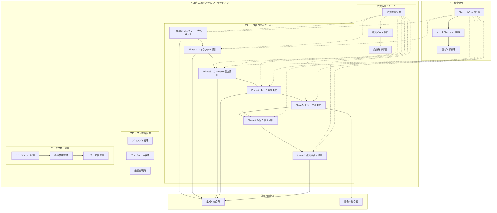

# AI漫画生成サービス AI設計書

**文書管理情報**
- 文書ID: AI-DOC-001
- 作成日: 2025-01-20
- 版数: 3.0
- 承認者: 根岸祐樹
- 関連文書: SYS-DOC-001（システム設計書）、TEST-DOC-001（テスト設計書）
- 更新履歴:
  - v1.0: 基本設計完成
  - v2.0: HITL統合・品質制御強化
  - v3.0: Phase2-7詳細実装仕様統合 (Phase2-7_Implementation_Strategy.md統合)
- **更新内容**: HITL（Human-in-the-loop）システム統合対応

## 目次

- [1. AI設計概要](#1-ai設計概要)
  - [1.1 AI設計方針](#11-ai設計方針)
  - [1.2 統合モジュールアーキテクチャ](#12-統合モジュールアーキテクチャ)
- [2. 7フェーズHITLシステム設計](#2-7フェーズhitlシステム設計)
  - [2.1 HITLモジュール統合設計](#21-hitlモジュール統合設計)
  - [2.2 フィードバック処理パイプライン](#22-フィードバック処理パイプライン)
  - [2.3 フェーズ仕様](#23-フェーズ仕様)
- [3. プロンプトエンジニアリング設計](#3-プロンプトエンジニアリング設計)
  - [3.1 動的プロンプトシステム](#31-動的プロンプトシステム)
  - [3.2 構造化テンプレート管理](#32-構造化テンプレート管理)
  - [3.3 プロンプト最適化戦略](#33-プロンプト最適化戦略)
- [4. 品質制御システム](#4-品質制御システム)
  - [4.1 基本品質評価](#41-基本品質評価)
  - [4.2 品質ゲート実装](#42-品質ゲート実装)
  - [4.3 リトライ機構](#43-リトライ機構)
- [5. AI学習・改善システム](#5-ai学習改善システム)
  - [5.1 フィードバック収集](#51-フィードバック収集)
  - [5.2 基本改善プロセス](#52-基本改善プロセス)
  - [5.3 統計分析](#53-統計分析)
- [6. 外部AI API統合設計](#6-外部ai-api統合設計)
  - [6.1 Google Gemini Pro統合](#61-google-gemini-pro統合)
  - [6.2 Google Imagen 4統合](#62-google-imagen-4統合)
  - [6.3 APIレート制限管理](#63-apiレート制限管理)
- [7. AI処理パフォーマンス設計](#7-ai処理パフォーマンス設計)
  - [7.1 処理時間最適化](#71-処理時間最適化)
  - [7.2 並列処理設計](#72-並列処理設計)
  - [7.3 リソース効率化](#73-リソース効率化)
- [8. AI倫理・安全性設計](#8-ai倫理安全性設計)
  - [8.1 コンテンツ安全性](#81-コンテンツ安全性)
  - [8.2 バイアス軽減](#82-バイアス軽減)
  - [8.3 透明性確保](#83-透明性確保)

---

## 1. AI設計概要

### 1.1 AI設計方針

#### 基本原則
| 原則 | 内容 | 実装アプローチ |
|------|------|---------------|
| HITL統合 | 7フェーズユーザー参加型処理 | インタラクティブフィードバックシステム |
| 品質協調 | ユーザーとAIの協調による品質向上 | リアルタイムフィードバック統合 |
| 効率的相互作用 | 30秒タイムアウト付きスムーズなやり取り | EventTarget+自然言語処理 |
| 継続学習 | フィードバックからの自動学習 | フィードバック分析・改善サイクル |

#### AI設計思想
```yaml
AI Design Philosophy:
  Processing Model: Human-in-the-loop協調型
    - 各フェーズでユーザーフィードバック統合
    - AI提案→ユーザー確認・修正→反映のサイクル
    - 自然言語フィードバック処理による学習
    
  Quality Assurance: 協調品質管理
    - AI品質評価とユーザー主観評価の統合
    - フィードバック統合による継続的改善
    - 品質ゲートによる段階的品質保証
    
  User Experience: 参加型創作支援
    - リアルタイムプレビューによる即座の確認
    - 直感的フィードバック入力インターフェース
    - 応答性を重視したスムーズな進行
    
  Performance Requirements:
    - フェーズ間遷移: 最適化された応答時間
    - ユーザーフィードバック処理: リアルタイム対応
    - 品質評価サイクル: 効率的な評価プロセス
```

### 1.2 統合モジュールアーキテクチャ

#### 統合AIサービス構成


---

## 2. 7フェーズAIモジュール設計

### 2.1 モジュール統合設計

#### 統合AIサービス設計原則

**統合AI処理サービスの設計考慮事項:**

- **7フェーズモジュール統合アーキテクチャ**: コンセプト分析から最終統合まで段階的処理を実現する設計パターン
- **品質管理システム統合**: 各フェーズでの品質評価と全体的な品質保証の統合メカニズム
- **プロンプト管理戦略**: フェーズ固有の最適化プロンプトと動的調整機能の設計
- **データパイプライン設計**: フェーズ間のデータ流通と永続化戦略
- **非同期処理アーキテクチャ**: チェックポイント保存と並列処理の最適化設計

**統合処理実行の設計原則:**

- **インメモリパイプライン**: 高速処理を実現する一時的データ保持戦略
- **順次実行制御**: フェーズ依存関係を考慮した実行順序管理
- **処理時間追跡**: パフォーマンス分析のためのメトリクス収集設計
- **エラー回復戦略**: フェーズ失敗時の包括的エラーハンドリングとリカバリ機構

**基底AIモジュール設計仕様:**

- **品質閾値管理**: フェーズごとの適切な品質基準設定（標準: 70%、最適: 85%）
- **リトライ戦略**: 最大3回のリトライと段階的品質向上アプローチ
- **品質ゲート実装**: 品質基準未達成時の自動再処理と結果最適化
- **結果永続化**: PostgreSQLチェックポイントとCloud Storageプレビューによるハイブリッド保存
- **劣化許容設計**: 60%以上の品質で許容可能な代替結果提供

#### Phase 1: コンセプト・世界観分析設計

**設計アプローチ:**

- **動的プロンプト戦略**: テキスト長、スタイル、ジャンル特性に応じた最適化プロンプト生成
- **包括的コンセプト分析**: 主要コンセプト、テーマ、ジャンル、読者層、世界観の体系的抽出
- **Gemini Pro統合**: 高度な自然言語理解能力を活用した分析処理
- **構造化結果生成**: 後続フェーズで活用しやすい形式での分析結果出力

**品質評価設計:**

- **キャラクター抽出品質 (40%)**: 入力テキストからの適切なキャラクター識別と特性抽出
- **テーマ理解品質 (30%)**: 作品の核となるテーマの的確な把握と表現
- **構造理解品質 (30%)**: ストーリー構造と章立ての論理的理解

**期待成果物:**

- 作品の主要コンセプト定義
- メインテーマとサブテーマ
- ジャンル分類（少年、少女、青年等）
- ターゲット読者層の特定
- 世界観・設定の詳細化
- 作品トーンの設定
- 想定ページ数の見積もり

#### Phase 2: キャラクター設計戦略
**設計アプローチ**
- **統合的キャラクター設計**: コンセプト情報を活用した一貫性のあるキャラクター構築
- **多面的設計戦略**: 外観・性格・背景・関係性の包括的設計
- **ビジュアル参考生成**: 初期ビジュアルアイデア提供による創作支援

**品質保証戦略**
```yaml
Character Design Quality:
  Consistency Check: 一貫性評価
    - Phase1のコンセプト・世界観との整合性
    - キャラクター間の関係性の論理性
    - 設定の内部矛盾検出
    
  Design Depth: 設計深度評価
    - キャラクター背景の詳細度
    - 成長・変化の可能性設計
    - 読者共感度の予測評価
    
  Visual Coherence: ビジュアル統合性
    - 世界観とのビジュアル適合性
    - キャラクター識別性の確保
    - 表現技法の一貫性
```
        
**期待成果物**
- 主要キャラクターの詳細プロファイル
- キャラクター間関係性マトリックス
- 参考ビジュアルアイデア（1-2枚のコンセプトアート）
- 後続フェーズへの設計指針

**キャラクタービジュアル生成戦略:**

- **主要キャラクター選択**: 最大2体のメインキャラクターに焦点を当てた効率的ビジュアル生成
- **プロンプト最適化**: ジャンル・世界観に適合したキャラクター描写プロンプトの生成
- **Imagen 4統合**: 安全フィルターレベル3、1:1アスペクト比での参考画像生成
- **並列処理設計**: 複数キャラクターの同時ビジュアル生成による効率化

**ネーム生成設計アプローチ:**

- **包括的ネーム戦略**: プロ漫画家の重要工程を模倣した全体的なネーム構築
- **コマ割り設計**: ページごとの最適なパネルレイアウト計画
- **ラフスケッチ戦略**: ストーリー表現のための簡潔な視覚的表現
- **セリフ配置最適化**: ダイアログとナレーションの効果的配置
- **ページ構成管理**: 見開き設計と全体的な構成バランス
- **シーン転換設計**: 自然な場面移行とリーディングフロー最適化

#### Phase 3: ストーリー構造設計戦略

**ナラティブ構築アプローチ**
- **階層的構造設計**: テーマ・キャラクターを統合した総合的プロット構築
- **感情曲線最適化**: 読者の感情体験を考慮したストーリー展開
- **ペーシング管理**: リズムと緊張感のバランス調整

**品質保証戦略**
```yaml
Story Structure Quality:
  Narrative Coherence: ナラティブ一貫性
    - ストーリーラインの論理性評価
    - キャラクター動機の一貫性確認
    - 世界観との整合性検証
    
  Emotional Impact: 感情的インパクト
    - クライマックスの効果測定
    - 感情変化の自然さ評価
    - 読者共感度の予測
    
  Pacing Balance: ペーシングバランス
    - シーン長の最適分配
    - 緊張と弛緩のリズム調整
    - 展開速度の適切性
```

**期待成果物**
- 詳細プロット構造（起承転結）
- シーン分解と進行設計
- 感情曲線マッピング
- ペーシング最適化指針

#### Phase 4: ネーム構成生成戦略（最重要工程）

**ビジュアルコミュニケーション戦略**
- **コマ割り最適化**: ストーリーテリングと読みやすさのバランス
- **演出設計戦略**: 感情表現と視覚的インパクトの最大化
- **読み流し設計**: 自然な視線誘導とページターン最適化

**技術的アプローチ**
```yaml
Storyboard Design Approach:
  Panel Composition: コマ構成戦略
    - シーン重要度に応じたコマサイズ配分
    - ページ全体のバランスとリズム調整
    - クライマックスシーンの大コマ配置
    
  Visual Direction: 演出指示戦略
    - カメラアングルの慈意的選択
    - キャラクターポジションの物語性考慮
    - 背景と効果線の気分造成
    
  Reading Flow: 読み流し最適化
    - コマ間の連続性とリズム調整
    - ページメクリと大コマの効果的配置
    - シーン転換のスムーズな演出
```

**期待成果物**
- コマ割り設計（ページごとの最適配置）
- シーン生成詳細指示（背景・キャラクター・効果）
- カメラアングル指定（俯瞰・アオリ・バストショット等）
- 読み流し最適化指針

**包括的ネーム生成設計:**

- **ページ最適化戦略**: ページごとの最適なコマ数決定ロジック
- **重要シーン強調**: 大ゴマ配置による視覚的インパクト最大化
- **視線誘導設計**: 読者の視線をスムーズに誘導するレイアウト最適化
- **シーン指示システム**: 背景・キャラクター・効果の包括的な生成指示
- **カメラワーク戦略**: 俯瞰・アオリ・正面・バストショット等の効果的活用

**パフォーマンス最適化戦略**
- **ビジュアル効率性**: コマ構成の最適化と読み流しへの影響最小化
- **シーン演出効率**: キャラクター配置と背景要素のバランス最適化
- **演出効果設計**: 効果線と視覚効果の最大限活用

#### Phase 5: ビジュアル生成戦略（高度並列処理アーキテクチャ）

**パフォーマンス設計原則**
- **並列処理最適化**: シーン生成の高速化とリソース効率最大化
- **キャッシュ戦略**: 似たシーンの再利用による生成時間短縮
- **品質効率バランス**: 高速性と高品質の両立

**アーキテクチャ戦略**
```yaml
Visual Generation Architecture:
  Cache Strategy: キャッシュ最適化戦略
    - シーン類似度解析と再利用ロジック
    - インテリジェントキャッシュ管理
    - 動的キャッシュ無効化と更新
    
  Parallel Processing: 並列処理最適化
    - バッチサイズのAPI制限適応型調整
    - 非同期タスク管理とリソース割り当て
    - エラー耐性とリトライ機構
    
  Quality Assurance: 品質保証統合
    - リアルタイム品質評価と一貫性チェック
    - スタイル統一性とキャラクターアイデンティティ保持
    - 進捗追跡とユーザーフィードバック統合
```

**品質保証戦略**

| 品質評価軸 | 評価基準 | 重み付け |
|-----------|---------|----------|
| キャラクター精度 | Phase2設計との一致度 | 25% |
| スタイル一貫性 | 作品全体での視覚的統一性 | 20% |
| 構図品質 | コマ割りとの適合性 | 20% |
| 技術品質 | 解像度・色彩・細部品質 | 15% |
| 物語明確性 | シーン情報の伝達効果 | 10% |
| 芸術的魅力 | 美的評価と感情表現 | 10% |

**期待成果物**
- シーン別高品質画像セット
- シーン-画像マッピング
- 品質分析レポートと一貫性評価
- パフォーマンス効率性指標

**ビジュアル生成パイプライン設計:**

1. **シーン類似度解析・キャッシュ戦略**: 過去生成結果の効率的再利用による処理時間短縮
2. **未キャッシュシーン特定**: 新規生成が必要なシーンの動的識別とフィルタリング
3. **並列バッチ処理設計**: API制限と並列度を考慮した最適バッチサイズ調整
4. **進捗追跡システム**: リアルタイム進捗更新とユーザーフィードバック提供
5. **品質分析統合**: 生成画像の品質評価と一貫性レポート生成
6. **シーン-画像マッピング**: 効率的な結果組織化と後続処理準備

**パフォーマンス最適化戦略:**

- **動的バッチサイズ調整**: 並列ワーカー数とAPI制限の動的バランシング
- **キャッシュヒット最大化**: 類似シーンの効率的再利用による処理時間削減
- **リアルタイム進捗管理**: ユーザー体験向上のための詳細進捗追跡
**結果統合・評価設計:**

- **シーン-画像マッピング生成**: 効率的な結果構造化と後続処理最適化
- **並列効率スコア算出**: 処理パフォーマンス分析とボトルネック特定
- **包括的結果構造**: 生成画像、品質分析、一貫性レポート、統計情報の統合
- **スタイル一貫性評価**: 全体的な視覚的統一性と品質基準確保

**期待する結果指標:**

- 生成画像の総合品質スコア
- キャッシュヒット率による効率性測定
- 並列処理による時間短縮効果
- スタイル一貫性による品質保証
**並列バッチ処理設計原則:**

- **タスク並列化戦略**: シーンごとの独立した画像生成タスクの効率的並列実行
- **例外耐性設計**: 個別タスク失敗時の全体処理継続とフォールバック機能
- **結果統合メカニズム**: 正常処理とエラー処理結果の統一的な結果構造

**単一画像生成戦略:**

- **最適化プロンプト設計**: シーン特性（タイプ、キャラクター、感情、設定）を統合したプロンプト生成
- **Imagen 4 API統合**: 16:9アスペクト比、適切な安全フィルターレベル設定
- **非同期キャッシュ戦略**: 生成結果の効率的保存と再利用機能
- **包括的メタデータ管理**: シーンID、プロンプト、生成時間、タイムスタンプの統合記録

**フォールバック戦略設計:**

- **段階的フォールバック**: 簡素化プロンプト → プレースホルダー画像の多層的エラー回復
- **エラー情報保持**: 原因追跡のための詳細エラー情報保持
- **品質保証**: より厳格な安全フィルターによる確実な代替画像生成
- **可用性優先**: 最終的にプレースホルダーでも結果提供を保証する設計
    
    async def evaluate_quality(self, input_data: dict, output_data: dict) -> float:
        """
        画像生成品質評価
        """
        images = output_data['images']
        quality_scores = []
        
        for image in images:
            # 技術的品質評価
            tech_score = await self.evaluate_image_technical_quality(image['image_url'])
            
            # シーン一致度評価
            scene_score = await self.evaluate_scene_matching(
                input_data['scenes'], image
            )
            
            # スタイル一貫性評価
            style_score = output_data['style_consistency_score']
            
            image_quality = (tech_score * 0.4) + (scene_score * 0.4) + (style_score * 0.2)
            quality_scores.append(image_quality)
        
        return sum(quality_scores) / len(quality_scores) if quality_scores else 0.0
```

#### Phase 6: 対話配置最適化戦略

**テキストレイアウト最適化アプローチ**
- **読みやすさ最優先**: 吹き出しとセリフの直感的配置
- **視覚的バランス**: 画像とテキストの調和した統合
- **感情表現最大化**: オノマトペとナレーションの効果的配置

**設計戦略**
```yaml
Text Layout Design Strategy:
  Speech Bubble Optimization: 吹き出し最適化
    - コマ内スペースとの効率的バランス
    - 読み順序と視線誘導の最適化
    - キャラクターとの関係性明確化
    
  Typography Strategy: タイポグラフィ戦略
    - シーンの気分とフォントスタイル連動
    - キャラクターの性格とテキスト表現統合
    - 可読性と芸術性のバランス調整
    
  Sound Effect Integration: 効果音統合
    - オノマトペの視覚的インパクト最大化
    - シーンの動的感と音響効果の調和
    - ナレーションの物語進行支援機能
```

**期待成果物**
- 最適化された吹き出し配置
- シーンに合わせたセリフテキスト
- 効果的オノマトペ配置
- ナレーションとタイポグラフィ指定
    
    async def place_text_elements(self, images: dict, layout: dict, plot: dict) -> dict:
        """
        テキスト要素の最適配置
        """
        # 吹き出し位置の最適化
        speech_bubbles = await self.optimize_speech_bubble_positions(images, layout)
        
        # セリフの配置と調整
        dialog_texts = await self.place_dialogs(plot, speech_bubbles)
        
        # 効果音の配置
        sound_effects = await self.place_sound_effects(images, layout)
        
        # ナレーションの配置
        narration = await self.place_narration(plot, images)
        
        # テキストスタイルの設定
        text_styles = await self.determine_text_styles(dialog_texts, sound_effects)
        

#### Phase 7: 品質統合・調整戦略

**統合品質管理アプローチ**
- **全体統合最適化**: 全フェーズ成果のシームレスな統合
- **品質保証フレームワーク**: 統一性、完成度、表現力の総合評価
- **出力最適化**: 多様な形式と品質での最終成果物提供

**最終品質管理戦略**
```yaml
Final Quality Management:
  Integration Quality: 統合品質管理
    - フェーズ間一貫性の総合評価
    - シームレスな読み体験の確保
    - ビジュアルとテキストの調和性検証
    
  Output Optimization: 出力最適化
    - 多プラットフォーム対応形式
    - 高品質出力とファイルサイズの最適バランス
    - メタデータとトレーサビリティ情報
    
  Quality Assurance: 品質保証プロセス
    - 客観的指標と主観的評価の統合
    - ユーザーフィードバックの最終反映
    - 品質レポートと改善提案
```

**期待成果物**
- 統合された漫画作品（完成版）
- 総合品質スコアと評価レポート
- 多形式出力（PDF、WebP等）
- 作品メタデータと履歴情報
    
    async def integrate_all_elements(self, images: dict, text: dict) -> dict:
        """
        全要素の統合処理
        """
        # 画像とテキストの統合
        integrated_pages = []
        for page_id, page_images in images.items():
            page_text = text.get(page_id, {})
            integrated_page = await self.integrate_page(page_images, page_text)
            integrated_pages.append(integrated_page)
        
        # ページ順序の最適化
        ordered_pages = await self.optimize_page_order(integrated_pages)
        
        # 最終的な調整
        final_manga = await self.apply_final_adjustments(ordered_pages)
        
        return final_manga
```

### 2.3 HITL統合戦略

#### フィードバック統合アーキテクチャ
**フィードバック処理戦略**

```yaml
HITL Feedback Strategy:
  Natural Language Processing: 自然言語処理戦略
    - ユーザーフィードバックの意図解析
    - コンテキストを考慮したフィードバック分類
    - 各フェーズに適応した修正指示生成
    
  Real-time Integration: リアルタイム統合
    - WebSocketを活用した即座フィードバック反映
    - タイムアウト機構と適応型進行制御
    - 進捗状況の可視化とユーザー通知
    
  Quality Improvement: 品質改善サイクル
    - フィードバック履歴の分析と学習
    - AIモデルの継続的改善と適応
    - ユーザー嗜好の学習とカスタマイズ
```
    
**タイムアウト管理戦略**

| タイムアウト管理要素 | 戦略アプローチ | 期待効果 |
|-----------------|----------|--------|
| 待機時間最適化 | フェーズに応じた適切なタイムアウト設定 | ユーザー体験向上 |
| 適応型進行 | タイムアウト時のスムーズな継続機構 | 作品完成率向上 |
| リアルタイム通知 | WebSocketでの即座ステータス通知 | ユーザーエンゲージメント向上 |
| 挙動記録 | フィードバックパターンの学習と最適化 | AIシステムの継続改善 |
    
**データ継承戦略**
- **シームレスデータフロー**: フェーズ間の情報伝達と整合性保持
- **状態管理最適化**: PostgreSQLとアプリケーションメモリによる軽量セッション管理
- **エラー耐性設計**: データ異常時の回復機構とフォールバック戦略
    
    async def get_cumulative_context(self, request_id: str, current_phase: int) -> dict:
        """
        累積コンテキスト取得（必要に応じて）
        """
        context = {}
        
        # Phase 1-3: ストーリー基盤情報
        if current_phase >= 2:
            phase1_concept_data = await self.get_phase_data(request_id, 1)
            context['phase1_concept'] = phase1_concept_data
            
        if current_phase >= 3:
            phase2_character_data = await self.get_phase_data(request_id, 2)
            context['phase2_character'] = phase2_character_data
            
        # Phase 4以降: キャラクター・設定情報
        if current_phase >= 5:
            context['characters'] = await self.get_phase_data(request_id, 4)
            
        return context
```

### 2.3 フェーズ仕様

#### HITLフェーズ個別仕様
```yaml
HITL Phase Specifications:
  Phase1_ConceptAnalysis:
    AI_Input: {text: str, style: str, pages: int}
    AI_Output: {theme: str, genre: str, world_setting: str, target_audience: str, tone: str, keywords: list}
    User_Preview: "テーマ、ジャンル、世界観、対象読者層のプレビュー"
    Feedback_Options: ["テーマ修正", "ジャンル変更", "世界観調整", "雰囲気変更"]
    AI_API: Gemini Pro
    Processing_Time: "12s + 最大30分フィードバック待機"
    Quality_Metrics: [concept_clarity, user_satisfaction, feedback_integration]
    
  Phase2_CharacterDesign:
    AI_Input: {phase1_concept: dict, user_feedback_history: list}
    AI_Output: {characters: list, relationships: dict, visual_designs: list, reference_images: list}
    User_Preview: "キャラクター設定、関係性、ビジュアルデザインのプレビュー"
    Feedback_Options: ["キャラ追加/削除", "性格変更", "ビジュアル調整", "関係性修正"]
    AI_API: Gemini Pro + Imagen 4
    Processing_Time: "18s + 最大30分フィードバック待機"
    Quality_Metrics: [character_consistency, visual_quality, user_approval]
    
  Phase3_PlotStructure:
    AI_Input: {phase1_concept: dict, phase2_character: dict, user_feedback: list}
    AI_Output: {three_act_structure: dict, emotional_arc: list, page_allocation: dict}
    User_Preview: "3幕構成、起承転結、感情曲線のプレビュー"
    Feedback_Options: ["プロット変更", "ペーシング調整", "クライマックス修正"]
    AI_API: Gemini Pro
    Processing_Time: "15s + 最大30分フィードバック待機"
    Quality_Metrics: [plot_coherence, story_flow, user_approval]
    
**パフォーマンス目標と品質指標**

| フェーズ | 応答性目標 | 品質指標 | ユーザーエンゲージメント |
|-------|----------|--------|----------------|
| Phase 4 | 最適化されたレスポンス | レイアウト品質・演出効果 | インタラクティブコマ割り設計 |
| Phase 5 | 並列処理最適化 | 画像品質・スタイル一貫性 | ビジュアルプレビュー体験 |
| Phase 6 | 美黿なテキスト配置 | 可読性・バランス | 細かなカスタマイズ対応 |
| Phase 7 | 高速統合処理 | 全体一貫性・製品品質 | 最終品質確認 |

**システムレスポンス戦略**
- **応答性最適化**: 各フェーズでの効率的処理時間とユーザー体験のバランス
- **アダプティブタイムアウト**: ユーザーのペースに合わせた柔軟なフィードバック待機
- **リアルタイムエンゲージメント**: 積極的ユーザー参加と即座フィードバック反映
- **シームレスデータフロー**: フェーズ間の情報継承と一貫性保持

### 2.4 フェーズ間データインターフェース仕様

#### 2.4.1 データフロー標準化

**フェーズ間データ契約**

各フェーズ間のデータ交換は以下の標準化されたインターフェースに従います：

```yaml
Data Interface Specification:
  Phase 1 → Phase 2:
    Input Fields:
      - story_context: str (物語の基本コンテキスト)
      - genre: str (ジャンル分類)
      - themes: List[str] (主要テーマ一覧)
      - target_audience: str (対象読者層)

  Phase 2 → Phase 3:
    Input Fields:
      - characters: List[Dict] (キャラクター情報)
        - name: str (キャラクター名)
        - visual_description: str (ビジュアル描写)
        - personality: str (性格特性)
        - role: str (物語での役割)
      - story_context: str (継承される物語コンテキスト)

  Phase 3 → Phase 4:
    Input Fields:
      - scenes: List[Dict] (標準化されたシーン情報) ※重要: scene_breakdownではなくscenes
        - scene_id: int (シーン識別子)
        - description: str (シーン描写)
        - characters: List[str] (登場キャラクター)
        - setting: str (舞台設定)
        - emotion: str (感情トーン)
      - story_structure: Dict (物語構造情報)
      - characters: List[Dict] (キャラクター情報継承)

  Phase 4 → Phase 5:
    Input Fields:
      - panels: List[Dict] (パネル構成情報)
        - panel_id: int (パネル識別子)
        - layout_type: str (レイアウトタイプ)
        - camera_angle: str (カメラアングル)
        - scene_description: str (シーン描写)
        - characters: List[str] (登場キャラクター)
      - characters: List[Dict] (キャラクター情報継承)
      - story_context: str (継承される物語コンテキスト)

  Phase 5 → Phase 6:
    Input Fields:
      - image_descriptions: List[Dict] (画像生成結果)
        - panel_id: int (パネル識別子)
        - description: str (画像描写)
        - characters: List[str] (登場キャラクター)
        - setting: str (背景設定)
      - scenes: List[Dict] (シーン情報継承) ※重要: Phase 3からの標準化フィールド
      - characters: List[Dict] (キャラクター情報継承)

  Phase 6 → Phase 7:
    Input Fields:
      - dialogue_placements: List[Dict] (対話配置情報)
        - panel_id: int (パネル識別子)
        - dialogues: List[Dict] (対話情報)
        - placements: List[Dict] (配置情報)
      - panels: List[Dict] (パネル情報継承)
      - image_descriptions: List[Dict] (画像情報継承)
```

#### 2.4.2 標準化フィールド定義

**重要なフィールド名標準化**

以下のフィールド名は全フェーズで統一されます：

```yaml
Standard Field Names:
  Character Information:
    - characters: List[Dict] (キャラクター情報 - 全フェーズ共通)
    - character_name: str (キャラクター名)
    - character_description: str (キャラクター描写)

  Scene Information:
    - scenes: List[Dict] (シーン情報 - Phase 3出力からPhase 6入力まで統一)
    - scene_id: int (シーン識別子)
    - scene_description: str (シーン描写)

  Panel Information:
    - panels: List[Dict] (パネル情報 - Phase 4からPhase 7まで統一)
    - panel_id: int (パネル識別子)
    - panel_description: str (パネル描写)

  Context Information:
    - story_context: str (物語コンテキスト - 全フェーズ継承)
    - processing_metadata: Dict (処理メタデータ)
      - phase: int (フェーズ番号)
      - timestamp: str (処理時刻)
      - processing_status: str (処理ステータス)
```

**バリデーション規則**

```yaml
Validation Rules:
  Required Fields Check:
    - 各フェーズの入力必須フィールドの存在確認
    - データ型の整合性チェック
    - 値の妥当性検証

  Field Name Consistency:
    - Phase 3 出力の「scenes」フィールド確保
    - Phase 6 入力での「scenes」フィールド期待値適合
    - 全フェーズでの「characters」フィールド統一

  Data Continuity:
    - 前フェーズ結果の必要情報継承確認
    - ID系フィールドの連続性保証
    - メタデータの適切な更新
```

## 3. 最適化アーキテクチャ戦略

### 3.1 並列処理最適化戦略

**フェーズ独立性設計原則**
```yaml
Parallel Processing Strategy:
  Phase Independence: フェーズ独立性最適化
    - Phase2-3の並列実行可能性分析
    - 依存関係の明確化と独立操作の特定
    - 結果統合ロジックの効率化
    
  Resource Optimization: リソース最適化
    - 非同期タスク管理とリソース割り当て
    - キャッシュ戦略とメモリ効率化
    - エラーハンドリングとリトライ機構
    
  Data Flow Optimization: データフロー最適化
    - フェーズ間データ継承の効率化
    - 一貫性チェックサムと整合性検証
    - 最適化されたデータ結合とキャッシュ管理
```

### 3.2 品質効率バランス戦略

**パフォーマンスと品質の最適バランス**
- **適応的品質制御**: ユーザーニーズに応じた動的品質調整
- **リアルタイム最適化**: 処理速度と品質の動的バランス調整
- **スケーラブル設計**: ロードに応じた柔軟なリソース配分

**総合パフォーマンス戦略**
- **効率的AI処理**: 最適化された応答性とユーザー体験の調和
- **ユーザーエンゲージメント**: 積極的参加とリアルタイムフィードバック統合
- **シームレスデータフロー**: フェーズ間の情報伝達と整合性保持システム

##### Phase 4 ネーム生成 詳細設計

###### コマ割りアルゴリズム
```python
def _determine_panel_count(self, pacing: str, genre: str) -> int:
    base_counts = {
        "fast": [2, 3, 4],      # アクション重視
        "medium": [3, 4, 5],    # バランス型
        "slow": [1, 2, 3]       # 感情重視
    }
    
    genre_modifiers = {
        "action": 0,            # 大きなパネル優先
        "romance": 1,           # 細かい感情表現
        "mystery": 1,           # 詳細な描写
        "slice_of_life": 1      # 日常の細やかさ
    }
    
    base_range = base_counts.get(pacing, base_counts["medium"])
    modifier = genre_modifiers.get(genre, 0)
    
    return random.choice(base_range) + modifier
```

###### 構図決定ロジック
```python
def _select_camera_angle(self, scene, panel_num, total_panels):
    # 導入パネル: wide_shot で状況説明
    if panel_num == 1 and total_panels > 1:
        return "wide_shot"
    
    # 最終パネル: close_up でリアクション
    if panel_num == total_panels and total_panels > 1:
        return "close_up"
        
    # シーン目的に応じた選択
    if "conflict" in scene.get("purpose", ""):
        return "medium_shot"
    elif "climax" in scene.get("purpose", ""):
        return "close_up"
    else:
        return "full_shot"
```

###### カメラアングル選択マトリックス
| シーン目的 | 推奨アングル | 理由 |
|------------|-------------|------|
| introduction | wide_shot | 状況・環境の説明 |
| conflict | medium_shot | キャラクター間の対立 |
| climax | extreme_close_up | 感情の最高潮 |
| resolution | full_shot | 全体的な解決感 |
| dialogue | close_up | キャラクター表情重視 |
| action | dynamic_angle | 躍動感の表現 |

###### ページレイアウト最適化
```python
def _calculate_visual_weight_distribution(self, panels):
    weights = []
    for panel in panels:
        size_weight = {"splash": 4, "large": 3, "medium": 2, "small": 1}[panel.size]
        angle_weight = {"extreme_close_up": 1.5, "close_up": 1.3, "medium_shot": 1.0, 
                       "full_shot": 0.8, "wide_shot": 0.6}[panel.camera_angle]
        weights.append(size_weight * angle_weight)
    
    max_weight = max(weights)
    total_weight = sum(weights)
    
    if max_weight / total_weight > 0.6:
        return "dominated"  # 1つのパネルが支配的
    elif max_weight / total_weight < 0.35:
        return "balanced"   # バランス良好
    else:
        return "weighted"   # 適度な重み付け
```

##### Phase 5 並列処理実装

###### シーンバッチング戦略
```python
async def _execute_parallel_generation(self, generation_tasks, session_id):
    # 5並列セマフォ制御
    async def generate_single_image(task):
        async with self.semaphore:  # max_concurrent_generations = 5
            return await self._generate_single_image(task, session_id)
    
    # 全タスクを同時開始、セマフォで制御
    results = await asyncio.gather(
        *[generate_single_image(task) for task in generation_tasks],
        return_exceptions=True
    )
    
    return self._process_parallel_results(results)
```

###### 優先度ベーススケジューリング
```python
def _calculate_panel_priority(self, panel_spec, all_panels):
    priority = 5  # ベース優先度
    
    # 早いパネルほど高優先度
    if panel_spec.page_number == 1:
        priority += 2
    
    # クライマックスパネルは高優先度
    if panel_spec.emotional_tone in ["climax", "tension"]:
        priority += 2
        
    # パネルサイズによる調整
    if panel_spec.size in ["splash", "large"]:
        priority += 1
    
    return min(10, max(1, priority))
```

###### 失敗時のリトライとフォールバック
```python
async def _generate_single_image(self, task, session_id):
    for attempt in range(task.max_retries + 1):
        try:
            # キャッシュ確認
            cache_key = self._generate_cache_key(task)
            if cache_key in self.image_cache:
                return self.image_cache[cache_key]
            
            # 画像生成実行
            result = await self._actual_image_generation(task)
            
            if result.get("success"):
                # キャッシュに保存
                self.image_cache[cache_key] = result
                return result
            else:
                if attempt < task.max_retries:
                    await asyncio.sleep(2 ** attempt)  # 指数バックオフ
                    continue
                    
        except Exception as e:
            if attempt < task.max_retries:
                await asyncio.sleep(2 ** attempt)
                continue
            else:
                # 最終フォールバック
                return await self._generate_fallback_image(task)
    
    return await self._generate_fallback_image(task)
```

###### キャッシュヒット最適化
```python
def _generate_cache_key(self, task):
    # プロンプトとスタイルパラメータのハッシュ
    cache_data = {
        "prompt": task.prompt,
        "negative_prompt": task.negative_prompt,
        "style": task.style_parameters,
        "dimensions": task.dimensions
    }
    cache_string = json.dumps(cache_data, sort_keys=True)
    return hashlib.md5(cache_string.encode()).hexdigest()
```

##### 品質制御メカニズム

###### フェーズ品質スコアリング
```python
class QualityMetric:
    def __init__(self, name, score, weight, details, recommendations):
        self.name = name
        self.score = score  # 0.0-1.0
        self.weight = weight  # 重み係数
        self.details = details
        self.recommendations = recommendations

quality_categories = {
    "visual_consistency": {"weight": 0.25},    # キャラクター・スタイル一貫性
    "narrative_coherence": {"weight": 0.20},   # 物語の整合性  
    "technical_quality": {"weight": 0.15},     # 技術的品質
    "readability": {"weight": 0.15},           # 読みやすさ
    "pacing_flow": {"weight": 0.10},           # ペーシング・フロー
    "character_development": {"weight": 0.10}, # キャラクター描写
    "artistic_appeal": {"weight": 0.05}        # 芸術的魅力
}
```

###### フィードバックループ設計
```python
async def apply_feedback(self, original_result, feedback):
    """ユーザーフィードバックの適用"""
    adjusted_result = original_result.copy()
    
    if feedback.get("type") == "regeneration":
        # 特定パネルの再生成
        panel_id = feedback.get("panel_id")
        new_result = await self._regenerate_panel(panel_id, feedback.get("modifications"))
        adjusted_result["generated_images"][panel_id] = new_result
        
    elif feedback.get("type") == "adjustment":
        # パラメータ調整
        adjustments = feedback.get("adjustments", {})
        adjusted_result.update(adjustments)
    
    adjusted_result["feedback_applied"] = feedback
    adjusted_result["feedback_timestamp"] = datetime.utcnow().isoformat()
    
    return adjusted_result
```

##### エラーハンドリング戦略

###### 段階的フォールバック
```python
class ErrorSeverity(Enum):
    LOW = "low"           # 警告レベル、処理継続
    MEDIUM = "medium"     # 一部機能制限で継続
    HIGH = "high"         # フェーズ失敗、リトライ
    CRITICAL = "critical" # パイプライン停止

async def handle_phase_error(self, error, phase_num):
    severity = self._assess_error_severity(error, phase_num)
    
    if severity == ErrorSeverity.LOW:
        self.log_warning(f"Phase {phase_num}: {error}")
        return "continue"
        
    elif severity == ErrorSeverity.MEDIUM:
        # 品質を下げて継続
        fallback_result = await self._generate_fallback_result(phase_num)
        return fallback_result
        
    elif severity == ErrorSeverity.HIGH:
        # リトライ実行
        return await self._retry_phase(phase_num)
        
    else:  # CRITICAL
        # パイプライン停止
        await self._emergency_shutdown(error)
        raise CriticalPipelineError(error)
```

##### パフォーマンス最適化

###### 並列効率スコア計算
```python
def _calculate_parallel_efficiency_score(self, generation_tasks, generation_results):
    # 理論的順次実行時間
    avg_single_time = self._calculate_average_generation_time(generation_results)
    theoretical_sequential_time = len(generation_tasks) * avg_single_time
    
    # 実際の並列実行時間
    actual_parallel_time = max(r.generation_time_ms for r in generation_results)
    
    # 効率スコア計算
    efficiency_score = 1.0 - (actual_parallel_time / theoretical_sequential_time)
    
    # 並列度による調整
    concurrency_benefit = min(1.0, self.max_concurrent_generations / len(generation_tasks))
    adjusted_score = efficiency_score * (0.5 + 0.5 * concurrency_benefit)
    
    return round(max(0.0, min(1.0, adjusted_score)), 3)
```

---

## 3. プロンプトエンジニアリング設計

### 3.1 動的プロンプトシステム

#### 動的プロンプト選択エンジン設計

**設計アプローチ:**

- **コンテキスト駆動選択**: エージェントタイプと処理コンテキストに基づく最適プロンプト選択戦略
- **テンプレート統合管理**: 階層化されたプロンプトテンプレートストアとの効率的連携
- **パフォーマンス最適化**: 使用実績データに基づく継続的な最適化メカニズム
- **動的パラメータ注入**: コンテキスト情報の動的テンプレート組み込み

**プロンプト最適化プロセス設計:**

1. **コンテキスト分析**: 入力データからの特徴抽出と分類
2. **テンプレート選択**: 成功率に基づく最適テンプレート識別
3. **パラメータ統合**: テンプレートへの動的コンテキスト情報注入
4. **動的最適化**: リアルタイム最適化アルゴリズムの適用
5. **使用記録**: パフォーマンス追跡のための詳細ログ記録

**コンテキスト特徴抽出戦略:**

- **Phase1専用特徴**: テキスト長カテゴリ、スタイル、複雑度指標
- **画像生成特徴**: シーンタイプ、キャラクター数、感情強度、設定複雑度
- **エージェント特化**: 各フェーズの特性に最適化された特徴抽出ロジック

**テンプレート選択基準:**

- **成功率優先**: 過去の実行成功率を主要な選択基準として採用
- **コンテキスト適合性**: 現在のコンテキスト特徴との類似度評価
- **パフォーマンス履歴**: 継続的な実行データによる動的評価更新

### 3.2 構造化テンプレート管理

#### 階層的プロンプトテンプレート設計

**テンプレート階層アーキテクチャ:**

- **基底テンプレート設計**: 各フェーズの核となるプロンプト構造定義
- **継承メカニズム**: 基底から派生する特化テンプレートの効率的管理
- **パラメータ化システム**: 動的コンテキスト注入のための構造化パラメータ定義
- **バリエーション管理**: シーン・テキスト特性に応じた最適化バリエーション

**フェーズ別テンプレート戦略:**

**Phase1（コンセプト分析）テンプレート設計:**
- **基底テンプレート**: 漫画制作専門家としての分析指示、JSON構造化出力定義
- **テキスト長対応**: 短文・長文・複雑構造に特化した追加指示システム
- **出力品質保証**: キャラクター・テーマ・感情・章構造の体系的抽出要件
- **スタイル適応**: 少年・少女・青年漫画スタイル別の最適化指示

**Phase5（シーン生成）テンプレート設計:**
- **ビジュアル基底テンプレート**: 高品質画像生成のための包括的指示体系
- **シーン特化バリエーション**: アクション・対話シーン別の構図・表現最適化
- **品質要件統合**: 解像度・一貫性・読みやすさの明確な品質基準定義
- **コンプライアンス**: 著作権・適切性の厳格なガイドライン組み込み

**テンプレート管理システム設計:**

- **継承処理メカニズム**: 基底テンプレートからの効率的な派生・統合システム
- **動的マージ機能**: 基本指示への追加指示の構造化統合
- **ID体系管理**: エージェントタイプ・テンプレート名の階層的識別システム
- **拡張可能設計**: 新フェーズ・新バリエーション追加への対応アーキテクチャ

### 3.3 プロンプト最適化戦略

#### A/Bテストによる最適化設計

**プロンプト最適化戦略:**

- **実験駆動最適化**: A/Bテストによる科学的なプロンプト性能向上アプローチ
- **動的バリアント選択**: 実行中実験に基づくプロンプトバリアント自動選択
- **品質基準最適化**: 品質スコアを主要成功指標とした継続的改善

**A/Bテスト実験設計:**

- **実験メタデータ管理**: テンプレートID・バリアント・成功指標の体系的管理
- **トラフィック分割戦略**: コントロール群50%・バリアントA群25%・バリアントB群25%の統計的有意性確保
- **実験期間設計**: 7日間・最小100サンプルの信頼性のある実験期間設定
- **自動実験管理**: 実験作成・実行・評価の自動化システム

**パフォーマンス追跡システム設計:**

- **包括的性能記録**: テンプレートID・コンテキスト・品質スコア・処理時間の統合追跡
- **BigQuery統合**: 大規模パフォーマンスデータの効率的保存・分析基盤
- **成功基準定義**: 70%品質閾値による客観的成功判定メカニズム
- **リアルタイム記録**: 非同期パフォーマンスログ記録による処理効率最適化

**月次性能分析戦略:**

- **統計的分析**: 30日間のテンプレート別平均品質・処理時間・使用頻度分析
- **成功率算出**: 品質基準達成率による客観的テンプレート評価
- **最適化機会特定**: 低性能テンプレートの自動識別と改善提案
- **上位パフォーマー分析**: 高性能テンプレートのベストプラクティス抽出

**継続改善メカニズム:**

- **データ駆動意思決定**: BigQueryベースの統計分析による客観的最適化判断
- **自動最適化機会検出**: 性能劣化テンプレートの自動アラートと改善提案
- **成功パターン学習**: 高性能テンプレートの特徴分析と新テンプレート生成への活用

---

## 4. 品質制御システム

### 4.1 基本品質評価

#### 品質評価フレームワーク
```python
class QualityEvaluationFramework:
    def __init__(self):
        self.evaluators = {
            'phase1_concept': ConceptAnalysisQualityEvaluator(),
            'phase2_character': CharacterDesignQualityEvaluator(),
            'phase3_plot': PlotStructureQualityEvaluator(),
            'phase4_name': NameGenerationQualityEvaluator(),
            'phase5_scene': SceneImageGenerationQualityEvaluator(),
            'phase6_dialog': DialogPlacementQualityEvaluator(),
            'phase7_final': FinalIntegrationQualityEvaluator()
        }
    
    async def evaluate_phase_quality(self, phase: int, input_data: dict, output_data: dict) -> dict:
        """
        フェーズ品質評価
        """
        agent_type = self.get_agent_type(phase)
        evaluator = self.evaluators[agent_type]
        
        # 基本品質スコア算出
        quality_score = await evaluator.calculate_quality_score(input_data, output_data)
        
        # 品質詳細分析
        quality_breakdown = await evaluator.analyze_quality_components(input_data, output_data)
        
        # 改善提案生成
        improvements = await evaluator.suggest_improvements(input_data, output_data, quality_score)
        
        return {
            'phase': phase,
            'agent_type': agent_type,
            'quality_score': quality_score,
            'passes_gate': quality_score >= 0.85,
            'quality_breakdown': quality_breakdown,
            'improvement_suggestions': improvements,
            'evaluation_timestamp': datetime.now().isoformat()
        }

# Phase 1専用品質評価器
class TextAnalysisQualityEvaluator:
    async def calculate_quality_score(self, input_data: dict, output_data: dict) -> float:
        """
        テキスト解析品質スコア算出
        """
        text = input_data['text']
        analysis = output_data
        
        scores = []
        
        # 1. キャラクター抽出精度 (40%)
        character_score = self.evaluate_character_extraction(text, analysis['characters'])
        scores.append(character_score * 0.4)
        
        # 2. テーマ理解度 (30%)
        theme_score = self.evaluate_theme_understanding(text, analysis['themes'])
        scores.append(theme_score * 0.3)
        
        # 3. 構造認識精度 (30%)
        structure_score = self.evaluate_structure_recognition(text, analysis['chapters'])
        scores.append(structure_score * 0.3)
        
        return sum(scores)
    
    def evaluate_character_extraction(self, text: str, characters: list) -> float:
        """
        キャラクター抽出精度評価
        """
        # 期待キャラクター数の推定
        estimated_characters = self.estimate_character_count(text)
        extracted_count = len(characters)
        
        # 抽出数の適切性
        count_accuracy = min(1.0, extracted_count / max(1, estimated_characters))
        
        # キャラクター名の妥当性チェック
        name_validity = self.check_character_name_validity(characters)
        
        # 重複排除チェック
        uniqueness = len(set(characters)) / len(characters) if characters else 1.0
        
        return (count_accuracy * 0.5) + (name_validity * 0.3) + (uniqueness * 0.2)
```

### 4.2 品質ゲート実装

#### 品質判定ロジック
```python
class QualityGate:
    def __init__(self):
        self.quality_thresholds = {
            'minimum_acceptable': 0.60,  # 最低許容レベル
            'target_quality': 0.70,     # 目標品質レベル
            'exceptional_quality': 0.85  # 優秀品質レベル
        }
        
    async def execute_quality_gate(self, phase: int, input_data: dict, output_data: dict) -> dict:
        """
        品質ゲート実行
        """
        # 品質評価実行
        quality_result = await self.evaluate_quality(phase, input_data, output_data)
        quality_score = quality_result['quality_score']
        
        # 判定処理
        if quality_score >= self.quality_thresholds['target_quality']:
            decision = 'pass'
            action = 'proceed_to_next_phase'
        elif quality_score >= self.quality_thresholds['minimum_acceptable']:
            decision = 'conditional_pass'
            action = 'proceed_with_warning'
        else:
            decision = 'fail'
            action = 'retry_or_escalate'
        
        # 結果記録
        gate_result = {
            'phase': phase,
            'quality_score': quality_score,
            'decision': decision,
            'action': action,
            'quality_breakdown': quality_result['quality_breakdown'],
            'threshold_comparison': {
                'target': self.quality_thresholds['target_quality'],
                'minimum': self.quality_thresholds['minimum_acceptable'],
                'actual': quality_score
            },
            'timestamp': datetime.now().isoformat()
        }
        
        await self.log_quality_gate_result(gate_result)
        return gate_result
```

### 4.3 リトライ機構

#### インテリジェントリトライ
```python
class IntelligentRetryManager:
    def __init__(self):
        self.retry_strategies = {
            'low_quality': 'parameter_adjustment',
            'api_timeout': 'exponential_backoff',
            'api_error': 'alternative_model',
            'content_filter': 'prompt_modification'
        }
    
    async def execute_retry(self, phase: int, failure_reason: str, context: dict) -> dict:
        """
        インテリジェントリトライ実行
        """
        retry_strategy = self.retry_strategies.get(failure_reason, 'standard_retry')
        
        if retry_strategy == 'parameter_adjustment':
            # パラメータ調整リトライ
            modified_context = await self.adjust_parameters(context, failure_reason)
            return await self.execute_phase_with_modified_context(phase, modified_context)
            
        elif retry_strategy == 'prompt_modification':
            # プロンプト修正リトライ
            modified_prompt = await self.modify_prompt_for_retry(context)
            return await self.execute_phase_with_modified_prompt(phase, modified_prompt, context)
            
        else:
            # 標準リトライ
            await asyncio.sleep(self.calculate_backoff_delay(context['retry_count']))
            return await self.execute_standard_retry(phase, context)
    
    async def adjust_parameters(self, context: dict, failure_reason: str) -> dict:
        """
        失敗理由に基づくパラメータ調整
        """
        modified_context = context.copy()
        
        if failure_reason == 'low_quality':
            # 品質向上のためのパラメータ調整
            if context.get('temperature'):
                modified_context['temperature'] = max(0.1, context['temperature'] - 0.2)
            if context.get('max_tokens'):
                modified_context['max_tokens'] = min(4000, context['max_tokens'] + 500)
        
        return modified_context
```

---

## 5. AI学習・改善システム

### 5.1 HITLフィードバック学習

#### HITLフィードバック収集システム
```python
class HITLFeedbackLearningSystem:
    def __init__(self):
        self.feedback_channels = {
            'realtime_hitl': RealtimeHITLCollector(),
            'phase_feedback': PhaseFeedbackCollector(),
            'natural_language': NaturalLanguageFeedbackCollector(),
            'interaction_patterns': InteractionPatternCollector()
        }
        self.learning_engine = HITLLearningEngine()
        
    async def collect_hitl_session_feedback(self, request_id: str) -> dict:
        """
        HITLセッション総合フィードバック収集
        """
        feedback_data = {}
        
        # 1. リアルタイムHITLフィードバック収集
        feedback_data['hitl_interactions'] = await self.feedback_channels['realtime_hitl'].collect(request_id)
        
        # 2. フェーズ別フィードバック分析
        feedback_data['phase_feedback'] = await self.feedback_channels['phase_feedback'].collect(request_id)
        
        # 3. 自然言語フィードバック解析
        feedback_data['natural_language_insights'] = await self.feedback_channels['natural_language'].collect(request_id)
        
        # 4. ユーザーインタラクションパターン
        feedback_data['interaction_patterns'] = await self.feedback_channels['interaction_patterns'].collect(request_id)
        
        # 5. HITL学習データ統合
        learning_data = await self.learning_engine.integrate_hitl_feedback(feedback_data)
        
        # 6. AI改善機会特定
        ai_improvements = await self.identify_ai_improvement_opportunities(learning_data)
        
        return {
            'request_id': request_id,
            'hitl_feedback_data': feedback_data,
            'learning_insights': learning_data,
            'ai_improvement_opportunities': ai_improvements,
            'user_satisfaction_score': learning_data.get('overall_satisfaction', 0.8),
            'collection_timestamp': datetime.now().isoformat()
        }

class UserRatingCollector:
    async def collect(self, request_id: str) -> dict:
        """
        ユーザー評価収集
        """
        # ユーザー評価データベースから取得
        rating_data = await self.get_user_rating(request_id)
        
        if rating_data:
            return {
                'overall_rating': rating_data['rating'],
                'specific_ratings': {
                    'story_quality': rating_data.get('story', 3),
                    'art_quality': rating_data.get('art', 3),
                    'character_design': rating_data.get('characters', 3),
                    'layout_quality': rating_data.get('layout', 3)
                },
                'text_feedback': rating_data.get('comments', ''),
                'rating_timestamp': rating_data['created_at']
            }
        else:
            # 評価待ち（30日後に再収集）
            return {'status': 'pending', 'retry_after': 30 * 24 * 3600}
```

### 5.2 基本改善プロセス

#### 月次改善サイクル
```python
class BasicImprovementProcess:
    def __init__(self):
        self.feedback_analyzer = FeedbackAnalyzer()
        self.improvement_executor = ImprovementExecutor()
        
    async def execute_monthly_improvement_cycle(self) -> dict:
        """
        月次改善サイクル実行
        """
        print("=== 月次AI改善サイクル開始 ===")
        
        # 1. 過去30日のデータ収集
        monthly_data = await self.collect_monthly_feedback_data()
        
        # 2. パフォーマンス分析
        performance_analysis = await self.analyze_monthly_performance(monthly_data)
        
        # 3. 改善機会特定
        improvement_opportunities = await self.identify_improvement_opportunities(performance_analysis)
        
        # 4. 改善計画作成
        improvement_plan = await self.create_improvement_plan(improvement_opportunities)
        
        # 5. 安全な改善の自動実行
        auto_improvements = [imp for imp in improvement_plan if imp['risk_level'] == 'low']
        executed_improvements = []
        
        for improvement in auto_improvements:
            try:
                result = await self.improvement_executor.execute_improvement(improvement)
                executed_improvements.append({
                    'improvement': improvement,
                    'result': result,
                    'status': 'success'
                })
            except Exception as e:
                executed_improvements.append({
                    'improvement': improvement,
                    'error': str(e),
                    'status': 'failed'
                })
        
        # 6. 手動レビュー必要な改善のレポート
        manual_review_needed = [imp for imp in improvement_plan if imp['risk_level'] != 'low']
        
        return {
            'analysis_period': '30 days',
            'total_requests_analyzed': monthly_data['total_requests'],
            'performance_summary': performance_analysis['summary'],
            'improvement_opportunities': len(improvement_opportunities),
            'auto_executed_improvements': len(executed_improvements),
            'manual_review_needed': len(manual_review_needed),
            'manual_review_items': manual_review_needed
        }
    
    async def identify_improvement_opportunities(self, performance_data: dict) -> list:
        """
        改善機会特定
        """
        opportunities = []
        
        # 品質スコア分析
        for phase, metrics in performance_data['phase_metrics'].items():
            if metrics['avg_quality_score'] < 0.80:
                opportunities.append({
                    'type': 'quality_improvement',
                    'phase': phase,
                    'current_score': metrics['avg_quality_score'],
                    'target_score': 0.85,
                    'risk_level': 'low',
                    'estimated_impact': 'medium'
                })
        
        # 処理時間分析
        for phase, metrics in performance_data['phase_metrics'].items():
            if metrics['avg_processing_time'] > metrics['time_limit'] * 0.8:
                opportunities.append({
                    'type': 'performance_optimization',
                    'phase': phase,
                    'current_time': metrics['avg_processing_time'],
                    'target_time': metrics['time_limit'] * 0.7,
                    'risk_level': 'medium',
                    'estimated_impact': 'high'
                })
        
        return opportunities
```

### 5.3 統計分析

#### AI性能統計分析
```python
class AIPerformanceStatistics:
    def __init__(self):
        self.bigquery_client = bigquery.Client()
        
    async def generate_monthly_ai_report(self) -> dict:
        """
        月次AI性能レポート生成
        """
        # 1. 基本統計
        basic_stats = await self.calculate_basic_statistics()
        
        # 2. 品質トレンド分析
        quality_trends = await self.analyze_quality_trends()
        
        # 3. ユーザー満足度分析
        user_satisfaction = await self.analyze_user_satisfaction()
        
        # 4. コスト効率分析
        cost_efficiency = await self.analyze_cost_efficiency()
        
        # 5. 技術的指標
        technical_metrics = await self.calculate_technical_metrics()
        
        return {
            'report_period': 'monthly',
            'basic_statistics': basic_stats,
            'quality_trends': quality_trends,
            'user_satisfaction': user_satisfaction,
            'cost_efficiency': cost_efficiency,
            'technical_metrics': technical_metrics,
            'key_insights': await self.extract_key_insights(basic_stats, quality_trends, user_satisfaction),
            'recommendations': await self.generate_monthly_recommendations(quality_trends, user_satisfaction)
        }
    
    async def calculate_basic_statistics(self) -> dict:
        """
        基本統計計算
        """
        query = """
        SELECT 
            COUNT(*) as total_requests,
            AVG(overall_quality_score) as avg_quality,
            AVG(total_processing_time) as avg_processing_time,
            SUM(CASE WHEN status = 'success' THEN 1 ELSE 0 END) / COUNT(*) as success_rate,
            COUNT(DISTINCT user_id) as unique_users
        FROM `manga_service.ai_processing_logs`
        WHERE DATE(timestamp) >= DATE_SUB(CURRENT_DATE(), INTERVAL 30 DAY)
        """
        
        result = await self.execute_query(query)
        return result[0] if result else {}
```

---

## 6. 外部AI API統合設計

### 6.1 Google Gemini Pro統合

#### Gemini Pro最適化設定
```python
class GeminiProIntegration:
    def __init__(self):
        self.client = self.initialize_gemini_client()
        self.optimization_settings = {
            'phase1_concept': {
                'temperature': 0.3,      # 一貫した分析のため低温度
                'top_p': 0.8,
                'max_tokens': 2048,
                'safety_settings': 'block_medium_and_above'
            },
            'phase3_plot': {
                'temperature': 0.5,      # 創造性と構造のバランス
                'top_p': 0.9,
                'max_tokens': 3072,
                'safety_settings': 'block_medium_and_above'
            },
            'character_design': {
                'temperature': 0.7,      # 創造的なキャラクター設定
                'top_p': 0.9,
                'max_tokens': 2048,
                'safety_settings': 'block_medium_and_above'
            }
        }
    
    async def generate_with_optimization(self, agent_type: str, prompt: str, context: dict) -> dict:
        """
        最適化設定でのGemini Pro呼び出し
        """
        settings = self.optimization_settings.get(agent_type, self.optimization_settings['phase1_concept'])
        
        # A/Bテスト用設定調整
        if context.get('ab_test_variant'):
            settings = self.apply_ab_test_modifications(settings, context['ab_test_variant'])
        
        try:
            response = await self.client.generate_content(
                prompt,
                generation_config={
                    'temperature': settings['temperature'],
                    'top_p': settings['top_p'],
                    'max_output_tokens': settings['max_tokens']
                },
                safety_settings=self.get_safety_settings(settings['safety_settings'])
            )
            
            return {
                'content': response.text,
                'usage_metadata': {
                    'prompt_token_count': response.usage_metadata.prompt_token_count,
                    'candidates_token_count': response.usage_metadata.candidates_token_count,
                    'total_token_count': response.usage_metadata.total_token_count
                },
                'settings_used': settings
            }
            
        except Exception as e:
            await self.log_api_error('gemini_pro', str(e), context)
            raise AIAPIError(f"Gemini Pro API error: {str(e)}")
```

### 6.2 Google Imagen 4統合

#### Imagen 4最適化設定
```python
class Imagen4Integration:
    def __init__(self):
        self.client = self.initialize_imagen_client()
        self.style_presets = {
            '少年漫画': {
                'style_description': 'Japanese shonen manga style, dynamic action, bold lines, vibrant colors',
                'negative_prompts': ['photorealistic', 'western comic', 'realistic rendering'],
                'aspect_ratio': '4:3',
                'quality': 'high'
            },
            '少女漫画': {
                'style_description': 'Japanese shoujo manga style, delicate lines, soft colors, emotional expression',
                'negative_prompts': ['dark', 'violent', 'masculine'],
                'aspect_ratio': '4:3', 
                'quality': 'high'
            },
            'アメコミ': {
                'style_description': 'American comic book style, bold colors, dramatic shadows, superhero aesthetic',
                'negative_prompts': ['anime', 'manga', 'japanese'],
                'aspect_ratio': '3:4',
                'quality': 'high'
            }
        }
    
    async def generate_manga_image(self, scene_prompt: str, style: str, context: dict) -> dict:
        """
        漫画画像生成
        """
        style_preset = self.style_presets.get(style, self.style_presets['少年漫画'])
        
        # 完全なプロンプト構築
        full_prompt = self.build_complete_prompt(scene_prompt, style_preset, context)
        
        try:
            response = await self.client.generate_images(
                prompt=full_prompt,
                number_of_images=1,
                aspect_ratio=style_preset['aspect_ratio'],
                negative_prompt=', '.join(style_preset['negative_prompts']),
                safety_filter_level='block_some',
                person_generation='allow_adult'  # 成人キャラクターのみ
            )
            
            return {
                'image_url': response.images[0].gcs_uri,
                'prompt_used': full_prompt,
                'style_applied': style,
                'generation_metadata': {
                    'generation_time': response.generation_time,
                    'safety_ratings': response.images[0].safety_ratings
                }
            }
            
        except Exception as e:
            await self.log_api_error('imagen_4', str(e), context)
            raise AIAPIError(f"Imagen 4 API error: {str(e)}")
    
    def build_complete_prompt(self, scene_prompt: str, style_preset: dict, context: dict) -> str:
        """
        完全なプロンプト構築
        """
        # 基本プロンプト
        base_prompt = f"{scene_prompt}, {style_preset['style_description']}"
        
        # コンテキスト情報追加
        if context.get('characters'):
            character_info = ', '.join([f"{char['name']} ({char['description']})" for char in context['characters']])
            base_prompt += f", featuring characters: {character_info}"
        
        if context.get('setting'):
            base_prompt += f", setting: {context['setting']}"
        
        if context.get('mood'):
            base_prompt += f", mood: {context['mood']}"
        
        # 品質向上プロンプト
        base_prompt += ", high quality, professional manga artwork, clean lines, proper anatomy"
        
        return base_prompt
```

### 6.3 APIレート制限管理

#### インテリジェントレート制限
```python
class IntelligentRateLimitManager:
    def __init__(self, redis_client):
        self.redis = redis_client
        self.api_quotas = {
            'gemini_pro': {'daily_limit': 7000, 'burst_limit': 100},
            'imagen_4': {'daily_limit': 3000, 'burst_limit': 10}
        }
        self.usage_prediction = UsagePredictionModel()
        
    async def smart_rate_limit_check(self, api_name: str, estimated_usage: int = 1) -> dict:
        """
        インテリジェントレート制限チェック
        """
        current_usage = await self.get_current_usage(api_name)
        daily_limit = self.api_quotas[api_name]['daily_limit']
        
        # 使用量予測
        predicted_daily_usage = await self.usage_prediction.predict_daily_usage(
            api_name, current_usage, datetime.now().hour
        )
        
        # 制限判定
        if current_usage + estimated_usage > daily_limit:
            return {
                'allowed': False,
                'reason': 'daily_limit_exceeded',
                'retry_after': self.calculate_reset_time()
            }
        
        # 予測的制限
        if predicted_daily_usage > daily_limit * 0.9:  # 90%予測で警告
            return {
                'allowed': True,
                'warning': 'approaching_daily_limit',
                'predicted_usage': predicted_daily_usage,
                'recommendation': 'consider_usage_optimization'
            }
        
        # 通常処理
        await self.increment_usage(api_name, estimated_usage)
        
        return {
            'allowed': True,
            'current_usage': current_usage + estimated_usage,
            'remaining_quota': daily_limit - (current_usage + estimated_usage)
        }
    
    async def optimize_api_usage(self, request_queue: list) -> list:
        """
        API使用量最適化
        """
        # バッチ処理可能なリクエスト特定
        batchable_requests = self.identify_batchable_requests(request_queue)
        
        # 優先度による処理順序最適化
        prioritized_queue = self.prioritize_requests(request_queue)
        
        # 時間分散によるレート制限回避
        time_distributed_queue = self.distribute_requests_over_time(prioritized_queue)
        
        return time_distributed_queue
```

---

## 7. AI処理パフォーマンス設計

### 7.1 処理時間最適化

#### フェーズ別パフォーマンス最適化
```python
class AIPerformanceOptimizer:
    def __init__(self):
        self.phase_optimizers = {
            1: TextAnalysisOptimizer(),
            2: StoryStructureOptimizer(),
            3: SceneDivisionOptimizer(),
            4: CharacterDesignOptimizer(),
            5: PanelLayoutOptimizer(),
            6: ImageGenerationOptimizer(),
            7: DialogPlacementOptimizer(),
            8: FinalIntegrationOptimizer()
        }
        
    async def optimize_phase_performance(self, phase: int, context: dict) -> dict:
        """
        フェーズ別パフォーマンス最適化
        """
        optimizer = self.phase_optimizers[phase]
        
        # コンテキスト分析による最適化戦略決定
        optimization_strategy = await optimizer.determine_optimization_strategy(context)
        
        # 最適化パラメータ適用
        optimized_params = await optimizer.apply_optimization(optimization_strategy, context)
        
        return optimized_params

class ImageGenerationOptimizer:
    """
    画像生成最適化（最も重い処理）
    """
    
    async def determine_optimization_strategy(self, context: dict) -> dict:
        """
        画像生成最適化戦略決定
        """
        scene_count = len(context.get('scenes', []))
        complexity = context.get('complexity', 'medium')
        
        if scene_count > 30:
            # 大量画像生成 - バッチ処理
            strategy = 'batch_processing'
        elif complexity == 'high':
            # 高複雑度 - 段階的生成
            strategy = 'progressive_generation'
        else:
            # 標準処理
            strategy = 'standard_processing'
        
        return {
            'strategy': strategy,
            'batch_size': self.calculate_optimal_batch_size(scene_count),
            'parallel_workers': self.calculate_parallel_workers(complexity),
            'quality_vs_speed_tradeoff': 0.8  # 80% 品質重視
        }
    
    async def apply_optimization(self, strategy: dict, context: dict) -> dict:
        """
        最適化パラメータ適用
        """
        if strategy['strategy'] == 'batch_processing':
            return {
                'processing_mode': 'batch',
                'batch_size': strategy['batch_size'],
                'concurrent_batches': strategy['parallel_workers'],
                'timeout_per_batch': 300  # 5分/バッチ
            }
        elif strategy['strategy'] == 'progressive_generation':
            return {
                'processing_mode': 'progressive',
                'quality_steps': [0.7, 0.85, 0.95],  # 段階的品質向上
                'early_termination': True  # 十分な品質で早期終了
            }
        else:
            return {
                'processing_mode': 'standard',
                'timeout': 180,
                'quality_target': 0.85
            }
```

### 7.2 並列処理設計

#### 安全な並列処理
```python
class SafeParallelProcessor:
    def __init__(self):
        self.semaphore_limits = {
            'gemini_pro': 5,    # 同時5リクエストまで
            'imagen_4': 2       # 同時2リクエストまで
        }
        self.semaphores = {
            api: asyncio.Semaphore(limit) 
            for api, limit in self.semaphore_limits.items()
        }
    
    async def process_scenes_in_parallel(self, scenes: list, agent: ImageGenerationAgent) -> list:
        """
        シーンの並列処理
        """
        # セマフォで同時実行数制限
        async def process_single_scene(scene):
            async with self.semaphores['imagen_4']:
                return await agent.generate_scene_image(scene)
        
        # 並列実行
        tasks = [process_single_scene(scene) for scene in scenes]
        results = await asyncio.gather(*tasks, return_exceptions=True)
        
        # エラーハンドリング
        successful_results = []
        failed_scenes = []
        
        for i, result in enumerate(results):
            if isinstance(result, Exception):
                failed_scenes.append((i, scenes[i], str(result)))
            else:
                successful_results.append(result)
        
        # 失敗シーンの再処理
        if failed_scenes:
            retry_results = await self.retry_failed_scenes(failed_scenes, agent)
            successful_results.extend(retry_results)
        
        return successful_results
```

### 7.3 リソース効率化

#### AIリソース管理
```python
class AIResourceManager:
    def __init__(self):
        self.resource_monitor = ResourceMonitor()
        self.cost_optimizer = CostOptimizer()
        
    async def optimize_resource_allocation(self, pending_requests: list) -> dict:
        """
        リソース配分最適化
        """
        # 現在のリソース使用状況
        current_usage = await self.resource_monitor.get_current_usage()
        
        # リクエスト優先度付け
        prioritized_requests = await self.prioritize_requests(pending_requests)
        
        # リソース配分計画
        allocation_plan = await self.create_allocation_plan(prioritized_requests, current_usage)
        
        return allocation_plan
    
    async def prioritize_requests(self, requests: list) -> list:
        """
        リクエスト優先度付け
        """
        def calculate_priority(request):
            priority_score = 0
            
            # ユーザータイプによる優先度
            if request['user_type'] == 'premium':
                priority_score += 10
            elif request['user_type'] == 'free':
                priority_score += 5
            
            # 待機時間による優先度
            wait_time = datetime.now() - request['submitted_at']
            priority_score += min(10, wait_time.total_seconds() / 300)  # 5分で1ポイント
            
            # テキスト長による調整（短いテキストを優先）
            text_length = len(request.get('text', ''))
            if text_length < 1000:
                priority_score += 3
            elif text_length > 10000:
                priority_score -= 2
            
            return priority_score
        
        return sorted(requests, key=calculate_priority, reverse=True)
```

---

## 8. AI倫理・安全性設計

### 8.1 コンテンツ安全性

#### AI生成コンテンツ安全性チェック
```python
class AIContentSafetyChecker:
    def __init__(self):
        self.safety_models = {
            'text_safety': TextSafetyModel(),
            'image_safety': ImageSafetyModel(),
            'content_appropriateness': ContentAppropriatenessModel()
        }
        
    async def comprehensive_safety_check(self, generated_content: dict) -> dict:
        """
        包括的安全性チェック
        """
        safety_results = {}
        
        # テキストコンテンツ安全性
        if 'text_content' in generated_content:
            safety_results['text_safety'] = await self.safety_models['text_safety'].check(
                generated_content['text_content']
            )
        
        # 画像コンテンツ安全性
        if 'images' in generated_content:
            image_safety_results = []
            for image in generated_content['images']:
                image_result = await self.safety_models['image_safety'].check(image['url'])
                image_safety_results.append(image_result)
            safety_results['image_safety'] = image_safety_results
        
        # 総合コンテンツ適切性
        safety_results['overall_appropriateness'] = await self.safety_models['content_appropriateness'].check(
            generated_content
        )
        
        # 安全性総合判定
        overall_safe = self.calculate_overall_safety(safety_results)
        
        return {
            'is_safe': overall_safe,
            'safety_results': safety_results,
            'safety_score': self.calculate_safety_score(safety_results),
            'flagged_issues': self.extract_flagged_issues(safety_results)
        }
```

### 8.2 バイアス軽減

#### AIバイアス検出・軽減
```python
class BiasDetectionSystem:
    def __init__(self):
        self.bias_detectors = {
            'gender_bias': GenderBiasDetector(),
            'cultural_bias': CulturalBiasDetector(),
            'age_bias': AgeBiasDetector()
        }
        
    async def detect_potential_bias(self, generated_content: dict, original_input: dict) -> dict:
        """
        潜在的バイアス検出
        """
        bias_analysis = {}
        
        # 各種バイアス検出
        for bias_type, detector in self.bias_detectors.items():
            bias_result = await detector.analyze(generated_content, original_input)
            bias_analysis[bias_type] = bias_result
        
        # バイアス総合評価
        overall_bias_score = self.calculate_overall_bias_score(bias_analysis)
        
        # 軽減提案生成
        mitigation_suggestions = await self.generate_bias_mitigation_suggestions(bias_analysis)
        
        return {
            'bias_detected': overall_bias_score > 0.5,
            'bias_score': overall_bias_score,
            'bias_analysis': bias_analysis,
            'mitigation_suggestions': mitigation_suggestions
        }

class GenderBiasDetector:
    async def analyze(self, content: dict, input_data: dict) -> dict:
        """
        ジェンダーバイアス分析
        """
        characters = content.get('characters', [])
        
        # 性別バランス分析
        gender_distribution = self.analyze_gender_distribution(characters)
        
        # 役割バイアス分析
        role_bias = self.analyze_role_bias(characters)
        
        # 描写バイアス分析
        portrayal_bias = self.analyze_portrayal_bias(characters)
        
        return {
            'gender_distribution': gender_distribution,
            'role_bias_score': role_bias,
            'portrayal_bias_score': portrayal_bias,
            'overall_bias_score': (role_bias + portrayal_bias) / 2
        }
```

### 8.3 透明性確保

#### AI決定プロセスの透明性
```python
class AITransparencyManager:
    def __init__(self):
        self.decision_logger = DecisionLogger()
        self.explanation_generator = ExplanationGenerator()
        
    async def log_ai_decision(self, phase: int, input_data: dict, output_data: dict, decision_factors: dict):
        """
        AI決定プロセスのログ記録
        """
        decision_log = {
            'phase': phase,
            'request_id': input_data.get('request_id'),
            'decision_timestamp': datetime.now().isoformat(),
            'input_summary': self.summarize_input(input_data),
            'output_summary': self.summarize_output(output_data),
            'decision_factors': decision_factors,
            'quality_score': output_data.get('quality_score'),
            'processing_time': output_data.get('processing_time')
        }
        
        await self.decision_logger.log(decision_log)
    
    async def generate_user_explanation(self, request_id: str, phase: int) -> dict:
        """
        ユーザー向け説明生成
        """
        # 決定ログ取得
        decision_logs = await self.decision_logger.get_decision_logs(request_id, phase)
        
        # 分かりやすい説明生成
        explanation = await self.explanation_generator.create_user_friendly_explanation(
            phase, decision_logs
        )
        
        return {
            'phase': phase,
            'explanation': explanation,
            'confidence_level': decision_logs.get('confidence', 0.8),
            'alternative_approaches': await self.get_alternative_approaches(decision_logs)
        }
```


---

## 改訂履歴

| 版数 | 日付 | 変更内容 | 担当者 |
|------|------|----------|--------|
| 1.0 | 2025-01-20 | 初版作成（7フェーズ独立エージェント型、動的プロンプト管理） | Claude Code |
| 2.0 | 2025-01-24 | HITL（Human-in-the-loop）システム統合対応：<br>・7フェーズインタラクティブ処理システム<br>・ユーザーフィードバック機能追加<br>・リアルタイム協調処理設計<br>・30分タイムアウト機能<br>・自然言語フィードバック処理<br>・WebSocket通信システム<br>・フェーズ別プレビュー機能 | Claude Code |

---

**文書承認**
- AIアーキテクト: [署名] 日付: [日付]
- MLエンジニア: [署名] 日付: [日付]
- プロダクトマネージャー: [署名] 日付: [日付]
