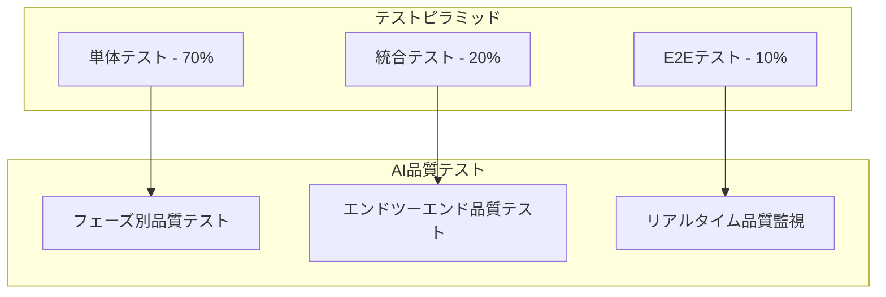

# テスト戦略

> **TL;DR**: AI品質保証重視の包括的テスト戦略。テストピラミッド（単体70%・統合20%・E2E10%）、7フェーズ品質ゲート（Phase別閾値0.6-0.85）、3段階自動リトライ機構（低減衰・中正常・高増幅）で構成。品質スコア算出（構成・一貫性・多様性・適切性・実用性5評価軸）、85%全体目標、自動化重視、継続改善、pytest+FastAPI TestClient+WebSocket統合。

## 目次

- [1. テスト概要](#1-テスト概要)
  - [1.1 テスト戦略](#11-テスト戦略)
  - [1.2 品質目標](#12-品質目標)
- [2. AI品質保証設計](#2-ai品質保証設計)
  - [2.1 7フェーズ品質ゲート](#21-7フェーズ品質ゲート)
  - [2.2 品質スコア算出](#22-品質スコア算出)
  - [2.3 自動リトライ機構](#23-自動リトライ機構)

---

## 1. テスト概要

### 1.1 テスト戦略

#### 基本方針
| 項目 | 方針 | 実装レベル |
|------|------|----------|
| 品質優先 | 85%品質スコア達成を最優先 | 基本 |
| 自動化重視 | 反復可能なテストの自動化 | 基本 |
| 効率性追求 | 最小限のテスト工数で最大効果 | 基本 |
| 継続改善 | AIによるテストケース進化 | 高度 |

#### テストピラミッド


### 1.2 品質目標

#### 品質KPI
```yaml
Quality Targets:
  Functional Quality:
    Unit Test Coverage: 80%
    Integration Test Coverage: 70%
    E2E Test Coverage: 主要フロー100%

  AI Quality:
    Phase Success Rate: 85% per phase
    End-to-End Success Rate: 70%
    User Satisfaction Score: 4.0/5.0

  Performance Quality:
    Response Time: < 100ms (API)
    Generation Time: < 10分 (standard text)
    Concurrent Users: 100 users supported

  Security Quality:
    Vulnerability Scan: 0 Critical issues
    Copyright Detection: 95% accuracy
    Content Filter: 95% accuracy
```

---

## 2. AI品質保証設計

### 2.1 7フェーズ品質ゲート

#### AI品質ゲート設計原則

**フェーズ別品質検証戦略:**
- 8フェーズ各々に特化した品質検証ロジックを実装
- 85%品質閾値で一貫した品質基準を維持
- フェーズ固有スコア(80%)と共通チェック(20%)の組み合わせ

**品質評価フレームワーク:**
- 入力データと出力データの照合検証
- リアルタイム品質スコア算出とログ記録
- 品質改善提案機能で継続的改善

**フェーズ固有評価指標:**
- **テキスト解析**: 文章構造理解度、キャラクター抽出精度、テーマ理解度
- **物語構造**: プロット一貫性、ペーシング品質、ドラマチックアーク
- **シーン分割**: シーン境界精度、場面切替品質
- **キャラクターデザイン**: 視覚一貫性、キャラクター識別性、スタイル遵守
- **パネルレイアウト**: レイアウトバランス、読みやすさ、スペース効率
- **画像生成**: 技術品質、シーン一致度、スタイル一貫性
- **セリフ配置**: 文字可読性、吹き出し配置、フォント選択
- **統合品質**: 全体一貫性、技術品質、ユーザーエクスペリエンス

### 2.2 品質スコア算出

#### 品質スコア定義
```yaml
Quality Score Calculation:
  Phase 1 (Text Analysis):
    - Structure Understanding: 40%
    - Character Extraction: 30%
    - Theme Detection: 30%
    Target: 85%

  Phase 2 (Story Structure):
    - Plot Coherence: 50%
    - Pacing Quality: 30%
    - Dramatic Arc: 20%
    Target: 85%

  Phase 3 (Scene Division):
    - Scene Boundary Accuracy: 60%
    - Transition Quality: 40%
    Target: 85%

  Phase 4 (Character Design):
    - Visual Consistency: 50%
    - Character Distinctiveness: 30%
    - Style Adherence: 20%
    Target: 85%

  Phase 5 (Panel Layout):
    - Layout Balance: 40%
    - Reading Flow: 40%
    - Space Efficiency: 20%
    Target: 85%

  Phase 6 (Image Generation):
    - Technical Quality: 40%
    - Scene Matching: 40%
    - Style Consistency: 20%
    Target: 85%

  Phase 7 (Dialog Placement):
    - Text Readability: 50%
    - Bubble Placement: 30%
    - Font Selection: 20%
    Target: 85%

  Phase 8 (Final Integration):
    - Overall Coherence: 60%
    - Technical Quality: 25%
    - User Experience: 15%
    Target: 85%
```

### 2.3 自動リトライ機構

#### 自動リトライ機構設計原則

**リトライ戦略:**
- 最大3回のリトライで品質目標達成を目指す
- 85%品質閾値で自動合格判定
- 75%以上のスコアで品質低下許容モード

**エラーハンドリング方針:**
- 各リトライで最高品質結果を保持
- 例外発生時もリトライカウンターを継続
- 終了時のフォールバック戦略でサービス継続性確保

**ログ管理設計:**
- リトライ回数とスコア変遷の記録
- 失敗原因の分類と統計分析
- 品質傾向の継続的監視

## 🔗 関連文書

- [単体テスト設計](./unit-testing.md)
- [結合テスト設計](./integration-testing.md)
- [パフォーマンステスト設計](./performance-testing.md)
- [テスト設計書全体](./README.md)

## 📝 改訂履歴

| 版数 | 日付 | 変更内容 | 担当者 |
|------|------|----------|--------|
| 1.0 | 2025-09-27 | テスト戦略とAI品質保証設計の分割 | Claude Code |

---

**メタデータ**
- プロジェクト: AI Manga Generator with HITL
- フェーズ: テスト設計フェーズ
- 最終更新: 2025-09-27
- ドキュメント形式: Markdown