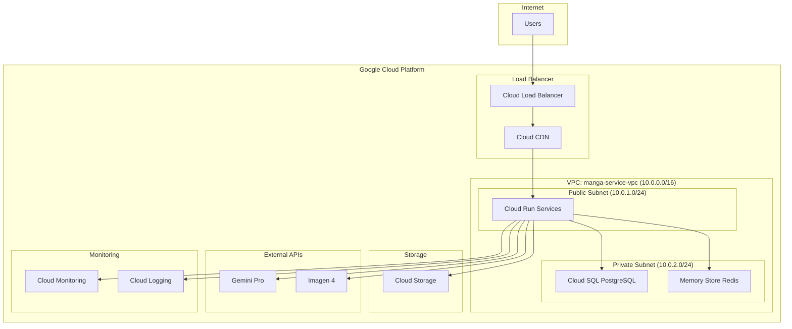
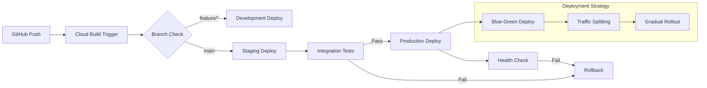

# AI漫画生成サービス インフラ設計書

**文書管理情報**
- 文書ID: INF-DOC-001
- 作成日: 2025-01-20
- 版数: 2.0
- 承認者: 根岸祐樹
- 関連文書: SYS-DOC-001（システム設計書）、REQ-DOC-001（要件定義書）
- 更新履歴:
  - v1.0: 基本インフラ設計完成
  - v2.0: 開発環境設計統合 (Development_Setup_Guide.md統合)

## 目次

- [1. インフラ概要](#1-インフラ概要)
  - [1.1 設計方針](#11-設計方針)
  - [1.2 アーキテクチャ概要](#12-アーキテクチャ概要)
- [2. ネットワーク設計](#2-ネットワーク設計)
  - [2.1 VPC構成](#21-vpc構成)
  - [2.2 サブネット設計](#22-サブネット設計)
  - [2.3 ファイアウォール設定](#23-ファイアウォール設定)
- [3. コンピューティング設計](#3-コンピューティング設計)
  - [3.1 Cloud Run構成](#31-cloud-run構成)
  - [3.2 オートスケーリング設計](#32-オートスケーリング設計)
  - [3.3 サービスアカウント設計](#33-サービスアカウント設計)
- [4. データストレージ設計](#4-データストレージ設計)
  - [4.1 Cloud SQL設計](#41-cloud-sql設計)
  - [4.2 Redis単一インスタンス設計](#42-redis単一インスタンス設計)
  - [4.3 Cloud Storage設計](#43-cloud-storage設計)
- [5. セキュリティ設計](#5-セキュリティ設計)
  - [5.1 IAM設計](#51-iam設計)
  - [5.2 Secret Manager](#52-secret-manager)
  - [5.3 ネットワークセキュリティ](#53-ネットワークセキュリティ)
- [6. CI/CD設計](#6-cicd設計)
  - [6.1 Cloud Build設定](#61-cloud-build設定)
  - [6.2 デプロイメント戦略](#62-デプロイメント戦略)
  - [6.3 環境管理](#63-環境管理)
- [7. 開発環境設計](#7-開発環境設計)
  - [7.1 開発環境セットアップ](#71-開発環境セットアップ)
  - [7.2 バックエンド開発環境](#72-バックエンド開発環境)
  - [7.3 フロントエンド開発環境](#73-フロントエンド開発環境)
  - [7.4 統合開発環境](#74-統合開発環境)
  - [7.5 開発ワークフロー](#75-開発ワークフロー)
  - [7.6 監視・デバッグ](#76-監視デバッグ)
  - [7.7 トラブルシューティング](#77-トラブルシューティング)
  - [7.8 プロダクション連携](#78-プロダクション連携)
  - [7.9 開発環境リソース](#79-開発環境リソース)

---

## 1. インフラ概要

### 1.1 設計方針

| 方針 | 内容 | 理由 |
|------|------|------|
| スタートアップ最適化 | 軽量構成でスタート、段階的拡張 | 初期コスト抑制、迅速なMVP展開 |
| Google Cloud ネイティブ | GCP標準サービス活用 | 運用負荷削減、統合管理 |
| シンプルネットワーク | 単一VPC、必要最小限の分離 | 複雑性排除、トラブルシューティング簡素化 |
| フルマネージド優先 | Cloud SQL、Memory Store活用 | 運用工数削減、自動化推進 |

### 1.2 アーキテクチャ概要



---

## 2. ネットワーク設計

### 2.1 VPC構成

#### 基本設定
```yaml
VPC Configuration:
  Name: manga-service-vpc
  Region: asia-northeast1 (Tokyo)
  IP Range: 10.0.0.0/16
  Route Mode: Regional
  DNS Policy: Default
```

#### 設計原則

**VPCネットワーク設計の考慮事項:**
- カスタムモードVPCを使用し、サブネット自動作成は無効化
- MTU値は標準的な1460バイトを設定し、パフォーマンスとの互換性を確保
- ルーター設定により外向き通信制御を実現
- NATゲートウェイ設定でプライベートインスタンスのインターネット接続を提供
- IP自動割り当て方式により運用負荷を軽減

### 2.2 サブネット設計

#### サブネット構成
| サブネット名 | CIDR | 用途 | アクセス |
|-------------|------|------|---------|
| manga-public | 10.0.1.0/24 | Cloud Run Connector | Public |
| manga-private | 10.0.2.0/24 | Cloud SQL, Redis | Private |
| manga-management | 10.0.3.0/24 | 管理・監視 | Private |

#### 設計原則

**サブネット分離戦略:**
- パブリックサブネットは外部アクセス可能なサービス用（/24で254アドレス）
- プライベートサブネットはデータベースなど内部サービス用（/24で254アドレス）
- Private Google Access有効化により外部API接続を可能にしつつセキュリティを確保
- セカンダリIPレンジ設定により将来的なコンテナ化対応を準備

**IP アドレス管理方針:**
- 10.0.x.0/24レンジでサブネット分割により管理の単純化
- 将来的なスケール要件に対応可能な設計余裕を確保

### 2.3 ファイアウォール設定

#### セキュリティ設計原則

**ファイアウォールルール階層化:**
1. **外部アクセス制御**: HTTPS(443ポート)のみ許可し、HTTPSサーバータグ付きインスタンスに限定
2. **VPC内部通信**: プライベートIPレンジ(10.0.0.0/16)からの全通信を許可し、内部サービス間連携を確保
3. **ヘルスチェック対応**: Google Cloud Load Balancerの公式IPレンジからのヘルスチェックアクセスを許可

**セキュリティ方針:**
- 最小権限の原則に基づくアクセス制御
- タグベース管理によるルール適用の柔軟性確保
- Google Cloud標準のIPレンジ利用によるセキュリティ基準準拠

### 2.4 Direct VPC Egress設定

#### Cloud Run VPC接続
```yaml
# Direct VPC Egress使用（VPC Connector不要・コスト$0）
Network Configuration:
  Connection Type: Direct VPC Egress
  VPC Network: manga-service-vpc
  Subnet: manga-private (10.0.2.0/24)
  Benefits:
    - VPC Connector不要（月額$20-40削減）
    - 高パフォーマンス（直接VPC接続）
    - シンプルな設定
```

#### 設計考慮事項

**Direct VPC Egress設計方針:**
- デフォルトインターネットゲートウェイ経由での外向き通信設定
- 優先度1000設定によりルーティング競合回避
- タグベース管理によるCloud Runサービス限定適用

**権限管理設計:**
- サービスアカウントにrun.networkAdmin権限付与
- 最小権限原則に基づくIAM設計
- ネットワーク操作権限の適切なスコープ制限

---

## 3. コンピューティング設計

### 3.1 Cloud Run構成

#### 軽量化構成設定（Direct VPC Egress使用）
```yaml
# Phase 1-7 共通設定（新フロー版 + Direct VPC Egress）
apiVersion: serving.knative.dev/v1
kind: Service
metadata:
  name: phase-service-template
  annotations:
    run.googleapis.com/ingress: internal-and-cloud-load-balancing
spec:
  template:
    metadata:
      annotations:
        run.googleapis.com/cpu: "1"
        run.googleapis.com/memory: "2Gi"
        run.googleapis.com/execution-environment: gen2
        # Direct VPC Egress使用（VPC Connector不要）
        run.googleapis.com/network-interfaces: '[{"network":"manga-service-vpc","subnetwork":"manga-private"}]'
        run.googleapis.com/cloudsql-instances: manga-db-instance
    spec:
      containerConcurrency: 50  # 軽量化のため削減
      timeoutSeconds: 300       # 5分タイムアウト
      serviceAccountName: manga-service-account
      containers:
      - image: gcr.io/PROJECT_ID/phase-service:latest
        ports:
        - containerPort: 8080
        resources:
          limits:
            cpu: "1"
            memory: "2Gi"
        env:
        - name: REDIS_HOST
          value: "10.0.2.10"
        - name: DB_HOST
          value: "10.0.2.5"
```

#### サービス別カスタマイズ
```yaml
# Phase 5(シーン画像生成)のみリソース増強
Phase5_Overrides:
  cpu: "2"           # Imagen併用のため2倍
  memory: "4Gi"      # メモリも2倍
  timeout: 60        # 40秒+バッファ
  concurrency: 5     # 並列処理数制限

# Phase 2(キャラビジュアル生成)の設定
Phase2_Overrides:
  cpu: "1.5"         # 簡易画像生成用
  memory: "3Gi"      # メモリ少し増強
  timeout: 20        # 12秒+バッファ
```

### 3.2 オートスケーリング設計

#### スケーリング設定
| 項目 | 設定値 | 説明 |
|------|--------|------|
| 最小インスタンス | 1 | コールドスタート対策 |
| 最大インスタンス | 50 | ピーク時対応 |
| CPU閾値 | 80% | スケールアウトトリガー |
| メモリ閾値 | 70% | スケールアウトトリガー |
| スケールダウン遅延 | 300秒 | 頻繁なスケーリング防止 |

```yaml
Scaling Configuration:
  Min Instances: 1     # コールドスタート対策
  Max Instances: 50    # 統合サービスのため上限引き上げ
  Target CPU: 80%      # 効率的なリソース利用
  Target Memory: 70%   # メモリ効率重視
  Scale Down Delay: 300s  # 5分間のクールダウン
```

### 3.3 サービスアカウント設計

#### IAM ロール設計
```yaml
Service Accounts:
  manga-service-account:
    roles:
      - roles/cloudsql.client
      - roles/redis.editor
      - roles/storage.objectAdmin
      - roles/logging.logWriter
      - roles/monitoring.metricWriter
      - roles/secretmanager.secretAccessor

  manga-cicd-account:
    roles:
      - roles/run.developer
      - roles/storage.admin
      - roles/cloudbuild.builds.editor
      - roles/iam.serviceAccountUser
```

---

## 4. データストレージ設計

### 4.1 Cloud SQL設計

#### インスタンス設定（軽量スタートアップ版）
```yaml
Cloud SQL Configuration:
  Instance ID: manga-db-instance
  Database Version: PostgreSQL 15
  Region: asia-northeast1
  Zone: asia-northeast1-a
  
  Machine Type: db-standard-1  # スタートアップ向け軽量版
  CPU: 1 vCPU
  Memory: 3.75 GB
  Storage: 100 GB SSD (Auto-increase enabled)
  
  Network:
    Private IP: 10.0.2.5
    Authorized Networks: VPC manga-service-vpc
    SSL: Required
  
  Backup:
    Automated Backup: Enabled
    Backup Window: 03:00-04:00 JST
    Point-in-time Recovery: 7 days
    Retention: 30 days
  
  Maintenance:
    Window: Sunday 04:00-05:00 JST
    Update Strategy: OPPORTUNISTIC
```

#### データベース設計原則

**スケーリング設計:**
- 初期は軽量構成（db-standard-1）でコスト最適化、需要に応じてスケールアップ
- ディスク自動拡張機能でストレージ管理を自動化
- SSDストレージ使用で高パフォーマンスを確保

**バックアップ戦略:**
- 自動バックアップ有効化でデータ保護
- ポイントインタイムリカバリ（PITR）で精密な復旧可能
- バックアップ保存期間は30日間でコンプライアンス対応

**セキュリティ設計:**
- プライベートIPのみ使用し、パブリックアクセスを禁止
- SSL接続強制で通信暗号化を確保
- 指定したVPCネットワークからのみ接続可能

**運用設計:**
- メンテナンスウィンドウを低使用時間帯に設定
- 削除保護機能で誤削除を防止

### 4.2 Redis単一インスタンス設計

#### インスタンス設定
```yaml
Redis Configuration:
  Service: Memory Store for Redis
  Version: Redis 7.0
  Tier: Basic
  Memory: 4GB
  Region: asia-northeast1
  Network: manga-service-vpc
  IP: 10.0.2.10
  
  Estimated Cost: $120/month
  
  Performance:
    - 最大接続数: 65,000
    - スループット: 250,000 ops/sec
    - レイテンシー: <1ms
```

#### Redis接続設計方針

**接続管理設計:**
- ホスト情報の環境変数管理で柔軟性を確保
- 標準ポート(6379)使用で連携性を維持
- レスポンスデコード機能でアプリケーション統合を実現

**信頼性設計:**
- タイムアウト設定でハングアップ防止
- リトライ機能で一時的障害耐性を向上
- ヘルスチェック機能で接続状態監視

**パフォーマンス設計:**
- コネクションプール使用で接続オーバーヘッド減少
- 最大接続数制限でリソース保護

#### プレビューシステムに伴うRedis使用量削減

**変更方針**: プレビューデータのキャッシュをCDN+Cloud Storageに移行
```yaml
Redis Usage Reduction Strategy:
  Before (Redis依存):
    - プレビューデータキャッシュ: ~2GB
    - インタラクティブ状態: ~500MB  
    - バージョン履歴: ~1GB
    Total Redis Usage: ~4GB
    
  After (CDN最適化):
    - プレビューデータ: Cloud Storage + CDN
    - インタラクティブ状態: Cloud Storage + CDN  
    - バージョン履歴: Cloud Storage
    Remaining Redis Usage: ~1GB (セッション管理のみ)
    
  Benefits:
    - Redis費用: $120/月 → $30/月 (75%削減)
    - スケーラビリティ向上
    - レイテンシー改善 (CDN効果)
    - データ永続性向上
```

**Redis新構成**:
```yaml
Redis Optimized Configuration:
  Service: Memory Store for Redis  
  Version: Redis 7.0
  Tier: Basic
  Memory: 1GB (4GBから削減)
  Region: asia-northeast1
  
  New Estimated Cost: $30/month (90$削減)
  
  Primary Usage:
    - WebSocketセッション管理
    - API レート制限カウンタ
    - 一時的な処理状態
    - リアルタイム通知キュー
```

### 4.3 Cloud Storage設計

#### バケット構成（プレビューシステム対応版）
```yaml
Storage Buckets:
  manga-input-data:
    Location: asia-northeast1
    Storage Class: Standard
    Lifecycle:
      - Delete objects older than 90 days
    
  manga-output-images:
    Location: asia-northeast1
    Storage Class: Standard
    Public Access: Enabled (CDN用)
    CORS: Enabled
    
  manga-preview-cache:
    Location: asia-northeast1
    Storage Class: Standard
    Public Access: Enabled (CDN用)
    Purpose: プレビューデータ・インタラクティブコンテンツ
    CDN: Cloud CDN with optimized caching
    Cache Headers:
      - Images: "public, max-age=604800, immutable"
      - Metadata: "public, max-age=1800" 
      - Interactive: "public, max-age=86400"
    CORS: Enabled for interactive content
    Lifecycle:
      - Delete objects older than 30 days
    
  manga-version-snapshots:
    Location: asia-northeast1  
    Storage Class: Standard
    Purpose: プレビューバージョン履歴・比較データ
    Lifecycle:
      - Transition to Nearline after 7 days
      - Delete objects older than 60 days
    
  manga-final-products:
    Location: asia-northeast1
    Storage Class: Standard
    Lifecycle:
      - Transition to Nearline after 30 days
      - Transition to Coldline after 365 days
    
  manga-temp-data:
    Location: asia-northeast1
    Storage Class: Standard
    Lifecycle:
      - Delete objects older than 7 days
```

#### ストレージ設計原則

**バケット種別別設計方針:**

1. **入力データバケット**
   - 90日自動削除でコスト最適化
   - バージョニング有効で変更履歴管理
   - KMS暗号化でデータ保護強化

2. **出力画像バケット**
   - CDN連携用CORS設定でフロントエンド統合
   - 統一バケットレベルアクセスでセキュリティ簡素化
   - GET/HEADメソッドのみ許可で読取り専用アクセス

3. **プレビューキャッシュバケット**
   - 開発用localhostも含むCORS設定
   - 30日自動削除でキャッシュサイズ管理
   - PUT/POSTメソッド許可でインタラクティブコンテンツ対応

4. **バージョンスナップショットバケット**
   - 7日後NEARLINEストレージへ移行でコスト効率化
   - 60日後完全削除で長期コスト最適化
   - バージョニング有効で複数バージョン管理

5. **一時データバケット**
   - 7日自動削除でストレージ総量制御

**コスト最適化戦略:**
- ライフサイクルポリシーで自動コスト管理
- ストレージクラス自動移行で長期コスト減少
- 統一バケットレベルアクセスで管理負荷軽減

---

## 5. セキュリティ設計

### 5.1 IAM設計

#### 最小権限の原則
```yaml
Service Account Roles:

  manga-cicd-sa:
    - roles/run.developer
    - roles/cloudbuild.builds.editor
    - roles/storage.admin
    - roles/iam.serviceAccountUser
```

### 5.2 Secret Manager

#### シークレット管理
```yaml
Secrets Configuration:
  manga-secret-key:
    Description: "Application JWT Secret Key"
    Replication: automatic
    Access: manga-service-account
    Status: ✅ Implemented
    Usage: Cloud Run environment variable
    
  manga-database-url:
    Description: "PostgreSQL Connection URL"
    Replication: automatic  
    Access: manga-service-account
    Status: ✅ Implemented
    Usage: Cloud Run environment variable
    
  gemini-api-key:
    Description: "Google Gemini Pro API Key"
    Replication: automatic
    Access: manga-service-account
    Status: ⏳ Planned
    
  imagen-api-key:
    Description: "Google Imagen 4 API Key"
    Replication: automatic
    Access: manga-service-account
    Status: ⏳ Planned
    
  firebase-credentials:
    Description: "Firebase Service Account Credentials"
    Replication: automatic
    Access: manga-service-account
    Status: ⏳ Planned
```

#### シークレット管理設計原則

**シークレット管理方針:**
- 自動レプリケーションで高可用性を確保
- 説明文付きでシークレット用途を明確化
- 最新バージョン参照で自動ローテーション対応

**アクセス制御設計:**
- 最小権限原則に基づくIAMバインディング
- サービスアカウント単位でのアクセス制御
- secretmanager.secretAccessor権限で読取り専用アクセス

**セキュリティベストプラクティス:**
- シークレットID命名規則で一貫性を保持
- プロジェクトレベルでの統一管理
- Cloud Run環境変数での参照で安全な連携

### 5.3 HITL (Human-in-the-Loop) インフラ設計

#### WebSocket Infrastructure
```yaml
Cloud Run WebSocket Configuration:
  WebSocket Support: Enabled
  Connection Timeout: 30 minutes
  Max Concurrent Connections: 1000
  
  Environment Variables:
    WEBSOCKET_ENABLED: "true"
    HITL_TIMEOUT_SECONDS: "30"
    MAX_FEEDBACK_WAIT_TIME: "1800"  # 30 minutes
    
  Health Check:
    Path: /ws/health
    Interval: 30s
    Timeout: 5s
```

#### Session Management Infrastructure
```yaml
Redis Session Configuration:
  Purpose: HITL session storage
  TTL: 3600 seconds (1 hour)
  Memory Allocation: 2GB
  
  Session Data Structure:
    session:{request_id}:
      - user_id: string
      - current_phase: integer
      - feedback_timeout: timestamp
      - session_start: timestamp
      - phase_results: json
      
  Pub/Sub Channels:
    hitl_feedback:{request_id}: Real-time feedback
    phase_progress:{request_id}: Phase completion updates
    session_timeout:{request_id}: Timeout notifications
```

#### Feedback Queue Management
```yaml
Cloud Pub/Sub Configuration:
  Topics:
    - hitl-feedback-topic
    - phase-completion-topic  
    - session-management-topic
    
  Subscriptions:
    - hitl-feedback-processor
    - phase-transition-handler
    - session-cleanup-service
    
  Dead Letter Queue:
    Max Delivery Attempts: 5
    Dead Letter Topic: hitl-feedback-dlq
    Retention Period: 7 days
```

#### HITL Monitoring Infrastructure
```yaml
Cloud Monitoring Metrics:
  Custom Metrics:
    - hitl/session_duration
    - hitl/feedback_timeout_rate
    - hitl/user_engagement_score
    - hitl/phase_completion_time
    - hitl/retry_rate_per_phase
    
  Alerting Policies:
    High Timeout Rate:
      Condition: hitl/feedback_timeout_rate > 0.3
      Notification: Email + Slack
      
    Session Duration Alert:
      Condition: hitl/session_duration > 30 minutes
      Action: Auto-cleanup trigger
      
  Dashboards:
    - HITL Performance Overview
    - User Engagement Analytics  
    - Phase-wise Quality Metrics
```

#### Chat Infrastructure
```yaml
Chat Service Configuration:
  Service: Cloud Run (chat-service)
  Instances: 
    Min: 2
    Max: 100
  CPU: 2
  Memory: 4Gi
  
  WebSocket Settings:
    Max Message Size: 10KB
    Ping Interval: 30s
    Pong Timeout: 10s
    Compression: Enabled
    
  Chat Database (Firestore):
    Collections:
      chat_sessions:
        - session_id: string
        - request_id: string
        - user_id: string
        - created_at: timestamp
        - last_activity: timestamp
        
      chat_messages:
        - message_id: string
        - session_id: string
        - phase: integer
        - content: string
        - message_type: enum(text|quick_action|system)
        - created_at: timestamp
        - processed: boolean
        
      chat_intents:
        - intent_id: string
        - message_id: string
        - parsed_intent: json
        - confidence_score: float
        - applied: boolean
```

#### Chat Message Processing Pipeline
```yaml
Message Processing Infrastructure:
  Gemini Pro Integration:
    Model: gemini-pro
    Purpose: Natural language understanding
    Rate Limit: 60 requests/minute
    
    Processing Flow:
      1. Message received via WebSocket
      2. Store in Firestore
      3. Send to Gemini Pro for intent parsing
      4. Store parsed intent
      5. Apply feedback to phase data
      6. Send confirmation via WebSocket
      
  Redis Cache for Chat:
    Purpose: Real-time message caching
    Structure:
      chat:{session_id}:messages: List of recent messages
      chat:{session_id}:typing: Typing indicators
      chat:{session_id}:online: Online status
    TTL: 1 hour after last activity
    
  Cloud Functions for Chat:
    process-chat-message:
      Trigger: Firestore onCreate (chat_messages)
      Runtime: Python 3.11
      Memory: 512MB
      Timeout: 60s
      
    cleanup-chat-sessions:
      Trigger: Cloud Scheduler (every hour)
      Purpose: Clean inactive sessions
      
    aggregate-chat-analytics:
      Trigger: Cloud Scheduler (daily)
      Purpose: Analyze chat patterns
```

#### Real-time Notification Infrastructure
```yaml
Notification System:
  Cloud Tasks for Async Processing:
    Queues:
      - chat-notification-queue
      - feedback-processing-queue
      - preview-generation-queue
      
    Configuration:
      Max Concurrent Dispatches: 100
      Max Retry Attempts: 3
      Rate Limits: 500/s
      
  Firebase Cloud Messaging (Optional):
    Purpose: Mobile/Web push notifications
    Topics:
      - phase_complete
      - feedback_timeout_warning
      - generation_complete
```

#### Quality Gate Infrastructure  
```yaml
BigQuery Analytics:
  Dataset: manga_quality_analytics
  Tables:
    - phase_quality_scores
    - user_feedback_analysis
    - retry_patterns
    - quality_trends
    - chat_interaction_metrics
    
  Scheduled Queries:
    - Daily quality reports
    - Weekly trend analysis
    - Chat engagement metrics
    - Monthly performance review
    
  Data Export:
    Format: JSON
    Schedule: Real-time streaming
    Destination: Cloud Storage bucket
```

### 5.4 ネットワークセキュリティ

#### VPCセキュリティ
```yaml
Security Configuration:
  Private Google Access: Enabled
  Private Service Connect: Enabled for Google APIs
  
  Firewall Priority:
    1. Deny All (Priority: 65534)
    2. Allow HTTPS (Priority: 1000)
    3. Allow Internal VPC (Priority: 1001)
    4. Allow Health Check (Priority: 1002)
  
  DDoS Protection: 
    Cloud Armor: Basic (free tier)
    Rate Limiting: 1000 req/min per IP
```

---


---

## 6. CI/CD設計

### 6.1 Cloud Build設定

#### CI/CDパイプライン設計原則

**ビルドステージ構成:**
1. **品質保証ステージ**
   - ユニットテスト実行でコード品質確保
   - カバレッジレポート生成でテスト範囲可視化
   - セキュリティスキャンで脆弱性早期発見

2. **コンテナイメージ管理**
   - マルチタグ付与でバージョン管理を簡素化
   - 短縮コミットID使用でトレーサビリティ向上
   - Container Registryへのプッシュで集中管理

3. **デプロイメント戦略**
   - Cloud Runマネージドプラットフォームで運用負荷軽減
   - リソース制限設定でコスト制御とパフォーマンスバランス
   - オートスケーリング設定で負荷変動対応

**パフォーマンス最適化:**
- 高性能ビルドマシン使用でビルド時間短縮
- Cloud Logging一元化でログ管理を効率化
- 並列処理可能なステップの最適化配置

### 6.2 デプロイメント戦略

#### 環境別デプロイフロー


#### 段階的ロールアウト
```yaml
Deployment Strategy:
  Development:
    Trigger: feature/* branch push
    Target: dev-phase*-service
    Traffic: 100%
    
  Staging:
    Trigger: main branch push
    Target: staging-phase*-service
    Testing: Automated integration tests
    
  Production:
    Trigger: Manual approval after staging
    Strategy: Blue-Green with traffic splitting
    Rollout:
      - Phase 1: 10% traffic for 10 minutes
      - Phase 2: 50% traffic for 30 minutes  
      - Phase 3: 100% traffic
    Rollback: Automatic if error rate > 1%
```

### 6.3 環境管理

#### 環境管理設計原則

**環境別設定戦略:**
- 環境識別子で動作モードを制御
- ログレベルの環境別最適化（開発時詳細、本番簡素）
- ホスト情報の環境固有設定で適切なルーティング

**シークレット管理戦略:**
- Secret Manager参照形式でセキュリティを強化
- 最新バージョン自動参照でローテーション対応
- プロジェクトID変数使用で環境間ポータビリティ向上

**運用効率化:**
- 環境固有設定の統一管理で運用負荷軽減
- シークレット参照の標準化でセキュリティポリシー統一

---


---

## 改訂履歴

| 版数 | 日付 | 変更内容 | 担当者 |
|------|------|----------|--------|
| 1.0 | 2025-01-20 | 初版作成（軽量スタートアップ構成） | Claude Code |

---

## インフラ整備状況

### 整備完了状況（2025-08-24 更新）

| サービス | 詳細 | 整備状況 | 月額コスト（目安） |
|----------|------|----------|-------------------|
| **ネットワーキング** |  |  |  |
| VPC Network | manga-service-vpc (10.0.0.0/16) | ✅ 完了 | $0（無料枠） |
| サブネット | パブリック: 10.0.1.0/24<br>プライベート: 10.0.2.0/24 | ✅ 完了 | $0（無料枠） |
| ファイアウォール | 内部通信、HTTPS、ヘルスチェック | ✅ 完了 | $0（無料枠） |
| VPC Peering | Service Networking用 | ✅ 完了 | $0（無料枠） |
| Direct VPC Egress | Cloud Run → VPC接続 | ✅ 設計変更済み | $0（無料） |
| **データベース** |  |  |  |
| Cloud SQL | PostgreSQL 15, db-f1-micro | 🔄 作成中 | $25-30/月 |
| Memory Store Redis | 1GB, Basic tier | ✅ 完了<br>IP: 10.85.114.155 | $40-50/月 |
| **ストレージ** |  |  |  |
| Input Data Bucket | 90日自動削除 | ✅ 完了 | $2-5/月 |
| Output Images Bucket | CDN対応、CORS有効 | ✅ 完了 | $5-15/月 |
| Final Products Bucket | ライフサイクル設定 | ✅ 完了 | $3-10/月 |
| Temp Data Bucket | 7日自動削除 | ✅ 完了 | $1-3/月 |
| **メッセージング** |  |  |  |
| ~~Pub/Sub Topics~~ | ~~phase-completed, generation-requests~~ | ❌ 削除済み | ~~$1-5/月~~ |
| ~~Pub/Sub Subscriptions~~ | ~~phase-completed-sub~~ | ❌ 削除済み | ~~$0（含まれる）~~ |
| **セキュリティ** |  |  |  |
| Service Accounts | Main, Dev用サービスアカウント | ✅ 完了 | $0（無料） |
| IAM Policies | 最小権限設定 | ✅ 完了 | $0（無料） |
| Service Networking | Private Google Access | ✅ 完了 | $0（無料） |
| **API** |  |  |  |
| AI Platform API | Vertex AI・Gemini Pro・Imagen統合 | ✅ 有効化済み | 使用量課金 |
| Cloud Run API | コンテナ実行 | ✅ 有効化済み | 使用量課金 |
| その他必要API | 12個すべて有効化 | ✅ 完了 | $0（無料） |

### 残作業・課題

| 項目 | 優先度 | 詳細 | 対応予定 |
|------|--------|------|---------|
| Cloud Run デプロイ | 中 | アプリケーション配置 | 開発完了後 |
| 監視・ログ設定 | 低 | プロダクション運用時 | 運用開始前 |
| パフォーマンスチューニング | 低 | Direct VPC Egress最適化 | 負荷テスト後 |

### ✅ **解決済み課題**
- ~~VPC Connector削除~~ → **完了（削除済み）**
- ~~Cloud SQL完了待ち~~ → **完了（DB・ユーザー作成済み）**
- ~~Vertex AI API権限~~ → **完了（AI Platform API経由で利用可能）**

### 現在のコスト見積もり（Direct VPC Egress採用後）
- **基盤コスト**: $76-128/月（実装済み、VPC Connector削除で$20-30削減）
- **API使用料**: 利用量に応じて変動
- **総合計**: $80-170/月（初期段階、月額$20-30の削減効果）

## 7. 開発環境設計

### 7.1 開発環境セットアップ

#### 必要システム要件
| 要素 | 要件 | 用途 |
|------|------|------|
| Python | 3.11+ | バックエンド開発 |
| Docker | Docker & Docker Compose | ローカルインフラ |
| PostgreSQL | 15+ | 開発用データベース |
| Redis | 7+ | 開発用キャッシュ |
| Node.js | 18+ | フロントエンド開発 |
| Google Cloud SDK | 最新版 | クラウド連携・デプロイ |

#### 必要なGoogle Cloud APIs
```
- Vertex AI API
- Cloud Storage API
- Secret Manager API
- Cloud SQL API
- Cloud Run API
```

### 7.2 バックエンド開発環境

#### 開発環境セットアップ設計

**環境分離戦略:**
- Python仮想環境使用でシステムライブラリとの分離
- OS固有のアクティベーションスクリプト対応
- pipアップグレードで最新パッケージマネージャー使用

**依存関係管理方針:**
- requirements.txtによる明確なバージョン管理
- 開発環境と本番環境の一貫性確保
- プロジェクト構造に基づくワーキングディレクトリ管理

#### 開発環境設定設計原則

**データベース接続設計:**
- 非同期PostgreSQLドライバ使用で高パフォーマンス確保
- ローカルホスト基本設定で開発効率化
- 標準ポート使用で環境間統一性確保

**セキュリティ設定方針:**
- JWTアルゴリズムの明示的指定でセキュリティ標準準拠
- 秘密鍵の最小長要件設定で安全性確保
- 開発時のデバッグモード有効化

**Cloud連携設計:**
- Google Cloud認証情報の柔軟な設定方式
- リージョン指定でレイテンシ最適化
- AIモデルバージョンの環境変数管理

**CORS設定方針:**
- ローカル開発ポート許可でフロントエンド統合
- カンマ区切り複数オリジン対応

#### コンテナインフラ設計原则

**データ永続化戦略:**
- 名前付きボリューム使用でデータ保持確保
- コンテナ再作成時もデータ継続性を維持
- サービス間のデータ分離で独立性確保

**サービスバージョン管理:**
- 本番環境と同一バージョン使用で一貫性確保
- Alpineベースイメージでサイズ最適化
- 最新安定版使用でセキュリティアップデート対応

**ポートマッピング設計:**
- 標準ポート使用でクライアント接続の簡素化
- ホストネットワークからの直接アクセス可能性

**サービス固有設定:**
- Redis永続化機能（AOF）有効でデータ保護
- PostgreSQL環境変数で初期設定自動化

### 7.3 フロントエンド開発環境

#### フロントエンド開発環境設計

**パッケージ管理戦略:**
- npmを使用してJavaScriptエコシステムとの連携性確保
- package.jsonによる明確な依存関係定義

**環境設定管理:**
- .env.exampleテンプレートで新規開発者サポート
- .env.localでローカル固有設定分離
- バージョン管理対象外で秘密情報保護

**開発サーバー設計:**
- 標準ポート（3000）使用で一貫性確保
- ホットリロード機能で開発効率向上
- バックエンドAPIとの連携確認用アクセスポイント

#### フロントエンド環境変数
```env
NEXT_PUBLIC_API_URL=http://localhost:8000/api/v1
NEXT_PUBLIC_WS_URL=ws://localhost:8000/ws
```

### 7.4 統合開発環境

#### 統合開発環境設計原則

**サービスオーケストレーション戦略:**
- インフラサービス優先起動で依存関係解決
- データベースマイグレーション自動実行で初期化自動化
- バックグラウンドプロセス起動で並列開発可能

**サービス発見性設計:**
- APIドキュメンテーションエンドポイント提供
- フロントエンドアクセスポイント提供
- 統一的なアクセスポート設計

**開発効率化方針:**
- ワンコマンド環境構築で新規参加者サポート
- ホットリロード機能で開発サイクル短縮
- 明確なサービス状態表示でデバッグ効率向上

### 7.5 開発ワークフロー

#### 1. フィーチャーブランチ作成
```bash
git checkout -b feature/your-feature-name
```

#### 開発ワークフロー設計原則

**コード品質管理戦略:**
- 自動フォーマッティングツールでコードスタイル統一
- リントツールでコーディングスタンダード強制
- テスト駆動開発（TDD）で品質向上

**バージョン管理方針:**
- コミットメッセージ規則で変更理由明確化
- フィーチャーブランチ戦略で平行開発支援

**継続的インテグレーション:**
- コミット前品質チェックでリグレッション防止
- 自動テスト実行で品質保護

#### 品質保証設計原則

**テストカバレッジ管理:**
- HTMLレポート生成でカバレッジ可視化
- カバレッジ闾値設定で品質基準維持

**静的解析方針:**
- 型ヒントチェックでランタイムエラー減少
- Python型システム活用でコード品質向上

**セキュリティ检査方針:**
- 自動セキュリティスキャンで脆弱性早期発見
- コードベース全体での経続的監視

### 7.6 監視・デバッグ

#### 監視・デバッグ設計原則

**ログ管理戦略:**
- 構造化ログで可読性と検索性を向上
- ログローテーションでストレージ管理自動化
- リアルタイムログ監視で問題早期発見

**コンテナサービス管理:**
- サービス状態一覧でインフラ健全性確認
- サービス固有ログストリームで問題分析効率化

**リアルタイム通信テスト:**
- WebSocket接続テストツールで統合テスト
- セッションベース通信でHITL機能検証

#### パフォーマンス監視設計原則

**APIパフォーマンス測定:**
- レスポンス時間計測でパフォーマンスベースライン設定
- フォーマットテンプレート使用で一負性確保
- エンドポイント別パフォーマンス特性把握

**メモリ使用量監視:**
- プロファイリングツールでメモリリーク発見
- メモリ使用パターン分析で最適化箇所特定
- パフォーマンスボトルネックの系統的識別

### 7.7 トラブルシューティング

#### トラブルシューティング設計原則

**依存関係エラー解決:**
- 明確なエラーメッセージで問題特定を容易化
- パッケージマネージャー固有のインストール手順文書化

**システムレベルエラー対応:**
- OS固有ライブラリインストール手順の標準化
- パッケージマネージャー別インストールコマンド整備

**サービス接続エラー対応:**
- サービス状態確認手順の系統化
- サービス再起動手順の自動化

**権限エラー解決:**
- Dockerグループ権限設定でコンテナ管理権限付与
- ユーザー権限エスカレーションの適切な管理

#### デバッグシステム設計原則

**接続テスト戦略:**
- データベース直接接続でSQLクエリ確認可能
- Redisコマンドラインツールでキャッシュ動作確認
- 標準化された接続文字列で環境一貫性確保

**コンテナライフサイクル管理:**
- サービス状態一覧でインフラ健全性秒速確認
- サービス固有ログアクセスで問題分析効率化

**クリーンアップ戦略:**
- ボリューム含む完全削除で状態リセット
- ビルドキャッシュクリアでイメージ再構築
- バックグラウンド起動で平行コンテナ管理

### 7.8 プロダクション連携

#### クラウド連携設計原則

**プロジェクト管理戦略:**
- グローバルプロジェクト設定で環境一負性確保
- プロジェクトID環境変数管理で柔軟性向上

**認証管理方針:**
- Application Default Credentialsで開発環境統合
- サービスアカウントキーとの使い分け

**API有効化管理:**
- 自動化スクリプトで新規環境構築効率化
- 必要API一括有効化で設定漏れ防止

#### テスト環境デプロイ設計原則

**コンテナイメージ管理:**
- プロジェクトIDベースタグ付けで一意性確保
- Container Registry使用でGoogle Cloud統合

**マネージドプラットフォーム活用:**
- Cloud Runマネージドでインフラ運用負荷軽減
- 最適リージョン選択でレイテンシ最適化

**テスト環境独立性:**
- devサフィックスで本番環境との分離
- 非認証アクセスでテスト容易性確保

### 7.9 開発環境リソース

#### ドキュメンテーション管理設計原則

**技術資料体系化:**
- APIドキュメントは自動生成で最新性確保
- 実装ガイドで開発者オンボーディング支援
- 設計書体系でアーキテクチャ理解促進

**サポート体制設計:**
- 階層化されたサポートフローで効率的問題解決
- セルフサービス機能強化でサポート負荷軽減
- GitHub Issuesで問題管理と知識蓄積の実現

**情報提供方重:**
- ライブドキュメントでリアルタイムAPI仕様確認
- 構造化されたドキュメント体系で必要情報の素早い発見

---

**文書承認**
- インフラアーキテクト: [署名] 日付: [日付]
- セキュリティエンジニア: [署名] 日付: [日付]
- SREエンジニア: [署名] 日付: [日付]