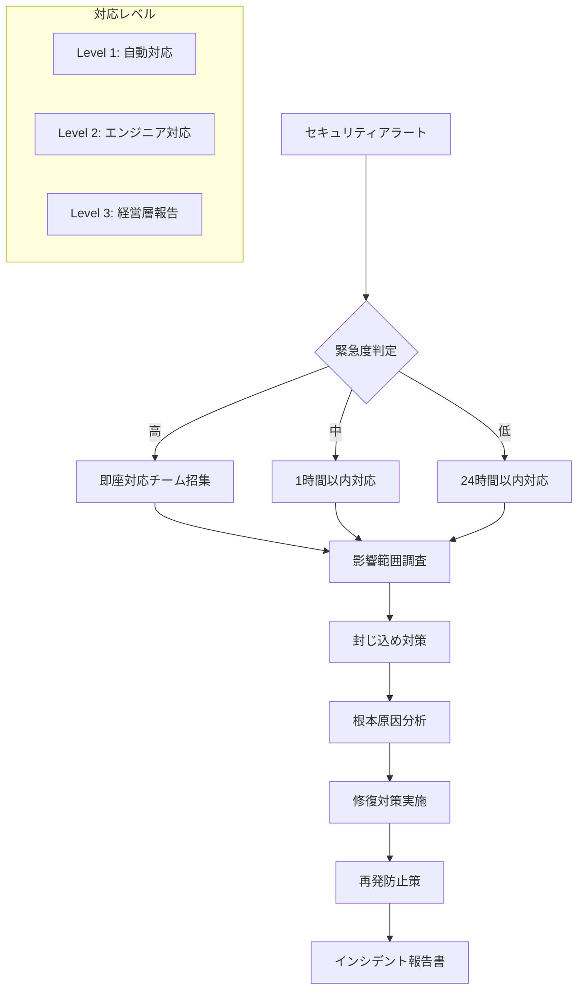

# AI漫画生成サービス セキュリティ設計書

**文書管理情報**
- 文書ID: SEC-DOC-001
- 作成日: 2025-01-20
- 版数: 1.0
- 承認者: 根岸祐樹
- 関連文書: INF-DOC-001（インフラ設計書）、SYS-DOC-001（システム設計書）

## 目次

- [1. セキュリティ概要](#1-セキュリティ概要)
  - [1.1 セキュリティ方針](#11-セキュリティ方針)
  - [1.2 脅威モデル](#12-脅威モデル)
- [2. 認証・認可設計](#2-認証認可設計)
  - [2.1 Firebase Authentication設計](#21-firebase-authentication設計)
  - [2.2 ロールベースアクセス制御](#22-ロールベースアクセス制御)
  - [2.3 API認証](#23-api認証)
- [3. データ保護設計](#3-データ保護設計)
  - [3.1 暗号化設計](#31-暗号化設計)
  - [3.2 データ分類](#32-データ分類)
  - [3.3 データライフサイクル](#33-データライフサイクル)
- [4. 著作権保護設計](#4-著作権保護設計)
  - [4.1 類似度検出システム](#41-類似度検出システム)
  - [4.2 禁止コンテンツフィルタ](#42-禁止コンテンツフィルタ)
  - [4.3 利用規約・免責設計](#43-利用規約免責設計)
- [5. コンテンツフィルタリング設計](#5-コンテンツフィルタリング設計)
  - [5.1 不適切表現検出](#51-不適切表現検出)
  - [5.2 画像コンテンツ検証](#52-画像コンテンツ検証)
  - [5.3 フィルタリング精度管理](#53-フィルタリング精度管理)
- [6. アプリケーションセキュリティ](#6-アプリケーションセキュリティ)
  - [6.1 入力検証](#61-入力検証)
  - [6.2 APIセキュリティ](#62-apiセキュリティ)
  - [6.3 セッション管理](#63-セッション管理)
- [7. インフラセキュリティ](#7-インフラセキュリティ)
  - [7.1 ネットワークセキュリティ](#71-ネットワークセキュリティ)
  - [7.2 コンテナセキュリティ](#72-コンテナセキュリティ)
  - [7.3 シークレット管理](#73-シークレット管理)
- [8. 監査・コンプライアンス](#8-監査コンプライアンス)
  - [8.1 監査ログ設計](#81-監査ログ設計)
  - [8.2 個人情報保護法対応](#82-個人情報保護法対応)
- [9. インシデント対応](#9-インシデント対応)
  - [9.1 セキュリティインシデント対応](#91-セキュリティインシデント対応)
  - [9.2 データ漏洩対応](#92-データ漏洩対応)

---

## 1. セキュリティ概要

### 1.1 セキュリティ方針

#### 基本原則
| 原則 | 内容 | 実装レベル |
|------|------|----------|
| 最小権限の原則 | 必要最小限のアクセス権限付与 | 基本 |
| 多層防御 | 複数のセキュリティ層による保護 | 基本 |
| 透明性 | セキュリティ対策の明確な開示 | 基本 |
| 継続的改善 | 定期的なセキュリティ見直し | 基本 |

#### スタートアップ向けセキュリティ戦略
```yaml
Security Strategy:
  Phase 1 (MVP): 基本セキュリティ
    - Google Cloud標準暗号化
    - Firebase認証
    - 基本的なコンテンツフィルタリング
    
  Phase 2 (Growth): セキュリティ強化
    - カスタム暗号化キー
    - 高度なフィルタリング
    - セキュリティ監査

  Phase 3 (Scale): エンタープライズ対応
    - コンプライアンス認証
    - 第三者監査
    - 高度な脅威検出
```

### 1.2 脅威モデル

#### 想定脅威とリスクレベル
| 脅威カテゴリ | 具体的脅威 | リスクレベル | 対策優先度 |
|-------------|-----------|------------|----------|
| 著作権侵害 | 既存作品の複製生成 | 高 | 最優先 |
| データ漏洩 | ユーザーデータ不正アクセス | 高 | 最優先 |
| 不正利用 | APIの大量不正利用 | 中 | 中 |
| 不適切コンテンツ | 暴力・性的表現の生成 | 中 | 中 |
| サービス停止 | DDoS攻撃 | 低 | 低 |

---

## 2. 認証・認可設計

### 2.1 Firebase Authentication設計

#### 認証戦略
本システムではFirebase Authenticationを中核とした認証戦略を採用し、以下の設計原則に基づく：

**認証プロバイダー戦略**
- 信頼性の高い認証プロバイダー（Google OAuth、メール認証）の採用
- 匿名認証の無効化による不正利用防止
- Multi-Factor Authentication（MFA）の段階的導入計画

**セキュリティポリシー設計**
- 強力なパスワードポリシーの適用（最小8文字、複合文字種必須）
- 一般的なパスワードの事前ブロック機能
- セッション管理：適切な有効期限設定による安全性とユーザビリティの両立
- レート制限：ブルートフォース攻撃対策の実装

#### JWT トークン設計方針
セキュアなトークンベース認証の実装において以下を考慮：

**標準クレーム戦略**
- Firebase標準仕様準拠によるInteroperability確保
- 適切な有効期限設定によるセキュリティバランス
- トークン検証の確実な実装

**カスタムクレーム設計**
- ユーザーロール管理：階層的権限モデルの実装
- API使用量制御：サービス品質保証のための制限機能
- セッション管理：不正使用検出のためのメタデータ保持

### 2.2 ロールベースアクセス制御

#### ユーザーロール定義
```yaml
User Roles:
  free:
    permissions:
      - manga:generate:daily_limit_1
      - manga:view:own
      - manga:download:own
    api_quota: 1/day
    
  premium:
    permissions:
      - manga:generate:unlimited
      - manga:view:own
      - manga:download:own
      - manga:edit:own
      - manga:share:public
    api_quota: 100/day
    
  admin:
    permissions:
      - manga:*
      - user:manage
      - system:monitor
      - content:moderate
    api_quota: unlimited
```

#### アクセス制御設計原則

**権限管理アーキテクチャ**
- ロールベースアクセス制御（RBAC）による階層的権限管理
- 最小権限の原則：必要最小限の権限のみ付与
- 権限の粒度設計：リソース・アクション単位での細かな制御
- ワイルドカード機能：管理者権限の効率的な実装

**認可機構設計**
- JWT トークンベースの分散認可
- デコレーターパターンによる透明な権限チェック
- リアルタイム権限検証：リクエスト毎の確実な認証
- 使用量制限：フリーユーザーの日次制限機能

**セキュリティ考慮事項**
- トークン検証の確実な実施
- 権限昇格攻撃の防止
- 認証失敗時の適切なエラーハンドリング
- 監査ログとの連携による不正アクセス検出

### 2.3 API認証

#### 外部API認証戦略

**Google AI API セキュリティアーキテクチャ**
- Secret Manager統合による機密情報の安全な管理
- API キーローテーション戦略の実装
- レート制限による適切な使用量管理
- リクエスト検証によるデータ整合性確保

**セキュリティ設計原則**
- 最小権限でのAPI呼び出し権限設定
- トークン・キーの定期的な更新メカニズム
- API呼び出し時の透明性とトレーサビリティ確保
- 異常なAPI使用パターンの検出と対応

**監視とガバナンス**
- API使用状況の継続的な監視
- 不正なAPI利用の早期検出機能
- コスト管理との連携によるリソース最適化
- セキュリティインシデント時の迅速な対応体制

---

## 3. データ保護設計

### 3.1 暗号化設計

#### 暗号化レイヤー
```yaml
Encryption Layers:
  Transport Layer:
    Protocol: TLS 1.3
    Cipher Suites: 
      - TLS_AES_256_GCM_SHA384
      - TLS_CHACHA20_POLY1305_SHA256
    Certificate: Let's Encrypt (Auto-renewal)
    
  Application Layer:
    Database Connections: SSL/TLS required
    Cloud Tasks Calls: OIDC signed requests
    Cloud Storage: HTTPS only
    
  Storage Layer:
    Cloud SQL: Google-managed AES-256
    Cloud Storage: Google-managed AES-256
    
  Key Management:
    Service: Cloud KMS
    Key Rotation: Automatic (90 days)
    Backup: Cross-region replication
```

#### 暗号化戦略

**Cloud KMS統合アーキテクチャ**
- Google Cloud KMSを活用した企業グレードの鍵管理
- ハードウェアセキュリティモジュール（HSM）による鍵の保護
- 自動キーローテーション（90日サイクル）による継続的なセキュリティ向上
- クロスリージョン複製によるキーの冗長性確保

**データ分類別暗号化戦略**
- 機密データ（ユーザープロンプト等）：KMS暗号化による最高レベルの保護
- 標準データ：Google標準暗号化による基本的な保護
- パブリックデータ：適切な分類による効率的な処理

**暗号化ライフサイクル管理**
- データライフサイクルに応じた暗号化レベルの調整
- 暗号化キーの適切なバックアップとリストア戦略
- 監査要件に対応した暗号化操作の記録

### 3.2 データ分類

#### 機密度レベル
| データ種別 | 機密度 | 暗号化 | アクセス制御 | 保持期間 |
|-----------|--------|--------|------------|---------|
| ユーザープロンプト | 中 | KMS暗号化 | 本人のみ | 90日 |
| 生成画像 | 低 | 標準暗号化 | 本人＋パブリック | 365日 |
| ユーザープロファイル | 高 | KMS暗号化 | 本人のみ | アカウント削除まで |
| API使用ログ | 中 | 標準暗号化 | 管理者のみ | 30日 |
| 課金情報 | 高 | KMS暗号化 | 本人＋課金チーム | 7年 |

### 3.3 データライフサイクル

#### データライフサイクル管理戦略

**保持ポリシー設計原則**
- データ種別に応じた適切な保持期間の設定
- 法的要件（個人情報保護法、GDPR等）への準拠
- ビジネス要件とセキュリティ要件のバランス
- 自動化された削除プロセスによるコンプライアンス確保

**自動削除アーキテクチャ**
- Cloud Schedulerによる定期的な削除タスクの実行
- データ種別ごとの柔軟な保持期間管理
- 削除前の適切な通知とアーカイブ機能
- 削除完了の監査ログ記録

**GDPR対応設計**
- ユーザー権利（忘れられる権利）への迅速な対応
- 並列処理による効率的なデータ削除
- 完全削除の確実な実行と証跡管理
- プライバシー影響評価との連携

---

## 4. 著作権保護設計

### 4.1 類似度検出システム

#### 著作権保護戦略

**多層防御アーキテクチャ**
- 入力段階での事前チェック：テキスト・プロンプト解析による既知作品の検出
- 生成段階での制御：AI生成プロセスにおける著作権配慮の組み込み
- 出力段階での検証：生成コンテンツの類似度分析と承認プロセス
- 事後監視：継続的な著作権侵害モニタリング

**知的財産データベース管理**
- 既知作品データベースの構築と維持管理
- 人気作品・キャラクター・出版社情報の体系的管理
- 定期的なデータベース更新による検出精度の向上
- 業界標準との連携によるカバレッジ拡大

**検出・判定アルゴリズム設計**
- 高精度類似度閾値（90%以上）による厳格な判定基準
- Google Vision APIを活用した画像類似性検出
- 文脈解析による誤検出の最小化
- 機械学習モデルによる継続的な検出精度改善

**リスク管理アプローチ**
- 予防的措置：著作権侵害リスクの事前評価と対策
- 迅速な対応：侵害疑義発生時の即座な対応プロセス
- 法的準備：著作権に関する適切な免責事項と利用規約

### 4.2 禁止コンテンツフィルタ

#### フィルタリングルール
```yaml
Content Filtering Rules:
  Text Filtering:
    Prohibited Terms:
      - 暴力的表現: ['殺す', '殴る', '血', '銃']
      - 性的表現: ['セクシー', 'エロ', '裸']
      - 差別表現: ['バカ', 'アホ', '死ね']
      - 著作権関連: 既知作品・キャラクター名
    
    Action: 生成拒否 + 理由説明
    
  Image Filtering:
    AI Safety Models:
      - Google Cloud Video Intelligence API
      - Safe Search Detection
    
    Detection Categories:
      - Adult Content: Block
      - Violence: Block  
      - Medical: Allow
      - Racy: Block
    
    Confidence Threshold: 0.7
```

### 4.3 利用規約・免責設計

#### 著作権免責条項
```markdown
## 著作権・知的財産権に関する免責事項

### 4.1 生成コンテンツの責任
- 本サービスが生成するコンテンツの著作権侵害について、当社は一切の責任を負いません
- ユーザーは生成されたコンテンツを使用する前に、必要に応じて著作権確認を行ってください
- 商用利用時は特に注意深い確認をお願いします

### 4.2 当社の取り組み
- 既知の著作物との類似度チェックを実施（90%以上の類似で生成拒否）
- 有名キャラクター名等の検出・フィルタリング
- 不適切コンテンツの自動検出（95%精度目標）

### 4.3 ユーザーの責任
- 生成コンテンツの使用に関する最終責任はユーザーにあります
- 著作権侵害を発見した場合は、速やかに使用を中止してください
- 第三者からの著作権侵害の申し立てについては、ユーザーが対応してください
```

---

## 5. コンテンツフィルタリング設計

### 5.1 不適切表現検出

#### テキストフィルタリング戦略

**多段階フィルタリングアーキテクチャ**
- 禁止用語データベースによる基本的なキーワード検出
- 文脈分析による高度な意図解析（自然言語処理活用）
- カテゴリ別重要度設定による段階的な対応
- 機械学習モデルによる継続的な検出精度向上

**コンテンツ分類とリスク評価**
- 暴力的表現：高リスク（即座に生成拒否）
- 性的表現：高リスク（年齢制限・文脈考慮）
- 差別表現：中リスク（教育的対応・改善提案）
- 違法行為：高リスク（法的リスク回避）

**動的フィルタリング管理**
- 禁止用語データベースの継続的な更新と管理
- ユーザーフィードバックによる誤検出の改善
- 文化的・社会的変化に対応した基準の適応
- コミュニティガイドラインとの一貫性確保

### 5.2 画像コンテンツ検証

#### 画像コンテンツ検証戦略

**Google Vision API統合アーキテクチャ**
- Safe Search Detection機能による自動的な不適切コンテンツ検出
- 企業グレードの機械学習モデルによる高精度な分析
- リアルタイム画像解析による迅速な判定プロセス
- 継続的なモデル改善によるフィルタリング精度向上

**安全性閾値設計**
- 成人向けコンテンツ：中程度で拒否（保守的アプローチ）
- 暴力的コンテンツ：中程度で拒否（ユーザー保護優先）
- 不適切コンテンツ：高確率で拒否（ブランド保護）
- 医療コンテンツ：教育目的での適切な許可基準

**品質保証機構**
- 多段階検証プロセスによる誤判定の最小化
- スコアベース判定システムによる透明性確保
- 高信頼性（95%）を目標とした検証システム
- 検証結果の詳細ログ記録と分析機能

### 5.3 フィルタリング精度管理

#### 品質メトリクス
```yaml
Filtering Quality Metrics:
  Target Accuracy: 95%
  
  Measurement:
    True Positive Rate: > 90%  # 実際に不適切なコンテンツを正しく検出
    False Positive Rate: < 5%  # 適切なコンテンツを誤って拒否
    
  Monitoring:
    - 月次精度レビュー
    - ユーザーフィードバック分析
    - 誤検出報告の収集・分析
    
  Improvement Process:
    - 禁止用語リストの定期更新
    - 機械学習モデルの再訓練
    - 閾値の調整
```

---

## 6. アプリケーションセキュリティ

### 6.1 入力検証

#### 入力検証セキュリティ戦略

**多層入力検証アーキテクチャ**
- スキーマベース検証：構造化されたデータ形式の確実な検証
- 文字エンコーディング検証：日本語対応の適切な文字セット制限
- 長さ制限：DoS攻撃防止のための適切なサイズ制限（最大50,000文字）
- データ型検証：想定される値の範囲とフォーマットの厳密な確認

**セキュリティ攻撃対策**
- SQLインジェクション対策：危険なSQLパターンの事前検出と遮断
- XSS攻撃対策：スクリプト実行を狙った入力の検出と無害化
- CSRF対策：クロスサイトリクエストフォージェリの防止機構
- 正規表現インジェクション対策：ReDoS攻撃の防止

**ビジネスロジック検証**
- 漫画スタイル制限：事前定義されたスタイルオプションのみ許可
- ページ数制限：合理的な範囲（10-100ページ）での制限
- コンテンツ品質保証：適切な長さと内容の確保
- ユーザー体験配慮：明確なエラーメッセージによる改善支援

**検証エラーハンドリング戦略**
- セキュリティログ：すべての検証失敗の記録と分析
- ユーザーガイダンス：建設的なフィードバックによる改善支援
- レート制限連携：繰り返し違反の自動検出と対処
- 継続的改善：検証パターンの定期的な更新と最適化

### 6.2 APIセキュリティ

#### APIセキュリティ統合戦略

**レート制限アーキテクチャ**
- PostgreSQLベース分散カウンター：トランザクション整合性を確保
- ユーザーロール別制限：フリー（1回/日）、プレミアム（100回/日）、管理者（1000回/日）
- 時間窓ベース制御：24時間ローリングウィンドウによる柔軟な制限
- 自動リセット機能：日次自動カウンターリセット

**多層セキュリティミドルウェア**
- 統合セキュリティゲートウェイ：すべてのAPI呼び出しの一元監視
- 段階的検証プロセス：レート制限 → 入力検証 → 著作権チェック
- 早期拒否戦略：無駄な処理を避ける効率的なフィルタリング
- セキュリティ例外管理：適切なエラーレスポンスと理由説明

**統合セキュリティ判定**
- 複数セキュリティレイヤーの協調動作
- 違反ログの一元記録と分析
- ユーザー行動パターン監視
- 継続的なセキュリティ改善フィードバックループ

**パフォーマンス最適化**
- 非同期処理によるレスポンス性能維持
- PostgreSQL LISTEN/NOTIFYによるリアルタイム判定
- 効率的なメモリ使用による大量ユーザー対応
- 負荷分散対応のスケーラブル設計

### 6.3 HITLセキュリティ

#### HITL (Human-in-the-Loop) セキュリティ設計戦略

**インタラクティブセキュリティアーキテクチャ**
- フィードバックシステムのセキュリティ統合管理
- チャットメッセージのリアルタイム検証・サニタイズ
- プレビューバージョンの適切なアクセス制御
- フェーズベースワークフローのセキュリティ保証

**所有権・アクセス制御設計**
- リクエストIDによる厳格な所有権確認
- 7段階のフェーズ管理による適切なワークフロー制御
- 24時間の有効期限によるプレビューアクセス管理
- 30分のフィードバックタイムアウトによる効率性確保

**メッセージセキュリティ対策**
- XSS攻撃対策：HTMLエスケープによる安全性確保
- SQLインジェクション対策：パラメータ化による保護
- 悪意のあるスクリプト検出：パターンマッチングによる防御
- メッセージ長制限：DoS攻撃防止（最大2000文字）

**セキュリティパターン検出**
- JavaScript実行攻撃の検出と遮断
- イベントハンドラー悪用の防止
- データURIスキーム攻撃の対策
- VBScript注入攻撃の検出

#### WebSocketセキュリティ戦略

**リアルタイム通信セキュリティアーキテクチャ**
- JWT認証による安全なWebSocket接続確立
- 接続管理：ユーザー当たり最大5接続制限によるリソース保護
- 分散レート制限：1秒間に10メッセージまでの制御
- 接続状態の適切な管理と監視

**WebSocket認証・認可設計**
- JWT トークンベースの接続時認証
- ユーザー存在確認による不正接続の防止
- 有効期限チェックによるセッション管理
- 認証失敗時の適切なエラーハンドリング

**メッセージセキュリティ管理**
- メッセージタイプ制限：事前定義された4種類のメッセージのみ許可
- サイズ制限：10KBまでのメッセージによるDoS攻撃防止
- 構造検証：JSONフォーマットの確実な検証
- 不正メッセージの早期検出と拒否

**データ暗号化とプライバシー保護**
- 機密データの選択的AES暗号化
- 送信前のデータサニタイズ処理
- 通信内容の適切なログ記録（個人情報除外）
- エンドツーエンドの整合性確保

### 6.4 セッション管理

#### セッション管理セキュリティ戦略

**分散セッション管理アーキテクチャ**
- PostgreSQLセッションテーブル：トランザクション整合性と監査性を両立
- 7日間のセッション有効期限：適切なユーザー体験とセキュリティのバランス
- 暗号学的に安全なセッションID生成：予測不可能な32バイトトークン
- メタデータ記録：IP、User-Agent、作成時刻による追跡機能

**セッションセキュリティ管理**
- IP固定チェック：セッションハイジャック攻撃の防止
- セッション検証：リクエスト毎の確実な認証状態確認
- 自動無効化：セキュリティ違反検出時の即座な対応
- タイムアウト管理：非活動時の適切なセッション失効

**不正アクセス対策**
- セッション乗っ取り検出：IP変更の監視と対応
- 並行セッション制限：同一ユーザーの複数セッション管理
- 不審な活動の検出：異常なアクセスパターンの監視
- セキュリティログ：すべてのセッション関連活動の記録

**セッションライフサイクル管理**
- セキュアな作成プロセス：エントロピーの高いID生成
- 適切な更新機能：セッションデータの動的更新
- 確実な削除機能：ログアウト時の完全なセッションクリア
- 期限管理：自動的な期限切れセッションの清掃

---

## 7. インフラセキュリティ

### 7.1 ネットワークセキュリティ

#### Cloud Armor設定（基本）
```yaml
Cloud Armor Configuration:
  Security Policy: manga-security-policy
  
  Rules:
    rate-limiting:
      Priority: 1000
      Action: rate_based_ban
      Rate Limit: 1000 requests/minute per IP
      Ban Duration: 600 seconds (10分)
      
    geo-blocking:
      Priority: 2000  
      Action: allow
      Source: Japan, US, EU (主要市場のみ)
      
    sql-injection-protection:
      Priority: 3000
      Action: deny(403)
      Expression: "evaluatePreconfiguredExpr('sqli-stable')"
      
    xss-protection:
      Priority: 4000
      Action: deny(403)
      Expression: "evaluatePreconfiguredExpr('xss-stable')"
      
    default-allow:
      Priority: 10000
      Action: allow
      Description: "Default allow rule"
```

### 7.2 コンテナセキュリティ

#### コンテナセキュリティ設計原則

**セキュアコンテナ構築戦略**
- 最小権限実行：非rootユーザーでのアプリケーション実行
- 最小限基盤イメージ：slimイメージによる攻撃面の縮小
- セキュリティアップデート：定期的な基盤イメージとパッケージ更新
- 不要パッケージの除去：インストール後のクリーンアップによるサイズ削減

**コンテナランタイムセキュリティ**
- 読み取り専用ルートファイルシステム：不正な変更の防止
- Linux Capability制限：必要最小限の権限のみ付与
- リソース制限：CPU、メモリ制限によるDoS攻撃対策
- ヘルスチェック機能：アプリケーション正常性の継続監視

**Container Registry セキュリティ**
- 脆弱性スキャン：イメージビルド時の自動スキャン
- Binary Authorization：署名済みイメージのみのデプロイ許可
- イメージ署名：改ざん検出のためのデジタル署名
- 定期的なベースイメージ更新：セキュリティパッチの適用

#### セキュリティスキャン設定
```yaml
Container Security:
  Image Scanning:
    Registry: Container Registry
    Vulnerability Scanning: Enabled
    Policy: Block deployment if CRITICAL vulnerabilities
    
  Runtime Security:
    Binary Authorization: Enabled (基本ポリシー)
    Admission Controller: 署名済みイメージのみ許可
    
  Security Policies:
    - 非rootユーザー実行必須
    - 読み取り専用ルートファイルシステム
    - 不要なLinux Capabilityの削除
```

### 7.3 シークレット管理

#### シークレット管理戦略

**Cloud Secret Manager統合アーキテクチャ**
- 企業グレードの機密情報管理：Google Cloud Secret Managerによる安全な保存
- バージョン管理：機密情報の履歴管理と適切なロールバック機能
- アクセス制御：IAMによる細かな権限管理と監査機能
- 自動ローテーション：定期的なAPI キー更新による継続的なセキュリティ向上

**機密情報ライフサイクル管理**
- 安全な取得：暗号化された通信による機密情報の安全な取得
- エラー処理：機密情報取得失敗時の適切なエラーハンドリング
- 監査ログ：すべてのアクセス記録による不正使用の検出
- 障害対応：機密情報サービス障害時のフォールバック戦略

**API キーローテーション戦略**
- 定期ローテーション：Gemini、Imagen等の外部APIキーの定期更新
- 段階的切り替え：新旧キーの並行運用による無停止更新
- 自動無効化：古いバージョンの適切な無効化処理
- 緊急対応：セキュリティインシデント時の迅速なキー無効化

**セキュリティベストプラクティス**
- 最小権限アクセス：必要最小限のシークレットアクセス権限
- 環境分離：開発、ステージング、本番環境での適切な分離
- 監視・アラート：異常なアクセスパターンの検出と通知
- 定期監査：アクセス権限とシークレット使用状況の定期レビュー

---

## 8. 監査・コンプライアンス

### 8.1 監査ログ設計

#### セキュリティ監査ログ戦略

**包括的監査ログアーキテクチャ**
- 構造化ログ：JSON形式による機械的な解析・検索の実現
- イベント分類：認証、データアクセス、セキュリティ違反の体系的な記録
- タイムスタンプ管理：ISO形式による正確な時系列記録
- メタデータ収集：IP、User-Agent、セッションID等の文脈情報保持

**セキュリティイベント監査**
- 認証イベント：ログイン、ログアウト、トークン更新の全記録
- データアクセス：リソースへの読み取り、書き込み、削除操作の追跡
- セキュリティ違反：著作権、コンテンツフィルタ、レート制限違反の記録
- 重要度分類：違反タイプに応じた適切な重要度レベルの自動設定

**監査証跡とコンプライアンス**
- 改ざん防止：ログの整合性確保による信頼性の担保
- 長期保存：法的要件に応じた適切な保存期間管理
- アクセス制御：監査ログへの適切なアクセス権限管理
- エクスポート機能：外部監査・分析のためのデータ提供
- Firebase Hostingアクセスログ：Cloud LoggingへエクスポートしAPIログと統合管理

**異常検出と警告**
- パターン分析：異常なアクセスパターンの自動検出
- リアルタイム警告：重大なセキュリティ事象の即座な通知
- 傾向分析：セキュリティトレンドの継続的な監視
- レポート生成：定期的なセキュリティサマリーの作成

### 8.2 個人情報保護法対応

#### プライバシー保護戦略

**包括的データ保護アーキテクチャ**
- 暗号化管理統合：データ暗号化機能との連携による情報保護
- 並列データ削除：複数データストアからの効率的な同時削除処理
- 削除証明書：GDPR等の法的要件に対応した削除完了証明
- エラー処理：削除失敗時の適切な例外処理とログ記録

**データ主体の権利への対応**
- 忘れられる権利：ユーザー要求に基づく完全なデータ削除
- データポータビリティ：構造化されたデータエクスポート機能
- アクセス権：ユーザー自身のデータへの適切なアクセス提供
- 訂正権：個人データの修正・更新機能

**GDPR・個人情報保護法準拠**
- 30日以内対応：データ主体の権利行使要求への迅速な対応
- データ分類：個人データの種別に応じた適切な処理
- 同意管理：データ処理に対する明示的な同意取得と管理
- プライバシー影響評価：高リスク処理に対する事前評価

**データ匿名化・仮名化**
- 適切な匿名化：個人識別不可能な形での情報利用
- エクスポートデータの安全化：第三者提供時の個人情報保護
- 監査ログの匿名化：プライバシーを保護した形での記録保持
- 統計情報活用：個人を特定しない形でのサービス改善


---

## 9. インシデント対応

### 9.1 セキュリティインシデント対応

#### インシデント対応フロー


#### インシデント分類
```yaml
Incident Classification:
  Critical (Level 3):
    - 大規模データ漏洩
    - システム全体停止
    - 法的問題発生
    Response Time: 15分以内
    Escalation: CEO, CTO, 法務
    
  High (Level 2):
    - 限定的データ漏洩
    - 主要機能停止
    - 著作権侵害疑い
    Response Time: 1時間以内
    Escalation: CTO, セキュリティ責任者
    
  Medium (Level 1):
    - 個別ユーザー問題
    - 性能劣化
    - フィルタ誤検出
    Response Time: 4時間以内
    Escalation: エンジニアチーム
```

### 9.2 データ漏洩対応

#### データ漏洩対応戦略

**自動化されたインシデント対応アーキテクチャ**
- 通知テンプレート管理：事前準備されたコミュニケーション戦略
- インシデントID管理：固有識別子による追跡可能性確保
- 段階的対応プロセス：封じ込め→調査→通知→記録の体系的実行
- 法的コンプライアンス：規制要件に応じた適切な報告義務履行

**即座封じ込め戦略**
- システム隔離：影響範囲に応じた部分的・全面的なアクセス遮断
- 認証情報無効化：漏洩したAPIキー・トークンの緊急無効化
- 緊急メンテナンスモード：サービス継続性とセキュリティのバランス
- 証拠保全：フォレンジック調査のための適切な証拠保持

**影響範囲評価と通知管理**
- リスク評価：漏洩データの種類・規模に応じた影響度判定
- 法的通知判定：GDPR、個人情報保護法等の報告義務確認
- ユーザー通知：影響を受けたユーザーへの適切な情報提供
- ステークホルダー連絡：経営陣、法務、PR部門との連携

**インシデント記録と学習**
- 包括的記録：インシデントの全プロセスの詳細な記録保持
- 根本原因分析：再発防止のための体系的な原因調査
- 改善策実装：分析結果に基づくセキュリティ対策の強化
- 組織学習：インシデントから得られた知見の組織全体への共有

---

## 改訂履歴

| 版数 | 日付 | 変更内容 | 担当者 |
|------|------|----------|--------|
| 1.0 | 2025-01-20 | 初版作成（基本セキュリティ構成） | Claude Code |

---

**文書承認**
- セキュリティ責任者: [署名] 日付: [日付]
- 法務責任者: [署名] 日付: [日付]
- プライバシーオフィサー: [署名] 日付: [日付]
