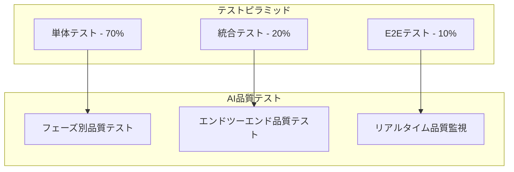

# AI漫画生成サービス テスト設計書

**文書管理情報**
- 文書ID: TEST-DOC-001
- 作成日: 2025-01-20
- 版数: 1.0
- 承認者: 根岸祐樹
- 関連文書: SYS-DOC-001（システム設計書）、SEC-DOC-001（セキュリティ設計書）

## 目次

- [1. テスト概要](#1-テスト概要)
  - [1.1 テスト戦略](#11-テスト戦略)
  - [1.2 品質目標](#12-品質目標)
- [2. AI品質保証設計](#2-ai品質保証設計)
  - [2.1 7フェーズ品質ゲート](#21-7フェーズ品質ゲート)
  - [2.2 品質スコア算出](#22-品質スコア算出)
  - [2.3 自動リトライ機構](#23-自動リトライ機構)
- [3. 自動テスト設計](#3-自動テスト設計)
  - [3.1 単体テスト](#31-単体テスト)
  - [3.2 統合テスト](#32-統合テスト)
  - [3.3 E2Eテスト](#33-e2eテスト)
- [4. パフォーマンステスト設計](#4-パフォーマンステスト設計)
  - [4.1 負荷テスト](#41-負荷テスト)
  - [4.2 レスポンス時間測定](#42-レスポンス時間測定)
  - [4.3 ボトルネック特定](#43-ボトルネック特定)
- [5. AI出力品質テスト設計](#5-ai出力品質テスト設計)
  - [5.1 画像生成品質](#51-画像生成品質)
  - [5.2 テキスト配置精度](#52-テキスト配置精度)
  - [5.3 視覚品質スコア](#53-視覚品質スコア)
- [6. テストデータ管理](#6-テストデータ管理)
  - [6.1 AIテストケース生成](#61-aiテストケース生成)
  - [6.2 品質フィードバックループ](#62-品質フィードバックループ)
  - [6.3 テストデータ更新戦略](#63-テストデータ更新戦略)
- [7. セキュリティテスト](#7-セキュリティテスト)
  - [7.1 著作権保護テスト](#71-著作権保護テスト)
  - [7.2 コンテンツフィルタテスト](#72-コンテンツフィルタテスト)
  - [7.3 認証・認可テスト](#73-認証認可テスト)
- [8. CI/CD統合](#8-cicd統合)
  - [8.1 テストパイプライン](#81-テストパイプライン)
  - [8.2 品質ゲート設定](#82-品質ゲート設定)
  - [8.3 デプロイメント承認](#83-デプロイメント承認)
- [9. テスト環境管理](#9-テスト環境管理)

---

## 1. テスト概要

### 1.1 テスト戦略

#### 基本方針
| 項目 | 方針 | 実装レベル |
|------|------|----------|
| 品質優先 | 85%品質スコア達成を最優先 | 基本 |
| 自動化重視 | 反復可能なテストの自動化 | 基本 |
| 効率性追求 | 最小限のテスト工数で最大効果 | 基本 |
| 継続改善 | AIによるテストケース進化 | 高度 |

#### テストピラミッド


### 1.2 品質目標

#### 品質KPI
```yaml
Quality Targets:
  Functional Quality:
    Unit Test Coverage: 80%
    Integration Test Coverage: 70%
    E2E Test Coverage: 主要フロー100%
    
  AI Quality:
    Phase Success Rate: 85% per phase
    End-to-End Success Rate: 70%
    User Satisfaction Score: 4.0/5.0
    
  Performance Quality:
    Response Time: < 100ms (API)
    Generation Time: < 10分 (standard text)
    Concurrent Users: 100 users supported
    
  Security Quality:
    Vulnerability Scan: 0 Critical issues
    Copyright Detection: 95% accuracy
    Content Filter: 95% accuracy
```

---

## 2. AI品質保証設計

### 2.1 7フェーズ品質ゲート

#### AI品質ゲート設計原則

**フェーズ別品質検証戦略:**
- 8フェーズ各々に特化した品質検証ロジックを実装
- 85%品質闾値で一貫した品質基準を維持
- フェーズ固有スコア(80%)と共通チェック(20%)の組み合わせ

**品質評価フレームワーク:**
- 入力データと出力データの照合検証
- リアルタイム品質スコア算出とログ記録
- 品質改善提案機能で継続的改善

**フェーズ固有評価指標:**
- **テキスト解析**: 文章構造理解度、キャラクター抽出精度、テーマ理解度
- **物語構造**: プロット一貫性、ペーシング品質、ドラマチックアーク
- **シーン分割**: シーン境界精度、場面切替品質
- **キャラクターデザイン**: 視覚一貫性、キャラクター識別性、スタイル遵守
- **パネルレイアウト**: レイアウトバランス、読みやすさ、スペース効率
- **画像生成**: 技術品質、シーン一致度、スタイル一貫性
- **セリフ配置**: 文字可読性、吹き出し配置、フォント選択
- **統合品質**: 全体一貫性、技術品質、ユーザーエクスペリエンス

### 2.2 品質スコア算出

#### 品質スコア定義
```yaml
Quality Score Calculation:
  Phase 1 (Text Analysis):
    - Structure Understanding: 40%
    - Character Extraction: 30%  
    - Theme Detection: 30%
    Target: 85%
    
  Phase 2 (Story Structure):
    - Plot Coherence: 50%
    - Pacing Quality: 30%
    - Dramatic Arc: 20%
    Target: 85%
    
  Phase 3 (Scene Division):
    - Scene Boundary Accuracy: 60%
    - Transition Quality: 40%
    Target: 85%
    
  Phase 4 (Character Design):
    - Visual Consistency: 50%
    - Character Distinctiveness: 30%
    - Style Adherence: 20%
    Target: 85%
    
  Phase 5 (Panel Layout):
    - Layout Balance: 40%
    - Reading Flow: 40%
    - Space Efficiency: 20%
    Target: 85%
    
  Phase 6 (Image Generation):
    - Technical Quality: 40%
    - Scene Matching: 40%
    - Style Consistency: 20%
    Target: 85%
    
  Phase 7 (Dialog Placement):
    - Text Readability: 50%
    - Bubble Placement: 30%
    - Font Selection: 20%
    Target: 85%
    
  Phase 8 (Final Integration):
    - Overall Coherence: 60%
    - Technical Quality: 25%
    - User Experience: 15%
    Target: 85%
```

### 2.3 自動リトライ機構

#### 自動リトライ機構設計原則

**リトライ戦略:**
- 最大3回のリトライで品質目標達成を目指す
- 85%品質闾値で自動合格判定
- 75%以上のスコアで品質低下許容モード

**エラーハンドリング方針:**
- 各リトライで最高品質結果を保持
- 例外発生時もリトライカウンターを継続
- 終了時のフォールバック戦略でサービス継続性確保

**ログ管理設計:**
- 品質成功/リトライ/エラーの詳細ログ記録
- フェーズ別品質パフォーマンス分析
- リトライパターン分析で改善箇所特定

**品質保証レベル:**
- **合格**: 85%以上の品質スコアで自動進行
- **許容**: 75-84%の品質スコアで条件付き進行
- **失敗**: 75%未満でフェーズ実行停止

---

## 3. 自動テスト設計

### 3.1 単体テスト

#### 単体テスト設計原則

**テストカバレッジ目標:**
- 80%以上のコードカバレッジ達成
- 各フェーズサービスの完全テスト
- モックとパッチ機能で外部依存分離

**テストシナリオ設計:**
- **基本機能テスト**: 標準的な入力データでの正常動作検証
- **境界値テスト**: 文字数制限、処理時間限界の検証
- **エラーハンドリングテスト**: 不正入力、APIエラー時の適切な例外処理

**フェーズ固有テスト要件:**
- **テキスト解析**: キャラクター抽出精度、テーマ検出精度、感情解析精度
- **物語構造**: プロット一貫性、シーン進行の自然さ
- **キャラクターデザイン**: 視覚的一貫性、キャラクター識別性
- **パネルレイアウト**: 読みやすさ、コマ配置の適切さ
- **画像生成**: 画質チェック、シーン一致度、スタイル一貫性

**共通テスト基盤:**
- 処理時間制限チェックでパフォーマンス保証
- 入力値検証でセキュリティと品質保証
- 出力フォーマット検証でAPI互換性確保
- エラー回復機構でサービス継続性保証

### 3.2 統合テスト

#### 統合テスト設計原則

**マイクロサービス間連携テスト:**
- フェーズ間データフローの完全性検証
- フェーズ出力と次フェーズ入力のデータ整合性チェック
- 非同期処理の状態遷移とエラーハンドリング

**メッセージングシステムテスト:**
- Pub/Subメッセージの送受信整合性
- メッセージ配信保証とタイムアウト処理
- メッセージの重複配信や順序保証

**データ永続化テスト:**
- Redisキャッシュデータの整合性検証
- TTL(Time To Live)設定と自動期限切れの動作確認
- データベーストランザクション整合性

**サービス間通信テスト:**
- REST API呼び出しのレスポンス時間とエラーハンドリング
- サーキットブレーカーパターンで障害耐性検証
- ロードバランシングとフェイルオーバー機能

**テストカバレッジ目標:**
- 統合テストカバレッジ、70%以上
- 主要シナリオの100%カバーでビジネスロジック保証

### 3.3 E2Eテスト

#### HITLフィードバックテスト設計原則

**フェーズプレビュー生成テスト戦略:**
- 全8フェーズでのプレビュー生成成功率検証
- プレビューデータの構造整合性とフェーズ情報正確性確認
- 生成タイムアウト制限（各フェーズ3分以内）の遵守検証

**チャットフィードバック処理テスト設計:**
- 自然言語フィードバックの意図解析精度検証（80%以上）
- フィードバック分類（修正・追加・削除）の正確性テスト
- 多言語フィードバック対応とエラーハンドリング検証

**フィードバックタイムアウト処理設計:**
- 30分タイムアウト設定での適切な処理継続検証
- タイムアウト後の自動進行とログ記録確認
- ユーザー体験を損なわないタイムアウト通知設計

**プレビューバージョン分岐テスト戦略:**
- フィードバックベースでのバージョン分岐機能検証
- 親バージョンからの系譜管理と整合性確認
- 異なるフィードバック経路での独立性保証

**WebSocketリアルタイム更新テスト原則:**
- フェーズ完了通知のリアルタイム配信確認
- フィードバック送受信の双方向通信整合性検証
- 接続断絶時の再接続とメッセージ復旧メカニズム検証

#### エンドツーエンドテストシナリオ設計原則

**完全な漫画生成フロー設計戦略:**
- ユーザージャーニー全体での操作フロー検証（ランディング→生成→ダウンロード）
- 生成プロセス全体での応答性とタイムアウト制御（最大12分）
- 最終成果物（PDF）の品質と構造整合性確認

**ユーザー認証テスト設計:**
- 認証フロー全体での操作性とセキュリティ確認
- ログイン状態の永続化とセッション管理検証
- エラーハンドリングとユーザビリティの両立

**インタラクティブ要素テスト戦略:**
- プロンプト入力の文字数制限と即時検証機能
- スタイル選択UIの直感性と選択結果の正確な反映
- 生成開始ボタンの重複実行防止機能

**進捗表示テスト設計原則:**
- 8フェーズ各々での進捗状況リアルタイム更新
- 進捗バー・メッセージでのユーザー体験向上
- エラー発生時の適切な状況説明と復旧選択肢提示

**結果確認・出力テスト戦略:**
- 生成完了時の最小ページ数保証（10ページ以上）
- ダウンロード機能の確実性とファイル形式正確性
- 高解像度PDF出力での画質・レイアウト品質保証

---

## 4. パフォーマンステスト設計

### 4.1 負荷テスト

#### 負荷テスト設計原則

**100同時ユーザー負荷テスト戦略:**
- 段階的ユーザー増加（10ユーザー/秒）でサーバー負荷の漸進的テスト
- 軽負荷操作（ギャラリー閲覧）と重負荷操作（漫画生成）の適切な比率設計
- 現実的なユーザー行動パターン（1-3秒間隔）でのテスト実行

**パフォーマンス目標設定原則:**
- **API応答時間**: 95パーセンタイルで2秒以内の目標設定
- **生成処理時間**: 平均10分以内での完了保証
- **エラー率制限**: 1%以下のエラー率維持でサービス品質保証
- **スループット目標**: 50リクエスト/分での継続処理能力

**負荷テスト実行設計:**
- 10分間継続実行での安定性確認とリソース使用量監視
- 認証フローを含む完全なユーザージャーニー検証
- 長時間実行プロセス（漫画生成）でのタイムアウト制御とリソース管理

**テストデータ管理戦略:**
- 多様なプロンプトパターンでの負荷分散とキャッシュ効率検証
- 異なるスタイル・ページ数での処理時間バリエーション測定
- 非同期処理ポーリングでの適切な間隔設定（30秒間隔）

### 4.2 レスポンス時間測定

#### パフォーマンス監視設計原則

**API パフォーマンス測定戦略:**
- エンドポイント別の応答時間・ステータスコード・ペイロードサイズの包括的監視
- リアルタイムメトリクス収集でのパフォーマンス劣化早期発見
- 例外発生時の詳細エラー追跡とサービス継続性確保

**パフォーマンステストケース設計:**
- **ログインAPI**: 500ms以内・50同時ユーザーでの高速認証処理検証
- **ギャラリーAPI**: 1秒以内・100同時ユーザーでの軽量データ表示性能
- **生成開始API**: 2秒以内・20同時ユーザーでの非同期処理開始時間制限

**メトリクス記録・分析設計原則:**
- 時系列データでのパフォーマンス傾向分析とボトルネック特定
- エラー率とレスポンス時間の相関分析でシステム健全性評価
- 負荷パターンと処理時間の関係性分析で最適化箇所特定

**継続的監視システム設計:**
- リアルタイムアラート設定での異常検知と迅速な対応体制構築
- 定期的なパフォーマンス測定結果のトレンド分析レポート生成
- サービスレベル目標（SLO）に基づく品質管理とインシデント対応

### 4.3 ボトルネック特定

#### ボトルネック特定設計原則

**フェーズ別パフォーマンス分析戦略:**
- **リソース使用量監視**: CPU・メモリ・ディスクI/O・ネットワーク帯域の包括的測定
- **API呼び出し時間解析**: 外部サービス（Vertex AI、Imagen）との通信時間分析
- **データベース クエリ最適化**: SQL実行時間・インデックス効率・キャッシュヒット率の監視

**ボトルネック特定基準設定:**
- **CPU使用率**: 80%超過時の高優先度アラートとスケーリング判断
- **メモリ使用率**: 85%超過時の緊急対応とリソース増強判断
- **API応答時間**: 30秒超過時の中優先度改善対象として特定

**最適化推奨事項生成原則:**
- ボトルネック種別に応じた具体的改善施策の自動提案
- 過去のパフォーマンス改善実績に基づく効果予測
- コスト効率を考慮した優先順位付けアルゴリズム

**パフォーマンススコア算出設計:**
- リソース使用効率・API応答時間・エラー率の重み付け評価
- フェーズ固有の処理特性を考慮したスコア調整機能
- 継続的改善のための時系列トレンド分析とベンチマーク比較

---

## 5. AI出力品質テスト設計

### 5.1 画像生成品質

#### 画像品質評価システム
```python
class ImageQualityTester:
    def __init__(self):
        self.quality_models = self.load_quality_models()
        
    async def evaluate_image_quality(self, image_url: str, scene_context: dict) -> dict:
        """
        生成画像の品質評価
        """
        # 1. 技術的品質評価
        technical_score = await self.evaluate_technical_quality(image_url)
        
        # 2. シーン一致度評価
        scene_score = await self.evaluate_scene_matching(image_url, scene_context)
        
        # 3. スタイル一貫性評価
        style_score = await self.evaluate_style_consistency(image_url)
        
        overall_score = (technical_score * 0.4) + (scene_score * 0.4) + (style_score * 0.2)
        
        return {
            'overall_score': overall_score,
            'technical_score': technical_score,
            'scene_score': scene_score,
            'style_score': style_score,
            'passes_quality_gate': overall_score >= 0.85,
            'recommendations': self.generate_improvement_suggestions(
                technical_score, scene_score, style_score
            )
        }
    
    async def evaluate_technical_quality(self, image_url: str) -> float:
        """
        技術的画像品質評価
        """
        from PIL import Image
        import numpy as np
        
        # 画像ダウンロード・解析
        image = await self.download_image(image_url)
        
        scores = []
        
        # 解像度チェック
        width, height = image.size
        resolution_score = min(1.0, (width * height) / (1024 * 1024))  # 1MP基準
        scores.append(resolution_score)
        
        # シャープネス評価（ラプラシアン分散）
        gray_image = image.convert('L')
        laplacian_var = cv2.Laplacian(np.array(gray_image), cv2.CV_64F).var()
        sharpness_score = min(1.0, laplacian_var / 1000)  # 閾値調整
        scores.append(sharpness_score)
        
        # 色彩バランス
        color_score = self.evaluate_color_balance(image)
        scores.append(color_score)
        
        return sum(scores) / len(scores)
```

### 5.2 テキスト配置精度

#### セリフ配置品質テスト
```python
class DialogPlacementTester:
    async def test_text_readability(self, manga_page: dict) -> dict:
        """
        テキスト可読性テスト
        """
        scores = []
        
        for dialog in manga_page['dialogs']:
            # 1. フォントサイズ適切性
            font_score = self.evaluate_font_size(dialog)
            
            # 2. 吹き出し配置
            bubble_score = self.evaluate_bubble_placement(dialog, manga_page['layout'])
            
            # 3. 背景とのコントラスト
            contrast_score = self.evaluate_text_contrast(dialog, manga_page['background'])
            
            dialog_score = (font_score + bubble_score + contrast_score) / 3
            scores.append(dialog_score)
        
        return {
            'average_readability': sum(scores) / len(scores) if scores else 0,
            'readability_distribution': scores,
            'passes_readability_test': all(score >= 0.8 for score in scores)
        }
    
    def evaluate_font_size(self, dialog: dict) -> float:
        """
        フォントサイズ適切性評価
        """
        font_size = dialog['font_size']
        text_length = len(dialog['text'])
        bubble_area = dialog['bubble_area']
        
        # 面積あたりの文字サイズ適切性
        text_density = text_length / bubble_area
        optimal_font_size = self.calculate_optimal_font_size(text_density)
        
        size_difference = abs(font_size - optimal_font_size) / optimal_font_size
        return max(0, 1.0 - size_difference)
```

### 5.3 視覚品質スコア

#### 総合視覚品質評価
```python
class VisualQualityScorer:
    def __init__(self):
        self.quality_weights = {
            'composition': 0.3,      # 構図
            'color_harmony': 0.2,    # 色彩調和
            'detail_quality': 0.2,   # 詳細度
            'style_consistency': 0.3  # スタイル一貫性
        }
    
    async def calculate_manga_quality_score(self, manga_pages: list) -> dict:
        """
        漫画全体の視覚品質スコア算出
        """
        page_scores = []
        
        for page in manga_pages:
            page_score = await self.evaluate_page_quality(page)
            page_scores.append(page_score)
        
        # 全体スコア計算
        overall_score = sum(page_scores) / len(page_scores)
        
        # 一貫性スコア
        consistency_score = self.calculate_consistency_across_pages(manga_pages)
        
        # 最終品質スコア
        final_score = (overall_score * 0.8) + (consistency_score * 0.2)
        
        return {
            'overall_quality_score': final_score,
            'page_scores': page_scores,
            'consistency_score': consistency_score,
            'passes_quality_threshold': final_score >= 0.85,
            'quality_breakdown': self.analyze_quality_components(manga_pages)
        }
```

---

## 6. テストデータ管理

### 6.1 AIテストケース生成

#### 自動テストケース生成システム
```python
class AITestCaseGenerator:
    def __init__(self):
        self.gemini_client = self.initialize_gemini_client()
        self.test_case_templates = self.load_templates()
        
    async def generate_test_scenarios(self, count: int = 50) -> list:
        """
        AIによるテストシナリオ自動生成
        """
        generated_scenarios = []
        
        for category in ['adventure', 'romance', 'comedy', 'action', 'slice_of_life']:
            category_scenarios = await self.generate_category_scenarios(category, count // 5)
            generated_scenarios.extend(category_scenarios)
        
        # 品質検証
        validated_scenarios = await self.validate_generated_scenarios(generated_scenarios)
        
        return validated_scenarios
    
    async def generate_category_scenarios(self, category: str, count: int) -> list:
        """
        カテゴリ別テストシナリオ生成
        """
        prompt = f"""
        漫画の{category}ジャンルのテスト用あらすじを{count}個生成してください。
        
        要件:
        - 各あらすじは100-500文字
        - 多様なキャラクター設定
        - 明確なストーリー構造
        - テスト用途に適した内容
        
        形式:
        1. [タイトル]: [あらすじ]
        2. [タイトル]: [あらすじ]
        ...
        """
        
        response = await self.gemini_client.generate_content(prompt)
        scenarios = self.parse_scenarios(response.text)
        
        return scenarios
    
    async def create_edge_case_tests(self) -> list:
        """
        エッジケーステスト生成
        """
        edge_cases = [
            # 極端に短いテキスト
            {"text": "主人公が戦う。", "expected_result": "error", "reason": "too_short"},
            
            # 極端に長いテキスト  
            {"text": "長編小説..." * 10000, "expected_result": "error", "reason": "too_long"},
            
            # 文字数境界値
            {"text": "a" * 49999, "expected_result": "success", "reason": "boundary_test"},
            {"text": "a" * 50001, "expected_result": "error", "reason": "boundary_test"},
            
            # 特殊文字
            {"text": "主人公は🗾で🏯を⚔️で守る", "expected_result": "success", "reason": "emoji_test"},
            
            # 著作権境界ケース
            {"text": "主人公の名前はナルトです", "expected_result": "error", "reason": "copyright"},
            {"text": "忍者の物語", "expected_result": "success", "reason": "generic_term"}
        ]
        
        return edge_cases
```

### 6.2 品質フィードバックループ

#### 継続的品質改善システム
```python
class QualityFeedbackLoop:
    def __init__(self):
        self.quality_history = QualityHistoryManager()
        self.improvement_engine = QualityImprovementEngine()
        
    async def collect_user_feedback(self, manga_id: str, user_rating: dict):
        """
        ユーザー評価の収集
        """
        feedback_data = {
            'manga_id': manga_id,
            'user_id': user_rating['user_id'],
            'overall_rating': user_rating['rating'],  # 1-5
            'specific_feedback': {
                'story_quality': user_rating.get('story', 3),
                'art_quality': user_rating.get('art', 3),
                'phase2_character': user_rating.get('characters', 3),
                'layout_quality': user_rating.get('layout', 3)
            },
            'comments': user_rating.get('comments', ''),
            'timestamp': datetime.now().isoformat()
        }
        
        # フィードバック保存
        await self.quality_history.save_feedback(feedback_data)
        
        # 低評価の場合、詳細分析
        if user_rating['rating'] < 3:
            await self.analyze_low_rating(manga_id, feedback_data)
    
    async def analyze_quality_trends(self) -> dict:
        """
        品質トレンド分析
        """
        # 過去30日の品質データ取得
        recent_quality = await self.quality_history.get_recent_quality_data(30)
        
        # トレンド分析
        trends = {
            'average_quality_trend': self.calculate_quality_trend(recent_quality),
            'phase_performance_trends': self.analyze_phase_trends(recent_quality),
            'user_satisfaction_trend': self.calculate_satisfaction_trend(recent_quality),
            'improvement_opportunities': self.identify_improvement_areas(recent_quality)
        }
        
        return trends
    
    async def update_quality_models(self):
        """
        品質評価モデルの自動更新
        """
        # 過去の評価データから学習
        training_data = await self.quality_history.get_training_data()
        
        # 品質予測モデル更新
        updated_models = await self.improvement_engine.retrain_quality_models(training_data)
        
        # A/B テストでモデル性能比較
        ab_test_results = await self.run_quality_model_ab_test(updated_models)
        
        # 優秀なモデルをデプロイ
        if ab_test_results['new_model_better']:
            await self.deploy_updated_quality_models(updated_models)
```

### 6.3 テストデータ更新戦略

#### 動的テストスイート管理
```python
class DynamicTestSuite:
    def __init__(self):
        self.test_generator = AITestCaseGenerator()
        self.quality_analyzer = QualityFeedbackLoop()
        
    async def update_test_suite_weekly(self):
        """
        週次でテストスイートを更新
        """
        # 1. 品質トレンド分析
        quality_trends = await self.quality_analyzer.analyze_quality_trends()
        
        # 2. 弱点領域特定
        weak_areas = quality_trends['improvement_opportunities']
        
        # 3. 新しいテストケース生成
        new_test_cases = []
        for area in weak_areas:
            area_tests = await self.test_generator.generate_targeted_tests(area)
            new_test_cases.extend(area_tests)
        
        # 4. 古いテストケースの評価
        outdated_tests = await self.identify_outdated_tests()
        
        # 5. テストスイート更新
        await self.update_test_database(new_test_cases, outdated_tests)
        
        return {
            'added_tests': len(new_test_cases),
            'removed_tests': len(outdated_tests),
            'total_tests': await self.get_total_test_count(),
            'coverage_improvement': await self.calculate_coverage_improvement()
        }
    
    async def generate_regression_tests(self, bug_reports: list) -> list:
        """
        バグレポートからの回帰テスト生成
        """
        regression_tests = []
        
        for bug in bug_reports:
            # バグ再現テストケース生成
            test_case = await self.create_bug_reproduction_test(bug)
            
            # 修正検証テストケース生成  
            verification_test = await self.create_fix_verification_test(bug)
            
            regression_tests.extend([test_case, verification_test])
        
        return regression_tests

# テストデータベース構造
test_case_schema = {
    'test_id': 'string',
    'category': 'adventure|romance|comedy|action|slice_of_life',
    'input_text': 'string',
    'expected_output': 'dict',
    'quality_threshold': 'float',
    'created_by': 'ai|human|feedback',
    'creation_date': 'datetime',
    'last_executed': 'datetime',
    'execution_count': 'int',
    'success_rate': 'float',
    'tags': 'list[string]'
}
```

---

## 7. セキュリティテスト

### 7.1 著作権保護テスト

#### 著作権検出テストスイート
```python
class CopyrightProtectionTester:
    def __init__(self):
        self.copyright_detector = CopyrightProtection()
        self.test_cases = self.load_copyright_test_cases()
        
    async def test_copyright_detection_accuracy(self) -> dict:
        """
        著作権検出精度テスト
        """
        test_results = []
        
        for test_case in self.test_cases:
            result = await self.copyright_detector.check_input_text(test_case['input'])
            
            test_result = {
                'test_id': test_case['id'],
                'input': test_case['input'],
                'expected_violation': test_case['should_be_blocked'],
                'actual_violation': not result['is_safe'],
                'correct_detection': (test_case['should_be_blocked'] == (not result['is_safe'])),
                'confidence': result['confidence']
            }
            
            test_results.append(test_result)
        
        # 精度計算
        correct_detections = sum(1 for r in test_results if r['correct_detection'])
        accuracy = correct_detections / len(test_results)
        
        return {
            'accuracy': accuracy,
            'total_tests': len(test_results),
            'correct_detections': correct_detections,
            'false_positives': self.count_false_positives(test_results),
            'false_negatives': self.count_false_negatives(test_results),
            'passes_accuracy_target': accuracy >= 0.95
        }
    
    def load_copyright_test_cases(self) -> list:
        """
        著作権テストケース読み込み
        """
        return [
            # 明確な著作権侵害
            {'id': 'cp001', 'input': 'ルフィが海賊王になる物語', 'should_be_blocked': True},
            {'id': 'cp002', 'input': 'ナルトが火影になる', 'should_be_blocked': True},
            
            # 境界ケース
            {'id': 'cp003', 'input': '海賊の冒険物語', 'should_be_blocked': False},
            {'id': 'cp004', 'input': '忍者の成長物語', 'should_be_blocked': False},
            
            # 微妙なケース  
            {'id': 'cp005', 'input': '麦わら帽子をかぶった海賊', 'should_be_blocked': True},
            {'id': 'cp006', 'input': '帽子をかぶった海賊', 'should_be_blocked': False},
        ]
```

### 7.2 コンテンツフィルタテスト

#### 不適切コンテンツ検出テスト
```python
class ContentFilterTester:
    async def test_content_filtering_accuracy(self) -> dict:
        """
        コンテンツフィルタリング精度テスト
        """
        test_cases = [
            # 暴力的表現
            {'text': '主人公が敵を殺害する', 'should_block': True, 'category': 'violence'},
            {'text': '主人公が敵と戦う', 'should_block': False, 'category': 'violence'},
            
            # 性的表現
            {'text': 'セクシーな女性キャラクター', 'should_block': True, 'category': 'sexual'},
            {'text': '美しい女性キャラクター', 'should_block': False, 'category': 'sexual'},
            
            # 差別表現
            {'text': '敵をバカと呼ぶ', 'should_block': True, 'category': 'discrimination'},
            {'text': '敵と知恵比べをする', 'should_block': False, 'category': 'discrimination'}
        ]
        
        filter_results = []
        
        for case in test_cases:
            result = await self.content_filter.filter_input_text(case['text'])
            
            filter_results.append({
                'test_case': case,
                'filter_result': result,
                'correct_decision': (case['should_block'] == (not result['is_safe']))
            })
        
        accuracy = sum(1 for r in filter_results if r['correct_decision']) / len(filter_results)
        
        return {
            'filter_accuracy': accuracy,
            'passes_target': accuracy >= 0.95,
            'category_breakdown': self.analyze_by_category(filter_results)
        }
```

### 7.3 認証・認可テスト

#### セキュリティテストスイート
```python
class SecurityTestSuite:
    @pytest.mark.asyncio
    async def test_authentication_flow(self):
        """
        認証フローのセキュリティテスト
        """
        # 1. 正常ログインテスト
        valid_login = await self.client.post('/api/auth/login', json={
            'email': 'test@example.com', 
            'password': 'validpassword'
        })
        assert valid_login.status_code == 200
        
        # 2. 不正ログインテスト
        invalid_login = await self.client.post('/api/auth/login', json={
            'email': 'test@example.com',
            'password': 'wrongpassword'
        })
        assert invalid_login.status_code == 401
        
        # 3. レート制限テスト
        for _ in range(6):  # 5回制限を超える
            await self.client.post('/api/auth/login', json={
                'email': 'test@example.com',
                'password': 'wrongpassword'
            })
        
        rate_limited = await self.client.post('/api/auth/login', json={
            'email': 'test@example.com',
            'password': 'wrongpassword'
        })
        assert rate_limited.status_code == 429
    
    @pytest.mark.asyncio
    async def test_authorization_levels(self):
        """
        認可レベルテスト
        """
        # freeユーザーテスト
        free_token = await self.get_user_token('free')
        
        # 1回目生成（成功）
        response1 = await self.client.post('/api/manga/generate', 
            headers={'Authorization': f'Bearer {free_token}'},
            json={'text': 'テスト物語1', 'style': '少年漫画'}
        )
        assert response1.status_code == 202
        
        # 2回目生成（日次制限で拒否）
        response2 = await self.client.post('/api/manga/generate',
            headers={'Authorization': f'Bearer {free_token}'},
            json={'text': 'テスト物語2', 'style': '少年漫画'}
        )
        assert response2.status_code == 429
```

---

## 8. CI/CD統合

### 8.1 テストパイプライン

#### Cloud Build テスト設定
```yaml
# cloudbuild-test.yaml
steps:
  # 1. 依存関係インストール
  - name: 'python:3.11'
    entrypoint: 'bash'
    args:
      - '-c'
      - |
        pip install -r requirements.txt
        pip install pytest pytest-cov pytest-asyncio
    
  # 2. 単体テスト実行
  - name: 'python:3.11'
    entrypoint: 'bash'
    args:
      - '-c'
      - |
        pytest tests/unit/ \
          --cov=./ \
          --cov-report=xml \
          --cov-fail-under=80 \
          --junitxml=test-results.xml
    
  # 3. 統合テスト実行
  - name: 'python:3.11'
    entrypoint: 'bash'
    args:
      - '-c'
      - |
        pytest tests/integration/ \
          --timeout=300 \
          --junitxml=integration-results.xml
    env:
      - 'REDIS_HOST=test-redis'
      - 'DB_HOST=test-db'
    
  # 4. セキュリティテスト
  - name: 'python:3.11'
    entrypoint: 'bash'
    args:
      - '-c'
      - |
        pytest tests/security/ \
          --junitxml=security-results.xml
    
  # 5. パフォーマンステスト（軽量版）
  - name: 'python:3.11'
    entrypoint: 'bash'
    args:
      - '-c'
      - |
        locust --headless \
          --users 10 \
          --spawn-rate 2 \
          --run-time 2m \
          --host http://test-service \
          --html performance-report.html
    
  # 6. AI品質テスト
  - name: 'python:3.11'
    entrypoint: 'bash'
    args:
      - '-c'
      - |
        python tests/ai_quality/run_quality_tests.py \
          --test-suite basic \
          --output quality-report.json
    env:
      - 'GEMINI_API_KEY=${_GEMINI_TEST_KEY}'
      - 'IMAGEN_API_KEY=${_IMAGEN_TEST_KEY}'
    
  # 7. テスト結果統合
  - name: 'gcr.io/cloud-builders/gsutil'
    args:
      - 'cp'
      - '*.xml'
      - '*.html' 
      - '*.json'
      - 'gs://manga-test-results/${BUILD_ID}/'

substitutions:
  _GEMINI_TEST_KEY: projects/PROJECT_ID/secrets/gemini-test-key/versions/latest
  _IMAGEN_TEST_KEY: projects/PROJECT_ID/secrets/imagen-test-key/versions/latest

timeout: 1800s  # 30分タイムアウト
```

### 8.2 品質ゲート設定

#### デプロイメント品質ゲート
```python
class DeploymentQualityGate:
    def __init__(self):
        self.quality_requirements = {
            'unit_test_coverage': 0.80,           # 80%以上
            'integration_test_success': 1.0,     # 100%成功
            'security_test_success': 1.0,        # 100%成功
            'ai_quality_average': 0.85,          # 85%以上
            'performance_degradation': 0.20      # 20%以下の性能劣化
        }
    
    async def evaluate_deployment_readiness(self, test_results: dict) -> dict:
        """
        デプロイメント準備完了判定
        """
        gate_results = {}
        all_passed = True
        
        # 各品質ゲートをチェック
        for requirement, threshold in self.quality_requirements.items():
            actual_value = test_results.get(requirement, 0)
            
            if requirement == 'performance_degradation':
                # 性能劣化は少ない方が良い
                passed = actual_value <= threshold
            else:
                # その他は高い方が良い
                passed = actual_value >= threshold
            
            gate_results[requirement] = {
                'required': threshold,
                'actual': actual_value,
                'passed': passed
            }
            
            if not passed:
                all_passed = False
        
        return {
            'deployment_approved': all_passed,
            'gate_results': gate_results,
            'failure_reasons': [
                req for req, result in gate_results.items() 
                if not result['passed']
            ]
        }
```

### 8.3 デプロイメント承認

#### 自動・手動承認フロー
```python
class DeploymentApprovalManager:
    async def process_deployment_request(self, build_id: str, test_results: dict) -> dict:
        """
        デプロイメント承認処理
        """
        # 品質ゲート評価
        quality_gate = DeploymentQualityGate()
        gate_result = await quality_gate.evaluate_deployment_readiness(test_results)
        
        if gate_result['deployment_approved']:
            # 自動承認
            approval_result = await self.auto_approve_deployment(build_id)
        else:
            # 手動レビュー必要
            approval_result = await self.request_manual_review(build_id, gate_result)
        
        return approval_result
    
    async def auto_approve_deployment(self, build_id: str) -> dict:
        """
        自動承認処理
        """
        # Production環境へのデプロイ実行
        deployment_result = await self.trigger_production_deployment(build_id)
        
        # 承認ログ記録
        await self.log_approval_event({
            'build_id': build_id,
            'approval_type': 'automatic',
            'approver': 'system',
            'timestamp': datetime.now().isoformat()
        })
        
        return {
            'status': 'approved',
            'deployment_id': deployment_result['deployment_id'],
            'approval_type': 'automatic'
        }
    
    async def request_manual_review(self, build_id: str, gate_result: dict) -> dict:
        """
        手動レビュー要求
        """
        # 開発チームに通知
        await self.notify_review_required(build_id, gate_result['failure_reasons'])
        
        return {
            'status': 'pending_review',
            'build_id': build_id,
            'required_reviews': gate_result['failure_reasons'],
            'review_url': f'https://console.cloud.google.com/cloud-build/builds/{build_id}'
        }
```

---

## 9. テスト環境管理

### 9.1 環境構成

#### テスト環境設定
```yaml
Test Environments:
  Unit Test Environment:
    Database: SQLite (in-memory)
    Cache: Redis (mock)
    External APIs: Mock servers
    
  Integration Test Environment:  
    Database: Cloud SQL (test instance)
    Cache: Memory Store Redis (test instance)
    External APIs: Sandbox APIs
    
  E2E Test Environment:
    Database: Cloud SQL (staging replica)
    Cache: Memory Store Redis (staging)
    External APIs: Production APIs (limited quota)
    
  Performance Test Environment:
    Infrastructure: Production-like scaling
    Database: Cloud SQL (performance instance)
    Load Balancer: Enabled
    Monitoring: Full monitoring stack
```

#### テスト環境プロビジョニング
```bash
#!/bin/bash
# setup-test-environment.sh

echo "=== テスト環境セットアップ ==="

# 1. テスト用データベース作成
gcloud sql instances create manga-test-db \
  --database-version=POSTGRES_15 \
  --tier=db-f1-micro \
  --region=asia-northeast1 \
  --no-backup

# 2. テスト用Redis作成
gcloud redis instances create manga-test-redis \
  --size=1 \
  --region=asia-northeast1 \
  --redis-version=redis_7_0

# 3. テストデータ投入
psql -h $TEST_DB_HOST -U postgres -d manga_test < test_data.sql

# 4. Cloud Run テストサービスデプロイ
for phase in {1..8}; do
  gcloud run deploy test-phase${phase}-service \
    --image gcr.io/$PROJECT_ID/phase${phase}:test \
    --region asia-northeast1 \
    --no-allow-unauthenticated \
    --set-env-vars="ENVIRONMENT=test"
done

echo "=== テスト環境準備完了 ==="
```

---


---

## 改訂履歴

| 版数 | 日付 | 変更内容 | 担当者 |
|------|------|----------|--------|
| 1.0 | 2025-01-20 | 初版作成（基本品質保証＋AI自動テストケース生成） | Claude Code |

---

**文書承認**
- QAエンジニア: [署名] 日付: [日付]
- テストマネージャー: [署名] 日付: [日付]
- 品質保証責任者: [署名] 日付: [日付]