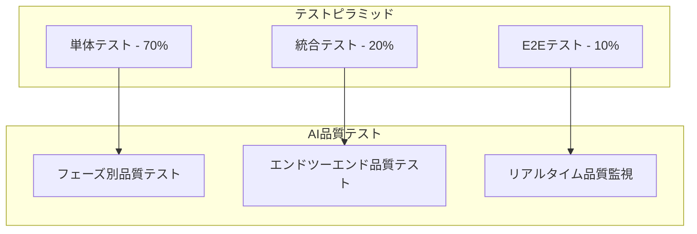

# AI漫画生成サービス テスト設計書

**文書管理情報**
- 文書ID: TEST-DOC-001
- 作成日: 2025-01-20
- 版数: 1.0
- 承認者: 根岸祐樹
- 関連文書: SYS-DOC-001（システム設計書）、SEC-DOC-001（セキュリティ設計書）

## 目次

- [1. テスト概要](#1-テスト概要)
  - [1.1 テスト戦略](#11-テスト戦略)
  - [1.2 品質目標](#12-品質目標)
- [2. AI品質保証設計](#2-ai品質保証設計)
  - [2.1 7フェーズ品質ゲート](#21-7フェーズ品質ゲート)
  - [2.2 品質スコア算出](#22-品質スコア算出)
  - [2.3 自動リトライ機構](#23-自動リトライ機構)
- [3. 自動テスト設計](#3-自動テスト設計)
  - [3.1 単体テスト](#31-単体テスト)
  - [3.2 統合テスト](#32-統合テスト)
  - [3.3 E2Eテスト](#33-e2eテスト)
- [4. パフォーマンステスト設計](#4-パフォーマンステスト設計)
  - [4.1 負荷テスト](#41-負荷テスト)
  - [4.2 レスポンス時間測定](#42-レスポンス時間測定)
  - [4.3 ボトルネック特定](#43-ボトルネック特定)
- [5. AI出力品質テスト設計](#5-ai出力品質テスト設計)
  - [5.1 画像生成品質](#51-画像生成品質)
  - [5.2 テキスト配置精度](#52-テキスト配置精度)
  - [5.3 視覚品質スコア](#53-視覚品質スコア)
- [6. テストデータ管理](#6-テストデータ管理)
  - [6.1 AIテストケース生成](#61-aiテストケース生成)
  - [6.2 品質フィードバックループ](#62-品質フィードバックループ)
  - [6.3 テストデータ更新戦略](#63-テストデータ更新戦略)
- [7. セキュリティテスト](#7-セキュリティテスト)
  - [7.1 著作権保護テスト](#71-著作権保護テスト)
  - [7.2 コンテンツフィルタテスト](#72-コンテンツフィルタテスト)
  - [7.3 認証・認可テスト](#73-認証認可テスト)
- [8. CI/CD統合](#8-cicd統合)
  - [8.1 テストパイプライン](#81-テストパイプライン)
  - [8.2 品質ゲート設定](#82-品質ゲート設定)
  - [8.3 デプロイメント承認](#83-デプロイメント承認)
- [9. テスト環境管理](#9-テスト環境管理)

---

## 1. テスト概要

### 1.1 テスト戦略

#### 基本方針
| 項目 | 方針 | 実装レベル |
|------|------|----------|
| 品質優先 | 85%品質スコア達成を最優先 | 基本 |
| 自動化重視 | 反復可能なテストの自動化 | 基本 |
| 効率性追求 | 最小限のテスト工数で最大効果 | 基本 |
| 継続改善 | AIによるテストケース進化 | 高度 |

#### テストピラミッド


### 1.2 品質目標

#### 品質KPI
```yaml
Quality Targets:
  Functional Quality:
    Unit Test Coverage: 80%
    Integration Test Coverage: 70%
    E2E Test Coverage: 主要フロー100%
    
  AI Quality:
    Phase Success Rate: 85% per phase
    End-to-End Success Rate: 70%
    User Satisfaction Score: 4.0/5.0
    
  Performance Quality:
    Response Time: < 100ms (API)
    Generation Time: < 10分 (standard text)
    Concurrent Users: 100 users supported
    
  Security Quality:
    Vulnerability Scan: 0 Critical issues
    Copyright Detection: 95% accuracy
    Content Filter: 95% accuracy
```

---

## 2. AI品質保証設計

### 2.1 7フェーズ品質ゲート

#### フェーズ別品質チェック
```python
class AIQualityGate:
    def __init__(self):
        self.phase_validators = {
            1: TextAnalysisValidator(),
            2: StoryStructureValidator(), 
            3: SceneDivisionValidator(),
            4: CharacterDesignValidator(),
            5: PanelLayoutValidator(),
            6: ImageGenerationValidator(),
            7: DialogPlacementValidator(),
            8: FinalIntegrationValidator()
        }
        self.quality_threshold = 0.85  # 85%
        
    async def validate_phase_output(self, phase: int, input_data: dict, output_data: dict) -> dict:
        """
        各フェーズの出力品質検証
        """
        validator = self.phase_validators[phase]
        
        # フェーズ固有の品質チェック
        quality_score = await validator.calculate_quality_score(input_data, output_data)
        
        # 共通品質チェック
        common_checks = await self.run_common_quality_checks(output_data)
        
        # 総合品質スコア算出
        total_score = (quality_score * 0.8) + (common_checks['score'] * 0.2)
        
        result = {
            'phase': phase,
            'quality_score': total_score,
            'passes_gate': total_score >= self.quality_threshold,
            'details': {
                'phase_specific_score': quality_score,
                'common_checks': common_checks,
                'recommendations': validator.get_improvement_suggestions(output_data)
            },
            'timestamp': datetime.now().isoformat()
        }
        
        # 品質ログ記録
        await self.log_quality_result(result)
        
        return result

# フェーズ1: テキスト解析の品質検証
class TextAnalysisValidator:
    async def calculate_quality_score(self, input_text: str, analysis_result: dict) -> float:
        scores = []
        
        # 1. 文章構造理解度
        structure_score = self.evaluate_structure_understanding(input_text, analysis_result)
        scores.append(structure_score)
        
        # 2. キャラクター抽出精度
        character_score = self.evaluate_character_extraction(input_text, analysis_result)
        scores.append(character_score)
        
        # 3. テーマ理解度
        theme_score = self.evaluate_theme_understanding(input_text, analysis_result)
        scores.append(theme_score)
        
        return sum(scores) / len(scores)
    
    def evaluate_structure_understanding(self, input_text: str, result: dict) -> float:
        """
        文章構造の理解度評価
        """
        expected_chapters = self.count_expected_chapters(input_text)
        detected_chapters = len(result.get('chapters', []))
        
        # 章数の一致度
        chapter_accuracy = min(1.0, detected_chapters / max(1, expected_chapters))
        
        # キーワード抽出精度
        keyword_accuracy = self.evaluate_keyword_extraction(input_text, result)
        
        return (chapter_accuracy * 0.6) + (keyword_accuracy * 0.4)

# フェーズ6: 画像生成の品質検証  
class ImageGenerationValidator:
    async def calculate_quality_score(self, scene_data: dict, generated_images: list) -> float:
        scores = []
        
        for image in generated_images:
            # 1. 画像品質（技術的）
            technical_score = await self.evaluate_technical_quality(image['url'])
            
            # 2. シーン一致度
            scene_match_score = await self.evaluate_scene_matching(scene_data, image)
            
            # 3. スタイル一貫性
            style_score = await self.evaluate_style_consistency(image)
            
            image_score = (technical_score * 0.4) + (scene_match_score * 0.4) + (style_score * 0.2)
            scores.append(image_score)
        
        return sum(scores) / len(scores) if scores else 0.0
```

### 2.2 品質スコア算出

#### 品質スコア定義
```yaml
Quality Score Calculation:
  Phase 1 (Text Analysis):
    - Structure Understanding: 40%
    - Character Extraction: 30%  
    - Theme Detection: 30%
    Target: 85%
    
  Phase 2 (Story Structure):
    - Plot Coherence: 50%
    - Pacing Quality: 30%
    - Dramatic Arc: 20%
    Target: 85%
    
  Phase 3 (Scene Division):
    - Scene Boundary Accuracy: 60%
    - Transition Quality: 40%
    Target: 85%
    
  Phase 4 (Character Design):
    - Visual Consistency: 50%
    - Character Distinctiveness: 30%
    - Style Adherence: 20%
    Target: 85%
    
  Phase 5 (Panel Layout):
    - Layout Balance: 40%
    - Reading Flow: 40%
    - Space Efficiency: 20%
    Target: 85%
    
  Phase 6 (Image Generation):
    - Technical Quality: 40%
    - Scene Matching: 40%
    - Style Consistency: 20%
    Target: 85%
    
  Phase 7 (Dialog Placement):
    - Text Readability: 50%
    - Bubble Placement: 30%
    - Font Selection: 20%
    Target: 85%
    
  Phase 8 (Final Integration):
    - Overall Coherence: 60%
    - Technical Quality: 25%
    - User Experience: 15%
    Target: 85%
```

### 2.3 自動リトライ機構

#### リトライロジック
```python
class QualityGateManager:
    def __init__(self):
        self.max_retries = 3
        self.quality_threshold = 0.85
        
    async def execute_phase_with_quality_gate(self, phase: int, input_data: dict) -> dict:
        """
        品質ゲート付きフェーズ実行
        """
        retry_count = 0
        best_result = None
        best_score = 0.0
        
        while retry_count < self.max_retries:
            try:
                # フェーズ実行
                output = await self.execute_phase(phase, input_data)
                
                # 品質検証
                quality_result = await self.validate_phase_output(phase, input_data, output)
                
                # 品質スコアチェック
                if quality_result['quality_score'] >= self.quality_threshold:
                    # 合格 - 次のフェーズへ
                    await self.log_quality_success(phase, quality_result)
                    return output
                
                # 品質不足 - 最高スコア記録
                if quality_result['quality_score'] > best_score:
                    best_result = output
                    best_score = quality_result['quality_score']
                
                retry_count += 1
                await self.log_quality_retry(phase, retry_count, quality_result)
                
            except Exception as e:
                retry_count += 1
                await self.log_phase_error(phase, retry_count, str(e))
        
        # 3回失敗後の処理
        if best_result and best_score > 0.75:  # 75%以上なら許容
            await self.log_quality_degraded_accept(phase, best_score)
            return best_result
        else:
            # 完全失敗
            raise QualityGateFailure(f"Phase {phase} failed to meet quality standards after {self.max_retries} attempts")
```

---

## 3. 自動テスト設計

### 3.1 単体テスト

#### テストカバレッジ目標
```python
# pytest設定例
import pytest
from unittest.mock import Mock, patch
import asyncio

class TestTextAnalysisService:
    """
    Phase 1: テキスト解析サービスのテスト
    """
    
    def setup_method(self):
        self.service = TextAnalysisService()
        self.mock_gemini_client = Mock()
        
    @pytest.mark.asyncio
    async def test_basic_phase1_concept(self):
        """
        基本的なテキスト解析テスト
        """
        # テストデータ
        input_text = "主人公は高校生の剣士。魔王を倒すため仲間と共に冒険に出る。"
        
        # 期待結果
        expected_result = {
            'characters': ['主人公', '魔王', '仲間'],
            'themes': ['冒険', 'ファンタジー', '成長'],
            'emotions': ['勇気', '友情', '希望']
        }
        
        # 実行
        with patch.object(self.service, 'gemini_client', self.mock_gemini_client):
            result = await self.service.analyze_text(input_text)
            
        # 検証
        assert 'characters' in result
        assert len(result['characters']) >= 2
        assert 'themes' in result
        assert result['processing_time'] < 30  # 30秒以内
    
    @pytest.mark.asyncio
    async def test_long_phase1_concept(self):
        """
        長文テキスト解析テスト（50,000文字）
        """
        long_text = "長編小説のテキスト..." * 1000  # 50KB相当
        
        result = await self.service.analyze_text(long_text)
        
        assert result['processing_time'] < 60  # 60秒以内
        assert len(result['characters']) <= 20  # キャラクター数制限
        
    @pytest.mark.asyncio  
    async def test_error_handling(self):
        """
        エラーハンドリングテスト
        """
        # 不正な入力
        with pytest.raises(ValidationError):
            await self.service.analyze_text("")
        
        # API エラー
        self.mock_gemini_client.side_effect = Exception("API Error")
        with pytest.raises(ServiceError):
            await self.service.analyze_text("テスト")

# 全フェーズ共通テストベース
class BasePhaseTest:
    """
    全フェーズ共通のテスト基底クラス
    """
    
    def test_processing_time_limit(self):
        """各フェーズの処理時間制限テスト"""
        pass
        
    def test_input_validation(self):
        """入力値検証テスト"""
        pass
        
    def test_output_format(self):
        """出力フォーマット検証テスト"""
        pass
        
    def test_error_recovery(self):
        """エラー回復テスト"""
        pass
```

### 3.2 統合テスト

#### マイクロサービス間連携テスト
```python
class TestServiceIntegration:
    """
    マイクロサービス間の統合テスト
    """
    
    @pytest.mark.asyncio
    async def test_phase_to_phase_flow(self):
        """
        フェーズ間のデータフロー テスト
        """
        # テストデータ準備
        test_request = {
            'request_id': 'test-12345',
            'text': self.get_test_text(),
            'settings': {'style': '少年漫画', 'pages': 20}
        }
        
        # Phase 1 実行
        phase1_concept_result = await self.execute_phase1_concept(test_request)
        assert phase1_concept_result['status'] == 'success'
        
        # Phase 2 実行（Phase 1の出力を入力として使用）
        phase2_character_result = await self.execute_phase2_character(phase1_concept_result['output'])
        assert phase2_character_result['status'] == 'success'
        
        # データ整合性チェック
        self.verify_data_consistency(phase1_concept_result, phase2_character_result)
    
    @pytest.mark.asyncio
    async def test_pubsub_messaging(self):
        """
        Pub/Sub メッセージング テスト
        """
        # メッセージ送信
        test_message = {
            'request_id': 'test-67890',
            'phase': 1,
            'status': 'success',
            'data': {'redis_key': 'test:67890:phase1'}
        }
        
        await self.publish_message('phase1-completed', test_message)
        
        # メッセージ受信確認
        received_message = await self.wait_for_message('phase1-completed', timeout=10)
        assert received_message['request_id'] == test_message['request_id']
    
    @pytest.mark.asyncio
    async def test_redis_data_flow(self):
        """
        Redis データフロー テスト  
        """
        # テストデータ保存
        test_data = {'test': 'data'}
        await self.redis_client.set('test:request:phase1', json.dumps(test_data))
        
        # データ取得・検証
        retrieved_data = await self.redis_client.get('test:request:phase1')
        assert json.loads(retrieved_data) == test_data
        
        # TTL確認
        ttl = await self.redis_client.ttl('test:request:phase1')
        assert ttl > 0  # TTLが設定されていること
```

### 3.3 E2Eテスト

#### HITLフィードバックテスト
```python
class TestHITLFeedback:
    """
    Human-in-the-Loop フィードバックシステムのテスト
    """
    
    @pytest.mark.asyncio
    async def test_phase_preview_generation(self):
        """
        各フェーズのプレビュー生成テスト
        """
        for phase_num in range(1, 8):
            preview_data = await self.generate_phase_preview(phase_num)
            assert preview_data['status'] == 'success'
            assert 'preview_content' in preview_data
            assert preview_data['phase'] == phase_num
    
    @pytest.mark.asyncio  
    async def test_chat_feedback_processing(self):
        """
        チャットフィードバック処理テスト
        """
        # チャットメッセージ送信
        feedback_message = {
            'request_id': 'test-123',
            'phase': 2,
            'message': 'キャラクターをもっと明るい性格にしてください',
            'message_type': 'text'
        }
        
        response = await self.send_chat_feedback(feedback_message)
        assert response['status'] == 'processed'
        assert 'parsed_intent' in response
        assert response['parsed_intent']['action'] == 'modify_character'
    
    @pytest.mark.asyncio
    async def test_feedback_timeout_handling(self):
        """
        フィードバックタイムアウト処理テスト（30分）
        """
        # タイムアウトシミュレーション
        start_time = time.time()
        result = await self.wait_for_feedback_with_timeout(
            request_id='test-456',
            phase=3,
            timeout_seconds=1  # テスト用に1秒に短縮
        )
        
        assert result['status'] == 'timeout'
        assert time.time() - start_time >= 1
    
    @pytest.mark.asyncio
    async def test_preview_version_branching(self):
        """
        プレビューバージョン分岐テスト
        """
        # オリジナルバージョン作成
        original = await self.create_preview_version('test-789', 1)
        
        # フィードバック適用で分岐
        branch1 = await self.apply_feedback_and_branch(
            original['version_id'],
            'テーマを変更'
        )
        
        # 別のフィードバックで別分岐
        branch2 = await self.apply_feedback_and_branch(
            original['version_id'],
            'ジャンルを変更'
        )
        
        assert branch1['parent_version_id'] == original['version_id']
        assert branch2['parent_version_id'] == original['version_id']
        assert branch1['version_id'] != branch2['version_id']
    
    @pytest.mark.asyncio
    async def test_websocket_realtime_updates(self):
        """
        WebSocketリアルタイム更新テスト
        """
        async with websockets.connect('ws://localhost:8000/ws') as websocket:
            # フェーズ完了メッセージ送信
            await websocket.send(json.dumps({
                'type': 'phase_complete',
                'phase': 1,
                'request_id': 'test-ws-123'
            }))
            
            # プレビュー更新受信
            response = await websocket.recv()
            data = json.loads(response)
            assert data['type'] == 'preview_ready'
            assert data['phase'] == 1
            
            # フィードバック送信
            await websocket.send(json.dumps({
                'type': 'feedback',
                'phase': 1,
                'feedback': 'もっと明るいテーマに'
            }))
            
            # 処理結果受信
            response = await websocket.recv()
            data = json.loads(response)
            assert data['type'] == 'feedback_applied'
```

#### エンドツーエンドテストシナリオ
```python
import playwright
from playwright.async_api import async_playwright

class TestEndToEndFlow:
    """
    ユーザー視点でのエンドツーエンドテスト
    """
    
    @pytest.mark.asyncio
    async def test_complete_manga_generation_flow(self):
        """
        完全な漫画生成フローのテスト
        """
        async with async_playwright() as p:
            browser = await p.chromium.launch()
            page = await browser.new_page()
            
            # 1. ランディングページアクセス
            await page.goto('https://manga-service.com')
            await page.wait_for_load_state('networkidle')
            
            # 2. ログイン
            await page.click('[data-testid="login-button"]')
            await page.fill('[data-testid="email-input"]', 'test@example.com')
            await page.fill('[data-testid="password-input"]', 'testpassword')
            await page.click('[data-testid="login-submit"]')
            
            # 3. プロンプト入力
            test_prompt = "主人公は高校生の剣士。魔王を倒すため仲間と共に冒険に出る。"
            await page.fill('[data-testid="prompt-input"]', test_prompt)
            
            # 4. スタイル選択
            await page.click('[data-testid="style-少年漫画"]')
            
            # 5. 生成開始
            await page.click('[data-testid="generate-button"]')
            
            # 6. 進捗確認
            await page.wait_for_selector('[data-testid="progress-phase1"]', timeout=30000)
            
            # 7. 完了まで待機（最大12分）
            await page.wait_for_selector('[data-testid="generation-complete"]', timeout=720000)
            
            # 8. 結果確認
            manga_pages = await page.query_selector_all('[data-testid="manga-page"]')
            assert len(manga_pages) >= 10  # 最小ページ数確認
            
            # 9. ダウンロード確認
            async with page.expect_download() as download_info:
                await page.click('[data-testid="download-button"]')
            download = await download_info.value
            assert download.suggested_filename.endswith('.pdf')
            
            await browser.close()
```

---

## 4. パフォーマンステスト設計

### 4.1 負荷テスト

#### 100同時ユーザー負荷テスト
```python
import locust
from locust import HttpUser, task, between

class MangaGenerationUser(HttpUser):
    """
    漫画生成サービスの負荷テストユーザー
    """
    wait_time = between(1, 3)  # 1-3秒のユーザー操作間隔
    
    def on_start(self):
        """テストユーザー初期化"""
        self.login()
        
    def login(self):
        """ログイン処理"""
        response = self.client.post("/api/auth/login", json={
            "email": f"test{self.user_id}@example.com",
            "password": "testpassword"
        })
        
        if response.status_code == 200:
            self.auth_token = response.json()['token']
            self.client.headers.update({
                'Authorization': f'Bearer {self.auth_token}'
            })
    
    @task(3)
    def browse_gallery(self):
        """ギャラリー閲覧（軽い処理）"""
        self.client.get("/api/manga/gallery")
    
    @task(1)  
    def generate_manga(self):
        """漫画生成（重い処理）"""
        test_prompts = [
            "高校生の主人公が魔法学校で冒険する物語",
            "未来の宇宙で戦うロボット漫画",
            "日常系コメディ漫画の物語"
        ]
        
        response = self.client.post("/api/manga/generate", json={
            "text": self.random.choice(test_prompts),
            "style": "少年漫画",
            "pages": 20
        })
        
        if response.status_code == 202:  # 非同期処理開始
            request_id = response.json()['request_id']
            
            # 完了まで待機（ポーリング）
            self.wait_for_completion(request_id)
    
    def wait_for_completion(self, request_id: str):
        """生成完了まで待機"""
        import time
        start_time = time.time()
        
        while time.time() - start_time < 720:  # 12分タイムアウト
            response = self.client.get(f"/api/manga/status/{request_id}")
            
            if response.status_code == 200:
                status = response.json()['status']
                if status == 'completed':
                    break
                elif status == 'failed':
                    break
            
            time.sleep(30)  # 30秒間隔でポーリング

# 負荷テスト実行設定
class LoadTestConfig:
    users = 100           # 同時ユーザー数
    spawn_rate = 10       # 10ユーザー/秒で増加
    duration = "10m"      # 10分間実行
    
    performance_targets = {
        'api_response_time_95th': 2000,  # 95%ile < 2秒
        'manga_generation_time': 600,    # 平均10分以内
        'error_rate': 0.01,              # エラー率1%以下
        'throughput': 50                 # 50リクエスト/分
    }
```

### 4.2 レスポンス時間測定

#### パフォーマンス監視
```python
class PerformanceMonitor:
    def __init__(self):
        self.metrics_collector = MetricsCollector()
        
    async def measure_api_performance(self, endpoint: str, payload: dict) -> dict:
        """
        API パフォーマンス測定
        """
        start_time = time.time()
        
        try:
            response = await self.make_api_request(endpoint, payload)
            end_time = time.time()
            
            metrics = {
                'endpoint': endpoint,
                'response_time': end_time - start_time,
                'status_code': response.status_code,
                'payload_size': len(json.dumps(payload)),
                'response_size': len(response.content),
                'timestamp': datetime.now().isoformat()
            }
            
            # メトリクス記録
            await self.metrics_collector.record_api_metrics(metrics)
            
            return metrics
            
        except Exception as e:
            await self.metrics_collector.record_api_error(endpoint, str(e))
            raise

# パフォーマンステストスイート
performance_test_cases = [
    {
        'name': 'login_performance',
        'endpoint': '/api/auth/login',
        'target_time': 0.5,  # 500ms以内
        'concurrent_users': 50
    },
    {
        'name': 'gallery_load_performance', 
        'endpoint': '/api/manga/gallery',
        'target_time': 1.0,  # 1秒以内
        'concurrent_users': 100
    },
    {
        'name': 'generation_start_performance',
        'endpoint': '/api/manga/generate',
        'target_time': 2.0,  # 2秒以内（非同期開始）
        'concurrent_users': 20
    }
]
```

### 4.3 ボトルネック特定

#### パフォーマンス分析
```python
class BottleneckAnalyzer:
    def __init__(self):
        self.profiler = ProfilerManager()
        
    async def analyze_phase_performance(self, phase: int) -> dict:
        """
        フェーズ別パフォーマンス分析
        """
        # CPU・メモリ使用量測定
        resource_usage = await self.measure_resource_usage(phase)
        
        # API呼び出し時間分析
        api_timing = await self.analyze_api_timing(phase)
        
        # データベース クエリ分析
        db_performance = await self.analyze_database_queries(phase)
        
        # ボトルネック特定
        bottlenecks = self.identify_bottlenecks({
            'resource_usage': resource_usage,
            'api_timing': api_timing,
            'db_performance': db_performance
        })
        
        return {
            'phase': phase,
            'bottlenecks': bottlenecks,
            'recommendations': self.generate_optimization_recommendations(bottlenecks),
            'performance_score': self.calculate_performance_score(resource_usage, api_timing)
        }
    
    def identify_bottlenecks(self, metrics: dict) -> list:
        """
        パフォーマンスボトルネック特定
        """
        bottlenecks = []
        
        # CPU使用率チェック
        if metrics['resource_usage']['cpu_percent'] > 80:
            bottlenecks.append({
                'type': 'cpu_bottleneck',
                'severity': 'high',
                'value': metrics['resource_usage']['cpu_percent']
            })
        
        # メモリ使用率チェック
        if metrics['resource_usage']['memory_percent'] > 85:
            bottlenecks.append({
                'type': 'memory_bottleneck',
                'severity': 'high', 
                'value': metrics['resource_usage']['memory_percent']
            })
        
        # API応答時間チェック
        if metrics['api_timing']['avg_response_time'] > 30:
            bottlenecks.append({
                'type': 'api_latency',
                'severity': 'medium',
                'value': metrics['api_timing']['avg_response_time']
            })
        
        return bottlenecks
```

---

## 5. AI出力品質テスト設計

### 5.1 画像生成品質

#### 画像品質評価システム
```python
class ImageQualityTester:
    def __init__(self):
        self.quality_models = self.load_quality_models()
        
    async def evaluate_image_quality(self, image_url: str, scene_context: dict) -> dict:
        """
        生成画像の品質評価
        """
        # 1. 技術的品質評価
        technical_score = await self.evaluate_technical_quality(image_url)
        
        # 2. シーン一致度評価
        scene_score = await self.evaluate_scene_matching(image_url, scene_context)
        
        # 3. スタイル一貫性評価
        style_score = await self.evaluate_style_consistency(image_url)
        
        overall_score = (technical_score * 0.4) + (scene_score * 0.4) + (style_score * 0.2)
        
        return {
            'overall_score': overall_score,
            'technical_score': technical_score,
            'scene_score': scene_score,
            'style_score': style_score,
            'passes_quality_gate': overall_score >= 0.85,
            'recommendations': self.generate_improvement_suggestions(
                technical_score, scene_score, style_score
            )
        }
    
    async def evaluate_technical_quality(self, image_url: str) -> float:
        """
        技術的画像品質評価
        """
        from PIL import Image
        import numpy as np
        
        # 画像ダウンロード・解析
        image = await self.download_image(image_url)
        
        scores = []
        
        # 解像度チェック
        width, height = image.size
        resolution_score = min(1.0, (width * height) / (1024 * 1024))  # 1MP基準
        scores.append(resolution_score)
        
        # シャープネス評価（ラプラシアン分散）
        gray_image = image.convert('L')
        laplacian_var = cv2.Laplacian(np.array(gray_image), cv2.CV_64F).var()
        sharpness_score = min(1.0, laplacian_var / 1000)  # 閾値調整
        scores.append(sharpness_score)
        
        # 色彩バランス
        color_score = self.evaluate_color_balance(image)
        scores.append(color_score)
        
        return sum(scores) / len(scores)
```

### 5.2 テキスト配置精度

#### セリフ配置品質テスト
```python
class DialogPlacementTester:
    async def test_text_readability(self, manga_page: dict) -> dict:
        """
        テキスト可読性テスト
        """
        scores = []
        
        for dialog in manga_page['dialogs']:
            # 1. フォントサイズ適切性
            font_score = self.evaluate_font_size(dialog)
            
            # 2. 吹き出し配置
            bubble_score = self.evaluate_bubble_placement(dialog, manga_page['layout'])
            
            # 3. 背景とのコントラスト
            contrast_score = self.evaluate_text_contrast(dialog, manga_page['background'])
            
            dialog_score = (font_score + bubble_score + contrast_score) / 3
            scores.append(dialog_score)
        
        return {
            'average_readability': sum(scores) / len(scores) if scores else 0,
            'readability_distribution': scores,
            'passes_readability_test': all(score >= 0.8 for score in scores)
        }
    
    def evaluate_font_size(self, dialog: dict) -> float:
        """
        フォントサイズ適切性評価
        """
        font_size = dialog['font_size']
        text_length = len(dialog['text'])
        bubble_area = dialog['bubble_area']
        
        # 面積あたりの文字サイズ適切性
        text_density = text_length / bubble_area
        optimal_font_size = self.calculate_optimal_font_size(text_density)
        
        size_difference = abs(font_size - optimal_font_size) / optimal_font_size
        return max(0, 1.0 - size_difference)
```

### 5.3 視覚品質スコア

#### 総合視覚品質評価
```python
class VisualQualityScorer:
    def __init__(self):
        self.quality_weights = {
            'composition': 0.3,      # 構図
            'color_harmony': 0.2,    # 色彩調和
            'detail_quality': 0.2,   # 詳細度
            'style_consistency': 0.3  # スタイル一貫性
        }
    
    async def calculate_manga_quality_score(self, manga_pages: list) -> dict:
        """
        漫画全体の視覚品質スコア算出
        """
        page_scores = []
        
        for page in manga_pages:
            page_score = await self.evaluate_page_quality(page)
            page_scores.append(page_score)
        
        # 全体スコア計算
        overall_score = sum(page_scores) / len(page_scores)
        
        # 一貫性スコア
        consistency_score = self.calculate_consistency_across_pages(manga_pages)
        
        # 最終品質スコア
        final_score = (overall_score * 0.8) + (consistency_score * 0.2)
        
        return {
            'overall_quality_score': final_score,
            'page_scores': page_scores,
            'consistency_score': consistency_score,
            'passes_quality_threshold': final_score >= 0.85,
            'quality_breakdown': self.analyze_quality_components(manga_pages)
        }
```

---

## 6. テストデータ管理

### 6.1 AIテストケース生成

#### 自動テストケース生成システム
```python
class AITestCaseGenerator:
    def __init__(self):
        self.gemini_client = self.initialize_gemini_client()
        self.test_case_templates = self.load_templates()
        
    async def generate_test_scenarios(self, count: int = 50) -> list:
        """
        AIによるテストシナリオ自動生成
        """
        generated_scenarios = []
        
        for category in ['adventure', 'romance', 'comedy', 'action', 'slice_of_life']:
            category_scenarios = await self.generate_category_scenarios(category, count // 5)
            generated_scenarios.extend(category_scenarios)
        
        # 品質検証
        validated_scenarios = await self.validate_generated_scenarios(generated_scenarios)
        
        return validated_scenarios
    
    async def generate_category_scenarios(self, category: str, count: int) -> list:
        """
        カテゴリ別テストシナリオ生成
        """
        prompt = f"""
        漫画の{category}ジャンルのテスト用あらすじを{count}個生成してください。
        
        要件:
        - 各あらすじは100-500文字
        - 多様なキャラクター設定
        - 明確なストーリー構造
        - テスト用途に適した内容
        
        形式:
        1. [タイトル]: [あらすじ]
        2. [タイトル]: [あらすじ]
        ...
        """
        
        response = await self.gemini_client.generate_content(prompt)
        scenarios = self.parse_scenarios(response.text)
        
        return scenarios
    
    async def create_edge_case_tests(self) -> list:
        """
        エッジケーステスト生成
        """
        edge_cases = [
            # 極端に短いテキスト
            {"text": "主人公が戦う。", "expected_result": "error", "reason": "too_short"},
            
            # 極端に長いテキスト  
            {"text": "長編小説..." * 10000, "expected_result": "error", "reason": "too_long"},
            
            # 文字数境界値
            {"text": "a" * 49999, "expected_result": "success", "reason": "boundary_test"},
            {"text": "a" * 50001, "expected_result": "error", "reason": "boundary_test"},
            
            # 特殊文字
            {"text": "主人公は🗾で🏯を⚔️で守る", "expected_result": "success", "reason": "emoji_test"},
            
            # 著作権境界ケース
            {"text": "主人公の名前はナルトです", "expected_result": "error", "reason": "copyright"},
            {"text": "忍者の物語", "expected_result": "success", "reason": "generic_term"}
        ]
        
        return edge_cases
```

### 6.2 品質フィードバックループ

#### 継続的品質改善システム
```python
class QualityFeedbackLoop:
    def __init__(self):
        self.quality_history = QualityHistoryManager()
        self.improvement_engine = QualityImprovementEngine()
        
    async def collect_user_feedback(self, manga_id: str, user_rating: dict):
        """
        ユーザー評価の収集
        """
        feedback_data = {
            'manga_id': manga_id,
            'user_id': user_rating['user_id'],
            'overall_rating': user_rating['rating'],  # 1-5
            'specific_feedback': {
                'story_quality': user_rating.get('story', 3),
                'art_quality': user_rating.get('art', 3),
                'phase2_character': user_rating.get('characters', 3),
                'layout_quality': user_rating.get('layout', 3)
            },
            'comments': user_rating.get('comments', ''),
            'timestamp': datetime.now().isoformat()
        }
        
        # フィードバック保存
        await self.quality_history.save_feedback(feedback_data)
        
        # 低評価の場合、詳細分析
        if user_rating['rating'] < 3:
            await self.analyze_low_rating(manga_id, feedback_data)
    
    async def analyze_quality_trends(self) -> dict:
        """
        品質トレンド分析
        """
        # 過去30日の品質データ取得
        recent_quality = await self.quality_history.get_recent_quality_data(30)
        
        # トレンド分析
        trends = {
            'average_quality_trend': self.calculate_quality_trend(recent_quality),
            'phase_performance_trends': self.analyze_phase_trends(recent_quality),
            'user_satisfaction_trend': self.calculate_satisfaction_trend(recent_quality),
            'improvement_opportunities': self.identify_improvement_areas(recent_quality)
        }
        
        return trends
    
    async def update_quality_models(self):
        """
        品質評価モデルの自動更新
        """
        # 過去の評価データから学習
        training_data = await self.quality_history.get_training_data()
        
        # 品質予測モデル更新
        updated_models = await self.improvement_engine.retrain_quality_models(training_data)
        
        # A/B テストでモデル性能比較
        ab_test_results = await self.run_quality_model_ab_test(updated_models)
        
        # 優秀なモデルをデプロイ
        if ab_test_results['new_model_better']:
            await self.deploy_updated_quality_models(updated_models)
```

### 6.3 テストデータ更新戦略

#### 動的テストスイート管理
```python
class DynamicTestSuite:
    def __init__(self):
        self.test_generator = AITestCaseGenerator()
        self.quality_analyzer = QualityFeedbackLoop()
        
    async def update_test_suite_weekly(self):
        """
        週次でテストスイートを更新
        """
        # 1. 品質トレンド分析
        quality_trends = await self.quality_analyzer.analyze_quality_trends()
        
        # 2. 弱点領域特定
        weak_areas = quality_trends['improvement_opportunities']
        
        # 3. 新しいテストケース生成
        new_test_cases = []
        for area in weak_areas:
            area_tests = await self.test_generator.generate_targeted_tests(area)
            new_test_cases.extend(area_tests)
        
        # 4. 古いテストケースの評価
        outdated_tests = await self.identify_outdated_tests()
        
        # 5. テストスイート更新
        await self.update_test_database(new_test_cases, outdated_tests)
        
        return {
            'added_tests': len(new_test_cases),
            'removed_tests': len(outdated_tests),
            'total_tests': await self.get_total_test_count(),
            'coverage_improvement': await self.calculate_coverage_improvement()
        }
    
    async def generate_regression_tests(self, bug_reports: list) -> list:
        """
        バグレポートからの回帰テスト生成
        """
        regression_tests = []
        
        for bug in bug_reports:
            # バグ再現テストケース生成
            test_case = await self.create_bug_reproduction_test(bug)
            
            # 修正検証テストケース生成  
            verification_test = await self.create_fix_verification_test(bug)
            
            regression_tests.extend([test_case, verification_test])
        
        return regression_tests

# テストデータベース構造
test_case_schema = {
    'test_id': 'string',
    'category': 'adventure|romance|comedy|action|slice_of_life',
    'input_text': 'string',
    'expected_output': 'dict',
    'quality_threshold': 'float',
    'created_by': 'ai|human|feedback',
    'creation_date': 'datetime',
    'last_executed': 'datetime',
    'execution_count': 'int',
    'success_rate': 'float',
    'tags': 'list[string]'
}
```

---

## 7. セキュリティテスト

### 7.1 著作権保護テスト

#### 著作権検出テストスイート
```python
class CopyrightProtectionTester:
    def __init__(self):
        self.copyright_detector = CopyrightProtection()
        self.test_cases = self.load_copyright_test_cases()
        
    async def test_copyright_detection_accuracy(self) -> dict:
        """
        著作権検出精度テスト
        """
        test_results = []
        
        for test_case in self.test_cases:
            result = await self.copyright_detector.check_input_text(test_case['input'])
            
            test_result = {
                'test_id': test_case['id'],
                'input': test_case['input'],
                'expected_violation': test_case['should_be_blocked'],
                'actual_violation': not result['is_safe'],
                'correct_detection': (test_case['should_be_blocked'] == (not result['is_safe'])),
                'confidence': result['confidence']
            }
            
            test_results.append(test_result)
        
        # 精度計算
        correct_detections = sum(1 for r in test_results if r['correct_detection'])
        accuracy = correct_detections / len(test_results)
        
        return {
            'accuracy': accuracy,
            'total_tests': len(test_results),
            'correct_detections': correct_detections,
            'false_positives': self.count_false_positives(test_results),
            'false_negatives': self.count_false_negatives(test_results),
            'passes_accuracy_target': accuracy >= 0.95
        }
    
    def load_copyright_test_cases(self) -> list:
        """
        著作権テストケース読み込み
        """
        return [
            # 明確な著作権侵害
            {'id': 'cp001', 'input': 'ルフィが海賊王になる物語', 'should_be_blocked': True},
            {'id': 'cp002', 'input': 'ナルトが火影になる', 'should_be_blocked': True},
            
            # 境界ケース
            {'id': 'cp003', 'input': '海賊の冒険物語', 'should_be_blocked': False},
            {'id': 'cp004', 'input': '忍者の成長物語', 'should_be_blocked': False},
            
            # 微妙なケース  
            {'id': 'cp005', 'input': '麦わら帽子をかぶった海賊', 'should_be_blocked': True},
            {'id': 'cp006', 'input': '帽子をかぶった海賊', 'should_be_blocked': False},
        ]
```

### 7.2 コンテンツフィルタテスト

#### 不適切コンテンツ検出テスト
```python
class ContentFilterTester:
    async def test_content_filtering_accuracy(self) -> dict:
        """
        コンテンツフィルタリング精度テスト
        """
        test_cases = [
            # 暴力的表現
            {'text': '主人公が敵を殺害する', 'should_block': True, 'category': 'violence'},
            {'text': '主人公が敵と戦う', 'should_block': False, 'category': 'violence'},
            
            # 性的表現
            {'text': 'セクシーな女性キャラクター', 'should_block': True, 'category': 'sexual'},
            {'text': '美しい女性キャラクター', 'should_block': False, 'category': 'sexual'},
            
            # 差別表現
            {'text': '敵をバカと呼ぶ', 'should_block': True, 'category': 'discrimination'},
            {'text': '敵と知恵比べをする', 'should_block': False, 'category': 'discrimination'}
        ]
        
        filter_results = []
        
        for case in test_cases:
            result = await self.content_filter.filter_input_text(case['text'])
            
            filter_results.append({
                'test_case': case,
                'filter_result': result,
                'correct_decision': (case['should_block'] == (not result['is_safe']))
            })
        
        accuracy = sum(1 for r in filter_results if r['correct_decision']) / len(filter_results)
        
        return {
            'filter_accuracy': accuracy,
            'passes_target': accuracy >= 0.95,
            'category_breakdown': self.analyze_by_category(filter_results)
        }
```

### 7.3 認証・認可テスト

#### セキュリティテストスイート
```python
class SecurityTestSuite:
    @pytest.mark.asyncio
    async def test_authentication_flow(self):
        """
        認証フローのセキュリティテスト
        """
        # 1. 正常ログインテスト
        valid_login = await self.client.post('/api/auth/login', json={
            'email': 'test@example.com', 
            'password': 'validpassword'
        })
        assert valid_login.status_code == 200
        
        # 2. 不正ログインテスト
        invalid_login = await self.client.post('/api/auth/login', json={
            'email': 'test@example.com',
            'password': 'wrongpassword'
        })
        assert invalid_login.status_code == 401
        
        # 3. レート制限テスト
        for _ in range(6):  # 5回制限を超える
            await self.client.post('/api/auth/login', json={
                'email': 'test@example.com',
                'password': 'wrongpassword'
            })
        
        rate_limited = await self.client.post('/api/auth/login', json={
            'email': 'test@example.com',
            'password': 'wrongpassword'
        })
        assert rate_limited.status_code == 429
    
    @pytest.mark.asyncio
    async def test_authorization_levels(self):
        """
        認可レベルテスト
        """
        # freeユーザーテスト
        free_token = await self.get_user_token('free')
        
        # 1回目生成（成功）
        response1 = await self.client.post('/api/manga/generate', 
            headers={'Authorization': f'Bearer {free_token}'},
            json={'text': 'テスト物語1', 'style': '少年漫画'}
        )
        assert response1.status_code == 202
        
        # 2回目生成（日次制限で拒否）
        response2 = await self.client.post('/api/manga/generate',
            headers={'Authorization': f'Bearer {free_token}'},
            json={'text': 'テスト物語2', 'style': '少年漫画'}
        )
        assert response2.status_code == 429
```

---

## 8. CI/CD統合

### 8.1 テストパイプライン

#### Cloud Build テスト設定
```yaml
# cloudbuild-test.yaml
steps:
  # 1. 依存関係インストール
  - name: 'python:3.11'
    entrypoint: 'bash'
    args:
      - '-c'
      - |
        pip install -r requirements.txt
        pip install pytest pytest-cov pytest-asyncio
    
  # 2. 単体テスト実行
  - name: 'python:3.11'
    entrypoint: 'bash'
    args:
      - '-c'
      - |
        pytest tests/unit/ \
          --cov=./ \
          --cov-report=xml \
          --cov-fail-under=80 \
          --junitxml=test-results.xml
    
  # 3. 統合テスト実行
  - name: 'python:3.11'
    entrypoint: 'bash'
    args:
      - '-c'
      - |
        pytest tests/integration/ \
          --timeout=300 \
          --junitxml=integration-results.xml
    env:
      - 'REDIS_HOST=test-redis'
      - 'DB_HOST=test-db'
    
  # 4. セキュリティテスト
  - name: 'python:3.11'
    entrypoint: 'bash'
    args:
      - '-c'
      - |
        pytest tests/security/ \
          --junitxml=security-results.xml
    
  # 5. パフォーマンステスト（軽量版）
  - name: 'python:3.11'
    entrypoint: 'bash'
    args:
      - '-c'
      - |
        locust --headless \
          --users 10 \
          --spawn-rate 2 \
          --run-time 2m \
          --host http://test-service \
          --html performance-report.html
    
  # 6. AI品質テスト
  - name: 'python:3.11'
    entrypoint: 'bash'
    args:
      - '-c'
      - |
        python tests/ai_quality/run_quality_tests.py \
          --test-suite basic \
          --output quality-report.json
    env:
      - 'GEMINI_API_KEY=${_GEMINI_TEST_KEY}'
      - 'IMAGEN_API_KEY=${_IMAGEN_TEST_KEY}'
    
  # 7. テスト結果統合
  - name: 'gcr.io/cloud-builders/gsutil'
    args:
      - 'cp'
      - '*.xml'
      - '*.html' 
      - '*.json'
      - 'gs://manga-test-results/${BUILD_ID}/'

substitutions:
  _GEMINI_TEST_KEY: projects/PROJECT_ID/secrets/gemini-test-key/versions/latest
  _IMAGEN_TEST_KEY: projects/PROJECT_ID/secrets/imagen-test-key/versions/latest

timeout: 1800s  # 30分タイムアウト
```

### 8.2 品質ゲート設定

#### デプロイメント品質ゲート
```python
class DeploymentQualityGate:
    def __init__(self):
        self.quality_requirements = {
            'unit_test_coverage': 0.80,           # 80%以上
            'integration_test_success': 1.0,     # 100%成功
            'security_test_success': 1.0,        # 100%成功
            'ai_quality_average': 0.85,          # 85%以上
            'performance_degradation': 0.20      # 20%以下の性能劣化
        }
    
    async def evaluate_deployment_readiness(self, test_results: dict) -> dict:
        """
        デプロイメント準備完了判定
        """
        gate_results = {}
        all_passed = True
        
        # 各品質ゲートをチェック
        for requirement, threshold in self.quality_requirements.items():
            actual_value = test_results.get(requirement, 0)
            
            if requirement == 'performance_degradation':
                # 性能劣化は少ない方が良い
                passed = actual_value <= threshold
            else:
                # その他は高い方が良い
                passed = actual_value >= threshold
            
            gate_results[requirement] = {
                'required': threshold,
                'actual': actual_value,
                'passed': passed
            }
            
            if not passed:
                all_passed = False
        
        return {
            'deployment_approved': all_passed,
            'gate_results': gate_results,
            'failure_reasons': [
                req for req, result in gate_results.items() 
                if not result['passed']
            ]
        }
```

### 8.3 デプロイメント承認

#### 自動・手動承認フロー
```python
class DeploymentApprovalManager:
    async def process_deployment_request(self, build_id: str, test_results: dict) -> dict:
        """
        デプロイメント承認処理
        """
        # 品質ゲート評価
        quality_gate = DeploymentQualityGate()
        gate_result = await quality_gate.evaluate_deployment_readiness(test_results)
        
        if gate_result['deployment_approved']:
            # 自動承認
            approval_result = await self.auto_approve_deployment(build_id)
        else:
            # 手動レビュー必要
            approval_result = await self.request_manual_review(build_id, gate_result)
        
        return approval_result
    
    async def auto_approve_deployment(self, build_id: str) -> dict:
        """
        自動承認処理
        """
        # Production環境へのデプロイ実行
        deployment_result = await self.trigger_production_deployment(build_id)
        
        # 承認ログ記録
        await self.log_approval_event({
            'build_id': build_id,
            'approval_type': 'automatic',
            'approver': 'system',
            'timestamp': datetime.now().isoformat()
        })
        
        return {
            'status': 'approved',
            'deployment_id': deployment_result['deployment_id'],
            'approval_type': 'automatic'
        }
    
    async def request_manual_review(self, build_id: str, gate_result: dict) -> dict:
        """
        手動レビュー要求
        """
        # 開発チームに通知
        await self.notify_review_required(build_id, gate_result['failure_reasons'])
        
        return {
            'status': 'pending_review',
            'build_id': build_id,
            'required_reviews': gate_result['failure_reasons'],
            'review_url': f'https://console.cloud.google.com/cloud-build/builds/{build_id}'
        }
```

---

## 9. テスト環境管理

### 9.1 環境構成

#### テスト環境設定
```yaml
Test Environments:
  Unit Test Environment:
    Database: SQLite (in-memory)
    Cache: Redis (mock)
    External APIs: Mock servers
    
  Integration Test Environment:  
    Database: Cloud SQL (test instance)
    Cache: Memory Store Redis (test instance)
    External APIs: Sandbox APIs
    
  E2E Test Environment:
    Database: Cloud SQL (staging replica)
    Cache: Memory Store Redis (staging)
    External APIs: Production APIs (limited quota)
    
  Performance Test Environment:
    Infrastructure: Production-like scaling
    Database: Cloud SQL (performance instance)
    Load Balancer: Enabled
    Monitoring: Full monitoring stack
```

#### テスト環境プロビジョニング
```bash
#!/bin/bash
# setup-test-environment.sh

echo "=== テスト環境セットアップ ==="

# 1. テスト用データベース作成
gcloud sql instances create manga-test-db \
  --database-version=POSTGRES_15 \
  --tier=db-f1-micro \
  --region=asia-northeast1 \
  --no-backup

# 2. テスト用Redis作成
gcloud redis instances create manga-test-redis \
  --size=1 \
  --region=asia-northeast1 \
  --redis-version=redis_7_0

# 3. テストデータ投入
psql -h $TEST_DB_HOST -U postgres -d manga_test < test_data.sql

# 4. Cloud Run テストサービスデプロイ
for phase in {1..8}; do
  gcloud run deploy test-phase${phase}-service \
    --image gcr.io/$PROJECT_ID/phase${phase}:test \
    --region asia-northeast1 \
    --no-allow-unauthenticated \
    --set-env-vars="ENVIRONMENT=test"
done

echo "=== テスト環境準備完了 ==="
```

---


---

## 改訂履歴

| 版数 | 日付 | 変更内容 | 担当者 |
|------|------|----------|--------|
| 1.0 | 2025-01-20 | 初版作成（基本品質保証＋AI自動テストケース生成） | Claude Code |

---

**文書承認**
- QAエンジニア: [署名] 日付: [日付]
- テストマネージャー: [署名] 日付: [日付]
- 品質保証責任者: [署名] 日付: [日付]