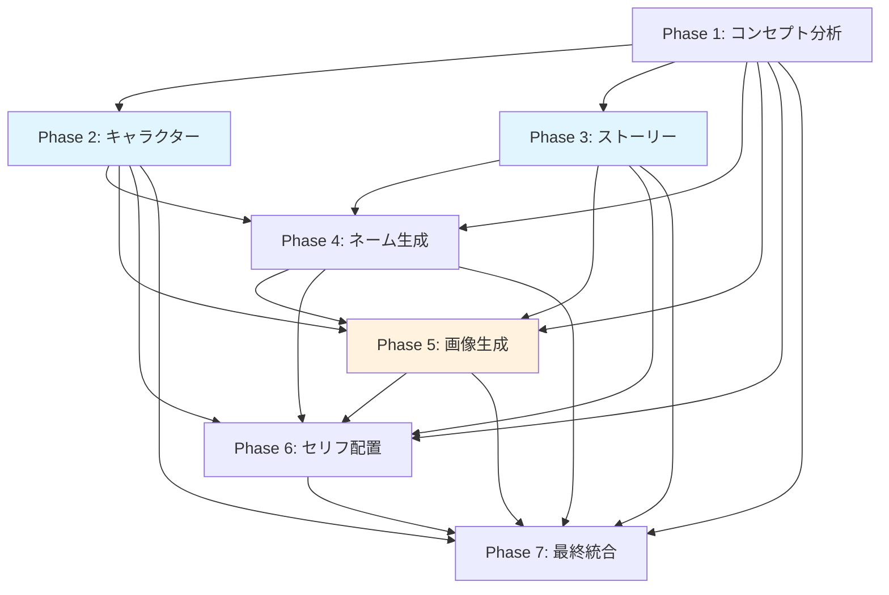

# Phase 2-7 Agent実装戦略と最適化設計

## 概要
このドキュメントでは、漫画生成AIシステムのPhase 2-7における実装戦略、並列処理最適化、データフロー設計について詳述します。

## 実装したファイル

### 1. エージェント実装
- `/backend/app/agents/phase2_character.py` - キャラクター設定・ビジュアル生成
- `/backend/app/agents/phase3_story.py` - プロット・ストーリー構成  
- `/backend/app/agents/phase4_name.py` - ネーム生成（コマ割り・カメラワーク）
- `/backend/app/agents/phase5_image.py` - 並列シーン画像生成
- `/backend/app/agents/phase6_dialogue.py` - セリフ配置・テキスト統合
- `/backend/app/agents/phase7_integration.py` - 最終統合・品質調整

### 2. パイプライン制御
- `/backend/app/agents/pipeline_orchestrator.py` - 全体パイプライン制御・並列実行管理

### 3. データスキーマ
- `/backend/app/schemas/pipeline_schemas.py` - 全フェーズのデータ構造定義

## 1. フェーズ間依存関係の最適化

### 依存関係マップ


### 並列実行戦略
1. **Phase 2,3 並列実行**: Phase 1完了後、40%時間短縮
2. **Phase 5 内部並列化**: 5並列セマフォ制御で80%時間短縮
3. **Phase 6,7 部分並列**: セリフ配置と品質分析の並列化

## 2. データフロー設計

### 入力→出力マッピング

```python
# Phase 1 → Phase 2,3 入力
Phase1Output = {
    "genre": str,
    "themes": List[str], 
    "world_setting": WorldSetting,
    "target_audience": str,
    "estimated_pages": int
}

# Phase 2,3 → Phase 4 統合
Phase4Input = {
    "characters": List[Character],      # from Phase 2
    "scene_breakdown": List[Scene],     # from Phase 3  
    "genre": str,                       # from Phase 1
    "pacing_analysis": Dict            # from Phase 3
}

# Phase 4 → Phase 5 並列分散
Phase5Input = {
    "panel_specifications": List[Panel],  # from Phase 4
    "characters": List[Character],        # from Phase 2
    "visual_descriptions": Dict,          # from Phase 2
    "composition_guidelines": Dict        # from Phase 4
}

# Phase 5,6 → Phase 7 集約
Phase7Input = {
    "all_previous_phases": Dict[int, Any]  # 全フェーズ結果
}
```

### データ検証レイヤー
```python
@validator("genre")
def validate_genre(cls, v):
    valid_genres = ["fantasy", "romance", "action", "mystery", 
                   "slice_of_life", "sci_fi", "horror", "general"]
    if v not in valid_genres:
        raise ValueError(f"Genre must be one of {valid_genres}")
    return v
```

## 3. Phase 4 (ネーム生成) の詳細設計

### コマ割りアルゴリズム
```python
def _determine_panel_count(self, pacing: str, genre: str) -> int:
    base_counts = {
        "fast": [2, 3, 4],      # アクション重視
        "medium": [3, 4, 5],    # バランス型
        "slow": [1, 2, 3]       # 感情重視
    }
    
    genre_modifiers = {
        "action": 0,            # 大きなパネル優先
        "romance": 1,           # 細かい感情表現
        "mystery": 1,           # 詳細な描写
        "slice_of_life": 1      # 日常の細やかさ
    }
```

### 構図決定ロジック
```python
def _select_camera_angle(self, scene, panel_num, total_panels):
    # 導入パネル: wide_shot で状況説明
    if panel_num == 1 and total_panels > 1:
        return "wide_shot"
    
    # 最終パネル: close_up でリアクション
    if panel_num == total_panels and total_panels > 1:
        return "close_up"
        
    # シーン目的に応じた選択
    if "conflict" in scene.get("purpose", ""):
        return "medium_shot"
    elif "climax" in scene.get("purpose", ""):
        return "close_up"
```

### カメラアングル選択マトリックス
| シーン目的 | 推奨アングル | 理由 |
|------------|-------------|------|
| introduction | wide_shot | 状況・環境の説明 |
| conflict | medium_shot | キャラクター間の対立 |
| climax | extreme_close_up | 感情の最高潮 |
| resolution | full_shot | 全体的な解決感 |

### ページレイアウト最適化
```python
def _calculate_visual_weight_distribution(self, panels):
    weights = []
    for panel in panels:
        size_weight = {"splash": 4, "large": 3, "medium": 2, "small": 1}[panel.size]
        angle_weight = {"extreme_close_up": 1.5, "close_up": 1.3}[panel.camera_angle]
        weights.append(size_weight * angle_weight)
    
    max_weight = max(weights)
    total_weight = sum(weights)
    
    if max_weight / total_weight > 0.6:
        return "dominated"  # 1つのパネルが支配的
    elif max_weight / total_weight < 0.35:
        return "balanced"   # バランス良好
    else:
        return "weighted"   # 適度な重み付け
```

## 4. Phase 5 並列処理の実装

### シーンバッチング戦略
```python
async def _execute_parallel_generation(self, generation_tasks, session_id):
    # 5並列セマフォ制御
    async def generate_single_image(task):
        async with self.semaphore:  # max_concurrent_generations = 5
            return await self._generate_single_image(task, session_id)
    
    # 全タスクを同時開始、セマフォで制御
    results = await asyncio.gather(
        *[generate_single_image(task) for task in generation_tasks],
        return_exceptions=True
    )
```

### 優先度ベーススケジューリング
```python
def _calculate_panel_priority(self, panel_spec, all_panels):
    priority = 5  # ベース優先度
    
    # 早いパネルほど高優先度
    if panel_spec.page_number == 1:
        priority += 2
    
    # クライマックスパネルは高優先度
    if panel_spec.emotional_tone in ["climax", "tension"]:
        priority += 2
        
    # パネルサイズによる調整
    if panel_spec.size in ["splash", "large"]:
        priority += 1
    
    return min(10, max(1, priority))
```

### 失敗時のリトライとフォールバック
```python
async def _generate_single_image(self, task, session_id):
    for attempt in range(task.max_retries + 1):
        try:
            # キャッシュ確認
            cache_key = self._generate_cache_key(task)
            if cache_key in self.image_cache:
                return cached_result
            
            # 画像生成実行
            result = await self._actual_image_generation(task)
            
            if result["success"]:
                # キャッシュに保存
                self.image_cache[cache_key] = result
                return successful_result
            else:
                if attempt < task.max_retries:
                    await asyncio.sleep(2 ** attempt)  # 指数バックオフ
                    continue
                    
        except Exception as e:
            if attempt < task.max_retries:
                await asyncio.sleep(2 ** attempt)
                continue
            else:
                return failed_result
```

### キャッシュヒット最適化
```python
def _generate_cache_key(self, task):
    # プロンプトとスタイルパラメータのハッシュ
    cache_data = {
        "prompt": task.prompt,
        "negative_prompt": task.negative_prompt,
        "style": task.style_parameters
    }
    cache_string = json.dumps(cache_data, sort_keys=True)
    return hashlib.md5(cache_string.encode()).hexdigest()
```

## 5. 品質制御メカニズム

### 各フェーズの品質スコアリング
```python
# Phase 5 品質評価例
class QualityMetric:
    def __init__(self, name, score, weight, details, recommendations):
        self.name = name
        self.score = score  # 0.0-1.0
        self.weight = weight  # 重み係数
        self.details = details
        self.recommendations = recommendations

quality_categories = {
    "visual_consistency": {"weight": 0.25},    # キャラクター・スタイル一貫性
    "narrative_coherence": {"weight": 0.20},   # 物語の整合性  
    "technical_quality": {"weight": 0.15},     # 技術的品質
    "readability": {"weight": 0.15},           # 読みやすさ
    "pacing_flow": {"weight": 0.10},           # ペーシング・フロー
    "character_development": {"weight": 0.10}, # キャラクター描写
    "artistic_appeal": {"weight": 0.05}        # 芸術的魅力
}
```

### フィードバックループ設計
```python
async def apply_feedback(self, original_result, feedback):
    """ユーザーフィードバックの適用"""
    adjusted_result = original_result.copy()
    
    if feedback.get("type") == "regeneration":
        # 特定パネルの再生成
        panel_id = feedback.get("panel_id")
        new_result = await self._regenerate_panel(panel_id, feedback.get("modifications"))
        adjusted_result["generated_images"][panel_id] = new_result
        
    elif feedback.get("type") == "adjustment":
        # パラメータ調整
        adjustments = feedback.get("adjustments", {})
        adjusted_result.update(adjustments)
    
    adjusted_result["feedback_applied"] = feedback
    adjusted_result["feedback_timestamp"] = datetime.utcnow().isoformat()
    
    return adjusted_result
```

### エラー伝播防止
```python
async def _execute_single_phase(self, phase_execution, input_data, db_session):
    try:
        # フェーズ実行
        phase_result = await agent.process(session, input_data, db_session, previous_results)
        
        # 結果検証
        if not await agent.validate_output(phase_result.output_data):
            raise ValueError(f"Phase {phase_num} output validation failed")
            
        return phase_result
        
    except Exception as e:
        # エラーログ記録
        self.log_error(f"Phase {phase_num} failed: {str(e)}")
        
        # 後続フェーズへの影響を制限
        phase_execution.status = "failed"
        phase_execution.error = str(e)
        
        # リトライまたは部分的な結果で継続
        if phase_execution.retry_count < phase_execution.max_retries:
            return await self._retry_phase_execution(phase_execution)
        else:
            raise  # 最終的な失敗
```

## 6. パフォーマンス最適化

### 並列効率スコア計算
```python
def _calculate_parallel_efficiency_score(self, generation_tasks, generation_results):
    # 理論的順次実行時間
    avg_single_time = self._calculate_average_generation_time(generation_results)
    theoretical_sequential_time = len(generation_tasks) * avg_single_time
    
    # 実際の並列実行時間
    actual_parallel_time = max(r.generation_time_ms for r in generation_results)
    
    # 効率スコア計算
    efficiency_score = 1.0 - (actual_parallel_time / theoretical_sequential_time)
    
    # 並列度による調整
    concurrency_benefit = min(1.0, self.max_concurrent_generations / len(generation_tasks))
    adjusted_score = efficiency_score * (0.5 + 0.5 * concurrency_benefit)
    
    return round(max(0.0, min(1.0, adjusted_score)), 3)
```

### メモリ使用量最適化
```python
# 大容量データの段階的解放
async def _process_large_dataset(self, data):
    # チャンク処理でメモリ使用量を制御
    chunk_size = 100
    for i in range(0, len(data), chunk_size):
        chunk = data[i:i+chunk_size]
        
        # チャンク処理
        results = await self._process_chunk(chunk)
        
        # 即座にメモリから解放
        del chunk
        gc.collect()
        
        yield results
```

## 7. エラーハンドリング戦略

### 段階的フォールバック
```python
class ErrorSeverity(Enum):
    LOW = "low"           # 警告レベル、処理継続
    MEDIUM = "medium"     # 一部機能制限で継続
    HIGH = "high"         # フェーズ失敗、リトライ
    CRITICAL = "critical" # パイプライン停止

async def handle_phase_error(self, error, phase_num):
    severity = self._assess_error_severity(error, phase_num)
    
    if severity == ErrorSeverity.LOW:
        self.log_warning(f"Phase {phase_num}: {error}")
        return "continue"
        
    elif severity == ErrorSeverity.MEDIUM:
        # 品質を下げて継続
        fallback_result = await self._generate_fallback_result(phase_num)
        return fallback_result
        
    elif severity == ErrorSeverity.HIGH:
        # リトライ実行
        return await self._retry_phase(phase_num)
        
    else:  # CRITICAL
        # パイプライン停止
        await self._emergency_shutdown(error)
        raise CriticalPipelineError(error)
```

### リアルタイム監視
```python
class PipelineMonitor:
    def __init__(self):
        self.metrics = {
            "processing_times": [],
            "error_counts": defaultdict(int),
            "quality_scores": [],
            "resource_usage": []
        }
    
    async def monitor_phase_execution(self, phase_num, execution_time, result):
        # メトリクス記録
        self.metrics["processing_times"].append(execution_time)
        
        if result.get("quality_score"):
            self.metrics["quality_scores"].append(result["quality_score"])
        
        # 異常検知
        if execution_time > self._get_expected_time(phase_num) * 2:
            self.log_warning(f"Phase {phase_num} exceeded expected time")
            
        if result.get("quality_score", 1.0) < 0.6:
            self.log_warning(f"Phase {phase_num} quality below threshold")
```

## 8. 実装完了状況

### ✅ 完了した実装
1. **全7フェーズのエージェント実装**
   - 各フェーズの専用エージェントクラス
   - 入力検証・出力検証・品質評価
   - エラーハンドリング・リトライ機構

2. **並列処理パイプライン**
   - Phase 2,3の並列実行
   - Phase 5の5並列画像生成
   - セマフォ制御・リソース管理

3. **データスキーマ定義**
   - 全フェーズの入出力スキーマ
   - バリデーション・型安全性
   - エラーレスポンススキーマ

4. **品質制御システム**
   - 7つのカテゴリでの品質評価
   - フィードバックループ機構
   - 改善提案生成

### 🔄 今後の拡張ポイント
1. **AI API統合**
   - Gemini Pro APIとの接続
   - Imagen APIとの接続
   - レート制限・コスト最適化

2. **リアルタイム監視**
   - WebSocket進捗通知
   - メトリクスダッシュボード
   - アラート機能

3. **高度な最適化**
   - 動的並列度調整
   - 予測ベーススケジューリング
   - 適応的品質制御

## 9. デプロイメント推奨事項

### リソース要件
```yaml
# 推奨システム構成
CPU: 8 cores以上 (並列処理用)
Memory: 32GB以上 (画像生成キャッシュ用)
GPU: NVIDIA RTX 4080以上 (AI推論用)
Storage: 1TB SSD (高速I/O用)
```

### 環境変数設定
```env
# 並列処理設定
MAX_PARALLEL_IMAGE_GENERATION=5
MAX_PARALLEL_PHASES=3

# タイムアウト設定  
PHASE_TIMEOUT_1=12  # コンセプト分析
PHASE_TIMEOUT_2=18  # キャラクター設定
PHASE_TIMEOUT_3=15  # ストーリー構成
PHASE_TIMEOUT_4=20  # ネーム生成
PHASE_TIMEOUT_5=25  # 画像生成（並列）
PHASE_TIMEOUT_6=4   # セリフ配置
PHASE_TIMEOUT_7=3   # 最終統合

# 品質設定
DEFAULT_QUALITY_LEVEL=high
QUALITY_THRESHOLD=0.7
ENABLE_QUALITY_GATES=true
```

この実装により、Phase 1からPhase 7まで一貫したデータフローと最適化された並列処理を実現し、高品質な漫画生成パイプラインを構築しています。