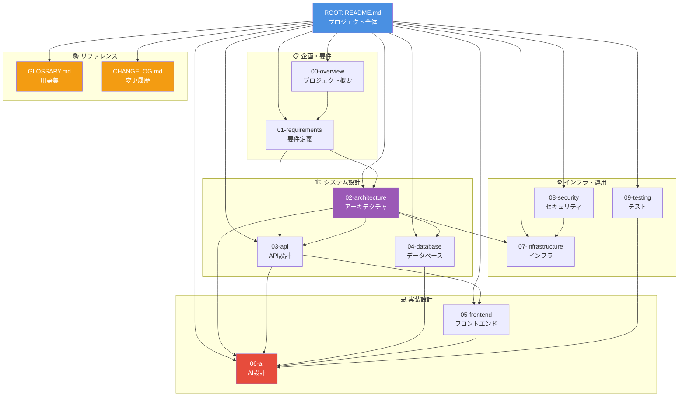
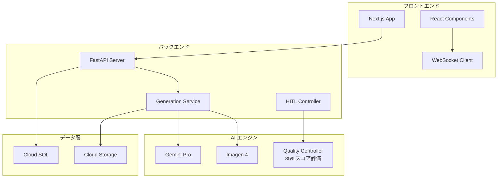

# AI漫画生成サービス 設計ドキュメント

> **TL;DR**: AI漫画生成サービスの全設計ドキュメント（55ファイル）のルートディレクトリ。7フェーズHITLシステムによる段階的漫画制作の設計書群。**YAMLベース設計書形式**により、実装コードを含まない純粋な設計情報として一意に実装可能な仕様を記載。要件定義→アーキテクチャ→API→データベース→フロントエンド→AI→インフラ→セキュリティ→テストの順に構成。

**プロジェクト**: AI Manga Generator with HITL (Human-in-the-Loop)
**フェーズ**: 設計・開発フェーズ
**最終更新**: 2025-09-30

## 📚 ドキュメント構成

このディレクトリには、AI漫画生成サービスの全設計ドキュメントが体系的に整理されています。

### 🗂️ ディレクトリ構造

| ディレクトリ | 内容 | 形式 | 主要ファイル |
|-------------|------|------|-------------|
| **[00-overview](./00-overview/)** | プロジェクト概要・市場調査 | Markdown | 企画書、市場分析、競合調査 |
| **[01-requirements](./01-requirements/)** | 要件定義 | Markdown | ビジネス要件、機能要件、非機能要件 |
| **[02-architecture](./02-architecture/)** | システム設計 | **YAML設計** | アーキテクチャ概要、コンポーネント設計 |
| **[03-api](./03-api/)** | API設計 | Markdown | エンドポイント仕様、スキーマ定義 |
| **[04-database](./04-database/)** | データベース設計 | **YAML設計** | スキーマ設計、マイグレーション戦略 |
| **[05-frontend](./05-frontend/)** | フロントエンド設計 | **YAML設計** | UI/UX設計、画面設計、コンポーネント設計 |
| **[06-ai](./06-ai/)** | AI設計 | **YAML設計** | HITL システム、7フェーズ設計、プロンプト工学 |
| **[07-infrastructure](./07-infrastructure/)** | インフラ設計 | Markdown | クラウド設計、デプロイメント、監視 |
| **[08-security](./08-security/)** | セキュリティ設計 | Markdown | 認証・認可、データ保護、コンプライアンス |
| **[09-testing](./09-testing/)** | テスト設計 | Markdown | テスト戦略、品質保証、AI品質ゲート |

### 📊 文書間関係マップ



### 🔄 文書依存関係

| 基盤文書 | 依存文書 | 関係 |
|---------|---------|------|
| **00-overview** | 01-requirements | 要件の背景情報 |
| **01-requirements** | 02-architecture, 03-api | 実装要件の基礎 |
| **02-architecture** | 03-api, 04-database, 06-ai, 07-infrastructure | システム設計の基盤 |
| **06-ai** | 03-api, 04-database, 09-testing | AIシステムの中核 |
| **03-api** | 05-frontend, 06-ai | インターフェース定義 |
| **07-infrastructure** | 全カテゴリ | 実行環境提供 |
| **08-security** | 03-api, 07-infrastructure | セキュリティ要件 |

## 🎯 プロジェクト概要

### 主要機能
- **AI漫画生成**: 7フェーズによる段階的漫画制作
  - Phase 1: コンセプト・世界観分析
  - Phase 2: キャラクター設計
  - Phase 3: ストーリー構造設計
  - Phase 4: ネーム構成生成
  - Phase 5: ビジュアル生成
  - Phase 6: 対話配置最適化
  - Phase 7: 品質統合・調整
- **HITL システム**: Human-in-the-Loop による品質制御
- **リアルタイム処理**: プログレッシブエンハンスメント戦略
- **品質保証**: 85%品質スコア達成システム

### 技術スタック
- **フロントエンド**: Next.js, React, TypeScript
- **バックエンド**: Python, FastAPI, Cloud Run
- **データベース**: Cloud SQL (PostgreSQL)
- **AI**: Gemini Pro, Imagen 4
- **インフラ**: Google Cloud Platform

## 🚀 アーキテクチャハイライト



## 📖 利用ガイド

### 設計書を読む順序（推奨）

1. **[プロジェクト概要](./00-overview/)** - 全体理解
2. **[要件定義](./01-requirements/)** - 機能仕様理解
3. **[システム設計](./02-architecture/)** - アーキテクチャ理解
4. **[AI設計](./06-ai/)** - 核心機能理解
5. **[API設計](./03-api/)** - インターフェース理解
6. **[フロントエンド設計](./05-frontend/)** - UI/UX理解
7. **[インフラ設計](./07-infrastructure/)** - デプロイメント理解
8. **[セキュリティ設計](./08-security/)** - セキュリティ要件理解
9. **[テスト設計](./09-testing/)** - 品質保証理解

### 開発者向けクイックスタート

| 役割 | 主要参照ドキュメント |
|------|---------------------|
| **フロントエンド開発者** | [05-frontend](./05-frontend/), [03-api](./03-api/) |
| **バックエンド開発者** | [02-architecture](./02-architecture/), [03-api](./03-api/), [04-database](./04-database/) |
| **AI エンジニア** | [06-ai](./06-ai/), [09-testing](./09-testing/) |
| **DevOps エンジニア** | [07-infrastructure](./07-infrastructure/), [08-security](./08-security/) |
| **QA エンジニア** | [09-testing](./09-testing/), [01-requirements](./01-requirements/) |

### タスクベースナビゲーション

#### 🆕 新機能追加時
1. **[機能要件](./01-requirements/functional-requirements.md)** - 既存機能パターンの確認
2. **[AI設計](./06-ai/)** - 7フェーズへの組み込み方法
3. **[コンポーネント設計](./02-architecture/component-design.md)** - サービス構造の理解
4. **[API設計](./03-api/)** - エンドポイント追加方法
5. **[テスト設計](./09-testing/)** - 品質保証アプローチ

#### 🐛 バグ修正時
1. **[システム設計](./02-architecture/system-overview.md)** - 全体アーキテクチャの把握
2. **[データフロー](./02-architecture/data-flow.md)** - データ処理の流れ確認
3. **[品質制御](./06-ai/quality-control.md)** - 品質ゲートの仕組み
4. **[テスト戦略](./09-testing/test-strategy.md)** - テストカバレッジ確認

#### ⚙️ インフラ変更時
1. **[インフラ概要](./07-infrastructure/infrastructure-overview.md)** - 現状構成の理解
2. **[Cloud Services](./07-infrastructure/cloud-services.md)** - GCPサービス詳細
3. **[デプロイメント](./07-infrastructure/deployment.md)** - デプロイ手順
4. **[モニタリング](./07-infrastructure/monitoring.md)** - 監視設定

#### 🔒 セキュリティ対応時
1. **[セキュリティ設計](./08-security/)** - セキュリティ要件の確認
2. **[認証システム](./08-security/authentication.md)** - 認証・認可の仕組み
3. **[API設計](./03-api/)** - API セキュリティ仕様

#### 🎨 UI/UX改善時
1. **[フロントエンド設計](./05-frontend/)** - デザインシステムの理解
2. **[ユーザージャーニー](./05-frontend/user-journey.md)** - ユーザー体験の全体像
3. **[HITL コンポーネント](./05-frontend/components/hitl-components.md)** - インタラクティブUI

## 📐 設計書形式について

### YAMLベース設計書の採用理由

本プロジェクトの設計書（02-architecture, 04-database, 05-frontend, 06-ai）は、**実装コードを含まないYAMLベース設計書形式**を採用しています。

#### 設計原則
- **実装コード排除**: Python、TypeScript、SQL、HTMLなどの実装コードは記載しない
- **設計情報の明確化**: 「何を実装するか」の設計情報のみを記述
- **一意な実装可能性**: 設計情報から一意に実装できる詳細度を確保
- **処理フローの可視化**: IF/WHILE/FOR/RETURN等の制御構文を用いた処理フロー記述

#### YAMLフォーマット構造
```yaml
クラス設計: [ClassName]
  目的: [purpose]
  構成要素: [components]
  主要メソッド:
    [method_name]:
      説明: [description]
      処理フロー:
        1. [step with IF-THEN-ELIF-ELSE logic]
        2. [FOR/WHILE loops with detailed iteration]
      計算式: [formulas with examples]
  パフォーマンス要件: [performance targets]
```

#### メリット
1. **保守性向上**: 設計と実装の分離により、設計変更が容易
2. **可読性向上**: 実装言語に依存しない統一フォーマット
3. **実装柔軟性**: 言語・フレームワーク変更時も設計書は不変
4. **品質担保**: 設計情報の完全性を事前検証可能

## 🔗 重要な設計決定

### 品質保証戦略
- **85%品質スコア閾値**: 各フェーズで85%以上の品質スコア達成
  - フェーズ固有スコア（80%）+ 共通チェック（20%）の組み合わせ
  - リアルタイム品質スコア算出とログ記録
  - 品質改善提案機能で継続的改善
- **3回リトライ機構**: 品質未達時の自動再生成システム
  - 各リトライで最高品質結果を保持
  - 75%以上のスコアで品質低下許容モード
- **プログレッシブエンハンスメント**: 段階的品質向上アプローチ

### アーキテクチャ原則
- **Google Cloud ネイティブ**: GCP標準サービス活用
- **マイクロサービス設計**: Cloud Run による疎結合アーキテクチャ
- **リアルタイム体験**: WebSocket による双方向通信
- **スケーラブル設計**: オートスケーリング対応

### HITL 統合
- **リアルタイムフィードバック**: 各フェーズでの人間介入
- **品質評価システム**: AI生成物の定量的評価
- **学習ループ**: フィードバックによる継続的改善

## 📝 文書管理情報

- **文書体系**: 階層構造による系統的管理
- **版数管理**: 各文書での版数・改訂履歴管理
- **相互参照**: ドキュメント間のリンク・関連性管理
- **メタデータ**: 作成者・承認者・関連文書の明記

---

**🔄 最終更新**: 2025-10-04
**📊 総ドキュメント数**: 55 ファイル
**📐 設計書形式**: YAMLベース設計（実装コード非含有）
**🏗️ プロジェクトフェーズ**: 設計完了・開発進行中

---

## 📝 変換履歴

### 2025-10-04: YAMLベース設計書への変換完了
- **変換対象**: 25ファイル（02-architecture, 04-database, 05-frontend, 06-ai）
- **変換方針**: 実装コード（Python/TypeScript/SQL/HTML）をYAML設計仕様に変換
- **変換比率**: 平均1.3-1.5倍の詳細化（設計情報の明確化による）
- **品質担保**: 処理フロー・計算式・パフォーマンス要件を含む一意実装可能な設計