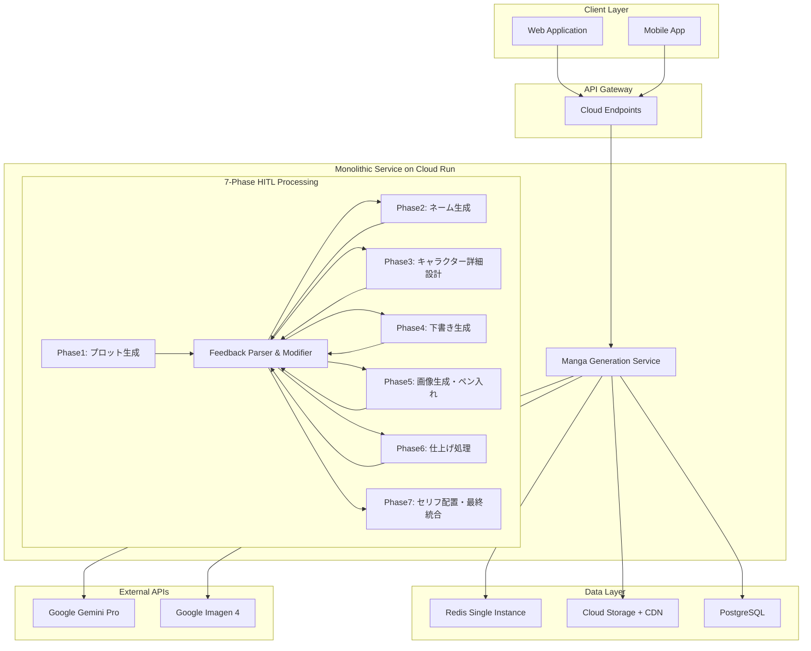
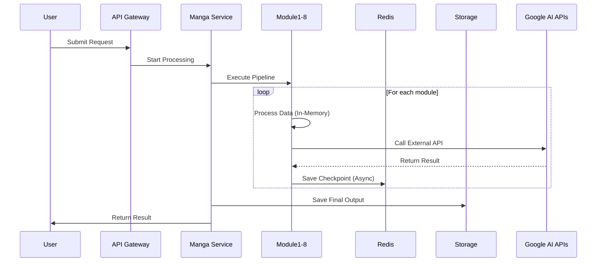

# AI漫画生成サービス システム設計書

**文書管理情報**
- 文書ID: SYS-DOC-001
- 作成日: 2025-01-20
- 版数: 2.0
- 承認者: 根岸祐樹
- 関連文書: REQ-DOC-001（要件定義書）

## 目次

- [1. システム概要](#1-システム概要)
  - [1.1 設計方針](#11-設計方針)
  - [1.2 アーキテクチャ概要](#12-アーキテクチャ概要)
- [2. モノリシックサービス設計](#2-モノリシックサービス設計)
  - [2.1 サービス構成](#21-サービス構成)
  - [2.2 モジュール間連携](#22-モジュール間連携)
  - [2.3 データフロー](#23-データフロー)
- [3. インフラストラクチャ設計](#3-インフラストラクチャ設計)
  - [3.1 Cloud Run構成](#31-cloud-run構成)
  - [3.2 ストレージ設計](#32-ストレージ設計)
  - [3.3 Redis単一インスタンス設計](#33-redis単一インスタンス設計)
- [4. 外部API統合設計](#4-外部api統合設計)
  - [4.1 Google AI API接続](#41-google-ai-api接続)
  - [4.2 レート制限管理](#42-レート制限管理)
- [5. 信頼性設計](#5-信頼性設計)
  - [5.1 エラーハンドリング](#51-エラーハンドリング)
  - [5.2 リトライ戦略](#52-リトライ戦略)
- [6. セキュリティ設計](#6-セキュリティ設計)
- [7. パフォーマンス設計](#7-パフォーマンス設計)

---

## 1. システム概要

### 1.1 設計方針

本システムは以下の設計原則に基づいて構築される：

| 原則 | 内容 |
|------|------|
| モノリシック設計 | 7フェーズを単一サービス内のモジュールとして実装（HITL対応） |
| サーバーレス優先 | Google Cloud Runによる運用負荷削減 |
| インメモリ処理 | メモリ内データ受け渡し+段階的フィードバック処理 |
| 簡素化設計 | Redis単一インスタンス、コスト効率重視 |
| 自動復旧 | 3回までの自動リトライ機構 |
| 人間参加型 | 各フェーズでの自然言語フィードバック統合 |

### 1.2 アーキテクチャ概要



---

## 2. モノリシックサービス設計

### 2.1 サービス構成

#### 2.1.1 統合サービス構成

**サービスID**: SVC-MANGA-GENERATION  
**責務**: 漫画生成の全フェーズ処理  
**実装言語**: Python 3.11  
**コンテナサイズ**: 8 vCPU, 32GB RAM  

**入力**:
```json
{
  "request_id": "string",
  "text": "string",
  "ai_auto_settings": true,
  "feedback_mode": {
    "enabled": true,
    "timeout_seconds": 1800
  }
}
```

**出力**:
```json
{
  "request_id": "string",
  "manga_result": {
    "story_structure": {},
    "characters": [],
    "scenes": [],
    "final_manga_url": "string"
  },
  "phase_results": [
    {
      "phase": 1,
      "content": {},
      "preview_url": "string",
      "feedback_applied": []
    }
  ],
  "processing_time": "number"
}
```

**処理時間制限**: 600秒（10分）

#### 2.1.2 処理Agent構成

| Agent名 | 責務 | 処理時間目安 | フィードバック対象 |
|------------|------|------------|------------------|
| Phase1: コンセプト・世界観分析Agent | コンセプト・テーマ・ジャンル・ターゲット読者層・世界観決定 | 10秒 | コンセプト・ジャンル・世界観調整 |
| Phase2: キャラクター設定・簡易ビジュアル生成Agent | キャラクター詳細設定・簡易ビジュアル生成（1-2枚の参考画像） | 12秒 | キャラ設定・ビジュアル調整 |
| Phase3: プロット・ストーリー構成Agent | 詳細なプロット・ストーリー構成作成 | 8秒 | プロット・シーン構成調整 |
| Phase4: ネーム生成Agent | コマ割り設計・シーン詳細指示・カメラアングル | 12秒 | コマ割り・構図・演出調整 |
| Phase5: シーン画像生成Agent | コマごとのシーン画像並列生成（Imagen 4） | 40秒 | 画像品質・スタイル調整 |
| Phase6: セリフ配置Agent | 吹き出し・セリフ・効果音の配置 | 6秒 | セリフ・効果音配置調整 |
| Phase7: 最終統合・品質調整Agent | 最終品質チェック・統合処理・出力 | 9秒 | 最終調整・フォーマット選択 |

**Agent間データ受け渡し**:
```python
class MangaGenerationService:
    def __init__(self):
        # Core AI Agents
        self.agents = {
            'concept_analysis': ConceptAnalysisAgent(),  # Phase 1: コンセプト・世界観分析
            'character_visual': CharacterVisualAgent(),  # Phase 2: キャラクター設定・簡易ビジュアル生成
            'plot_structure': PlotStructureAgent(),  # Phase 3: プロット・ストーリー構成
            'name_generation': NameGenerationAgent(),  # Phase 4: ネーム生成
            'scene_generation': SceneGenerationAgent(),  # Phase 5: シーン画像生成
            'text_placement': TextPlacementAgent(),  # Phase 6: セリフ配置
            'final_integration': FinalIntegrationAgent()  # Phase 7: 最終統合・品質調整
        }
        
        # Preview System Integration
        self.preview_service = PreviewService()
        self.version_manager = PreviewVersionManager()
        self.quality_adapter = AdaptiveQualityManager()
        self.cdn_cache = CDNOptimizedCacheStrategy()
        self.websocket_manager = WebSocketManager()
        self.interaction_processor = InteractiveChangeProcessor()
    
    async def process_request(self, request):
        # インメモリでデータを順次処理
        data = request
        user_quality_setting = await self.quality_adapter.get_user_settings(request.user_id)
        
        for phase, (agent_name, agent) in enumerate(self.agents.items(), 1):
            # Phase processing
            data = await agent.process(data)
            
            # Generate phase-specific preview
            preview_data = await self.preview_service.generate_preview(
                phase=phase,
                data=data,
                quality_level=user_quality_setting.preferred_quality
            )
            
            # Create version branch
            version_id = self.version_manager.create_branch(
                parent_id=getattr(request, 'current_version_id', None),
                data=preview_data,
                description=f"Phase {phase} completion"
            )
            
            # Cache preview to CDN  
            preview_url = await self.cdn_cache.cache_preview_data(phase, preview_data)
            
            # WebSocket notification
            await self.websocket_manager.send_phase_complete(
                request_id=request.id,
                phase=phase,
                preview_url=preview_url,
                version_id=version_id
            )
            
            # Wait for user feedback (30 seconds timeout)
            feedback = await self.wait_for_feedback(request.id, phase, timeout=30)
            if feedback:
                # Apply user feedback
                modified_data = await self.interaction_processor.apply_feedback(
                    data, feedback, phase
                )
                data = modified_data
                
                # Create feedback branch
                feedback_version = self.version_manager.create_branch(
                    parent_id=version_id,
                    data=modified_data,
                    description=f"Phase {phase} user feedback applied"
                )
            
            # Database checkpoint save
            await self.save_checkpoint(request.id, agent_name, data)
            
        return data
```

### 2.2 Agent間連携

#### 2.2.1 データパイプライン設計

```python
@dataclass
class ProcessingContext:
    request_id: str
    current_phase: int
    data: Dict[str, Any]
    metadata: Dict[str, Any]
    processing_times: List[float]
    
class DataPipeline:
    async def execute(self, context: ProcessingContext):
        for phase in range(1, 9):
            start_time = time.time()
            context.current_phase = phase
            
            # モジュール実行
            module = self.get_module(phase)
            context.data = await module.process(context.data)
            
            # 処理時間記録
            context.processing_times.append(time.time() - start_time)
            
            # チェックポイント保存（非同期）
            asyncio.create_task(self.save_checkpoint(context))
        
        return context
```

#### 2.2.2 エラー伝播とリカバリ

```python
class ModuleErrorHandler:
    def __init__(self):
        self.retry_configs = {
            'text_analysis': {'max_retries': 3, 'delay': 1},
            'story_structure': {'max_retries': 3, 'delay': 1},
            'scene_division': {'max_retries': 3, 'delay': 1},
            'character_design': {'max_retries': 3, 'delay': 2},
            'panel_layout': {'max_retries': 3, 'delay': 1},
            'image_generation': {'max_retries': 3, 'delay': 5},
            'dialog_placement': {'max_retries': 3, 'delay': 1},
            'final_integration': {'max_retries': 3, 'delay': 2}
        }
    
    async def handle_module_error(self, module_name, error, context):
        config = self.retry_configs[module_name]
        for attempt in range(config['max_retries']):
            try:
                await asyncio.sleep(config['delay'] * (2 ** attempt))
                return await self.retry_module(module_name, context)
            except Exception as e:
                if attempt == config['max_retries'] - 1:
                    raise ModuleProcessingError(f"Module {module_name} failed after {config['max_retries']} attempts")
```

### 2.3 刷新された7フェーズ詳細設計

#### 2.3.1 Phase 4: ネーム生成Agent詳細設計（最重要工程）

```python
class NameGenerationModule:
    """
    漫画制作における「ネーム」（コマ割り・演出・セリフ配置の設計図）を生成
    """
    def __init__(self):
        self.layout_analyzer = PanelLayoutAnalyzer()
        self.scene_director = SceneDirector()
        self.dialog_designer = DialogDesigner()
        
    async def process(self, input_data: dict) -> dict:
        plot_data = input_data['plot']  # Phase 1のプロット結果を使用
        characters = input_data['basic_characters']  # プロットで定義された基本キャラ
        
        # 1. コマ割り設計
        panel_layouts = await self.design_panel_layouts(plot_data)
        
        # 2. シーン演出詳細指示生成
        scene_directions = await self.generate_scene_directions(plot_data, characters)
        
        # 3. セリフ配置設計
        dialog_layouts = await self.design_dialog_layouts(plot_data, panel_layouts)
        
        return {
            'panel_layouts': panel_layouts,
            'scene_directions': scene_directions,
            'dialog_layouts': dialog_layouts,
            'complete_name': self.integrate_name_components(panel_layouts, scene_directions, dialog_layouts)
        }
    
    async def design_panel_layouts(self, plot_data: dict) -> List[PanelLayout]:
        """
        コマ割り設計：
        - ページごとの最適なコマ数決定
        - 重要シーンの大ゴマ配置
        - 視線誘導を考慮したレイアウト
        """
        layouts = []
        for page_data in plot_data['pages']:
            panel_count = self.calculate_optimal_panel_count(page_data)
            importance_scores = self.analyze_scene_importance(page_data)
            
            layout = PanelLayout(
                page_number=page_data['page_number'],
                panel_count=panel_count,
                panel_sizes=self.determine_panel_sizes(importance_scores),
                flow_direction=self.determine_reading_flow(page_data),
                emphasis_panels=self.identify_emphasis_panels(importance_scores)
            )
            layouts.append(layout)
        
        return layouts
    
    async def generate_scene_directions(self, plot_data: dict, characters: List) -> List[SceneDirection]:
        """
        シーン生成詳細指示生成：
        - キャラクター配置（前景/中景/後景）
        - カメラアングル（俯瞰、アオリ、正面、バストショット等）
        - 表情・ポーズの具体的指示
        - 背景要素の詳細
        - 効果線・演出指示
        """
        directions = []
        for scene in plot_data['scenes']:
            direction = SceneDirection(
                scene_id=scene['id'],
                character_positioning=await self.determine_character_positioning(scene, characters),
                camera_angle=await self.select_camera_angle(scene),
                character_expressions=await self.specify_expressions(scene, characters),
                character_poses=await self.specify_poses(scene, characters),
                background_elements=await self.design_background_elements(scene),
                effect_lines=await self.design_effect_lines(scene),
                lighting_mood=await self.determine_lighting_mood(scene)
            )
            directions.append(direction)
        
        return directions
```

#### 2.3.2 Phase 5: シーン画像並列生成Agent設計

```python
class ParallelImageGenerationModule:
    def __init__(self):
        self.max_parallel = 5  # 最大並列数
        self.imagen_client = ImagenClient()
        self.cache_manager = SceneCacheManager()
        self.progress_tracker = ProgressTracker()
    
    async def process(self, scenes: List[Scene]) -> List[GeneratedImage]:
        # 1. シーン類似度解析とキャッシュ検索
        cache_results = await self.cache_manager.check_similarities(scenes)
        
        # 2. 生成が必要なシーンを特定
        scenes_to_generate = self.filter_uncached_scenes(scenes, cache_results)
        
        # 3. 並列バッチ処理
        batches = self.create_batches(scenes_to_generate, self.max_parallel)
        generated_images = []
        
        for batch in batches:
            batch_results = await self.process_batch_parallel(batch)
            generated_images.extend(batch_results)
            
            # プログレス更新
            await self.progress_tracker.update(len(generated_images), len(scenes))
        
        # 4. キャッシュされた画像と統合
        final_results = self.merge_with_cache(generated_images, cache_results)
        
        return final_results
    
    async def process_batch_parallel(self, batch: List[Scene]) -> List[GeneratedImage]:
        tasks = [
            self.generate_single_image(scene) 
            for scene in batch
        ]
        return await asyncio.gather(*tasks, return_exceptions=True)
    
    async def generate_single_image(self, scene: Scene) -> GeneratedImage:
        try:
            # プロンプト生成
            prompt = self.create_prompt(scene)
            
            # Imagen API呼び出し
            image_data = await self.imagen_client.generate(prompt)
            
            # 結果処理
            generated_image = GeneratedImage(
                scene_id=scene.id,
                image_data=image_data,
                prompt=prompt,
                timestamp=datetime.now()
            )
            
            # キャッシュ保存
            await self.cache_manager.store(scene, generated_image)
            
            return generated_image
            
        except Exception as e:
            # エラーハンドリング：部分回復
            return self.create_fallback_image(scene, e)
```

#### 2.3.2 シーン類似度キャッシング

```python
class SceneCacheManager:
    def __init__(self):
        self.similarity_threshold = 0.85
        self.cache_ttl = 86400  # 24時間
    
    async def check_similarities(self, scenes: List[Scene]) -> Dict[str, CacheResult]:
        results = {}
        
        for scene in scenes:
            # シーン特徴量抽出
            features = self.extract_features(scene)
            
            # 類似シーン検索
            similar_scenes = await self.find_similar_scenes(features)
            
            if similar_scenes:
                # 最も類似度が高いものを使用
                best_match = max(similar_scenes, key=lambda x: x.similarity)
                if best_match.similarity >= self.similarity_threshold:
                    results[scene.id] = CacheResult(
                        cached_image=best_match.image,
                        similarity_score=best_match.similarity
                    )
        
        return results
    
    def extract_features(self, scene: Scene) -> SceneFeatures:
        return SceneFeatures(
            setting=scene.setting,
            characters=scene.characters,
            emotion=scene.emotion,
            camera_angle=scene.camera_angle,
            time_of_day=scene.time_of_day
        )
```

#### 2.3.3 リアルタイム進捗管理

```python
class ProgressTracker:
    def __init__(self):
        self.redis_client = redis.Redis()
    
    async def update(self, completed: int, total: int):
        progress_data = {
            'phase': 6,
            'completed': completed,
            'total': total,
            'percentage': (completed / total) * 100,
            'timestamp': datetime.now().isoformat()
        }
        
        # Redis経由でリアルタイム更新
        await self.redis_client.publish(
            f'progress:{self.request_id}',
            json.dumps(progress_data)
        )
        
        # WebSocket経由でフロントエンドに通知
        await self.websocket_manager.broadcast(
            f'image_progress_{self.request_id}',
            progress_data
        )
```

#### 2.3.4 エラー回復・フォールバック戦略

```python
class FallbackImageGenerator:
    async def create_fallback_image(self, scene: Scene, error: Exception) -> GeneratedImage:
        # 1. 簡易プロンプトで再試行
        simplified_prompt = self.create_simplified_prompt(scene)
        try:
            return await self.imagen_client.generate(simplified_prompt)
        except:
            # 2. プレースホルダー画像生成
            return self.create_placeholder_image(scene, str(error))
    
    def create_placeholder_image(self, scene: Scene, error_msg: str) -> GeneratedImage:
        # テキストベースのプレースホルダー生成
        placeholder = PlaceholderImage(
            text=f"Scene {scene.id}: {scene.description}",
            error_message=error_msg,
            size=(1024, 1024)
        )
        return GeneratedImage.from_placeholder(placeholder)
```

### 2.5 プレビューシステム統合設計

#### 2.5.1 プレビューサービス詳細実装

```python
class PreviewService:
    """
    フェーズ特化型プレビュー生成サービス
    """
    def __init__(self):
        self.phase_processors = {
            1: ConceptPreviewProcessor(),
            2: CharacterPreviewProcessor(), 
            3: PlotPreviewProcessor(),
            4: NamePreviewProcessor(),
            5: ScenePreviewProcessor(),
            6: TextPreviewProcessor(),
            7: FinalPreviewProcessor()
        }
        self.quality_renderer = QualityRenderer()
        
    async def generate_preview(self, phase: int, data: dict, quality_level: int) -> PreviewData:
        processor = self.phase_processors[phase]
        
        # Phase-specific data structure generation
        structured_data = await processor.structure_data(data)
        
        # Interactive elements definition
        interactive_elements = processor.define_interactions(structured_data)
        
        # Quality-adapted rendering
        rendered_preview = await self.quality_renderer.render(
            structured_data, quality_level
        )
        
        return PreviewData(
            phase=phase,
            version=self.generate_version_id(),
            timestamp=datetime.now(),
            data=structured_data,
            interactive_elements=interactive_elements,
            rendered_content=rendered_preview
        )

class AdaptiveQualityManager:
    """
    デバイス性能に応じた品質自動調整
    """
    async def determine_quality(self, user_id: str, device_info: dict) -> int:
        # Device capability calculation
        memory = device_info.get('memory_gb', 4)
        cores = device_info.get('cpu_cores', 2) 
        network = device_info.get('network_speed', 5000)
        
        capability_score = self.calculate_capability(memory, cores, network)
        
        # User preference consideration
        user_pref = await self.get_user_preference(user_id)
        
        # Final quality determination
        quality_level = min(
            5,
            max(1, int(capability_score * 5 * user_pref.quality_multiplier))
        )
        
        return quality_level

class WebSocketManager:
    """
    リアルタイム通知管理
    """
    def __init__(self):
        self.connections: Dict[str, List[WebSocket]] = {}
        
    async def send_phase_complete(self, request_id: str, phase: int, preview_url: str, version_id: str):
        message = {
            "type": "phase_complete",
            "phase": phase,
            "preview_url": preview_url,
            "version_id": version_id,
            "timestamp": datetime.now().isoformat()
        }
        
        await self.broadcast_to_request(request_id, message)
    
    async def send_preview_change(self, request_id: str, element_id: str, change_data: dict):
        message = {
            "type": "preview_change",
            "element_id": element_id,
            "change_data": change_data,
            "timestamp": datetime.now().isoformat()
        }
        
        await self.broadcast_to_request(request_id, message)

class InteractiveChangeProcessor:
    """
    インタラクティブ変更処理
    """
    async def apply_feedback(self, data: dict, feedback: dict, phase: int) -> dict:
        change_type = feedback.get('change_type')
        
        if change_type == 'text_edit':
            return await self.apply_text_change(data, feedback)
        elif change_type == 'selection':
            return await self.apply_selection_change(data, feedback)
        elif change_type == 'drag_drop':
            return await self.apply_position_change(data, feedback)
        elif change_type == 'style_adjust':
            return await self.apply_style_change(data, feedback)
        
        return data
    
    async def apply_text_change(self, data: dict, feedback: dict) -> dict:
        element_path = feedback['element_id'].split('.')
        new_value = feedback['change_data']['new_value']
        
        # Deep path navigation and update
        current = data
        for key in element_path[:-1]:
            current = current[key]
        current[element_path[-1]] = new_value
        
        return data

class PreviewVersionManager:
    """
    ブランチ型バージョン管理
    """
    def __init__(self):
        self.db_connector = DatabaseConnector()
        
    def create_branch(self, parent_id: str, data: PreviewData, description: str) -> str:
        version_id = self.generate_version_id()
        
        # Database record creation
        version_record = {
            'version_id': version_id,
            'parent_version_id': parent_id,
            'phase': data.phase,
            'version_data': data.to_json(),
            'change_description': description,
            'quality_level': data.quality_level,
            'quality_score': self.calculate_quality_score(data),
            'created_at': datetime.now()
        }
        
        self.db_connector.insert('preview_versions', version_record)
        
        return version_id
    
    async def get_version_history(self, request_id: str, phase: int) -> List[PreviewVersion]:
        return await self.db_connector.query(
            "SELECT * FROM preview_versions WHERE request_id = %s AND phase = %s ORDER BY created_at DESC",
            [request_id, phase]
        )
```

### 2.4 データフロー



---

## 3. インフラストラクチャ設計

### 3.1 Cloud Run構成

#### 3.1.1 デプロイメント設定

```yaml
apiVersion: serving.knative.dev/v1
kind: Service
metadata:
  name: manga-generation-service
spec:
  template:
    metadata:
      annotations:
        run.googleapis.com/cpu: "8"
        run.googleapis.com/memory: "32Gi"
        run.googleapis.com/execution-environment: gen2
        run.googleapis.com/cpu-boost: "true"
        run.googleapis.com/vpc-access-egress: all-traffic
    spec:
      containerConcurrency: 50
      timeoutSeconds: 600
      serviceAccountName: manga-service-account
      containers:
      - image: gcr.io/PROJECT_ID/manga-generation:latest
        resources:
          limits:
            cpu: "8"
            memory: "32Gi"
        env:
        - name: REDIS_HOST
          value: "redis-instance-endpoint"
        - name: GEMINI_API_KEY
          valueFrom:
            secretKeyRef:
              name: gemini-api-key
              key: key
        - name: IMAGEN_API_KEY
          valueFrom:
            secretKeyRef:
              name: imagen-api-key
              key: key
```

#### 3.1.2 オートスケーリング設定

| 項目 | 設定値 | 説明 |
|------|--------|------|
| 最小インスタンス | 1 | コールドスタート対策 |
| 最大インスタンス | 50 | ピーク時対応 |
| 同時リクエスト | 50 | メモリ使用量を考慮 |
| CPU使用率閾値 | 80% | スケールアウトトリガー |
| メモリ使用率閾値 | 70% | スケールアウトトリガー |
| スケールダウン遅延 | 300秒 | 頻繁なスケーリング防止 |

### 3.2 ストレージ設計

#### 3.2.1 Cloud Storage バケット構成

| バケット名 | 用途 | ストレージクラス | ライフサイクル |
|-----------|------|-----------------|---------------|
| manga-input-data | 入力テキスト | Standard | 30日後にNearline |
| manga-output-images | 生成画像 | Standard | CDN配信 |
| manga-final-products | 完成作品 | Standard | 90日後にColdline |
| manga-temp-data | 一時ファイル | Standard | 7日後に削除 |

#### 3.2.2 CDN設定

```yaml
CDN Configuration:
  Origin: manga-output-images.storage.googleapis.com
  Cache TTL: 86400 (1 day)
  Compression: Enabled (gzip, brotli)
  Geographic Distribution: Global
  SSL: Enabled
  Custom Domain: cdn.manga-service.com
```

### 3.3 Redis単一インスタンス設計

#### 3.3.1 インスタンス構成

```yaml
Redis Single Instance Configuration:
  Version: 7.0
  Instance Type: Basic (Memory Store for Redis)
  Memory: 4GB
  Persistence: RDB snapshot
  Network: Private VPC
  Backup: Daily snapshot to Cloud Storage
  Cost: ~$120/month
```

#### 3.3.2 データ構造設計

```redis
# Request Data
KEY: request:{request_id}:metadata
TYPE: Hash
TTL: 86400 (24 hours)
FIELDS:
  - status: processing|completed|failed
  - module: 1-8
  - created_at: timestamp
  - updated_at: timestamp

# Module Checkpoint Data
KEY: request:{request_id}:module{n}:checkpoint
TYPE: JSON
TTL: 86400 (24 hours)

# API Rate Limiting
KEY: api:rate_limit:{api_name}:{date}
TYPE: String (counter)
TTL: 86400 (24 hours)
```

---

## 4. 外部API統合設計

### 4.1 Google AI API接続

#### 4.1.1 API Client設定

```python
class GoogleAIClient:
    def __init__(self):
        self.gemini_client = gemini.Client(
            api_key=os.environ['GEMINI_API_KEY'],
            timeout=30,
            max_retries=3
        )
        self.imagen_client = imagen.Client(
            api_key=os.environ['IMAGEN_API_KEY'],
            timeout=60,
            max_retries=3
        )
    
    async def call_with_rate_limit(self, api_name, request):
        # Check rate limit in Redis
        current_count = await redis.incr(f"api:rate_limit:{api_name}:{today}")
        if current_count > MAX_DAILY_LIMIT:
            raise RateLimitExceeded()
        
        # Execute API call
        return await self._execute_api_call(api_name, request)
```

#### 4.1.2 API使用量配分

| フェーズ | API | 1リクエストあたり呼び出し回数 | 日次上限配分 |
|---------|-----|------------------------------|-------------|
| Phase 1 | Gemini Pro | 1 | 1,000 |
| Phase 2 | Gemini Pro | 1 | 1,000 |
| Phase 3 | Gemini Pro | 1 | 1,000 |
| Phase 4 | Gemini Pro | 2 | 2,000 |
| Phase 5 | Gemini Pro | 1 | 1,000 |
| Phase 6 | Imagen 4 | 10-50 | 3,000 |
| Phase 7 | Gemini Pro | 1 | 1,000 |

### 4.2 レート制限管理

#### 4.2.1 Redis カウンター実装

```python
class RateLimitManager:
    def __init__(self, redis_client):
        self.redis = redis_client
        self.limits = {
            'gemini_pro': 7000,  # 70% of 10,000
            'imagen_4': 3000     # 30% of 10,000
        }
    
    async def check_and_increment(self, api_name):
        key = f"api:rate_limit:{api_name}:{datetime.now().date()}"
        
        # Atomic increment
        current = await self.redis.incr(key)
        
        # Set expiry on first increment
        if current == 1:
            await self.redis.expire(key, 86400)
        
        # Check limit
        if current > self.limits.get(api_name, 10000):
            raise RateLimitExceeded(f"{api_name} daily limit reached")
        
        return current
```

---

## 5. 信頼性設計

### 5.1 エラーハンドリング

#### 5.1.1 エラー分類と対処

| エラー種別 | HTTPステータス | リトライ可否 | 対処方法 |
|-----------|--------------|------------|----------|
| API Rate Limit | 429 | No | キューに戻して翌日処理 |
| API Timeout | 504 | Yes | 指数バックオフでリトライ |
| Invalid Input | 400 | No | ユーザーに通知 |
| Service Error | 500 | Yes | 自動リトライ（最大3回） |
| Resource Exhausted | 503 | Yes | 5分後にリトライ |

#### 5.1.2 エラー処理フロー

```python
class ErrorHandler:
    def __init__(self):
        self.max_retries = 3
        self.base_delay = 1  # seconds
    
    async def handle_error(self, error, context):
        error_type = self.classify_error(error)
        
        if error_type == 'rate_limit':
            await self.queue_for_tomorrow(context)
        elif error_type == 'retryable':
            await self.retry_with_backoff(context)
        else:
            await self.notify_failure(context)
    
    async def retry_with_backoff(self, context):
        retry_count = context.get('retry_count', 0)
        if retry_count >= self.max_retries:
            return await self.notify_failure(context)
        
        delay = self.base_delay * (2 ** retry_count)
        await asyncio.sleep(delay)
        
        # Retry module execution
        await self.retry_module_execution(context, retry_count + 1)
```

### 5.2 リトライ戦略

#### 5.2.1 指数バックオフ実装

```python
def exponential_backoff(retry_count, base_delay=1, max_delay=60):
    """
    Calculate delay with jitter
    """
    delay = min(base_delay * (2 ** retry_count), max_delay)
    jitter = random.uniform(0, delay * 0.1)
    return delay + jitter
```

#### 5.2.2 フェーズ別リトライ設定

| フェーズ | 最大リトライ | 初期遅延 | 最大遅延 |
|---------|------------|---------|---------|
| Phase 1-5 | 3 | 1秒 | 30秒 |
| Phase 6 | 3 | 5秒 | 60秒 |
| Phase 7 | 3 | 1秒 | 30秒 |


---

## 6. セキュリティ設計

### 6.1 認証・認可

| コンポーネント | 認証方式 | 認可方式 |
|---------------|---------|---------|
| Client → API Gateway | JWT Token | RBAC |
| API Gateway → Services | Service Account | IAM |
| Services → External API | API Key | -  |
| Services → Redis | Password | ACL |
| Services → Storage | Service Account | IAM |

### 6.2 データ保護

| データ種別 | 保存時暗号化 | 転送時暗号化 | アクセス制御 |
|-----------|------------|------------|------------|
| ユーザーデータ | AES-256 | TLS 1.3 | IAM + ACL |
| 生成画像 | AES-256 | TLS 1.3 | Signed URL |
| API Key | Secret Manager | TLS 1.3 | Service Account |
| ログ | AES-256 | TLS 1.3 | IAM |

### 6.3 ネットワークセキュリティ

```yaml
VPC Configuration:
  Name: manga-service-vpc
  CIDR: 10.0.0.0/16
  
  Subnets:
    - Cloud Run: 10.0.1.0/24
    - Redis: 10.0.2.0/24
    - Database: 10.0.3.0/24
  
  Firewall Rules:
    - Allow HTTPS from Internet to Load Balancer
    - Allow internal communication within VPC
    - Deny all other inbound traffic
  
  Private Service Connect:
    - Google APIs access without public IP
```

---

## 7. パフォーマンス設計

### 7.1 処理時間目標

| 処理内容 | 目標時間 | 最大時間 |
|---------|---------|---------|
| 5,000文字処理 | 8分 | 10分 |
| 10,000文字処理 | 9分 | 10分 |
| 50,000文字処理 | 10分 | 12分 |

### 7.2 スケーラビリティ指標

| メトリクス | 目標値 | 対策 |
|-----------|--------|------|
| 同時処理数 | 100 | Cloud Run自動スケーリング |
| スループット | 500req/hour | 並列処理最適化 |
| レスポンス時間 | <100ms (API) | CDN、Redis Cache |

### 7.3 最適化戦略

```python
# バッチ処理による最適化
class BatchProcessor:
    def __init__(self, batch_size=10):
        self.batch_size = batch_size
        self.queue = []
    
    async def process_batch(self, items):
        """
        Process multiple items in a single API call
        """
        if len(items) >= self.batch_size:
            batch = items[:self.batch_size]
            results = await self.api_client.batch_call(batch)
            return results
```

---


---

## 改訂履歴

| 版数 | 日付 | 変更内容 | 担当者 |
|------|------|----------|--------|
| 1.0 | 2025-01-20 | 初版作成 | Claude Code |

---

**文書承認**
- システムアーキテクト: [署名] 日付: [日付]
- インフラエンジニア: [署名] 日付: [日付]
- セキュリティ責任者: [署名] 日付: [日付]