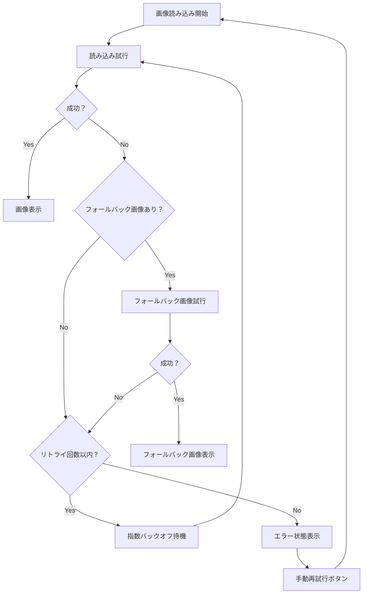

# 結果表示安定化システム

## 概要

結果画面（`/results`）の画像取得エラー処理と表示安定性を改善するために、以下のコンポーネントとユーティリティを実装しました。

## 実装コンポーネント

### 1. EnhancedImage (`src/components/common/EnhancedImage.tsx`)

**機能:**
- 画像読み込みエラーの自動処理
- フォールバック画像の対応
- 自動リトライ機能（指数バックオフ）
- ローディング状態の表示
- エラー状態での手動再試行

**使用例:**
```tsx
<EnhancedImage
  src="https://example.com/image.jpg"
  alt="生成画像"
  fallbackSrc="https://example.com/fallback.jpg"
  retryAttempts={3}
  onError={(error) => console.error('画像エラー:', error)}
/>
```

**主要プロパティ:**
- `retryAttempts`: 最大リトライ回数（デフォルト: 3）
- `fallbackSrc`: フォールバック画像URL
- `onError`: エラーコールバック
- `loadingComponent`: カスタムローディング表示

### 2. ResultsDisplay (`src/components/results/ResultsDisplay.tsx`)

**機能:**
- 統合された結果表示UI
- エラー状態の詳細表示
- ステータス表示とメタデータ
- グリッド/単ページ表示の切り替え
- 画像エラーハンドリング

**主要機能:**
- リアルタイムステータス更新
- エラー分類と解決提案
- 画像読み込み失敗の追跡
- ユーザーフレンドリーなエラー表示

### 3. useResultsData (`src/hooks/useResultsData.ts`)

**機能:**
- 複数ソースからのデータ取得
- フォールバック戦略
- 自動リトライ機能
- エラー分類とハンドリング
- 画像URL抽出と管理

**フォールバック戦略:**
1. ステータスURL経由でのデータ取得
2. セッションステータス → プロジェクト詳細
3. セッション詳細直接取得

### 4. API強化 (`src/lib/api-retry.ts`)

**機能:**
- 指数バックオフによるリトライ
- エラー分類システム
- 並列API呼び出し
- デバウンス機能

**エラータイプ:**
- `network`: ネットワークエラー
- `timeout`: タイムアウト
- `not_found`: リソース未発見
- `processing`: 処理中エラー
- `server_error`: サーバーエラー

## 画像エラー処理フロー



## エラー表示システム

### エラー分類

1. **ネットワークエラー**
   - 表示: 🌐 ネットワーク接続に問題があります
   - 再試行可能: Yes
   - 提案: 接続確認、時間をおいて再試行

2. **タイムアウトエラー**
   - 表示: ⏱️ リクエストがタイムアウトしました
   - 再試行可能: Yes
   - 提案: 時間をおいて再試行

3. **リソース未発見**
   - 表示: 🔍 結果が見つかりません
   - 再試行可能: No
   - 提案: URL確認、処理完了確認

4. **処理中エラー**
   - 表示: ⚙️ 処理がまだ完了していません
   - 再試行可能: Yes
   - 提案: 処理完了を待機

5. **サーバーエラー**
   - 表示: 🔧 サーバーエラーが発生しました
   - 再試行可能: Yes
   - 提案: 時間をおいて再試行、サポート連絡

## 使用方法

### 基本的な結果表示

```tsx
import { useResultsData } from '@/hooks/useResultsData';
import { ResultsDisplay } from '@/components/results/ResultsDisplay';

function ResultsPage() {
  const {
    statusData,
    mangaDetail,
    imageUrls,
    isLoading,
    error,
    retry,
    clearError,
    markImageFailed,
  } = useResultsData({
    sessionId: 'session-id',
    autoRetry: true,
    maxRetries: 3,
  });

  return (
    <ResultsDisplay
      statusData={statusData}
      mangaDetail={mangaDetail}
      imageUrls={imageUrls}
      isLoading={isLoading}
      error={error}
      onRetry={retry}
      onClearError={clearError}
      onImageError={markImageFailed}
    />
  );
}
```

### カスタム画像表示

```tsx
import { EnhancedImage } from '@/components/common/EnhancedImage';

function CustomImageDisplay() {
  return (
    <EnhancedImage
      src="https://example.com/manga-page.webp"
      alt="漫画ページ"
      width={800}
      height={1200}
      retryAttempts={2}
      fallbackSrc="https://example.com/placeholder.png"
      onError={(error) => {
        console.error('画像エラー:', error);
        // エラー処理
      }}
      loadingComponent={
        <div className="custom-loading">
          カスタムローディング表示
        </div>
      }
    />
  );
}
```

## パフォーマンス最適化

### 画像読み込み最適化
- 段階的品質読み込み（ProgressiveImage）
- 失敗画像の追跡と除外
- 優先度付き画像読み込み

### API呼び出し最適化
- 並列データ取得
- 指数バックオフリトライ
- デバウンス機能

### メモリ管理
- 失敗画像セットの管理
- 不要なリトライタイマーのクリーンアップ
- コンポーネントアンマウント時の処理停止

## テスト

### 単体テスト
- EnhancedImageコンポーネントのテスト
- エラーハンドリングのテスト
- リトライ機能のテスト

### 統合テスト
- 結果表示フローのテスト
- API呼び出しのテスト
- エラー状態のテスト

### E2Eテスト
- 画像読み込み失敗シナリオ
- ネットワークエラーシナリオ
- 自動リトライ動作

## 今後の改善点

1. **画像プリロード**
   - 次ページの画像事前読み込み
   - Service Worker活用

2. **オフライン対応**
   - キャッシュ戦略
   - オフライン状態検知

3. **パフォーマンス監視**
   - Core Web Vitals計測
   - エラー率監視

4. **アクセシビリティ強化**
   - スクリーンリーダー対応
   - キーボードナビゲーション

5. **ユーザー体験向上**
   - プログレッシブ画像読み込み
   - 予測的フェッチ